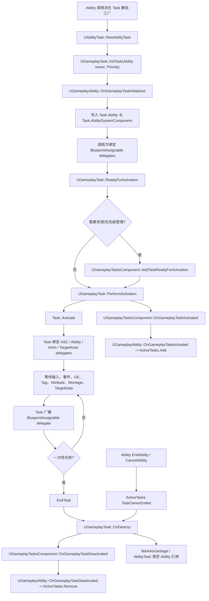
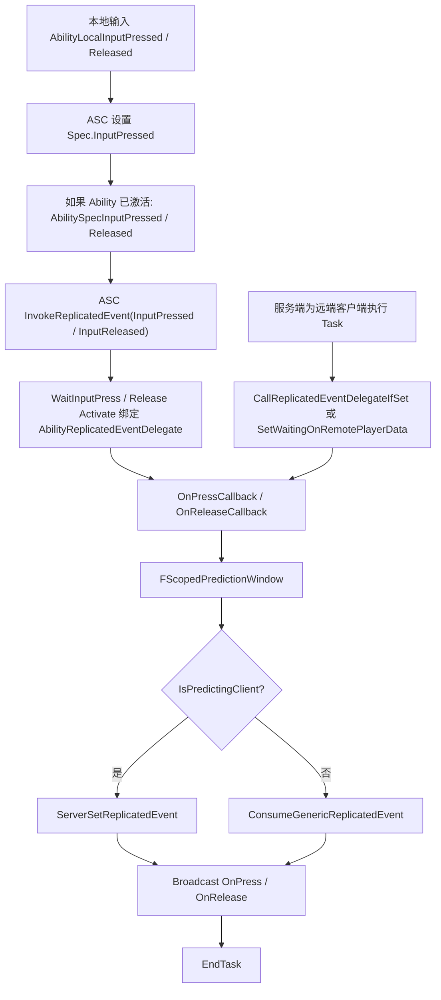
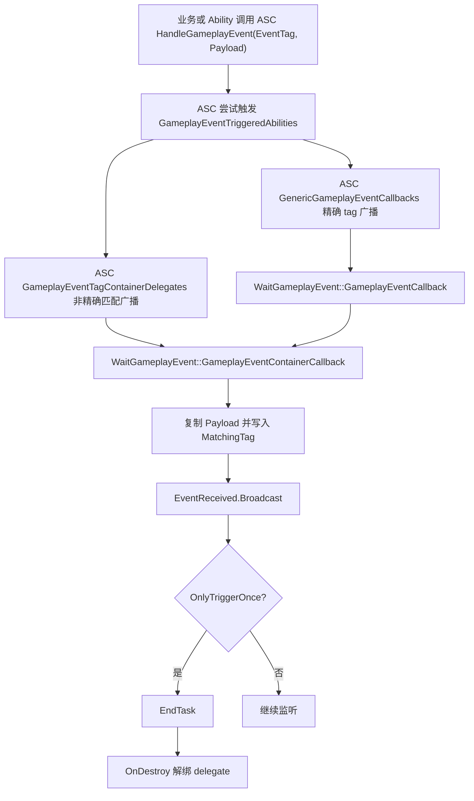

# AbilityTask / GameplayTask 异步流程（第六轮）

本专题衔接第三轮 `UGameplayAbility` 生命周期：Ability 激活后，异步等待输入、事件、蒙太奇、TargetData、GameplayEffect、GameplayTag、Attribute 等流程主要通过 `UAbilityTask` 承载。

## 一、类定位

- `UGameplayTask` 是 GameplayTasks 模块中的异步任务基类，继承 `UObject` 并实现 `IGameplayTaskOwnerInterface`；源码路径：`Engine/Source/Runtime/GameplayTasks/Classes/GameplayTask.h:145`。
- `UAbilityTask` 是 GameplayAbilities 对 `UGameplayTask` 的扩展，专门服务 Ability 执行期的 latent/asynchronous 操作，源码注释描述其模式是“启动某事并等待完成或中断”；源码路径：`Engine/Plugins/Runtime/GameplayAbilities/Source/GameplayAbilities/Public/Abilities/Tasks/AbilityTask.h:20`、`:90`。
- `UGameplayTasksComponent` 是 GameplayTasks 的 ActorComponent，维护 known/ticking/resource-consuming tasks；`UAbilitySystemComponent` 继承自它，因此 GAS 中 AbilityTask 的 GameplayTasksComponent 通常就是 ASC；源码路径：`Engine/Source/Runtime/GameplayTasks/Classes/GameplayTasksComponent.h:61`、`Engine/Plugins/Runtime/GameplayAbilities/Source/GameplayAbilities/Public/AbilitySystemComponent.h:109`。
- `UGameplayAbility` 继承 `UObject` 并实现 `IGameplayTaskOwnerInterface`，Ability 作为任务 owner，给 Task 提供 Owner/Avatar/TasksComponent，并维护 `ActiveTasks`；源码路径：`Engine/Plugins/Runtime/GameplayAbilities/Source/GameplayAbilities/Public/Abilities/GameplayAbility.h:110`、`:532`、`:820`。
- `UAbilityTask` 保存创建它的 `UGameplayAbility` 与 `UAbilitySystemComponent` 弱引用，Ability 初始化任务时写入这些指针；源码路径：`Engine/Plugins/Runtime/GameplayAbilities/Source/GameplayAbilities/Public/Abilities/Tasks/AbilityTask.h:104`、`:107`、`Engine/Plugins/Runtime/GameplayAbilities/Source/GameplayAbilities/Private/Abilities/GameplayAbility.cpp:1546`。
- AbilityTask 适合承载 Ability 异步流程，是因为基类已经提供任务激活、结束、owner 结束清理、delegate 广播前活跃性检查、prediction key 与 replicated event 辅助；源码路径：`Engine/Source/Runtime/GameplayTasks/Private/GameplayTask.cpp:58`、`:167`、`Engine/Plugins/Runtime/GameplayAbilities/Source/GameplayAbilities/Private/Abilities/Tasks/AbilityTask.cpp:182`、`:190`、`:217`。
- AbilityTask 不应该包含大量业务逻辑：源码定义它是 small/self-contained operation；“复杂战斗规则应留在 Ability/GE/项目系统，Task 只包装等待和回调”属于开发实践推断；源码路径：`Engine/Plugins/Runtime/GameplayAbilities/Source/GameplayAbilities/Public/Abilities/Tasks/AbilityTask.h:20`。
- AbilityTask 和普通 Blueprint latent node 的完整区别本轮未展开，未确认；源码只确认 AbilityTask 的蓝图体验由 `K2Node_LatentAbilityCall` 支持；源码路径：`Engine/Plugins/Runtime/GameplayAbilities/Source/GameplayAbilities/Public/Abilities/Tasks/AbilityTask.h:23`。

## 二、核心类型分析

| 类型 | 定义位置 | 核心职责 | 常见使用场景 | 是否通常业务层直接创建 | 关系与预测 |
|---|---|---|---|---|---|
| `UGameplayTask` | `Engine/Source/Runtime/GameplayTasks/Classes/GameplayTask.h:145` | 通用异步任务基类，提供 `ReadyForActivation`、`Activate`、`EndTask`、`TaskOwnerEnded`、资源/优先级接入。 | AI/GameplayTasks 通用任务，GAS 的 AbilityTask 基类。 | GAS 业务通常不直接用 `NewTask` 创建 AbilityTask，而用 `UAbilityTask::NewAbilityTask`；源码路径：`Engine/Plugins/Runtime/GameplayAbilities/Source/GameplayAbilities/Public/Abilities/Tasks/AbilityTask.h:153`。 | 基类只提供任务生命周期；网络支持通过 `bSimulatedTask`，并不等于所有任务自动预测；源码路径：`Engine/Source/Runtime/GameplayTasks/Classes/GameplayTask.h:231`。 |
| `UAbilityTask` | `Engine/Plugins/Runtime/GameplayAbilities/Source/GameplayAbilities/Public/Abilities/Tasks/AbilityTask.h:90` | Ability 专用异步任务，持有 Ability/ASC，封装 prediction、remote player data、avatar wait 状态。 | Ability 蓝图/C++ 中等待输入、事件、TargetData、Montage、GE/Tag/Attribute 等。 | 业务通过各派生类静态工厂函数创建，工厂内部用 `NewAbilityTask`；源码路径：`Engine/Plugins/Runtime/GameplayAbilities/Source/GameplayAbilities/Public/Abilities/Tasks/AbilityTask.h:130`。 | 提供 `IsPredictingClient`、`IsForRemoteClient`、`GetActivationPredictionKey`、`CallOrAddReplicatedDelegate`；源码路径：`Engine/Plugins/Runtime/GameplayAbilities/Source/GameplayAbilities/Private/Abilities/Tasks/AbilityTask.cpp:182`、`:202`、`:207`、`:217`。 |
| `UGameplayTasksComponent` | `Engine/Source/Runtime/GameplayTasks/Classes/GameplayTasksComponent.h:61` | 维护 task 队列、known tasks、ticking tasks、resource-consuming tasks 和 replicated simulated tasks。 | ASC 作为 GameplayTasksComponent 承载 AbilityTask。 | 通常由 Actor/ASC 组件拥有，不由 Ability 业务临时创建。 | 负责 `OnGameplayTaskActivated` / `OnGameplayTaskDeactivated`，再回调 task owner；源码路径：`Engine/Source/Runtime/GameplayTasks/Private/GameplayTasksComponent.cpp:80`、`:111`。 |
| `IGameplayTaskOwnerInterface` | `Engine/Source/Runtime/GameplayTasks/Classes/GameplayTaskOwnerInterface.h:20` | 任务 owner 协议，提供 TasksComponent、OwnerActor、AvatarActor、默认优先级、初始化/激活/结束通知。 | `UGameplayAbility` 和 `UGameplayTask` 自身实现该接口。 | 业务一般不直接实现，除非写通用 GameplayTask owner。 | `UGameplayAbility` 的实现把 TasksComponent 指向 ASC；源码路径：`Engine/Plugins/Runtime/GameplayAbilities/Source/GameplayAbilities/Private/Abilities/GameplayAbility.cpp:1522`。 |
| `FGameplayAbilityActorInfo` | `Engine/Plugins/Runtime/GameplayAbilities/Source/GameplayAbilities/Public/Abilities/GameplayAbilityTypes.h:138` | 缓存 OwnerActor、AvatarActor、PlayerController、ASC、AnimInstance 等 Ability 上下文。 | Task 获取本地控制、AnimInstance、ASC、TargetActor owner。 | 由 ASC/Ability 初始化维护，业务通常读取。 | `WaitTargetData`、`PlayMontageAndWait` 都从 Ability ActorInfo 获取 PC/AnimInstance；源码路径：`Engine/Plugins/Runtime/GameplayAbilities/Source/GameplayAbilities/Private/Abilities/Tasks/AbilityTask_WaitTargetData.cpp:140`、`Engine/Plugins/Runtime/GameplayAbilities/Source/GameplayAbilities/Private/Abilities/Tasks/AbilityTask_PlayMontageAndWait.cpp:139`。 |
| `FGameplayAbilityActivationInfo` | `Engine/Plugins/Runtime/GameplayAbilities/Source/GameplayAbilities/Public/GameplayAbilitySpec.h:113` | 描述一次激活的 authority/predicting/confirmed/rejected 状态，并保存激活时 prediction key。 | Task 获取 activation prediction key、等待 server confirm。 | 由 ASC 激活流程维护，业务通常读取。 | `GetActivationPredictionKey` 返回激活时 key，后续新 prediction key 不会更新这个字段；源码路径：`Engine/Plugins/Runtime/GameplayAbilities/Source/GameplayAbilities/Public/GameplayAbilitySpec.h:152`、`:158`。 |
| `FGameplayAbilitySpecHandle` | `Engine/Plugins/Runtime/GameplayAbilities/Source/GameplayAbilities/Public/GameplayAbilitySpecHandle.h:15` | 指向已授予 Ability Spec 的全局唯一 handle。 | Task replicated event / target data 用 handle + prediction key 索引缓存。 | 业务读取或传递，不手动构造运行时状态。 | ASC 的 replicated data cache 使用 `FGameplayAbilitySpecHandleAndPredictionKey` 做 key；源码路径：`Engine/Plugins/Runtime/GameplayAbilities/Source/GameplayAbilities/Public/Abilities/GameplayAbilityTypes.h:502`。 |
| `FScopedPredictionWindow` | `Engine/Plugins/Runtime/GameplayAbilities/Source/GameplayAbilities/Public/GameplayPrediction.h:479` | RAII prediction window；客户端可生成/携带 prediction key，服务端用传入 key 进入同一预测作用域。 | 输入释放、TargetData、NetworkSync、Confirm/Cancel 等跨帧响应。 | 业务自定义 Task 有预测需求时可谨慎使用。 | 源码预测说明专门以 `UAbilityTask_WaitInputRelease::OnReleaseCallback` 作为额外 prediction window 示例；源码路径：`Engine/Plugins/Runtime/GameplayAbilities/Source/GameplayAbilities/Public/GameplayPrediction.h:192`、`:203`。 |

## 三、AbilityTask 生命周期



简化伪代码：

```cpp
Task = SomeAbilityTask::Factory(Ability, Params);   // 工厂只设置输入参数
Task->Delegate.Add(...);                            // 调用方先绑定输出
Task->ReadyForActivation();                         // 进入 GameplayTask 生命周期

// UGameplayTask
ReadyForActivation()
{
    if (!TasksComponent) EndTask();
    else if (RequiresResources) TasksComponent->AddTaskReadyForActivation(*this);
    else PerformActivation();
}

PerformActivation()
{
    TaskState = Active;
    Activate();                                     // 派生类真正开始等待/绑定
    if (!IsFinished()) TasksComponent->OnGameplayTaskActivated(*this);
}

// Ability 结束时
EndAbility()
{
    for (Task in ActiveTasks)
    {
        Task->TaskOwnerEnded();
    }
    ActiveTasks.Reset();
}
```

关键源码标注：

1. `NewAbilityTask` 创建对象、调用 `InitTask(*ThisAbility, Priority)` 并设置 `InstanceName`；源码路径：`Engine/Plugins/Runtime/GameplayAbilities/Source/GameplayAbilities/Public/Abilities/Tasks/AbilityTask.h:130`、`:135`、`:139`。
2. `InitTask` 设置 TaskOwner/TaskState，调用 owner `OnGameplayTaskInitialized`，然后获取 `UGameplayTasksComponent`；源码路径：`Engine/Source/Runtime/GameplayTasks/Private/GameplayTask.cpp:77`。
3. `UGameplayAbility::OnGameplayTaskInitialized` 将 AbilityTask 的 ASC 和 Ability 指针写好；源码路径：`Engine/Plugins/Runtime/GameplayAbilities/Source/GameplayAbilities/Private/Abilities/GameplayAbility.cpp:1539`、`:1546`。
4. `ReadyForActivation` 会直接激活、进入 TasksComponent 队列，或在没有 TasksComponent 时 `EndTask`；源码路径：`Engine/Source/Runtime/GameplayTasks/Private/GameplayTask.cpp:58`。
5. `PerformActivation` 设置 TaskState 为 Active，调用派生 `Activate`，未立即结束时通知 TasksComponent activated；源码路径：`Engine/Source/Runtime/GameplayTasks/Private/GameplayTask.cpp:277`、`:287`、`:289`、`:296`。
6. `UGameplayAbility::OnGameplayTaskActivated` 把任务加入 `ActiveTasks`，`OnGameplayTaskDeactivated` 从 `ActiveTasks` 移除；源码路径：`Engine/Plugins/Runtime/GameplayAbilities/Source/GameplayAbilities/Private/Abilities/GameplayAbility.cpp:1551`、`:1556`、`:1559`、`:1564`。
7. `EndTask` 和 `TaskOwnerEnded` 都进入 `OnDestroy`，后者会触发 TasksComponent deactivated 并 `MarkAsGarbage`；源码路径：`Engine/Source/Runtime/GameplayTasks/Private/GameplayTask.cpp:146`、`:167`、`:208`、`:222`。
8. `UAbilityTask::OnDestroy` 会递减 task 计数、清空 Ability 引用，并调用 `Super::OnDestroy`；源码路径：`Engine/Plugins/Runtime/GameplayAbilities/Source/GameplayAbilities/Private/Abilities/Tasks/AbilityTask.cpp:113`。
9. `UGameplayAbility::EndAbility` 对 `ActiveTasks` 逆序调用 `TaskOwnerEnded` 并清空数组；源码路径：`Engine/Plugins/Runtime/GameplayAbilities/Source/GameplayAbilities/Private/Abilities/GameplayAbility.cpp:819`、`:824`、`:827`。

## 四、Ability 和 ActiveTasks 的关系

- `UGameplayAbility` 保存 `TArray<TObjectPtr<UGameplayTask>> ActiveTasks`，用于跟踪当前 Ability 实例中的活跃任务；源码路径：`Engine/Plugins/Runtime/GameplayAbilities/Source/GameplayAbilities/Public/Abilities/GameplayAbility.h:820`。
- Task 激活后由 `UGameplayAbility::OnGameplayTaskActivated` 加入 `ActiveTasks`，Task 结束/暂停/销毁后由 `OnGameplayTaskDeactivated` 移除；源码路径：`Engine/Plugins/Runtime/GameplayAbilities/Source/GameplayAbilities/Private/Abilities/GameplayAbility.cpp:1551`、`:1559`。
- Ability `EndAbility` 会通知所有 ActiveTasks owner 已结束；`CancelAbility` 默认调用 `EndAbility(..., bWasCancelled=true)`，因此取消也会走同一批 Task 清理；源码路径：`Engine/Plugins/Runtime/GameplayAbilities/Source/GameplayAbilities/Private/Abilities/GameplayAbility.cpp:734`、`:819`。
- `TaskOwnerEnded` 和 `EndTask` 都会调用 `OnDestroy`，区别是 owner 结束路径会标记 owner finished，并避免再次通知 owner deactivated；源码路径：`Engine/Source/Runtime/GameplayTasks/Private/GameplayTask.cpp:146`、`:167`、`Engine/Source/Runtime/GameplayTasks/Private/GameplayTasksComponent.cpp:153`。
- AbilityTask 未结束会保持在 `ActiveTasks` 或相关 delegate/timer 中，可能让 Ability/任务状态悬挂；这是基于 `ActiveTasks` 清理和 `OnDestroy` 解绑定要求的开发实践推断；源码路径：`Engine/Plugins/Runtime/GameplayAbilities/Source/GameplayAbilities/Public/Abilities/Tasks/AbilityTask.h:43`、`Engine/Plugins/Runtime/GameplayAbilities/Source/GameplayAbilities/Private/Abilities/GameplayAbility.cpp:819`。
- NonInstanced Ability 不适合依赖需要状态的 AbilityTask：源码注释说明 NonInstanced 在 CDO 上执行，不能有状态；AbilityTask 又依赖 per-activation owner/task state，这是开发实践推断；源码路径：`Engine/Plugins/Runtime/GameplayAbilities/Source/GameplayAbilities/Public/Abilities/GameplayAbilityTypes.h:36`、`:45`、`Engine/Plugins/Runtime/GameplayAbilities/Source/GameplayAbilities/Public/Abilities/GameplayAbility.h:820`。
- InstancedPerActor 可以保存 Ability 成员状态和 ActiveTasks；InstancedPerExecution 每次执行创建实例，但 ASC 输入路径对 InstancedPerExecution 有 warning：输入只可能作用于最新实例，因此持续等待后续输入事件不可靠；源码路径：`Engine/Plugins/Runtime/GameplayAbilities/Source/GameplayAbilities/Public/Abilities/GameplayAbilityTypes.h:48`、`:51`、`Engine/Plugins/Runtime/GameplayAbilities/Source/GameplayAbilities/Private/AbilitySystemComponent_Abilities.cpp:2799`、`:2835`。

## 五、常见 AbilityTask 分类

| 分类 | 类 | 职责与典型场景 | 源码路径 |
|---|---|---|---|
| 输入类 | `UAbilityTask_WaitInputPress` | 等待当前 Ability 输入按下，支持本地检测和 replicated input pressed event。 | `Engine/Plugins/Runtime/GameplayAbilities/Source/GameplayAbilities/Public/Abilities/Tasks/AbilityTask_WaitInputPress.h:18` |
| 输入类 | `UAbilityTask_WaitInputRelease` | 等待当前 Ability 输入释放，本地预测时将 release event 发送到服务端。 | `Engine/Plugins/Runtime/GameplayAbilities/Source/GameplayAbilities/Public/Abilities/Tasks/AbilityTask_WaitInputRelease.h:18` |
| 事件类 | `UAbilityTask_WaitGameplayEvent` | 监听 ASC gameplay event，可精确 tag 或 tag container 匹配，可只触发一次。 | `Engine/Plugins/Runtime/GameplayAbilities/Source/GameplayAbilities/Public/Abilities/Tasks/AbilityTask_WaitGameplayEvent.h:18` |
| GameplayTag 类 | `UAbilityTask_WaitGameplayTag` | Tag added/removed 基类，绑定 ASC `RegisterGameplayTagEvent`。 | `Engine/Plugins/Runtime/GameplayAbilities/Source/GameplayAbilities/Public/Abilities/Tasks/AbilityTask_WaitGameplayTagBase.h:15` |
| GameplayTag 类 | `UAbilityTask_WaitGameplayTagAdded` / `Removed` | 等 tag 从 0 到 1 或从非 0 到 0，可启动时立即检查当前状态。 | `Engine/Plugins/Runtime/GameplayAbilities/Source/GameplayAbilities/Public/Abilities/Tasks/AbilityTask_WaitGameplayTag.h:15`、`:35` |
| GameplayTag 类 | `UAbilityTask_WaitGameplayTagCountChanged` | 监听 tag count 任意变化。 | `Engine/Plugins/Runtime/GameplayAbilities/Source/GameplayAbilities/Public/Abilities/Tasks/AbilityTask_WaitGameplayTagCountChanged.h:13` |
| GameplayTag 类 | `UAbilityTask_WaitGameplayTagQuery` | 监听一组 tags 是否满足 `FGameplayTagQuery`。 | `Engine/Plugins/Runtime/GameplayAbilities/Source/GameplayAbilities/Public/Abilities/Tasks/AbilityTask_WaitGameplayTagQuery.h:22` |
| GameplayEffect 类 | `UAbilityTask_WaitGameplayEffectApplied` | GE applied 监听基类，过滤 target/source tags/query 后广播。 | `Engine/Plugins/Runtime/GameplayAbilities/Source/GameplayAbilities/Public/Abilities/Tasks/AbilityTask_WaitGameplayEffectApplied.h:16` |
| GameplayEffect 类 | `UAbilityTask_WaitGameplayEffectApplied_Self` / `Target` | 分别监听 self/target GE applied delegates，也可监听 periodic execute。 | `Engine/Plugins/Runtime/GameplayAbilities/Source/GameplayAbilities/Public/Abilities/Tasks/AbilityTask_WaitGameplayEffectApplied_Self.h:16`、`Engine/Plugins/Runtime/GameplayAbilities/Source/GameplayAbilities/Public/Abilities/Tasks/AbilityTask_WaitGameplayEffectApplied_Target.h:16` |
| GameplayEffect 类 | `UAbilityTask_WaitGameplayEffectRemoved` | 等指定 ActiveGE handle 被移除。 | `Engine/Plugins/Runtime/GameplayAbilities/Source/GameplayAbilities/Public/Abilities/Tasks/AbilityTask_WaitGameplayEffectRemoved.h:21` |
| GameplayEffect 类 | `UAbilityTask_WaitGameplayEffectStackChange` | 等指定 ActiveGE stack count 改变。 | `Engine/Plugins/Runtime/GameplayAbilities/Source/GameplayAbilities/Public/Abilities/Tasks/AbilityTask_WaitGameplayEffectStackChange.h:21` |
| GameplayEffect 类 | `UAbilityTask_WaitGameplayEffectBlockedImmunity` | 监听 GE 被 immunity 阻止，源码只在非 net-simulating ASC 上注册。 | `Engine/Plugins/Runtime/GameplayAbilities/Source/GameplayAbilities/Public/Abilities/Tasks/AbilityTask_WaitGameplayEffectBlockedImmunity.h:17`、`Engine/Plugins/Runtime/GameplayAbilities/Source/GameplayAbilities/Private/Abilities/Tasks/AbilityTask_WaitGameplayEffectBlockedImmunity.cpp:92` |
| 属性类 | `UAbilityTask_WaitAttributeChange` | 监听一个 Attribute change delegate，可按 source tag 和比较条件过滤。 | `Engine/Plugins/Runtime/GameplayAbilities/Source/GameplayAbilities/Public/Abilities/Tasks/AbilityTask_WaitAttributeChange.h:37` |
| 属性类 | `UAbilityTask_WaitAttributeChangeThreshold` | 监听单属性跨越阈值，启动时广播当前比较状态。 | `Engine/Plugins/Runtime/GameplayAbilities/Source/GameplayAbilities/Public/Abilities/Tasks/AbilityTask_WaitAttributeChangeThreshold.h:21` |
| 属性类 | `UAbilityTask_WaitAttributeChangeRatioThreshold` | 监听两个属性比值跨越阈值，适合 Health/MaxHealth 这类比例。 | `Engine/Plugins/Runtime/GameplayAbilities/Source/GameplayAbilities/Public/Abilities/Tasks/AbilityTask_WaitAttributeChangeRatioThreshold.h:22` |
| 动画类 | `UAbilityTask_PlayMontageAndWait` | 播放 ASC montage 并等待完成、blend out、中断、取消。 | `Engine/Plugins/Runtime/GameplayAbilities/Source/GameplayAbilities/Public/Abilities/Tasks/AbilityTask_PlayMontageAndWait.h:16` |
| 动画类 | `UAbilityTask_WaitMovementModeChange` | 等待 Character movement mode 改变。 | `Engine/Plugins/Runtime/GameplayAbilities/Source/GameplayAbilities/Public/Abilities/Tasks/AbilityTask_WaitMovementModeChange.h:18` |
| 动画类 | `UAbilityTask_WaitMontageNotify` | 本轮在 `Public/Abilities/Tasks` 与 `Private/Abilities/Tasks` 未找到该类名，未确认。 | `Engine/Plugins/Runtime/GameplayAbilities/Source/GameplayAbilities/Public/Abilities/Tasks` |
| TargetData 类 | `UAbilityTask_WaitTargetData` | 生成/使用 TargetActor，等待目标确认或取消，并处理客户端到服务端 TargetData 复制。 | `Engine/Plugins/Runtime/GameplayAbilities/Source/GameplayAbilities/Public/Abilities/Tasks/AbilityTask_WaitTargetData.h:24` |
| TargetData 类 | `UAbilityTask_VisualizeTargeting` | 生成/使用 TargetActor 做可视化，按持续时间结束。 | `Engine/Plugins/Runtime/GameplayAbilities/Source/GameplayAbilities/Public/Abilities/Tasks/AbilityTask_VisualizeTargeting.h:17` |
| Delay / Confirm / Cancel | `UAbilityTask_WaitDelay` | 用 TimerManager 延迟后广播并结束。 | `Engine/Plugins/Runtime/GameplayAbilities/Source/GameplayAbilities/Public/Abilities/Tasks/AbilityTask_WaitDelay.h:14` |
| Delay / Confirm / Cancel | `UAbilityTask_WaitConfirm` | 等服务端确认预测 Ability。 | `Engine/Plugins/Runtime/GameplayAbilities/Source/GameplayAbilities/Public/Abilities/Tasks/AbilityTask_WaitConfirm.h:12` |
| Delay / Confirm / Cancel | `UAbilityTask_WaitCancel` / `WaitConfirmCancel` | 等本地或 replicated generic confirm/cancel。 | `Engine/Plugins/Runtime/GameplayAbilities/Source/GameplayAbilities/Public/Abilities/Tasks/AbilityTask_WaitCancel.h:14`、`Engine/Plugins/Runtime/GameplayAbilities/Source/GameplayAbilities/Public/Abilities/Tasks/AbilityTask_WaitConfirmCancel.h:18` |
| RootMotion 类 | `UAbilityTask_ApplyRootMotion_Base` | RootMotion AbilityTask 基类。 | `Engine/Plugins/Runtime/GameplayAbilities/Source/GameplayAbilities/Public/Abilities/Tasks/AbilityTask_ApplyRootMotion_Base.h:18` |
| RootMotion 类 | `UAbilityTask_ApplyRootMotionConstantForce` / `JumpForce` / `MoveToForce` / `MoveToActorForce` / `RadialForce` | Ability 执行期应用不同形态的 root motion source。 | `Engine/Plugins/Runtime/GameplayAbilities/Source/GameplayAbilities/Public/Abilities/Tasks/AbilityTask_ApplyRootMotionConstantForce.h:24`、`Engine/Plugins/Runtime/GameplayAbilities/Source/GameplayAbilities/Public/Abilities/Tasks/AbilityTask_ApplyRootMotionJumpForce.h:25`、`Engine/Plugins/Runtime/GameplayAbilities/Source/GameplayAbilities/Public/Abilities/Tasks/AbilityTask_ApplyRootMotionMoveToForce.h:25`、`Engine/Plugins/Runtime/GameplayAbilities/Source/GameplayAbilities/Public/Abilities/Tasks/AbilityTask_ApplyRootMotionMoveToActorForce.h:39`、`Engine/Plugins/Runtime/GameplayAbilities/Source/GameplayAbilities/Public/Abilities/Tasks/AbilityTask_ApplyRootMotionRadialForce.h:25` |
| 预测/同步类 | `UAbilityTask_NetworkSyncPoint` | 在客户端/服务端之间创建 Ability 实例级同步点。 | `Engine/Plugins/Runtime/GameplayAbilities/Source/GameplayAbilities/Public/Abilities/Tasks/AbilityTask_NetworkSyncPoint.h:28` |

## 六、输入类 AbilityTask 调用链



- ASC 本地输入按下/释放会修改 `Spec.InputPressed`，Ability 已激活时调用 `AbilitySpecInputPressed/Released`，并 `InvokeReplicatedEvent`；源码路径：`Engine/Plugins/Runtime/GameplayAbilities/Source/GameplayAbilities/Private/AbilitySystemComponent_Abilities.cpp:2796`、`:2805`、`:2832`、`:2840`。
- `UAbilityTask_WaitInputPress::Activate` 记录开始时间，若 `bTestAlreadyPressed` 且本地 Spec 已按下则立即回调，否则绑定 `AbilityReplicatedEventDelegate(InputPressed)`；源码路径：`Engine/Plugins/Runtime/GameplayAbilities/Source/GameplayAbilities/Private/Abilities/Tasks/AbilityTask_WaitInputPress.cpp:55`。
- `UAbilityTask_WaitInputRelease::Activate` 同理等待 `InputReleased`，可在初始已释放时立即回调；源码路径：`Engine/Plugins/Runtime/GameplayAbilities/Source/GameplayAbilities/Private/Abilities/Tasks/AbilityTask_WaitInputRelease.cpp:55`。
- 输入回调会移除 replicated event delegate，创建 `FScopedPredictionWindow`，预测客户端调用 `ServerSetReplicatedEvent`，非预测路径消费 cached generic event，然后广播并 `EndTask`；源码路径：`Engine/Plugins/Runtime/GameplayAbilities/Source/GameplayAbilities/Private/Abilities/Tasks/AbilityTask_WaitInputPress.cpp:16`、`:33`、`:37`、`:45`、`Engine/Plugins/Runtime/GameplayAbilities/Source/GameplayAbilities/Private/Abilities/Tasks/AbilityTask_WaitInputRelease.cpp:16`、`:33`、`:37`、`:45`。
- 服务端为远端客户端运行时，Task 会尝试 `CallReplicatedEventDelegateIfSet`，没有收到则 `SetWaitingOnRemotePlayerData`；源码路径：`Engine/Plugins/Runtime/GameplayAbilities/Source/GameplayAbilities/Private/Abilities/Tasks/AbilityTask_WaitInputPress.cpp:72`、`Engine/Plugins/Runtime/GameplayAbilities/Source/GameplayAbilities/Private/Abilities/Tasks/AbilityTask_WaitInputRelease.cpp:72`。
- 预测文档明确 `WaitInputRelease::OnReleaseCallback` 是 Ability 内额外 prediction window 的示例；源码路径：`Engine/Plugins/Runtime/GameplayAbilities/Source/GameplayAbilities/Public/GameplayPrediction.h:192`、`:203`。

## 七、GameplayEvent 类 AbilityTask 调用链



- `WaitGameplayEvent` 工厂保存 EventTag、OptionalExternalTarget、OnlyTriggerOnce、OnlyMatchExact；源码路径：`Engine/Plugins/Runtime/GameplayAbilities/Source/GameplayAbilities/Private/Abilities/Tasks/AbilityTask_WaitGameplayEvent.cpp:15`。
- `Activate` 中精确匹配绑定 `ASC->GenericGameplayEventCallbacks.FindOrAdd(Tag)`，非精确匹配调用 `AddGameplayEventTagContainerDelegate`；源码路径：`Engine/Plugins/Runtime/GameplayAbilities/Source/GameplayAbilities/Private/Abilities/Tasks/AbilityTask_WaitGameplayEvent.cpp:29`。
- ASC `HandleGameplayEvent` 会先检查由 GameplayEvent tag 触发的 Ability，再广播精确 event callbacks 和 tag container delegates；源码路径：`Engine/Plugins/Runtime/GameplayAbilities/Source/GameplayAbilities/Private/AbilitySystemComponent_Abilities.cpp:2536`、`:2559`、`:2570`。
- Payload 通过 `const FGameplayEventData*` 传入；Task 广播前复制 Payload，并把匹配到的 tag 写入 `TempPayload.EventTag`；源码路径：`Engine/Plugins/Runtime/GameplayAbilities/Source/GameplayAbilities/Private/Abilities/Tasks/AbilityTask_WaitGameplayEvent.cpp:52`。
- `OnlyTriggerOnce` 为 true 时广播后 `EndTask`；`OnDestroy` 会按 exact/container 路径解绑；源码路径：`Engine/Plugins/Runtime/GameplayAbilities/Source/GameplayAbilities/Private/Abilities/Tasks/AbilityTask_WaitGameplayEvent.cpp:58`、`:79`。

## 八、Montage 类 AbilityTask 调用链

- `UAbilityTask_PlayMontageAndWait` 的工厂只保存 Montage、Rate、Section、`bStopWhenAbilityEnds`、RootMotionScale 等参数；源码路径：`Engine/Plugins/Runtime/GameplayAbilities/Source/GameplayAbilities/Private/Abilities/Tasks/AbilityTask_PlayMontageAndWait.cpp:111`。
- `Activate` 从 Ability ActorInfo 获取 AnimInstance，调用 `ASC->PlayMontage(Ability, CurrentActivationInfo, MontageToPlay, ...)`；源码路径：`Engine/Plugins/Runtime/GameplayAbilities/Source/GameplayAbilities/Private/Abilities/Tasks/AbilityTask_PlayMontageAndWait.cpp:129`、`:139`、`:144`。
- ASC `PlayMontageInternal` 调用 AnimInstance `Montage_Play`，更新 `LocalAnimMontageInfo`，设置 Ability 当前 Montage，并在需要记录/复制时更新 `RepAnimMontageInfo`；源码路径：`Engine/Plugins/Runtime/GameplayAbilities/Source/GameplayAbilities/Private/AbilitySystemComponent_Abilities.cpp:3011`、`:3020`、`:3048`、`:3086`。
- 非 authority 预测播放时，ASC 绑定 prediction key rejected delegate 到 `OnPredictiveMontageRejected`；源码路径：`Engine/Plugins/Runtime/GameplayAbilities/Source/GameplayAbilities/Private/AbilitySystemComponent_Abilities.cpp:3104`、`:3228`。
- Task 成功播放后绑定 Ability cancel delegate、Montage blended-in、blending-out、ended delegate，并在 authority 或 local predicted autonomous proxy 上设置 root motion scale；源码路径：`Engine/Plugins/Runtime/GameplayAbilities/Source/GameplayAbilities/Private/Abilities/Tasks/AbilityTask_PlayMontageAndWait.cpp:152`、`:154`、`:157`、`:160`、`:164`。
- `OnMontageBlendingOut` 中断时广播 `OnInterrupted`，否则广播 `OnBlendOut`；激进结束 cvar 开启时中断路径会 `EndTask`；源码路径：`Engine/Plugins/Runtime/GameplayAbilities/Source/GameplayAbilities/Private/Abilities/Tasks/AbilityTask_PlayMontageAndWait.cpp:18`、`:45`、`:54`。
- `OnMontageEnded` 非中断广播 `OnCompleted`，随后 `EndTask`；中断且允许 blend-out 后 interrupt 时可广播 `OnInterrupted`；源码路径：`Engine/Plugins/Runtime/GameplayAbilities/Source/GameplayAbilities/Private/Abilities/Tasks/AbilityTask_PlayMontageAndWait.cpp:91`。
- `ExternalCancel` 广播 `OnCancelled` 后走 `Super::ExternalCancel`；`OnDestroy` 移除 Ability cancel delegate，Ability 结束且 `bStopWhenAbilityEnds` 为 true 时调用 `StopPlayingMontage`；源码路径：`Engine/Plugins/Runtime/GameplayAbilities/Source/GameplayAbilities/Private/Abilities/Tasks/AbilityTask_PlayMontageAndWait.cpp:195`、`:204`、`:212`、`:215`。
- `StopPlayingMontage` 只在 ASC 当前 animating ability 和当前 montage 匹配时解绑 montage delegates 并调用 `ASC->CurrentMontageStop`；源码路径：`Engine/Plugins/Runtime/GameplayAbilities/Source/GameplayAbilities/Private/Abilities/Tasks/AbilityTask_PlayMontageAndWait.cpp:223`、`:247`、`:259`。
- Montage 复制主要通过 ASC 的 `RepAnimMontageInfo`、`OnRep_ReplicatedAnimMontage`、`CurrentMontageStop` 等路径；本轮只分析 GAS 侧，不展开动画系统；源码路径：`Engine/Plugins/Runtime/GameplayAbilities/Source/GameplayAbilities/Public/AbilitySystemComponent.h:1806`、`Engine/Plugins/Runtime/GameplayAbilities/Source/GameplayAbilities/Private/AbilitySystemComponent_Abilities.cpp:3250`、`:3458`。

## 九、TargetData 类 AbilityTask 调用链

- `WaitTargetData` 可以传入 TargetActor class 并通过 `BeginSpawningActor`/`FinishSpawningActor` 延迟生成，也可以用已有 TargetActor；源码路径：`Engine/Plugins/Runtime/GameplayAbilities/Source/GameplayAbilities/Public/Abilities/Tasks/AbilityTask_WaitTargetData.h:48`、`:52`、`:57`、`:60`。
- `ShouldSpawnTargetActor` 规则：TargetActor CDO replicated、本地控制、或 TargetActor 应在服务端生产 TargetData 时会生成；源码路径：`Engine/Plugins/Runtime/GameplayAbilities/Source/GameplayAbilities/Private/Abilities/Tasks/AbilityTask_WaitTargetData.cpp:120`。
- `InitializeTargetActor` 设置 `PrimaryPC`，并绑定 `TargetDataReadyDelegate` / `CanceledDelegate`；源码路径：`Engine/Plugins/Runtime/GameplayAbilities/Source/GameplayAbilities/Private/Abilities/Tasks/AbilityTask_WaitTargetData.cpp:137`、`:145`。
- `FinalizeTargetActor` 把 TargetActor push 到 ASC `SpawnedTargetActors`，调用 `StartTargeting`，并按确认模式 `ConfirmTargeting` 或 `BindToConfirmCancelInputs`；源码路径：`Engine/Plugins/Runtime/GameplayAbilities/Source/GameplayAbilities/Private/Abilities/Tasks/AbilityTask_WaitTargetData.cpp:149`、`:155`、`:158`、`:166`。
- 非本地控制端如果期待客户端发送 TargetData，会绑定 `AbilityTargetDataSetDelegate` 和 `AbilityTargetDataCancelledDelegate`，调用 `CallReplicatedTargetDataDelegatesIfSet`，并设置 `SetWaitingOnRemotePlayerData`；源码路径：`Engine/Plugins/Runtime/GameplayAbilities/Source/GameplayAbilities/Private/Abilities/Tasks/AbilityTask_WaitTargetData.cpp:179`、`:211`、`:214`、`:216`。
- 本地 TargetActor 产生数据后，Task 创建 `FScopedPredictionWindow`；预测客户端且 TargetActor 不在服务端生产数据时调用 `CallServerSetReplicatedTargetData`，否则在用户确认模式下发送 `GenericConfirm`；源码路径：`Engine/Plugins/Runtime/GameplayAbilities/Source/GameplayAbilities/Private/Abilities/Tasks/AbilityTask_WaitTargetData.cpp:272`、`:280`、`:288`、`:293`。
- 客户端取消时，预测客户端发送 `ServerSetReplicatedTargetDataCancelled` 或 `GenericCancel`，随后广播 `Cancelled` 并 `EndTask`；源码路径：`Engine/Plugins/Runtime/GameplayAbilities/Source/GameplayAbilities/Private/Abilities/Tasks/AbilityTask_WaitTargetData.cpp:309`、`:323`、`:328`、`:333`。
- 服务端收到 TargetData 后，ASC 将数据写入 `AbilityTargetDataMap` 并广播 `TargetSetDelegate`；取消则重置缓存并广播 `TargetCancelledDelegate`；源码路径：`Engine/Plugins/Runtime/GameplayAbilities/Source/GameplayAbilities/Private/AbilitySystemComponent_Abilities.cpp:3945`、`:3964`、`:3985`、`:3993`。
- `OnTargetDataReplicatedCallback` 会先 `ConsumeClientReplicatedTargetData`，再让 TargetActor `OnReplicatedTargetDataReceived` 校验/清洗；校验失败广播 `Cancelled`，否则广播 `ValidData`，非 `CustomMulti` 后结束；源码路径：`Engine/Plugins/Runtime/GameplayAbilities/Source/GameplayAbilities/Private/Abilities/Tasks/AbilityTask_WaitTargetData.cpp:222`、`:228`、`:242`、`:252`。
- `CallServerSetReplicatedTargetData` 可能进入 server RPC batch；如果 prediction key 无效会记录 warning；源码路径：`Engine/Plugins/Runtime/GameplayAbilities/Source/GameplayAbilities/Private/AbilitySystemComponent_Abilities.cpp:4217`、`:4237`。
- `VisualizeTargeting` 使用类似 TargetActor 生成流程，但只做可视化并可由 timer 到期广播 `TimeElapsed` 后 `EndTask`；源码路径：`Engine/Plugins/Runtime/GameplayAbilities/Source/GameplayAbilities/Private/Abilities/Tasks/AbilityTask_VisualizeTargeting.cpp:17`、`:111`、`:168`。

## 十、GameplayEffect / Attribute / GameplayTag 监听类 AbilityTask

- `WaitGameplayEffectApplied` 是对 ASC GE applied/periodic delegates 的封装，基类过滤 target actor、source/target tag requirements 和 tag queries，触发后可 `TriggerOnce` 结束；源码路径：`Engine/Plugins/Runtime/GameplayAbilities/Source/GameplayAbilities/Private/Abilities/Tasks/AbilityTask_WaitGameplayEffectApplied.cpp:16`、`:24`、`:68`。
- `WaitGameplayEffectApplied_Self` 绑定 `OnGameplayEffectAppliedDelegateToSelf`，可选绑定 `OnPeriodicGameplayEffectExecuteDelegateOnSelf`；源码路径：`Engine/Plugins/Runtime/GameplayAbilities/Source/GameplayAbilities/Private/Abilities/Tasks/AbilityTask_WaitGameplayEffectApplied_Self.cpp:47`、`:52`。
- `WaitGameplayEffectApplied_Target` 绑定 `OnGameplayEffectAppliedDelegateToTarget`，可选绑定 `OnPeriodicGameplayEffectExecuteDelegateOnTarget`；源码路径：`Engine/Plugins/Runtime/GameplayAbilities/Source/GameplayAbilities/Private/Abilities/Tasks/AbilityTask_WaitGameplayEffectApplied_Target.cpp:47`、`:52`。
- `WaitGameplayEffectRemoved` 通过 ActiveGE handle 找 owning ASC，再绑定 `OnGameplayEffectRemoved_InfoDelegate(Handle)`；如果 handle 无效或未注册成功，会广播 invalid/removed 并结束；源码路径：`Engine/Plugins/Runtime/GameplayAbilities/Source/GameplayAbilities/Private/Abilities/Tasks/AbilityTask_WaitGameplayEffectRemoved.cpp:24`、`:42`、`:53`。
- `WaitGameplayEffectStackChange` 通过 ActiveGE handle 绑定 `OnGameplayEffectStackChangeDelegate(Handle)`，广播后不自动结束，需 Ability 结束或调用方结束；源码路径：`Engine/Plugins/Runtime/GameplayAbilities/Source/GameplayAbilities/Private/Abilities/Tasks/AbilityTask_WaitGameplayEffectStackChange.cpp:23`、`:39`、`:63`。
- `WaitGameplayEffectBlockedImmunity` 绑定 ASC `OnImmunityBlockGameplayEffectDelegate`，源码明确只在 `ASC->IsNetSimulating() == false` 时注册，避免客户端误预测；源码路径：`Engine/Plugins/Runtime/GameplayAbilities/Source/GameplayAbilities/Private/Abilities/Tasks/AbilityTask_WaitGameplayEffectBlockedImmunity.cpp:92`、`:96`。
- `WaitGameplayTag` 基类绑定 ASC `RegisterGameplayTagEvent(Tag)` 并在 `OnDestroy` 解绑；Added/Removed 派生类根据 count 1/0 触发，可 `OnlyTriggerOnce` 自动结束；源码路径：`Engine/Plugins/Runtime/GameplayAbilities/Source/GameplayAbilities/Private/Abilities/Tasks/AbilityTask_WaitGameplayTagBase.cpp:17`、`:31`、`Engine/Plugins/Runtime/GameplayAbilities/Source/GameplayAbilities/Private/Abilities/Tasks/AbilityTask_WaitGameplayTag.cpp:45`、`:97`。
- `WaitGameplayTagCountChanged` 绑定 `RegisterGameplayTagEvent(Tag, EGameplayTagEventType::AnyCountChange)`，广播新 count；源码路径：`Engine/Plugins/Runtime/GameplayAbilities/Source/GameplayAbilities/Private/Abilities/Tasks/AbilityTask_WaitGameplayTagCountChanged.cpp:24`、`:31`、`:35`。
- `WaitAttributeChange` 绑定 `ASC->GetGameplayAttributeValueChangeDelegate(Attribute)`，可用 GE mod data 的 source tags 做过滤；源码路径：`Engine/Plugins/Runtime/GameplayAbilities/Source/GameplayAbilities/Private/Abilities/Tasks/AbilityTask_WaitAttributeChange.cpp:45`、`:53`。
- `WaitAttributeChangeThreshold` 启动时先读取 `ASC->GetNumericAttribute(Attribute)` 并广播当前比较状态，再监听 attribute delegate；源码路径：`Engine/Plugins/Runtime/GameplayAbilities/Source/GameplayAbilities/Private/Abilities/Tasks/AbilityTask_WaitAttributeChangeThreshold.cpp:30`、`:34`、`:43`。
- `WaitAttributeChangeRatioThreshold` 同时监听 numerator/denominator 两个 attribute delegates，并用短 timer 合并同帧/相邻更新后计算比值；源码路径：`Engine/Plugins/Runtime/GameplayAbilities/Source/GameplayAbilities/Private/Abilities/Tasks/AbilityTask_WaitAttributeChangeRatioThreshold.cpp:34`、`:48`、`:58`。
- 以上监听类大多是对 ASC delegate/ActiveGE delegate/Attribute delegate 的封装，不自己维护 GE/Attribute/Tag 状态；源码路径：`Engine/Plugins/Runtime/GameplayAbilities/Source/GameplayAbilities/Public/AbilitySystemComponent.h:513`、`:522`、`:528`、`:534`、`:744`。

## 十一、AbilityTask 和网络预测

- AbilityTask 不天然让所有逻辑自动预测；基类只是提供 `IsPredictingClient`、`IsForRemoteClient`、`GetActivationPredictionKey` 和 replicated delegate 辅助，具体派生 Task 自己决定是否创建 prediction window、发送 RPC 或等待 replicated data；源码路径：`Engine/Plugins/Runtime/GameplayAbilities/Source/GameplayAbilities/Private/Abilities/Tasks/AbilityTask.cpp:182`、`:202`、`:207`、`:217`。
- 预测文档说明 Ability 初始 prediction key 的有效窗口主要是 `ActivateAbility` 初始调用栈；latent/timer 跨帧后需要新的 prediction window；源码路径：`Engine/Plugins/Runtime/GameplayAbilities/Source/GameplayAbilities/Public/GameplayPrediction.h:72`、`:192`。
- 输入类 Task 明确使用 `FScopedPredictionWindow` 和 `ServerSetReplicatedEvent(InputPressed/InputReleased)`；源码路径：`Engine/Plugins/Runtime/GameplayAbilities/Source/GameplayAbilities/Private/Abilities/Tasks/AbilityTask_WaitInputPress.cpp:29`、`:33`、`Engine/Plugins/Runtime/GameplayAbilities/Source/GameplayAbilities/Private/Abilities/Tasks/AbilityTask_WaitInputRelease.cpp:29`、`:33`。
- TargetData Task 明确使用 `FScopedPredictionWindow`、`CallServerSetReplicatedTargetData`、`ServerSetReplicatedTargetDataCancelled` 与 ASC target data cache；源码路径：`Engine/Plugins/Runtime/GameplayAbilities/Source/GameplayAbilities/Private/Abilities/Tasks/AbilityTask_WaitTargetData.cpp:280`、`:288`、`:323`、`Engine/Plugins/Runtime/GameplayAbilities/Source/GameplayAbilities/Private/AbilitySystemComponent_Abilities.cpp:3945`。
- Montage Task 走 ASC `PlayMontage`，ASC 在非 authority 预测播放时把 prediction key rejected delegate 绑定到 `OnPredictiveMontageRejected`；源码路径：`Engine/Plugins/Runtime/GameplayAbilities/Source/GameplayAbilities/Private/AbilitySystemComponent_Abilities.cpp:3104`。
- `NetworkSyncPoint` 使用 `GenericSignalFromClient` / `GenericSignalFromServer` replicated events，按 `BothWait`、`OnlyServerWait`、`OnlyClientWait` 决定哪边等待；源码路径：`Engine/Plugins/Runtime/GameplayAbilities/Source/GameplayAbilities/Public/Abilities/Tasks/AbilityTask_NetworkSyncPoint.h:12`、`Engine/Plugins/Runtime/GameplayAbilities/Source/GameplayAbilities/Private/Abilities/Tasks/AbilityTask_NetworkSyncPoint.cpp:25`。
- Ability 远端实例结束或 Avatar 销毁时，如果有 task 正在等 remote player data / avatar，Ability 会 force cancel 以避免卡住；源码路径：`Engine/Plugins/Runtime/GameplayAbilities/Source/GameplayAbilities/Private/Abilities/GameplayAbility.cpp:2225`、`:2254`。
- 预测失败后的所有 Task delegate 是否会重复广播、如何与自定义 Task 回滚交互，本轮只确认部分入口，完整回滚未展开，未确认；源码路径：`Engine/Plugins/Runtime/GameplayAbilities/Source/GameplayAbilities/Public/GameplayPrediction.h:81`、`:236`。

## 十二、自定义 AbilityTask 开发速查

- 自定义 AbilityTask 应继承 `UAbilityTask`，因为 AbilityTask 基类持有 Ability/ASC、封装 prediction helper，并禁止使用 `UGameplayTask::NewTask`；源码路径：`Engine/Plugins/Runtime/GameplayAbilities/Source/GameplayAbilities/Public/Abilities/Tasks/AbilityTask.h:90`、`:153`。
- 静态工厂函数应该只 `NewAbilityTask` 并保存输入参数，不应启动逻辑或广播 delegate；源码注释明确工厂定义输入且不应 invoke callback delegates；源码路径：`Engine/Plugins/Runtime/GameplayAbilities/Source/GameplayAbilities/Public/Abilities/Tasks/AbilityTask.h:28`、`:130`。
- 调用方绑定输出 delegate 后应调用 `ReadyForActivation`，该函数才会进入 GameplayTask 激活流程；源码路径：`Engine/Source/Runtime/GameplayTasks/Classes/GameplayTask.h:157`、`Engine/Source/Runtime/GameplayTasks/Private/GameplayTask.cpp:58`。
- 真正开始等待、绑定外部 delegate、启动 timer、发送 RPC 等应放在 `Activate`；源码注释明确“Do not start the task in your static factory function”；源码路径：`Engine/Plugins/Runtime/GameplayAbilities/Source/GameplayAbilities/Public/Abilities/Tasks/AbilityTask.h:35`、`:44`。
- 广播前应调用 `ShouldBroadcastAbilityTaskDelegates`，它会确认 Ability 仍 active；源码路径：`Engine/Plugins/Runtime/GameplayAbilities/Source/GameplayAbilities/Private/Abilities/Tasks/AbilityTask.cpp:190`。
- 一次性任务广播后应调用 `EndTask`；持续监听任务需要明确由 `OnlyTriggerOnce`、外部结束或 Ability End 清理；`EndTask` 会走 `OnDestroy`；源码路径：`Engine/Source/Runtime/GameplayTasks/Private/GameplayTask.cpp:167`。
- `OnDestroy` 中应解绑自己注册过的 callbacks/timers/TargetActor 等，并最后调用 `Super::OnDestroy`；源码注释与多个 Task 实现都确认这一点；源码路径：`Engine/Source/Runtime/GameplayTasks/Classes/GameplayTask.h:291`、`Engine/Plugins/Runtime/GameplayAbilities/Source/GameplayAbilities/Public/Abilities/Tasks/AbilityTask.h:43`。
- Blueprint 输出应声明 dynamic multicast `BlueprintAssignable` delegate；源码注释和内置 Task 都按此模式实现；源码路径：`Engine/Plugins/Runtime/GameplayAbilities/Source/GameplayAbilities/Public/Abilities/Tasks/AbilityTask.h:28`、`Engine/Plugins/Runtime/GameplayAbilities/Source/GameplayAbilities/Public/Abilities/Tasks/AbilityTask_WaitInputPress.h:20`。
- 通常不要自己长期保存裸 Actor/ASC 指针；内置 AbilityTask 用 `TWeakObjectPtr<UAbilitySystemComponent>`，TargetActor/Anim delegate 在 `OnDestroy` 中清理；源码路径：`Engine/Plugins/Runtime/GameplayAbilities/Source/GameplayAbilities/Public/Abilities/Tasks/AbilityTask.h:107`、`Engine/Plugins/Runtime/GameplayAbilities/Source/GameplayAbilities/Private/Abilities/Tasks/AbilityTask_WaitTargetData.cpp:358`、`Engine/Plugins/Runtime/GameplayAbilities/Source/GameplayAbilities/Private/Abilities/Tasks/AbilityTask_PlayMontageAndWait.cpp:204`。
- 网络预测相关逻辑只在明确需要时使用 `FScopedPredictionWindow`、generic replicated events、target data replicated delegates；错误 prediction key 会导致服务器收不到或 warning，这是开发实践推断；源码路径：`Engine/Plugins/Runtime/GameplayAbilities/Source/GameplayAbilities/Private/AbilitySystemComponent_Abilities.cpp:4217`、`:4237`。
- 不适合放进 AbilityTask 的逻辑：长期角色状态、复杂伤害/死亡结算、GE 配置规则、UI 状态机等；这是基于源码“small/self-contained operation”的开发实践推断；源码路径：`Engine/Plugins/Runtime/GameplayAbilities/Source/GameplayAbilities/Public/Abilities/Tasks/AbilityTask.h:20`。

## 十三、本轮未确认项

- `UAbilityTask_WaitMontageNotify` 在 UE5.6 当前 `Public/Abilities/Tasks` 与 `Private/Abilities/Tasks` 目录未找到，未确认。
- AbilityTask 与普通 Blueprint latent node 的完整差异未展开，源码只确认 `K2Node_LatentAbilityCall` 支持 AbilityTask 蓝图体验，未确认。
- 自定义 AbilityTask 在预测失败后如何完全回滚所有自定义副作用，本轮未完整展开，未确认。
- RootMotion AbilityTask 的移动系统细节、CharacterMovement 接入和网络校正未展开，未确认。
- GameplayCue 专用异步流程本轮不展开，未确认。
