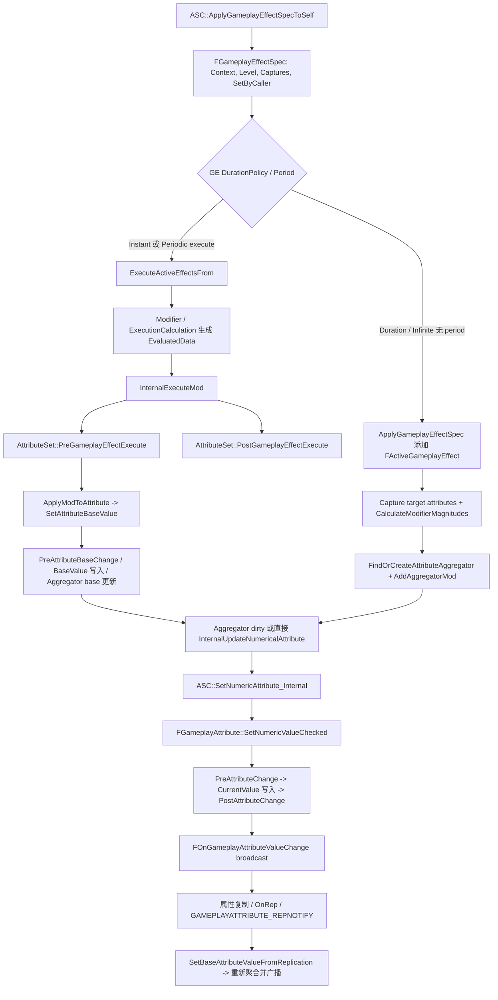

# AttributeSet 体系（第五轮）

本轮衔接第四轮 GameplayEffect 文档，聚焦 `UAttributeSet`、`FGameplayAttributeData`、`FGameplayAttribute`，以及 GameplayEffect 修改 Attribute 后如何进入 AttributeSet 回调、ASC delegate 与复制路径。

## 一、类定位

- `UAttributeSet` 是 GAS 中定义 gameplay attributes 的 `UObject` 子类，源码注释要求项目继承它并添加 `FGameplayAttributeData` 属性来表示 health、damage 等属性；源码路径：`Engine/Plugins/Runtime/GameplayAbilities/Source/GameplayAbilities/Public/AttributeSet.h:176`、`Engine/Plugins/Runtime/GameplayAbilities/Source/GameplayAbilities/Public/AttributeSet.h:183`。
- `UAttributeSet` 被设计为 Actor 的 subobject，并注册到 `UAbilitySystemComponent`；源码路径：`Engine/Plugins/Runtime/GameplayAbilities/Source/GameplayAbilities/Public/AttributeSet.h:179`、`Engine/Plugins/Runtime/GameplayAbilities/Source/GameplayAbilities/Private/AbilitySystemComponent.cpp:111`。
- `FGameplayAttributeData` 是放在 AttributeSet 中的属性值结构，源码明确建议优先用它而不是裸 `float`；它保存 `BaseValue` 与 `CurrentValue`；源码路径：`Engine/Plugins/Runtime/GameplayAbilities/Source/GameplayAbilities/Public/AttributeSet.h:19`、`Engine/Plugins/Runtime/GameplayAbilities/Source/GameplayAbilities/Public/AttributeSet.h:34`、`Engine/Plugins/Runtime/GameplayAbilities/Source/GameplayAbilities/Public/AttributeSet.h:40`。
- `FGameplayAttribute` 是指向 AttributeSet 内 `FGameplayAttributeData` 或 `float` 属性的描述/句柄，供 GE modifier、ASC 查询、编辑器 UI 与 helper 函数使用；源码路径：`Engine/Plugins/Runtime/GameplayAbilities/Source/GameplayAbilities/Public/AttributeSet.h:57`、`Engine/Plugins/Runtime/GameplayAbilities/Source/GameplayAbilities/Private/AttributeSet.cpp:355`。
- AttributeSet 与 ASC 的关系：ASC 通过 `SpawnedAttributes` 管理 AttributeSet 列表，提供 `GetSet`、`AddAttributeSetSubobject`、`InitStats`、`GetNumericAttribute`、`SetNumericAttributeBase` 等入口；源码路径：`Engine/Plugins/Runtime/GameplayAbilities/Source/GameplayAbilities/Public/AbilitySystemComponent.h:128`、`Engine/Plugins/Runtime/GameplayAbilities/Source/GameplayAbilities/Public/AbilitySystemComponent.h:152`、`Engine/Plugins/Runtime/GameplayAbilities/Source/GameplayAbilities/Public/AbilitySystemComponent.h:1957`。
- AttributeSet 与 GameplayEffect 的关系：GameplayEffect 的 Modifier/ExecutionCalculation 最终以 `FGameplayAttribute` 定位属性；Instant/periodic execute 路径通过 `InternalExecuteMod` 调用 AttributeSet 的 `PreGameplayEffectExecute`、修改 base value、再调用 `PostGameplayEffectExecute`；源码路径：`Engine/Plugins/Runtime/GameplayAbilities/Source/GameplayAbilities/Public/GameplayEffect.h:542`、`Engine/Plugins/Runtime/GameplayAbilities/Source/GameplayAbilities/Private/GameplayEffect.cpp:3907`。
- AttributeSet 与 Ability 的直接耦合较弱：`UGameplayAbility` 通常通过 Cost/Cooldown GE 或业务 GE 间接修改属性，GE Context 可记录 Ability CDO/实例信息；源码路径：`Engine/Plugins/Runtime/GameplayAbilities/Source/GameplayAbilities/Private/Abilities/GameplayAbility.cpp:651`、`Engine/Plugins/Runtime/GameplayAbilities/Source/GameplayAbilities/Private/GameplayEffectTypes.cpp:190`。
- AttributeSet 不应作为主动修改属性的主要入口。源码中的 setter 宏会转回 ASC `SetNumericAttributeBase`，GE 修改也走 ASC/ActiveGE 容器；源码路径：`Engine/Plugins/Runtime/GameplayAbilities/Source/GameplayAbilities/Public/AttributeSet.h:443`、`Engine/Plugins/Runtime/GameplayAbilities/Source/GameplayAbilities/Private/AbilitySystemComponent.cpp:386`、`Engine/Plugins/Runtime/GameplayAbilities/Source/GameplayAbilities/Private/GameplayEffect.cpp:3973`。
- AttributeSet 是否应该承载大量业务逻辑：开发实践推断，不建议。源码明确 `PreAttributeChange` 适合 clamp，不适合触发 damage 额外事件；`PreAttributeBaseChange` 也不应触发 gameplay callbacks；源码路径：`Engine/Plugins/Runtime/GameplayAbilities/Source/GameplayAbilities/Public/AttributeSet.h:211`、`Engine/Plugins/Runtime/GameplayAbilities/Source/GameplayAbilities/Public/AttributeSet.h:225`。
- AttributeSet 在 GAS 中更接近“属性承载层”；属性计算层主要由 GameplayEffect modifier、ExecutionCalculation、Attribute Capture 与 Aggregator 组成。该分层命名是开发实践推断，源码依据是 AttributeSet 定义属性与回调，而 `FAggregator` 负责 base/current 聚合计算；源码路径：`Engine/Plugins/Runtime/GameplayAbilities/Source/GameplayAbilities/Public/AttributeSet.h:176`、`Engine/Plugins/Runtime/GameplayAbilities/Source/GameplayAbilities/Public/GameplayEffectAggregator.h:282`。

## 二、核心类型分析

| 类型 | 定义位置 | 核心职责 | 是否会复制 | 是否通常由业务层直接创建 | 和 ASC / GE / Ability 的关系 |
|---|---|---|---|---|---|
| `UAttributeSet` | `Engine/Plugins/Runtime/GameplayAbilities/Source/GameplayAbilities/Public/AttributeSet.h:183` | 承载属性定义与属性修改回调。 | 对象支持网络复制，且可作为 ASC subobject 被复制；具体属性还要单独复制；源码路径：`Engine/Plugins/Runtime/GameplayAbilities/Source/GameplayAbilities/Private/AttributeSet.cpp:350`、`Engine/Plugins/Runtime/GameplayAbilities/Source/GameplayAbilities/Private/AbilitySystemComponent.cpp:1710`。 | 常作为 Actor/ASC 的默认子对象或由 ASC `GetOrCreateAttributeSubobject` 创建；源码路径：`Engine/Plugins/Runtime/GameplayAbilities/Source/GameplayAbilities/Private/AbilitySystemComponent.cpp:102`。 | ASC 管理它；GE 用 `FGameplayAttribute` 定位其中属性；Ability 通常通过 GE 间接影响它。 |
| `FGameplayAttributeData` | `Engine/Plugins/Runtime/GameplayAbilities/Source/GameplayAbilities/Public/AttributeSet.h:21` | 保存 `BaseValue` 和 `CurrentValue`。 | 本身是 `USTRUCT`；是否复制取决于包含它的 `UPROPERTY` 复制声明，源码未显示它自带 NetSerialize；源码路径：`Engine/Plugins/Runtime/GameplayAbilities/Source/GameplayAbilities/Public/AttributeSet.h:48`。 | 常作为 AttributeSet 成员声明，不通常临时构造；例外是复制回调 helper 包装旧值/新值；源码路径：`Engine/Plugins/Runtime/GameplayAbilities/Source/GameplayAbilities/Public/AbilitySystemComponent.h:812`。 | ASC/GE 会通过 `SetNumericAttributeBase`、aggregator、复制回调更新 base/current。 |
| `FGameplayAttribute` | `Engine/Plugins/Runtime/GameplayAbilities/Source/GameplayAbilities/Public/AttributeSet.h:59` | 描述 AttributeSet 内某个属性，提供 property 访问、当前值读取/写入 helper。 | 可作为普通 USTRUCT 成员使用；本轮未确认它本身作为网络值复制的项目实践。 | 常通过宏 `GetHealthAttribute()` 或 GE 配置引用，不手写大量构造；源码路径：`Engine/Plugins/Runtime/GameplayAbilities/Source/GameplayAbilities/Public/AttributeSet.h:430`。 | GE modifier、ASC 查询/设置、Attribute change delegate 都以它作为 key。 |
| `FGameplayAttributeValueChange` | 未确认 | 请求项名称。源码中未找到该类型名；实际确认的是 `FOnAttributeChangeData` 与 `FOnGameplayAttributeValueChange`。 | 未确认。 | 未确认。 | 使用源码实际类型；源码路径：`Engine/Plugins/Runtime/GameplayAbilities/Source/GameplayAbilities/Public/GameplayEffectTypes.h:1002`、`Engine/Plugins/Runtime/GameplayAbilities/Source/GameplayAbilities/Public/GameplayEffectTypes.h:1017`。 |
| `FOnAttributeChangeData` | `Engine/Plugins/Runtime/GameplayAbilities/Source/GameplayAbilities/Public/GameplayEffectTypes.h:1002` | Attribute 变化 delegate 的参数，包含属性、新旧值、可选 GE callback data。 | 临时回调参数，不复制。 | 不通常由业务层手动创建，ASC/ActiveGE 容器广播时构造；源码路径：`Engine/Plugins/Runtime/GameplayAbilities/Source/GameplayAbilities/Private/GameplayEffect.cpp:3790`。 | UI/外部系统监听 ASC delegate 时会收到它。 |
| `FGameplayEffectModCallbackData` | `Engine/Plugins/Runtime/GameplayAbilities/Source/GameplayAbilities/Public/GameplayEffectExtension.h:17` | GE modifier execute 回调数据，包含 `EffectSpec`、`EvaluatedData` 与目标 ASC。 | 运行时栈上回调数据，不复制。 | 不通常由业务层构造；`InternalExecuteMod` 构造后传给 AttributeSet；源码路径：`Engine/Plugins/Runtime/GameplayAbilities/Source/GameplayAbilities/Private/GameplayEffect.cpp:3922`。 | `PreGameplayEffectExecute` / `PostGameplayEffectExecute` 的主要上下文。 |
| `FOnGameplayAttributeValueChange` | `Engine/Plugins/Runtime/GameplayAbilities/Source/GameplayAbilities/Public/GameplayEffectTypes.h:1017` | 属性变化 multicast delegate。 | delegate 不复制。 | 业务层通常通过 ASC 获取引用并绑定；源码路径：`Engine/Plugins/Runtime/GameplayAbilities/Source/GameplayAbilities/Public/AbilitySystemComponent.h:534`。 | UI、Character 或其他系统监听属性变化的主要入口。 |
| `FAttributeMetaData` | `Engine/Plugins/Runtime/GameplayAbilities/Source/GameplayAbilities/Public/AttributeSet.h:271` | DataTable 初始化元数据，保存 BaseValue/Min/Max 等；源码标注仍是 work in progress。 | DataTable 行，不是运行时复制状态。 | 可在数据表中使用；本轮不展开项目数据流。 | ASC `InitStats` 会调用 AttributeSet `InitFromMetaDataTable` 读取它；源码路径：`Engine/Plugins/Runtime/GameplayAbilities/Source/GameplayAbilities/Private/AbilitySystemComponent.cpp:83`、`Engine/Plugins/Runtime/GameplayAbilities/Source/GameplayAbilities/Private/AttributeSet.cpp:383`。 |

## 三、ASC 如何管理 AttributeSet

| 接口/成员 | 源码位置 | 作用 | 业务层使用建议 |
|---|---|---|---|
| `SpawnedAttributes` | `Engine/Plugins/Runtime/GameplayAbilities/Source/GameplayAbilities/Public/AbilitySystemComponent.h:1957` | ASC 内部保存 AttributeSet subobject 列表，属性本身 `ReplicatedUsing=OnRep_SpawnedAttributes`。 | 不建议直接改数组；使用 Add/Remove 系列。 |
| `GetSet<T>` | `Engine/Plugins/Runtime/GameplayAbilities/Source/GameplayAbilities/Public/AbilitySystemComponent.h:128` | 按类型查找已存在 AttributeSet。 | 业务层常用于只读获取。 |
| `GetAttributeSet` | `Engine/Plugins/Runtime/GameplayAbilities/Source/GameplayAbilities/Public/AbilitySystemComponent.h:184`、`Engine/Plugins/Runtime/GameplayAbilities/Source/GameplayAbilities/Private/AbilitySystemComponent.cpp:159` | 蓝图/运行时按类获取 AttributeSet。 | 常用查询接口。 |
| `HasAttributeSetForAttribute` | `Engine/Plugins/Runtime/GameplayAbilities/Source/GameplayAbilities/Public/AbilitySystemComponent.h:165`、`Engine/Plugins/Runtime/GameplayAbilities/Source/GameplayAbilities/Private/AbilitySystemComponent.cpp:141` | 判断 ASC 是否拥有某个 attribute 所在的 AttributeSet。 | 可用于防御性检查。 |
| `InitStats` | `Engine/Plugins/Runtime/GameplayAbilities/Source/GameplayAbilities/Public/AbilitySystemComponent.h:166`、`Engine/Plugins/Runtime/GameplayAbilities/Source/GameplayAbilities/Private/AbilitySystemComponent.cpp:83` | 获取或创建 AttributeSet，并从 DataTable 初始化属性。 | 源码注释写明“不太受支持”，GameplayEffect + curve table 可能更好；业务层谨慎使用。 |
| `AddAttributeSetSubobject` | `Engine/Plugins/Runtime/GameplayAbilities/Source/GameplayAbilities/Public/AbilitySystemComponent.h:152` | 手动把 ASC 的 AttributeSet subobject 加入管理，内部调用 `AddSpawnedAttribute`。 | 当项目自己创建 subobject 时可用。 |
| `AddSpawnedAttribute` | `Engine/Plugins/Runtime/GameplayAbilities/Source/GameplayAbilities/Public/AbilitySystemComponent.h:209`、`Engine/Plugins/Runtime/GameplayAbilities/Source/GameplayAbilities/Private/AbilitySystemComponent.cpp:3005` | 加入 `SpawnedAttributes`；如果 registered subobject list 可用且 ready，会调用 `AddReplicatedSubObject` 并标记 dirty。 | 业务层通常通过更高层 wrapper 调用；需要保证对象有效且 outer/生命周期正确。 |
| `RemoveSpawnedAttribute` | `Engine/Plugins/Runtime/GameplayAbilities/Source/GameplayAbilities/Public/AbilitySystemComponent.h:212`、`Engine/Plugins/Runtime/GameplayAbilities/Source/GameplayAbilities/Private/AbilitySystemComponent.cpp:3024` | 从列表移除，移除 replicated subobject，并清理该 set 属性的 aggregators。 | 运行时移除要非常谨慎，可能影响 active GE aggregator。 |
| `RemoveAllSpawnedAttributes` | `Engine/Plugins/Runtime/GameplayAbilities/Source/GameplayAbilities/Public/AbilitySystemComponent.h:215`、`Engine/Plugins/Runtime/GameplayAbilities/Source/GameplayAbilities/Private/AbilitySystemComponent.cpp:3045` | 移除全部 AttributeSet，并标记列表 dirty。 | 不建议业务层随意调用。 |
| `OnRep_SpawnedAttributes` | `Engine/Plugins/Runtime/GameplayAbilities/Source/GameplayAbilities/Public/AbilitySystemComponent.h:1961`、`Engine/Plugins/Runtime/GameplayAbilities/Source/GameplayAbilities/Private/AbilitySystemComponent.cpp:3075` | 客户端同步 AttributeSet 列表变化，处理 replicated subobject 注册，并在移除/替换时清理或保留 aggregator。 | 内部复制回调，不由业务层调用。 |
| `ReplicateSubobjects` | `Engine/Plugins/Runtime/GameplayAbilities/Source/GameplayAbilities/Public/AbilitySystemComponent.h:1668`、`Engine/Plugins/Runtime/GameplayAbilities/Source/GameplayAbilities/Private/AbilitySystemComponent.cpp:1710` | 遍历 `SpawnedAttributes`，对有效 AttributeSet 调用 `Channel->ReplicateSubobject`。 | 说明 AttributeSet 对象复制依赖 ASC。 |

AttributeSet 通常作为 ASC 管理的子对象存在，是因为 `UAttributeSet::GetOwningActor()` 直接把 outer cast 成 Actor，`GetOwningAbilitySystemComponent()` 再从该 Actor 查 ASC；源码路径：`Engine/Plugins/Runtime/GameplayAbilities/Source/GameplayAbilities/Private/AttributeSet.cpp:479`、`Engine/Plugins/Runtime/GameplayAbilities/Source/GameplayAbilities/Private/AttributeSet.cpp:484`。

AttributeSet 被 ASC 管理和 AttributeSet 内部属性复制不是一回事：ASC 复制 `SpawnedAttributes` 和 subobject 对象列表，但具体 `Health` / `Mana` 等属性仍要在 AttributeSet 类里声明复制规则；源码路径：`Engine/Plugins/Runtime/GameplayAbilities/Source/GameplayAbilities/Private/AbilitySystemComponent.cpp:1637`、`Engine/Plugins/Runtime/GameplayAbilities/Source/GameplayAbilities/Private/AbilitySystemComponent.cpp:1710`、`Engine/Plugins/Runtime/GameplayAbilities/Source/GameplayAbilities/Public/GameplayPrediction.h:138`。

## 四、属性定义方式

- 使用 `FGameplayAttributeData` 保存属性值：源码明确建议用它代替裸 `float`，它同时保存 base/current；源码路径：`Engine/Plugins/Runtime/GameplayAbilities/Source/GameplayAbilities/Public/AttributeSet.h:19`。
- 使用 `UPROPERTY` 标记属性：GAS 宏与反射访问都依赖 `FProperty`；`FGameplayAttribute` 从属性指针构造，`GetAttributesFromSetClass` 遍历 AttributeSet 的 `FProperty`；源码路径：`Engine/Plugins/Runtime/GameplayAbilities/Source/GameplayAbilities/Private/AttributeSet.cpp:50`、`Engine/Plugins/Runtime/GameplayAbilities/Source/GameplayAbilities/Private/AttributeSet.cpp:355`。
- `ReplicatedUsing` 是 UE 通用复制系统，本轮不展开；GAS 源码提供 `GAMEPLAYATTRIBUTE_REPNOTIFY` 作为 RepNotify 内的 helper；源码路径：`Engine/Plugins/Runtime/GameplayAbilities/Source/GameplayAbilities/Public/AttributeSet.h:396`。
- `DOREPLIFETIME` / `DOREPLIFETIME_CONDITION_NOTIFY` 属于 UE 通用复制系统，本轮不展开；GAS 的预测说明建议属性复制使用 `REPNOTIFY_Always`，并在 RepNotify 中调用 `GAMEPLAYATTRIBUTE_REPNOTIFY`；源码路径：`Engine/Plugins/Runtime/GameplayAbilities/Source/GameplayAbilities/Public/GameplayPrediction.h:127`、`Engine/Plugins/Runtime/GameplayAbilities/Source/GameplayAbilities/Public/GameplayPrediction.h:138`。
- `GAMEPLAYATTRIBUTE_REPNOTIFY(ClassName, PropertyName, OldValue)` 会查找属性并调用 owning ASC 的 `SetBaseAttributeValueFromReplication`；源码路径：`Engine/Plugins/Runtime/GameplayAbilities/Source/GameplayAbilities/Public/AttributeSet.h:404`。
- `GAMEPLAYATTRIBUTE_PROPERTY_GETTER` 生成 `static FGameplayAttribute Get<Property>Attribute()`，用 `FindFieldChecked` 获取属性；源码路径：`Engine/Plugins/Runtime/GameplayAbilities/Source/GameplayAbilities/Public/AttributeSet.h:430`。
- `GAMEPLAYATTRIBUTE_VALUE_GETTER` 生成 `Get<Property>()`，返回 `FGameplayAttributeData::GetCurrentValue()`；源码路径：`Engine/Plugins/Runtime/GameplayAbilities/Source/GameplayAbilities/Public/AttributeSet.h:437`。
- `GAMEPLAYATTRIBUTE_VALUE_SETTER` 生成 `Set<Property>(float)`，内部调用 ASC `SetNumericAttributeBase`；源码路径：`Engine/Plugins/Runtime/GameplayAbilities/Source/GameplayAbilities/Public/AttributeSet.h:443`。
- `GAMEPLAYATTRIBUTE_VALUE_INITTER` 生成 `Init<Property>(float)`，直接设置属性的 base/current；源码路径：`Engine/Plugins/Runtime/GameplayAbilities/Source/GameplayAbilities/Public/AttributeSet.h:453`。
- `ATTRIBUTE_ACCESSORS` 在 GAS 源码中只是注释示例，项目侧常见封装，源码未确认；UE5.6 GAS 实际提供的是 `ATTRIBUTE_ACCESSORS_BASIC`；源码路径：`Engine/Plugins/Runtime/GameplayAbilities/Source/GameplayAbilities/Public/AttributeSet.h:421`、`Engine/Plugins/Runtime/GameplayAbilities/Source/GameplayAbilities/Public/AttributeSet.h:467`。

## 五、属性复制机制

- AttributeSet 对象复制：ASC 的 `SpawnedAttributes` 是 replicated 属性，`GetLifetimeReplicatedProps` 会复制它，`ReplicateSubobjects` 会逐个复制有效 AttributeSet；源码路径：`Engine/Plugins/Runtime/GameplayAbilities/Source/GameplayAbilities/Public/AbilitySystemComponent.h:1957`、`Engine/Plugins/Runtime/GameplayAbilities/Source/GameplayAbilities/Private/AbilitySystemComponent.cpp:1637`、`Engine/Plugins/Runtime/GameplayAbilities/Source/GameplayAbilities/Private/AbilitySystemComponent.cpp:1710`。
- AttributeSet 中具体属性仍需要复制声明：GAS 预测文档示例要求属性 `DOREPLIFETIME_CONDITION_NOTIFY(..., REPNOTIFY_Always)`，这属于 UE 通用复制系统，本轮未展开；源码路径：`Engine/Plugins/Runtime/GameplayAbilities/Source/GameplayAbilities/Public/GameplayPrediction.h:138`。
- `ReplicatedUsing` / `OnRep_XXX` 的作用是让属性复制到客户端后进入项目的 RepNotify，再调用 GAS helper；源码路径：`Engine/Plugins/Runtime/GameplayAbilities/Source/GameplayAbilities/Public/AttributeSet.h:396`、`Engine/Plugins/Runtime/GameplayAbilities/Source/GameplayAbilities/Public/GameplayPrediction.h:141`。
- `GAMEPLAYATTRIBUTE_REPNOTIFY` 的作用是把复制来的属性值交给 ASC/ActiveGE 容器，让客户端用服务端 base value 重新聚合 final/current value；源码路径：`Engine/Plugins/Runtime/GameplayAbilities/Source/GameplayAbilities/Public/AttributeSet.h:404`、`Engine/Plugins/Runtime/GameplayAbilities/Source/GameplayAbilities/Public/AbilitySystemComponent.h:812`、`Engine/Plugins/Runtime/GameplayAbilities/Source/GameplayAbilities/Private/GameplayEffect.cpp:3566`。
- `FGameplayAttributeData` 与普通 `float` 的关键区别是有 base/current 两个值；复制回调中 `FGameplayAttributeData` 会向 ActiveGE 容器提供新旧 base/current，而 legacy float 需要通过 aggregator reverse evaluate 推断 base；源码路径：`Engine/Plugins/Runtime/GameplayAbilities/Source/GameplayAbilities/Public/AttributeSet.h:34`、`Engine/Plugins/Runtime/GameplayAbilities/Source/GameplayAbilities/Private/GameplayEffect.cpp:3566`、`Engine/Plugins/Runtime/GameplayAbilities/Source/GameplayAbilities/Private/GameplayEffect.cpp:3320`。
- 客户端 UI 监听属性变化依赖 ASC 的 `GetGameplayAttributeValueChangeDelegate`，其返回 `FOnGameplayAttributeValueChange&`；源码路径：`Engine/Plugins/Runtime/GameplayAbilities/Source/GameplayAbilities/Public/AbilitySystemComponent.h:534`、`Engine/Plugins/Runtime/GameplayAbilities/Source/GameplayAbilities/Private/AbilitySystemComponent.cpp:732`。
- `OnRep_XXX` 与 AttributeChangeDelegate 的关系：RepNotify 调 `GAMEPLAYATTRIBUTE_REPNOTIFY`，它进入 `SetBaseAttributeValueFromReplication`，最终在无 aggregator 或更新 current value 时广播 `FOnGameplayAttributeValueChange`；源码路径：`Engine/Plugins/Runtime/GameplayAbilities/Source/GameplayAbilities/Public/AttributeSet.h:404`、`Engine/Plugins/Runtime/GameplayAbilities/Source/GameplayAbilities/Private/GameplayEffect.cpp:3606`、`Engine/Plugins/Runtime/GameplayAbilities/Source/GameplayAbilities/Private/GameplayEffect.cpp:3790`。

## 六、属性修改回调

| 回调 | 调用时机 | 参数含义 | 常见用途 | Clamp | Damage/死亡逻辑 | 客户端执行 | Instant / Duration / Infinite 关系 |
|---|---|---|---|---|---|---|---|
| `PreAttributeChange` | `FGameplayAttribute::SetNumericValueChecked` 写 current value 前调用；源码路径：`Engine/Plugins/Runtime/GameplayAbilities/Source/GameplayAbilities/Private/AttributeSet.cpp:87`、`Engine/Plugins/Runtime/GameplayAbilities/Source/GameplayAbilities/Private/AttributeSet.cpp:100`。 | `Attribute` 是变化属性，`NewValue` 可修改。 | clamp current/final value。 | 适合 clamp current；源码注释明确示例 Health clamp；源码路径：`Engine/Plugins/Runtime/GameplayAbilities/Source/GameplayAbilities/Public/AttributeSet.h:211`。 | 不适合触发 damage 事件。 | 可能在服务端、客户端复制更新或预测 current value 更新时执行；路径由 `SetNumericAttribute_Internal` 触发；源码路径：`Engine/Plugins/Runtime/GameplayAbilities/Source/GameplayAbilities/Private/AbilitySystemComponent.cpp:402`。 | Duration/Infinite 的 aggregator dirty 更新 current value 会进入；Instant 修改 base 后也会更新 current。 |
| `PostAttributeChange` | current value 写入后调用；源码路径：`Engine/Plugins/Runtime/GameplayAbilities/Source/GameplayAbilities/Private/AttributeSet.cpp:89`、`Engine/Plugins/Runtime/GameplayAbilities/Source/GameplayAbilities/Private/AttributeSet.cpp:102`。 | `OldValue` / `NewValue` 是 current 值变化前后。 | 通知外部或维护依赖值；需要避免重入。 | 不适合再改 `NewValue`，因为已经写入。 | 死亡通知可在这里做轻量转发是开发实践推断；源码未规定。 | 同 `PreAttributeChange`，可能在复制/预测路径触发。 | 对所有 current 写入路径生效。 |
| `PreAttributeBaseChange` | `FActiveGameplayEffectsContainer::SetAttributeBaseValue` 修改 base 前调用；源码路径：`Engine/Plugins/Runtime/GameplayAbilities/Source/GameplayAbilities/Private/GameplayEffect.cpp:3818`。 | `Attribute` 与可修改的 `NewValue` base 值。 | clamp base value。 | 适合 clamp base，源码注释明确如果 current clamp 也想约束 base，应在这里做；源码路径：`Engine/Plugins/Runtime/GameplayAbilities/Source/GameplayAbilities/Public/AttributeSet.h:225`。 | 不适合 gameplay events/callbacks，源码注释明确。 | 由执行该 base 修改的一端触发；复制路径可能通过 aggregator 更新 current，base RepNotify 处理细节本轮仅确认到 `SetBaseAttributeValueFromReplication`。 | Instant/periodic execute 与 `SetNumericAttributeBase` 影响 base；持续 aggregator modifier 通常不直接改 base。 |
| `PostAttributeBaseChange` | base 写入后调用；源码路径：`Engine/Plugins/Runtime/GameplayAbilities/Source/GameplayAbilities/Private/GameplayEffect.cpp:3856`。 | old/new base 值。 | 记录 base 变化或维护派生数据。 | 不适合再改入参。 | 不适合复杂战斗事件，开发实践推断。 | 同 base 修改路径。 | 与 base 修改相关。 |
| `PreGameplayEffectExecute` | GE execute 路径在 `ApplyModToAttribute` 前调用；源码路径：`Engine/Plugins/Runtime/GameplayAbilities/Source/GameplayAbilities/Private/GameplayEffect.cpp:3930`。 | `FGameplayEffectModCallbackData`，包含 Spec、EvaluatedData、Target ASC；源码路径：`Engine/Plugins/Runtime/GameplayAbilities/Source/GameplayAbilities/Public/GameplayEffectExtension.h:17`。 | 在执行前拒绝或调整本次 evaluated modifier。 | 可做最终前置校验，但 clamp current 更适合 `PreAttributeChange`。 | 适合处理 dodge/crit/mitigation 等执行前调整是开发实践推断；测试类注释示例这么做；源码路径：`Engine/Plugins/Runtime/GameplayAbilities/Source/GameplayAbilities/Private/AbilitySystemTestAttributeSet.cpp:41`。 | 普通服务端 GE execute 会触发；客户端预测 Instant 被 ASC 转成 Infinite duration，是否触发该回调未确认；源码路径：`Engine/Plugins/Runtime/GameplayAbilities/Source/GameplayAbilities/Private/AbilitySystemComponent.cpp:857`。 | 只在 execute/base 修改路径调用；源码注释明确普通 5 秒 +10 移速 buff 应用时不会调用；源码路径：`Engine/Plugins/Runtime/GameplayAbilities/Source/GameplayAbilities/Public/AttributeSet.h:193`。 |
| `PostGameplayEffectExecute` | GE execute 修改 base 后调用；源码路径：`Engine/Plugins/Runtime/GameplayAbilities/Source/GameplayAbilities/Private/GameplayEffect.cpp:3946`。 | 同 `FGameplayEffectModCallbackData`。 | 处理 Damage -> Health、清空 transient damage、轻量通知外部。 | 可在这里基于最终执行结果做二次修正，但直接 clamp current 通常仍放 `PreAttributeChange`。 | 测试类在这里把 `Damage` 转为 `Health -= Damage` 并清零；死亡逻辑可在这里或 Actor 层处理，源码注释明确两者取舍依项目；源码路径：`Engine/Plugins/Runtime/GameplayAbilities/Source/GameplayAbilities/Private/AbilitySystemTestAttributeSet.cpp:100`、`Engine/Plugins/Runtime/GameplayAbilities/Source/GameplayAbilities/Private/AbilitySystemTestAttributeSet.cpp:112`。 | 同 `PreGameplayEffectExecute`，完整预测路径未确认。 | 只在 execute/base 修改路径调用。 |
| `OnAttributeAggregatorCreated` | ActiveGE 容器为属性创建 `FAggregator` 时调用；源码路径：`Engine/Plugins/Runtime/GameplayAbilities/Source/GameplayAbilities/Private/GameplayEffect.cpp:3263`、`Engine/Plugins/Runtime/GameplayAbilities/Source/GameplayAbilities/Private/GameplayEffect.cpp:3284`。 | `Attribute` 与新建 `FAggregator*`。 | 配置 Aggregator evaluation metadata。 | 不适合 clamp 具体数值。 | 不适合 damage/死亡逻辑。 | 客户端/服务端只要创建 aggregator 都可能调用；复制替换 AttributeSet 时也可能重新给 existing aggregator 做 setup；源码路径：`Engine/Plugins/Runtime/GameplayAbilities/Source/GameplayAbilities/Private/AbilitySystemComponent.cpp:3148`。 | Duration/Infinite modifier 需要 aggregator 时触发。 |

## 七、GameplayEffect 修改 Attribute 的流程

第四轮已确认：ASC `ApplyGameplayEffectSpecToSelf` 负责权限、PredictionKey、GE CanApply、Instant vs ActiveGE 分支；`FGameplayEffectSpec` 保存 Level/Context/SetByCaller/捕获数据；ActiveGE 容器处理持续效果。源码路径：`Engine/Plugins/Runtime/GameplayAbilities/Source/GameplayAbilities/Private/AbilitySystemComponent.cpp:798`、`Engine/Plugins/Runtime/GameplayAbilities/Source/GameplayAbilities/Public/GameplayEffect.h:988`、`Engine/Plugins/Runtime/GameplayAbilities/Source/GameplayAbilities/Public/GameplayEffect.h:1621`。

本轮新确认：属性写入会通过 `SetAttributeBaseValue`、`SetNumericAttribute_Internal`、`FGameplayAttribute::SetNumericValueChecked` 进入 AttributeSet 的 base/current 回调，并通过 ActiveGE 容器广播 attribute change delegate；源码路径：`Engine/Plugins/Runtime/GameplayAbilities/Source/GameplayAbilities/Private/GameplayEffect.cpp:3803`、`Engine/Plugins/Runtime/GameplayAbilities/Source/GameplayAbilities/Private/AbilitySystemComponent.cpp:402`、`Engine/Plugins/Runtime/GameplayAbilities/Source/GameplayAbilities/Private/GameplayEffect.cpp:3765`。



简化伪代码：

```cpp
// 第四轮已确认：ASC 入口和 GE 分支。
Handle = ASC.ApplyGameplayEffectSpecToSelf(Spec, PredictionKey);
if (Spec.Def->DurationPolicy == Instant && !PredictedInstant)
{
    ASC.ExecuteGameplayEffect(Spec);
    ActiveGE.ExecuteActiveEffectsFrom(Spec);
}
else
{
    Active = ActiveGE.ApplyGameplayEffectSpec(Spec);
    Active.Spec.CaptureAttributeDataFromTarget(ASC);
    Active.Spec.CalculateModifierMagnitudes();
    Aggregator = ActiveGE.FindOrCreateAttributeAggregator(Attribute);
    Aggregator.AddAggregatorMod(EvaluatedMagnitude, ModOp, ...);
}

// 本轮确认：AttributeSet 与 delegate 路径。
bool FActiveGameplayEffectsContainer::InternalExecuteMod(Spec, ModEvalData)
{
    Data = FGameplayEffectModCallbackData(Spec, ModEvalData, ASC);
    if (!AttributeSet->PreGameplayEffectExecute(Data)) return false;

    ApplyModToAttribute(Attribute, Op, Magnitude, &Data);
    AttributeSet->PostGameplayEffectExecute(Data);
}

void FActiveGameplayEffectsContainer::SetAttributeBaseValue(Attribute, NewBase)
{
    Set->PreAttributeBaseChange(Attribute, NewBase);
    AttributeData.BaseValue = NewBase;
    Aggregator.SetBaseValue(NewBase); // dirty 后会重新算 Current
    Set->PostAttributeBaseChange(Attribute, OldBase, NewBase);
}

void FActiveGameplayEffectsContainer::InternalUpdateNumericalAttribute(Attribute, NewCurrent)
{
    ASC.SetNumericAttribute_Internal(Attribute, NewCurrent);
    Broadcast(FOnGameplayAttributeValueChange{ Attribute, NewCurrent, OldCurrent, GEModData });
}
```

Instant GE 通常走 execute 路径，修改 base value 并触发 `PreGameplayEffectExecute` / `PostGameplayEffectExecute`；源码路径：`Engine/Plugins/Runtime/GameplayAbilities/Source/GameplayAbilities/Private/AbilitySystemComponent.cpp:952`、`Engine/Plugins/Runtime/GameplayAbilities/Source/GameplayAbilities/Private/GameplayEffect.cpp:3907`。

Duration / Infinite GE 通常加入 ActiveGE，并把 modifier 注册到 attribute aggregator；aggregator dirty 后重新计算 current value；源码路径：`Engine/Plugins/Runtime/GameplayAbilities/Source/GameplayAbilities/Private/GameplayEffect.cpp:4158`、`Engine/Plugins/Runtime/GameplayAbilities/Source/GameplayAbilities/Private/GameplayEffect.cpp:4347`、`Engine/Plugins/Runtime/GameplayAbilities/Source/GameplayAbilities/Private/GameplayEffect.cpp:3307`。

ExecutionCalculation 输出的 evaluated modifiers 也会进入 `InternalExecuteMod`；完整 ExecutionCalculation 内部下一轮不展开，第四轮已确认其输出端；源码路径：`Engine/Plugins/Runtime/GameplayAbilities/Source/GameplayAbilities/Private/GameplayEffect.cpp:3018`。

## 八、BaseValue 与 CurrentValue

- `BaseValue` 是永久基础值，`CurrentValue` 包含临时 buff；源码路径：`Engine/Plugins/Runtime/GameplayAbilities/Source/GameplayAbilities/Public/AttributeSet.h:34`、`Engine/Plugins/Runtime/GameplayAbilities/Source/GameplayAbilities/Public/AttributeSet.h:40`。
- `SetNumericAttributeBase` 修改 base value，现有 active modifiers 不会被清掉，会继续作用在新 base 上；源码路径：`Engine/Plugins/Runtime/GameplayAbilities/Source/GameplayAbilities/Public/AbilitySystemComponent.h:224`、`Engine/Plugins/Runtime/GameplayAbilities/Source/GameplayAbilities/Private/AbilitySystemComponent.cpp:386`。
- `GetNumericAttribute` 返回 current/final value；它从 AttributeSet 取属性并调用 `FGameplayAttribute::GetNumericValue`，后者对 `FGameplayAttributeData` 返回 `GetCurrentValue()`；源码路径：`Engine/Plugins/Runtime/GameplayAbilities/Source/GameplayAbilities/Private/AbilitySystemComponent.cpp:409`、`Engine/Plugins/Runtime/GameplayAbilities/Source/GameplayAbilities/Private/AttributeSet.cpp:122`。
- Instant GE 的 execute modifier 会通过 `ApplyModToAttribute` 基于当前 base 计算新 base，再 `SetAttributeBaseValue`；源码路径：`Engine/Plugins/Runtime/GameplayAbilities/Source/GameplayAbilities/Private/GameplayEffect.cpp:3973`、`Engine/Plugins/Runtime/GameplayAbilities/Source/GameplayAbilities/Private/GameplayEffectAggregator.cpp:447`。
- Duration / Infinite GE 的 modifier 通常通过 `FAggregator::AddAggregatorMod` 影响 current/final value，不直接把 modifier 写成 base；源码路径：`Engine/Plugins/Runtime/GameplayAbilities/Source/GameplayAbilities/Private/GameplayEffect.cpp:4347`、`Engine/Plugins/Runtime/GameplayAbilities/Source/GameplayAbilities/Public/GameplayEffectAggregator.h:298`。
- Clamp 阶段：current clamp 放 `PreAttributeChange`，base clamp 放 `PreAttributeBaseChange`；源码路径：`Engine/Plugins/Runtime/GameplayAbilities/Source/GameplayAbilities/Public/AttributeSet.h:211`、`Engine/Plugins/Runtime/GameplayAbilities/Source/GameplayAbilities/Public/AttributeSet.h:225`。
- `MaxHealth` 改变后 `Health` 可能需要同步调整是开发实践推断。源码只提供 clamp 回调机制，没有自动规定 Max 属性变化时如何同步其他属性；源码依据：`PreAttributeChange` 注释只给出 Health clamp 示例，未提供 MaxHealth 自动同步逻辑；源码路径：`Engine/Plugins/Runtime/GameplayAbilities/Source/GameplayAbilities/Public/AttributeSet.h:211`。

## 九、Damage / Healing / Meta Attribute 概览

- Damage 可以作为 AttributeSet 中的属性，但 GAS 源码未固定一个 `Damage` 类型。测试 AttributeSet 把 `Damage` 标注为“not persistent attribute”，用于负向 health mod；源码路径：`Engine/Plugins/Runtime/GameplayAbilities/Source/GameplayAbilities/Public/AbilitySystemTestAttributeSet.h:36`。
- “Damage Meta Attribute” 是 GAS 常见项目实践，非本轮源码确认的固定类型；本轮在 GameplayAbilities 源码中未确认存在 `MetaAttribute` 固定类型，未确认。
- `PostGameplayEffectExecute` 适合处理 Damage -> Health 的执行后转换是开发实践推断；测试类在该回调中 `Health -= Damage` 并把 `Damage = 0`；源码路径：`Engine/Plugins/Runtime/GameplayAbilities/Source/GameplayAbilities/Private/AbilitySystemTestAttributeSet.cpp:100`、`Engine/Plugins/Runtime/GameplayAbilities/Source/GameplayAbilities/Private/AbilitySystemTestAttributeSet.cpp:109`。
- Healing 是否适合走 GameplayEffect Modifier：开发实践推断，适合用 GE modifier 表达，因为 GE modifier 是源码中正式的属性修改配置；源码路径：`Engine/Plugins/Runtime/GameplayAbilities/Source/GameplayAbilities/Public/GameplayEffect.h:542`、`Engine/Plugins/Runtime/GameplayAbilities/Source/GameplayAbilities/Private/GameplayEffect.cpp:3973`。
- 死亡逻辑是否直接写在 AttributeSet：源码测试注释说明可以在 AttributeSet 或 Actor 层处理，取舍依项目；开发实践推断是 AttributeSet 只做状态转换和轻量通知，死亡表现/销毁/输入禁用交给 Character/ASC/Ability；源码路径：`Engine/Plugins/Runtime/GameplayAbilities/Source/GameplayAbilities/Private/AbilitySystemTestAttributeSet.cpp:112`。
- AttributeSet 通知外部系统的机制通常是 ASC attribute delegate、ASC/Actor 自己的事件或项目侧转发；源码确认 ASC 提供 `GetGameplayAttributeValueChangeDelegate` 且 ActiveGE 容器会广播；源码路径：`Engine/Plugins/Runtime/GameplayAbilities/Source/GameplayAbilities/Private/AbilitySystemComponent.cpp:732`、`Engine/Plugins/Runtime/GameplayAbilities/Source/GameplayAbilities/Private/GameplayEffect.cpp:3790`。

## 十、和 UI 绑定的关系

- UI 监听 Health/Mana 变化的核心入口是 `UAbilitySystemComponent::GetGameplayAttributeValueChangeDelegate(Attribute)`；源码路径：`Engine/Plugins/Runtime/GameplayAbilities/Source/GameplayAbilities/Public/AbilitySystemComponent.h:534`、`Engine/Plugins/Runtime/GameplayAbilities/Source/GameplayAbilities/Private/AbilitySystemComponent.cpp:732`。
- `FOnGameplayAttributeValueChange` 的参数类型是 `FOnAttributeChangeData`，包含 `Attribute`、`NewValue`、`OldValue`、`GEModData`；源码路径：`Engine/Plugins/Runtime/GameplayAbilities/Source/GameplayAbilities/Public/GameplayEffectTypes.h:1002`、`Engine/Plugins/Runtime/GameplayAbilities/Source/GameplayAbilities/Public/GameplayEffectTypes.h:1017`。
- ActiveGE 容器在 `InternalUpdateNumericalAttribute` 中更新 AttributeSet current value 后广播 `FOnGameplayAttributeValueChange`；源码路径：`Engine/Plugins/Runtime/GameplayAbilities/Source/GameplayAbilities/Private/GameplayEffect.cpp:3765`、`Engine/Plugins/Runtime/GameplayAbilities/Source/GameplayAbilities/Private/GameplayEffect.cpp:3790`。
- `OnRep_Health` 与 AttributeChangeDelegate 的关系：RepNotify 中调用 `GAMEPLAYATTRIBUTE_REPNOTIFY`，它把复制来的 base/current 值交给 ASC，随后 ActiveGE 容器会重新聚合并广播 delegate；源码路径：`Engine/Plugins/Runtime/GameplayAbilities/Source/GameplayAbilities/Public/AttributeSet.h:404`、`Engine/Plugins/Runtime/GameplayAbilities/Source/GameplayAbilities/Private/GameplayEffect.cpp:3566`、`Engine/Plugins/Runtime/GameplayAbilities/Source/GameplayAbilities/Private/GameplayEffect.cpp:3606`。
- 服务端修改属性后客户端 UI 收到变化的保守链路：服务端属性/ActiveGE 复制到客户端，AttributeSet `PostNetReceive` 结束 aggregator 网络更新锁，RepNotify helper 更新 ASC，delegate 广播；源码路径：`Engine/Plugins/Runtime/GameplayAbilities/Source/GameplayAbilities/Private/AttributeSet.cpp:515`、`Engine/Plugins/Runtime/GameplayAbilities/Source/GameplayAbilities/Private/AttributeSet.cpp:522`、`Engine/Plugins/Runtime/GameplayAbilities/Source/GameplayAbilities/Private/GameplayEffect.cpp:3592`。
- UI 是否应该 Tick 读取属性：开发实践推断，不推荐 Tick 轮询；源码提供 attribute change delegate，且 delegate 在属性变化时广播；源码路径：`Engine/Plugins/Runtime/GameplayAbilities/Source/GameplayAbilities/Private/GameplayEffect.cpp:3790`。

## 十一、AttributeSet 开发速查

- 定义属性时看：`FGameplayAttributeData`、`GAMEPLAYATTRIBUTE_PROPERTY_GETTER`、`GAMEPLAYATTRIBUTE_VALUE_GETTER`、`GAMEPLAYATTRIBUTE_VALUE_SETTER`、`GAMEPLAYATTRIBUTE_VALUE_INITTER`、`ATTRIBUTE_ACCESSORS_BASIC`；源码路径：`Engine/Plugins/Runtime/GameplayAbilities/Source/GameplayAbilities/Public/AttributeSet.h:21`、`Engine/Plugins/Runtime/GameplayAbilities/Source/GameplayAbilities/Public/AttributeSet.h:430`、`Engine/Plugins/Runtime/GameplayAbilities/Source/GameplayAbilities/Public/AttributeSet.h:467`。
- 初始化属性看：`InitStats` / `InitFromMetaDataTable`，但源码注释提示 `InitStats` 不太受支持；更常见做法是初始化 GE 或项目自有初始化流程，后者是开发实践推断；源码路径：`Engine/Plugins/Runtime/GameplayAbilities/Source/GameplayAbilities/Public/AbilitySystemComponent.h:166`、`Engine/Plugins/Runtime/GameplayAbilities/Source/GameplayAbilities/Private/AttributeSet.cpp:383`。
- 修改属性优先用：GameplayEffect Modifier/Execution 或 ASC `SetNumericAttributeBase`；避免直接改成员值绕过 GAS；源码路径：`Engine/Plugins/Runtime/GameplayAbilities/Source/GameplayAbilities/Private/GameplayEffect.cpp:3973`、`Engine/Plugins/Runtime/GameplayAbilities/Source/GameplayAbilities/Private/AbilitySystemComponent.cpp:386`。
- 监听属性变化用：`GetGameplayAttributeValueChangeDelegate`；源码路径：`Engine/Plugins/Runtime/GameplayAbilities/Source/GameplayAbilities/Public/AbilitySystemComponent.h:534`。
- Clamp 推荐：Current clamp 在 `PreAttributeChange`，Base clamp 在 `PreAttributeBaseChange`；源码路径：`Engine/Plugins/Runtime/GameplayAbilities/Source/GameplayAbilities/Public/AttributeSet.h:211`、`Engine/Plugins/Runtime/GameplayAbilities/Source/GameplayAbilities/Public/AttributeSet.h:225`。
- Damage / Healing 推荐流程：Damage meta attribute + `PostGameplayEffectExecute` 转换是开发实践推断，源码测试类展示了 Damage -> Health；Healing 可用 GE modifier 表达是开发实践推断；源码路径：`Engine/Plugins/Runtime/GameplayAbilities/Source/GameplayAbilities/Private/AbilitySystemTestAttributeSet.cpp:100`、`Engine/Plugins/Runtime/GameplayAbilities/Source/GameplayAbilities/Public/GameplayEffect.h:542`。
- Replication 至少检查：AttributeSet 是否被 ASC 管理、属性是否 `UPROPERTY` 复制、是否有 RepNotify、RepNotify 是否调用 `GAMEPLAYATTRIBUTE_REPNOTIFY`、是否使用 `REPNOTIFY_Always` 处理预测属性；源码路径：`Engine/Plugins/Runtime/GameplayAbilities/Source/GameplayAbilities/Private/AbilitySystemComponent.cpp:1710`、`Engine/Plugins/Runtime/GameplayAbilities/Source/GameplayAbilities/Public/AttributeSet.h:404`、`Engine/Plugins/Runtime/GameplayAbilities/Source/GameplayAbilities/Public/GameplayPrediction.h:127`。
- 和第四轮 GameplayEffect 文档衔接：先看 `gameplay-effects.md` 的 Spec/ActiveGE/Modifier 流程，再回到本文确认 AttributeSet 回调、Base/Current、delegate 与复制；源码路径：`Engine/Plugins/Runtime/GameplayAbilities/Source/GameplayAbilities/Private/AbilitySystemComponent.cpp:798`、`Engine/Plugins/Runtime/GameplayAbilities/Source/GameplayAbilities/Private/GameplayEffect.cpp:3907`。

## 十二、未确认项

- `FGameplayAttributeValueChange` 精确类型名未确认；源码确认的是 `FOnAttributeChangeData` 与 `FOnGameplayAttributeValueChange`；源码路径：`Engine/Plugins/Runtime/GameplayAbilities/Source/GameplayAbilities/Public/GameplayEffectTypes.h:1002`、`Engine/Plugins/Runtime/GameplayAbilities/Source/GameplayAbilities/Public/GameplayEffectTypes.h:1017`。
- “Meta Attribute” 不是本轮源码确认的固定类型，作为项目实践未确认。
- 客户端预测失败后 Attribute/GE/Delegate 的完整回滚链路未展开，未确认；本轮只确认 `GameplayPrediction.h` 对属性预测复制的说明；源码路径：`Engine/Plugins/Runtime/GameplayAbilities/Source/GameplayAbilities/Public/GameplayPrediction.h:120`。
- `PreGameplayEffectExecute` / `PostGameplayEffectExecute` 在所有预测分支上的触发细节未完整展开，未确认；已确认普通 execute 路径会调用；源码路径：`Engine/Plugins/Runtime/GameplayAbilities/Source/GameplayAbilities/Private/GameplayEffect.cpp:3907`。
