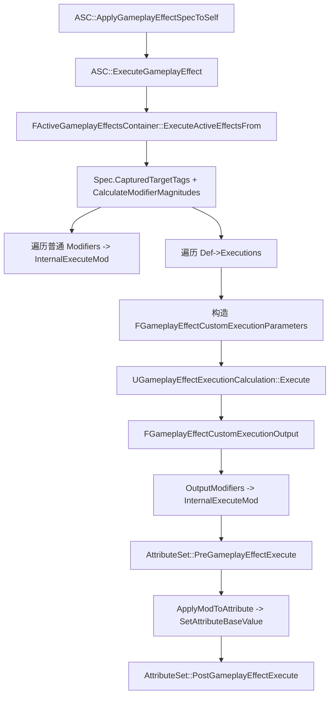
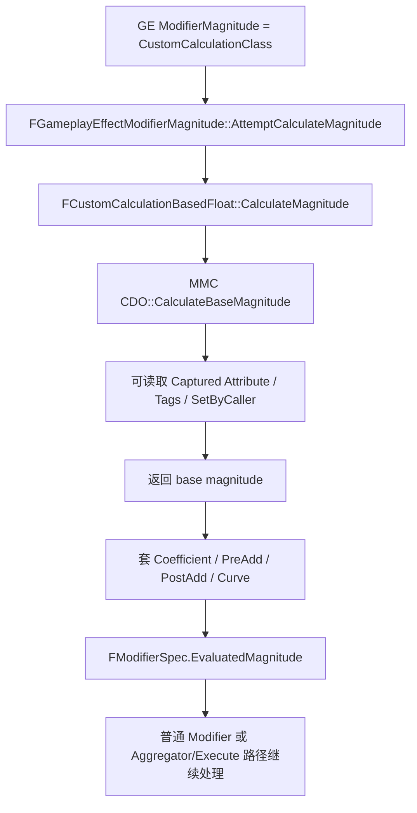
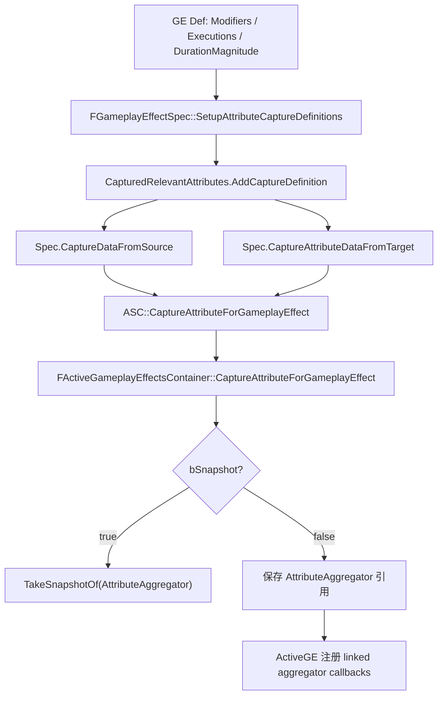
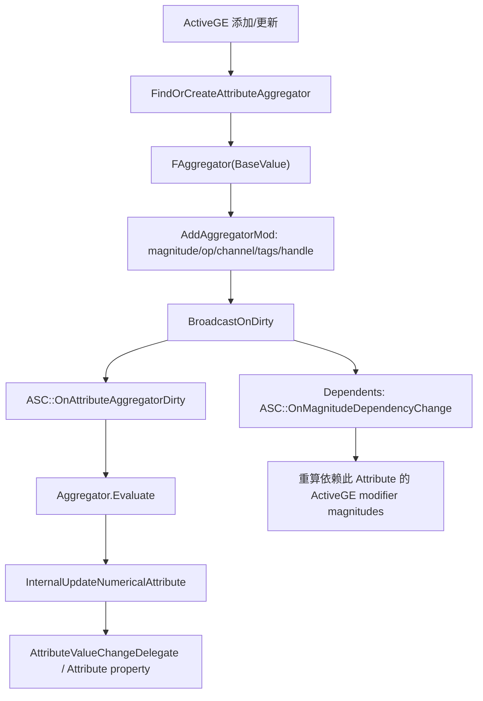
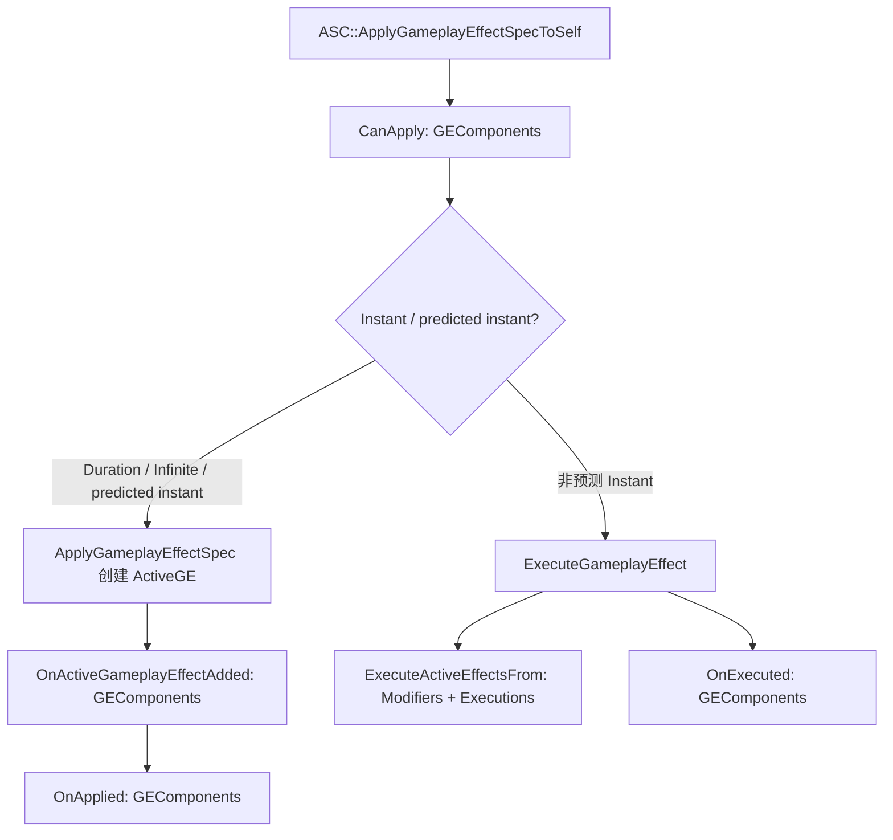

# ExecutionCalculation / ModMagnitudeCalculation / Attribute Capture（第十四轮）

本文件只分析 GameplayAbilities 侧的数值计算链，不生成业务 `ExecutionCalculation` / `MMC` 模板，不修改 `Engine/` 源码。

## 一、类定位

- `UGameplayEffectCalculation` 是 GE 计算类的抽象基类，核心能力是声明 `RelevantAttributesToCapture`，供派生的 ExecutionCalculation / ModMagnitudeCalculation 收集属性捕获定义；源码路径：`Engine/Plugins/Runtime/GameplayAbilities/Source/GameplayAbilities/Public/GameplayEffectCalculation.h:13`、`:22`、`:26`。
- `UGameplayEffectExecutionCalculation` 是 GE execution 的计算类，执行入口是 `Execute` / `Execute_Implementation`，输出 `FGameplayEffectCustomExecutionOutput`，可以产生多个 `FGameplayModifierEvaluatedData`；源码路径：`Engine/Plugins/Runtime/GameplayAbilities/Source/GameplayAbilities/Public/GameplayEffectExecutionCalculation.h:260`、`:304`、`Engine/Plugins/Runtime/GameplayAbilities/Source/GameplayAbilities/Private/GameplayEffectExecutionCalculation.cpp:408`。
- `UGameplayModMagnitudeCalculation` 是 Modifier Magnitude 的自定义计算类，执行入口是 `CalculateBaseMagnitude`，返回单个 float base magnitude；源码路径：`Engine/Plugins/Runtime/GameplayAbilities/Source/GameplayAbilities/Public/GameplayModMagnitudeCalculation.h:14`、`:29`、`Engine/Plugins/Runtime/GameplayAbilities/Source/GameplayAbilities/Private/GameplayModMagnitudeCalculation.cpp:14`。
- ExecutionCalculation 和普通 Modifier 的关系：GE 的 `Executions` 保存 `FGameplayEffectExecutionDefinition`，执行时先构造 `FGameplayEffectCustomExecutionParameters`，再调用 calculation CDO 的 `Execute`，最后把输出 modifiers 逐个送入 `InternalExecuteMod`；源码路径：`Engine/Plugins/Runtime/GameplayAbilities/Source/GameplayAbilities/Public/GameplayEffect.h:506`、`:519`、`Engine/Plugins/Runtime/GameplayAbilities/Source/GameplayAbilities/Private/GameplayEffect.cpp:3132`、`:3136`、`:3146`。
- MMC 和 Modifier Magnitude 的关系：`FGameplayEffectModifierMagnitude` 的 `CustomCalculationClass` 分支会调用 `FCustomCalculationBasedFloat::CalculateMagnitude`，该函数从 MMC CDO 调用 `CalculateBaseMagnitude` 后再套 coefficient / pre-add / post-add / final curve；源码路径：`Engine/Plugins/Runtime/GameplayAbilities/Source/GameplayAbilities/Public/GameplayEffect.h:73`、`:199`、`:222`、`Engine/Plugins/Runtime/GameplayAbilities/Source/GameplayAbilities/Private/GameplayEffect.cpp:1066`。
- Attribute Capture 是 `FGameplayEffectAttributeCaptureDefinition` 描述“捕获哪个属性、从 Source 还是 Target 捕获、是否 snapshot”，再由 `FGameplayEffectAttributeCaptureSpec` 保存捕获到的 aggregator 引用或快照；源码路径：`Engine/Plugins/Runtime/GameplayAbilities/Source/GameplayAbilities/Public/GameplayEffectAttributeCaptureDefinition.h:23`、`:39`、`:43`、`:47`、`Engine/Plugins/Runtime/GameplayAbilities/Source/GameplayAbilities/Public/GameplayEffect.h:763`。
- Snapshot 捕获会把当前 aggregator 复制为快照；Non-Snapshot 捕获保存原 aggregator 引用，并在 ActiveGE 添加后注册 linked aggregator callback 以便依赖变化时重算；源码路径：`Engine/Plugins/Runtime/GameplayAbilities/Source/GameplayAbilities/Private/GameplayEffect.cpp:3751`、`:3756`、`:3760`、`:2389`、`:4196`。
- Aggregator 在数值计算中保存 base value 和按 evaluation channel / mod op 分组的 modifiers，负责 Evaluate、EvaluateBonus、EvaluateContribution、dirty 广播和依赖通知；源码路径：`Engine/Plugins/Runtime/GameplayAbilities/Source/GameplayAbilities/Public/GameplayEffectAggregator.h:278`、`:292`、`:298`、`:307`、`:329`。
- `SetByCaller`、`ScalableFloat`、`AttributeBased`、`CustomCalculationClass` 都是 `FGameplayEffectModifierMagnitude` 支持的 magnitude 来源；源码路径：`Engine/Plugins/Runtime/GameplayAbilities/Source/GameplayAbilities/Public/GameplayEffect.h:67`、`:69`、`:71`、`:73`、`:75`。
- 这些计算类不直接拥有 ASC/AttributeSet 状态；它们通过 `FGameplayEffectSpec`、`FGameplayEffectCustomExecutionParameters`、捕获 spec、aggregator 和 `FGameplayModifierEvaluatedData` 与 ASC / ActiveGE / AttributeSet 串联；源码路径：`Engine/Plugins/Runtime/GameplayAbilities/Source/GameplayAbilities/Public/GameplayEffectExecutionCalculation.h:33`、`:39`、`:42`、`Engine/Plugins/Runtime/GameplayAbilities/Source/GameplayAbilities/Private/GameplayEffect.cpp:3907`。

## 二、核心类型分析

| 类型 | 定义位置 | 核心职责 | 创建或修改时机 | 是否复制 | 业务层是否直接使用 |
|---|---|---|---|---|---|
| `UGameplayEffectCalculation` | `GameplayEffectCalculation.h:13` | 计算基类，声明 relevant attribute captures | CDO / 子类默认对象配置 `RelevantAttributesToCapture` | UObject 类本身作为资产/类引用，不是运行时复制状态 | 通常作为自定义 Exec/MMC 的基类间接使用 |
| `UGameplayEffectExecutionCalculation` | `GameplayEffectExecutionCalculation.h:260` | 复杂执行计算，输出 evaluated modifiers / conditional/cue/stack 标记 | GE 执行时调用 CDO `Execute`；源码路径：`GameplayEffect.cpp:3136` | 计算类不复制，输出进入 GE 执行结果 | 业务常继承，但不要在 CDO 保存运行时状态（开发实践推断） |
| `UGameplayModMagnitudeCalculation` | `GameplayModMagnitudeCalculation.h:14` | 为一个 modifier 返回 base magnitude | Modifier magnitude 类型为 CustomCalculationClass 时调用；源码路径：`GameplayEffect.cpp:1071` | 计算类不复制；依赖 spec 数据计算 | 业务常继承，用于单一数值 |
| `FGameplayEffectAttributeCaptureDefinition` | `GameplayEffectAttributeCaptureDefinition.h:23` | 描述捕获属性、source/target、snapshot | GE spec setup 时收集；源码路径：`GameplayEffect.cpp:1700` | definition 可作为配置/结构出现；spec 捕获容器本身不复制 | 自定义计算常声明 |
| `FGameplayEffectAttributeCaptureSpec` | `GameplayEffect.h:763` | 保存一个 capture definition 的捕获 aggregator | `CaptureAttributes` 调 ASC 捕获；源码路径：`GameplayEffect.cpp:2485`、`:2495` | 位于 `CapturedRelevantAttributes`，该容器 `NotReplicated`；源码路径：`GameplayEffect.h:1176` | 业务通常通过 helper 读取，不直接构造 |
| `FGameplayEffectAttributeCaptureSpecContainer` | `GameplayEffect.h:900` | 分 source / target 管理 capture specs | `SetupAttributeCaptureDefinitions` 添加，source/target 捕获时填充 | `FGameplayEffectSpec::CapturedRelevantAttributes` 标记 `NotReplicated`；源码路径：`GameplayEffect.h:1176` | 通常不直接操作 |
| `FGameplayEffectExecutionDefinition` | `GameplayEffect.h:506` | GE 中一条 execution 配置 | GE 资产配置；应用/执行时遍历 | GE 资产配置随资源存在，运行时 spec 引用 def | 配 GE 时常见 |
| `FGameplayEffectExecutionScopedModifierInfo` | `GameplayEffect.h:420` | 给 Execution 计算准备 scoped captured/transient aggregator mods | `FGameplayEffectCustomExecutionParameters` 构造时读取；源码路径：`GameplayEffectExecutionCalculation.cpp:18`、`:23` | 配置不作为运行时状态复制 | 高级配置，常由编辑器 details 辅助 |
| `FGameplayEffectCustomExecutionParameters` | `GameplayEffectExecutionCalculation.h:21` | Execution 输入：spec、source/target ASC、tags、prediction key、scoped aggregators | 每次 execution 执行临时构造；源码路径：`GameplayEffect.cpp:3136` | 不复制，只在执行栈内使用 | Execution 内读取 |
| `FGameplayEffectCustomExecutionOutput` | `GameplayEffectExecutionCalculation.h:199` | Execution 输出 modifiers 与 stack/cue/conditional 标记 | Execution 填充，容器随后消费 | 不复制 | Execution 内写入 |
| `FGameplayModifierEvaluatedData` | `GameplayEffectTypes.h:191` | 已计算出的属性、op、magnitude、handle | 普通 modifier / execution output 都会生成 | 可进入 spec modified attributes / callbacks，结构本身不是独立复制对象 | AttributeSet 回调会读取 |
| `FGameplayEffectModifierMagnitude` | `GameplayEffect.h:276` | 描述 modifier magnitude 来源与计算 | GE spec `CalculateModifierMagnitudes` 计算；源码路径：`GameplayEffect.cpp:1948` | 计算结果在 `FModifierSpec`，SetByCaller map 在 spec；捕获不复制 | GE 配置常用 |
| `FAggregator` | `GameplayEffectAggregator.h:278` | 聚合 base value 与 ActiveGE mods，计算 CurrentValue | 属性首次需要聚合时创建；源码路径：`GameplayEffect.cpp:3263` | Aggregator 本身不是 replicated UPROPERTY；网络更新通过 Attribute/ActiveGE 路径触发 dirty | 业务通常不直接操作 |
| `FAggregatorMod` | `GameplayEffectAggregator.h:55` | 单个已评估 modifier，含 tag requirements、handle、预测标记 | ActiveGE 添加/更新时加入 aggregator；源码路径：`GameplayEffectAggregator.cpp:135`、`:489` | 不直接复制 | 调试/高级计算可查看 |
| `FAggregatorEvaluateParameters` | `GameplayEffectAggregator.h:15` | 传 source/target tags、ignore handles、filter、预测包含开关 | 计算 attribute based/MMC/aggregator 时临时构造 | 不复制 | 计算代码常用 |
| `FScalableFloat` | `ScalableFloat.h:14` | `Value * Curve[Level]` 类型的可伸缩数值 | Magnitude 计算或配置读取时按 level 求值 | 作为配置结构存在 | GE 配置常用 |

## 三、ExecutionCalculation 调用链



源码路径：

- `ApplyGameplayEffectSpecToSelf` 决定预测/Instant/Duration 分支，并在非预测 instant 路径调用 `ExecuteGameplayEffect`；源码路径：`Engine/Plugins/Runtime/GameplayAbilities/Source/GameplayAbilities/Private/AbilitySystemComponent.cpp:798`、`:862`、`:953`、`:1000`。
- `ExecuteGameplayEffect` 转入 `ActiveGameplayEffects.ExecuteActiveEffectsFrom`；源码路径：`Engine/Plugins/Runtime/GameplayAbilities/Source/GameplayAbilities/Private/AbilitySystemComponent.cpp:1000`、`:1022`。
- `ExecuteActiveEffectsFrom` 会刷新 target tags、计算 modifier magnitudes，再先处理普通 modifiers，后处理 `Def->Executions`；源码路径：`Engine/Plugins/Runtime/GameplayAbilities/Source/GameplayAbilities/Private/GameplayEffect.cpp:3065`、`:3081`、`:3084`、`:3095`、`:3127`。
- Execution 构造 `FGameplayEffectCustomExecutionParameters`，调用 `ExecCDO->Execute`，再消费 `ExecutionOutput.GetOutputModifiersRef()`；源码路径：`Engine/Plugins/Runtime/GameplayAbilities/Source/GameplayAbilities/Private/GameplayEffect.cpp:3132`、`:3136`、`:3138`、`:3146`。
- `InternalExecuteMod` 查找 AttributeSet，构造 `FGameplayEffectModCallbackData`，调用 `PreGameplayEffectExecute`，再 `ApplyModToAttribute`，最后 `PostGameplayEffectExecute`；源码路径：`Engine/Plugins/Runtime/GameplayAbilities/Source/GameplayAbilities/Private/GameplayEffect.cpp:3907`、`:3920`、`:3925`、`:3931`、`:3933`、`:3946`。

简化伪代码：

```cpp
ApplyGameplayEffectSpecToSelf(Spec, PredictionKey)
{
    if (Spec is non-predicted instant)
        ExecuteGameplayEffect(Spec, PredictionKey);
}

ExecuteActiveEffectsFrom(Spec)
{
    Spec.CapturedTargetTags = OwnerTags;
    Spec.CalculateModifierMagnitudes();

    for (Modifier in Spec.Modifiers)
        InternalExecuteMod(Spec, EvaluatedData);

    for (Execution in Spec.Def->Executions)
    {
        Params = FGameplayEffectCustomExecutionParameters(Spec, Execution.CalculationModifiers, Owner, Execution.PassedInTags, PredictionKey);
        Output = {};
        Execution.CalculationClass.CDO->Execute(Params, Output);
        for (Mod in Output.OutputModifiers)
            InternalExecuteMod(Spec, Mod);
    }
}
```

普通 Modifier 和 Execution 输出的区别：

- 普通 Modifier 的 attribute/op/magnitude 来自 GE `Modifiers` 配置和 `FGameplayEffectModifierMagnitude` 计算；源码路径：`Engine/Plugins/Runtime/GameplayAbilities/Source/GameplayAbilities/Public/GameplayEffect.h:544`、`:550`、`:558`、`Engine/Plugins/Runtime/GameplayAbilities/Source/GameplayAbilities/Private/GameplayEffect.cpp:1948`。
- Execution 输出由自定义 calculation 在 `FGameplayEffectCustomExecutionOutput::AddOutputModifier` 中加入，可一次输出多个 attribute 修改；源码路径：`Engine/Plugins/Runtime/GameplayAbilities/Source/GameplayAbilities/Public/GameplayEffectExecutionCalculation.h:229`、`Engine/Plugins/Runtime/GameplayAbilities/Source/GameplayAbilities/Private/GameplayEffectExecutionCalculation.cpp:361`。

## 四、ModMagnitudeCalculation 调用链



源码路径：

- `FGameplayEffectModifierMagnitude::AttemptCalculateMagnitude` 根据 `MagnitudeCalculationType` 分派到 ScalableFloat、AttributeBased、CustomCalculationClass 或 SetByCaller；源码路径：`Engine/Plugins/Runtime/GameplayAbilities/Source/GameplayAbilities/Private/GameplayEffect.cpp:1136`、`:1147`、`:1153`、`:1159`、`:1163`。
- CustomCalculationClass 调 `FCustomCalculationBasedFloat::CalculateMagnitude`；该函数调用 MMC CDO 的 `CalculateBaseMagnitude`，再用 GE level 计算 coefficient/pre/post/curve；源码路径：`Engine/Plugins/Runtime/GameplayAbilities/Source/GameplayAbilities/Private/GameplayEffect.cpp:1066`、`:1071`、`:1073`、`:1076`。
- MMC 可通过 `GetCapturedAttributeMagnitude`、`GetSetByCallerMagnitudeByTag/Name`、`GetSourceAggregatedTags`、`GetTargetAggregatedTags` 等 helper 读取 spec 数据；源码路径：`Engine/Plugins/Runtime/GameplayAbilities/Source/GameplayAbilities/Private/GameplayModMagnitudeCalculation.cpp:30`、`:74`、`:79`、`:84`、`:106`。

结论：

- MMC 只返回一个 magnitude，不直接输出多个属性修改；源码路径：`Engine/Plugins/Runtime/GameplayAbilities/Source/GameplayAbilities/Public/GameplayModMagnitudeCalculation.h:29`。
- 需要“读取多个属性并输出多个 Attribute 修改”的场景更适合 ExecutionCalculation；这是开发实践推断，源码依据是 Execution output 是 `TArray<FGameplayModifierEvaluatedData>`；源码路径：`Engine/Plugins/Runtime/GameplayAbilities/Source/GameplayAbilities/Public/GameplayEffectExecutionCalculation.h:242`、`:244`。

## 五、Attribute Capture 体系



| 主题 | 源码确认 |
|---|---|
| 捕获定义来源 | DurationMagnitude、Modifiers、Executions 都会把 capture definitions 收进 `CapturedRelevantAttributes`；源码路径：`Engine/Plugins/Runtime/GameplayAbilities/Source/GameplayAbilities/Private/GameplayEffect.cpp:1700`、`:1705`、`:1713`、`:1725`、`:1736` |
| Source 捕获 | `CaptureDataFromSource` 从 `EffectContext.GetInstigatorAbilitySystemComponent()` 捕获 Source attributes，并 recapture source actor tags；源码路径：`Engine/Plugins/Runtime/GameplayAbilities/Source/GameplayAbilities/Private/GameplayEffect.cpp:1754`、`:1764`、`:1776` |
| Target 捕获 | `CaptureAttributeDataFromTarget` 从目标 ASC 捕获 Target attributes；源码路径：`Engine/Plugins/Runtime/GameplayAbilities/Source/GameplayAbilities/Private/GameplayEffect.cpp:1748` |
| ASC 捕获入口 | ASC 先确认自己有对应 AttributeSet 或 system attribute，再交给 ActiveGameplayEffects 捕获；源码路径：`Engine/Plugins/Runtime/GameplayAbilities/Source/GameplayAbilities/Private/AbilitySystemComponent.cpp:371`、`:374`、`:377` |
| Snapshot | `bSnapshot` 为 true 时对 attribute aggregator 调 `TakeSnapshotOf`；源码路径：`Engine/Plugins/Runtime/GameplayAbilities/Source/GameplayAbilities/Private/GameplayEffect.cpp:3756` |
| Non-Snapshot | `bSnapshot` 为 false 时保存 aggregator 引用，ActiveGE 添加后通过 `RegisterLinkedAggregatorCallbacks` 注册依赖；源码路径：`Engine/Plugins/Runtime/GameplayAbilities/Source/GameplayAbilities/Private/GameplayEffect.cpp:3760`、`:4196` |
| Captured tags | Source/Target tags 分别保存在 `CapturedSourceTags` / `CapturedTargetTags`，二者 `NotReplicated`；源码路径：`Engine/Plugins/Runtime/GameplayAbilities/Source/GameplayAbilities/Public/GameplayEffect.h:1200`、`:1204` |

## 六、Snapshot 与 Non-Snapshot

| 维度 | Snapshot | Non-Snapshot |
|---|---|---|
| 捕获值何时固定 | 捕获时复制 aggregator 快照；源码路径：`Engine/Plugins/Runtime/GameplayAbilities/Source/GameplayAbilities/Private/GameplayEffect.cpp:3756` | 保存 aggregator 引用；源码路径：`Engine/Plugins/Runtime/GameplayAbilities/Source/GameplayAbilities/Private/GameplayEffect.cpp:3760` |
| ActiveGE 后续重算 | 快照 capture 不注册 linked callback；源码路径：`Engine/Plugins/Runtime/GameplayAbilities/Source/GameplayAbilities/Private/GameplayEffect.cpp:2389` | `RegisterLinkedAggregatorCallback` 只在 `bSnapshot == false` 时 `Agg->AddDependent`；源码路径：`Engine/Plugins/Runtime/GameplayAbilities/Source/GameplayAbilities/Private/GameplayEffect.cpp:2389`、`:2395` |
| Source/Target 差异 | 是否 source/target 由 `AttributeSource` 决定；源码路径：`Engine/Plugins/Runtime/GameplayAbilities/Source/GameplayAbilities/Public/GameplayEffectAttributeCaptureDefinition.h:43` | 同左 |
| Duration/Infinite GE | Snapshot 不随属性变化；Non-Snapshot 依赖 aggregator dirty 触发 `OnMagnitudeDependencyChange` 重新计算；源码路径：`Engine/Plugins/Runtime/GameplayAbilities/Source/GameplayAbilities/Private/GameplayEffectAggregator.cpp:614`、`Engine/Plugins/Runtime/GameplayAbilities/Source/GameplayAbilities/Private/GameplayEffect.cpp:3368` | 同左 |
| Instant GE | 执行时捕获并计算；是否快照对“后续持续重算”意义较小，这是开发实践推断；源码路径：`Engine/Plugins/Runtime/GameplayAbilities/Source/GameplayAbilities/Private/GameplayEffect.cpp:3065`、`:3084` | 同左 |
| 常见场景 | 开发实践推断：快照攻击力、施法瞬间强度 | 开发实践推断：实时防御力、持续 buff、随目标属性变化的持续修正 |

未确认：本轮未完整穷举所有引擎测试用例对 Snapshot/Non-Snapshot 的设计意图，只基于 runtime 捕获和依赖刷新路径确认机制。

## 七、Modifier Magnitude 类型

| 类型 | 数据来源 | 何时计算 | GE level | Tags | Capture | 预测适配 | 常见坑 |
|---|---|---|---|---|---|---|---|
| ScalableFloat | `FScalableFloat` 的 Value 和 CurveTable row；源码路径：`Engine/Plugins/Runtime/GameplayAbilities/Source/GameplayAbilities/Public/ScalableFloat.h:12`、`:38`、`:46` | `AttemptCalculateMagnitude` 时 `GetValueAtLevel`；源码路径：`GameplayEffect.cpp:1147` | 是 | 否 | 否 | 确定性最好（开发实践推断） | curve 缺失或 level 不符 |
| AttributeBased | `FAttributeBasedFloat::BackingAttribute` 捕获值，套 coefficient/pre/post/curve；源码路径：`GameplayEffect.h:124`、`:164`、`GameplayEffect.cpp:966` | spec 计算 modifiers 时 | coefficient/pre/post 可按 level；源码路径：`GameplayEffect.cpp:1009` | 使用 captured source/target tags 和 tag filters；源码路径：`GameplayEffect.cpp:983`、`:984`、`:985` | 是 | 取决于客户端/服务端捕获一致性（开发实践推断） | Source/Target 捕获方向写反 |
| CustomCalculationClass / MMC | MMC CDO `CalculateBaseMagnitude` 返回 base value，再套 coefficient/pre/post/curve；源码路径：`GameplayEffect.cpp:1066`、`:1071`、`:1076` | spec 计算 modifiers 时 | 是 | MMC helper 可读 tags；源码路径：`GameplayModMagnitudeCalculation.cpp:84`、`:106` | 可声明 capture | 非权威客户端依赖捕获有限制；源码路径：`GameplayModMagnitudeCalculation.h:52`、`:60` | 以为 MMC 能输出多个属性 |
| SetByCaller | `FGameplayEffectSpec::SetByCallerNameMagnitudes` / `SetByCallerTagMagnitudes` | 计算 magnitude 时从 spec map 读取；源码路径：`GameplayEffect.cpp:1163`、`:1167`、`:1173` | 否，除非业务写入时自行考虑 level（开发实践推断） | Tag 版本以 DataTag 作 key；源码路径：`GameplayEffect.h:266` | 否 | Spec 数据需在预测/服务器都可获得；未完整展开，未确认 | key 写错或未设置时返回默认并可 log error；源码路径：`GameplayEffect.cpp:2216`、`:2238` |

## 八、Aggregator 深入



源码确认：

- `FindOrCreateAttributeAggregator` 用当前 base value 创建 aggregator，绑定 `OnDirty` / `OnDirtyRecursive` 到 ASC，并调用 AttributeSet 的 `OnAttributeAggregatorCreated`；源码路径：`Engine/Plugins/Runtime/GameplayAbilities/Source/GameplayAbilities/Private/GameplayEffect.cpp:3263`、`:3271`、`:3277`、`:3282`。
- `FAggregatorModChannel::EvaluateWithBase` 先处理 Override；否则按公式 `((InlineBaseValue + Additive) * Multiplicitive / Division * CompoundMultiply) + FinalAdd`；源码路径：`Engine/Plugins/Runtime/GameplayAbilities/Source/GameplayAbilities/Private/GameplayEffectAggregator.cpp:76`、`:78`、`:86`、`:98`。
- `EGameplayModOp` 的注释同样声明聚合公式，并保留旧名 `Additive/Multiplicitive/Division`；源码路径：`Engine/Plugins/Runtime/GameplayAbilities/Source/GameplayAbilities/Public/GameplayEffectTypes.h:111`、`:116`、`:143`、`:148`。
- `FAggregatorMod::UpdateQualifies` 用 source/target tag requirements、applied tag filters、ignore handles、IncludePredictiveMods 判断本次是否参与计算；源码路径：`Engine/Plugins/Runtime/GameplayAbilities/Source/GameplayAbilities/Private/GameplayEffectAggregator.cpp:28`、`:35`、`:38`、`:42`、`:49`、`:62`。
- Aggregator dirty 会先广播 `OnDirty`，再通知 dependent ActiveGE handles 调 `ASC->OnMagnitudeDependencyChange`；源码路径：`Engine/Plugins/Runtime/GameplayAbilities/Source/GameplayAbilities/Private/GameplayEffectAggregator.cpp:585`、`:608`、`:614`、`:629`。
- 客户端网络更新时，`OnAttributeAggregatorDirty` 可通过 `ReverseEvaluate` 推回 base，再包含 predictive mods 重新求本地预测值；源码路径：`Engine/Plugins/Runtime/GameplayAbilities/Source/GameplayAbilities/Private/GameplayEffect.cpp:3318`、`:3339`、`:3359`。

简化伪代码：

```cpp
Aggregator.Evaluate(params)
{
    EvaluateQualificationForAllMods(params);
    value = BaseValue;
    for (channel in sorted channels)
        value = channel.EvaluateWithBase(value, params);
    return value;
}

channel.EvaluateWithBase(base)
{
    if (qualified Override exists) return OverrideMagnitude;
    return ((base + AddBaseSum) * MultiplyAdditiveSum / DivideAdditiveSum * MultiplyCompoundProduct) + AddFinalSum;
}
```

## 九、ExecutionCalculation 输出机制

- `FGameplayEffectCustomExecutionOutput::AddOutputModifier` 把一个 `FGameplayModifierEvaluatedData` 加入 `OutputModifiers`；源码路径：`Engine/Plugins/Runtime/GameplayAbilities/Source/GameplayAbilities/Private/GameplayEffectExecutionCalculation.cpp:361`。
- Execution output 可 `MarkConditionalGameplayEffectsToTrigger`，`ExecuteActiveEffectsFrom` 根据 `ShouldTriggerConditionalGameplayEffects` 决定是否应用 `ConditionalGameplayEffects`；源码路径：`Engine/Plugins/Runtime/GameplayAbilities/Source/GameplayAbilities/Private/GameplayEffectExecutionCalculation.cpp:346`、`:356`、`Engine/Plugins/Runtime/GameplayAbilities/Source/GameplayAbilities/Private/GameplayEffect.cpp:3139`、`:3165`。
- Execution output 可 `MarkStackCountHandledManually`，否则输出 modifier 会自动按 stack count 重新计算 magnitude；源码路径：`Engine/Plugins/Runtime/GameplayAbilities/Source/GameplayAbilities/Private/GameplayEffectExecutionCalculation.cpp:331`、`Engine/Plugins/Runtime/GameplayAbilities/Source/GameplayAbilities/Private/GameplayEffect.cpp:3148`、`:3154`。
- Execution output 可 `MarkGameplayCuesHandledManually`，容器随后跳过默认 GameplayCue execute；源码路径：`Engine/Plugins/Runtime/GameplayAbilities/Source/GameplayAbilities/Private/GameplayEffectExecutionCalculation.cpp:351`、`Engine/Plugins/Runtime/GameplayAbilities/Source/GameplayAbilities/Private/GameplayEffect.cpp:3160`、`:3203`。
- ExecutionCalculation 能直接输出多个 Attribute 修改；源码依据是 `OutputModifiers` 是数组，容器逐个 `InternalExecuteMod`；源码路径：`Engine/Plugins/Runtime/GameplayAbilities/Source/GameplayAbilities/Public/GameplayEffectExecutionCalculation.h:242`、`Engine/Plugins/Runtime/GameplayAbilities/Source/GameplayAbilities/Private/GameplayEffect.cpp:3146`、`:3155`。
- 开发实践推断：Damage -> Health 这类读取攻击/防御/暴击并输出伤害或生命修改的复杂结算适合 ExecutionCalculation；源码依据是 Execution 可以读取 captured attributes/tags/set-by-caller，并输出多个 evaluated modifiers；源码路径：`Engine/Plugins/Runtime/GameplayAbilities/Source/GameplayAbilities/Public/GameplayEffectExecutionCalculation.h:61`、`:229`。

## 十、ExecutionCalculation 与 GameplayEffectComponents



- GEComponents 的 `CanGameplayEffectApply` 在应用前检查阶段被调用，返回 false 会阻止后续应用/执行，因此会阻止 ExecutionCalculation 执行；源码路径：`Engine/Plugins/Runtime/GameplayAbilities/Source/GameplayAbilities/Private/GameplayEffect.cpp:875`、`:885`。
- `ExecuteActiveEffectsFrom` 完成后调用 `Spec.Def->OnExecuted`，从而进入 GEComponents 的 `OnGameplayEffectExecuted`；源码路径：`Engine/Plugins/Runtime/GameplayAbilities/Source/GameplayAbilities/Private/GameplayEffect.cpp:3224`、`:911`、`:917`。
- `ApplyGameplayEffectSpec` 添加 ActiveGE 后会调用 `InternalOnActiveGameplayEffectAdded`，再调用 GEComponents 的 `OnActiveGameplayEffectAdded`；源码路径：`Engine/Plugins/Runtime/GameplayAbilities/Source/GameplayAbilities/Private/GameplayEffect.cpp:4279`、`:4286`、`:902`。
- `ApplyGameplayEffectSpecToSelf` 应用成功后调用 `Spec.Def->OnApplied`，GEComponents 的 `OnGameplayEffectApplied` 在这里触发；源码路径：`Engine/Plugins/Runtime/GameplayAbilities/Source/GameplayAbilities/Private/AbilitySystemComponent.cpp:957`、`Engine/Plugins/Runtime/GameplayAbilities/Source/GameplayAbilities/Private/GameplayEffect.cpp:924`、`:930`。
- AdditionalEffects 和 ExecutionCalculation 的精确相对顺序取决于 Instant vs ActiveGE 路径；上图为本轮基于通用调用点的确认，复杂嵌套 AdditionalEffects 链路未完整展开，未确认。

## 十一、Calculation 与 Tag / SetByCaller

- AttributeBased magnitude 使用 `CapturedSourceTags.GetAggregatedTags()` 和 `CapturedTargetTags.GetAggregatedTags()` 构造 `FAggregatorEvaluateParameters`，还可带 `AppliedSourceTagFilter` / `AppliedTargetTagFilter`；源码路径：`Engine/Plugins/Runtime/GameplayAbilities/Source/GameplayAbilities/Private/GameplayEffect.cpp:983`、`:984`、`:985`、`:986`。
- MMC helper 可以读取 source/target aggregated tags、actor tags、spec tags；源码路径：`Engine/Plugins/Runtime/GameplayAbilities/Source/GameplayAbilities/Public/GameplayModMagnitudeCalculation.h:110`、`:120`、`:130`、`:140`、`:151`、`:162`。
- Execution parameters 可读取 passed-in tags、source ASC、target ASC、prediction key；源码路径：`Engine/Plugins/Runtime/GameplayAbilities/Source/GameplayAbilities/Public/GameplayEffectExecutionCalculation.h:39`、`:42`、`:45`、`:49`。
- `SetByCaller` 有 Name 和 GameplayTag 两个 map；设置函数会写入 `SetByCallerNameMagnitudes` 或 `SetByCallerTagMagnitudes`，读取缺失时按参数返回默认值，并可记录 error；源码路径：`Engine/Plugins/Runtime/GameplayAbilities/Source/GameplayAbilities/Public/GameplayEffect.h:1243`、`:1244`、`Engine/Plugins/Runtime/GameplayAbilities/Source/GameplayAbilities/Private/GameplayEffect.cpp:2200`、`:2208`、`:2216`、`:2238`。
- `FGameplayEffectSpecForRPC` 是 “cut down version”，而 `CapturedRelevantAttributes`、CapturedSource/TargetTags 标记 `NotReplicated`；SetByCaller 在 spec 的一般复制/RPC中的完整行为本轮未完全展开，未确认；源码路径：`Engine/Plugins/Runtime/GameplayAbilities/Source/GameplayAbilities/Public/GameplayEffect.h:1176`、`:1200`、`:1204`、`:1260`。

## 十二、Calculation 与网络预测

- ASC 只有 authority 或有效 prediction key 才允许应用 GE；源码路径：`Engine/Plugins/Runtime/GameplayAbilities/Source/GameplayAbilities/Private/AbilitySystemComponent.cpp:381`、`:813`。
- 客户端预测 instant GE 会被当成 infinite duration 临时加入 ActiveGE，后续由预测 key 清理；源码路径：`Engine/Plugins/Runtime/GameplayAbilities/Source/GameplayAbilities/Private/AbilitySystemComponent.cpp:862`、`Engine/Plugins/Runtime/GameplayAbilities/Source/GameplayAbilities/Private/GameplayEffect.cpp:4265`。
- `PredictivelyExecuteEffectSpec` 会执行普通 modifiers 和 Executions，也会把 prediction key 传入 `FGameplayEffectCustomExecutionParameters`；源码路径：`Engine/Plugins/Runtime/GameplayAbilities/Source/GameplayAbilities/Private/GameplayEffect.cpp:2924`、`:2931`、`:3001`。
- ActiveGE aggregator mods 会记录 `Effect.PredictionKey.WasLocallyGenerated()`，evaluation params 可通过 `IncludePredictiveMods` 控制是否包含预测 mods；源码路径：`Engine/Plugins/Runtime/GameplayAbilities/Source/GameplayAbilities/Private/GameplayEffect.cpp:4350`、`Engine/Plugins/Runtime/GameplayAbilities/Source/GameplayAbilities/Public/GameplayEffectAggregator.h:37`。
- MMC 的 `bAllowNonNetAuthorityDependencyRegistration` 注释明确：客户端自定义计算通常不允许注册外部依赖；若开启且依赖 attribute capture，会 ensure；源码路径：`Engine/Plugins/Runtime/GameplayAbilities/Source/GameplayAbilities/Public/GameplayModMagnitudeCalculation.h:52`、`:60`、`Engine/Plugins/Runtime/GameplayAbilities/Source/GameplayAbilities/Private/GameplayModMagnitudeCalculation.cpp:24`。
- 开发实践推断：可预测计算应尽量确定性；随机、时间、外部 mutable 状态和 Actor 副作用应放服务端权威路径或显式同步。源码依据是客户端预测会先本地执行 GE/Execution，再由服务器复制/预测 key 纠正；源码路径：`Engine/Plugins/Runtime/GameplayAbilities/Source/GameplayAbilities/Private/AbilitySystemComponent.cpp:862`、`Engine/Plugins/Runtime/GameplayAbilities/Source/GameplayAbilities/Private/GameplayEffect.cpp:4265`。

## 十三、Calculation 与编辑器

- `GameplayAbilitiesEditor` 注册了 `GameplayEffectModifierMagnitude`、`GameplayEffectExecutionDefinition`、`GameplayEffectExecutionScopedModifierInfo`、`AttributeBasedFloat`、`ScalableFloat` 等 property customization；源码路径：`Engine/Plugins/Runtime/GameplayAbilities/Source/GameplayAbilitiesEditor/Private/GameplayAbilitiesEditorModule.cpp:176`、`:177`、`:179`、`:180`、`:183`。
- `FGameplayEffectModifierMagnitudeDetails` 根据 `MagnitudeCalculationType` 显示 ScalableFloat / AttributeBased / CustomMagnitude / SetByCaller 对应属性；源码路径：`Engine/Plugins/Runtime/GameplayAbilities/Source/GameplayAbilitiesEditor/Private/GameplayEffectModifierMagnitudeDetails.cpp:24`、`:47`、`:54`、`:61`、`:64`。
- `FGameplayEffectExecutionDefinitionDetails` 在 CalculationClass 变化后读取 execution CDO 的 valid capture definitions / transient aggregator identifiers，并决定是否显示 calculation modifiers 和 passed-in tags；源码路径：`Engine/Plugins/Runtime/GameplayAbilities/Source/GameplayAbilitiesEditor/Private/GameplayEffectExecutionDefinitionDetails.cpp:37`、`:45`、`:74`、`:91`、`:101`、`:144`。
- `FGameplayEffectExecutionScopedModifierInfoDetails` 根据 execution CDO 的 valid scoped captures 构建 UI，显示 captured attribute、source、snapshot 状态，或 transient aggregator identifier；源码路径：`Engine/Plugins/Runtime/GameplayAbilities/Source/GameplayAbilitiesEditor/Private/GameplayEffectExecutionScopedModifierInfoDetails.cpp:106`、`:122`、`:138`、`:190`、`:285`、`:291`。
- 编辑器侧能帮助显示/筛选配置，但运行时仍以 `AttemptCalculateMagnitude`、`HasValidCapturedAttributes`、`InternalExecuteMod` 等路径为准；这是开发实践推断，源码依据：`Engine/Plugins/Runtime/GameplayAbilities/Source/GameplayAbilities/Private/GameplayEffect.cpp:1125`、`:1948`、`:3907`。

## 十四、玩法计算速查

| 场景 | 推荐入口 | 依据 |
|---|---|---|
| 固定数值 buff | ScalableFloat Modifier | ScalableFloat 按 level 求值；源码路径：`Engine/Plugins/Runtime/GameplayAbilities/Source/GameplayAbilities/Private/GameplayEffect.cpp:1147` |
| 随等级成长数值 | ScalableFloat / AttributeBased coefficient | `FScalableFloat::GetValueAtLevel`；源码路径：`Engine/Plugins/Runtime/GameplayAbilities/Source/GameplayAbilities/Public/ScalableFloat.h:55` |
| 运行时传入数值 | SetByCaller | Spec 提供 Name/Tag setter；源码路径：`Engine/Plugins/Runtime/GameplayAbilities/Source/GameplayAbilities/Private/GameplayEffect.cpp:2200`、`:2208` |
| 依赖一个属性算一个 modifier | AttributeBased Modifier 或 MMC | AttributeBased 从 captured attribute 计算；源码路径：`Engine/Plugins/Runtime/GameplayAbilities/Source/GameplayAbilities/Private/GameplayEffect.cpp:966` |
| 依赖多个属性输出多个结果 | ExecutionCalculation | OutputModifiers 是数组；源码路径：`Engine/Plugins/Runtime/GameplayAbilities/Source/GameplayAbilities/Public/GameplayEffectExecutionCalculation.h:242` |
| Damage -> Health | ExecutionCalculation 输出 meta/damage 或 health modifier，再在 AttributeSet Post 中处理；这是开发实践推断，源码依据：`Engine/Plugins/Runtime/GameplayAbilities/Source/GameplayAbilities/Private/GameplayEffect.cpp:3136`、`:3946` |
| 治疗 | 简单治疗可用 Modifier，复杂治疗可用 Execution；开发实践推断，源码依据：普通 Modifier 和 Execution 都进入 `InternalExecuteMod`；源码路径：`Engine/Plugins/Runtime/GameplayAbilities/Source/GameplayAbilities/Private/GameplayEffect.cpp:3114`、`:3155` |
| 暴击 / 随机数 | 服务端权威 Execution 或 Ability 外部决定后 SetByCaller；开发实践推断，预测随机不确定；源码依据：预测 GE 会客户端先执行；源码路径：`Engine/Plugins/Runtime/GameplayAbilities/Source/GameplayAbilities/Private/GameplayEffect.cpp:2924` |
| DOT / HOT 周期伤害 | Periodic GE 的 execute 路径 | Periodic/instant 执行 modifiers 会进 `ExecuteActiveEffectsFrom`；源码路径：`Engine/Plugins/Runtime/GameplayAbilities/Source/GameplayAbilities/Private/GameplayEffect.cpp:3065` |
| 冷却缩减 / 攻速 / 移速持续属性 | Duration/Infinite GE + Aggregator Modifier | ActiveGE 注册 aggregator mods 并 dirty 更新 current value；源码路径：`Engine/Plugins/Runtime/GameplayAbilities/Source/GameplayAbilities/Private/GameplayEffect.cpp:4347`、`:4350` |
| 什么时候不要用 Calculation | 权限、阵营、复杂跨系统状态机、表现播放 | 开发实践推断；Calculation 源码职责是数值输入/输出，不是流程控制或表现层；源码路径：`Engine/Plugins/Runtime/GameplayAbilities/Source/GameplayAbilities/Public/GameplayEffectExecutionCalculation.h:304` |

## 十五、未确认项

- `FGameplayEffectSpecForRPC` 是否携带 SetByCaller name/tag magnitudes 的完整网络语义，本轮未完整展开序列化和 RPC 结构，未确认。
- AdditionalEffects 与 ExecutionCalculation 在所有嵌套和预测路径下的完整顺序，本轮只确认通用 hook 点，未确认。
- Snapshot/Non-Snapshot 在所有项目实践场景中的推荐用法属于开发实践推断，非源码强制规则。
- ExecutionCalculation 里复杂副作用的项目边界不是源码强制限制，本文建议基于预测和 CDO/执行路径做开发实践推断。
