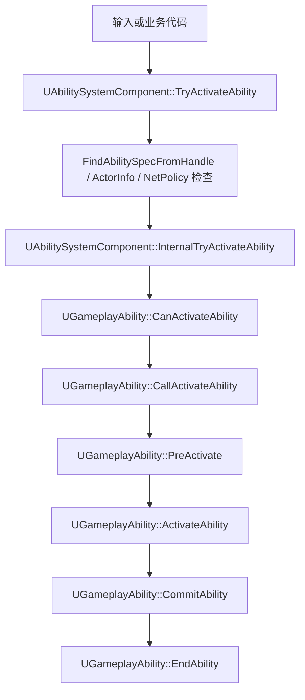
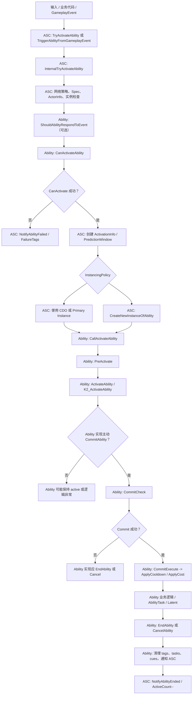
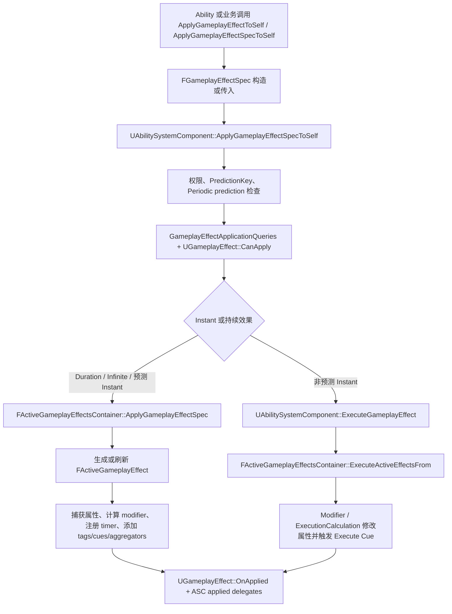
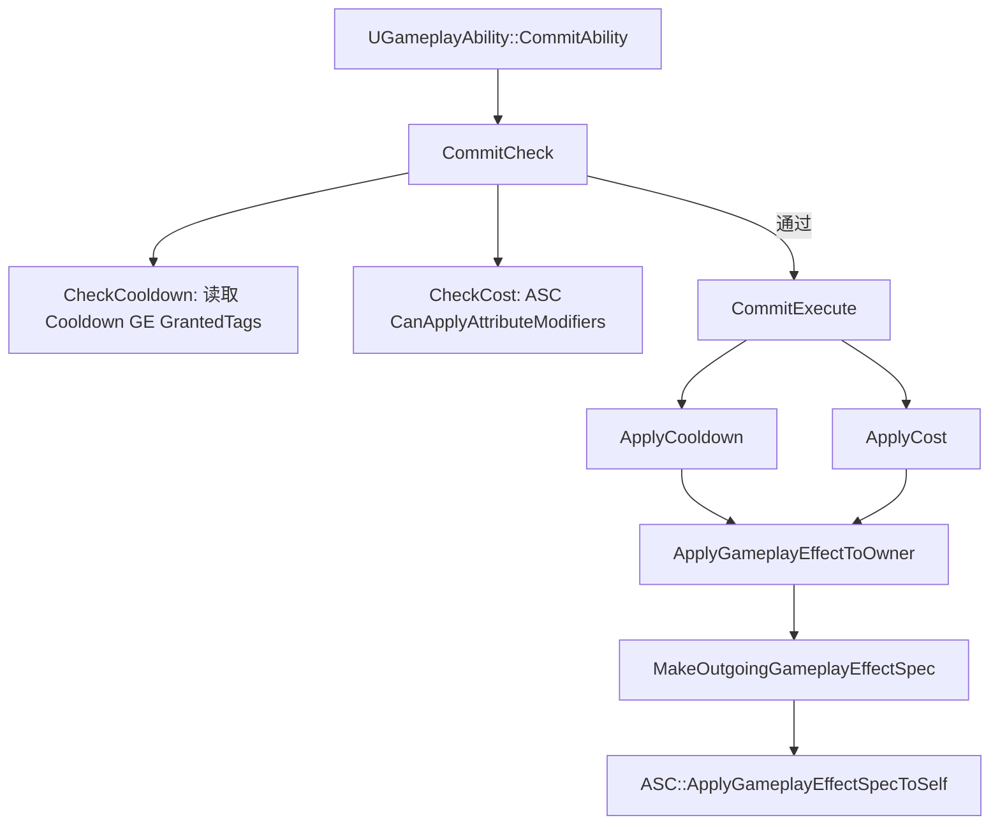
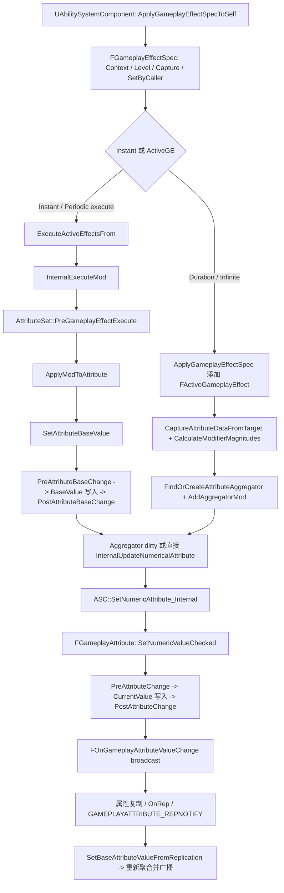

# 调用链：Ability 激活初步分析（第二轮）

本轮只做 `UAbilitySystemComponent` 到 `UGameplayAbility` 的初步激活链分析，不完整展开网络预测、target data 与 RPC batch。

## 五、Ability 激活的初步调用链

简化流程：



## 步骤说明

1. 输入或业务代码调用 `TryActivateAbility(Handle)`，或调用 `TryActivateAbilitiesByTag` 间接按 tag 找 spec 后逐个调用 `TryActivateAbility`；源码路径：`Engine/Plugins/Runtime/GameplayAbilities/Source/GameplayAbilities/Private/AbilitySystemComponent_Abilities.cpp:1541`、`Engine/Plugins/Runtime/GameplayAbilities/Source/GameplayAbilities/Private/AbilitySystemComponent_Abilities.cpp:1583`。
2. `TryActivateAbility` 先调用 `FindAbilitySpecFromHandle`，检查 spec 是否存在、是否 pending remove、Ability 是否有效、ActorInfo/Owner/Avatar 是否有效，且拒绝 simulated proxy；源码路径：`Engine/Plugins/Runtime/GameplayAbilities/Source/GameplayAbilities/Private/AbilitySystemComponent_Abilities.cpp:1585`、`:1593`、`:1607`、`:1618`。
3. `TryActivateAbility` 根据 Ability 的 NetExecutionPolicy 做远端转发或拒绝：非本地激活 LocalOnly/LocalPredicted 可调用 `ClientTryActivateAbility`，非 authority 激活 ServerOnly/ServerInitiated 可调用 `CallServerTryActivateAbility`；源码路径：`Engine/Plugins/Runtime/GameplayAbilities/Source/GameplayAbilities/Private/AbilitySystemComponent_Abilities.cpp:1624`、`:1626`、`:1639`。
4. 本地可执行时进入 `InternalTryActivateAbility`；源码路径：`Engine/Plugins/Runtime/GameplayAbilities/Source/GameplayAbilities/Private/AbilitySystemComponent_Abilities.cpp:1661`、`:1683`。
5. `InternalTryActivateAbility` 再次检查 handle、spec、ActorInfo、网络角色、NetExecutionPolicy；源码路径：`Engine/Plugins/Runtime/GameplayAbilities/Source/GameplayAbilities/Private/AbilitySystemComponent_Abilities.cpp:1689`、`:1695`、`:1705`、`:1727`、`:1742`。
6. 如果有 `TriggerEventData`，先调用 `ShouldAbilityRespondToEvent`；源码路径：`Engine/Plugins/Runtime/GameplayAbilities/Source/GameplayAbilities/Private/AbilitySystemComponent_Abilities.cpp:1779`。
7. `InternalTryActivateAbility` 调用 `AbilitySource->CanActivateAbility(...)`，失败时补充 failure tag 并 `NotifyAbilityFailed`；源码路径：`Engine/Plugins/Runtime/GameplayAbilities/Source/GameplayAbilities/Private/AbilitySystemComponent_Abilities.cpp:1791`。
8. `UGameplayAbility::CanActivateAbility` 会检查 Avatar/role、ASC、spec、用户激活抑制、cooldown、cost、tag requirements、blocked input ID 和 Blueprint `K2_CanActivateAbility`；源码路径：`Engine/Plugins/Runtime/GameplayAbilities/Source/GameplayAbilities/Private/Abilities/GameplayAbility.cpp:424`。
9. `InternalTryActivateAbility` 为 InstancedPerActor 防止重复激活，必要时 retrigger 旧实例；也会为 InstancedPerExecution 创建新实例；源码路径：`Engine/Plugins/Runtime/GameplayAbilities/Source/GameplayAbilities/Private/AbilitySystemComponent_Abilities.cpp:1810`、`:1893`、`:1939`。
10. 在 authority/LocalOnly 分支中，ASC 创建或沿用 prediction key，建立 `FScopedPredictionWindow`，然后调用 `CallActivateAbility`；源码路径：`Engine/Plugins/Runtime/GameplayAbilities/Source/GameplayAbilities/Private/AbilitySystemComponent_Abilities.cpp:1850`、`:1868`、`:1893`。
11. 在 LocalPredicted 分支中，ASC 创建预测窗口，调用 `CallServerTryActivateAbility` 通知服务器，并本地调用 `CallActivateAbility`；源码路径：`Engine/Plugins/Runtime/GameplayAbilities/Source/GameplayAbilities/Private/AbilitySystemComponent_Abilities.cpp:1904`、`:1921`、`:1927`、`:1939`。
12. `UGameplayAbility::CallActivateAbility` 只做 `PreActivate` 然后调用 `ActivateAbility`；源码路径：`Engine/Plugins/Runtime/GameplayAbilities/Source/GameplayAbilities/Private/Abilities/GameplayAbility.cpp:1006`。
13. `UGameplayAbility::ActivateAbility` 对蓝图 Ability 调用 `K2_ActivateAbility` 或 `K2_ActivateAbilityFromEvent`；源码注释明确 Blueprint Activate 必须在执行链某处调用 `CommitAbility`，Native 子类 override 也应自行调用并检查结果；源码路径：`Engine/Plugins/Runtime/GameplayAbilities/Source/GameplayAbilities/Private/Abilities/GameplayAbility.cpp:884`。
14. `UGameplayAbility::CommitAbility` 先 `CommitCheck`，然后 `CommitExecute`、`K2_CommitExecute`，最后通知 ASC `NotifyAbilityCommit`；源码路径：`Engine/Plugins/Runtime/GameplayAbilities/Source/GameplayAbilities/Private/Abilities/GameplayAbility.cpp:559`。
15. `UGameplayAbility::EndAbility` 会调用 `K2_OnEndAbility`、清理 latent/timer、广播 ended delegate，并更新 ability active state；源码路径：`Engine/Plugins/Runtime/GameplayAbilities/Source/GameplayAbilities/Private/Abilities/GameplayAbility.cpp:769`。

## 伪代码

```cpp
bool BusinessOrInput(UAbilitySystemComponent* ASC, FGameplayAbilitySpecHandle Handle)
{
    return ASC->TryActivateAbility(Handle);
}

bool UAbilitySystemComponent::TryActivateAbility(Handle)
{
    Spec = FindAbilitySpecFromHandle(Handle);
    if (!Spec || Spec->PendingRemove || !Spec->Ability) return false;
    if (!AbilityActorInfo || !OwnerActor || !AvatarActor) return false;
    if (AvatarIsSimulatedProxy) return false;

    if (NeedsRemoteClientActivation) return ClientTryActivateAbility(Handle), true;
    if (NeedsServerActivation)
    {
        if (Spec->Ability->CanActivateAbility(...))
        {
            CallServerTryActivateAbility(Handle, Spec->InputPressed, NoPredictionKey);
            return true;
        }
        NotifyAbilityFailed(...);
        return false;
    }

    return InternalTryActivateAbility(Handle);
}

bool UAbilitySystemComponent::InternalTryActivateAbility(Handle, PredictionKey, ...)
{
    Spec = FindAbilitySpecFromHandle(Handle);
    if (!Spec || !ActorInfo || !Spec->Ability) return false;
    if (!NetworkPolicyAllowsThisContext) return false;
    if (TriggerEventData && !Ability->ShouldAbilityRespondToEvent(...)) return false;
    if (!AbilitySource->CanActivateAbility(...)) return false;

    ActivationInfo = FGameplayAbilityActivationInfo(OwnerActor);

    if (AuthorityOrLocalOnly)
    {
        FScopedPredictionWindow Window(this, ActivationInfo.GetActivationPredictionKey());
        AbilitySourceOrInstance->CallActivateAbility(...);
    }
    else if (LocalPredicted)
    {
        FScopedPredictionWindow Window(this, true);
        ActivationInfo.SetPredicting(ScopedPredictionKey);
        CallServerTryActivateAbility(...);
        AbilitySourceOrInstance->CallActivateAbility(...);
    }

    MarkAbilitySpecDirty(*Spec);
    return true;
}

void UGameplayAbility::CallActivateAbility(...)
{
    PreActivate(...);
    ActivateAbility(...);
}

void UGameplayAbility::ActivateAbility(...)
{
    // Blueprint 或 C++ 子类必须在合适时机调用 CommitAbility。
    if (!CommitAbility(...))
    {
        EndAbility(..., bWasCancelled=true);
    }
}
```

## 本轮未确认

- `CommitAbility` 何时调用由具体 Ability 实现决定；源码只规定 Blueprint/C++ ActivateAbility 应调用它，但 ASC 激活链不会自动替业务 Ability 调用；源码路径：`Engine/Plugins/Runtime/GameplayAbilities/Source/GameplayAbilities/Private/Abilities/GameplayAbility.cpp:884`。
- 完整网络预测、RPC batch、target data replicate、prediction key catch-up 流程未展开，未确认。

# 调用链：UGameplayAbility 生命周期细化（第三轮）

本轮从第二轮的 ASC 激活链继续往下展开，重点区分 ASC 负责的步骤与 Ability 负责的步骤。

## 更完整流程图



## 责任边界

- ASC 负责查找 `FGameplayAbilitySpec`、检查 ActorInfo/网络角色、处理 NetExecutionPolicy、创建或选择 Ability 实例、创建 prediction window、调用 `CallActivateAbility`；源码路径：`Engine/Plugins/Runtime/GameplayAbilities/Source/GameplayAbilities/Private/AbilitySystemComponent_Abilities.cpp:1683`。
- Ability 负责 `CanActivateAbility` 的成本/冷却/Tag/Input/蓝图条件检查，以及 `PreActivate`、`ActivateAbility`、主动 `CommitAbility`、主动 `EndAbility`；源码路径：`Engine/Plugins/Runtime/GameplayAbilities/Source/GameplayAbilities/Private/Abilities/GameplayAbility.cpp:424`、`:920`、`:884`、`:559`、`:769`。
- `CommitAbility` 不是 ASC 自动调用；源码注释明确 Blueprint Activate 图和 Native override 应调用 `CommitAbility`，历史上自动调用会让调用方无法知道结果；源码路径：`Engine/Plugins/Runtime/GameplayAbilities/Source/GameplayAbilities/Public/Abilities/GameplayAbility.h:577`、`Engine/Plugins/Runtime/GameplayAbilities/Source/GameplayAbilities/Private/Abilities/GameplayAbility.cpp:903`。

## 步骤标注

1. ASC 进入 `InternalTryActivateAbility`，注释明确该函数调用 `CanActivateAbility`、处理实例化、网络和预测，成功后调用 `CallActivateAbility`；源码路径：`Engine/Plugins/Runtime/GameplayAbilities/Source/GameplayAbilities/Private/AbilitySystemComponent_Abilities.cpp:1676`。
2. ASC 检查 handle、spec、AbilityActorInfo、Owner/Avatar、网络角色与 NetExecutionPolicy；源码路径：`Engine/Plugins/Runtime/GameplayAbilities/Source/GameplayAbilities/Private/AbilitySystemComponent_Abilities.cpp:1689`、`:1695`、`:1705`、`:1727`、`:1742`。
3. 如果带 `TriggerEventData`，Ability 先执行 `ShouldAbilityRespondToEvent`；源码路径：`Engine/Plugins/Runtime/GameplayAbilities/Source/GameplayAbilities/Private/AbilitySystemComponent_Abilities.cpp:1779`、`Engine/Plugins/Runtime/GameplayAbilities/Source/GameplayAbilities/Private/Abilities/GameplayAbility.cpp:545`。
4. Ability 执行 `CanActivateAbility`，检查 Avatar/role、ASC、Spec、用户激活抑制、Cooldown、Cost、Tag Requirements、Input block、Blueprint `K2_CanActivateAbility`；源码路径：`Engine/Plugins/Runtime/GameplayAbilities/Source/GameplayAbilities/Private/Abilities/GameplayAbility.cpp:424`。
5. ASC 根据实例化策略使用 primary instance、CDO 或 `CreateNewInstanceOfAbility`；源码路径：`Engine/Plugins/Runtime/GameplayAbilities/Source/GameplayAbilities/Private/AbilitySystemComponent_Abilities.cpp:1775`、`:1810`、`:1893`、`:1939`。
6. ASC 在 authority/local-only 或 local-predicted 分支中创建 prediction window，并调用 Ability 的 `CallActivateAbility`；源码路径：`Engine/Plugins/Runtime/GameplayAbilities/Source/GameplayAbilities/Private/AbilitySystemComponent_Abilities.cpp:1850`、`:1904`。
7. Ability 的 `CallActivateAbility` 固定先 `PreActivate` 再 `ActivateAbility`；源码路径：`Engine/Plugins/Runtime/GameplayAbilities/Source/GameplayAbilities/Private/Abilities/GameplayAbility.cpp:1006`。
8. `PreActivate` 设置 CurrentInfo，添加 activation owned tags，通知 ASC activated，应用 block/cancel tags，最后增加 spec active count；源码路径：`Engine/Plugins/Runtime/GameplayAbilities/Source/GameplayAbilities/Private/Abilities/GameplayAbility.cpp:920`。
9. `ActivateAbility` 执行蓝图事件或 native override；源码注释要求业务实现调用 `CommitAbility` 并处理失败；源码路径：`Engine/Plugins/Runtime/GameplayAbilities/Source/GameplayAbilities/Private/Abilities/GameplayAbility.cpp:884`。
10. `CommitAbility` 做 `CommitCheck`，然后 `CommitExecute`，后者应用 cooldown 和 cost；源码路径：`Engine/Plugins/Runtime/GameplayAbilities/Source/GameplayAbilities/Private/Abilities/GameplayAbility.cpp:559`、`:651`。
11. `EndAbility` 清理 latent/timer、ActiveTasks、ActivationOwnedTags、tracked GameplayCues、blocking tags，并通知 ASC `NotifyAbilityEnded`；源码路径：`Engine/Plugins/Runtime/GameplayAbilities/Source/GameplayAbilities/Private/Abilities/GameplayAbility.cpp:769`。
12. ASC `NotifyAbilityEnded` 递减 `Spec->ActiveCount`，广播 ended delegate，并清理 InstancedPerExecution 实例；源码路径：`Engine/Plugins/Runtime/GameplayAbilities/Source/GameplayAbilities/Private/AbilitySystemComponent_Abilities.cpp:1201`。

## 简化伪代码

```cpp
// ASC 负责：找到 spec、网络/预测/实例化，然后进入 Ability。
bool UAbilitySystemComponent::InternalTryActivateAbility(Handle, PredictionKey, ...)
{
    Spec = FindAbilitySpecFromHandle(Handle);
    if (!Spec || !ActorInfo || !Spec->Ability) return false;
    if (!NetworkPolicyAllowsActivation) return false;
    if (TriggerEventData && !Ability->ShouldAbilityRespondToEvent(...)) return false;
    if (!AbilitySource->CanActivateAbility(...)) return false;

    ActivationInfo = FGameplayAbilityActivationInfo(OwnerActor);
    SetupPredictionWindowIfNeeded();

    AbilityInstanceOrCDO = SelectOrCreateInstance(Spec);
    AbilityInstanceOrCDO->CallActivateAbility(Handle, ActorInfo, ActivationInfo, EndDelegate, TriggerEventData);
    MarkAbilitySpecDirty(*Spec);
    return true;
}

// Ability 负责：预激活、业务激活、主动提交、主动结束。
void UGameplayAbility::CallActivateAbility(...)
{
    PreActivate(...);     // 设置 CurrentInfo、tags、block/cancel、ActiveCount
    ActivateAbility(...); // 业务逻辑入口
}

void MyAbility::ActivateAbility(...)
{
    if (!CommitAbility(Handle, ActorInfo, ActivationInfo))
    {
        EndAbility(Handle, ActorInfo, ActivationInfo, true, true);
        return;
    }

    // AbilityTask / GE / gameplay logic...
    // 逻辑完成时必须 EndAbility 或 CancelAbility。
}
```

## 第三轮未确认

- 完整预测失败后的回滚、`ClientActivateAbilityFailed` 到 Ability/Task 的所有清理路径未展开，未确认。
- AbilityTask 子类如何结束自身、如何等待 target data/input，本轮只分析 Ability 侧 owner 接口，未确认。

# GameplayEffect 应用调用链（第四轮）

完整专题见 `gameplay-effects.md`。

## ASC ApplyGameplayEffect 简化链



- `UAbilitySystemComponent::MakeOutgoingSpec` 用 GE CDO、Context、Level 创建 `FGameplayEffectSpec`；源码路径：`Engine/Plugins/Runtime/GameplayAbilities/Source/GameplayAbilities/Private/AbilitySystemComponent.cpp:451`。
- `UAbilitySystemComponent::ApplyGameplayEffectSpecToSelf` 负责权限、预测、应用查询、`CanApply`、Instant vs ActiveGE 分支；源码路径：`Engine/Plugins/Runtime/GameplayAbilities/Source/GameplayAbilities/Private/AbilitySystemComponent.cpp:798`。
- `UGameplayEffect::CanApply` 遍历 `GEComponents` 的 `CanGameplayEffectApply`；源码路径：`Engine/Plugins/Runtime/GameplayAbilities/Source/GameplayAbilities/Private/GameplayEffect.cpp:881`。
- `FActiveGameplayEffectsContainer::ApplyGameplayEffectSpec` 负责 stacking、`FActiveGameplayEffect` 生成、target 捕获、modifier 计算、duration/period timer、dirty 标记和 added 事件；源码路径：`Engine/Plugins/Runtime/GameplayAbilities/Source/GameplayAbilities/Private/GameplayEffect.cpp:3989`。
- `FActiveGameplayEffectsContainer::ExecuteActiveEffectsFrom` 负责 Instant/Periodic 的 Modifier 和 ExecutionCalculation 执行；源码路径：`Engine/Plugins/Runtime/GameplayAbilities/Source/GameplayAbilities/Private/GameplayEffect.cpp:3065`。
- `FActiveGameplayEffectsContainer::InternalExecuteMod` 负责把 evaluated modifier 应用到 AttributeSet，并触发 `PreGameplayEffectExecute` / `PostGameplayEffectExecute`；源码路径：`Engine/Plugins/Runtime/GameplayAbilities/Source/GameplayAbilities/Private/GameplayEffect.cpp:3907`、`Engine/Plugins/Runtime/GameplayAbilities/Source/GameplayAbilities/Public/AttributeSet.h:198`、`:204`。

## Cost / Cooldown Commit 链



- `CommitAbility` 不由 ASC 自动调用，仍由 Ability 实现主动调用；源码路径：`Engine/Plugins/Runtime/GameplayAbilities/Source/GameplayAbilities/Private/Abilities/GameplayAbility.cpp:559`。
- `CommitCheck` 会在 commit 当下重新检查 cooldown/cost；源码路径：`Engine/Plugins/Runtime/GameplayAbilities/Source/GameplayAbilities/Private/Abilities/GameplayAbility.cpp:615`。
- `CheckCooldown` 默认依赖 Cooldown GE 的 `GetGrantedTags()`，所以 cooldown GE 通常需要授予冷却 tag；源码路径：`Engine/Plugins/Runtime/GameplayAbilities/Source/GameplayAbilities/Private/Abilities/GameplayAbility.cpp:1050`、`:1197`。
- `CheckCost` 依赖 ASC `CanApplyAttributeModifiers`，该函数只对 additive cost 做当前值加 cost 小于 0 的失败判断；源码路径：`Engine/Plugins/Runtime/GameplayAbilities/Source/GameplayAbilities/Private/Abilities/GameplayAbility.cpp:1092`、`Engine/Plugins/Runtime/GameplayAbilities/Source/GameplayAbilities/Private/GameplayEffect.cpp:5177`。

## 第四轮未确认

- GameplayEffect 预测失败、服务器纠正、客户端回滚的完整路径未展开，未确认。
- GameplayCue 的完整 manager 路由和 GameplayCueNotify 加载/匹配规则未展开，未确认。

# Attribute 修改调用链（第五轮）

完整专题见 `attributes.md`。本节只保留从 GameplayEffect 到 AttributeSet/Delegate/Replication 的主链路。



## 关键步骤标注

1. ASC `ApplyGameplayEffectSpecToSelf` 做权限、PredictionKey、GE CanApply、Instant vs ActiveGE 分支；源码路径：`Engine/Plugins/Runtime/GameplayAbilities/Source/GameplayAbilities/Private/AbilitySystemComponent.cpp:798`。
2. `MakeOutgoingSpec` 使用 GE CDO、Context、Level 构造 `FGameplayEffectSpec`；源码路径：`Engine/Plugins/Runtime/GameplayAbilities/Source/GameplayAbilities/Private/AbilitySystemComponent.cpp:451`。
3. Instant 非预测路径调用 `ExecuteGameplayEffect`，随后 ActiveGE 容器的 `ExecuteActiveEffectsFrom` 执行 modifiers/executions；源码路径：`Engine/Plugins/Runtime/GameplayAbilities/Source/GameplayAbilities/Private/AbilitySystemComponent.cpp:952`、`Engine/Plugins/Runtime/GameplayAbilities/Source/GameplayAbilities/Private/GameplayEffect.cpp:3065`。
4. `InternalExecuteMod` 构造 `FGameplayEffectModCallbackData`，调用 `PreGameplayEffectExecute`，再 `ApplyModToAttribute`，最后 `PostGameplayEffectExecute`；源码路径：`Engine/Plugins/Runtime/GameplayAbilities/Source/GameplayAbilities/Private/GameplayEffect.cpp:3907`、`Engine/Plugins/Runtime/GameplayAbilities/Source/GameplayAbilities/Public/GameplayEffectExtension.h:17`。
5. `ApplyModToAttribute` 根据当前 base 和 mod op 算出新 base，并调用 `SetAttributeBaseValue`；源码路径：`Engine/Plugins/Runtime/GameplayAbilities/Source/GameplayAbilities/Private/GameplayEffect.cpp:3973`、`Engine/Plugins/Runtime/GameplayAbilities/Source/GameplayAbilities/Private/GameplayEffectAggregator.cpp:447`。
6. `SetAttributeBaseValue` 调用 `PreAttributeBaseChange`，更新 `FGameplayAttributeData::BaseValue` 或 aggregator base，再调用 `PostAttributeBaseChange`；源码路径：`Engine/Plugins/Runtime/GameplayAbilities/Source/GameplayAbilities/Private/GameplayEffect.cpp:3803`。
7. Duration / Infinite GE 添加 ActiveGE 后，会 capture target attributes、计算 modifier magnitude，并把 modifier 加到 `FAggregator`；源码路径：`Engine/Plugins/Runtime/GameplayAbilities/Source/GameplayAbilities/Private/GameplayEffect.cpp:4158`、`:4347`。
8. Aggregator dirty 后 `OnAttributeAggregatorDirty` 重新 Evaluate，并调用 `InternalUpdateNumericalAttribute`；源码路径：`Engine/Plugins/Runtime/GameplayAbilities/Source/GameplayAbilities/Private/GameplayEffect.cpp:3307`、`:3365`。
9. `InternalUpdateNumericalAttribute` 调 ASC `SetNumericAttribute_Internal`，后者通过 `FGameplayAttribute::SetNumericValueChecked` 写 current value，触发 `PreAttributeChange` / `PostAttributeChange`；源码路径：`Engine/Plugins/Runtime/GameplayAbilities/Source/GameplayAbilities/Private/GameplayEffect.cpp:3765`、`Engine/Plugins/Runtime/GameplayAbilities/Source/GameplayAbilities/Private/AbilitySystemComponent.cpp:402`、`Engine/Plugins/Runtime/GameplayAbilities/Source/GameplayAbilities/Private/AttributeSet.cpp:77`。
10. 同一函数会广播 `FOnGameplayAttributeValueChange`，参数是 `FOnAttributeChangeData`；源码路径：`Engine/Plugins/Runtime/GameplayAbilities/Source/GameplayAbilities/Private/GameplayEffect.cpp:3790`、`Engine/Plugins/Runtime/GameplayAbilities/Source/GameplayAbilities/Public/GameplayEffectTypes.h:1002`。
11. Attribute RepNotify 应调用 `GAMEPLAYATTRIBUTE_REPNOTIFY`，进入 ASC `SetBaseAttributeValueFromReplication` 后重新聚合 final/current value；源码路径：`Engine/Plugins/Runtime/GameplayAbilities/Source/GameplayAbilities/Public/AttributeSet.h:404`、`Engine/Plugins/Runtime/GameplayAbilities/Source/GameplayAbilities/Public/AbilitySystemComponent.h:812`、`Engine/Plugins/Runtime/GameplayAbilities/Source/GameplayAbilities/Private/GameplayEffect.cpp:3566`。

## 简化伪代码

```cpp
Handle = ASC.ApplyGameplayEffectSpecToSelf(Spec, PredictionKey);

if (Spec.Def->DurationPolicy == Instant && !bPredictedInstant)
{
    ActiveEffects.ExecuteActiveEffectsFrom(Spec);
    for (EvaluatedMod : ModifiersAndExecutions)
    {
        Data = FGameplayEffectModCallbackData(Spec, EvaluatedMod, ASC);
        if (!Set->PreGameplayEffectExecute(Data)) continue;

        ActiveEffects.ApplyModToAttribute(Attribute, Op, Magnitude, &Data);
        Set->PostGameplayEffectExecute(Data);
    }
}
else
{
    ActiveEffect = ActiveEffects.ApplyGameplayEffectSpec(Spec);
    ActiveEffect.Spec.CaptureAttributeDataFromTarget(ASC);
    ActiveEffect.Spec.CalculateModifierMagnitudes();
    Aggregator = ActiveEffects.FindOrCreateAttributeAggregator(Attribute);
    Aggregator.AddAggregatorMod(Magnitude, Op, Channel, SourceTags, TargetTags, bPredicted, Handle);
}

// Attribute writeback
ActiveEffects.InternalUpdateNumericalAttribute(Attribute, NewCurrent, ModData);
```

## BaseValue 与 CurrentValue

- `BaseValue` 是永久基础值，`CurrentValue` 包含临时 buff；源码路径：`Engine/Plugins/Runtime/GameplayAbilities/Source/GameplayAbilities/Public/AttributeSet.h:34`、`:40`。
- `GetNumericAttribute` 读取 current/final value；源码路径：`Engine/Plugins/Runtime/GameplayAbilities/Source/GameplayAbilities/Private/AbilitySystemComponent.cpp:409`。
- `SetNumericAttributeBase` 修改 base value，现有 active modifiers 不清除；源码路径：`Engine/Plugins/Runtime/GameplayAbilities/Source/GameplayAbilities/Public/AbilitySystemComponent.h:224`。

## 第五轮未确认

- `FGameplayAttributeValueChange` 精确类型名未确认；源码确认的是 `FOnAttributeChangeData` / `FOnGameplayAttributeValueChange`；源码路径：`Engine/Plugins/Runtime/GameplayAbilities/Source/GameplayAbilities/Public/GameplayEffectTypes.h:1002`、`:1017`。
- 客户端预测失败后的 Attribute/GE/delegate 完整回滚链路未展开，未确认。
