# 调用链：Ability 激活初步分析（第二轮）

本轮只做 `UAbilitySystemComponent` 到 `UGameplayAbility` 的初步激活链分析，不完整展开网络预测、target data 与 RPC batch。

## 五、Ability 激活的初步调用链

简化流程：

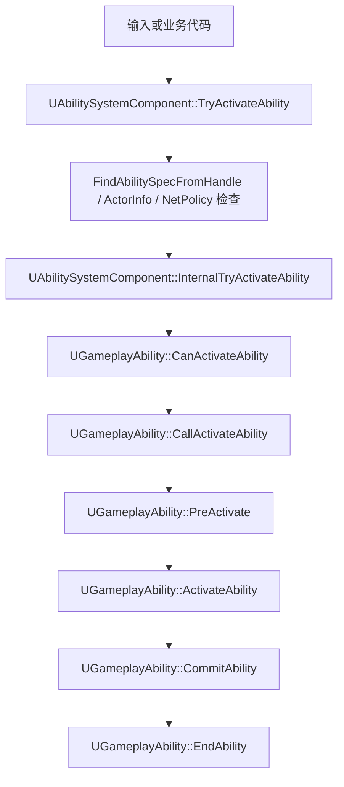
```mermaid
flowchart TD
    A["输入或业务代码"] --> B["UAbilitySystemComponent::TryActivateAbility"]
    B --> C["FindAbilitySpecFromHandle / ActorInfo / NetPolicy 检查"]
    C --> D["UAbilitySystemComponent::InternalTryActivateAbility"]
    D --> E["UGameplayAbility::CanActivateAbility"]
    E --> F["UGameplayAbility::CallActivateAbility"]
    F --> G["UGameplayAbility::PreActivate"]
    G --> H["UGameplayAbility::ActivateAbility"]
    H --> I["UGameplayAbility::CommitAbility"]
    I --> J["UGameplayAbility::EndAbility"]
```

## 步骤说明

1. 输入或业务代码调用 `TryActivateAbility(Handle)`，或调用 `TryActivateAbilitiesByTag` 间接按 tag 找 spec 后逐个调用 `TryActivateAbility`；源码路径：`Engine/Plugins/Runtime/GameplayAbilities/Source/GameplayAbilities/Private/AbilitySystemComponent_Abilities.cpp:1541`、`Engine/Plugins/Runtime/GameplayAbilities/Source/GameplayAbilities/Private/AbilitySystemComponent_Abilities.cpp:1583`。
2. `TryActivateAbility` 先调用 `FindAbilitySpecFromHandle`，检查 spec 是否存在、是否 pending remove、Ability 是否有效、ActorInfo/Owner/Avatar 是否有效，且拒绝 simulated proxy；源码路径：`Engine/Plugins/Runtime/GameplayAbilities/Source/GameplayAbilities/Private/AbilitySystemComponent_Abilities.cpp:1585`、`:1593`、`:1607`、`:1618`。
3. `TryActivateAbility` 根据 Ability 的 NetExecutionPolicy 做远端转发或拒绝：非本地激活 LocalOnly/LocalPredicted 可调用 `ClientTryActivateAbility`，非 authority 激活 ServerOnly/ServerInitiated 可调用 `CallServerTryActivateAbility`；源码路径：`Engine/Plugins/Runtime/GameplayAbilities/Source/GameplayAbilities/Private/AbilitySystemComponent_Abilities.cpp:1624`、`:1626`、`:1639`。
4. 本地可执行时进入 `InternalTryActivateAbility`；源码路径：`Engine/Plugins/Runtime/GameplayAbilities/Source/GameplayAbilities/Private/AbilitySystemComponent_Abilities.cpp:1661`、`:1683`。
5. `InternalTryActivateAbility` 再次检查 handle、spec、ActorInfo、网络角色、NetExecutionPolicy；源码路径：`Engine/Plugins/Runtime/GameplayAbilities/Source/GameplayAbilities/Private/AbilitySystemComponent_Abilities.cpp:1689`、`:1695`、`:1705`、`:1727`、`:1742`。
6. 如果有 `TriggerEventData`，先调用 `ShouldAbilityRespondToEvent`；源码路径：`Engine/Plugins/Runtime/GameplayAbilities/Source/GameplayAbilities/Private/AbilitySystemComponent_Abilities.cpp:1779`。
7. `InternalTryActivateAbility` 调用 `AbilitySource->CanActivateAbility(...)`，失败时补充 failure tag 并 `NotifyAbilityFailed`；源码路径：`Engine/Plugins/Runtime/GameplayAbilities/Source/GameplayAbilities/Private/AbilitySystemComponent_Abilities.cpp:1791`。
8. `UGameplayAbility::CanActivateAbility` 会检查 Avatar/role、ASC、spec、用户激活抑制、cooldown、cost、tag requirements、blocked input ID 和 Blueprint `K2_CanActivateAbility`；源码路径：`Engine/Plugins/Runtime/GameplayAbilities/Source/GameplayAbilities/Private/Abilities/GameplayAbility.cpp:424`。
9. `InternalTryActivateAbility` 为 InstancedPerActor 防止重复激活，必要时 retrigger 旧实例；也会为 InstancedPerExecution 创建新实例；源码路径：`Engine/Plugins/Runtime/GameplayAbilities/Source/GameplayAbilities/Private/AbilitySystemComponent_Abilities.cpp:1810`、`:1893`、`:1939`。
10. 在 authority/LocalOnly 分支中，ASC 创建或沿用 prediction key，建立 `FScopedPredictionWindow`，然后调用 `CallActivateAbility`；源码路径：`Engine/Plugins/Runtime/GameplayAbilities/Source/GameplayAbilities/Private/AbilitySystemComponent_Abilities.cpp:1850`、`:1868`、`:1893`。
11. 在 LocalPredicted 分支中，ASC 创建预测窗口，调用 `CallServerTryActivateAbility` 通知服务器，并本地调用 `CallActivateAbility`；源码路径：`Engine/Plugins/Runtime/GameplayAbilities/Source/GameplayAbilities/Private/AbilitySystemComponent_Abilities.cpp:1904`、`:1921`、`:1927`、`:1939`。
12. `UGameplayAbility::CallActivateAbility` 只做 `PreActivate` 然后调用 `ActivateAbility`；源码路径：`Engine/Plugins/Runtime/GameplayAbilities/Source/GameplayAbilities/Private/Abilities/GameplayAbility.cpp:1006`。
13. `UGameplayAbility::ActivateAbility` 对蓝图 Ability 调用 `K2_ActivateAbility` 或 `K2_ActivateAbilityFromEvent`；源码注释明确 Blueprint Activate 必须在执行链某处调用 `CommitAbility`，Native 子类 override 也应自行调用并检查结果；源码路径：`Engine/Plugins/Runtime/GameplayAbilities/Source/GameplayAbilities/Private/Abilities/GameplayAbility.cpp:884`。
14. `UGameplayAbility::CommitAbility` 先 `CommitCheck`，然后 `CommitExecute`、`K2_CommitExecute`，最后通知 ASC `NotifyAbilityCommit`；源码路径：`Engine/Plugins/Runtime/GameplayAbilities/Source/GameplayAbilities/Private/Abilities/GameplayAbility.cpp:559`。
15. `UGameplayAbility::EndAbility` 会调用 `K2_OnEndAbility`、清理 latent/timer、广播 ended delegate，并更新 ability active state；源码路径：`Engine/Plugins/Runtime/GameplayAbilities/Source/GameplayAbilities/Private/Abilities/GameplayAbility.cpp:769`。

## 伪代码

```cpp
bool BusinessOrInput(UAbilitySystemComponent* ASC, FGameplayAbilitySpecHandle Handle)
{
    return ASC->TryActivateAbility(Handle);
}

bool UAbilitySystemComponent::TryActivateAbility(Handle)
{
    Spec = FindAbilitySpecFromHandle(Handle);
    if (!Spec || Spec->PendingRemove || !Spec->Ability) return false;
    if (!AbilityActorInfo || !OwnerActor || !AvatarActor) return false;
    if (AvatarIsSimulatedProxy) return false;

    if (NeedsRemoteClientActivation) return ClientTryActivateAbility(Handle), true;
    if (NeedsServerActivation)
    {
        if (Spec->Ability->CanActivateAbility(...))
        {
            CallServerTryActivateAbility(Handle, Spec->InputPressed, NoPredictionKey);
            return true;
        }
        NotifyAbilityFailed(...);
        return false;
    }

    return InternalTryActivateAbility(Handle);
}

bool UAbilitySystemComponent::InternalTryActivateAbility(Handle, PredictionKey, ...)
{
    Spec = FindAbilitySpecFromHandle(Handle);
    if (!Spec || !ActorInfo || !Spec->Ability) return false;
    if (!NetworkPolicyAllowsThisContext) return false;
    if (TriggerEventData && !Ability->ShouldAbilityRespondToEvent(...)) return false;
    if (!AbilitySource->CanActivateAbility(...)) return false;

    ActivationInfo = FGameplayAbilityActivationInfo(OwnerActor);

    if (AuthorityOrLocalOnly)
    {
        FScopedPredictionWindow Window(this, ActivationInfo.GetActivationPredictionKey());
        AbilitySourceOrInstance->CallActivateAbility(...);
    }
    else if (LocalPredicted)
    {
        FScopedPredictionWindow Window(this, true);
        ActivationInfo.SetPredicting(ScopedPredictionKey);
        CallServerTryActivateAbility(...);
        AbilitySourceOrInstance->CallActivateAbility(...);
    }

    MarkAbilitySpecDirty(*Spec);
    return true;
}

void UGameplayAbility::CallActivateAbility(...)
{
    PreActivate(...);
    ActivateAbility(...);
}

void UGameplayAbility::ActivateAbility(...)
{
    // Blueprint 或 C++ 子类必须在合适时机调用 CommitAbility。
    if (!CommitAbility(...))
    {
        EndAbility(..., bWasCancelled=true);
    }
}
```

## 本轮未确认

- `CommitAbility` 何时调用由具体 Ability 实现决定；源码只规定 Blueprint/C++ ActivateAbility 应调用它，但 ASC 激活链不会自动替业务 Ability 调用；源码路径：`Engine/Plugins/Runtime/GameplayAbilities/Source/GameplayAbilities/Private/Abilities/GameplayAbility.cpp:884`。
- 完整网络预测、RPC batch、target data replicate、prediction key catch-up 流程未展开，未确认。

# 调用链：UGameplayAbility 生命周期细化（第三轮）

本轮从第二轮的 ASC 激活链继续往下展开，重点区分 ASC 负责的步骤与 Ability 负责的步骤。

## 更完整流程图

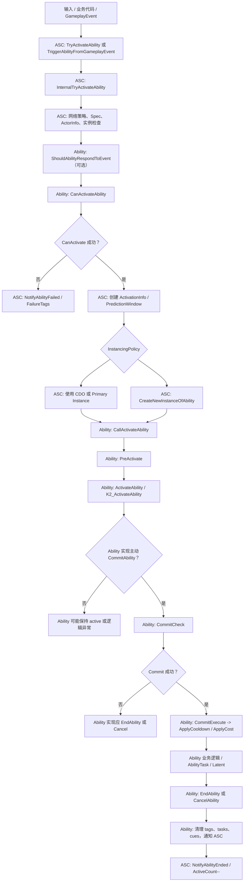
```mermaid
flowchart TD
    A["输入 / 业务代码 / GameplayEvent"] --> B["ASC: TryActivateAbility 或 TriggerAbilityFromGameplayEvent"]
    B --> C["ASC: InternalTryActivateAbility"]
    C --> D["ASC: 网络策略、Spec、ActorInfo、实例检查"]
    D --> E["Ability: ShouldAbilityRespondToEvent（可选）"]
    E --> F["Ability: CanActivateAbility"]
    F --> G{"CanActivate 成功？"}
    G -- "否" --> H["ASC: NotifyAbilityFailed / FailureTags"]
    G -- "是" --> I["ASC: 创建 ActivationInfo / PredictionWindow"]
    I --> J{"InstancingPolicy"}
    J --> K["ASC: 使用 CDO 或 Primary Instance"]
    J --> L["ASC: CreateNewInstanceOfAbility"]
    K --> M["Ability: CallActivateAbility"]
    L --> M
    M --> N["Ability: PreActivate"]
    N --> O["Ability: ActivateAbility / K2_ActivateAbility"]
    O --> P{"Ability 实现主动 CommitAbility？"}
    P -- "否" --> Q["Ability 可能保持 active 或逻辑异常"]
    P -- "是" --> R["Ability: CommitCheck"]
    R --> S{"Commit 成功？"}
    S -- "否" --> T["Ability 实现应 EndAbility 或 Cancel"]
    S -- "是" --> U["Ability: CommitExecute -> ApplyCooldown / ApplyCost"]
    U --> V["Ability 业务逻辑 / AbilityTask / Latent"]
    V --> W["Ability: EndAbility 或 CancelAbility"]
    W --> X["Ability: 清理 tags、tasks、cues，通知 ASC"]
    X --> Y["ASC: NotifyAbilityEnded / ActiveCount--"]
```

## 责任边界

- ASC 负责查找 `FGameplayAbilitySpec`、检查 ActorInfo/网络角色、处理 NetExecutionPolicy、创建或选择 Ability 实例、创建 prediction window、调用 `CallActivateAbility`；源码路径：`Engine/Plugins/Runtime/GameplayAbilities/Source/GameplayAbilities/Private/AbilitySystemComponent_Abilities.cpp:1683`。
- Ability 负责 `CanActivateAbility` 的成本/冷却/Tag/Input/蓝图条件检查，以及 `PreActivate`、`ActivateAbility`、主动 `CommitAbility`、主动 `EndAbility`；源码路径：`Engine/Plugins/Runtime/GameplayAbilities/Source/GameplayAbilities/Private/Abilities/GameplayAbility.cpp:424`、`:920`、`:884`、`:559`、`:769`。
- `CommitAbility` 不是 ASC 自动调用；源码注释明确 Blueprint Activate 图和 Native override 应调用 `CommitAbility`，历史上自动调用会让调用方无法知道结果；源码路径：`Engine/Plugins/Runtime/GameplayAbilities/Source/GameplayAbilities/Public/Abilities/GameplayAbility.h:577`、`Engine/Plugins/Runtime/GameplayAbilities/Source/GameplayAbilities/Private/Abilities/GameplayAbility.cpp:903`。

## 步骤标注

1. ASC 进入 `InternalTryActivateAbility`，注释明确该函数调用 `CanActivateAbility`、处理实例化、网络和预测，成功后调用 `CallActivateAbility`；源码路径：`Engine/Plugins/Runtime/GameplayAbilities/Source/GameplayAbilities/Private/AbilitySystemComponent_Abilities.cpp:1676`。
2. ASC 检查 handle、spec、AbilityActorInfo、Owner/Avatar、网络角色与 NetExecutionPolicy；源码路径：`Engine/Plugins/Runtime/GameplayAbilities/Source/GameplayAbilities/Private/AbilitySystemComponent_Abilities.cpp:1689`、`:1695`、`:1705`、`:1727`、`:1742`。
3. 如果带 `TriggerEventData`，Ability 先执行 `ShouldAbilityRespondToEvent`；源码路径：`Engine/Plugins/Runtime/GameplayAbilities/Source/GameplayAbilities/Private/AbilitySystemComponent_Abilities.cpp:1779`、`Engine/Plugins/Runtime/GameplayAbilities/Source/GameplayAbilities/Private/Abilities/GameplayAbility.cpp:545`。
4. Ability 执行 `CanActivateAbility`，检查 Avatar/role、ASC、Spec、用户激活抑制、Cooldown、Cost、Tag Requirements、Input block、Blueprint `K2_CanActivateAbility`；源码路径：`Engine/Plugins/Runtime/GameplayAbilities/Source/GameplayAbilities/Private/Abilities/GameplayAbility.cpp:424`。
5. ASC 根据实例化策略使用 primary instance、CDO 或 `CreateNewInstanceOfAbility`；源码路径：`Engine/Plugins/Runtime/GameplayAbilities/Source/GameplayAbilities/Private/AbilitySystemComponent_Abilities.cpp:1775`、`:1810`、`:1893`、`:1939`。
6. ASC 在 authority/local-only 或 local-predicted 分支中创建 prediction window，并调用 Ability 的 `CallActivateAbility`；源码路径：`Engine/Plugins/Runtime/GameplayAbilities/Source/GameplayAbilities/Private/AbilitySystemComponent_Abilities.cpp:1850`、`:1904`。
7. Ability 的 `CallActivateAbility` 固定先 `PreActivate` 再 `ActivateAbility`；源码路径：`Engine/Plugins/Runtime/GameplayAbilities/Source/GameplayAbilities/Private/Abilities/GameplayAbility.cpp:1006`。
8. `PreActivate` 设置 CurrentInfo，添加 activation owned tags，通知 ASC activated，应用 block/cancel tags，最后增加 spec active count；源码路径：`Engine/Plugins/Runtime/GameplayAbilities/Source/GameplayAbilities/Private/Abilities/GameplayAbility.cpp:920`。
9. `ActivateAbility` 执行蓝图事件或 native override；源码注释要求业务实现调用 `CommitAbility` 并处理失败；源码路径：`Engine/Plugins/Runtime/GameplayAbilities/Source/GameplayAbilities/Private/Abilities/GameplayAbility.cpp:884`。
10. `CommitAbility` 做 `CommitCheck`，然后 `CommitExecute`，后者应用 cooldown 和 cost；源码路径：`Engine/Plugins/Runtime/GameplayAbilities/Source/GameplayAbilities/Private/Abilities/GameplayAbility.cpp:559`、`:651`。
11. `EndAbility` 清理 latent/timer、ActiveTasks、ActivationOwnedTags、tracked GameplayCues、blocking tags，并通知 ASC `NotifyAbilityEnded`；源码路径：`Engine/Plugins/Runtime/GameplayAbilities/Source/GameplayAbilities/Private/Abilities/GameplayAbility.cpp:769`。
12. ASC `NotifyAbilityEnded` 递减 `Spec->ActiveCount`，广播 ended delegate，并清理 InstancedPerExecution 实例；源码路径：`Engine/Plugins/Runtime/GameplayAbilities/Source/GameplayAbilities/Private/AbilitySystemComponent_Abilities.cpp:1201`。

## 简化伪代码

```cpp
// ASC 负责：找到 spec、网络/预测/实例化，然后进入 Ability。
bool UAbilitySystemComponent::InternalTryActivateAbility(Handle, PredictionKey, ...)
{
    Spec = FindAbilitySpecFromHandle(Handle);
    if (!Spec || !ActorInfo || !Spec->Ability) return false;
    if (!NetworkPolicyAllowsActivation) return false;
    if (TriggerEventData && !Ability->ShouldAbilityRespondToEvent(...)) return false;
    if (!AbilitySource->CanActivateAbility(...)) return false;

    ActivationInfo = FGameplayAbilityActivationInfo(OwnerActor);
    SetupPredictionWindowIfNeeded();

    AbilityInstanceOrCDO = SelectOrCreateInstance(Spec);
    AbilityInstanceOrCDO->CallActivateAbility(Handle, ActorInfo, ActivationInfo, EndDelegate, TriggerEventData);
    MarkAbilitySpecDirty(*Spec);
    return true;
}

// Ability 负责：预激活、业务激活、主动提交、主动结束。
void UGameplayAbility::CallActivateAbility(...)
{
    PreActivate(...);     // 设置 CurrentInfo、tags、block/cancel、ActiveCount
    ActivateAbility(...); // 业务逻辑入口
}

void MyAbility::ActivateAbility(...)
{
    if (!CommitAbility(Handle, ActorInfo, ActivationInfo))
    {
        EndAbility(Handle, ActorInfo, ActivationInfo, true, true);
        return;
    }

    // AbilityTask / GE / gameplay logic...
    // 逻辑完成时必须 EndAbility 或 CancelAbility。
}
```

## 第三轮未确认

- 完整预测失败后的回滚、`ClientActivateAbilityFailed` 到 Ability/Task 的所有清理路径未展开，未确认。
- AbilityTask 子类如何结束自身、如何等待 target data/input，本轮只分析 Ability 侧 owner 接口，未确认。

# GameplayEffect 应用调用链（第四轮）

完整专题见 `gameplay-effects.md`。

## ASC ApplyGameplayEffect 简化链

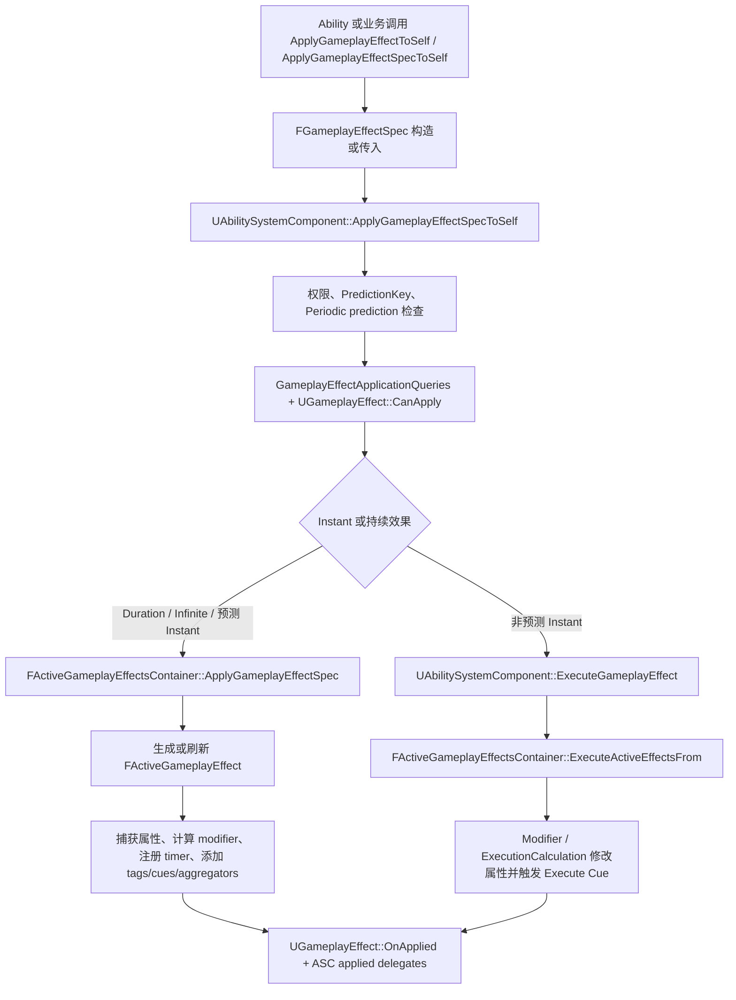
```mermaid
flowchart TD
    A["Ability 或业务调用 ApplyGameplayEffectToSelf / ApplyGameplayEffectSpecToSelf"] --> B["FGameplayEffectSpec 构造或传入"]
    B --> C["UAbilitySystemComponent::ApplyGameplayEffectSpecToSelf"]
    C --> D["权限、PredictionKey、Periodic prediction 检查"]
    D --> E["GameplayEffectApplicationQueries + UGameplayEffect::CanApply"]
    E --> F{"Instant 或持续效果"}
    F -->|Duration / Infinite / 预测 Instant| G["FActiveGameplayEffectsContainer::ApplyGameplayEffectSpec"]
    G --> H["生成或刷新 FActiveGameplayEffect"]
    H --> I["捕获属性、计算 modifier、注册 timer、添加 tags/cues/aggregators"]
    F -->|非预测 Instant| J["UAbilitySystemComponent::ExecuteGameplayEffect"]
    J --> K["FActiveGameplayEffectsContainer::ExecuteActiveEffectsFrom"]
    K --> L["Modifier / ExecutionCalculation 修改属性并触发 Execute Cue"]
    I --> M["UGameplayEffect::OnApplied + ASC applied delegates"]
    L --> M
```

- `UAbilitySystemComponent::MakeOutgoingSpec` 用 GE CDO、Context、Level 创建 `FGameplayEffectSpec`；源码路径：`Engine/Plugins/Runtime/GameplayAbilities/Source/GameplayAbilities/Private/AbilitySystemComponent.cpp:451`。
- `UAbilitySystemComponent::ApplyGameplayEffectSpecToSelf` 负责权限、预测、应用查询、`CanApply`、Instant vs ActiveGE 分支；源码路径：`Engine/Plugins/Runtime/GameplayAbilities/Source/GameplayAbilities/Private/AbilitySystemComponent.cpp:798`。
- `UGameplayEffect::CanApply` 遍历 `GEComponents` 的 `CanGameplayEffectApply`；源码路径：`Engine/Plugins/Runtime/GameplayAbilities/Source/GameplayAbilities/Private/GameplayEffect.cpp:881`。
- `FActiveGameplayEffectsContainer::ApplyGameplayEffectSpec` 负责 stacking、`FActiveGameplayEffect` 生成、target 捕获、modifier 计算、duration/period timer、dirty 标记和 added 事件；源码路径：`Engine/Plugins/Runtime/GameplayAbilities/Source/GameplayAbilities/Private/GameplayEffect.cpp:3989`。
- `FActiveGameplayEffectsContainer::ExecuteActiveEffectsFrom` 负责 Instant/Periodic 的 Modifier 和 ExecutionCalculation 执行；源码路径：`Engine/Plugins/Runtime/GameplayAbilities/Source/GameplayAbilities/Private/GameplayEffect.cpp:3065`。
- `FActiveGameplayEffectsContainer::InternalExecuteMod` 负责把 evaluated modifier 应用到 AttributeSet，并触发 `PreGameplayEffectExecute` / `PostGameplayEffectExecute`；源码路径：`Engine/Plugins/Runtime/GameplayAbilities/Source/GameplayAbilities/Private/GameplayEffect.cpp:3907`、`Engine/Plugins/Runtime/GameplayAbilities/Source/GameplayAbilities/Public/AttributeSet.h:198`、`:204`。

## Cost / Cooldown Commit 链

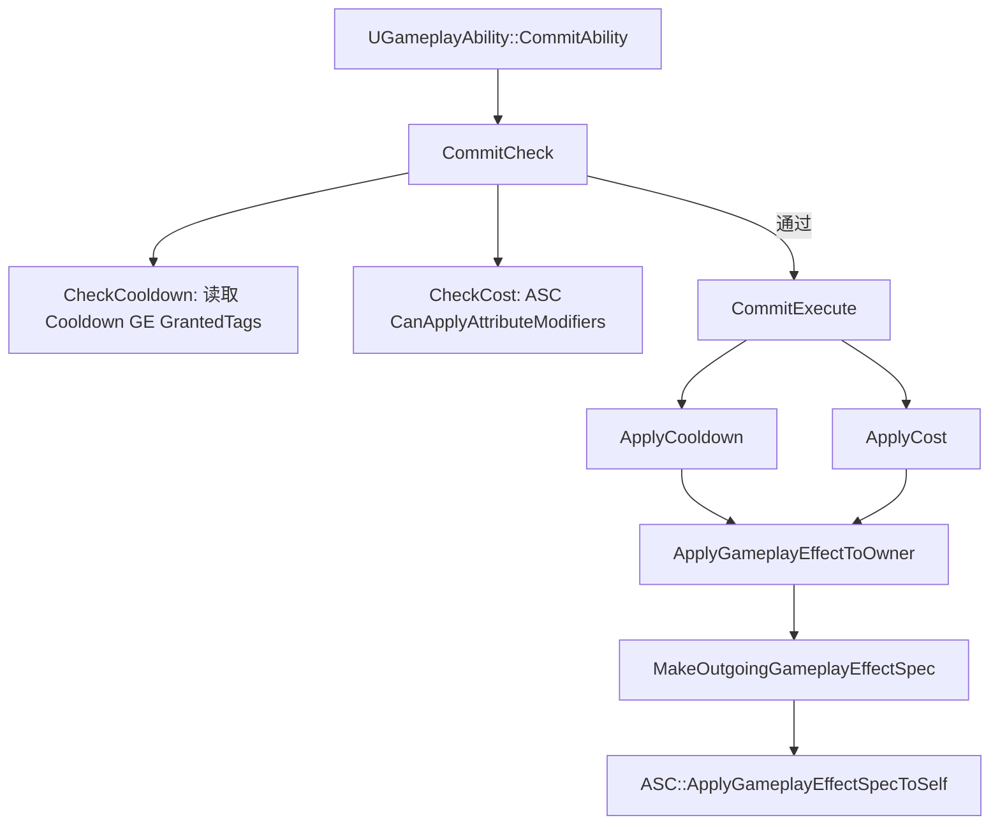
```mermaid
flowchart TD
    A["UGameplayAbility::CommitAbility"] --> B["CommitCheck"]
    B --> C["CheckCooldown: 读取 Cooldown GE GrantedTags"]
    B --> D["CheckCost: ASC CanApplyAttributeModifiers"]
    B -->|通过| E["CommitExecute"]
    E --> F["ApplyCooldown"]
    E --> G["ApplyCost"]
    F --> H["ApplyGameplayEffectToOwner"]
    G --> H
    H --> I["MakeOutgoingGameplayEffectSpec"]
    I --> J["ASC::ApplyGameplayEffectSpecToSelf"]
```

- `CommitAbility` 不由 ASC 自动调用，仍由 Ability 实现主动调用；源码路径：`Engine/Plugins/Runtime/GameplayAbilities/Source/GameplayAbilities/Private/Abilities/GameplayAbility.cpp:559`。
- `CommitCheck` 会在 commit 当下重新检查 cooldown/cost；源码路径：`Engine/Plugins/Runtime/GameplayAbilities/Source/GameplayAbilities/Private/Abilities/GameplayAbility.cpp:615`。
- `CheckCooldown` 默认依赖 Cooldown GE 的 `GetGrantedTags()`，所以 cooldown GE 通常需要授予冷却 tag；源码路径：`Engine/Plugins/Runtime/GameplayAbilities/Source/GameplayAbilities/Private/Abilities/GameplayAbility.cpp:1050`、`:1197`。
- `CheckCost` 依赖 ASC `CanApplyAttributeModifiers`，该函数只对 additive cost 做当前值加 cost 小于 0 的失败判断；源码路径：`Engine/Plugins/Runtime/GameplayAbilities/Source/GameplayAbilities/Private/Abilities/GameplayAbility.cpp:1092`、`Engine/Plugins/Runtime/GameplayAbilities/Source/GameplayAbilities/Private/GameplayEffect.cpp:5177`。

## 第四轮未确认

- GameplayEffect 预测失败、服务器纠正、客户端回滚的完整路径未展开，未确认。
- GameplayCue 的完整 manager 路由和 GameplayCueNotify 加载/匹配规则未展开，未确认。

# Attribute 修改调用链（第五轮）

完整专题见 `attributes.md`。本节只保留从 GameplayEffect 到 AttributeSet/Delegate/Replication 的主链路。

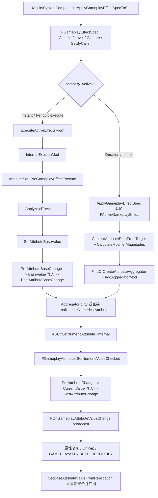
```mermaid
flowchart TD
    A["UAbilitySystemComponent::ApplyGameplayEffectSpecToSelf"] --> B["FGameplayEffectSpec: Context / Level / Capture / SetByCaller"]
    B --> C{"Instant 或 ActiveGE"}
    C -->|Instant / Periodic execute| D["ExecuteActiveEffectsFrom"]
    D --> E["InternalExecuteMod"]
    E --> F["AttributeSet::PreGameplayEffectExecute"]
    F --> G["ApplyModToAttribute"]
    G --> H["SetAttributeBaseValue"]
    H --> I["PreAttributeBaseChange -> BaseValue 写入 -> PostAttributeBaseChange"]
    I --> J["Aggregator dirty 或直接 InternalUpdateNumericalAttribute"]
    C -->|Duration / Infinite| K["ApplyGameplayEffectSpec 添加 FActiveGameplayEffect"]
    K --> L["CaptureAttributeDataFromTarget + CalculateModifierMagnitudes"]
    L --> M["FindOrCreateAttributeAggregator + AddAggregatorMod"]
    M --> J
    J --> N["ASC::SetNumericAttribute_Internal"]
    N --> O["FGameplayAttribute::SetNumericValueChecked"]
    O --> P["PreAttributeChange -> CurrentValue 写入 -> PostAttributeChange"]
    P --> Q["FOnGameplayAttributeValueChange broadcast"]
    Q --> R["属性复制 / OnRep / GAMEPLAYATTRIBUTE_REPNOTIFY"]
    R --> S["SetBaseAttributeValueFromReplication -> 重新聚合并广播"]
```

## 关键步骤标注

1. ASC `ApplyGameplayEffectSpecToSelf` 做权限、PredictionKey、GE CanApply、Instant vs ActiveGE 分支；源码路径：`Engine/Plugins/Runtime/GameplayAbilities/Source/GameplayAbilities/Private/AbilitySystemComponent.cpp:798`。
2. `MakeOutgoingSpec` 使用 GE CDO、Context、Level 构造 `FGameplayEffectSpec`；源码路径：`Engine/Plugins/Runtime/GameplayAbilities/Source/GameplayAbilities/Private/AbilitySystemComponent.cpp:451`。
3. Instant 非预测路径调用 `ExecuteGameplayEffect`，随后 ActiveGE 容器的 `ExecuteActiveEffectsFrom` 执行 modifiers/executions；源码路径：`Engine/Plugins/Runtime/GameplayAbilities/Source/GameplayAbilities/Private/AbilitySystemComponent.cpp:952`、`Engine/Plugins/Runtime/GameplayAbilities/Source/GameplayAbilities/Private/GameplayEffect.cpp:3065`。
4. `InternalExecuteMod` 构造 `FGameplayEffectModCallbackData`，调用 `PreGameplayEffectExecute`，再 `ApplyModToAttribute`，最后 `PostGameplayEffectExecute`；源码路径：`Engine/Plugins/Runtime/GameplayAbilities/Source/GameplayAbilities/Private/GameplayEffect.cpp:3907`、`Engine/Plugins/Runtime/GameplayAbilities/Source/GameplayAbilities/Public/GameplayEffectExtension.h:17`。
5. `ApplyModToAttribute` 根据当前 base 和 mod op 算出新 base，并调用 `SetAttributeBaseValue`；源码路径：`Engine/Plugins/Runtime/GameplayAbilities/Source/GameplayAbilities/Private/GameplayEffect.cpp:3973`、`Engine/Plugins/Runtime/GameplayAbilities/Source/GameplayAbilities/Private/GameplayEffectAggregator.cpp:447`。
6. `SetAttributeBaseValue` 调用 `PreAttributeBaseChange`，更新 `FGameplayAttributeData::BaseValue` 或 aggregator base，再调用 `PostAttributeBaseChange`；源码路径：`Engine/Plugins/Runtime/GameplayAbilities/Source/GameplayAbilities/Private/GameplayEffect.cpp:3803`。
7. Duration / Infinite GE 添加 ActiveGE 后，会 capture target attributes、计算 modifier magnitude，并把 modifier 加到 `FAggregator`；源码路径：`Engine/Plugins/Runtime/GameplayAbilities/Source/GameplayAbilities/Private/GameplayEffect.cpp:4158`、`:4347`。
8. Aggregator dirty 后 `OnAttributeAggregatorDirty` 重新 Evaluate，并调用 `InternalUpdateNumericalAttribute`；源码路径：`Engine/Plugins/Runtime/GameplayAbilities/Source/GameplayAbilities/Private/GameplayEffect.cpp:3307`、`:3365`。
9. `InternalUpdateNumericalAttribute` 调 ASC `SetNumericAttribute_Internal`，后者通过 `FGameplayAttribute::SetNumericValueChecked` 写 current value，触发 `PreAttributeChange` / `PostAttributeChange`；源码路径：`Engine/Plugins/Runtime/GameplayAbilities/Source/GameplayAbilities/Private/GameplayEffect.cpp:3765`、`Engine/Plugins/Runtime/GameplayAbilities/Source/GameplayAbilities/Private/AbilitySystemComponent.cpp:402`、`Engine/Plugins/Runtime/GameplayAbilities/Source/GameplayAbilities/Private/AttributeSet.cpp:77`。
10. 同一函数会广播 `FOnGameplayAttributeValueChange`，参数是 `FOnAttributeChangeData`；源码路径：`Engine/Plugins/Runtime/GameplayAbilities/Source/GameplayAbilities/Private/GameplayEffect.cpp:3790`、`Engine/Plugins/Runtime/GameplayAbilities/Source/GameplayAbilities/Public/GameplayEffectTypes.h:1002`。
11. Attribute RepNotify 应调用 `GAMEPLAYATTRIBUTE_REPNOTIFY`，进入 ASC `SetBaseAttributeValueFromReplication` 后重新聚合 final/current value；源码路径：`Engine/Plugins/Runtime/GameplayAbilities/Source/GameplayAbilities/Public/AttributeSet.h:404`、`Engine/Plugins/Runtime/GameplayAbilities/Source/GameplayAbilities/Public/AbilitySystemComponent.h:812`、`Engine/Plugins/Runtime/GameplayAbilities/Source/GameplayAbilities/Private/GameplayEffect.cpp:3566`。

## 简化伪代码

```cpp
Handle = ASC.ApplyGameplayEffectSpecToSelf(Spec, PredictionKey);

if (Spec.Def->DurationPolicy == Instant && !bPredictedInstant)
{
    ActiveEffects.ExecuteActiveEffectsFrom(Spec);
    for (EvaluatedMod : ModifiersAndExecutions)
    {
        Data = FGameplayEffectModCallbackData(Spec, EvaluatedMod, ASC);
        if (!Set->PreGameplayEffectExecute(Data)) continue;

        ActiveEffects.ApplyModToAttribute(Attribute, Op, Magnitude, &Data);
        Set->PostGameplayEffectExecute(Data);
    }
}
else
{
    ActiveEffect = ActiveEffects.ApplyGameplayEffectSpec(Spec);
    ActiveEffect.Spec.CaptureAttributeDataFromTarget(ASC);
    ActiveEffect.Spec.CalculateModifierMagnitudes();
    Aggregator = ActiveEffects.FindOrCreateAttributeAggregator(Attribute);
    Aggregator.AddAggregatorMod(Magnitude, Op, Channel, SourceTags, TargetTags, bPredicted, Handle);
}

// Attribute writeback
ActiveEffects.InternalUpdateNumericalAttribute(Attribute, NewCurrent, ModData);
```

## BaseValue 与 CurrentValue

- `BaseValue` 是永久基础值，`CurrentValue` 包含临时 buff；源码路径：`Engine/Plugins/Runtime/GameplayAbilities/Source/GameplayAbilities/Public/AttributeSet.h:34`、`:40`。
- `GetNumericAttribute` 读取 current/final value；源码路径：`Engine/Plugins/Runtime/GameplayAbilities/Source/GameplayAbilities/Private/AbilitySystemComponent.cpp:409`。
- `SetNumericAttributeBase` 修改 base value，现有 active modifiers 不清除；源码路径：`Engine/Plugins/Runtime/GameplayAbilities/Source/GameplayAbilities/Public/AbilitySystemComponent.h:224`。

## 第五轮未确认

- `FGameplayAttributeValueChange` 精确类型名未确认；源码确认的是 `FOnAttributeChangeData` / `FOnGameplayAttributeValueChange`；源码路径：`Engine/Plugins/Runtime/GameplayAbilities/Source/GameplayAbilities/Public/GameplayEffectTypes.h:1002`、`:1017`。
- 客户端预测失败后的 Attribute/GE/delegate 完整回滚链路未展开，未确认。

# AbilityTask 异步调用链（第六轮）

完整专题见 `ability-tasks.md`。本节保留 Ability 激活后进入异步任务的主链路。

## 生命周期主链

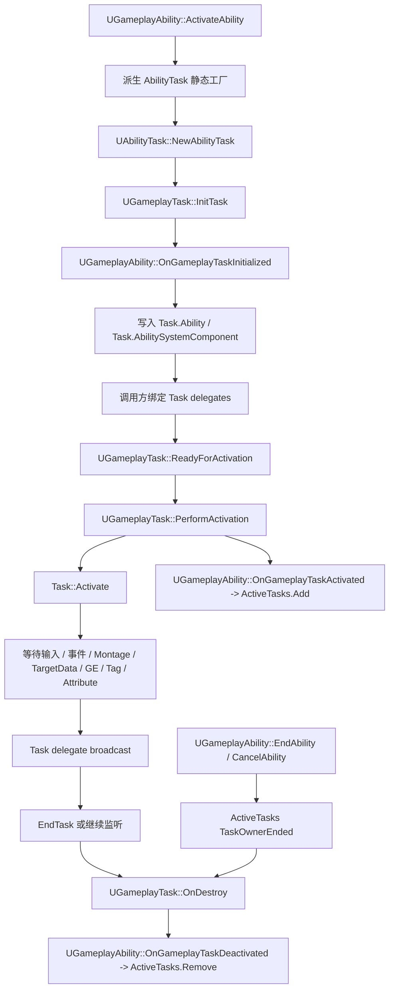
```mermaid
flowchart TD
    A["UGameplayAbility::ActivateAbility"] --> B["派生 AbilityTask 静态工厂"]
    B --> C["UAbilityTask::NewAbilityTask"]
    C --> D["UGameplayTask::InitTask"]
    D --> E["UGameplayAbility::OnGameplayTaskInitialized"]
    E --> F["写入 Task.Ability / Task.AbilitySystemComponent"]
    F --> G["调用方绑定 Task delegates"]
    G --> H["UGameplayTask::ReadyForActivation"]
    H --> I["UGameplayTask::PerformActivation"]
    I --> J["Task::Activate"]
    I --> K["UGameplayAbility::OnGameplayTaskActivated -> ActiveTasks.Add"]
    J --> L["等待输入 / 事件 / Montage / TargetData / GE / Tag / Attribute"]
    L --> M["Task delegate broadcast"]
    M --> N["EndTask 或继续监听"]
    N --> O["UGameplayTask::OnDestroy"]
    O --> P["UGameplayAbility::OnGameplayTaskDeactivated -> ActiveTasks.Remove"]
    Q["UGameplayAbility::EndAbility / CancelAbility"] --> R["ActiveTasks TaskOwnerEnded"]
    R --> O
```

- `NewAbilityTask` 创建并初始化 task owner，但不激活任务；源码路径：`Engine/Plugins/Runtime/GameplayAbilities/Source/GameplayAbilities/Public/Abilities/Tasks/AbilityTask.h:130`、`:135`。
- `ReadyForActivation` 进入 GameplayTask 激活流程，最终调用派生 `Activate`；源码路径：`Engine/Source/Runtime/GameplayTasks/Private/GameplayTask.cpp:58`、`:277`、`:289`。
- Ability 作为 task owner 在初始化时写入 ASC/Ability，并在激活/结束时维护 `ActiveTasks`；源码路径：`Engine/Plugins/Runtime/GameplayAbilities/Source/GameplayAbilities/Private/Abilities/GameplayAbility.cpp:1539`、`:1556`、`:1564`。
- Ability `EndAbility` 会对所有 `ActiveTasks` 调用 `TaskOwnerEnded`；源码路径：`Engine/Plugins/Runtime/GameplayAbilities/Source/GameplayAbilities/Private/Abilities/GameplayAbility.cpp:819`。

## 输入 Task 简化链

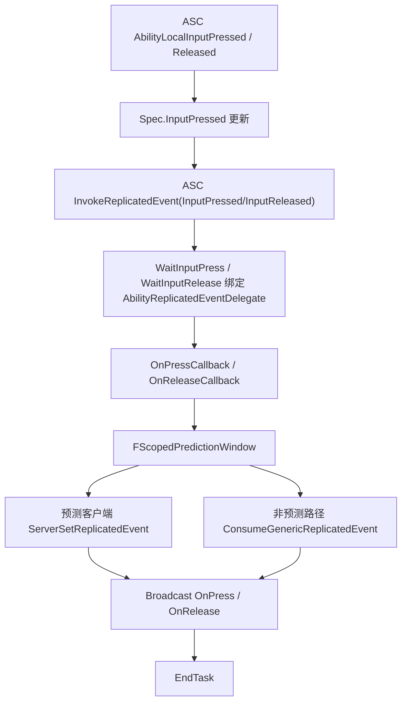
```mermaid
flowchart TD
    A["ASC AbilityLocalInputPressed / Released"] --> B["Spec.InputPressed 更新"]
    B --> C["ASC InvokeReplicatedEvent(InputPressed/InputReleased)"]
    C --> D["WaitInputPress / WaitInputRelease 绑定 AbilityReplicatedEventDelegate"]
    D --> E["OnPressCallback / OnReleaseCallback"]
    E --> F["FScopedPredictionWindow"]
    F --> G["预测客户端 ServerSetReplicatedEvent"]
    F --> H["非预测路径 ConsumeGenericReplicatedEvent"]
    G --> I["Broadcast OnPress / OnRelease"]
    H --> I
    I --> J["EndTask"]
```

- ASC 输入路径会触发 generic replicated event；源码路径：`Engine/Plugins/Runtime/GameplayAbilities/Source/GameplayAbilities/Private/AbilitySystemComponent_Abilities.cpp:2805`、`:2840`。
- `WaitInputPress` / `WaitInputRelease` 在回调中创建 prediction window，预测客户端把事件 RPC 到服务端，之后广播并结束；源码路径：`Engine/Plugins/Runtime/GameplayAbilities/Source/GameplayAbilities/Private/Abilities/Tasks/AbilityTask_WaitInputPress.cpp:16`、`:33`、`:45`、`Engine/Plugins/Runtime/GameplayAbilities/Source/GameplayAbilities/Private/Abilities/Tasks/AbilityTask_WaitInputRelease.cpp:16`、`:33`、`:45`。

## GameplayEvent Task 简化链

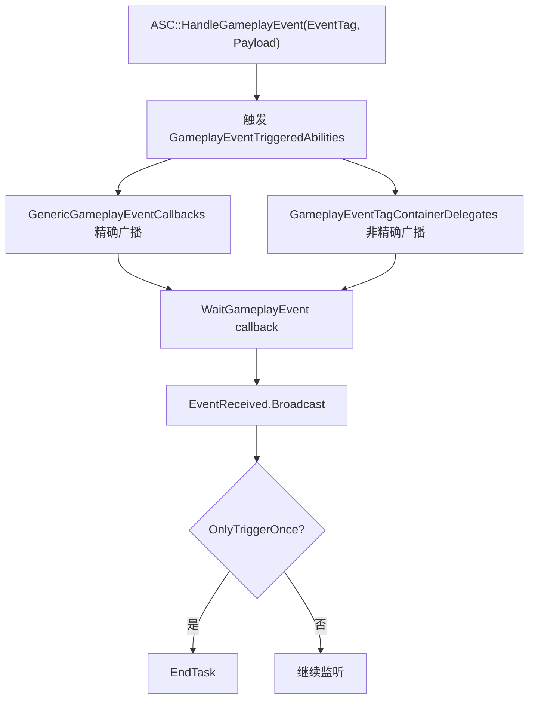
```mermaid
flowchart TD
    A["ASC::HandleGameplayEvent(EventTag, Payload)"] --> B["触发 GameplayEventTriggeredAbilities"]
    B --> C["GenericGameplayEventCallbacks 精确广播"]
    B --> D["GameplayEventTagContainerDelegates 非精确广播"]
    C --> E["WaitGameplayEvent callback"]
    D --> E
    E --> F["EventReceived.Broadcast"]
    F --> G{"OnlyTriggerOnce?"}
    G -->|是| H["EndTask"]
    G -->|否| I["继续监听"]
```

- `WaitGameplayEvent::Activate` 按 `OnlyMatchExact` 选择绑定 exact callback 或 tag container delegate；源码路径：`Engine/Plugins/Runtime/GameplayAbilities/Source/GameplayAbilities/Private/Abilities/Tasks/AbilityTask_WaitGameplayEvent.cpp:29`。
- ASC `HandleGameplayEvent` 同时处理 triggered abilities、exact callbacks 和 tag container delegates；源码路径：`Engine/Plugins/Runtime/GameplayAbilities/Source/GameplayAbilities/Private/AbilitySystemComponent_Abilities.cpp:2536`、`:2559`、`:2570`。

## Montage Task 简化链

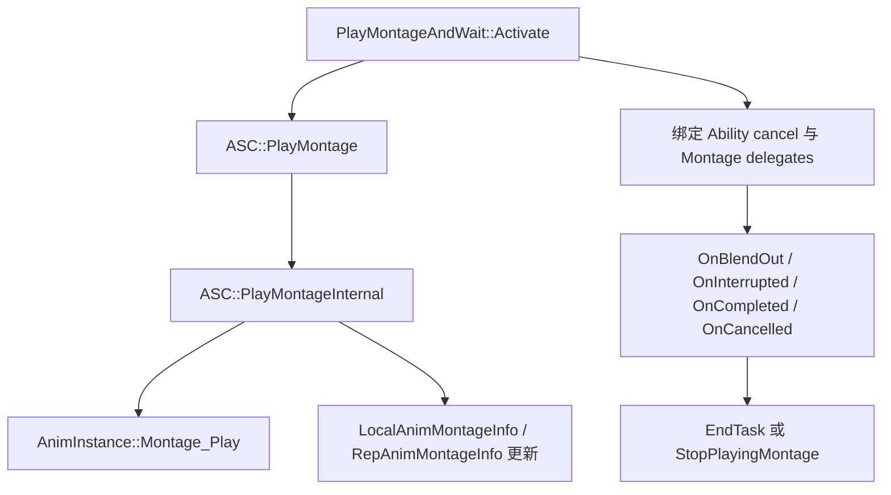
```mermaid
flowchart TD
    A["PlayMontageAndWait::Activate"] --> B["ASC::PlayMontage"]
    B --> C["ASC::PlayMontageInternal"]
    C --> D["AnimInstance::Montage_Play"]
    C --> E["LocalAnimMontageInfo / RepAnimMontageInfo 更新"]
    A --> F["绑定 Ability cancel 与 Montage delegates"]
    F --> G["OnBlendOut / OnInterrupted / OnCompleted / OnCancelled"]
    G --> H["EndTask 或 StopPlayingMontage"]
```

- Task 通过 ASC 播放 montage 并绑定 AnimInstance delegates；源码路径：`Engine/Plugins/Runtime/GameplayAbilities/Source/GameplayAbilities/Private/Abilities/Tasks/AbilityTask_PlayMontageAndWait.cpp:144`、`:152`、`:157`、`:160`。
- ASC 播放 montage 后更新本地/复制 montage 信息，并在预测播放时绑定 rejected delegate；源码路径：`Engine/Plugins/Runtime/GameplayAbilities/Source/GameplayAbilities/Private/AbilitySystemComponent_Abilities.cpp:3011`、`:3048`、`:3086`、`:3104`。
- Task 销毁时移除 cancel delegate，Ability 结束且 `bStopWhenAbilityEnds` 时停止当前 montage；源码路径：`Engine/Plugins/Runtime/GameplayAbilities/Source/GameplayAbilities/Private/Abilities/Tasks/AbilityTask_PlayMontageAndWait.cpp:204`、`:215`。

## TargetData Task 简化链

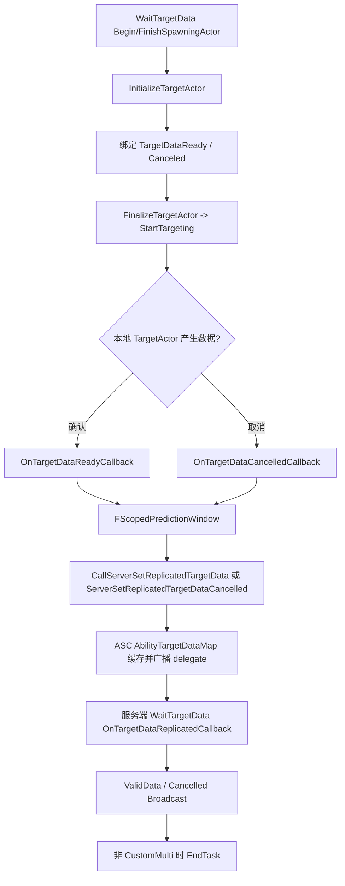
```mermaid
flowchart TD
    A["WaitTargetData Begin/FinishSpawningActor"] --> B["InitializeTargetActor"]
    B --> C["绑定 TargetDataReady / Canceled"]
    C --> D["FinalizeTargetActor -> StartTargeting"]
    D --> E{"本地 TargetActor 产生数据?"}
    E -->|确认| F["OnTargetDataReadyCallback"]
    E -->|取消| G["OnTargetDataCancelledCallback"]
    F --> H["FScopedPredictionWindow"]
    G --> H
    H --> I["CallServerSetReplicatedTargetData 或 ServerSetReplicatedTargetDataCancelled"]
    I --> J["ASC AbilityTargetDataMap 缓存并广播 delegate"]
    J --> K["服务端 WaitTargetData OnTargetDataReplicatedCallback"]
    K --> L["ValidData / Cancelled Broadcast"]
    L --> M["非 CustomMulti 时 EndTask"]
```

- TargetActor 初始化会绑定 `TargetDataReadyDelegate` / `CanceledDelegate`，并在 finalize 时 `StartTargeting`；源码路径：`Engine/Plugins/Runtime/GameplayAbilities/Source/GameplayAbilities/Private/Abilities/Tasks/AbilityTask_WaitTargetData.cpp:137`、`:145`、`:149`、`:158`。
- 远端服务端路径绑定 ASC `AbilityTargetDataSetDelegate` / `AbilityTargetDataCancelledDelegate` 并等待 remote player data；源码路径：`Engine/Plugins/Runtime/GameplayAbilities/Source/GameplayAbilities/Private/Abilities/Tasks/AbilityTask_WaitTargetData.cpp:211`、`:216`。
- 客户端确认/取消通过 ASC replicated target data RPC 或 generic confirm/cancel event 进入服务端；源码路径：`Engine/Plugins/Runtime/GameplayAbilities/Source/GameplayAbilities/Private/Abilities/Tasks/AbilityTask_WaitTargetData.cpp:288`、`:293`、`:323`、`:328`。

## 监听类 Task 主链

- GE applied task 绑定 ASC `OnGameplayEffectAppliedDelegateToSelf/Target` 或 periodic execute delegate；源码路径：`Engine/Plugins/Runtime/GameplayAbilities/Source/GameplayAbilities/Private/Abilities/Tasks/AbilityTask_WaitGameplayEffectApplied_Self.cpp:47`、`Engine/Plugins/Runtime/GameplayAbilities/Source/GameplayAbilities/Private/Abilities/Tasks/AbilityTask_WaitGameplayEffectApplied_Target.cpp:47`。
- GE removed/stack task 绑定 ActiveGE handle 对应的 removed/stack delegate；源码路径：`Engine/Plugins/Runtime/GameplayAbilities/Source/GameplayAbilities/Private/Abilities/Tasks/AbilityTask_WaitGameplayEffectRemoved.cpp:42`、`Engine/Plugins/Runtime/GameplayAbilities/Source/GameplayAbilities/Private/Abilities/Tasks/AbilityTask_WaitGameplayEffectStackChange.cpp:39`。
- Tag task 绑定 ASC `RegisterGameplayTagEvent`；源码路径：`Engine/Plugins/Runtime/GameplayAbilities/Source/GameplayAbilities/Private/Abilities/Tasks/AbilityTask_WaitGameplayTagBase.cpp:17`。
- Attribute task 绑定 ASC `GetGameplayAttributeValueChangeDelegate`；源码路径：`Engine/Plugins/Runtime/GameplayAbilities/Source/GameplayAbilities/Private/Abilities/Tasks/AbilityTask_WaitAttributeChange.cpp:49`。

## 第六轮未确认

- `UAbilityTask_WaitMontageNotify` 在 UE5.6 当前 Tasks 目录未找到，未确认。
- AbilityTask 预测失败后的完整自定义副作用回滚未展开，未确认。
- GameplayCue 专用异步流程未展开，未确认。

# GameplayCue 调用链（第七轮）

完整专题见 `gameplay-cues.md`。本节只保留 ASC 手动触发与 GameplayEffect 自动触发两条主链。

## ASC 手动触发 Cue

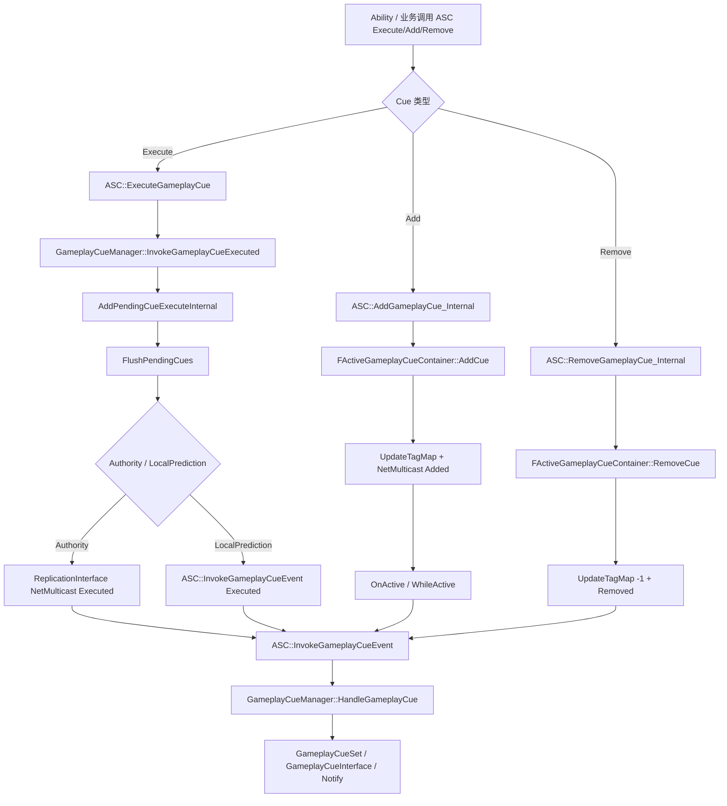
```mermaid
flowchart TD
    A["Ability / 业务调用 ASC Execute/Add/Remove"] --> B{"Cue 类型"}
    B -->|Execute| C["ASC::ExecuteGameplayCue"]
    C --> D["GameplayCueManager::InvokeGameplayCueExecuted"]
    D --> E["AddPendingCueExecuteInternal"]
    E --> F["FlushPendingCues"]
    F --> G{"Authority / LocalPrediction"}
    G -->|Authority| H["ReplicationInterface NetMulticast Executed"]
    G -->|LocalPrediction| I["ASC::InvokeGameplayCueEvent Executed"]
    B -->|Add| J["ASC::AddGameplayCue_Internal"]
    J --> K["FActiveGameplayCueContainer::AddCue"]
    K --> L["UpdateTagMap + NetMulticast Added"]
    L --> M["OnActive / WhileActive"]
    B -->|Remove| N["ASC::RemoveGameplayCue_Internal"]
    N --> O["FActiveGameplayCueContainer::RemoveCue"]
    O --> P["UpdateTagMap -1 + Removed"]
    H --> Q["ASC::InvokeGameplayCueEvent"]
    I --> Q
    M --> Q
    P --> Q
    Q --> R["GameplayCueManager::HandleGameplayCue"]
    R --> S["GameplayCueSet / GameplayCueInterface / Notify"]
```

- `ExecuteGameplayCue` 不直接路由 notify，而是交给 Manager wrapper，Manager 用 pending 队列和 `FlushPendingCues` 统一处理 RPC/预测本地执行；源码路径：`Engine/Plugins/Runtime/GameplayAbilities/Source/GameplayAbilities/Private/AbilitySystemComponent.cpp:1300`、`Engine/Plugins/Runtime/GameplayAbilities/Source/GameplayAbilities/Private/GameplayCueManager.cpp:1417`、`:1467`、`:1500`。
- `AddGameplayCue` 会添加 `FActiveGameplayCue`、更新 ASC tag map，并通过 unreliable NetMulticast 触发 `OnActive`；第一次加入时还会本地触发 `WhileActive`；源码路径：`Engine/Plugins/Runtime/GameplayAbilities/Source/GameplayAbilities/Private/AbilitySystemComponent.cpp:1339`、`:1351`、`:1378`、`:1385`。
- `RemoveGameplayCue` 由 `FActiveGameplayCueContainer::RemoveCue` 更新 tag count 并触发 `Removed`；源码路径：`Engine/Plugins/Runtime/GameplayAbilities/Source/GameplayAbilities/Private/AbilitySystemComponent.cpp:1411`、`Engine/Plugins/Runtime/GameplayAbilities/Source/GameplayAbilities/Private/GameplayCueInterface.cpp:330`、`:375`。
- `InvokeGameplayCueEvent` 最终把 AvatarActor、cue tag、事件类型和参数传给 `UGameplayCueManager::HandleGameplayCue`；源码路径：`Engine/Plugins/Runtime/GameplayAbilities/Source/GameplayAbilities/Private/AbilitySystemComponent.cpp:1287`、`:1295`。

## GameplayEffect 触发 Cue

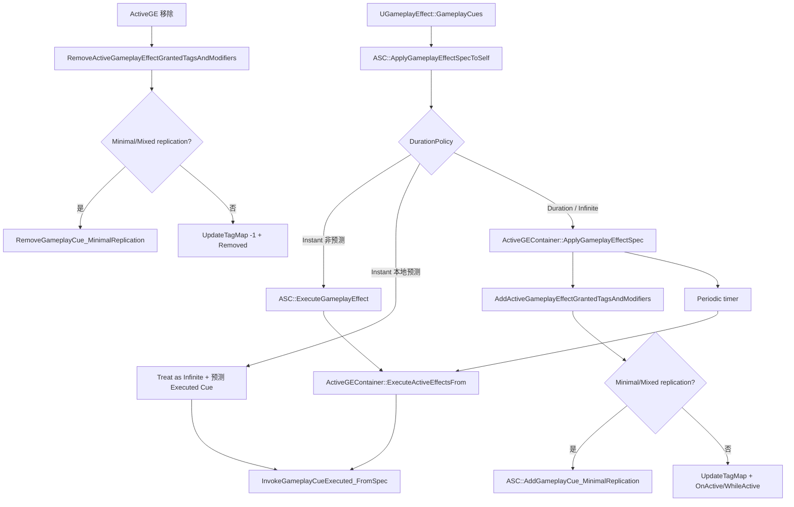
```mermaid
flowchart TD
    A["UGameplayEffect::GameplayCues"] --> B["ASC::ApplyGameplayEffectSpecToSelf"]
    B --> C{"DurationPolicy"}
    C -->|Instant 非预测| D["ASC::ExecuteGameplayEffect"]
    D --> E["ActiveGEContainer::ExecuteActiveEffectsFrom"]
    E --> F["InvokeGameplayCueExecuted_FromSpec"]
    C -->|Instant 本地预测| G["Treat as Infinite + 预测 Executed Cue"]
    G --> F
    C -->|Duration / Infinite| H["ActiveGEContainer::ApplyGameplayEffectSpec"]
    H --> I["AddActiveGameplayEffectGrantedTagsAndModifiers"]
    I --> J{"Minimal/Mixed replication?"}
    J -->|是| K["ASC::AddGameplayCue_MinimalReplication"]
    J -->|否| L["UpdateTagMap + OnActive/WhileActive"]
    H --> M["Periodic timer"]
    M --> E
    N["ActiveGE 移除"] --> O["RemoveActiveGameplayEffectGrantedTagsAndModifiers"]
    O --> P{"Minimal/Mixed replication?"}
    P -->|是| Q["RemoveGameplayCue_MinimalReplication"]
    P -->|否| R["UpdateTagMap -1 + Removed"]
```

- Instant 非预测 GE 通过 `ExecuteGameplayEffect -> ExecuteActiveEffectsFrom` 触发 `Executed` cue；源码路径：`Engine/Plugins/Runtime/GameplayAbilities/Source/GameplayAbilities/Private/AbilitySystemComponent.cpp:950`、`:1000`、`Engine/Plugins/Runtime/GameplayAbilities/Source/GameplayAbilities/Private/GameplayEffect.cpp:3065`、`:3205`。
- 本地预测 Instant GE 会先按 Infinite duration 加入 ActiveGE，再显式预测 `Executed` cue；源码路径：`Engine/Plugins/Runtime/GameplayAbilities/Source/GameplayAbilities/Private/AbilitySystemComponent.cpp:862`、`:940`、`:945`。
- Duration/Infinite GE 添加时，非 minimal 路径会对 cue tags 做 pseudo-add 并触发 `OnActive`/`WhileActive`；minimal/mixed 路径会调用 `AddGameplayCue_MinimalReplication`；源码路径：`Engine/Plugins/Runtime/GameplayAbilities/Source/GameplayAbilities/Private/GameplayEffect.cpp:4411`、`:4418`、`:4424`、`:4429`、`:4434`。
- ActiveGE 移除时，非 minimal 路径做 pseudo-remove 并触发 `Removed`；minimal/mixed 路径走 `RemoveGameplayCue_MinimalReplication`；源码路径：`Engine/Plugins/Runtime/GameplayAbilities/Source/GameplayAbilities/Private/GameplayEffect.cpp:4714`、`:4720`、`:4724`、`:4729`、`:4734`。
- Periodic GE tick 调 `ExecutePeriodicGameplayEffect -> InternalExecutePeriodicGameplayEffect -> ExecuteActiveEffectsFrom`，因此可触发 `Executed` cue；源码路径：`Engine/Plugins/Runtime/GameplayAbilities/Source/GameplayAbilities/Private/AbilitySystemComponent.cpp:995`、`Engine/Plugins/Runtime/GameplayAbilities/Source/GameplayAbilities/Private/GameplayEffect.cpp:3227`、`:4464`、`:4486`。

## Manager 路由简化链

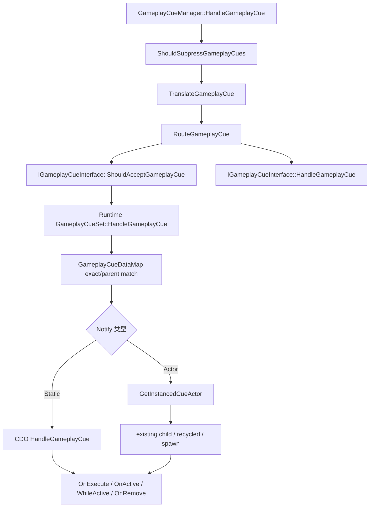
```mermaid
flowchart TD
    A["GameplayCueManager::HandleGameplayCue"] --> B["ShouldSuppressGameplayCues"]
    B --> C["TranslateGameplayCue"]
    C --> D["RouteGameplayCue"]
    D --> E["IGameplayCueInterface::ShouldAcceptGameplayCue"]
    E --> F["Runtime GameplayCueSet::HandleGameplayCue"]
    F --> G["GameplayCueDataMap exact/parent match"]
    G --> H{"Notify 类型"}
    H -->|Static| I["CDO HandleGameplayCue"]
    H -->|Actor| J["GetInstancedCueActor"]
    J --> K["existing child / recycled / spawn"]
    I --> L["OnExecute / OnActive / WhileActive / OnRemove"]
    K --> L
    D --> M["IGameplayCueInterface::HandleGameplayCue"]
```

- Manager 的 route 顺序是 suppression、translation、runtime CueSet、GameplayCueInterface；源码路径：`Engine/Plugins/Runtime/GameplayAbilities/Source/GameplayAbilities/Private/GameplayCueManager.cpp:140`、`:164`、`:169`、`:190`、`:235`、`:241`。
- CueSet 的加速 map 支持子 tag 回退父 tag；重复 exact notify 会被跳过，父级继续执行受 `IsOverride` 控制；源码路径：`Engine/Plugins/Runtime/GameplayAbilities/Source/GameplayAbilities/Private/GameplayCueSet.cpp:102`、`:312`、`:366`、`:386`、`:401`。

## 第七轮未确认

- 完整预测失败后的 GameplayCue 回滚、去重、重放规则未展开，未确认；源码路径：`Engine/Plugins/Runtime/GameplayAbilities/Source/GameplayAbilities/Private/AbilitySystemComponent.cpp:1797`。
- GameplayCue 编辑器工具和 Niagara/Audio 底层未展开，未确认；源码路径：`Engine/Plugins/Runtime/GameplayAbilities/Source/GameplayAbilitiesEditor/Private`、`Engine/Plugins/Runtime/GameplayAbilities/Source/GameplayAbilities/Private/GameplayCueNotifyTypes.cpp`。

# GAS 网络预测 / RPC / Replication 调用链（第八轮）

完整专题见 `networking-prediction.md`。本节只保留最常用的网络链路入口。

## LocalPredicted Ability 激活链

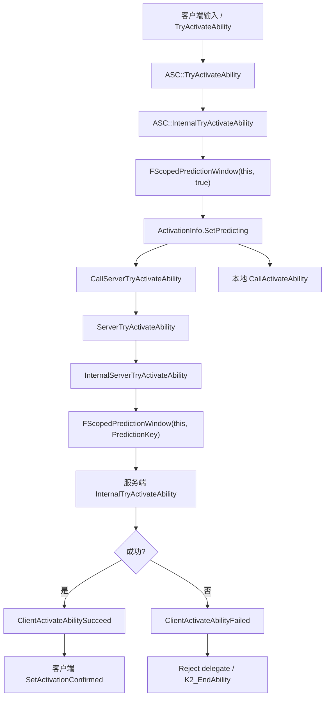
```mermaid
flowchart TD
    A["客户端输入 / TryActivateAbility"] --> B["ASC::TryActivateAbility"]
    B --> C["ASC::InternalTryActivateAbility"]
    C --> D["FScopedPredictionWindow(this, true)"]
    D --> E["ActivationInfo.SetPredicting"]
    E --> F["CallServerTryActivateAbility"]
    E --> G["本地 CallActivateAbility"]
    F --> H["ServerTryActivateAbility"]
    H --> I["InternalServerTryActivateAbility"]
    I --> J["FScopedPredictionWindow(this, PredictionKey)"]
    J --> K["服务端 InternalTryActivateAbility"]
    K --> L{"成功?"}
    L -->|"是"| M["ClientActivateAbilitySucceed"]
    L -->|"否"| N["ClientActivateAbilityFailed"]
    M --> O["客户端 SetActivationConfirmed"]
    N --> P["Reject delegate / K2_EndAbility"]
```

- 客户端 LocalPredicted 分支创建 prediction window、设置 `ActivationInfo.SetPredicting`、RPC 到服务端并本地激活；源码路径：`Engine/Plugins/Runtime/GameplayAbilities/Source/GameplayAbilities/Private/AbilitySystemComponent_Abilities.cpp:1904`、`:1922`、`:1924`、`:1926`。
- 服务端 `InternalServerTryActivateAbility` 使用客户端 key 创建服务端 prediction window，失败时调用 `ClientActivateAbilityFailed`；源码路径：`Engine/Plugins/Runtime/GameplayAbilities/Source/GameplayAbilities/Private/AbilitySystemComponent_Abilities.cpp:2026`、`:2070`、`:2088`。
- 客户端确认成功走 `ClientActivateAbilitySucceedWithEventData` 并设置 confirmed，失败走 rejected delegate 和 `K2_EndAbility`；源码路径：`Engine/Plugins/Runtime/GameplayAbilities/Source/GameplayAbilities/Private/AbilitySystemComponent_Abilities.cpp:2339`、`:2380`、`:2251`、`:2296`。

简化伪代码：

```cpp
if (Ability->NetExecutionPolicy == LocalPredicted)
{
    FScopedPredictionWindow Window(ASC, true);
    ActivationInfo.SetPredicting(ASC->ScopedPredictionKey);
    ASC->CallServerTryActivateAbility(Handle, ASC->ScopedPredictionKey);
    Ability->CallActivateAbility(Handle, ActorInfo, ActivationInfo, EventData);
}
```

## Generic Replicated Event 链

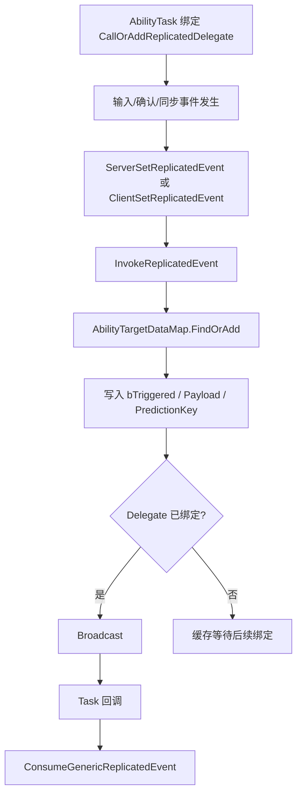
```mermaid
flowchart TD
    A["AbilityTask 绑定 CallOrAddReplicatedDelegate"] --> B["输入/确认/同步事件发生"]
    B --> C["ServerSetReplicatedEvent 或 ClientSetReplicatedEvent"]
    C --> D["InvokeReplicatedEvent"]
    D --> E["AbilityTargetDataMap.FindOrAdd"]
    E --> F["写入 bTriggered / Payload / PredictionKey"]
    F --> G{"Delegate 已绑定?"}
    G -->|"是"| H["Broadcast"]
    G -->|"否"| I["缓存等待后续绑定"]
    H --> J["Task 回调"]
    J --> K["ConsumeGenericReplicatedEvent"]
```

- `InvokeReplicatedEvent` 按 AbilitySpecHandle + PredictionKey 写缓存，已绑定 delegate 则立即广播；源码路径：`Engine/Plugins/Runtime/GameplayAbilities/Source/GameplayAbilities/Private/AbilitySystemComponent_Abilities.cpp:3886`。
- `CallOrAddReplicatedDelegate` 处理“事件先到”与“delegate 先绑定”两种顺序；源码路径：`Engine/Plugins/Runtime/GameplayAbilities/Source/GameplayAbilities/Private/AbilitySystemComponent_Abilities.cpp:4066`。
- `ConsumeGenericReplicatedEvent` 清除 triggered 状态，避免重复触发；源码路径：`Engine/Plugins/Runtime/GameplayAbilities/Source/GameplayAbilities/Private/AbilitySystemComponent_Abilities.cpp:3849`。

## TargetData 复制链

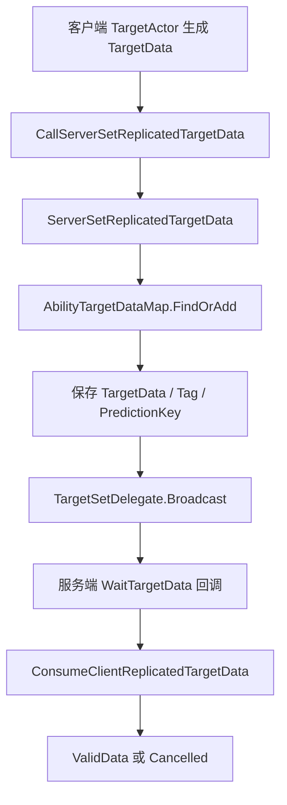
```mermaid
flowchart TD
    A["客户端 TargetActor 生成 TargetData"] --> B["CallServerSetReplicatedTargetData"]
    B --> C["ServerSetReplicatedTargetData"]
    C --> D["AbilityTargetDataMap.FindOrAdd"]
    D --> E["保存 TargetData / Tag / PredictionKey"]
    E --> F["TargetSetDelegate.Broadcast"]
    F --> G["服务端 WaitTargetData 回调"]
    G --> H["ConsumeClientReplicatedTargetData"]
    H --> I["ValidData 或 Cancelled"]
```

- `FGameplayAbilityTargetDataHandle` 通过 native `NetSerialize` 序列化多态 TargetData，缺少 native NetSerialize 的 struct 会报错；源码路径：`Engine/Plugins/Runtime/GameplayAbilities/Source/GameplayAbilities/Private/GameplayAbilityTargetTypes.cpp:183`、`:240`。
- `ServerSetReplicatedTargetData` 缓存 TargetData 并广播服务端 Task delegate；源码路径：`Engine/Plugins/Runtime/GameplayAbilities/Source/GameplayAbilities/Private/AbilitySystemComponent_Abilities.cpp:3945`、`:3968`。
- `WaitTargetData` 客户端确认时调用 `CallServerSetReplicatedTargetData`，服务端回调中消费数据；源码路径：`Engine/Plugins/Runtime/GameplayAbilities/Source/GameplayAbilities/Private/Abilities/Tasks/AbilityTask_WaitTargetData.cpp:211`、`:228`、`:288`。

## GameplayEffect 预测复制链

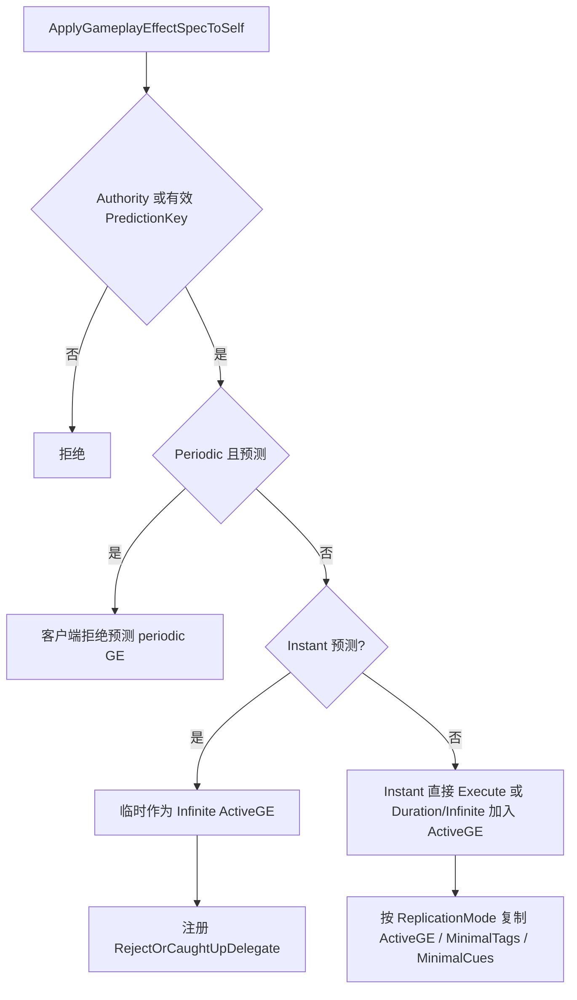
```mermaid
flowchart TD
    A["ApplyGameplayEffectSpecToSelf"] --> B{"Authority 或有效 PredictionKey"}
    B -->|"否"| C["拒绝"]
    B -->|"是"| D{"Periodic 且预测"}
    D -->|"是"| E["客户端拒绝预测 periodic GE"]
    D -->|"否"| F{"Instant 预测?"}
    F -->|"是"| G["临时作为 Infinite ActiveGE"]
    F -->|"否"| H["Instant 直接 Execute 或 Duration/Infinite 加入 ActiveGE"]
    G --> I["注册 RejectOrCaughtUpDelegate"]
    H --> J["按 ReplicationMode 复制 ActiveGE / MinimalTags / MinimalCues"]
```

- `ApplyGameplayEffectSpecToSelf` 要求 authority 或有效 prediction key；源码路径：`Engine/Plugins/Runtime/GameplayAbilities/Source/GameplayAbilities/Private/AbilitySystemComponent.cpp:812`。
- periodic GE 不预测，predicted instant GE 会临时作为 infinite ActiveGE；源码路径：`Engine/Plugins/Runtime/GameplayAbilities/Source/GameplayAbilities/Private/AbilitySystemComponent.cpp:821`、`:862`、`:910`。
- ActiveGE 复制条件由 `EGameplayEffectReplicationMode` 决定；源码路径：`Engine/Plugins/Runtime/GameplayAbilities/Source/GameplayAbilities/Private/GameplayEffect.cpp:4875`。

## PredictionKey 确认链

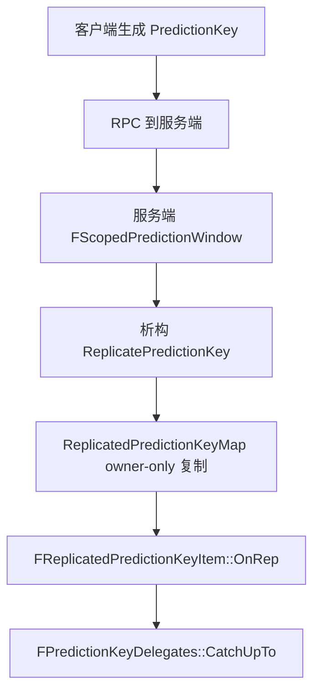
```mermaid
flowchart TD
    A["客户端生成 PredictionKey"] --> B["RPC 到服务端"]
    B --> C["服务端 FScopedPredictionWindow"]
    C --> D["析构 ReplicatePredictionKey"]
    D --> E["ReplicatedPredictionKeyMap owner-only 复制"]
    E --> F["FReplicatedPredictionKeyItem::OnRep"]
    F --> G["FPredictionKeyDelegates::CatchUpTo"]
```

- `ReplicatedPredictionKeyMap` 必须在 ASC replicated properties 最后，以保证 catch-up 时序；源码路径：`Engine/Plugins/Runtime/GameplayAbilities/Source/GameplayAbilities/Public/AbilitySystemComponent.h:1976`。
- `FReplicatedPredictionKeyItem::OnRep` 调用 `CatchUpTo`；源码路径：`Engine/Plugins/Runtime/GameplayAbilities/Source/GameplayAbilities/Private/GameplayPrediction.cpp:575`、`:595`。

## 第八轮未确认

- TargetActor 子类校验失败后的完整策略未展开，未确认。
- predicted GE / GameplayCue 的表现层完整回滚策略未展开，未确认。
- Montage prediction reject 的具体日志路径未完整定位，未确认。

# GAS 全局入口与蓝图 API 调用链（第九轮）

完整专题见 `globals-blueprint-library.md`。本节整理蓝图侧最常用的 ASC 获取、EffectContext/Spec、TargetData 与 GameplayCue 参数流。

## ASC 获取链

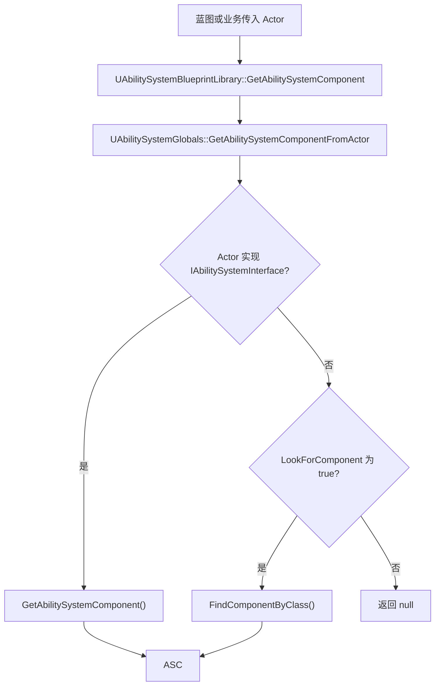
```mermaid
flowchart TD
    A["蓝图或业务传入 Actor"] --> B["UAbilitySystemBlueprintLibrary::GetAbilitySystemComponent"]
    B --> C["UAbilitySystemGlobals::GetAbilitySystemComponentFromActor"]
    C --> D{"Actor 实现 IAbilitySystemInterface?"}
    D -->|"是"| E["GetAbilitySystemComponent()"]
    D -->|"否"| F{"LookForComponent 为 true?"}
    F -->|"是"| G["FindComponentByClass<UAbilitySystemComponent>()"]
    F -->|"否"| H["返回 null"]
    E --> I["ASC"]
    G --> I
```

- 蓝图库 ASC 获取只是转发到 Globals；源码路径：`Engine/Plugins/Runtime/GameplayAbilities/Source/GameplayAbilities/Private/AbilitySystemBlueprintLibrary.cpp:77`。
- Globals 先查 `IAbilitySystemInterface`，再按需 fallback 到 Actor 组件；源码路径：`Engine/Plugins/Runtime/GameplayAbilities/Source/GameplayAbilities/Private/AbilitySystemGlobals.cpp:233`、`:240`、`:243`、`:247`、`:254`。
- `IAbilitySystemInterface` 明确允许返回另一个 Actor 上的 ASC，例如 Pawn 使用 PlayerState 的 component；源码路径：`Engine/Plugins/Runtime/GameplayAbilities/Source/GameplayAbilities/Public/AbilitySystemInterface.h:25`、`:26`。

简化伪代码：

```cpp
ASC = UAbilitySystemBlueprintLibrary::GetAbilitySystemComponent(Actor);
// 内部：
if (Actor implements IAbilitySystemInterface)
{
    return Actor->GetAbilitySystemComponent();
}
return Actor->FindComponentByClass<UAbilitySystemComponent>();
```

## 蓝图创建 Spec / Context 并应用 GE

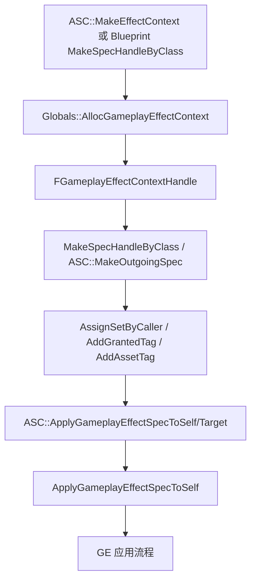
```mermaid
flowchart TD
    A["ASC::MakeEffectContext 或 Blueprint MakeSpecHandleByClass"] --> B["Globals::AllocGameplayEffectContext"]
    B --> C["FGameplayEffectContextHandle"]
    C --> D["MakeSpecHandleByClass / ASC::MakeOutgoingSpec"]
    D --> E["AssignSetByCaller / AddGrantedTag / AddAssetTag"]
    E --> F["ASC::ApplyGameplayEffectSpecToSelf/Target"]
    F --> G["ApplyGameplayEffectSpecToSelf"]
    G --> H["GE 应用流程"]
```

- ASC `MakeEffectContext` 通过 Globals 分配 context，并写入 owner/avatar 作为 instigator/effect causer；源码路径：`Engine/Plugins/Runtime/GameplayAbilities/Source/GameplayAbilities/Private/AbilitySystemComponent.cpp:470`、`:472`、`:477`。
- 蓝图库 `MakeSpecHandleByClass` 会分配 EffectContext、调用 `AddInstigator`，然后创建 `FGameplayEffectSpec`；源码路径：`Engine/Plugins/Runtime/GameplayAbilities/Source/GameplayAbilities/Private/AbilitySystemBlueprintLibrary.cpp:492`。
- SetByCaller 与 dynamic tags 在应用前写入 Spec；源码路径：`Engine/Plugins/Runtime/GameplayAbilities/Source/GameplayAbilities/Private/AbilitySystemBlueprintLibrary.cpp:985`、`:1004`、`:1034`、`:1064`。
- 真正应用 GE 的蓝图 callable 接口在 ASC 上；源码路径：`Engine/Plugins/Runtime/GameplayAbilities/Source/GameplayAbilities/Public/AbilitySystemComponent.h:327`、`:333`、`:790`、`:795`、`Engine/Plugins/Runtime/GameplayAbilities/Source/GameplayAbilities/Private/AbilitySystemComponent.cpp:973`、`:984`。

简化伪代码：

```cpp
SpecHandle = UAbilitySystemBlueprintLibrary::MakeSpecHandleByClass(GEClass, Instigator, Causer, Level);
SpecHandle = UAbilitySystemBlueprintLibrary::AssignTagSetByCallerMagnitude(SpecHandle, DataTag, Value);
SpecHandle = UAbilitySystemBlueprintLibrary::AddGrantedTag(SpecHandle, RuntimeGrantedTag);
ASC->BP_ApplyGameplayEffectSpecToTarget(SpecHandle, TargetASC);
```

## EffectContext 到 GameplayCueParameters

```mermaid
flowchart TD
    A["FGameplayEffectContextHandle"] --> B["FGameplayEffectSpec"]
    B --> C["UAbilitySystemGlobals::InitGameplayCueParameters_GESpec"]
    C --> D["复制 captured source/target tags"]
    C --> E["扫描 ModifiedAttributes 写 RawMagnitude"]
    C --> F["复制 EffectContext"]
    F --> G["FGameplayCueParameters"]
    G --> H["GameplayCueNotify 读取 Instigator / Causer / SourceObject / HitResult"]
```

- Globals 能从 `FGameplayEffectSpecForRPC`、`FGameplayEffectSpec` 或 `FGameplayEffectContextHandle` 初始化 Cue 参数；源码路径：`Engine/Plugins/Runtime/GameplayAbilities/Source/GameplayAbilities/Private/AbilitySystemGlobals.cpp:378`、`:387`、`:420`。
- 从 Spec 初始化时会复制 captured source/target tags，并基于 GE cue 的 `MagnitudeAttribute` 查找 `ModifiedAttributes` 写入 `RawMagnitude`；源码路径：`Engine/Plugins/Runtime/GameplayAbilities/Source/GameplayAbilities/Private/AbilitySystemGlobals.cpp:389`、`:393`、`:413`。
- Cue 参数读取 Instigator / EffectCauser / SourceObject 时优先显式字段，缺失时 fallback 到 EffectContext；源码路径：`Engine/Plugins/Runtime/GameplayAbilities/Source/GameplayAbilities/Private/GameplayEffectTypes.cpp:1284`、`:1295`、`:1306`。

## TargetData 蓝图与网络链

```mermaid
flowchart TD
    A["蓝图 AbilityTargetDataFromHitResult/Actor/Locations"] --> B["FGameplayAbilityTargetDataHandle"]
    B --> C["Append / Filter / 查询"]
    C --> D["WaitTargetData AbilityTask"]
    D --> E["客户端确认"]
    E --> F["CallServerSetReplicatedTargetData"]
    F --> G["ServerSetReplicatedTargetData"]
    G --> H["AbilityTargetDataMap"]
    H --> I["TargetSetDelegate"]
    I --> J["服务端 Task ConsumeClientReplicatedTargetData"]
```

- 蓝图库能从 actor、actor array、hit result、locations 创建 TargetData；源码路径：`Engine/Plugins/Runtime/GameplayAbilities/Source/GameplayAbilities/Private/AbilitySystemBlueprintLibrary.cpp:380`、`:393`、`:401`、`:515`。
- `FGameplayAbilityTargetDataHandle` 有 `Append`、`Clear`、`NetSerialize`；蓝图库确认提供 `AppendTargetDataHandle`，未确认提供蓝图 Clear 包装；源码路径：`Engine/Plugins/Runtime/GameplayAbilities/Source/GameplayAbilities/Public/Abilities/GameplayAbilityTargetTypes.h:215`、`:251`、`:257`、`Engine/Plugins/Runtime/GameplayAbilities/Source/GameplayAbilities/Public/AbilitySystemBlueprintLibrary.h:218`。
- WaitTargetData 通过 `CallServerSetReplicatedTargetData` 把客户端 TargetData 发给服务端，服务端缓存到 `AbilityTargetDataMap` 并广播 delegate；源码路径：`Engine/Plugins/Runtime/GameplayAbilities/Source/GameplayAbilities/Private/Abilities/Tasks/AbilityTask_WaitTargetData.cpp:288`、`Engine/Plugins/Runtime/GameplayAbilities/Source/GameplayAbilities/Private/AbilitySystemComponent_Abilities.cpp:3945`、`:3968`。

## 第九轮未确认

- `Public/GameplayAbilityTargetTypes.h` 未确认存在；本轮确认实际路径是 `Public/Abilities/GameplayAbilityTargetTypes.h`；源码路径：`Engine/Plugins/Runtime/GameplayAbilities/Source/GameplayAbilities/Public/Abilities/GameplayAbilityTargetTypes.h:193`。
- `UAbilitySystemBlueprintLibrary` 未确认有直接 `ClearTargetData`、`EffectContextAddSourceObject`、`EffectContextAddInstigator`、读取 SetByCaller magnitude 的蓝图函数；底层 C++ 类型存在部分能力；源码路径：`Engine/Plugins/Runtime/GameplayAbilities/Source/GameplayAbilities/Public/Abilities/GameplayAbilityTargetTypes.h:215`、`Engine/Plugins/Runtime/GameplayAbilities/Source/GameplayAbilities/Public/GameplayEffectTypes.h:544`、`:642`。

# GameplayAbilitiesEditor / Blueprint / K2 调用链（第十轮）

完整专题见 `editor-blueprint.md`。本节只记录编辑器侧注册、资产创建、K2 编译展开和 details customization 的关键链路。

## 编辑器模块启动注册链

```mermaid
flowchart TD
    A["FGameplayAbilitiesEditorModule::StartupModule"] --> B["RegisterCustomPropertyTypeLayout"]
    A --> C["RegisterCustomClassLayout"]
    A --> D["RegisterAssetTypeActions"]
    A --> E["RegisterVisualPinFactory"]
    A --> F["RegisterGameplayCueEditorTab"]
    A --> G["RegisterTrackEditor / ChannelInterface"]
    A --> H["RegisterAbilitySystemGlobals debug callbacks"]
```

- `GameplayAbilitiesEditor` 模块由 `IMPLEMENT_MODULE(FGameplayAbilitiesEditorModule, GameplayAbilitiesEditor)` 注册；源码路径：`Engine/Plugins/Runtime/GameplayAbilities/Source/GameplayAbilitiesEditor/Private/GameplayAbilitiesEditorModule.cpp:169`。
- `StartupModule` 注册 GameplayTag/Attribute/GE magnitude/Execution 等 property customization；源码路径：`Engine/Plugins/Runtime/GameplayAbilities/Source/GameplayAbilitiesEditor/Private/GameplayAbilitiesEditorModule.cpp:171`、`:175`、`:183`。
- `StartupModule` 注册 `GameplayEffect` class details customization 与 `FAssetTypeActions_GameplayAbilitiesBlueprint`；源码路径：`Engine/Plugins/Runtime/GameplayAbilities/Source/GameplayAbilitiesEditor/Private/GameplayAbilitiesEditorModule.cpp:185`、`:186`、`:190`。
- `StartupModule` 注册 Attribute pin factory、GameplayCue editor tab、AbilitySystemGlobals 的资产打开/查找回调、Sequencer cue track；源码路径：`Engine/Plugins/Runtime/GameplayAbilities/Source/GameplayAbilitiesEditor/Private/GameplayAbilitiesEditorModule.cpp:206`、`:213`、`:232`、`:239`。
- `ShutdownModule` 对应注销 settings、tag listener、pin factory、cue tab、debug callbacks、Sequencer track/channel；源码路径：`Engine/Plugins/Runtime/GameplayAbilities/Source/GameplayAbilitiesEditor/Private/GameplayAbilitiesEditorModule.cpp:303`、`:307`、`:319`、`:330`、`:341`、`:350`、`:356`、`:361`。

简化伪代码：

```cpp
void FGameplayAbilitiesEditorModule::StartupModule()
{
    PropertyModule.RegisterCustomPropertyTypeLayout(...);
    PropertyModule.RegisterCustomClassLayout("GameplayEffect", ...);
    AssetTools.RegisterAssetTypeActions(new FAssetTypeActions_GameplayAbilitiesBlueprint);
    FEdGraphUtilities::RegisterVisualPinFactory(AttributePinFactory);
    FGlobalTabmanager::RegisterNomadTabSpawner(GameplayCueAppIdentifier, ...);
    AbilitySystemGlobals.SetShouldUseAbilitySystemAssetCallbacks(...);
    SequencerModule.RegisterTrackEditor(...);
}
```

## GameplayAbility 蓝图创建链

```mermaid
flowchart TD
    A["内容浏览器创建 Gameplay Ability Blueprint"] --> B["UGameplayAbilitiesBlueprintFactory"]
    B --> C["选择/校验 ParentClass 是 UGameplayAbility 子类"]
    C --> D["FKismetEditorUtilities::CreateBlueprint"]
    D --> E["创建 Gameplay Ability Graph"]
    E --> F["添加 K2_ActivateAbility / K2_OnEndAbility 默认事件"]
    F --> G["FGameplayAbilitiesEditor 打开蓝图"]
```

- UE5.6 中确认类名是 `UGameplayAbilitiesBlueprintFactory`，不是请求中的单数 `UGameplayAbilityBlueprintFactory`；源码路径：`Engine/Plugins/Runtime/GameplayAbilities/Source/GameplayAbilitiesEditor/Public/GameplayAbilitiesBlueprintFactory.h:13`。
- 工厂默认 `ParentClass` 是 `UGameplayAbility::StaticClass()`，`SupportedClass` 是 `UGameplayAbilityBlueprint`；源码路径：`Engine/Plugins/Runtime/GameplayAbilities/Source/GameplayAbilitiesEditor/Private/GameplayAbilitiesBlueprintFactory.cpp:270`、`:271`。
- `FactoryCreateNew` 会拒绝无效或非 `UGameplayAbility` 子类 parent，然后创建 `UGameplayAbilityBlueprint`；源码路径：`Engine/Plugins/Runtime/GameplayAbilities/Source/GameplayAbilitiesEditor/Private/GameplayAbilitiesBlueprintFactory.cpp:280`、`:291`、`:300`。
- 工厂创建 `UGameplayAbilityGraph` / `UGameplayAbilityGraphSchema`，并添加 `K2_ActivateAbility` 与 `K2_OnEndAbility` 默认事件；源码路径：`Engine/Plugins/Runtime/GameplayAbilities/Source/GameplayAbilitiesEditor/Private/GameplayAbilitiesBlueprintFactory.cpp:310`、`:325`、`:326`。
- 资产动作打开时创建 `FGameplayAbilitiesEditor` 并调用 `InitGameplayAbilitiesEditor`；源码路径：`Engine/Plugins/Runtime/GameplayAbilities/Source/GameplayAbilitiesEditor/Private/AssetTypeActions_GameplayAbilitiesBlueprint.cpp:23`、`:43`、`:48`。

## AbilityTask 蓝图节点编译展开链

```mermaid
flowchart TD
    A["Ability 蓝图中放置 AbilityTask 节点"] --> B["UK2Node_LatentAbilityCall"]
    B --> C["筛选 UAbilityTask 静态工厂函数"]
    C --> D["为 BlueprintAssignable delegate 生成输出 exec pin"]
    D --> E["ExpandNode 生成静态工厂调用"]
    E --> F["绑定 delegate"]
    F --> G["调用 UGameplayTask::ReadyForActivation"]
    G --> H["运行时进入 UAbilityTask::Activate"]
```

- `UK2Node_LatentAbilityCall` 继承 GameplayTasksEditor 的 `UK2Node_LatentGameplayTaskCall`，专门处理 `UAbilityTask` 子类；源码路径：`Engine/Plugins/Runtime/GameplayAbilities/Source/GameplayAbilitiesEditor/Public/K2Node_LatentAbilityCall.h:16`、`Engine/Plugins/Runtime/GameplayAbilities/Source/GameplayAbilitiesEditor/Private/K2Node_LatentAbilityCall.cpp:30`。
- 节点只允许在 `UGameplayAbility` 蓝图的 Ubergraph / Macro graph 中使用；源码路径：`Engine/Plugins/Runtime/GameplayAbilities/Source/GameplayAbilitiesEditor/Private/K2Node_LatentAbilityCall.cpp:35`、`:56`。
- 节点通过 `RegisterClassFactoryActions<UAbilityTask>` 发现 AbilityTask 工厂函数，并缓存 factory function / proxy class；源码路径：`Engine/Plugins/Runtime/GameplayAbilities/Source/GameplayAbilitiesEditor/Private/K2Node_LatentAbilityCall.cpp:69`、`:77`。
- 基类 `UK2Node_LatentGameplayTaskCall` 将 activation 函数名设为 `UGameplayTask::ReadyForActivation`，展开时生成工厂调用、delegate 绑定和 activation 调用；源码路径：`Engine/Source/Editor/GameplayTasksEditor/Private/K2Node_LatentGameplayTaskCall.cpp:53`、`:563`、`:593`、`:657`、`:899`、`:900`。
- 自定义 AbilityTask 工厂函数若带 `BlueprintInternalUseOnly` / `HideThen` / `DefaultToSelf` 等元数据，会影响节点显示和校验；源码路径：`Engine/Plugins/Runtime/GameplayAbilities/Source/GameplayAbilitiesEditor/Private/K2Node_LatentAbilityCall.cpp:14`、`:90`、`:99`。

## GameplayCue 蓝图事件与 Notify 创建链

```mermaid
flowchart TD
    A["GameplayCueNotify 蓝图"] --> B["实现 IGameplayCueInterface"]
    B --> C["UK2Node_GameplayCueEvent 菜单"]
    C --> D["选择 GameplayCue.* tag"]
    D --> E["生成对应 Cue event node"]
    F["GameplayCue tag details"] --> G["SGameplayCueEditor"]
    G --> H["选择 Static / Actor Notify class"]
    H --> I["UBlueprintFactory 创建 Notify 蓝图资产"]
```

- `UK2Node_GameplayCueEvent` 兼容实现 `UGameplayCueInterface` 的蓝图类，并从 `GameplayCue` 根 tag 下生成事件节点；源码路径：`Engine/Plugins/Runtime/GameplayAbilities/Source/GameplayAbilitiesEditor/Private/K2Node_GameplayCueEvent.cpp:23`、`:50`、`:61`、`:80`、`:84`、`:87`、`:94`。
- `GameplayCueTagDetails` 使用 `GameplayCueManager->GetEditorCueSet()` 查找 tag 关联 notify，并提供 Add New / Open Notify 入口；源码路径：`Engine/Plugins/Runtime/GameplayAbilities/Source/GameplayAbilitiesEditor/Private/GameplayCueTagDetails.cpp:52`、`:94`、`:130`、`:145`、`:172`。
- `SGameplayCueEditor` 创建新 notify 时默认提供 `UGameplayCueNotify_Static` 与 `AGameplayCueNotify_Actor` 两类，并通过 `UBlueprintFactory` 创建资产；源码路径：`Engine/Plugins/Runtime/GameplayAbilities/Source/GameplayAbilitiesEditor/Private/SGameplayCueEditor.cpp:1389`、`:1400`、`:1404`、`:1405`、`:1432`、`:1434`。

## GameplayEffect / Attribute details 编辑链

- `FGameplayEffectDetails` 根据 DurationPolicy 和 Period 决定是否隐藏 DurationMagnitude、periodic inhibition、execute-on-application 等编辑项；源码路径：`Engine/Plugins/Runtime/GameplayAbilities/Source/GameplayAbilitiesEditor/Private/GameplayEffectDetails.cpp:20`、`:32`、`:48`、`:54`。
- `FGameplayEffectModifierMagnitudeDetails` 按 `EGameplayEffectMagnitudeCalculation` 只显示 ScalableFloat、AttributeBased、CustomCalculation 或 SetByCaller 对应编辑行；源码路径：`Engine/Plugins/Runtime/GameplayAbilities/Source/GameplayAbilitiesEditor/Private/GameplayEffectModifierMagnitudeDetails.cpp:28`、`:47`、`:54`、`:61`、`:68`。
- `FGameplayEffectExecutionDefinitionDetails` 会从 ExecutionCalculation CDO 同步 captured attributes 和 valid scoped modifier tags；源码路径：`Engine/Plugins/Runtime/GameplayAbilities/Source/GameplayAbilitiesEditor/Private/GameplayEffectExecutionDefinitionDetails.cpp:37`、`:91`、`:95`、`:101`。
- `FAttributePropertyDetails` 和 `SGameplayAttributeWidget` 扫描 `UAttributeSet` 派生类及属性，排除 `HideInDetailsView`，并提供复制引用与引用查看入口；源码路径：`Engine/Plugins/Runtime/GameplayAbilities/Source/GameplayAbilitiesEditor/Private/AttributeDetails.cpp:34`、`:46`、`:268`、`:274`、`:296`、`:395`、`:445`。

## 第十轮未确认

- 当前工作树未确认存在 `Engine/Plugins/Runtime/GameplayAbilities/Source/GameplayAbilitiesBlueprintEditor` 独立目录。
- 请求中的 `UGameplayAbilityBlueprintFactory`、`FGameplayAbilityGraphPanelNodeFactory`、`FGameplayTagRequirementsDetails`、`FAbilityAudit`、`FAssetTypeActions_GameplayAbilityBlueprint`、`FAssetTypeActions_GameplayEffect`、`FAssetTypeActions_GameplayCueNotify` 未确认存在；源码确认了名称相近或替代类型，详见 `editor-blueprint.md`。
- GameplayEffectComponents 在编辑器 details 中的专门定制未确认；本轮只确认 `UGameplayEffect` 运行时存在 `GEComponents` 属性；源码路径：`Engine/Plugins/Runtime/GameplayAbilities/Source/GameplayAbilities/Public/GameplayEffect.h:2421`。

# GameplayAbilityTargetActor / TargetData 调用链（第十一轮）

完整专题见 `targeting-targetdata.md`。本节聚焦 TargetActor 生成、确认/取消、TargetData RPC 和 TargetData 到 GE / Cue 的主链。

## TargetActor 生命周期

```mermaid
flowchart TD
    A["Ability 调用 WaitTargetData"] --> B["NewAbilityTask"]
    B --> C{"TargetClass 或已有 TargetActor"}
    C -->|TargetClass| D["BeginSpawningActor"]
    D --> E["SpawnActorDeferred"]
    E --> F["InitializeTargetActor"]
    C -->|已有 TargetActor| F
    F --> G["绑定 TargetDataReadyDelegate / CanceledDelegate"]
    G --> H["FinishSpawningActor / FinalizeTargetActor"]
    H --> I["ASC.SpawnedTargetActors.Push"]
    I --> J["TargetActor.StartTargeting"]
    J --> K{"ConfirmationType"}
    K -->|Instant| L["ConfirmTargeting"]
    K -->|UserConfirmed| M["BindToConfirmCancelInputs"]
    K -->|Custom/CustomMulti| N["外部或 TargetActor 自行触发"]
    L --> O["OnTargetDataReadyCallback"]
    M --> O
    N --> O
    O --> P["ValidData / Cancelled"]
    P --> Q["EndTask 或 CustomMulti 持续"]
```

- `WaitTargetData` 保存 `TargetClass`，`WaitTargetDataUsingActor` 保存已有 TargetActor；源码路径：`Engine/Plugins/Runtime/GameplayAbilities/Source/GameplayAbilities/Private/Abilities/Tasks/AbilityTask_WaitTargetData.cpp:16`、`:19`、`:25`、`:29`。
- `InitializeTargetActor` 设置 `PrimaryPC` 并绑定 ready/cancel delegate；`FinalizeTargetActor` 将 actor push 到 ASC，调用 `StartTargeting` 并处理 `Instant` / `UserConfirmed`；源码路径：`Engine/Plugins/Runtime/GameplayAbilities/Source/GameplayAbilities/Private/Abilities/Tasks/AbilityTask_WaitTargetData.cpp:137`、`:142`、`:145`、`:149`、`:157`、`:160`、`:167`、`:174`。
- TargetActor `ConfirmTargeting` 会调用 `ConfirmTargetingAndContinue`，并在 `bDestroyOnConfirmation` 为 true 时 destroy；`CancelTargeting` 广播 cancel 并 destroy；源码路径：`Engine/Plugins/Runtime/GameplayAbilities/Source/GameplayAbilities/Private/Abilities/GameplayAbilityTargetActor.cpp:83`、`:98`、`:99`、`:101`、`:107`、`:120`、`:121`。

## TargetData 网络复制链

```mermaid
flowchart TD
    A["客户端 TargetActor 生成 TargetData"] --> B["WaitTargetData::OnTargetDataReadyCallback"]
    B --> C["FScopedPredictionWindow"]
    C --> D["ASC::CallServerSetReplicatedTargetData"]
    D --> E{"Server Ability RPC Batch?"}
    E -->|是| F["写入 Batch.TargetData"]
    E -->|否| G["ServerSetReplicatedTargetData RPC"]
    F --> G
    G --> H["AbilityTargetDataMap.FindOrAdd"]
    H --> I["保存 TargetData / ApplicationTag / PredictionKey"]
    I --> J["TargetSetDelegate.Broadcast"]
    J --> K["服务端 WaitTargetData 回调"]
    K --> L["ConsumeClientReplicatedTargetData"]
    L --> M["TargetActor::OnReplicatedTargetDataReceived"]
    M --> N["ValidData 或 Cancelled"]
```

- 本地 TargetData ready 时，预测客户端用 `FScopedPredictionWindow` 包住发送，调用 `CallServerSetReplicatedTargetData`；若 TargetActor 可服务端生成数据，UserConfirmed 只发 generic confirm；源码路径：`Engine/Plugins/Runtime/GameplayAbilities/Source/GameplayAbilities/Private/Abilities/Tasks/AbilityTask_WaitTargetData.cpp:280`、`:283`、`:288`、`:290`、`:293`。
- 服务端 `ServerSetReplicatedTargetData` 按 AbilityHandle + PredictionKey 写入 `AbilityTargetDataMap`，再广播 `TargetSetDelegate`；源码路径：`Engine/Plugins/Runtime/GameplayAbilities/Source/GameplayAbilities/Private/AbilitySystemComponent_Abilities.cpp:3945`、`:3950`、`:3962`、`:3968`。
- 服务端 Task 会先 `ConsumeClientReplicatedTargetData`，然后调用 TargetActor 的 `OnReplicatedTargetDataReceived` 做校验/替换；源码路径：`Engine/Plugins/Runtime/GameplayAbilities/Source/GameplayAbilities/Private/Abilities/Tasks/AbilityTask_WaitTargetData.cpp:222`、`:228`、`:231`、`:240`。
- `CallReplicatedTargetDataDelegatesIfSet` 用于处理数据先到、服务端 delegate 后绑定的情况；源码路径：`Engine/Plugins/Runtime/GameplayAbilities/Source/GameplayAbilities/Private/AbilitySystemComponent_Abilities.cpp:4028`、`:4031`、`:4037`、`:4039`。
- RPC batch 会让 `CallServerSetReplicatedTargetData` 只写入 batch 的 `TargetData`，不一定立即发独立 RPC；源码路径：`Engine/Plugins/Runtime/GameplayAbilities/Source/GameplayAbilities/Private/AbilitySystemComponent_Abilities.cpp:4217`、`:4223`、`:4241`、`:4245`。

## TargetData 到 GE / GameplayCue 链

```mermaid
flowchart TD
    A["WaitTargetData ValidData"] --> B["Ability 读取 TargetData"]
    B --> C["GetActors / HitResult / Origin / EndPoint"]
    C --> D["构造或修改 GameplayEffectSpec"]
    D --> E["TargetData::ApplyGameplayEffectSpec"]
    E --> F["Duplicate EffectContext"]
    F --> G["AddTargetDataToContext"]
    G --> H["ApplyGameplayEffectSpecToTarget"]
    H --> I["GE 触发 GameplayCue"]
    I --> J["GameplayCueParameters.EffectContext"]
```

- TargetData 可解析 actor、hit result、origin、endpoint，蓝图库提供对应检查和读取函数；源码路径：`Engine/Plugins/Runtime/GameplayAbilities/Source/GameplayAbilities/Private/AbilitySystemBlueprintLibrary.cpp:532`、`:605`、`:618`、`:651`、`:678`、`:691`。
- `FGameplayAbilityTargetData::ApplyGameplayEffectSpec` 会逐目标查 ASC、复制 Spec/Context、将 TargetData 写入 Context，再通过 instigator ASC 应用到目标 ASC；源码路径：`Engine/Plugins/Runtime/GameplayAbilities/Source/GameplayAbilities/Private/GameplayAbilityTargetTypes.cpp:21`、`:36`、`:41`、`:45`、`:47`。
- `AddTargetDataToContext` 会把 ActorArray、HitResult、Origin 写入 EffectContext；Cue 参数会保存 EffectContext；源码路径：`Engine/Plugins/Runtime/GameplayAbilities/Source/GameplayAbilities/Private/GameplayAbilityTargetTypes.cpp:54`、`:61`、`:67`、`:72`、`Engine/Plugins/Runtime/GameplayAbilities/Source/GameplayAbilities/Private/AbilitySystemGlobals.cpp:420`、`:425`。

## 第十一轮未确认

- `Engine/Plugins/Runtime/GameplayAbilities/Source/GameplayAbilities/Private/Abilities/GameplayAbilityTargetTypes.cpp` 未确认存在；当前源码实际路径为 `Engine/Plugins/Runtime/GameplayAbilities/Source/GameplayAbilities/Private/GameplayAbilityTargetTypes.cpp:1`。
- TargetActor 子类之外的项目级服务端命中合法性校验未确认；本轮只确认 `OnReplicatedTargetDataReceived` 是内置扩展点；源码路径：`Engine/Plugins/Runtime/GameplayAbilities/Source/GameplayAbilities/Public/Abilities/GameplayAbilityTargetActor.h:64`。

# 调用链：GameplayTag / ResponseTable / Ability Tag 条件体系（第十二轮）

完整专题见 `gameplay-tags-response.md`。本节保留三条主链：ASC tag count 更新、Ability 激活 tag 条件、ResponseTable 响应 GE。

## ASC Tag Count 更新链

```mermaid
flowchart TD
    A["GE GrantedTags / Ability ActivationOwnedTags / LooseTags / ReplicatedLooseTags"] --> B["ASC::UpdateTagMap 或 SetTagMapCount"]
    B --> C["FGameplayTagCountContainer::UpdateTagCount"]
    C --> D["UpdateExplicitTags"]
    D --> E["GatherTagChangeDelegates"]
    E --> F["更新 Tag 和父 Tag Count"]
    F --> G["AnyCountChange delegate"]
    F --> H{"0 <-> 非0?"}
    H -->|是| I["NewOrRemoved delegate"]
    H -->|否| J["仅 count 变化"]
```

- ASC `UpdateTagMap` 对单 tag 更新后调用 `OnTagUpdated`，容器版本在移除时会延后 parent tag 填充和 delegate 执行；源码路径：`Engine/Plugins/Runtime/GameplayAbilities/Source/GameplayAbilities/Public/AbilitySystemComponent.h:621`、`:630`、`Engine/Plugins/Runtime/GameplayAbilities/Source/GameplayAbilities/Private/AbilitySystemComponent.cpp:641`、`:665`、`:674`。
- `FGameplayTagCountContainer` 更新 explicit tag、遍历 `Tag.GetGameplayTagParents()` 更新父 tag count，并在 significant change 时触发 NewOrRemoved；源码路径：`Engine/Plugins/Runtime/GameplayAbilities/Source/GameplayAbilities/Private/GameplayEffectTypes.cpp:524`、`:567`、`:574`、`:582`、`:603`。
- GE GrantedTags 添加/移除分别调用 `Owner->UpdateTagMap(..., 1/-1)`；源码路径：`Engine/Plugins/Runtime/GameplayAbilities/Source/GameplayAbilities/Private/GameplayEffect.cpp:4373`、`:4374`、`:4670`、`:4671`。
- ReplicatedLooseTags / MinimalReplicationTags 通过 `FMinimalReplicationTagCountMap::UpdateOwnerTagMap` 写回 Owner ASC 的 tag map；源码路径：`Engine/Plugins/Runtime/GameplayAbilities/Source/GameplayAbilities/Private/GameplayEffectTypes.cpp:1447`、`:1473`、`:1480`。

## Ability 激活中的 Tag 条件链

```mermaid
flowchart TD
    A["ASC::TryActivateAbility"] --> B["ASC::InternalTryActivateAbility"]
    B --> C["UGameplayAbility::CanActivateAbility"]
    C --> D["DoesAbilitySatisfyTagRequirements"]
    D --> E["检查 ASC BlockedAbilityTags vs Ability AssetTags"]
    E --> F["检查 Activation/Source/Target BlockedTags"]
    F --> G["检查 Activation/Source/Target RequiredTags"]
    G --> H{"通过?"}
    H -->|否| I["返回 false + fail tags"]
    H -->|是| J["CallActivateAbility"]
    J --> K["PreActivate 添加 ActivationOwnedTags"]
    K --> L["ApplyAbilityBlockAndCancelTags"]
    L --> M["ActivateAbility"]
    M --> N["EndAbility 清理 tags 和 block"]
```

简化伪代码：

```cpp
bool CanActivate()
{
    if (!DoesAbilitySatisfyTagRequirements(ASC, SourceTags, TargetTags, RelevantTags))
    {
        return false;
    }
    return true;
}

void PreActivate()
{
    ASC.AddLooseGameplayTags(ActivationOwnedTags);
    if (Globals.ShouldReplicateActivationOwnedTags())
    {
        AddMinimalReplicationGameplayTags 或 AddReplicatedLooseGameplayTags;
    }
    ASC.ApplyAbilityBlockAndCancelTags(GetAssetTags(), this, true, BlockAbilitiesWithTag, true, CancelAbilitiesWithTag);
}

void EndAbility()
{
    ASC.RemoveLooseGameplayTags(ActivationOwnedTags);
    ASC.ApplyAbilityBlockAndCancelTags(GetAssetTags(), this, false, BlockAbilitiesWithTag, false, CancelAbilitiesWithTag);
}
```

- `DoesAbilitySatisfyTagRequirements` 的检查顺序是 blocked tags 优先，然后 required tags，最后调用 `ASC.AreAbilityTagsBlocked(GetAssetTags())`；源码路径：`Engine/Plugins/Runtime/GameplayAbilities/Source/GameplayAbilities/Private/Abilities/GameplayAbility.cpp:373`、`:386`、`:399`。
- `PreActivate` 添加 ActivationOwnedTags，并根据 Globals 设置复制这些 tags；源码路径：`Engine/Plugins/Runtime/GameplayAbilities/Source/GameplayAbilities/Private/Abilities/GameplayAbility.cpp:963`、`:965`、`:970`、`:974`。
- `EndAbility` 移除 ActivationOwnedTags、Minimal/Replicated 版本，并关闭 BlockAbilitiesWithTag；源码路径：`Engine/Plugins/Runtime/GameplayAbilities/Source/GameplayAbilities/Private/Abilities/GameplayAbility.cpp:837`、`:844`、`:848`、`:868`。

## GameplayTagResponseTable 响应链

```mermaid
flowchart TD
    A["DeveloperSettings.GameplayTagResponseTableName"] --> B["AbilitySystemGlobals::GetGameplayTagResponseTable"]
    B --> C["ASC::InitAbilityActorInfo"]
    C --> D["RegisterResponseForEvents"]
    D --> E["RegisterGameplayTagEvent(Positive/Negative, AnyCountChange)"]
    E --> F["TagResponseEvent"]
    F --> G["GetAggregatedStackCount Positive/Negative"]
    G --> H["TotalCount = Positive - Negative"]
    H --> I{">0 / <0 / =0"}
    I -->|>0| J["Remove negative handles; Apply/Update positive GE"]
    I -->|<0| K["Remove positive handles; Apply/Update negative GE"]
    I -->|=0| L["Remove both"]
```

- Globals 初始化阶段会加载 ResponseTable；ASC `InitAbilityActorInfo` 会注册表；源码路径：`Engine/Plugins/Runtime/GameplayAbilities/Source/GameplayAbilities/Private/AbilitySystemGlobals.cpp:81`、`:625`、`:630`、`Engine/Plugins/Runtime/GameplayAbilities/Source/GameplayAbilities/Private/AbilitySystemComponent_Abilities.cpp:186`、`:188`。
- ResponseTable 用 `AnyCountChange` 监听 positive/negative tag，这意味着 GE stack count 变化也会重新计算响应；源码路径：`Engine/Plugins/Runtime/GameplayAbilities/Source/GameplayAbilities/Private/GameplayTagResponseTable.cpp:66`、`:70`。
- 响应 GE 已存在时更新 ActiveGE level；不存在时 `ApplyGameplayEffectToSelf`；归零或反向时移除旧 handles；源码路径：`Engine/Plugins/Runtime/GameplayAbilities/Source/GameplayAbilities/Private/GameplayTagResponseTable.cpp:120`、`:128`、`:132`、`:152`、`:174`、`:181`。
