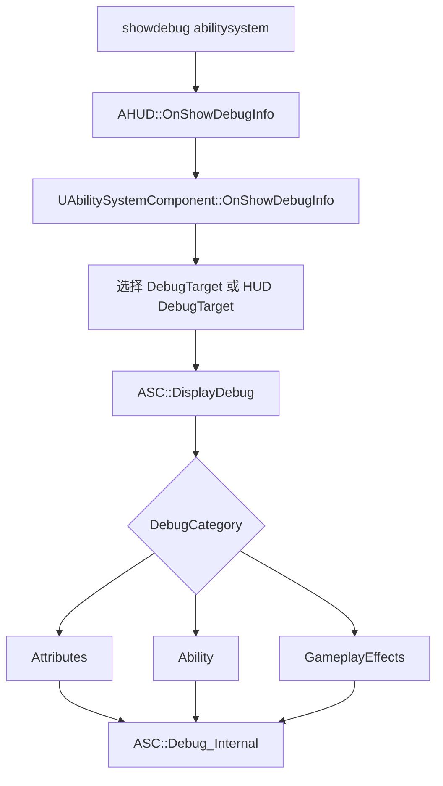

# GAS Debug / Log / VisualLogger / Console Variables（第十六轮）

本轮只整理 GameplayAbilities 侧的调试与排错接入点，不展开 UE 通用日志系统、GameplayDebugger 底层、VisualLogger 底层、ConsoleManager 底层。所有结论基于本轮读取源码；无法确认处标“未确认”。

## 一、调试体系总览

| 入口 | 作用 | 源码路径 |
|---|---|---|
| `ABILITY_LOG` | GameplayAbilities 常用日志宏，内部写入 `LogAbilitySystem` | `Engine/Plugins/Runtime/GameplayAbilities/Source/GameplayAbilities/Public/AbilitySystemLog.h:24`、`:39` |
| `LogAbilitySystem` / `VLogAbilitySystem` / `LogGameplayEffects` | GAS 运行时日志类别 | `Engine/Plugins/Runtime/GameplayAbilities/Source/GameplayAbilities/Public/AbilitySystemLog.h:14`、`:15`、`:16`；`Engine/Plugins/Runtime/GameplayAbilities/Source/GameplayAbilities/Private/AbilitySystemLog.cpp:4`、`:5`、`:6` |
| `DisplayDebug` / `showdebug abilitysystem` | ASC 注册到 HUD debug 输出链后显示 Attributes / Ability / GameplayEffects 分类 | `Engine/Plugins/Runtime/GameplayAbilities/Source/GameplayAbilities/Private/GameplayAbilitiesModule.cpp:73`、`:84`；`Engine/Plugins/Runtime/GameplayAbilities/Source/GameplayAbilities/Private/AbilitySystemComponent.cpp:2329`、`:2359` |
| `PrintDebug` | ASC 收集调试字符串，可请求服务端返回服务端视角调试信息 | `Engine/Plugins/Runtime/GameplayAbilities/Source/GameplayAbilities/Public/AbilitySystemComponent.h:1275`；`Engine/Plugins/Runtime/GameplayAbilities/Source/GameplayAbilities/Private/AbilitySystemComponent.cpp:2412`、`:2447` |
| VisualLogger | ASC 可抓取 ability / ActiveGE 快照，ActiveGE 也会写入 VisualLogger 信息 | `Engine/Plugins/Runtime/GameplayAbilities/Source/GameplayAbilities/Public/AbilitySystemComponent.h:1300`；`Engine/Plugins/Runtime/GameplayAbilities/Source/GameplayAbilities/Private/AbilitySystemComponent.cpp:1827`、`:1905` |
| GameplayDebugger `Abilities` | 模块启动时注册 GameplayDebugger 分类，显示 Tags / Abilities / Effects / Attributes | `Engine/Plugins/Runtime/GameplayAbilities/Source/GameplayAbilities/Private/GameplayAbilitiesModule.cpp:75`、`:79`；`Engine/Plugins/Runtime/GameplayAbilities/Source/GameplayAbilities/Private/GameplayDebuggerCategory_Abilities.cpp:44`、`:57` |
| Basic HUD | `AbilitySystemDebugHUD` 提供轻量 HUD 扩展和若干控制台命令 | `Engine/Plugins/Runtime/GameplayAbilities/Source/GameplayAbilities/Public/AbilitySystemDebugHUD.h:43`、`:134`；`Engine/Plugins/Runtime/GameplayAbilities/Source/GameplayAbilities/Private/AbilitySystemDebugHUD.cpp:607` |
| CheatManager Extension | 提供 Grant / Activate / Cancel / Apply / Remove 等调试命令，属于 cheat/debug 辅助 | `Engine/Plugins/Runtime/GameplayAbilities/Source/GameplayAbilities/Private/AbilitySystemCheatManagerExtension.cpp:579`、`:611`、`:673` |

## 二、日志宏与 LogCategory

- `ABILITY_LOG(Verbosity, Format, ...)` 在非 `NO_LOGGING` 分支使用 `UE_LOG(LogAbilitySystem, Verbosity, ...)`，适合查 ASC / Ability 激活、失败、配置警告等日志；源码路径：`Engine/Plugins/Runtime/GameplayAbilities/Source/GameplayAbilities/Public/AbilitySystemLog.h:24`、`:39`。
- `ABILITY_VLOG` 在当前源码中包含 `static_assert(false, "ABILITY_VLOG is deprecated...")`，说明旧宏已废弃，不应作为新排错入口；源码路径：`Engine/Plugins/Runtime/GameplayAbilities/Source/GameplayAbilities/Public/AbilitySystemLog.h:29`、`:44`。
- VisualLogger 侧应优先看 `UE_VLOG` / `UE_VLOG_UELOG` / `UE_VLOG_HISTOGRAM` 调用点；例如 `ABILITY_VLOG_ATTRIBUTE_GRAPH` 只在 `ENABLE_VISUAL_LOG` 下记录属性曲线；源码路径：`Engine/Plugins/Runtime/GameplayAbilities/Source/GameplayAbilities/Public/AbilitySystemLog.h:54`、`:70`。
- `ABILITY_LOG_SCOPE` 本轮在指定 GameplayAbilities 源码范围内未搜索到定义或使用，未确认。
- `ABILITYLIST_SCOPE_LOCK` 是 ability list 遍历锁，不是日志宏；`InternalTryActivateAbility` 和 GameplayEvent 路径中使用它保护 ability list；源码路径：`Engine/Plugins/Runtime/GameplayAbilities/Source/GameplayAbilities/Private/AbilitySystemComponent_Abilities.cpp:1711`、`:2542`。

## 三、ASC Debug / ShowDebug / PrintDebug

`FAbilitySystemComponentDebugInfo` 是 ASC debug 绘制/打印的上下文，保存 Canvas、是否输出到 log、是否显示 Attributes / GameplayEffects / Abilities、字符串累积等状态；源码路径：`Engine/Plugins/Runtime/GameplayAbilities/Source/GameplayAbilities/Public/AbilitySystemComponent.h:1238`、`:1264`。

- `GameplayAbilities` 模块启动时将 `UAbilitySystemComponent::OnShowDebugInfo` 注册到 `AHUD::OnShowDebugInfo`，这是 `showdebug abilitysystem` 能进入 ASC 输出链的 GameplayAbilities 侧依据；源码路径：`Engine/Plugins/Runtime/GameplayAbilities/Source/GameplayAbilities/Private/GameplayAbilitiesModule.cpp:73`、`:84`。
- `OnShowDebugInfo` 只在 `DisplayInfo.IsDisplayOn("AbilitySystem")` 时继续，并根据 `UAbilitySystemGlobals::Get().ShouldUseDebugTargetFromHud()` 决定 debug target 来源；源码路径：`Engine/Plugins/Runtime/GameplayAbilities/Source/GameplayAbilities/Private/AbilitySystemComponent.cpp:2329`、`:2355`。
- `DisplayDebug` 根据 `FAbilitySystemComponentDebugInfo::DebugCategoryIndex` 选择 Attributes、Ability、GameplayEffects 三类输出，并最终调用 `Debug_Internal`；源码路径：`Engine/Plugins/Runtime/GameplayAbilities/Source/GameplayAbilities/Private/AbilitySystemComponent.cpp:2359`、`:2392`。
- `PrintDebug` 会同时打开 attributes/effects/abilities 输出，非 authority 端可通过 `ServerPrintDebug_Request` 或 `ServerPrintDebug_RequestWithStrings` 请求服务端生成服务端视角调试字符串；源码路径：`Engine/Plugins/Runtime/GameplayAbilities/Source/GameplayAbilities/Private/AbilitySystemComponent.cpp:2412`、`:2447`。
- `ShouldSendClientDebugStringsToServer` 对客户端 debug string 发送做 1 秒节流；源码路径：`Engine/Plugins/Runtime/GameplayAbilities/Source/GameplayAbilities/Private/AbilitySystemComponent.cpp:2396`、`:2410`。
- `Debug_Internal` 会输出 Owner/Avatar role、Owned Tags、BlockedAbilityTags、Attributes、Active GameplayEffects、Abilities 和 active tasks 信息；源码路径：`Engine/Plugins/Runtime/GameplayAbilities/Source/GameplayAbilities/Private/AbilitySystemComponent.cpp:2450`、`:2500`、`:2570`、`:2655`、`:2760`。

## 四、VisualLogger 与 GameplayDebugger

- `UAbilitySystemComponent::GrabDebugSnapshot` 在 `ENABLE_VISUAL_LOG` 下把 ability spec 状态和 `ActiveGameplayEffects.DescribeSelfToVisLog` 写入 VisualLogger；源码路径：`Engine/Plugins/Runtime/GameplayAbilities/Source/GameplayAbilities/Private/AbilitySystemComponent.cpp:1905`、`:1915`。
- `GrabDebugSnapshot_GameplayAbilities` 逐个 ability spec 记录 ActiveCount、Level、SourceObject、granting GE、event data、target data 等信息；源码路径：`Engine/Plugins/Runtime/GameplayAbilities/Source/GameplayAbilities/Private/AbilitySystemComponent.cpp:1827`、`:1903`。
- GameplayDebugger 分类名为 `Abilities`，模块启动时注册，关闭时反注册；源码路径：`Engine/Plugins/Runtime/GameplayAbilities/Source/GameplayAbilities/Private/GameplayAbilitiesModule.cpp:75`、`:79`、`:94`、`:101`。
- `FGameplayDebuggerCategory_Abilities` 绑定 `Shift+1/2/3/4` 切换 Tags / Abilities / Effects / Attributes，并在 `CollectData` 中从 debug actor 查 ASC；源码路径：`Engine/Plugins/Runtime/GameplayAbilities/Source/GameplayAbilities/Private/GameplayDebuggerCategory_Abilities.cpp:44`、`:57`、`:146`。
- GameplayDebugger 的 tag/effect/attribute 绘制会比较 server/local 数据，适合排查复制模式下客户端看到的 tags、effects、attributes 是否和服务器一致；源码路径：`Engine/Plugins/Runtime/GameplayAbilities/Source/GameplayAbilities/Private/GameplayDebuggerCategory_Abilities.cpp:391`、`:504`、`:688`。

## 五、Ability 激活失败排错

| 症状 | 源码确认的排查点 | 源码路径 |
|---|---|---|
| handle 无效 | `TryActivateAbility` 对 invalid handle 记录 warning | `Engine/Plugins/Runtime/GameplayAbilities/Source/GameplayAbilities/Private/AbilitySystemComponent_Abilities.cpp:1585` |
| spec pending remove | `TryActivateAbility` 直接返回 false，默认不额外打 warning | `Engine/Plugins/Runtime/GameplayAbilities/Source/GameplayAbilities/Private/AbilitySystemComponent_Abilities.cpp:1593` |
| ActorInfo / Owner / Avatar 无效 | `TryActivateAbility` 和 `InternalTryActivateAbility` 都会返回 false | `Engine/Plugins/Runtime/GameplayAbilities/Source/GameplayAbilities/Private/AbilitySystemComponent_Abilities.cpp:1607`、`:1705` |
| simulated proxy 激活 | `TryActivateAbility` / `InternalTryActivateAbility` 拒绝 simulated proxy | `Engine/Plugins/Runtime/GameplayAbilities/Source/GameplayAbilities/Private/AbilitySystemComponent_Abilities.cpp:1618`、`:1726` |
| NetExecutionPolicy 不匹配 | LocalOnly/LocalPredicted、ServerOnly/ServerInitiated 在错误端会 warning 或失败 | `Engine/Plugins/Runtime/GameplayAbilities/Source/GameplayAbilities/Private/AbilitySystemComponent_Abilities.cpp:1625`、`:1642`、`:1744`、`:1761` |
| CanActivate 失败但日志不明显 | `FScopedCanActivateAbilityLogEnabler` 控制 cooldown/cost/tag/input/Blueprint 失败日志 | `Engine/Plugins/Runtime/GameplayAbilities/Source/GameplayAbilities/Private/AbilitySystemComponent_Abilities.cpp:1794`；`Engine/Plugins/Runtime/GameplayAbilities/Source/GameplayAbilities/Private/Abilities/GameplayAbility.cpp:475`、`:485`、`:495`、`:505`、`:516` |
| 客户端预测激活被拒绝 | `ClientActivateAbilityFailed` 会广播 reject delegate、记录日志，并可超过阈值时 `PrintDebug()` | `Engine/Plugins/Runtime/GameplayAbilities/Source/GameplayAbilities/Private/AbilitySystemComponent_Abilities.cpp:2245`、`:2251`、`:2283` |
| 业务想监听失败原因 | `NotifyAbilityFailed` 广播 `AbilityFailedCallbacks`，失败 tag 来自 `InternalTryActivateAbilityFailureTags` 或 globals failure tags | `Engine/Plugins/Runtime/GameplayAbilities/Source/GameplayAbilities/Public/AbilitySystemComponent.h:549`、`:560`；`Engine/Plugins/Runtime/GameplayAbilities/Source/GameplayAbilities/Private/AbilitySystemComponent_Abilities.cpp:2531`、`:2534` |

开发实践推断：排查“按键没反应”时，先看 ASC 是否初始化、GiveAbility 是否成功、spec handle 是否有效，再看 NetExecutionPolicy、Cooldown/Cost/Tag/Input blocked，最后看预测失败或服务端拒绝。上述顺序来自 `TryActivateAbility` 与 `InternalTryActivateAbility` 的检查顺序；源码路径：`Engine/Plugins/Runtime/GameplayAbilities/Source/GameplayAbilities/Private/AbilitySystemComponent_Abilities.cpp:1583`、`:1683`。

## 六、GameplayEffect / Attribute / Aggregator 排错

- `PrintAllGameplayEffects` 会输出 owner/avatar 并调用 `ActiveGameplayEffects.PrintAllGameplayEffects()`，适合粗查目标 ASC 当前 ActiveGE；源码路径：`Engine/Plugins/Runtime/GameplayAbilities/Source/GameplayAbilities/Private/AbilitySystemComponent.cpp:1818`、`:1823`；`Engine/Plugins/Runtime/GameplayAbilities/Source/GameplayAbilities/Private/GameplayEffectTypes.cpp:949`。
- `FGameplayEffectSpec::ToSimpleString` 和 `FActiveGameplayEffect::GetDebugString` 提供 GE/ActiveGE 简明字符串，常在日志和 debug 输出中使用；源码路径：`Engine/Plugins/Runtime/GameplayAbilities/Source/GameplayAbilities/Private/GameplayEffectTypes.cpp:972`；`Engine/Plugins/Runtime/GameplayAbilities/Source/GameplayAbilities/Public/GameplayEffect.h:1373`。
- `UGameplayEffect::CanApply` 遍历 GEComponents，组件拒绝时会用 `UE_VLOG_UELOG` 记录被哪个 component 阻止；源码路径：`Engine/Plugins/Runtime/GameplayAbilities/Source/GameplayAbilities/Private/GameplayEffect.cpp:881`、`:887`。
- ActiveGE 添加、执行、应用分别有 `OnAddedToActiveContainer`、`OnExecuted`、`OnApplied` 日志/VisualLogger 接入；源码路径：`Engine/Plugins/Runtime/GameplayAbilities/Source/GameplayAbilities/Private/GameplayEffect.cpp:895`、`:911`、`:924`。
- Attribute aggregator 变化路径中有创建/移除 aggregator、base 复制回退、数值更新、缺失 attribute 跳过 modifier 等日志点；源码路径：`Engine/Plugins/Runtime/GameplayAbilities/Source/GameplayAbilities/Private/GameplayEffect.cpp:3273`、`:3295`、`:3589`、`:3768`、`:3967`。
- Aggregator 运算中除法为 0、循环依赖会 warning，排查 modifier op 和依赖关系时优先看这里；源码路径：`Engine/Plugins/Runtime/GameplayAbilities/Source/GameplayAbilities/Private/GameplayEffectAggregator.cpp:94`、`:121`、`:616`。
- `GameplayEffectExecutionCalculation` 和 `GameplayModMagnitudeCalculation` 在 capture/magnitude 计算失败时有 warning；源码路径：`Engine/Plugins/Runtime/GameplayAbilities/Source/GameplayAbilities/Private/GameplayEffectExecutionCalculation.cpp:58`；`Engine/Plugins/Runtime/GameplayAbilities/Source/GameplayAbilities/Private/GameplayModMagnitudeCalculation.cpp:35`、`:40`。
- `SetByCaller` 缺失时会按默认值返回，并在 `WarnIfNotFound` 为 true 时记录 error；源码路径：`Engine/Plugins/Runtime/GameplayAbilities/Source/GameplayAbilities/Private/GameplayEffect.cpp:2216`、`:2238`。

## 七、GameplayTag 与 GameplayCue 排错

| 主题 | 排查入口 | 源码路径 |
|---|---|---|
| Owned Tags / BlockedAbilityTags | `Debug_Internal` 打印 owned tags、tag count、blocked ability tags | `Engine/Plugins/Runtime/GameplayAbilities/Source/GameplayAbilities/Private/AbilitySystemComponent.cpp:2500`、`:2530` |
| GameplayDebugger tag 差异 | `DrawGameplayTags` 比较 server/local tag count | `Engine/Plugins/Runtime/GameplayAbilities/Source/GameplayAbilities/Private/GameplayDebuggerCategory_Abilities.cpp:391`、`:504` |
| Cue 是否被全局禁用 | `AbilitySystem.DisableGameplayCues` 和 `ShouldSuppressGameplayCues` | `Engine/Plugins/Runtime/GameplayAbilities/Source/GameplayAbilities/Private/GameplayCueManager.cpp:44`、`:179` |
| Cue 是否显示调试文本 | `AbilitySystem.DisplayGameplayCues` 和 `AbilitySystem.GameplayCue.DisplayDuration` | `Engine/Plugins/Runtime/GameplayAbilities/Source/GameplayAbilities/Private/GameplayCueManager.cpp:41`、`:47`、`:217` |
| Cue notify actor 生成 | `AbilitySystem.LogGameplayCueActorSpawning` | `Engine/Plugins/Runtime/GameplayAbilities/Source/GameplayAbilities/Private/GameplayCueManager.cpp:38`、`:534` |
| Cue 无有效 tag | GE 有 GameplayCue entries 但没有有效 tags 时 warning | `Engine/Plugins/Runtime/GameplayAbilities/Source/GameplayAbilities/Private/GameplayCueManager.cpp:1362`、`:1396` |
| Cue asset load 故障模拟 | `AbilitySystem.GameplayCueFailLoads` 可模拟 Cue 加载失败 | `Engine/Plugins/Runtime/GameplayAbilities/Source/GameplayAbilities/Private/GameplayCueSet.cpp:47`、`:277` |

开发实践推断：Cue 不播放优先检查 `AbilitySystem.DisableGameplayCues`、目标是否有效、dedicated server 是否允许 cue、CueSet 是否加载到 notify、GameplayCue tag 是否有效、Notify 类型是否匹配持续/一次性表现。上述入口来自 `UGameplayCueManager::ShouldSuppressGameplayCues` 与 `RouteGameplayCue`；源码路径：`Engine/Plugins/Runtime/GameplayAbilities/Source/GameplayAbilities/Private/GameplayCueManager.cpp:169`、`:186`、`:217`。

## 八、Prediction / RPC / TargetData 排错

- `LogPredictionKey` 是 PredictionKey 专用静态日志类别；源码路径：`Engine/Plugins/Runtime/GameplayAbilities/Source/GameplayAbilities/Private/GameplayPrediction.cpp:10`。
- PredictionKey stale / dependent chain / server key ack 行为由 `AbilitySystem.PredictionKey.*` 系列 CVar 控制；源码路径：`Engine/Plugins/Runtime/GameplayAbilities/Source/GameplayAbilities/Private/GameplayPrediction.cpp:18`、`:25`、`:31`、`:37`。
- `FScopedPredictionWindow` 在 owner 无效时会 verbose log；源码路径：`Engine/Plugins/Runtime/GameplayAbilities/Source/GameplayAbilities/Private/GameplayPrediction.cpp:401`。
- `AbilitySystem.ServerRPCBatching.Log` 控制 server ability RPC batch 日志，批处理会记录 TryActivateAbility / TargetData / EndAbility 等批处理调用；源码路径：`Engine/Plugins/Runtime/GameplayAbilities/Source/GameplayAbilities/Private/AbilitySystemComponent_Abilities.cpp:4098`、`:4134`、`:4150`、`:4170`、`:4194`、`:4219`。
- TargetData 会缓存在 `AbilityTargetDataMap`，按 ability spec handle + prediction key 绑定 delegate；源码路径：`Engine/Plugins/Runtime/GameplayAbilities/Source/GameplayAbilities/Public/AbilitySystemComponent.h:1699`；`Engine/Plugins/Runtime/GameplayAbilities/Source/GameplayAbilities/Private/AbilitySystemComponent_Abilities.cpp:3945`、`:3950`、`:4066`。
- `ServerSetReplicatedTargetData` 覆盖 pending data 时会 warning，常用于发现重复发送或未 consume 的 TargetData；源码路径：`Engine/Plugins/Runtime/GameplayAbilities/Source/GameplayAbilities/Private/AbilitySystemComponent_Abilities.cpp:3958`。
- `ConsumeClientReplicatedTargetData` 与 `ConsumeGenericReplicatedEvent` 用于清理缓存，未 consume 容易导致重复触发或旧数据被后续流程读到；源码路径：`Engine/Plugins/Runtime/GameplayAbilities/Source/GameplayAbilities/Private/AbilitySystemComponent_Abilities.cpp:3838`、`:3849`。

## 九、AbilityTask / TargetData 调试线索

- Ability 维护 task debug message，`OnGameplayTaskInitialized` 和 `OnGameplayTaskDeactivated` 会用 VisualLogger 记录 task started/ended；源码路径：`Engine/Plugins/Runtime/GameplayAbilities/Source/GameplayAbilities/Private/Abilities/GameplayAbility.cpp:1553`、`:1561`、`:1684`。
- `Debug_Internal` 在 Ability 分类下会输出 active tasks 和 task debug strings，适合排查 latent task 没结束导致 Ability 一直 active；源码路径：`Engine/Plugins/Runtime/GameplayAbilities/Source/GameplayAbilities/Private/AbilitySystemComponent.cpp:2760`、`:2865`。
- `WaitInputPress` / `WaitInputRelease` 使用 generic replicated event，并在本地/服务端路径消费事件；源码路径：`Engine/Plugins/Runtime/GameplayAbilities/Source/GameplayAbilities/Private/Abilities/Tasks/AbilityTask_WaitInputPress.cpp:33`、`:37`；`Engine/Plugins/Runtime/GameplayAbilities/Source/GameplayAbilities/Private/Abilities/Tasks/AbilityTask_WaitInputRelease.cpp:33`、`:37`。
- `WaitTargetData` 会发送 `CallServerSetReplicatedTargetData`、取消时发送 `ServerSetReplicatedTargetDataCancelled`，并在服务端消费 replicated target data；源码路径：`Engine/Plugins/Runtime/GameplayAbilities/Source/GameplayAbilities/Private/Abilities/Tasks/AbilityTask_WaitTargetData.cpp:228`、`:288`、`:323`。

## 十、Console Variables / Commands 速查

| CVar / Command | 默认值或用途 | 源码路径 |
|---|---|---|
| `AbilitySystem.IgnoreCooldowns` | cheat，忽略 cooldown 检查 | `Engine/Plugins/Runtime/GameplayAbilities/Source/GameplayAbilities/Private/AbilitySystemGlobals.cpp:40` |
| `AbilitySystem.IgnoreCosts` | cheat，忽略 cost 检查 | `Engine/Plugins/Runtime/GameplayAbilities/Source/GameplayAbilities/Private/AbilitySystemGlobals.cpp:41` |
| `AbilitySystem.GlobalAbilityScale` | cheat，测试/迭代用全局能力缩放，不应用于 shipping 规则 | `Engine/Plugins/Runtime/GameplayAbilities/Source/GameplayAbilities/Private/AbilitySystemGlobals.cpp:43` |
| `AbilitySystem.Debug.NextCategory` | 切换 ASC showdebug 分类 | `Engine/Plugins/Runtime/GameplayAbilities/Source/GameplayAbilities/Private/AbilitySystemComponent.cpp:2317` |
| `AbilitySystem.Debug.SetCategory` | 设置 ASC showdebug 分类 | `Engine/Plugins/Runtime/GameplayAbilities/Source/GameplayAbilities/Private/AbilitySystemComponent.cpp:2323` |
| `AbilitySystem.DebugDrawMaxDistance` | Basic HUD 绘制 ASC 的最大距离 | `Engine/Plugins/Runtime/GameplayAbilities/Source/GameplayAbilities/Private/AbilitySystemDebugHUD.cpp:26`、`:424` |
| `AbilitySystem.DebugBasicHUD` | Basic HUD 开关 | `Engine/Plugins/Runtime/GameplayAbilities/Source/GameplayAbilities/Private/AbilitySystemDebugHUD.cpp:607` |
| `AbilitySystem.DebugAbilityTags` | Basic HUD tag 扩展开关 | `Engine/Plugins/Runtime/GameplayAbilities/Source/GameplayAbilities/Private/AbilitySystemDebugHUD.cpp:615` |
| `AbilitySystem.DebugAttribute` | Basic HUD attribute 扩展开关 | `Engine/Plugins/Runtime/GameplayAbilities/Source/GameplayAbilities/Private/AbilitySystemDebugHUD.cpp:622` |
| `AbilitySystem.ClearDebugAttributes` | 清理 Basic HUD attribute 过滤 | `Engine/Plugins/Runtime/GameplayAbilities/Source/GameplayAbilities/Private/AbilitySystemDebugHUD.cpp:628` |
| `AbilitySystem.DebugIncludeModifiers` | Basic HUD attribute 是否包含 modifiers | `Engine/Plugins/Runtime/GameplayAbilities/Source/GameplayAbilities/Private/AbilitySystemDebugHUD.cpp:634` |
| `AbilitySystem.DebugBlockedAbilityTags` | Basic HUD blocked ability tags 扩展开关 | `Engine/Plugins/Runtime/GameplayAbilities/Source/GameplayAbilities/Private/AbilitySystemDebugHUD.cpp:640` |
| `AbilitySystem.ClientActivateAbilityFailedPrintDebugThreshhold` | 客户端激活失败达到阈值时触发 `PrintDebug`；默认 -1 | `Engine/Plugins/Runtime/GameplayAbilities/Source/GameplayAbilities/Private/AbilitySystemComponent_Abilities.cpp:2245` |
| `AbilitySystem.ClientActivateAbilityFailedPrintDebugThreshholdTime` | 激活失败阈值统计时间窗；默认 3 秒 | `Engine/Plugins/Runtime/GameplayAbilities/Source/GameplayAbilities/Private/AbilitySystemComponent_Abilities.cpp:2248` |
| `AbilitySystem.ServerRPCBatching.Log` | 打印 Server Ability RPC Batch 日志 | `Engine/Plugins/Runtime/GameplayAbilities/Source/GameplayAbilities/Private/AbilitySystemComponent_Abilities.cpp:4098` |
| `AbilitySystem.Fix.AllowPredictiveGEFlags` | 控制部分 predictive GE 旧行为/修复行为 | `Engine/Plugins/Runtime/GameplayAbilities/Source/GameplayAbilities/Private/AbilitySystemPrivate.h:21`、`:24` |
| `AbilitySystem.LogGameplayCueActorSpawning` | 打印 GameplayCueNotify actor spawn | `Engine/Plugins/Runtime/GameplayAbilities/Source/GameplayAbilities/Private/GameplayCueManager.cpp:38` |
| `AbilitySystem.DisplayGameplayCues` | 显示 GameplayCue 调试信息 | `Engine/Plugins/Runtime/GameplayAbilities/Source/GameplayAbilities/Private/GameplayCueManager.cpp:41` |
| `AbilitySystem.DisableGameplayCues` | 禁用 GameplayCue 路由 | `Engine/Plugins/Runtime/GameplayAbilities/Source/GameplayAbilities/Private/GameplayCueManager.cpp:44` |
| `AbilitySystem.GameplayCue.DisplayDuration` | GameplayCue debug 文本显示时间 | `Engine/Plugins/Runtime/GameplayAbilities/Source/GameplayAbilities/Private/GameplayCueManager.cpp:47` |
| `AbilitySystem.GameplayCue.RunOnDedicatedServer` | dedicated server 是否运行 GameplayCue | `Engine/Plugins/Runtime/GameplayAbilities/Source/GameplayAbilities/Private/GameplayCueManager.cpp:50` |
| `AbilitySystem.GameplayCueFailLoads` | 模拟 GameplayCue 加载失败 | `Engine/Plugins/Runtime/GameplayAbilities/Source/GameplayAbilities/Private/GameplayCueSet.cpp:47` |
| `GameplayCue.FilterCuesByTag` | 调试过滤 cue tag | `Engine/Plugins/Runtime/GameplayAbilities/Source/GameplayAbilities/Private/GameplayCueSet.cpp:16` |
| `GameplayCue.BuildGameplayCueTranslator` | 构建 GameplayCue translator 调试命令 | `Engine/Plugins/Runtime/GameplayAbilities/Source/GameplayAbilities/Private/GameplayCueManager.cpp:1814` |
| `GameplayCue.PrintGameplayCueTranslator` | 打印 GameplayCue translator 调试命令 | `Engine/Plugins/Runtime/GameplayAbilities/Source/GameplayAbilities/Private/GameplayCueManager.cpp:1827` |
| `AbilitySystem.Ability.Grant` / `.Activate` / `.Cancel` / `.ListGranted` | CheatManager ability 调试命令 | `Engine/Plugins/Runtime/GameplayAbilities/Source/GameplayAbilities/Private/AbilitySystemCheatManagerExtension.cpp:579`、`:611`、`:595`、`:630` |
| `AbilitySystem.Effect.ListActive` / `.Remove` / `.Apply` | CheatManager gameplay effect 调试命令 | `Engine/Plugins/Runtime/GameplayAbilities/Source/GameplayAbilities/Private/AbilitySystemCheatManagerExtension.cpp:640`、`:646`、`:673` |

`AbilitySystemCVars.h` 本轮未在 GameplayAbilities 源码中发现，未确认。`AbilitySystem.Log` 本轮未在指定源码范围内发现同名 CVar，未确认。

## 十一、常见排错清单

### Ability 激活失败

1. 确认 ASC 已 `InitAbilityActorInfo`，Owner/Avatar 有效；源码路径：`Engine/Plugins/Runtime/GameplayAbilities/Source/GameplayAbilities/Private/AbilitySystemComponent_Abilities.cpp:1607`、`:1705`。
2. 确认 ability spec handle 有效且未 pending remove；源码路径：`Engine/Plugins/Runtime/GameplayAbilities/Source/GameplayAbilities/Private/AbilitySystemComponent_Abilities.cpp:1585`、`:1593`。
3. 确认不是 simulated proxy 在直接激活；源码路径：`Engine/Plugins/Runtime/GameplayAbilities/Source/GameplayAbilities/Private/AbilitySystemComponent_Abilities.cpp:1618`、`:1726`。
4. 确认 NetExecutionPolicy 和调用端匹配；源码路径：`Engine/Plugins/Runtime/GameplayAbilities/Source/GameplayAbilities/Private/AbilitySystemComponent_Abilities.cpp:1625`、`:1642`、`:1744`、`:1761`。
5. 打开 `LogAbilitySystem` Verbose/VeryVerbose 或使用 CheatManager `AbilitySystem.Ability.Activate` 的日志收集路径查看 CanActivate 失败原因；源码路径：`Engine/Plugins/Runtime/GameplayAbilities/Source/GameplayAbilities/Private/AbilitySystemCheatManagerExtension.cpp:65`、`:100`、`:319`。
6. 检查 failure tags 是否来自 cooldown/cost/tag/input/Blueprint；源码路径：`Engine/Plugins/Runtime/GameplayAbilities/Source/GameplayAbilities/Private/Abilities/GameplayAbility.cpp:475`、`:485`、`:495`、`:505`、`:516`。

### GE 没生效

1. 确认 ASC 有 authority 或有效 prediction key；源码路径：`Engine/Plugins/Runtime/GameplayAbilities/Source/GameplayAbilities/Private/AbilitySystemComponent.cpp:812`、`:819`。
2. 确认没有被 ASC application query 或 GEComponent `CanGameplayEffectApply` 阻止；源码路径：`Engine/Plugins/Runtime/GameplayAbilities/Source/GameplayAbilities/Private/AbilitySystemComponent.cpp:833`、`:844`；`Engine/Plugins/Runtime/GameplayAbilities/Source/GameplayAbilities/Private/GameplayEffect.cpp:881`。
3. 确认 Instant / Duration / Infinite 走的是预期路径；源码路径：`Engine/Plugins/Runtime/GameplayAbilities/Source/GameplayAbilities/Private/AbilitySystemComponent.cpp:862`、`:953`。
4. 确认 modifier attribute 存在，缺失 attribute 会跳过 modifier 并记录日志；源码路径：`Engine/Plugins/Runtime/GameplayAbilities/Source/GameplayAbilities/Private/GameplayEffect.cpp:3967`。
5. 如果用 SetByCaller，确认 key 和 Name/GameplayTag 类型匹配；源码路径：`Engine/Plugins/Runtime/GameplayAbilities/Source/GameplayAbilities/Private/GameplayEffect.cpp:2200`、`:2208`、`:2216`。

### Attribute 没变化或 UI 不刷新

1. 用 `showdebug abilitysystem` 的 Attributes 分类查看 base/current 和 active modifiers；源码路径：`Engine/Plugins/Runtime/GameplayAbilities/Source/GameplayAbilities/Private/AbilitySystemComponent.cpp:2570`、`:2648`。
2. 用 GameplayDebugger Attributes 对比 server/local base/current；源码路径：`Engine/Plugins/Runtime/GameplayAbilities/Source/GameplayAbilities/Private/GameplayDebuggerCategory_Abilities.cpp:688`。
3. 检查 AttributeSet subobject 复制和属性自身 RepNotify，这是两件事；源码路径：`Engine/Plugins/Runtime/GameplayAbilities/Source/GameplayAbilities/Private/AbilitySystemComponent.cpp:1636`、`:1710`；`Engine/Plugins/Runtime/GameplayAbilities/Source/GameplayAbilities/Public/AttributeSet.h:175`。
4. 预测属性建议使用 `REPNOTIFY_Always` 属于第五轮开发实践推断；源码依据是 `GAMEPLAYATTRIBUTE_REPNOTIFY` 通过 replication old value 修正 delegate；源码路径：`Engine/Plugins/Runtime/GameplayAbilities/Source/GameplayAbilities/Public/AttributeSet.h:175`。

### Cue 没播放或没移除

1. 确认 `AbilitySystem.DisableGameplayCues` 没开；源码路径：`Engine/Plugins/Runtime/GameplayAbilities/Source/GameplayAbilities/Private/GameplayCueManager.cpp:44`、`:179`。
2. 打开 `AbilitySystem.DisplayGameplayCues` 看路由调试文本；源码路径：`Engine/Plugins/Runtime/GameplayAbilities/Source/GameplayAbilities/Private/GameplayCueManager.cpp:41`、`:217`。
3. 打开 `AbilitySystem.LogGameplayCueActorSpawning` 看 actor notify spawn；源码路径：`Engine/Plugins/Runtime/GameplayAbilities/Source/GameplayAbilities/Private/GameplayCueManager.cpp:38`、`:534`。
4. 如果是持续 cue，确认 Add/Remove 配对，并确认 `GameplayCueNotify_Actor` 的 Remove 逻辑没有被 tag check 拦住；源码路径：`Engine/Plugins/Runtime/GameplayAbilities/Source/GameplayAbilities/Private/GameplayCueNotify_Actor.cpp:219`、`:251`。

### TargetData / RPC 没到服务端

1. 打开 `AbilitySystem.ServerRPCBatching.Log` 确认 batch 是否改变日志顺序认知；源码路径：`Engine/Plugins/Runtime/GameplayAbilities/Source/GameplayAbilities/Private/AbilitySystemComponent_Abilities.cpp:4098`。
2. 检查 `CallServerSetReplicatedTargetData`、`ServerSetReplicatedTargetData` 是否被调用；源码路径：`Engine/Plugins/Runtime/GameplayAbilities/Source/GameplayAbilities/Public/AbilitySystemComponent.h:1332`、`:1601`。
3. 检查服务端 task 是否绑定 `AbilityTargetDataSetDelegate`，以及数据到达后是否 `ConsumeClientReplicatedTargetData`；源码路径：`Engine/Plugins/Runtime/GameplayAbilities/Source/GameplayAbilities/Private/AbilitySystemComponent_Abilities.cpp:3838`、`:4085`。

## 十二、官方测试中的调试线索

- `AbilitySystemComponentTests.cpp` 覆盖 GiveAbility、TryActivateAbility、CancelAbilityHandle、AbilityFailed delegate，可作为 Ability 激活排错最小参考；源码路径：`Engine/Plugins/Runtime/GameplayAbilities/Source/GameplayAbilities/Private/Tests/AbilitySystemComponentTests.cpp:132`、`:172`。
- `GameplayEffectTests.cpp` 覆盖 Instant / Infinite / Periodic / Stack / SetByCaller / GameplayCue 基础行为，可用于验证 GE 排错假设；源码路径：`Engine/Plugins/Runtime/GameplayAbilities/Source/GameplayAbilities/Private/Tests/GameplayEffectTests.cpp:126`、`:166`、`:281`、`:357`、`:417`。
- `PredictionKeyTests.cpp` 覆盖 dependent key、reject/catch-up delegate、scoped prediction window；源码路径：`Engine/Plugins/Runtime/GameplayAbilities/Source/GameplayAbilities/Private/Tests/PredictionKeyTests.cpp:62`、`:83`、`:88`、`:432`、`:476`。
- `GameplayTagCountContainerTests.cpp` 覆盖 tag count 和父 tag count 语义，适合排查 tag 被多来源叠加后“为什么还没归零”；源码路径：`Engine/Plugins/Runtime/GameplayAbilities/Source/GameplayAbilities/Private/Tests/GameplayTagCountContainerTests.cpp:16`、`:21`、`:38`、`:55`。

## 十三、未确认项

- `ABILITY_LOG_SCOPE` 未在本轮指定 GameplayAbilities 源码范围内确认。
- `AbilitySystemCVars.h` 未在本轮源码树中确认。
- `AbilitySystem.Log` 作为同名 CVar 未在本轮指定源码范围内确认。
- `showdebug abilitysystem` 的引擎控制台命令解析属于 UE 通用 showdebug/HUD 系统，本轮只确认 GameplayAbilities 侧注册到 `AHUD::OnShowDebugInfo`。
- VisualLogger / GameplayDebugger 的底层绘制、存储、网络传输不是 GameplayAbilities 侧实现，本轮未展开。
- 真实 dedicated server / listen server / autonomous proxy / simulated proxy 场景下全部日志顺序未运行验证，未确认。
