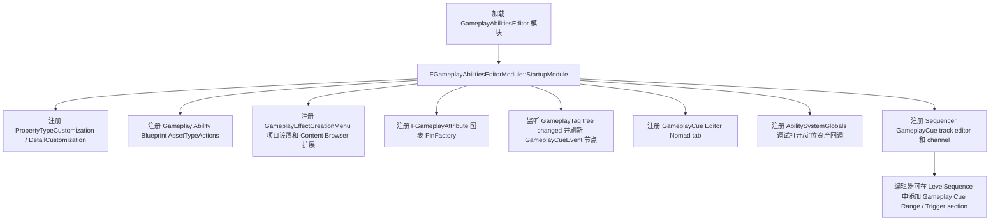
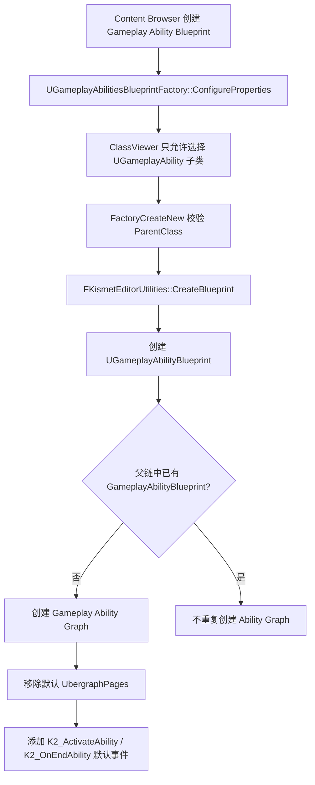
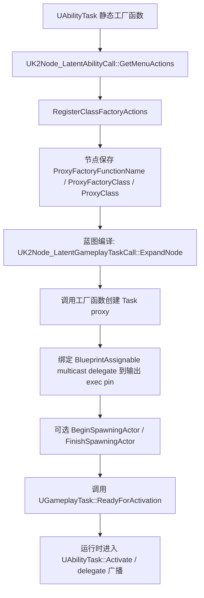

# GameplayAbilitiesEditor / Blueprint / K2 工具链（第十轮）

## 一、模块定位

- `GameplayAbilitiesEditor` 是 GameplayAbilities 插件的编辑器模块，模块类在 `GameplayAbilitiesEditor.Build.cs` 中声明，运行时依赖 `GameplayAbilities`，并额外依赖 `AssetTools`、`ClassViewer`、`PropertyEditor`、`BlueprintGraph`、`Kismet`、`KismetCompiler`、`GraphEditor`、`Sequencer`、`MovieScene`、`DataRegistryEditor`、`ToolMenus` 等编辑器模块；源码路径：`Engine/Plugins/Runtime/GameplayAbilities/Source/GameplayAbilitiesEditor/GameplayAbilitiesEditor.Build.cs:5`、`:9`、`:11`、`:22`、`:25`、`:28`、`:30`、`:31`、`:40`、`:41`、`:43`、`:45`、`:46`。
- 它和运行时 `GameplayAbilities` 的关系是：编辑器模块依赖运行时模块，提供资产创建、蓝图编辑、K2 节点、细节面板、GameplayCue 编辑器和 Sequencer 接入；运行时类型仍定义在 `GameplayAbilities` 模块，例如 `UGameplayAbilityBlueprint` 定义在运行时模块；源码路径：`Engine/Plugins/Runtime/GameplayAbilities/Source/GameplayAbilitiesEditor/GameplayAbilitiesEditor.Build.cs:22`、`Engine/Plugins/Runtime/GameplayAbilities/Source/GameplayAbilities/Public/GameplayAbilityBlueprint.h:18`。
- `GameplayAbilitiesBlueprintEditor` 目录在当前工作树不存在，当前 `Source` 下只有 `GameplayAbilities` 和 `GameplayAbilitiesEditor`，因此独立 `GameplayAbilitiesBlueprintEditor` 模块未确认；源码路径：`Engine/Plugins/Runtime/GameplayAbilities/Source`（目录扫描确认）。
- `GameplayAbilitiesEditor` 包含一个 `FGameplayAbilitiesEditor` 资产编辑器，它继承 `FBlueprintEditor`，用于打开 Gameplay Ability Blueprint；源码路径：`Engine/Plugins/Runtime/GameplayAbilities/Source/GameplayAbilitiesEditor/Public/GameplayAbilitiesEditor.h:11`、`Engine/Plugins/Runtime/GameplayAbilities/Source/GameplayAbilitiesEditor/Private/AssetTypeActions_GameplayAbilitiesBlueprint.cpp:43`。
- 它和 BlueprintGraph / Kismet / KismetCompiler 的关系体现在 Ability 图表、K2 节点和编译展开：`UGameplayAbilityGraphSchema` 继承 `UEdGraphSchema_K2`，`UK2Node_LatentAbilityCall` 是 K2 节点，`UK2Node_LatentGameplayTaskCall::ExpandNode` 在编译时展开 Task 节点；源码路径：`Engine/Plugins/Runtime/GameplayAbilities/Source/GameplayAbilitiesEditor/Public/GameplayAbilityGraphSchema.h:11`、`Engine/Plugins/Runtime/GameplayAbilities/Source/GameplayAbilitiesEditor/Public/K2Node_LatentAbilityCall.h:16`、`Engine/Source/Editor/GameplayTasksEditor/Private/K2Node_LatentGameplayTaskCall.cpp:563`。
- 它和 PropertyEditor / GraphEditor 的关系体现在注册 PropertyTypeCustomization、DetailCustomization，以及给 `FGameplayAttribute` pin 注册自定义图表 pin；源码路径：`Engine/Plugins/Runtime/GameplayAbilities/Source/GameplayAbilitiesEditor/Private/GameplayAbilitiesEditorModule.cpp:175`、`:185`、`:206`、`Engine/Plugins/Runtime/GameplayAbilities/Source/GameplayAbilitiesEditor/Private/GameplayAbilitiesGraphPanelPinFactory.h:15`。
- 它和 Sequencer / MovieScene 的关系体现在注册 `FGameplayCueTrackEditor` 和 `FMovieSceneGameplayCueChannel`，用于在 Level Sequence 中添加 GameplayCue track/section；源码路径：`Engine/Plugins/Runtime/GameplayAbilities/Source/GameplayAbilitiesEditor/Private/GameplayAbilitiesEditorModule.cpp:239`、`:240`、`Engine/Plugins/Runtime/GameplayAbilities/Source/GameplayAbilitiesEditor/Private/Sequencer/GameplayCueTrackEditor.cpp:37`、`:71`、`:80`。

## 二、核心类型分析

| 类型 | 定义位置 | 核心职责 | 何时注册 / 调用 | 与运行时 GAS 的关系 | 业务层是否常直接接触 |
| --- | --- | --- | --- | --- | --- |
| `FGameplayAbilitiesEditorModule` | `Engine/Plugins/Runtime/GameplayAbilities/Source/GameplayAbilitiesEditor/Private/GameplayAbilitiesEditorModule.cpp:61` | 编辑器模块启动、注册细节面板、资产动作、GameplayCue tab、Sequencer track、调试回调 | `IMPLEMENT_MODULE` 注册，`StartupModule` / `ShutdownModule` 执行；源码路径：同文件`:169`、`:171`、`:303` | 依赖运行时 `GameplayAbilities`，还调用 `UAbilitySystemGlobals` 调试回调；源码路径：同文件`:277` | 通常不直接接触，除非扩展编辑器工具 |
| `UGameplayAbilitiesBlueprintFactory` | `Engine/Plugins/Runtime/GameplayAbilities/Source/GameplayAbilitiesEditor/Public/GameplayAbilitiesBlueprintFactory.h:13` | 创建 `UGameplayAbilityBlueprint` 资产，选择 `UGameplayAbility` 派生父类 | 构造函数设置 `SupportedClass` 和默认 `ParentClass`，`FactoryCreateNew` 创建蓝图；源码路径：`.../Private/GameplayAbilitiesBlueprintFactory.cpp:270`、`:271`、`:280`、`:300` | 创建的蓝图父类必须是 `UGameplayAbility` 派生类；源码路径：同文件`:291` | 业务层一般通过编辑器右键创建，不直接调用 |
| `UGameplayAbilityBlueprintFactory` | 未确认 | 用户请求名未在当前源码命中；实际类名是复数 `UGameplayAbilitiesBlueprintFactory` | 未确认 | 未确认 | 未确认 |
| `UGameplayAbilityBlueprint` | `Engine/Plugins/Runtime/GameplayAbilities/Source/GameplayAbilities/Public/GameplayAbilityBlueprint.h:18` | 运行时模块中的专用 Blueprint 资产类型，图表控制 Gameplay Ability | Factory 创建，资产动作打开；源码路径：`.../Private/GameplayAbilitiesBlueprintFactory.cpp:300`、`.../Private/AssetTypeActions_GameplayAbilitiesBlueprint.cpp:69` | 蓝图生成类最终派生自 `UGameplayAbility`；源码路径：`.../Private/GameplayAbilitiesBlueprintFactory.cpp:291` | 业务层会创建资产，但通常不写 C++ 直接操作此类 |
| `UGameplayAbilityGraph` | `Engine/Plugins/Runtime/GameplayAbilities/Source/GameplayAbilitiesEditor/Public/GameplayAbilityGraph.h:11` | Ability Blueprint 的专用 Ubergraph 类型 | Factory 创建新图表时使用；源码路径：`.../Private/GameplayAbilitiesBlueprintFactory.cpp:310` | 图表中默认添加 `K2_ActivateAbility` / `K2_OnEndAbility` 事件；源码路径：同文件`:325`、`:326` | 一般不直接接触 |
| `UGameplayAbilityGraphSchema` | `Engine/Plugins/Runtime/GameplayAbilities/Source/GameplayAbilitiesEditor/Public/GameplayAbilityGraphSchema.h:11` | Ability 图表 Schema，继承 K2 Schema | Factory 创建图表时指定；源码路径：`.../Private/GameplayAbilitiesBlueprintFactory.cpp:310` | 当前实现对变量 getter/setter 仍转调父类，且 `ShouldAlwaysPurgeOnModification` 返回 true；源码路径：`.../Private/GameplayAbilityGraphSchema.cpp:15`、`:20`、`.../Public/GameplayAbilityGraphSchema.h:37` | 一般不直接接触 |
| `FGameplayAbilityGraphPanelNodeFactory` | 未确认 | 用户请求名未在当前源码命中 | 未确认 | 未确认 | 未确认 |
| `FGameplayAbilitiesGraphPanelPinFactory` | `Engine/Plugins/Runtime/GameplayAbilities/Source/GameplayAbilitiesEditor/Private/GameplayAbilitiesGraphPanelPinFactory.h:13` | 实际存在的图表 Pin Factory，为 `FGameplayAttribute` pin 创建 `SGameplayAttributeGraphPin` | `StartupModule` 注册，`ShutdownModule` 反注册；源码路径：`.../Private/GameplayAbilitiesEditorModule.cpp:205`、`:206`、`:350` | 连接第五轮 `FGameplayAttribute` 编辑器选择器；源码路径：`.../Private/SGameplayAttributeGraphPin.cpp:21` | 一般不直接接触 |
| `UK2Node_LatentAbilityCall` | `Engine/Plugins/Runtime/GameplayAbilities/Source/GameplayAbilitiesEditor/Public/K2Node_LatentAbilityCall.h:16` | 让 `UAbilityTask` 静态工厂函数以 Ability 蓝图 latent 节点形式出现 | CDO 构造时注册为 specialized task node，菜单动作注册 `UAbilityTask` 工厂函数；源码路径：`.../Private/K2Node_LatentAbilityCall.cpp:26`、`:77` | 编译展开最终创建 Task、绑定 delegate，并调用 `ReadyForActivation`；源码路径：`Engine/Source/Editor/GameplayTasksEditor/Private/K2Node_LatentGameplayTaskCall.cpp:53`、`:593`、`:657`、`:899` | 自定义 AbilityTask 时需要理解，但不应修改 Engine 节点 |
| `UK2Node_GameplayCueEvent` | `Engine/Plugins/Runtime/GameplayAbilities/Source/GameplayAbilitiesEditor/Public/K2Node_GameplayCueEvent.h:14` | 为实现 `UGameplayCueInterface` 的蓝图提供 `GameplayCue.*` 自定义事件节点 | 菜单动作按 GameplayCue 根 tag 及子 tag 生成事件节点；源码路径：`.../Private/K2Node_GameplayCueEvent.cpp:50`、`:84`、`:87`、`:94` | 连接第七轮 `IGameplayCueInterface` 的蓝图事件处理方式；源码路径：同文件`:23`、`:56` | 业务层会在蓝图里使用，C++ 一般不直接操作 |
| `FGameplayEffectDetails` | `Engine/Plugins/Runtime/GameplayAbilities/Source/GameplayAbilitiesEditor/Private/GameplayEffectDetails.h:12` | `UGameplayEffect` 类细节面板定制，按 Duration / Period 状态隐藏字段 | `StartupModule` 注册为 `GameplayEffect` class layout；源码路径：`.../Private/GameplayAbilitiesEditorModule.cpp:186`、`.../Private/GameplayEffectDetails.cpp:20` | 影响 GE 资产编辑显示，不改变运行时 GE 应用逻辑；源码路径：`.../Private/GameplayEffectDetails.cpp:48`、`:54`、`:65` | 业务层通常只受 UI 影响 |
| `FGameplayEffectModifierMagnitudeDetails` | `Engine/Plugins/Runtime/GameplayAbilities/Source/GameplayAbilitiesEditor/Private/GameplayEffectModifierMagnitudeDetails.h:15` | 根据 MagnitudeCalculationType 只显示 ScalableFloat / AttributeBased / Custom / SetByCaller 中当前一种 | 注册为 `GameplayEffectModifierMagnitude` property layout；源码路径：`.../Private/GameplayAbilitiesEditorModule.cpp:180`、`.../Private/GameplayEffectModifierMagnitudeDetails.cpp:28`、`:34`、`:79` | 连接第四轮 Modifier Magnitude 配置 | 业务层通过细节面板间接使用 |
| `FGameplayTagRequirementsDetails` | 未确认 | 当前源码未命中该 details 类，也未看到注册 `GameplayTagRequirements` property layout | 未确认 | 运行时 `FGameplayTagRequirements` 存在；源码路径：`Engine/Plugins/Runtime/GameplayAbilities/Source/GameplayAbilities/Public/GameplayEffectTypes.h:1426` | 未确认 |
| `FAttributeDetails` | `Engine/Plugins/Runtime/GameplayAbilities/Source/GameplayAbilitiesEditor/Public/AttributeDetails.h:25` | `UAttributeSet` 类细节面板定制，编辑 `PropertyReference` | 注册为 `AttributeSet` class layout；源码路径：`.../Private/GameplayAbilitiesEditorModule.cpp:185`、`.../Private/AttributeDetails.cpp:175` | 连接第五轮 AttributeSet 属性引用机制；源码路径：`.../Private/AttributeDetails.cpp:177`、`:182` | 很少直接接触 |
| `FAttributePropertyDetails` | `Engine/Plugins/Runtime/GameplayAbilities/Source/GameplayAbilitiesEditor/Public/AttributeDetails.h:39` | `FGameplayAttribute` 属性类型定制，显示属性选择器并写回 Attribute/Owner/Name | 注册为 `GameplayAttribute` property layout；源码路径：`.../Private/GameplayAbilitiesEditorModule.cpp:175`、`.../Private/AttributeDetails.cpp:34`、`:139` | 连接第五轮 `FGameplayAttribute` | 业务层通过 Details / Pin 选择属性 |
| `FAbilityAudit` | 未确认 | 当前源码未命中该类名 | 未确认 | 未确认 | 未确认 |
| `FGameplayAbilityAuditRow` | `Engine/Plugins/Runtime/GameplayAbilities/Source/GameplayAbilitiesEditor/Public/GameplayAbilityAudit.h:46` | 实际存在的 Ability Audit 数据行，记录激活路径、策略、Cost/Cooldown、Commit/End、AsyncTask、变量写入等 | 通过 Content Browser 菜单延迟注册；源码路径：`.../Private/GameplayAbilityAudit.cpp:314`、`:345`、`:357` | 读取 `UGameplayAbility` CDO 和蓝图图表；源码路径：`.../Private/GameplayAbilityAudit.cpp:58`、`:129` | 可作为项目扩展点，开发实践推断 |
| `FAssetTypeActions_GameplayAbilityBlueprint` | 未确认 | 用户请求名未在当前源码命中 | 未确认 | 未确认 | 未确认 |
| `FAssetTypeActions_GameplayAbilitiesBlueprint` | `Engine/Plugins/Runtime/GameplayAbilities/Source/GameplayAbilitiesEditor/Private/AssetTypeActions_GameplayAbilitiesBlueprint.h:11` | 实际存在的 Gameplay Ability Blueprint 资产类型动作 | `StartupModule` 创建并注册；源码路径：`.../Private/GameplayAbilitiesEditorModule.cpp:190` | 打开资产时创建 `FGameplayAbilitiesEditor`；源码路径：`.../Private/AssetTypeActions_GameplayAbilitiesBlueprint.cpp:43`、`:48` | 一般不直接接触 |
| `FAssetTypeActions_GameplayEffect` | 未确认 | 当前编辑器模块中未命中该类；GE 右键创建由 `UGameplayEffectCreationMenu` 扩展 Content Browser | 源码路径：`.../Private/GameplayEffectCreationMenu.cpp:148`、`:160`、`:163` | 创建的是以某个 GE 父类为 ParentClass 的 Blueprint；源码路径：同文件`:74`、`:75`、`:93` | 未确认 |
| `FAssetTypeActions_GameplayCueNotify` | 未确认 | 当前编辑器模块中未命中该类；Cue Notify 创建由 `SGameplayCueEditor` 使用 `UBlueprintFactory` | 源码路径：`.../Private/SGameplayCueEditor.cpp:1389`、`:1432`、`:1434` | 运行时 Notify 类型来自 GameplayAbilities 模块；源码路径：同文件`:1404`、`:1405` | 未确认 |

## 三、编辑器模块启动与注册流程



简化伪代码：

```cpp
StartupModule()
{
    RegisterCustomPropertyTypeLayout("GameplayAttribute", FAttributePropertyDetails);
    RegisterCustomPropertyTypeLayout("GameplayEffectModifierMagnitude", FGameplayEffectModifierMagnitudeDetails);
    RegisterCustomClassLayout("AttributeSet", FAttributeDetails);
    RegisterCustomClassLayout("GameplayEffect", FGameplayEffectDetails);
    RegisterAssetTypeAction(new FAssetTypeActions_GameplayAbilitiesBlueprint());
    RegisterSettings("Gameplay Effect Parents", UGameplayEffectCreationMenu);
    UGameplayEffectCreationMenu::AddMenuExtensions();
    RegisterVisualPinFactory(FGameplayAbilitiesGraphPanelPinFactory);
    OnGameplayTagTreeChanged.AddStatic(GameplayTagTreeChanged);
    RegisterNomadTabSpawner("GameplayCueApp", SpawnGameplayCueEditorTab);
    RegisterTrackEditor(FGameplayCueTrackEditor);
}
```

- `StartupModule` 注册九个 property type layout，包括 `GameplayAttribute`、`ScalableFloat`、`GameplayEffectExecutionScopedModifierInfo`、`GameplayEffectExecutionDefinition`、`GameplayEffectModifierMagnitude`、`GameplayCueTag`、`AttributeBasedFloat` 等；源码路径：`Engine/Plugins/Runtime/GameplayAbilities/Source/GameplayAbilitiesEditor/Private/GameplayAbilitiesEditorModule.cpp:175` 到 `:183`。
- `StartupModule` 注册 `AttributeSet` 和 `GameplayEffect` class layout；源码路径：`Engine/Plugins/Runtime/GameplayAbilities/Source/GameplayAbilitiesEditor/Private/GameplayAbilitiesEditorModule.cpp:185`、`:186`。
- `StartupModule` 只显式注册了 `FAssetTypeActions_GameplayAbilitiesBlueprint`；`FAssetTypeActions_GameplayEffect` 和 `FAssetTypeActions_GameplayCueNotify` 当前未确认；源码路径：`Engine/Plugins/Runtime/GameplayAbilities/Source/GameplayAbilitiesEditor/Private/GameplayAbilitiesEditorModule.cpp:190`。
- `StartupModule` 注册 Project Settings 下的 `Gameplay Effect Parents`，并调用 `UGameplayEffectCreationMenu::AddMenuExtensions` 扩展 Content Browser；源码路径：`Engine/Plugins/Runtime/GameplayAbilities/Source/GameplayAbilitiesEditor/Private/GameplayAbilitiesEditorModule.cpp:195`、`:201`、`Engine/Plugins/Runtime/GameplayAbilities/Source/GameplayAbilitiesEditor/Public/GameplayEffectCreationMenu.h:30`、`:46`。
- `ShutdownModule` 反注册 GameplayCue tab、细节定制、资产动作、pin factory、GameplayTag delegate 和 Sequencer track editor；源码路径：`Engine/Plugins/Runtime/GameplayAbilities/Source/GameplayAbilitiesEditor/Private/GameplayAbilitiesEditorModule.cpp:303`、`:307`、`:319`、`:330`、`:341`、`:350`、`:356`、`:361`。

## 四、GameplayAbility 蓝图资产创建流程



- `UGameplayAbilitiesBlueprintFactory` 构造时 `bCreateNew=true`、`bEditAfterNew=true`、`SupportedClass=UGameplayAbilityBlueprint`、`ParentClass=UGameplayAbility`；源码路径：`Engine/Plugins/Runtime/GameplayAbilities/Source/GameplayAbilitiesEditor/Private/GameplayAbilitiesBlueprintFactory.cpp:270`、`:271`。
- 创建对话框默认父类是 `UGameplayAbility::StaticClass()`，ClassViewer filter 只允许 `UGameplayAbility` 子类；源码路径：`Engine/Plugins/Runtime/GameplayAbilities/Source/GameplayAbilitiesEditor/Private/GameplayAbilitiesBlueprintFactory.cpp:60`、`:141`、`:152`、`:178`。
- `FactoryCreateNew` 会拒绝空父类、不能创建蓝图的类、非 `UGameplayAbility` 子类；源码路径：`Engine/Plugins/Runtime/GameplayAbilities/Source/GameplayAbilitiesEditor/Private/GameplayAbilitiesBlueprintFactory.cpp:291`。
- 蓝图资产通过 `FKismetEditorUtilities::CreateBlueprint` 创建，蓝图类为 `UGameplayAbilityBlueprint`，GeneratedClass 为 `UBlueprintGeneratedClass`；源码路径：`Engine/Plugins/Runtime/GameplayAbilities/Source/GameplayAbilitiesEditor/Private/GameplayAbilitiesBlueprintFactory.cpp:300`。
- 如果父链中没有根 Gameplay Ability Blueprint，Factory 会创建名为 `Gameplay Ability Graph` 的 `UGameplayAbilityGraph`，Schema 为 `UGameplayAbilityGraphSchema`；源码路径：`Engine/Plugins/Runtime/GameplayAbilities/Source/GameplayAbilitiesEditor/Private/GameplayAbilitiesBlueprintFactory.cpp:304`、`:310`。
- 如果编辑器设置允许生成默认节点，Factory 会添加 `K2_ActivateAbility` 与 `K2_OnEndAbility` 默认事件；这衔接第三轮 `UGameplayAbility` 生命周期的 Blueprint 入口；源码路径：`Engine/Plugins/Runtime/GameplayAbilities/Source/GameplayAbilitiesEditor/Private/GameplayAbilitiesBlueprintFactory.cpp:325`、`:326`、`Engine/Plugins/Runtime/GameplayAbilities/Source/GameplayAbilities/Public/Abilities/GameplayAbility.h:588`、`:622`。
- 打开资产时 `FAssetTypeActions_GameplayAbilitiesBlueprint::OpenAssetEditor` 创建 `FGameplayAbilitiesEditor`，并调用 `InitGameplayAbilitiesEditor`；源码路径：`Engine/Plugins/Runtime/GameplayAbilities/Source/GameplayAbilitiesEditor/Private/AssetTypeActions_GameplayAbilitiesBlueprint.cpp:23`、`:43`、`:48`。

## 五、Ability 图表与 Schema

- `UGameplayAbilityGraph` 当前是 `UEdGraph` 的薄包装，源码没有额外状态或行为；源码路径：`Engine/Plugins/Runtime/GameplayAbilities/Source/GameplayAbilitiesEditor/Public/GameplayAbilityGraph.h:11`、`Engine/Plugins/Runtime/GameplayAbilities/Source/GameplayAbilitiesEditor/Private/GameplayAbilityGraph.cpp:12`。
- `UGameplayAbilityGraphSchema` 继承 `UEdGraphSchema_K2`，当前 getter/setter 节点创建都转调父类，源码没有看到针对 AbilityTask 节点的额外限制；源码路径：`Engine/Plugins/Runtime/GameplayAbilities/Source/GameplayAbilitiesEditor/Public/GameplayAbilityGraphSchema.h:11`、`Engine/Plugins/Runtime/GameplayAbilities/Source/GameplayAbilitiesEditor/Private/GameplayAbilityGraphSchema.cpp:15`、`:20`。
- Schema 的 `ShouldAlwaysPurgeOnModification` 返回 true，这说明图表修改时倾向清理中间产物；具体对编译缓存的完整影响属于 BlueprintGraph 底层，本轮未展开，未确认；源码路径：`Engine/Plugins/Runtime/GameplayAbilities/Source/GameplayAbilitiesEditor/Public/GameplayAbilityGraphSchema.h:37`。
- `FGameplayAbilitiesEditor::EnsureGameplayAbilityBlueprintIsUpToDate` 会移除旧资产中的空 `EventGraph`，但不会移除 Ability Graph；源码路径：`Engine/Plugins/Runtime/GameplayAbilities/Source/GameplayAbilitiesEditor/Private/GameplayAbilitiesEditor.cpp:42`、`:48`、`:51`。

## 六、AbilityTask 蓝图 latent 节点



简化伪代码：

```cpp
if (FactoryFunction returns UAbilityTask subclass)
{
    Node.ProxyFactoryFunctionName = FactoryFunc->GetFName();
    Node.ProxyFactoryClass = FactoryFunc->GetOuterUClass();
    Node.ProxyClass = ReturnProp->PropertyClass;
}

ExpandNode()
{
    Task = FactoryFunction(...);
    BindMulticastDelegates(Task);
    if (Task supports spawn actor)
    {
        BeginSpawningActor();
        FinishSpawningActor();
    }
    if (IsValid(Task))
    {
        Task.ReadyForActivation();
    }
}
```

- `UK2Node_LatentAbilityCall` 继承 `UK2Node_LatentGameplayTaskCall`，只处理 `UAbilityTask` 子类；源码路径：`Engine/Plugins/Runtime/GameplayAbilities/Source/GameplayAbilitiesEditor/Public/K2Node_LatentAbilityCall.h:16`、`Engine/Plugins/Runtime/GameplayAbilities/Source/GameplayAbilitiesEditor/Private/K2Node_LatentAbilityCall.cpp:30`。
- 该节点只允许在 Ubergraph 或 Macro 中创建，并要求蓝图 GeneratedClass 是 `UGameplayAbility` 子类；源码路径：`Engine/Plugins/Runtime/GameplayAbilities/Source/GameplayAbilitiesEditor/Private/K2Node_LatentAbilityCall.cpp:35`。
- 菜单动作注册使用 `RegisterClassFactoryActions<UAbilityTask>`，并从工厂函数返回值中记录 `ProxyClass`；源码路径：`Engine/Plugins/Runtime/GameplayAbilities/Source/GameplayAbilitiesEditor/Private/K2Node_LatentAbilityCall.cpp:69`、`:77`。
- `UK2Node_LatentGameplayTaskCall` 构造时把 `ProxyActivateFunctionName` 设置为 `UGameplayTask::ReadyForActivation`，因此 AbilityTask 蓝图节点的编译展开会在工厂调用和 delegate 绑定后激活 Task；源码路径：`Engine/Source/Editor/GameplayTasksEditor/Private/K2Node_LatentGameplayTaskCall.cpp:53`、`:593`、`:657`、`:899`、`:900`。
- `UK2Node_LatentAbilityCall::ValidateNodeDuringCompilation` 会检查 multicast delegate 属性上 `RequiresConnection` 元数据对应的 exec pin 是否连接，未连接则 warning；源码路径：`Engine/Plugins/Runtime/GameplayAbilities/Source/GameplayAbilitiesEditor/Private/K2Node_LatentAbilityCall.cpp:14`、`:90`、`:99`。
- `UK2Node_LatentGameplayTaskCall` 还支持 Begin/Finish spawning actor 的 Task 展开路径；具体 TargetActor 子类不在本轮展开，未确认；源码路径：`Engine/Source/Editor/GameplayTasksEditor/Private/K2Node_LatentGameplayTaskCall.cpp:546`、`:563`。

## 七、GameplayCue 蓝图节点与编辑器支持

- `UK2Node_GameplayCueEvent` 构造时把事件引用绑定到 `UGameplayCueInterface` 的 `BlueprintCustomHandler`，并且只在蓝图 GeneratedClass 实现 `UGameplayCueInterface` 时兼容；源码路径：`Engine/Plugins/Runtime/GameplayAbilities/Source/GameplayAbilitiesEditor/Private/K2Node_GameplayCueEvent.cpp:23`、`:50`、`:56`。
- `GetMenuActions` 从 `GameplayCue` 根 tag 请求所有子 tag，为每个 tag 生成 `UBlueprintEventNodeSpawner`，节点的 `CustomFunctionName` 设置为 tag 名；源码路径：`Engine/Plugins/Runtime/GameplayAbilities/Source/GameplayAbilitiesEditor/Private/K2Node_GameplayCueEvent.cpp:80`、`:84`、`:87`、`:94`。
- `GameplayCueEditor` 是一个 Nomad tab，`StartupModule` 注册为 `GameplayCueApp`；源码路径：`Engine/Plugins/Runtime/GameplayAbilities/Source/GameplayAbilitiesEditor/Private/GameplayAbilitiesEditorModule.cpp:213`。
- `SGameplayCueEditor` 会监听 `UGameplayCueManager::OnGameplayCueNotifyAddOrRemove` 与 `OnEditorObjectLibraryUpdated`，并请求等待 AssetRegistry 时周期更新 editor object library；源码路径：`Engine/Plugins/Runtime/GameplayAbilities/Source/GameplayAbilitiesEditor/Private/SGameplayCueEditor.cpp:1101`、`:1103`。
- `SGameplayCueEditor` 创建新的 Cue Notify 时，如果项目没有通过 delegate 提供候选类，默认只添加 `UGameplayCueNotify_Static` 和 `AGameplayCueNotify_Actor`；源码路径：`Engine/Plugins/Runtime/GameplayAbilities/Source/GameplayAbilitiesEditor/Private/SGameplayCueEditor.cpp:1400`、`:1404`、`:1405`。
- `UGameplayCueNotify_Burst`、`UGameplayCueNotify_BurstLatent`、`UGameplayCueNotify_Looping` 在运行时源码中存在，且是 Blueprintable 类，但本轮未确认它们会默认出现在 `SGameplayCueEditor` 创建对话框中；源码路径：`Engine/Plugins/Runtime/GameplayAbilities/Source/GameplayAbilities/Public/GameplayCueNotify_Burst.h:19`、`Engine/Plugins/Runtime/GameplayAbilities/Source/GameplayAbilities/Public/GameplayCueNotify_BurstLatent.h:19`、`Engine/Plugins/Runtime/GameplayAbilities/Source/GameplayAbilities/Public/GameplayCueNotify_Looping.h:19`、`Engine/Plugins/Runtime/GameplayAbilities/Source/GameplayAbilitiesEditor/Private/SGameplayCueEditor.cpp:1404`。
- `FGameplayCueTagDetails` 会在 `FGameplayCueTag` 细节面板中显示已有 Notify 的 hyperlink，并在没有 Notify 且 tag 有效时提供 Add New；源码路径：`Engine/Plugins/Runtime/GameplayAbilities/Source/GameplayAbilitiesEditor/Private/GameplayCueTagDetails.cpp:52`、`:94`、`:104`、`:130`、`:145`、`:172`。

## 八、GameplayEffect 细节面板定制

- `FGameplayEffectDetails` 在 `UGameplayEffect` 详情中监听 `DurationPolicy` 和 `Period.Value` 变化，并刷新详情面板；源码路径：`Engine/Plugins/Runtime/GameplayAbilities/Source/GameplayAbilitiesEditor/Private/GameplayEffectDetails.cpp:32`、`:34`、`:38`、`:41`、`:78`。
- 当 `DurationPolicy != HasDuration` 时，细节面板隐藏 `DurationMagnitude`；当 `DurationPolicy == Instant` 或 `Period.Value <= 0` 时，隐藏 `PeriodicInhibitionPolicy` 与 `bExecutePeriodicEffectOnApplication`；源码路径：`Engine/Plugins/Runtime/GameplayAbilities/Source/GameplayAbilitiesEditor/Private/GameplayEffectDetails.cpp:48`、`:54`、`:56`、`:58`、`:59`。
- Instant GE 下，`FGameplayEffectDetails` 会给 Modifiers 属性设置 metadata，通知 `FGameplayModEvaluationChannelSettingsDetails` 隐藏 evaluation channel，因为 Instant effect 不使用 evaluation channels；源码路径：`Engine/Plugins/Runtime/GameplayAbilities/Source/GameplayAbilitiesEditor/Private/GameplayEffectDetails.cpp:65`、`:69`、`:71`、`:73`、`Engine/Plugins/Runtime/GameplayAbilities/Source/GameplayAbilitiesEditor/Private/GameplayModEvaluationChannelSettingsDetails.cpp:27`、`:47`。
- `FGameplayEffectModifierMagnitudeDetails` 把 `ScalableFloatMagnitude`、`AttributeBasedMagnitude`、`CustomMagnitude`、`SetByCallerMagnitude` 映射到 `MagnitudeCalculationType`，并只显示当前计算方式对应字段；源码路径：`Engine/Plugins/Runtime/GameplayAbilities/Source/GameplayAbilitiesEditor/Private/GameplayEffectModifierMagnitudeDetails.cpp:28` 到 `:31`、`:34`、`:47`、`:54`、`:61`、`:68`、`:79`。
- `FGameplayEffectExecutionDefinitionDetails` 读取 ExecutionCalculation CDO 的 valid capture definitions、transient aggregator identifiers 和 `DoesRequirePassedInTags`，据此显示/清理 `CalculationModifiers` 和 `PassedInTags`；源码路径：`Engine/Plugins/Runtime/GameplayAbilities/Source/GameplayAbilitiesEditor/Private/GameplayEffectExecutionDefinitionDetails.cpp:37`、`:91`、`:92`、`:95`、`:101`、`:112`、`:132`、`:144`。
- `FGameplayEffectExecutionScopedModifierInfoDetails` 为 execution scoped modifier 提供 captured attribute 或 transient aggregator 的选择控件，并直接修改 `FGameplayEffectExecutionScopedModifierInfo`；源码路径：`Engine/Plugins/Runtime/GameplayAbilities/Source/GameplayAbilitiesEditor/Private/GameplayEffectExecutionScopedModifierInfoDetails.cpp:262`、`:291`、`:298`、`:421`、`:434`、`:446`。
- `GEComponents` 的运行时属性带有 `EditDefaultsOnly`、`Instanced`、`ShowOnlyInnerProperties` 等元数据，但本轮未看到专门的 GameplayEffectComponents details customization；源码路径：`Engine/Plugins/Runtime/GameplayAbilities/Source/GameplayAbilities/Public/GameplayEffect.h:2421`、`:2422`。
- Details 定制只影响编辑器 UI 和资产字段写入，不能代替第四轮记录的运行时 `CanApply`、Modifier、Execution、Stacking、Tag Requirement 检查；这是源码边界结论；源码路径：`Engine/Plugins/Runtime/GameplayAbilities/Source/GameplayAbilitiesEditor/Private/GameplayEffectDetails.cpp:20`、`Engine/Plugins/Runtime/GameplayAbilities/Source/GameplayAbilities/Private/AbilitySystemComponent_GameplayEffects.cpp`（运行时应用流程见第四轮）。

## 九、Attribute / GameplayTag 细节面板定制

- `FAttributePropertyDetails` 是 `FGameplayAttribute` 的 property customization，会读取 `FilterMetaTag`，通过 `FGameplayAttribute::GetAllAttributeProperties` 得到属性候选，并用 `SGameplayAttributeWidget` 呈现；源码路径：`Engine/Plugins/Runtime/GameplayAbilities/Source/GameplayAbilitiesEditor/Private/AttributeDetails.cpp:34`、`:43`、`:46`、`:76`。
- 选择属性后，`FAttributePropertyDetails::OnAttributeChanged` 会写回 `FGameplayAttribute.Attribute`、`AttributeOwner` 和 `AttributeName`；源码路径：`Engine/Plugins/Runtime/GameplayAbilities/Source/GameplayAbilitiesEditor/Private/AttributeDetails.cpp:139`、`:153`、`:158`。
- `SGameplayAttributeWidget` 扫描 native `UAttributeSet` 子类的属性，过滤 `HideInDetailsView`，并额外允许 native `UAbilitySystemComponent` 上带 `SystemGameplayAttribute` metadata 的系统属性；源码路径：`Engine/Plugins/Runtime/GameplayAbilities/Source/GameplayAbilitiesEditor/Private/SGameplayAttributeWidget.cpp:268`、`:271`、`:274`、`:296`、`:306`、`:307`、`:314`。
- `SGameplayAttributeGraphPin` 会把 pin 默认值解析为 `FGameplayAttribute`，并用 `SGameplayAttributeWidget` 修改后通过 `FGameplayAttribute::StaticStruct()->ExportText` 写回 pin 默认值；源码路径：`Engine/Plugins/Runtime/GameplayAbilities/Source/GameplayAbilitiesEditor/Private/SGameplayAttributeGraphPin.cpp:21`、`:29`、`:38`、`:52`。
- `FGameplayAbilitiesGraphPanelPinFactory` 只为 `FGameplayAttribute` struct pin 创建 `SGameplayAttributeGraphPin`；源码路径：`Engine/Plugins/Runtime/GameplayAbilities/Source/GameplayAbilitiesEditor/Private/GameplayAbilitiesGraphPanelPinFactory.h:15`、`:17`。
- 当前源码未确认存在 `FGameplayTagRequirementsDetails`，因此 `FGameplayTagRequirements` 的专门编辑器 UI 未确认；运行时类型定义仍存在；源码路径：`Engine/Plugins/Runtime/GameplayAbilities/Source/GameplayAbilities/Public/GameplayEffectTypes.h:1426`。
- `FGameplayTagBlueprintPropertyMappingDetails` 存在，但它定制的是 `FGameplayTagBlueprintPropertyMapping`，只允许映射 Blueprint 上的 bool/int/float 属性，并用 GUID 追踪重命名；源码路径：`Engine/Plugins/Runtime/GameplayAbilities/Source/GameplayAbilitiesEditor/Private/GameplayTagBlueprintPropertyMappingDetails.cpp:23`、`:54`、`:62`、`:95`。

## 十、资产类型动作与右键创建

- Gameplay Ability 蓝图资产有 `FAssetTypeActions_GameplayAbilitiesBlueprint`，显示名为 `Gameplay Ability Blueprint`，类别是 Blueprint | Gameplay；源码路径：`Engine/Plugins/Runtime/GameplayAbilities/Source/GameplayAbilitiesEditor/Private/AssetTypeActions_GameplayAbilitiesBlueprint.cpp:13`、`Engine/Plugins/Runtime/GameplayAbilities/Source/GameplayAbilitiesEditor/Private/AssetTypeActions_GameplayAbilitiesBlueprint.h:19`。
- 该 AssetTypeActions 支持类是 `UGameplayAbilityBlueprint`，打开时创建 `FGameplayAbilitiesEditor`；源码路径：`Engine/Plugins/Runtime/GameplayAbilities/Source/GameplayAbilitiesEditor/Private/AssetTypeActions_GameplayAbilitiesBlueprint.cpp:67`、`:69`、`:43`。
- 该 AssetTypeActions 为派生蓝图创建提供 `UGameplayAbilitiesBlueprintFactory`，并把 ParentClass 指到当前蓝图的 GeneratedClass；源码路径：`Engine/Plugins/Runtime/GameplayAbilities/Source/GameplayAbilitiesEditor/Private/AssetTypeActions_GameplayAbilitiesBlueprint.cpp:72`、`:74`。
- GameplayEffect 资产右键创建不是通过当前源码中的 `FAssetTypeActions_GameplayEffect`，而是 `UGameplayEffectCreationMenu` 根据 Project Settings 的 `Definitions` 扩展 Content Browser 菜单，创建以指定 GE 父类为 ParentClass 的 Blueprint；源码路径：`Engine/Plugins/Runtime/GameplayAbilities/Source/GameplayAbilitiesEditor/Public/GameplayEffectCreationMenu.h:30`、`:46`、`:47`、`Engine/Plugins/Runtime/GameplayAbilities/Source/GameplayAbilitiesEditor/Private/GameplayEffectCreationMenu.cpp:74`、`:75`、`:93`、`:148`、`:160`。
- GameplayCueNotify 创建不是通过当前源码中的 `FAssetTypeActions_GameplayCueNotify`，而是 `SGameplayCueEditor::CreateNewGameplayCueNotifyDialogue` 选择 Notify 父类后用 `UBlueprintFactory` 创建 Blueprint；源码路径：`Engine/Plugins/Runtime/GameplayAbilities/Source/GameplayAbilitiesEditor/Private/SGameplayCueEditor.cpp:1389`、`:1414`、`:1432`、`:1434`。
- 删除、重命名资产是否有 GameplayAbilitiesEditor 专门处理，本轮未在当前扫描范围确认；默认 UE Content Browser 行为未展开，未确认。

## 十一、Ability Audit / Debug 编辑器工具

- `AbilityAudit` 以 `FGameplayAbilityAuditRow` 和 `GameplayAbilityAudit` namespace 的形式存在，不存在名为 `FAbilityAudit` 的类；源码路径：`Engine/Plugins/Runtime/GameplayAbilities/Source/GameplayAbilitiesEditor/Public/GameplayAbilityAudit.h:46`、`:128`。
- Audit 会从 `UGameplayAbility` CDO 记录 Blueprint 是否覆盖 CanActivate/Activate/ActivateFromEvent，CostGE、CooldownGE、Ability Tags、InstancingPolicy、NetExecutionPolicy、NetSecurityPolicy、ReplicationPolicy；源码路径：`Engine/Plugins/Runtime/GameplayAbilities/Source/GameplayAbilitiesEditor/Private/GameplayAbilityAudit.cpp:58`、`:73`、`:74`、`:77`、`:81`、`:84`、`:88`、`:117`、`:120`、`:123`。
- Audit 会扫描蓝图图表和 Macro，查找 `K2_CommitAbility`、`K2_EndAbility`、`K2_EndAbilityLocally`、async task 节点和变量写入；源码路径：`Engine/Plugins/Runtime/GameplayAbilities/Source/GameplayAbilitiesEditor/Private/GameplayAbilityAudit.cpp:31`、`:129`、`:132`、`:133`、`:134`、`:143`、`:148`、`:149`、`:165`、`:169`、`:173`、`:185`、`:192`。
- Audit 通过 Content Browser 的 Blueprint 资产右键菜单注册，执行后创建 DataTable 并写入每个选中 Ability 蓝图的审计行；源码路径：`Engine/Plugins/Runtime/GameplayAbilities/Source/GameplayAbilitiesEditor/Private/GameplayAbilityAudit.cpp:220`、`:247`、`:249`、`:250`、`:252`、`:314`、`:345`、`:357`。
- `FGameplayAbilitiesEditorModule::RegisterDebuggingCallbacks` 把 AbilitySystemGlobals 的打开/定位资产回调接到 GameplayCue editor 或资产编辑器；源码路径：`Engine/Plugins/Runtime/GameplayAbilities/Source/GameplayAbilitiesEditor/Private/GameplayAbilitiesEditorModule.cpp:277`、`Engine/Plugins/Runtime/GameplayAbilities/Source/GameplayAbilities/Public/AbilitySystemGlobals.h:442`、`:446`。

## 十二、编辑器侧与运行时侧边界

| 主题 | Editor 侧 | Runtime 侧 | 边界结论 |
| --- | --- | --- | --- |
| Ability 蓝图资产 | Factory、AssetTypeActions、Ability Graph、Ability Editor；源码路径：`Engine/Plugins/Runtime/GameplayAbilities/Source/GameplayAbilitiesEditor/Private/GameplayAbilitiesBlueprintFactory.cpp:300`、`.../Private/AssetTypeActions_GameplayAbilitiesBlueprint.cpp:43` | `UGameplayAbilityBlueprint` 在运行时模块，GeneratedClass 派生 `UGameplayAbility`；源码路径：`Engine/Plugins/Runtime/GameplayAbilities/Source/GameplayAbilities/Public/GameplayAbilityBlueprint.h:18` | Editor 负责创建和打开资产，运行时执行 `UGameplayAbility` 生命周期 |
| AbilityTask 节点 | `UK2Node_LatentAbilityCall` 注册节点和校验，`GameplayTasksEditor` 编译展开；源码路径：`.../Private/K2Node_LatentAbilityCall.cpp:77`、`Engine/Source/Editor/GameplayTasksEditor/Private/K2Node_LatentGameplayTaskCall.cpp:563` | `UAbilityTask` / `UGameplayTask::ReadyForActivation` 运行；源码路径：`Engine/Source/Editor/GameplayTasksEditor/Private/K2Node_LatentGameplayTaskCall.cpp:53` | 蓝图节点只是生成运行时代码调用，不是运行时对象 |
| GameplayEffect Details | `FGameplayEffectDetails` / `FGameplayEffectModifierMagnitudeDetails` 控制显示和字段写入；源码路径：`.../Private/GameplayEffectDetails.cpp:20`、`.../Private/GameplayEffectModifierMagnitudeDetails.cpp:28` | GE 应用、Spec、ActiveGE 在运行时模块；见第四轮 | Details 不等同运行时校验 |
| Attribute 选择器 | `FAttributePropertyDetails` / `SGameplayAttributeWidget` / graph pin；源码路径：`.../Private/AttributeDetails.cpp:46`、`.../Private/SGameplayAttributeWidget.cpp:268` | `FGameplayAttribute` 和 AttributeSet 在运行时模块；见第五轮 | UI 帮助选属性，但属性复制/回调仍按运行时实现 |
| GameplayCue 编辑器 | `SGameplayCueEditor`、`UK2Node_GameplayCueEvent`、`FGameplayCueTagDetails`；源码路径：`.../Private/SGameplayCueEditor.cpp:1101`、`.../Private/K2Node_GameplayCueEvent.cpp:84`、`.../Private/GameplayCueTagDetails.cpp:172` | `UGameplayCueManager`、Notify、ASC Cue 路由在运行时模块；见第七轮 | Editor 帮助创建/绑定，播放和复制由运行时负责 |
| Sequencer Cue | `FGameplayCueTrackEditor` 注册和创建 section；源码路径：`.../Private/Sequencer/GameplayCueTrackEditor.cpp:37`、`:71`、`:80` | MovieScene GameplayCue track/section 在运行时模块；源码路径：`Engine/Plugins/Runtime/GameplayAbilities/Source/GameplayAbilities/Public/Sequencer/MovieSceneGameplayCueTrack.h:20` | Editor 负责 Sequencer UI，运行时 track 执行另属 MovieScene/GAS 交界 |

## 十三、和前九轮文档的衔接

| 前序主题 | 第十轮衔接 | 源码路径 |
| --- | --- | --- |
| ASC | 编辑器模块不直接配置 ASC；调试回调通过 `UAbilitySystemGlobals` 打开或定位资产 | `Engine/Plugins/Runtime/GameplayAbilities/Source/GameplayAbilitiesEditor/Private/GameplayAbilitiesEditorModule.cpp:277`、`Engine/Plugins/Runtime/GameplayAbilities/Source/GameplayAbilities/Public/AbilitySystemGlobals.h:442` |
| Ability | Ability 蓝图 Factory 创建 `UGameplayAbilityBlueprint` 并默认放入 `K2_ActivateAbility` / `K2_OnEndAbility` | `Engine/Plugins/Runtime/GameplayAbilities/Source/GameplayAbilitiesEditor/Private/GameplayAbilitiesBlueprintFactory.cpp:300`、`:325`、`:326` |
| GameplayEffect | GE 资产配置通过 Details 和 CreationMenu 进入运行时 `UGameplayEffect` 蓝图/CDO | `Engine/Plugins/Runtime/GameplayAbilities/Source/GameplayAbilitiesEditor/Private/GameplayEffectDetails.cpp:20`、`Engine/Plugins/Runtime/GameplayAbilities/Source/GameplayAbilitiesEditor/Private/GameplayEffectCreationMenu.cpp:93` |
| AttributeSet | Attribute 选择器和 graph pin 都围绕 `FGameplayAttribute` 展开 | `Engine/Plugins/Runtime/GameplayAbilities/Source/GameplayAbilitiesEditor/Private/AttributeDetails.cpp:46`、`Engine/Plugins/Runtime/GameplayAbilities/Source/GameplayAbilitiesEditor/Private/SGameplayAttributeGraphPin.cpp:52` |
| AbilityTask | `UK2Node_LatentAbilityCall` 对 `UAbilityTask` 工厂函数生成节点，并由 GameplayTasksEditor 展开到 `ReadyForActivation` | `Engine/Plugins/Runtime/GameplayAbilities/Source/GameplayAbilitiesEditor/Private/K2Node_LatentAbilityCall.cpp:77`、`Engine/Source/Editor/GameplayTasksEditor/Private/K2Node_LatentGameplayTaskCall.cpp:53` |
| GameplayCue | `UK2Node_GameplayCueEvent` 依赖 `UGameplayCueInterface`，GameplayCue Editor 依赖 CueManager editor cue set | `Engine/Plugins/Runtime/GameplayAbilities/Source/GameplayAbilitiesEditor/Private/K2Node_GameplayCueEvent.cpp:23`、`:56`、`Engine/Plugins/Runtime/GameplayAbilities/Source/GameplayAbilitiesEditor/Private/SGameplayCueEditor.cpp:434` |
| Networking | Ability Audit 读取 Ability 的 NetExecutionPolicy、NetSecurityPolicy、ReplicationPolicy；编辑器不替代第八轮网络逻辑 | `Engine/Plugins/Runtime/GameplayAbilities/Source/GameplayAbilitiesEditor/Public/GameplayAbilityAudit.h:66`、`:68`、`:72` |
| Globals / BlueprintLibrary | 编辑器模块通过 `IGameplayAbilitiesModule::CallOrRegister_OnAbilitySystemGlobalsReady` 注册调试回调 | `Engine/Plugins/Runtime/GameplayAbilities/Source/GameplayAbilitiesEditor/Private/GameplayAbilitiesEditorModule.cpp:232`、`Engine/Plugins/Runtime/GameplayAbilities/Source/GameplayAbilities/Public/GameplayAbilitiesModule.h:44` |

## 十四、常见坑

- AbilityTask 蓝图节点创建了但没有运行：K2 节点会在编译展开时调用 `ReadyForActivation`，但如果自定义 Task 工厂函数没有被 `RegisterClassFactoryActions<UAbilityTask>` 识别，节点不会以 AbilityTask latent node 形式出现；源码路径：`Engine/Plugins/Runtime/GameplayAbilities/Source/GameplayAbilitiesEditor/Private/K2Node_LatentAbilityCall.cpp:77`、`Engine/Source/Editor/GameplayTasksEditor/Private/K2Node_LatentGameplayTaskCall.cpp:53`。
- 自定义 AbilityTask 的 multicast delegate 如果带 `RequiresConnection` metadata，未连接对应 exec pin 会在编译期 warning；源码路径：`Engine/Plugins/Runtime/GameplayAbilities/Source/GameplayAbilitiesEditor/Private/K2Node_LatentAbilityCall.cpp:14`、`:99`。
- GameplayAbility 蓝图基类选错会被 Factory 拒绝，父类必须能创建蓝图且是 `UGameplayAbility` 子类；源码路径：`Engine/Plugins/Runtime/GameplayAbilities/Source/GameplayAbilitiesEditor/Private/GameplayAbilitiesBlueprintFactory.cpp:291`。
- GameplayCueNotify 类型选错会影响运行时表现：Static 是非实例化 UObject，一次性 burst 合适；Actor 是实例化 Actor，可以持有状态和 tick；Burst/Looping 运行时类型存在，但默认 Cue Editor 创建对话框只确认 Static/Actor；源码路径：`Engine/Plugins/Runtime/GameplayAbilities/Source/GameplayAbilities/Public/GameplayCueNotify_Static.h:15`、`Engine/Plugins/Runtime/GameplayAbilities/Source/GameplayAbilities/Public/GameplayCueNotify_Actor.h:16`、`Engine/Plugins/Runtime/GameplayAbilities/Source/GameplayAbilitiesEditor/Private/SGameplayCueEditor.cpp:1404`、`:1405`。
- GameplayCue tag 和 Notify 没绑定时，`FGameplayCueTagDetails` 只能从 editor cue set 查找现有 Notify，找不到才显示 Add New；运行时能否播放仍取决于 CueManager 扫描/加载；源码路径：`Engine/Plugins/Runtime/GameplayAbilities/Source/GameplayAbilitiesEditor/Private/GameplayCueTagDetails.cpp:172`、`:174`、`:206`。
- GameplayEffect Modifier Magnitude 配置错误时，编辑器只折叠非当前计算方式字段，不能保证运行时 SetByCaller、AttributeBased、CustomCalculation 的数据一定有效；源码路径：`Engine/Plugins/Runtime/GameplayAbilities/Source/GameplayAbilitiesEditor/Private/GameplayEffectModifierMagnitudeDetails.cpp:28`、`:79`。
- Attribute 选择器会扫描所有 native AttributeSet 属性，项目中同名或相似属性仍可能选错；源码路径：`Engine/Plugins/Runtime/GameplayAbilities/Source/GameplayAbilitiesEditor/Private/SGameplayAttributeWidget.cpp:268`、`:271`。
- 以为 Details 面板校验等同运行时校验是错误的；`FGameplayEffectDetails` 主要隐藏字段和刷新 UI，运行时应用仍按 ASC/GE 流程执行；源码路径：`Engine/Plugins/Runtime/GameplayAbilities/Source/GameplayAbilitiesEditor/Private/GameplayEffectDetails.cpp:48`、`:58`。
- Runtime Build 中引用 `GameplayAbilitiesEditor` 类型会形成编辑器模块依赖；该模块 Build.cs 明确依赖大量 Editor 模块，开发实践推断应避免 Runtime 模块 include 编辑器头；源码路径：`Engine/Plugins/Runtime/GameplayAbilities/Source/GameplayAbilitiesEditor/GameplayAbilitiesEditor.Build.cs:25`、`:28`、`:30`、`:40`。

## 十五、GAS 编辑器与蓝图工具速查

- 创建 GameplayAbility 蓝图看 `UGameplayAbilitiesBlueprintFactory`、`UGameplayAbilityBlueprint`、`FAssetTypeActions_GameplayAbilitiesBlueprint`、`FGameplayAbilitiesEditor`；源码路径：`Engine/Plugins/Runtime/GameplayAbilities/Source/GameplayAbilitiesEditor/Public/GameplayAbilitiesBlueprintFactory.h:13`、`Engine/Plugins/Runtime/GameplayAbilities/Source/GameplayAbilities/Public/GameplayAbilityBlueprint.h:18`、`Engine/Plugins/Runtime/GameplayAbilities/Source/GameplayAbilitiesEditor/Private/AssetTypeActions_GameplayAbilitiesBlueprint.h:11`、`Engine/Plugins/Runtime/GameplayAbilities/Source/GameplayAbilitiesEditor/Public/GameplayAbilitiesEditor.h:11`。
- 创建 GameplayEffect 资产看 `UGameplayEffectCreationMenu`，它通过 Project Settings 的 `Definitions` 和 Content Browser 扩展创建 GE 父类蓝图；源码路径：`Engine/Plugins/Runtime/GameplayAbilities/Source/GameplayAbilitiesEditor/Public/GameplayEffectCreationMenu.h:30`、`:47`、`Engine/Plugins/Runtime/GameplayAbilities/Source/GameplayAbilitiesEditor/Private/GameplayEffectCreationMenu.cpp:148`、`:163`。
- 创建 GameplayCueNotify 看 `SGameplayCueEditor::CreateNewGameplayCueNotifyDialogue`、`IGameplayAbilitiesEditorModule` 的 cue notify class/path delegates、`FGameplayCueTagDetails`；源码路径：`Engine/Plugins/Runtime/GameplayAbilities/Source/GameplayAbilitiesEditor/Private/SGameplayCueEditor.cpp:1389`、`Engine/Plugins/Runtime/GameplayAbilities/Source/GameplayAbilitiesEditor/Public/GameplayAbilitiesEditorModule.h:73`、`:78`、`Engine/Plugins/Runtime/GameplayAbilities/Source/GameplayAbilitiesEditor/Private/GameplayCueTagDetails.cpp:145`。
- AbilityTask 蓝图节点由 `UK2Node_LatentAbilityCall` 和 `UK2Node_LatentGameplayTaskCall` 支持；查找节点不出现时，优先检查工厂函数是否返回 `UAbilityTask` 子类、当前图是否是 `UGameplayAbility` 蓝图的 Ubergraph/Macro；源码路径：`Engine/Plugins/Runtime/GameplayAbilities/Source/GameplayAbilitiesEditor/Private/K2Node_LatentAbilityCall.cpp:30`、`:35`、`:77`。
- GameplayCue 蓝图事件由 `UK2Node_GameplayCueEvent` 支持；节点不出现时，检查蓝图类是否实现 `UGameplayCueInterface`，以及 `GameplayCue` 根 tag 是否存在；源码路径：`Engine/Plugins/Runtime/GameplayAbilities/Source/GameplayAbilitiesEditor/Private/K2Node_GameplayCueEvent.cpp:56`、`:84`。
- GameplayEffect details customization 看 `FGameplayEffectDetails`、`FGameplayEffectModifierMagnitudeDetails`、`FGameplayEffectExecutionDefinitionDetails`、`FGameplayEffectExecutionScopedModifierInfoDetails`；源码路径：`Engine/Plugins/Runtime/GameplayAbilities/Source/GameplayAbilitiesEditor/Private/GameplayAbilitiesEditorModule.cpp:179`、`:180`、`:186`。
- Attribute / GameplayTag details customization 看 `FAttributePropertyDetails`、`FAttributeDetails`、`FGameplayCueTagDetails`、`FGameplayTagBlueprintPropertyMappingDetails`；`FGameplayTagRequirementsDetails` 当前未确认；源码路径：`Engine/Plugins/Runtime/GameplayAbilities/Source/GameplayAbilitiesEditor/Private/GameplayAbilitiesEditorModule.cpp:175`、`:178`、`:181`、`:185`。
- Runtime 模块和 Editor 模块避免混用：Runtime 只引用 `GameplayAbilities` 模块类型，Editor 扩展才引用 `GameplayAbilitiesEditor` 类型；开发实践推断，打包报 Editor 类型依赖时先 `rg "GameplayAbilitiesEditor|K2Node_LatentAbilityCall|FGameplayEffectDetails|FGameplayAbilitiesEditor"` 项目 Runtime 模块；源码路径：`Engine/Plugins/Runtime/GameplayAbilities/Source/GameplayAbilitiesEditor/GameplayAbilitiesEditor.Build.cs:11`、`:25`、`:28`。

## 十六、未确认项

- `Engine/Plugins/Runtime/GameplayAbilities/Source/GameplayAbilitiesBlueprintEditor` 当前工作树不存在，独立 BlueprintEditor 模块未确认；源码路径：`Engine/Plugins/Runtime/GameplayAbilities/Source`。
- `UGameplayAbilityBlueprintFactory`、`FGameplayAbilityGraphPanelNodeFactory`、`FGameplayTagRequirementsDetails`、`FAbilityAudit`、`FAssetTypeActions_GameplayAbilityBlueprint`、`FAssetTypeActions_GameplayEffect`、`FAssetTypeActions_GameplayCueNotify` 这些请求名在本轮扫描范围未命中，未确认；实际命中的替代类型已在上文列出。
- `UGameplayEffect` 的 `GEComponents` 是否有专门组件列表 UI，本轮未看到独立 customization，除 `UPROPERTY` metadata 外未确认；源码路径：`Engine/Plugins/Runtime/GameplayAbilities/Source/GameplayAbilities/Public/GameplayEffect.h:2421`、`:2422`。
- K2 latent node 非 actor-spawning 路径是否完全由 `UK2Node_BaseAsyncTask::ExpandNode` 注入 `ReadyForActivation`，本轮未完整展开 `UK2Node_BaseAsyncTask`；但 `UK2Node_LatentGameplayTaskCall` 设置 `ProxyActivateFunctionName=ReadyForActivation` 并在 actor-spawning 分支显式调用已确认；源码路径：`Engine/Source/Editor/GameplayTasksEditor/Private/K2Node_LatentGameplayTaskCall.cpp:53`、`:572`、`:899`。
