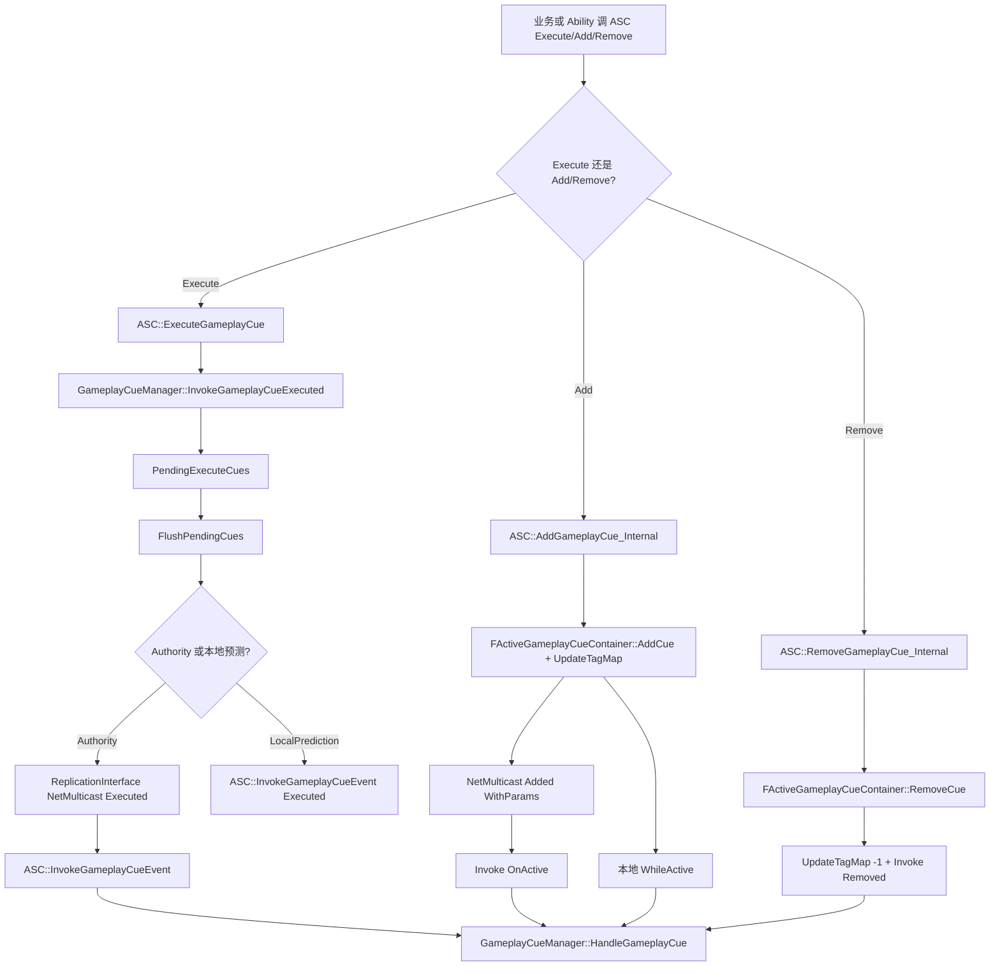
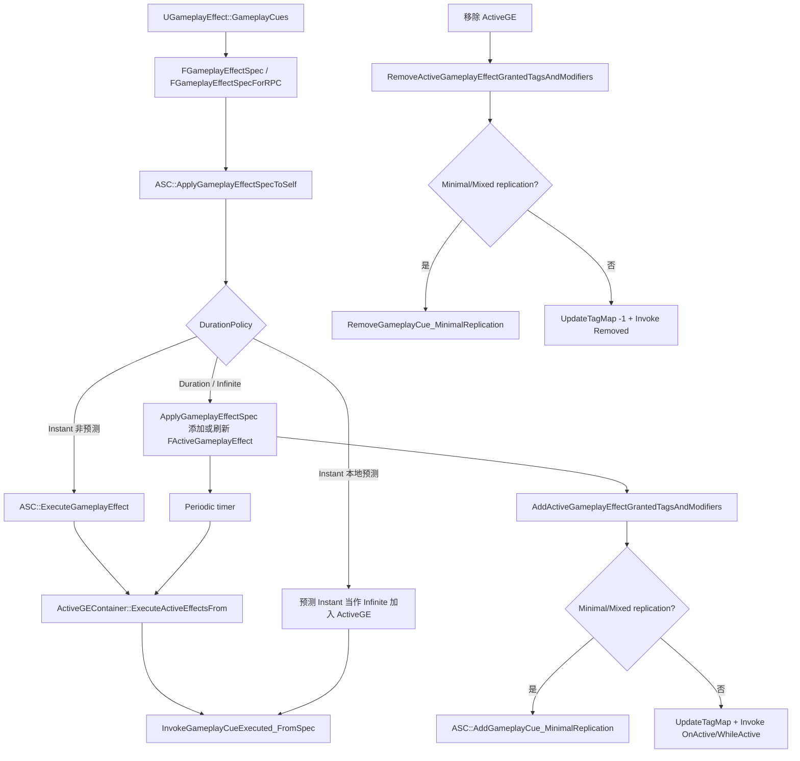

# GameplayCue 体系：第七轮

本专题衔接第四轮 GameplayEffect 流程和第六轮 AbilityTask 流程：GameplayCue 在 GAS 中主要负责把 GE/Ability/ASC 产生的“表现事件”路由到 `GameplayCueNotify`，用于一次性或持续的视觉、声音、动画等表现逻辑。本轮不展开 GameplayCue 编辑器工具、完整网络预测回滚、Niagara/Audio 底层。

## 一、类定位

- GameplayCue 本质上以 `GameplayCue` 分类下的 `FGameplayTag` 为事件键；`FGameplayEffectCue` 保存 cue tag 容器、level 归一化区间和可选 magnitude attribute；源码路径：`Engine/Plugins/Runtime/GameplayAbilities/Source/GameplayAbilities/Public/GameplayEffect.h:578`、`Engine/Plugins/Runtime/GameplayAbilities/Source/GameplayAbilities/Public/GameplayEffect.h:600`、`Engine/Plugins/Runtime/GameplayAbilities/Source/GameplayAbilities/Public/GameplayEffect.h:613`。
- GameplayCue 和 GameplayEffect 的关系：`UGameplayEffect::GameplayCues` 是 GE 配置上的 cue 列表，Instant/periodic execute 触发 `Executed`，Duration/Infinite 添加时触发 `OnActive/WhileActive`，移除时触发 `Removed`；源码路径：`Engine/Plugins/Runtime/GameplayAbilities/Source/GameplayAbilities/Public/GameplayEffect.h:2297`、`Engine/Plugins/Runtime/GameplayAbilities/Source/GameplayAbilities/Private/GameplayEffect.cpp:3205`、`Engine/Plugins/Runtime/GameplayAbilities/Source/GameplayAbilities/Private/GameplayEffect.cpp:4432`、`Engine/Plugins/Runtime/GameplayAbilities/Source/GameplayAbilities/Private/GameplayEffect.cpp:4732`。
- GameplayCue 和 ASC 的关系：ASC 提供 `ExecuteGameplayCue`、`AddGameplayCue`、`RemoveGameplayCue`、`InvokeGameplayCueEvent` 与 NetMulticast RPC；真正的路由交给 `UGameplayCueManager`；源码路径：`Engine/Plugins/Runtime/GameplayAbilities/Source/GameplayAbilities/Public/AbilitySystemComponent.h:879`、`Engine/Plugins/Runtime/GameplayAbilities/Source/GameplayAbilities/Public/AbilitySystemComponent.h:910`、`Engine/Plugins/Runtime/GameplayAbilities/Source/GameplayAbilities/Private/AbilitySystemComponent.cpp:1300`、`Engine/Plugins/Runtime/GameplayAbilities/Source/GameplayAbilities/Private/AbilitySystemComponent.cpp:1295`。
- `UGameplayCueManager` 是一个 `UDataAsset`，注释说明它是处理 cue 分发和按需生成 `GameplayCueNotify_Actor` 的 singleton manager；源码路径：`Engine/Plugins/Runtime/GameplayAbilities/Source/GameplayAbilities/Public/GameplayCueManager.h:128`、`Engine/Plugins/Runtime/GameplayAbilities/Source/GameplayAbilities/Public/GameplayCueManager.h:130`。
- `UGameplayCueSet` 是 tag 到 notify 资产/类的映射集合，包含 `GameplayCueData` 与 `GameplayCueDataMap`，并由 `HandleGameplayCue` 根据 tag 找到处理项；源码路径：`Engine/Plugins/Runtime/GameplayAbilities/Source/GameplayAbilities/Public/GameplayCueSet.h:49`、`Engine/Plugins/Runtime/GameplayAbilities/Source/GameplayAbilities/Public/GameplayCueSet.h:57`、`Engine/Plugins/Runtime/GameplayAbilities/Source/GameplayAbilities/Public/GameplayCueSet.h:92`、`Engine/Plugins/Runtime/GameplayAbilities/Source/GameplayAbilities/Public/GameplayCueSet.h:95`。
- `UGameplayCueNotify_Static` 是非实例化 UObject notify，源码注释说明适合 one-off burst effects；它不能保存每次触发的实例状态是开发实践推断，源码依据是它通过 CDO/default object 处理事件；源码路径：`Engine/Plugins/Runtime/GameplayAbilities/Source/GameplayAbilities/Public/GameplayCueNotify_Static.h:14`、`Engine/Plugins/Runtime/GameplayAbilities/Source/GameplayAbilities/Public/GameplayCueNotify_Static.h:18`、`Engine/Plugins/Runtime/GameplayAbilities/Source/GameplayAbilities/Private/GameplayCueSet.cpp:306`。
- `AGameplayCueNotify_Actor` 是实例化 Actor notify，源码注释说明它可持有状态、tick/update，并由 Manager spawn/recycle；源码路径：`Engine/Plugins/Runtime/GameplayAbilities/Source/GameplayAbilities/Public/GameplayCueNotify_Actor.h:15`、`Engine/Plugins/Runtime/GameplayAbilities/Source/GameplayAbilities/Public/GameplayCueNotify_Actor.h:20`、`Engine/Plugins/Runtime/GameplayAbilities/Source/GameplayAbilities/Private/GameplayCueManager.cpp:523`、`Engine/Plugins/Runtime/GameplayAbilities/Source/GameplayAbilities/Private/GameplayCueManager.cpp:565`。
- `UGameplayCueNotify_Burst`、`AGameplayCueNotify_BurstLatent`、`AGameplayCueNotify_Looping` 在当前 UE5.6 源码中存在；Burst 是非实例 one-off，BurstLatent 是可 latent 的实例 one-off，Looping 是持续效果；源码路径：`Engine/Plugins/Runtime/GameplayAbilities/Source/GameplayAbilities/Public/GameplayCueNotify_Burst.h:13`、`Engine/Plugins/Runtime/GameplayAbilities/Source/GameplayAbilities/Public/GameplayCueNotify_BurstLatent.h:13`、`Engine/Plugins/Runtime/GameplayAbilities/Source/GameplayAbilities/Public/GameplayCueNotify_Looping.h:13`。
- `IGameplayCueInterface` 是 Actor/Object 侧可实现的 native interface，Manager 路由时先调用 `ShouldAcceptGameplayCue`，并可把 cue 分派到对象上的命名函数或自定义 cue set；源码路径：`Engine/Plugins/Runtime/GameplayAbilities/Source/GameplayAbilities/Public/GameplayCueInterface.h:25`、`Engine/Plugins/Runtime/GameplayAbilities/Source/GameplayAbilities/Private/GameplayCueManager.cpp:201`、`Engine/Plugins/Runtime/GameplayAbilities/Source/GameplayAbilities/Private/GameplayCueInterface.cpp:129`。
- `UGameplayCueFunctionLibrary` 提供从 HitResult 生成参数，以及对 Actor 执行、添加、移除 GameplayCue 的蓝图函数；源码路径：`Engine/Plugins/Runtime/GameplayAbilities/Source/GameplayAbilities/Public/GameplayCueFunctionLibrary.h:17`、`Engine/Plugins/Runtime/GameplayAbilities/Source/GameplayAbilities/Public/GameplayCueFunctionLibrary.h:29`、`Engine/Plugins/Runtime/GameplayAbilities/Source/GameplayAbilities/Public/GameplayCueFunctionLibrary.h:33`、`Engine/Plugins/Runtime/GameplayAbilities/Source/GameplayAbilities/Public/GameplayCueFunctionLibrary.h:39`。
- `GameplayCue_Types.cpp` 在当前路径不存在，标记为未确认；源码路径：`Engine/Plugins/Runtime/GameplayAbilities/Source/GameplayAbilities/Private/GameplayCue_Types.cpp`。

## 二、核心类型分析

| 类型 | 定义位置 | 核心职责 | 业务层是否通常直接创建 | 和 ASC / GE / Tag 的关系 | 复制或异步加载 |
| --- | --- | --- | --- | --- | --- |
| `UGameplayCueManager` | `Engine/Plugins/Runtime/GameplayAbilities/Source/GameplayAbilities/Public/GameplayCueManager.h:128` | 全局 cue 分发、Suppress/Translate/Route、Notify Actor spawn/recycle、object library 扫描与异步加载。 | 通常通过 `UAbilitySystemGlobals::Get().GetGameplayCueManager()` 获取，不直接 new；源码路径：`Engine/Plugins/Runtime/GameplayAbilities/Source/GameplayAbilities/Private/AbilitySystemGlobals.cpp:576`。 | ASC/GE 调用它的 `Invoke*` 或 `HandleGameplayCue*`；源码路径：`Engine/Plugins/Runtime/GameplayAbilities/Source/GameplayAbilities/Private/AbilitySystemComponent.cpp:1303`、`Engine/Plugins/Runtime/GameplayAbilities/Source/GameplayAbilities/Private/GameplayEffect.cpp:3211`。 | 使用 `FStreamableManager` 和 `UObjectLibrary` 异步加载 notify；源码路径：`Engine/Plugins/Runtime/GameplayAbilities/Source/GameplayAbilities/Public/GameplayCueManager.h:330`、`Engine/Plugins/Runtime/GameplayAbilities/Source/GameplayAbilities/Private/GameplayCueManager.cpp:919`。 |
| `UGameplayCueSet` | `Engine/Plugins/Runtime/GameplayAbilities/Source/GameplayAbilities/Public/GameplayCueSet.h:52` | 保存 `FGameplayCueNotifyData` 数组和 tag->index map，按 tag 路由到 Static/Actor Notify。 | 通常由 Manager 创建运行时全局 CueSet，业务不直接构造；源码路径：`Engine/Plugins/Runtime/GameplayAbilities/Source/GameplayAbilities/Private/GameplayCueManager.cpp:675`。 | `RouteGameplayCue` 默认调用 runtime CueSet；源码路径：`Engine/Plugins/Runtime/GameplayAbilities/Source/GameplayAbilities/Private/GameplayCueManager.cpp:237`。 | 里面存的是 soft object path 与加载后的 class；源码路径：`Engine/Plugins/Runtime/GameplayAbilities/Source/GameplayAbilities/Public/GameplayCueSet.h:26`、`:29`、`:32`。 |
| `FGameplayCueNotifyData` | `Engine/Plugins/Runtime/GameplayAbilities/Source/GameplayAbilities/Public/GameplayCueSet.h:15` | 单条 tag->notify soft path/class 映射，并缓存父级数据索引。 | 不常由业务直接创建；Manager 扫描资产后构造 `FGameplayCueReferencePair` 再加入 CueSet；源码路径：`Engine/Plugins/Runtime/GameplayAbilities/Source/GameplayAbilities/Private/GameplayCueManager.cpp:986`、`Engine/Plugins/Runtime/GameplayAbilities/Source/GameplayAbilities/Private/GameplayCueSet.cpp:122`。 | `GameplayCueTag` 必须对应 GameplayTagManager 中有效 tag；源码路径：`Engine/Plugins/Runtime/GameplayAbilities/Source/GameplayAbilities/Private/GameplayCueManager.cpp:974`。 | 缺失类时可异步加载并延迟事件；源码路径：`Engine/Plugins/Runtime/GameplayAbilities/Source/GameplayAbilities/Private/GameplayCueSet.cpp:279`、`Engine/Plugins/Runtime/GameplayAbilities/Source/GameplayAbilities/Private/GameplayCueManager.cpp:336`。 |
| `FGameplayCueParameters` | `Engine/Plugins/Runtime/GameplayAbilities/Source/GameplayAbilities/Public/GameplayEffectTypes.h:834` | Cue 运行时参数，保存 magnitude、EffectContext、source/target tags、location/normal、instigator、causer、source object、attach component 等。 | 常由 ASC/AbilitySystemGlobals/FunctionLibrary 生成，业务可传入参数但不应把它当持久状态；源码路径：`Engine/Plugins/Runtime/GameplayAbilities/Source/GameplayAbilities/Private/GameplayEffectTypes.cpp:1031`、`Engine/Plugins/Runtime/GameplayAbilities/Source/GameplayAbilities/Private/GameplayCueFunctionLibrary.cpp:15`。 | 从 GE Spec、EffectContext、ASC 默认值或 HitResult 初始化；源码路径：`Engine/Plugins/Runtime/GameplayAbilities/Source/GameplayAbilities/Private/AbilitySystemGlobals.cpp:378`、`:387`、`Engine/Plugins/Runtime/GameplayAbilities/Source/GameplayAbilities/Private/AbilitySystemComponent.cpp:1209`。 | 实现 `NetSerialize`；`MatchedTagName` 和 `OriginalTag` 标记 NotReplicated；源码路径：`Engine/Plugins/Runtime/GameplayAbilities/Source/GameplayAbilities/Public/GameplayEffectTypes.h:870`、`:874`、`:928`、`Engine/Plugins/Runtime/GameplayAbilities/Source/GameplayAbilities/Private/GameplayEffectTypes.cpp:1074`。 |
| `EGameplayCueEvent` | `Engine/Plugins/Runtime/GameplayAbilities/Source/GameplayAbilities/Public/GameplayEffectTypes.h:958` | 表示 `OnActive`、`WhileActive`、`Executed`、`Removed` 四类 cue 事件。 | 业务通常在 Notify 回调中按事件响应。 | ASC/GE/Manager 统一使用该枚举路由；源码路径：`Engine/Plugins/Runtime/GameplayAbilities/Source/GameplayAbilities/Private/AbilitySystemComponent.cpp:1436`、`Engine/Plugins/Runtime/GameplayAbilities/Source/GameplayAbilities/Private/GameplayCueManager.cpp:190`。 | 枚举本身不复制；通过 RPC/fast array 中的事件路径间接传递。 |
| `UGameplayCueNotify_Static` | `Engine/Plugins/Runtime/GameplayAbilities/Source/GameplayAbilities/Public/GameplayCueNotify_Static.h:18` | 非实例 UObject notify，事件进入 `K2_HandleGameplayCue` 后分发到 `OnExecute/OnActive/WhileActive/OnRemove`。 | 通常做资产/蓝图，不在运行时手动 new；源码路径：`Engine/Plugins/Runtime/GameplayAbilities/Source/GameplayAbilities/Private/GameplayCueSet.cpp:306`。 | 由 CueSet 对加载类 CDO 调 `HandleGameplayCue`；源码路径：`Engine/Plugins/Runtime/GameplayAbilities/Source/GameplayAbilities/Private/GameplayCueNotify_Static.cpp:65`。 | 不涉及 Actor spawn/recycle；资产加载由 Manager/CueSet 处理。 |
| `AGameplayCueNotify_Actor` | `Engine/Plugins/Runtime/GameplayAbilities/Source/GameplayAbilities/Public/GameplayCueNotify_Actor.h:19` | 实例化 Actor notify，可持有状态、attach owner、支持 auto destroy/recycle、unique per instigator/source object。 | 通常作为 GameplayCueNotify 蓝图资产，由 Manager 生成/复用；源码路径：`Engine/Plugins/Runtime/GameplayAbilities/Source/GameplayAbilities/Private/GameplayCueManager.cpp:459`。 | CueSet 识别 Actor CDO 后向 Manager 请求实例，再调用 `HandleGameplayCue`；源码路径：`Engine/Plugins/Runtime/GameplayAbilities/Source/GameplayAbilities/Private/GameplayCueSet.cpp:323`、`:338`。 | Actor 自身由本地 cue 路由 spawn，不是 GE 状态复制对象；复用池在 Manager 中维护；源码路径：`Engine/Plugins/Runtime/GameplayAbilities/Source/GameplayAbilities/Private/GameplayCueManager.cpp:499`、`:594`。 |
| `UGameplayCueNotify_Burst` | `Engine/Plugins/Runtime/GameplayAbilities/Source/GameplayAbilities/Public/GameplayCueNotify_Burst.h:19` | Static 派生，一次性执行 `BurstEffects` 并触发 `OnBurst`。 | 常用于一次性表现资产。 | 响应 `Executed` 的 `OnExecute_Implementation`；源码路径：`Engine/Plugins/Runtime/GameplayAbilities/Source/GameplayAbilities/Private/GameplayCueNotify_Burst.cpp:19`。 | 不支持 latent；源码注释确认；源码路径：`Engine/Plugins/Runtime/GameplayAbilities/Source/GameplayAbilities/Public/GameplayCueNotify_Burst.h:16`。 |
| `AGameplayCueNotify_BurstLatent` | `Engine/Plugins/Runtime/GameplayAbilities/Source/GameplayAbilities/Public/GameplayCueNotify_BurstLatent.h:19` | Actor 派生，一次性但可 latent，默认一段时间后结束回收。 | 常用于需要 timeline/delay 的一次性表现。 | `OnExecute_Implementation` 执行 BurstEffects，设置结束 timer；源码路径：`Engine/Plugins/Runtime/GameplayAbilities/Source/GameplayAbilities/Private/GameplayCueNotify_BurstLatent.cpp:40`、`:58`。 | Actor spawn/recycle；默认 `bAutoDestroyOnRemove=true`、预分配 3 个；源码路径：`Engine/Plugins/Runtime/GameplayAbilities/Source/GameplayAbilities/Private/GameplayCueNotify_BurstLatent.cpp:24`、`:26`。 |
| `AGameplayCueNotify_Looping` | `Engine/Plugins/Runtime/GameplayAbilities/Source/GameplayAbilities/Public/GameplayCueNotify_Looping.h:19` | Actor 派生，分别处理应用、循环开始、周期 recurring、移除。 | 常用于持续表现。 | `OnActive` 执行 ApplicationEffects，`WhileActive` 启动 LoopingEffects，`Executed` 做 RecurringEffects，`Removed` 停止 looping 并做 removal；源码路径：`Engine/Plugins/Runtime/GameplayAbilities/Source/GameplayAbilities/Private/GameplayCueNotify_Looping.cpp:52`、`:70`、`:90`、`:108`。 | Actor spawn/recycle；停止 looping 效果由 `RemoveLoopingEffects` 调 `StopEffects`；源码路径：`Engine/Plugins/Runtime/GameplayAbilities/Source/GameplayAbilities/Private/GameplayCueNotify_Looping.cpp:133`、`:142`。 |
| `IGameplayCueInterface` | `Engine/Plugins/Runtime/GameplayAbilities/Source/GameplayAbilities/Public/GameplayCueInterface.h:25` | TargetActor/Object 直接处理 cue 的 native interface，可按 tag 命名函数分派或转发到 parent。 | 由希望直接响应 cue 的 Actor/Object 实现；不能 Blueprint 实现 interface 本身，源码 meta 写了 `CannotImplementInterfaceInBlueprint`；源码路径：`Engine/Plugins/Runtime/GameplayAbilities/Source/GameplayAbilities/Public/GameplayCueInterface.h:26`。 | Manager 路由时先检查 interface，再调用 runtime CueSet，再调用 interface handler；源码路径：`Engine/Plugins/Runtime/GameplayAbilities/Source/GameplayAbilities/Private/GameplayCueManager.cpp:201`、`:235`、`:241`。 | 不直接复制；由 cue 触发路径驱动。 |
| `UGameplayCueFunctionLibrary` | `Engine/Plugins/Runtime/GameplayAbilities/Source/GameplayAbilities/Public/GameplayCueFunctionLibrary.h:22` | 蓝图工具：HitResult 参数生成、Actor 上执行/添加/移除 Cue。 | 业务蓝图常用。 | 有 ASC 时只在 Authority 调 ASC 并复制；无 ASC 时走 non-replicated Manager 函数；源码路径：`Engine/Plugins/Runtime/GameplayAbilities/Source/GameplayAbilities/Private/GameplayCueFunctionLibrary.cpp:33`、`:38`、`:46`、`:67`。 | 通过 ASC 的 RPC 或本地 non-replicated 路径，不自行复制。 |

## 三、GameplayCue 事件类型

- `OnActive`：Duration/Infinite cue 首次激活时调用；Static/Actor notify 都会映射到 `OnActive` 回调；源码路径：`Engine/Plugins/Runtime/GameplayAbilities/Source/GameplayAbilities/Public/GameplayEffectTypes.h:963`、`Engine/Plugins/Runtime/GameplayAbilities/Source/GameplayAbilities/Private/GameplayCueNotify_Static.cpp:75`、`Engine/Plugins/Runtime/GameplayAbilities/Source/GameplayAbilities/Private/GameplayCueNotify_Actor.cpp:271`。
- `WhileActive`：客户端首次看到持续 cue 处于 active 时调用，包含 join in progress 等场景；ActiveGE 客户端复制延迟处理后会调用；源码路径：`Engine/Plugins/Runtime/GameplayAbilities/Source/GameplayAbilities/Public/GameplayEffectTypes.h:966`、`Engine/Plugins/Runtime/GameplayAbilities/Source/GameplayAbilities/Private/AbilitySystemComponent.cpp:2005`。
- `Executed`：Instant GE 或 periodic tick 使用；ASC multicast executed 实现会调用 `InvokeGameplayCueEvent(..., Executed)`；源码路径：`Engine/Plugins/Runtime/GameplayAbilities/Source/GameplayAbilities/Public/GameplayEffectTypes.h:969`、`Engine/Plugins/Runtime/GameplayAbilities/Source/GameplayAbilities/Private/AbilitySystemComponent.cpp:1436`、`Engine/Plugins/Runtime/GameplayAbilities/Source/GameplayAbilities/Private/GameplayEffect.cpp:4486`。
- `Removed`：Duration/Infinite cue 移除时调用；ActiveCue fast array 移除和 ActiveGE 移除都会触发；源码路径：`Engine/Plugins/Runtime/GameplayAbilities/Source/GameplayAbilities/Public/GameplayEffectTypes.h:972`、`Engine/Plugins/Runtime/GameplayAbilities/Source/GameplayAbilities/Private/GameplayCueInterface.cpp:251`、`Engine/Plugins/Runtime/GameplayAbilities/Source/GameplayAbilities/Private/GameplayEffect.cpp:4734`。
- `ExecuteGameplayCue` 对应 `Executed`；`AddGameplayCue` 在 authority 上通过 RPC 触发 `OnActive`，并在新 cue 时本地触发 `WhileActive`，预测客户端会本地触发两者；源码路径：`Engine/Plugins/Runtime/GameplayAbilities/Source/GameplayAbilities/Private/AbilitySystemComponent.cpp:1300`、`:1378`、`:1385`、`:1391`。
- `RemoveGameplayCue` 对应 `Removed`，authority 路径由 `FActiveGameplayCueContainer::RemoveCue` 更新 tag count 并触发 Removed；源码路径：`Engine/Plugins/Runtime/GameplayAbilities/Source/GameplayAbilities/Private/AbilitySystemComponent.cpp:1411`、`Engine/Plugins/Runtime/GameplayAbilities/Source/GameplayAbilities/Private/GameplayCueInterface.cpp:330`、`:375`。
- 常见误区：用 `Executed` 做持续特效没有与之配对的 `Removed`；源码确认 `Executed` 是 instant/periodic 用途，持续生命周期应由 Add/Remove 或 Duration/Infinite GE 驱动；源码路径：`Engine/Plugins/Runtime/GameplayAbilities/Source/GameplayAbilities/Public/GameplayEffectTypes.h:969`、`Engine/Plugins/Runtime/GameplayAbilities/Source/GameplayAbilities/Private/GameplayCueNotify_Looping.cpp:70`、`:108`。

## 四、ASC 触发 GameplayCue 的路径



简化伪代码：

```cpp
// Execute: 一次性 cue，可能被 batching 到 FlushPendingCues
ASC.ExecuteGameplayCue(Tag, Params);
Manager.InvokeGameplayCueExecuted_WithParams(ASC, Tag, ASC.ScopedPredictionKey, Params);
Manager.AddPendingCueExecuteInternal(PendingCue);
Manager.FlushPendingCues();
if (ASC.HasAuthority()) ReplicationInterface.Call_InvokeGameplayCueExecuted_WithParams(...);
else if (PredictionKey.IsLocalClientKey()) ASC.InvokeGameplayCueEvent(Tag, Executed, Params);

// Add/Remove: 持续 cue，进入 ActiveGameplayCues 或 MinimalReplicationGameplayCues
ASC.AddGameplayCue(Tag, Params);
Container.AddCue(Tag, PredictionKey, Params);      // UpdateTagMap(+1)
ReplicationInterface.Call_InvokeGameplayCueAdded_WithParams(...);
ASC.InvokeGameplayCueEvent(Tag, WhileActive, Params);

ASC.RemoveGameplayCue(Tag);
Container.RemoveCue(Tag);                          // UpdateTagMap(-1), Removed
```

- `ExecuteGameplayCue` 只把请求交给 Manager wrapper，Manager 用 `FGameplayCuePendingExecute` 和 `FlushPendingCues` 统一发送 RPC 或本地预测执行；源码路径：`Engine/Plugins/Runtime/GameplayAbilities/Source/GameplayAbilities/Private/AbilitySystemComponent.cpp:1300`、`Engine/Plugins/Runtime/GameplayAbilities/Source/GameplayAbilities/Private/GameplayCueManager.cpp:1417`、`:1467`、`:1500`。
- `AddGameplayCue`/`RemoveGameplayCue` 修改 `ActiveGameplayCues`，这是“非 GE 直接添加的持久 cue”容器；源码路径：`Engine/Plugins/Runtime/GameplayAbilities/Source/GameplayAbilities/Public/AbilitySystemComponent.h:1883`、`Engine/Plugins/Runtime/GameplayAbilities/Source/GameplayAbilities/Private/AbilitySystemComponent.cpp:1312`、`:1401`。
- ASC 的 NetMulticast cue RPC 都是 unreliable，并且头文件注释提示不要直接调用这些函数，应走 GameplayCueManager wrapper；源码路径：`Engine/Plugins/Runtime/GameplayAbilities/Source/GameplayAbilities/Public/AbilitySystemComponent.h:879`、`:880`、`:883`、`:889`、`:895`。
- `InvokeGameplayCueEvent` 最终拿 AvatarActor 调 `GameplayCueManager->HandleGameplayCue/HandleGameplayCues`，若没有 `AbilityActorInfo` 会 ensure，若 Avatar 缺失或 `bSuppressGameplayCues` 为 true 会跳过；源码路径：`Engine/Plugins/Runtime/GameplayAbilities/Source/GameplayAbilities/Private/AbilitySystemComponent.cpp:1226`、`:1232`、`:1273`、`:1287`、`:1295`。
- `ReplicationProxyEnabled` 会让 GameplayCue RPC 经 AvatarActor 的 `IAbilitySystemReplicationProxyInterface` 而不是 ASC 本体；源码路径：`Engine/Plugins/Runtime/GameplayAbilities/Source/GameplayAbilities/Public/AbilitySystemComponent.h:1368`、`Engine/Plugins/Runtime/GameplayAbilities/Source/GameplayAbilities/Private/AbilitySystemComponent.cpp:1789`。

## 五、GameplayEffect 触发 GameplayCue 的路径



简化伪代码：

```cpp
if (GE.DurationPolicy == Instant && !PredictiveInstant)
{
    ASC.ExecuteGameplayEffect(Spec, PredictionKey);
    ActiveEffects.ExecuteActiveEffectsFrom(Spec, PredictionKey);
    Manager.InvokeGameplayCueExecuted_FromSpec(ASC, Spec, PredictionKey);
}
else
{
    ActiveGE = ActiveEffects.ApplyGameplayEffectSpec(Spec);
    if (ShouldUseMinimalReplication())
        ASC.AddGameplayCue_MinimalReplication(CueTag, Spec.Context);
    else
    {
        ASC.UpdateTagMap(CueTags, +1);
        ASC.InvokeGameplayCueEvent(Spec, OnActive);
        ASC.InvokeGameplayCueEvent(Spec, WhileActive);
    }
}

if (PeriodicTick)
{
    ActiveEffects.ExecuteActiveEffectsFrom(ActiveGE.Spec); // Executed cue
}

if (RemoveActiveGE)
{
    if (ShouldUseMinimalReplication()) ASC.RemoveGameplayCue_MinimalReplication(CueTag);
    else ASC.InvokeGameplayCueEvent(Spec, Removed);
}
```

- `FGameplayEffectSpecForRPC` 是 Spec 的 RPC 精简版，只复制 cue 需要的 modified attributes、EffectContext、聚合 tags、level、ability level；源码路径：`Engine/Plugins/Runtime/GameplayAbilities/Source/GameplayAbilities/Public/GameplayEffect.h:1258`、`:1272`、`:1278`、`:1284`、`Engine/Plugins/Runtime/GameplayAbilities/Source/GameplayAbilities/Private/GameplayEffect.cpp:1584`。
- `FGameplayEffectModifiedAttribute` 会影响 GameplayCue 参数：当 cue 配置 `MagnitudeAttribute` 时，`InitGameplayCueParameters_GESpec`/ASC 会把匹配属性的 `TotalMagnitude` 写到 `RawMagnitude`；源码路径：`Engine/Plugins/Runtime/GameplayAbilities/Source/GameplayAbilities/Private/AbilitySystemGlobals.cpp:392`、`:398`、`:402`、`Engine/Plugins/Runtime/GameplayAbilities/Source/GameplayAbilities/Private/AbilitySystemComponent.cpp:1255`、`:1259`。
- `NormalizedMagnitude` 来自 `FGameplayEffectCue::NormalizeLevel`，按 GE level 在 MinLevel/MaxLevel 间归一化；源码路径：`Engine/Plugins/Runtime/GameplayAbilities/Source/GameplayAbilities/Public/GameplayEffect.h:604`、`:608`、`:616`。
- `bRequireModifierSuccessToTriggerCues` 控制 `Executed` cue 是否必须有 modifier/execution 成功，ExecutionCalculation 也可声明已手动处理 cue 从而跳过自动触发；源码路径：`Engine/Plugins/Runtime/GameplayAbilities/Source/GameplayAbilities/Public/GameplayEffect.h:2289`、`Engine/Plugins/Runtime/GameplayAbilities/Source/GameplayAbilities/Private/GameplayEffect.cpp:3191`、`:3194`、`:3199`。
- `bSuppressStackingCues` 会抑制 stacking GE 的重复 Added/WhileActive cue RPC；源码路径：`Engine/Plugins/Runtime/GameplayAbilities/Source/GameplayAbilities/Public/GameplayEffect.h:2293`、`Engine/Plugins/Runtime/GameplayAbilities/Source/GameplayAbilities/Private/AbilitySystemComponent.cpp:921`、`:925`。
- UE5.6 当前源码仍确认 `UGameplayEffect::GameplayCues` 字段；本轮扫描 `GameplayEffectComponents` 目录未发现 `GameplayCue` 相关组件，`GameplayCueComponent` 未确认；源码路径：`Engine/Plugins/Runtime/GameplayAbilities/Source/GameplayAbilities/Public/GameplayEffect.h:2299`、`Engine/Plugins/Runtime/GameplayAbilities/Source/GameplayAbilities/Public/GameplayEffectComponents`、`Engine/Plugins/Runtime/GameplayAbilities/Source/GameplayAbilities/Private/GameplayEffectComponents`。

## 六、GameplayCueParameters

- `FGameplayCueParameters` 字段包括 `NormalizedMagnitude`、`RawMagnitude`、`EffectContext`、`MatchedTagName`、`OriginalTag`、聚合 Source/Target tags、`Location`、`Normal`、`Instigator`、`EffectCauser`、`SourceObject`、`PhysicalMaterial`、GE/Ability level、`TargetAttachComponent`、minimal proxy location 标志；源码路径：`Engine/Plugins/Runtime/GameplayAbilities/Source/GameplayAbilities/Public/GameplayEffectTypes.h:857`、`:865`、`:869`、`:877`、`:885`、`:893`、`:897`、`:901`、`:905`、`:909`、`:917`、`:921`。
- 从 `FGameplayEffectSpecForRPC` 构造时会调用 `UAbilitySystemGlobals::InitGameplayCueParameters`，复制 AggregatedSourceTags、AggregatedTargetTags、GameplayEffectLevel、AbilityLevel，并继续从 EffectContext 初始化；源码路径：`Engine/Plugins/Runtime/GameplayAbilities/Source/GameplayAbilities/Private/GameplayEffectTypes.cpp:1031`、`Engine/Plugins/Runtime/GameplayAbilities/Source/GameplayAbilities/Private/AbilitySystemGlobals.cpp:378`、`:380`、`:384`。
- 从完整 `FGameplayEffectSpec` 初始化时会复制 Spec captured tags，并根据 GE 的 cue magnitude attribute 查询 modified attributes；源码路径：`Engine/Plugins/Runtime/GameplayAbilities/Source/GameplayAbilities/Private/AbilitySystemGlobals.cpp:387`、`:389`、`:392`、`:398`。
- 从 `FGameplayEffectContextHandle` 初始化时源码默认只把 EffectContext 复制到参数；具体项目可 override `UAbilitySystemGlobals` 相关虚函数扩展，源码注释确认项目可覆盖；源码路径：`Engine/Plugins/Runtime/GameplayAbilities/Source/GameplayAbilities/Private/AbilitySystemGlobals.cpp:420`、`:424`、`Engine/Plugins/Runtime/GameplayAbilities/Source/GameplayAbilities/Public/AbilitySystemGlobals.h:256`。
- `Instigator`、`EffectCauser`、`SourceObject` 的 getter 会优先用参数字段，否则回退到 EffectContext；源码路径：`Engine/Plugins/Runtime/GameplayAbilities/Source/GameplayAbilities/Private/GameplayEffectTypes.cpp:1284`、`:1291`、`:1295`、`:1302`、`:1306`、`:1313`。
- HitResult 转参数只设置 `Location`、`Normal`、`PhysicalMaterial`，没有自动填 Instigator/EffectCauser；源码路径：`Engine/Plugins/Runtime/GameplayAbilities/Source/GameplayAbilities/Private/GameplayCueFunctionLibrary.cpp:15`、`:19`、`:21`。
- `FGameplayCueParameters` 实现 `NetSerialize`，但 `MatchedTagName` 与 `OriginalTag` 是 NotReplicated；这些 tag 在本地路由时由 CueSet/Interface 设置；源码路径：`Engine/Plugins/Runtime/GameplayAbilities/Source/GameplayAbilities/Public/GameplayEffectTypes.h:870`、`:874`、`:928`、`Engine/Plugins/Runtime/GameplayAbilities/Source/GameplayAbilities/Private/GameplayCueSet.cpp:275`。

## 七、GameplayCueManager 路由机制

- Manager 主入口 `HandleGameplayCue(s)` 先检查 suppression，再可做 tag translation，最后 `RouteGameplayCue`；源码路径：`Engine/Plugins/Runtime/GameplayAbilities/Source/GameplayAbilities/Private/GameplayCueManager.cpp:120`、`:129`、`:140`、`:169`、`:174`。
- suppression 默认会在全局禁用、TargetActor 空、dedicated server 且 cvar 不允许运行时返回 true；源码路径：`Engine/Plugins/Runtime/GameplayAbilities/Source/GameplayAbilities/Private/GameplayCueManager.cpp:177`、`:179`。
- `RouteGameplayCue` 先询问 TargetActor 的 `IGameplayCueInterface::ShouldAcceptGameplayCue`，再交给 runtime CueSet，最后调用 interface handler；源码路径：`Engine/Plugins/Runtime/GameplayAbilities/Source/GameplayAbilities/Private/GameplayCueManager.cpp:201`、`:206`、`:235`、`:241`。
- CueSet 精确查 `GameplayCueDataMap`；没有找到或 index 为 `INDEX_NONE` 则返回 false，Manager 当前不会对未找到 notify 显式报错；源码路径：`Engine/Plugins/Runtime/GameplayAbilities/Source/GameplayAbilities/Private/GameplayCueSet.cpp:78`、`:80`、`:90`、`Engine/Plugins/Runtime/GameplayAbilities/Source/GameplayAbilities/Private/GameplayCueManager.cpp:237`。
- 父子 tag 匹配由 `BuildAccelerationMap_Internal` 建立：若子 tag 没有 notify，会指向父 tag 的 notify；每个 notify 还缓存可继续调用的父级 data index；源码路径：`Engine/Plugins/Runtime/GameplayAbilities/Source/GameplayAbilities/Private/GameplayCueSet.cpp:366`、`:382`、`:386`、`:394`、`:401`。
- 多个 notify 精确绑定同一个 tag 时，`AddCues` 会警告并跳过重复项；同一 tag 的父级 notify 是否继续执行由 `IsOverride` 控制，`IsOverride=false` 时继续走 `ParentDataIdx`；源码路径：`Engine/Plugins/Runtime/GameplayAbilities/Source/GameplayAbilities/Private/GameplayCueSet.cpp:102`、`:110`、`Engine/Plugins/Runtime/GameplayAbilities/Source/GameplayAbilities/Private/GameplayCueSet.cpp:312`、`:343`。
- Runtime object library 路径来自 `AbilitySystemGlobals::GetGameplayCueNotifyPaths()`，若为空会回退 `/Game` 并警告；源码路径：`Engine/Plugins/Runtime/GameplayAbilities/Source/GameplayAbilities/Private/AbilitySystemGlobals.cpp:181`、`:188`、`Engine/Plugins/Runtime/GameplayAbilities/Source/GameplayAbilities/Private/AbilitySystemGlobals.cpp:609`、`:611`。
- Runtime 初始化会创建 `GlobalGameplayCueSet`，扫描 Actor/Static notify 的蓝图资产数据，将 `GameplayCueName` 映射到 generated class soft path，再可异步加载资产；源码路径：`Engine/Plugins/Runtime/GameplayAbilities/Source/GameplayAbilities/Private/GameplayCueManager.cpp:675`、`:678`、`:853`、`:889`、`:986`、`:909`。
- 缺失 notify 默认不同步加载、默认异步加载；事件会排队到 `AsyncLoadPendingGameplayCues`，加载完成后按原参数重新执行；源码路径：`Engine/Plugins/Runtime/GameplayAbilities/Source/GameplayAbilities/Private/GameplayCueManager.cpp:321`、`:326`、`:336`、`:352`、`:361`、`:378`、`:397`、`:424`。
- 编辑器资产注册/扫描逻辑存在于 Manager 的 `WITH_EDITOR` 分支与 GameplayAbilitiesEditor 模块，本轮不完整展开；源码路径：`Engine/Plugins/Runtime/GameplayAbilities/Source/GameplayAbilities/Private/GameplayCueManager.cpp:91`、`:692`、`Engine/Plugins/Runtime/GameplayAbilities/Source/GameplayAbilitiesEditor/Private`。

## 八、GameplayCueNotify 类型差异

| 类型 | UObject/Actor | 状态与 latent | 适合场景 | 生命周期 | 常见坑 |
| --- | --- | --- | --- | --- | --- |
| `UGameplayCueNotify_Static` | UObject | 通过 CDO 处理，不适合保存每次实例状态是开发实践推断；源码路径：`Engine/Plugins/Runtime/GameplayAbilities/Source/GameplayAbilities/Private/GameplayCueSet.cpp:306`。 | 简单一次性或无状态响应。 | `HandleGameplayCue` 直接分发四类回调；源码路径：`Engine/Plugins/Runtime/GameplayAbilities/Source/GameplayAbilities/Private/GameplayCueNotify_Static.cpp:65`。 | 在 Static 中保存实例状态会被多次触发共享。 |
| `AGameplayCueNotify_Actor` | Actor | 可保存状态、tick、attach owner；源码路径：`Engine/Plugins/Runtime/GameplayAbilities/Source/GameplayAbilities/Public/GameplayCueNotify_Actor.h:15`、`:114`。 | 需要持续状态、挂载、延迟清理、unique instigator/source 的表现。 | Manager 查找已有实例、复用池或 spawn 新 Actor；源码路径：`Engine/Plugins/Runtime/GameplayAbilities/Source/GameplayAbilities/Private/GameplayCueManager.cpp:491`、`:502`、`:527`。 | `Removed`/回收清理不完整会遗留状态或效果。 |
| `UGameplayCueNotify_Burst` | UObject/Static | 非实例，源码注释明确不能做 latent delay/timeline；源码路径：`Engine/Plugins/Runtime/GameplayAbilities/Source/GameplayAbilities/Public/GameplayCueNotify_Burst.h:16`。 | 一次性 Niagara/Audio/CameraShake 等 burst。 | `OnExecute` 执行 BurstEffects 并调用 `OnBurst`；源码路径：`Engine/Plugins/Runtime/GameplayAbilities/Source/GameplayAbilities/Private/GameplayCueNotify_Burst.cpp:19`、`:31`、`:33`。 | 用 looping asset 做 burst 会泄漏，验证逻辑有检查；源码路径：`Engine/Plugins/Runtime/GameplayAbilities/Source/GameplayAbilities/Private/GameplayCueNotifyTypes.cpp:463`。 |
| `AGameplayCueNotify_BurstLatent` | Actor | 可 latent，默认 auto destroy/recycle；源码路径：`Engine/Plugins/Runtime/GameplayAbilities/Source/GameplayAbilities/Public/GameplayCueNotify_BurstLatent.h:16`、`Engine/Plugins/Runtime/GameplayAbilities/Source/GameplayAbilities/Private/GameplayCueNotify_BurstLatent.cpp:25`。 | 一次性但需要 timeline/delay 的表现。 | `OnExecute` 后设置 timer 调 `GameplayCueFinishedCallback`；源码路径：`Engine/Plugins/Runtime/GameplayAbilities/Source/GameplayAbilities/Private/GameplayCueNotify_BurstLatent.cpp:58`、`:61`。 | 修改默认寿命/不结束会占用实例。 |
| `AGameplayCueNotify_Looping` | Actor | 持有 Application/Looping/Recurring/Removal spawn results；源码路径：`Engine/Plugins/Runtime/GameplayAbilities/Source/GameplayAbilities/Public/GameplayCueNotify_Looping.h:70`、`:78`、`:86`、`:94`。 | 持续光环、燃烧、护盾等。 | `OnActive` 应用、`WhileActive` 开始循环、`Executed` recurring、`Removed` 停止循环与移除表现；源码路径：`Engine/Plugins/Runtime/GameplayAbilities/Source/GameplayAbilities/Private/GameplayCueNotify_Looping.cpp:52`、`:70`、`:90`、`:108`。 | 没处理 Removed 或错误使用 Execute 会让 looping 效果不停止。 |

## 九、GameplayCueNotify Actor 生命周期

- CueSet 识别 Actor notify 后，调用 `UGameplayCueManager::GetInstancedCueActor`，Manager 先尝试在 TargetActor children 中找同类且 instigator/source object 匹配的已有实例；源码路径：`Engine/Plugins/Runtime/GameplayAbilities/Source/GameplayAbilities/Private/GameplayCueSet.cpp:323`、`:338`、`Engine/Plugins/Runtime/GameplayAbilities/Source/GameplayAbilities/Private/GameplayCueManager.cpp:432`、`:447`。
- 找不到已有实例时，Manager 默认尝试从 recycle/preallocation 列表取一个，再设置 Owner、位置、instigator/source object；源码路径：`Engine/Plugins/Runtime/GameplayAbilities/Source/GameplayAbilities/Private/GameplayCueManager.cpp:499`、`:502`、`:505`、`:508`。
- 没有可复用实例时，Manager 用 `World->SpawnActor<AGameplayCueNotify_Actor>` 在目标 actor 位置生成，并把 TargetActor 设为 owner；源码路径：`Engine/Plugins/Runtime/GameplayAbilities/Source/GameplayAbilities/Private/GameplayCueManager.cpp:523`、`:527`。
- Actor notify 的 `HandleGameplayCue` 根据事件调用 `OnActive`、`WhileActive`、`OnExecute`、`OnRemove`，并用 `bAllowMultipleOnActiveEvents` / `bAllowMultipleWhileActiveEvents` 控制重复事件；源码路径：`Engine/Plugins/Runtime/GameplayAbilities/Source/GameplayAbilities/Private/GameplayCueNotify_Actor.cpp:222`、`:233`、`:238`、`:269`。
- `OnRemove` 后如果 `bAutoDestroyOnRemove` 为 true，会按 `AutoDestroyDelay` 调 `GameplayCueFinishedCallback`；源码路径：`Engine/Plugins/Runtime/GameplayAbilities/Source/GameplayAbilities/Private/GameplayCueNotify_Actor.cpp:289`、`:293`、`:297`、`:302`。
- `GameplayCueFinishedCallback` 会确保必要的 `OnRemove` 至少执行一次，然后通知 Manager 回收/销毁；源码路径：`Engine/Plugins/Runtime/GameplayAbilities/Source/GameplayAbilities/Private/GameplayCueNotify_Actor.cpp:361`、`:372`、`:381`。
- `Recycle` 会清掉事件标记、instigator/source object、owner delegate、latent actions、timers，隐藏并 detach actor；源码路径：`Engine/Plugins/Runtime/GameplayAbilities/Source/GameplayAbilities/Private/GameplayCueNotify_Actor.cpp:389`、`:391`、`:394`、`:397`、`:431`、`:437`、`:441`。
- Looping 类额外用 `RemoveLoopingEffects` 停止 looping effects；Niagara/Audio 组件底层停止细节在 `GameplayCueNotifyTypes`，本轮只确认 GCN 侧调用 `StopEffects`，不展开底层；源码路径：`Engine/Plugins/Runtime/GameplayAbilities/Source/GameplayAbilities/Private/GameplayCueNotify_Looping.cpp:133`、`:142`、`Engine/Plugins/Runtime/GameplayAbilities/Source/GameplayAbilities/Private/GameplayCueNotifyTypes.cpp:1095`。

## 十、GameplayCue 复制机制

- ASC 手动 `Execute` cue 通过 Manager pending 队列走 unreliable NetMulticast；authority 端调用 replication interface，local predicted 端本地执行并依赖 PredictionKey 避免重复；源码路径：`Engine/Plugins/Runtime/GameplayAbilities/Source/GameplayAbilities/Private/GameplayCueManager.cpp:1500`、`:1528`、`:1543`、`:1554`、`:1562`。
- `ActiveGameplayCues` 是复制的 `FActiveGameplayCueContainer`，用于非 GE 直接添加的 persistent cue；源码路径：`Engine/Plugins/Runtime/GameplayAbilities/Source/GameplayAbilities/Public/AbilitySystemComponent.h:1883`、`Engine/Plugins/Runtime/GameplayAbilities/Source/GameplayAbilities/Private/AbilitySystemComponent.cpp:1638`。
- `FActiveGameplayCueContainer` 继承 fast array，`PostReplicatedAdd` 更新 tag map 并触发 `WhileActive`，`PreReplicatedRemove` 触发 `Removed`；源码路径：`Engine/Plugins/Runtime/GameplayAbilities/Source/GameplayAbilities/Public/GameplayCueInterface.h:132`、`Engine/Plugins/Runtime/GameplayAbilities/Source/GameplayAbilities/Private/GameplayCueInterface.cpp:276`、`:291`、`:296`、`:251`、`:271`。
- `MinimalReplicationGameplayCues` 是 minimal replication 模式下代表 ActiveGE cue 的复制容器，复制条件为 `COND_SkipOwner`，且 `ShouldReplicate` 在 Full 模式下返回 false；源码路径：`Engine/Plugins/Runtime/GameplayAbilities/Source/GameplayAbilities/Public/AbilitySystemComponent.h:1887`、`Engine/Plugins/Runtime/GameplayAbilities/Source/GameplayAbilities/Private/AbilitySystemComponent.cpp:1655`、`Engine/Plugins/Runtime/GameplayAbilities/Source/GameplayAbilities/Private/GameplayCueInterface.cpp:452`。
- GE 在 minimal/mixed replication 路径添加 cue 时会调用 `AddGameplayCue_MinimalReplication`，移除时调用 `RemoveGameplayCue_MinimalReplication`；源码路径：`Engine/Plugins/Runtime/GameplayAbilities/Source/GameplayAbilities/Private/GameplayEffect.cpp:4418`、`:4424`、`Engine/Plugins/Runtime/GameplayAbilities/Source/GameplayAbilities/Private/GameplayEffect.cpp:4720`、`:4724`。
- `FMinimalGameplayCueReplicationProxy` 是另一种 minimal cue 复制代理，只复制 tag 和可选 location，不复制完整参数，接收端用默认参数合成；源码路径：`Engine/Plugins/Runtime/GameplayAbilities/Source/GameplayAbilities/Public/GameplayCueInterface.h:202`、`:221`、`Engine/Plugins/Runtime/GameplayAbilities/Source/GameplayAbilities/Private/GameplayCueInterface.cpp:610`、`:645`。
- 本地预测场景下 cue 可能重复触发，因此多个路径显式检查 PredictionKey：NetMulticast implementation 跳过 local client key，ActiveGE PostReplicatedAdd 遇到本地预测副本可不触发 cue，预测 catchup 会移除 loose tag 并可能触发 Removed；源码路径：`Engine/Plugins/Runtime/GameplayAbilities/Source/GameplayAbilities/Private/AbilitySystemComponent.cpp:1438`、`Engine/Plugins/Runtime/GameplayAbilities/Source/GameplayAbilities/Private/GameplayEffect.cpp:2745`、`:2751`、`Engine/Plugins/Runtime/GameplayAbilities/Source/GameplayAbilities/Private/AbilitySystemComponent.cpp:1797`。
- 预测失败后 GameplayCue 的完整回滚/重放规则本轮不完整展开，未确认；已确认存在 `OnPredictiveGameplayCueCatchup` 与 prediction key delegate 接入；源码路径：`Engine/Plugins/Runtime/GameplayAbilities/Source/GameplayAbilities/Private/GameplayCueInterface.cpp:427`、`:435`、`Engine/Plugins/Runtime/GameplayAbilities/Source/GameplayAbilities/Private/AbilitySystemComponent.cpp:1797`。

## 十一、GameplayCue 和 Ability / AbilityTask 的关系

- Ability 可以不通过 GameplayEffect 直接触发 GameplayCue，`UGameplayAbility` 公开 `K2_ExecuteGameplayCue`、`K2_AddGameplayCue`、`K2_RemoveGameplayCue`；源码路径：`Engine/Plugins/Runtime/GameplayAbilities/Source/GameplayAbilities/Public/Abilities/GameplayAbility.h:681`、`:686`、`:693`、`:701`。
- Ability 直接 Add 的 cue 可设置 `bRemoveOnAbilityEnd`，Ability 结束时会遍历 `TrackedGameplayCues` 并调用 ASC `RemoveGameplayCue`；源码路径：`Engine/Plugins/Runtime/GameplayAbilities/Source/GameplayAbilities/Private/Abilities/GameplayAbility.cpp:1721`、`:1738`、`:1740`、`Engine/Plugins/Runtime/GameplayAbilities/Source/GameplayAbilities/Private/Abilities/GameplayAbility.cpp:852`。
- Ability 通过 GE 间接触发 GameplayCue 的常见流程是：Ability `ApplyGameplayEffectSpecToOwner/Target` 使用 `FScopedGameplayCueSendContext` batching cue，然后 GE 应用/执行/移除驱动 cue；源码路径：`Engine/Plugins/Runtime/GameplayAbilities/Source/GameplayAbilities/Private/Abilities/GameplayAbility.cpp:2036`、`:2038`、`:2069`、`Engine/Plugins/Runtime/GameplayAbilities/Source/GameplayAbilities/Public/GameplayCue_Types.h:136`。
- 当前 Tasks 目录未发现专门等待 GameplayCue 的 AbilityTask；本轮 `rg GameplayCue` 只确认 Ability 本身和 GE/ASC/Manager 路径，`WaitGameplayCue` 类未确认；源码路径：`Engine/Plugins/Runtime/GameplayAbilities/Source/GameplayAbilities/Public/Abilities/Tasks`、`Engine/Plugins/Runtime/GameplayAbilities/Source/GameplayAbilities/Private/Abilities/Tasks`。
- GameplayCue 适合表现层是开发实践推断；源码依据是 GE 字段注释把它描述为 sounds、particle effects 等非模拟反应，FunctionLibrary display name 也区分 Burst/Looping；源码路径：`Engine/Plugins/Runtime/GameplayAbilities/Source/GameplayAbilities/Public/GameplayEffect.h:2297`、`Engine/Plugins/Runtime/GameplayAbilities/Source/GameplayAbilities/Public/GameplayCueFunctionLibrary.h:36`、`:42`。
- GameplayCue 不适合承载核心战斗逻辑是开发实践推断；源码层面 cue RPC 是 unreliable，且 Manager 可在 dedicated server suppression 下跳过表现；源码路径：`Engine/Plugins/Runtime/GameplayAbilities/Source/GameplayAbilities/Public/AbilitySystemComponent.h:880`、`Engine/Plugins/Runtime/GameplayAbilities/Source/GameplayAbilities/Private/GameplayCueManager.cpp:177`。

## 十二、GameplayCue 开发速查

- 一次性命中、爆炸、飘字等表现优先用 `ExecuteGameplayCue` 或 Instant/periodic GE 的 `GameplayCues`；源码路径：`Engine/Plugins/Runtime/GameplayAbilities/Source/GameplayAbilities/Public/GameplayEffectTypes.h:969`、`Engine/Plugins/Runtime/GameplayAbilities/Source/GameplayAbilities/Private/AbilitySystemComponent.cpp:1300`。
- 持续表现优先用 Duration/Infinite GE 配 `GameplayCues`，或手动 `AddGameplayCue` 并确保配对 `RemoveGameplayCue`；源码路径：`Engine/Plugins/Runtime/GameplayAbilities/Source/GameplayAbilities/Private/GameplayEffect.cpp:4411`、`:4714`、`Engine/Plugins/Runtime/GameplayAbilities/Source/GameplayAbilities/Private/AbilitySystemComponent.cpp:1312`、`:1401`。
- 能通过 GE 表达的 buff/debuff 表现，优先放在 GE 的 `GameplayCues`，这样生命周期与 ActiveGE 添加/移除绑定；源码路径：`Engine/Plugins/Runtime/GameplayAbilities/Source/GameplayAbilities/Public/GameplayEffect.h:2299`、`Engine/Plugins/Runtime/GameplayAbilities/Source/GameplayAbilities/Private/GameplayEffect.cpp:4434`、`:4734`。
- Static/Burst 适合无状态 one-off；Actor/BurstLatent 适合需要 latent 的 one-off；Looping 适合持续效果；源码路径：`Engine/Plugins/Runtime/GameplayAbilities/Source/GameplayAbilities/Public/GameplayCueNotify_Burst.h:16`、`Engine/Plugins/Runtime/GameplayAbilities/Source/GameplayAbilities/Public/GameplayCueNotify_BurstLatent.h:16`、`Engine/Plugins/Runtime/GameplayAbilities/Source/GameplayAbilities/Public/GameplayCueNotify_Looping.h:16`。
- GameplayCueTag 命名建议使用 `GameplayCue.*` 层级是开发实践推断；源码依据是 `FGameplayEffectCue.GameplayCueTags` 元数据过滤到 `GameplayCue` 分类，CueSet base tag 是 `GameplayCue`；源码路径：`Engine/Plugins/Runtime/GameplayAbilities/Source/GameplayAbilities/Public/GameplayEffect.h:613`、`Engine/Plugins/Runtime/GameplayAbilities/Source/GameplayAbilities/Private/GameplayCueSet.cpp:15`、`:424`。
- 排查不播放：确认 tag 在 GameplayTagManager 中有效、Notify 资产 `GameplayCueName` 可被扫描、路径在 `GameplayCueNotifyPaths` 中、Manager 没 suppression、目标 Avatar 有效；源码路径：`Engine/Plugins/Runtime/GameplayAbilities/Source/GameplayAbilities/Private/GameplayCueManager.cpp:974`、`:999`、`Engine/Plugins/Runtime/GameplayAbilities/Source/GameplayAbilities/Private/AbilitySystemGlobals.cpp:609`、`Engine/Plugins/Runtime/GameplayAbilities/Source/GameplayAbilities/Private/GameplayCueManager.cpp:177`、`Engine/Plugins/Runtime/GameplayAbilities/Source/GameplayAbilities/Private/AbilitySystemComponent.cpp:1215`。
- 排查重复播放：检查 stacking GE 的 `bSuppressStackingCues`、Actor notify 的 multiple event flags、prediction key 是否导致预测和服务端都触发；源码路径：`Engine/Plugins/Runtime/GameplayAbilities/Source/GameplayAbilities/Public/GameplayEffect.h:2293`、`Engine/Plugins/Runtime/GameplayAbilities/Source/GameplayAbilities/Private/GameplayCueNotify_Actor.cpp:233`、`Engine/Plugins/Runtime/GameplayAbilities/Source/GameplayAbilities/Private/AbilitySystemComponent.cpp:1438`。
- 排查不移除：确认持续 cue 走 Add/Remove 或 Duration/Infinite GE，Looping notify 的 `OnRemove`/`RemoveLoopingEffects` 有执行，Actor notify auto destroy/recycle 没被跳过；源码路径：`Engine/Plugins/Runtime/GameplayAbilities/Source/GameplayAbilities/Private/AbilitySystemComponent.cpp:1401`、`Engine/Plugins/Runtime/GameplayAbilities/Source/GameplayAbilities/Private/GameplayCueNotify_Looping.cpp:108`、`:133`、`Engine/Plugins/Runtime/GameplayAbilities/Source/GameplayAbilities/Private/GameplayCueNotify_Actor.cpp:293`。
- 排查客户端看不到：确认 ASC 走 authority 触发、NetMulticast 或 ActiveCue/ActiveGE 复制到客户端、minimal replication 模式是否只复制 minimal cues/tags、cue 资产是否加载；源码路径：`Engine/Plugins/Runtime/GameplayAbilities/Source/GameplayAbilities/Private/GameplayCueFunctionLibrary.cpp:37`、`Engine/Plugins/Runtime/GameplayAbilities/Source/GameplayAbilities/Private/AbilitySystemComponent.cpp:1638`、`:1655`、`Engine/Plugins/Runtime/GameplayAbilities/Source/GameplayAbilities/Private/GameplayCueManager.cpp:352`。

## 十三、未确认项

- `GameplayCue_Types.cpp` 在当前源码树不存在；类型相关实现分布在 `GameplayEffectTypes.cpp`、`GameplayCueInterface.cpp` 等文件中，独立 cpp 未确认；源码路径：`Engine/Plugins/Runtime/GameplayAbilities/Source/GameplayAbilities/Private/GameplayCue_Types.cpp`。
- GameplayCue 编辑器工具、K2 节点、资产创建/重命名细节本轮不展开，未确认；源码路径：`Engine/Plugins/Runtime/GameplayAbilities/Source/GameplayAbilitiesEditor/Private`。
- 完整网络预测失败后的 GameplayCue 回滚、去重、重放规则本轮不展开，未确认；已确认基础 PredictionKey/catchup 接入；源码路径：`Engine/Plugins/Runtime/GameplayAbilities/Source/GameplayAbilities/Private/AbilitySystemComponent.cpp:1797`。
- Niagara/Audio 底层 spawn/stop 机制本轮不展开，未确认；只确认 GameplayCueNotifyTypes 被 GCN Burst/Looping 调用；源码路径：`Engine/Plugins/Runtime/GameplayAbilities/Source/GameplayAbilities/Private/GameplayCueNotifyTypes.cpp:1020`、`:1071`、`:1095`。
- `GameplayCueComponent` 或等价 GameplayEffectComponent 在 UE5.6 当前 `GameplayEffectComponents` 目录未确认；确认路径仍是 `UGameplayEffect::GameplayCues`；源码路径：`Engine/Plugins/Runtime/GameplayAbilities/Source/GameplayAbilities/Public/GameplayEffect.h:2299`。
