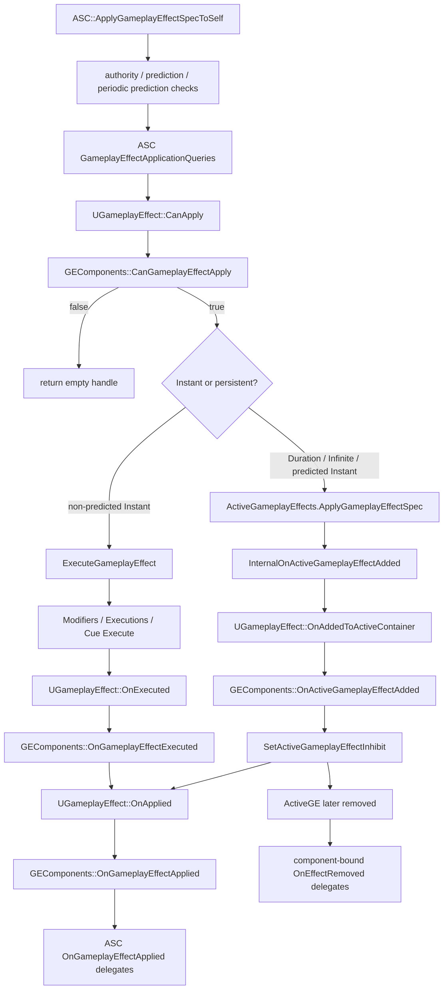
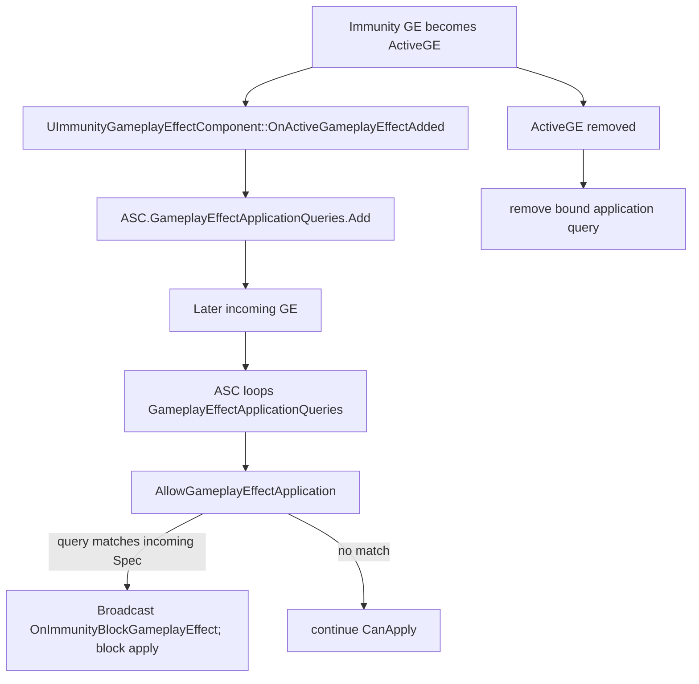
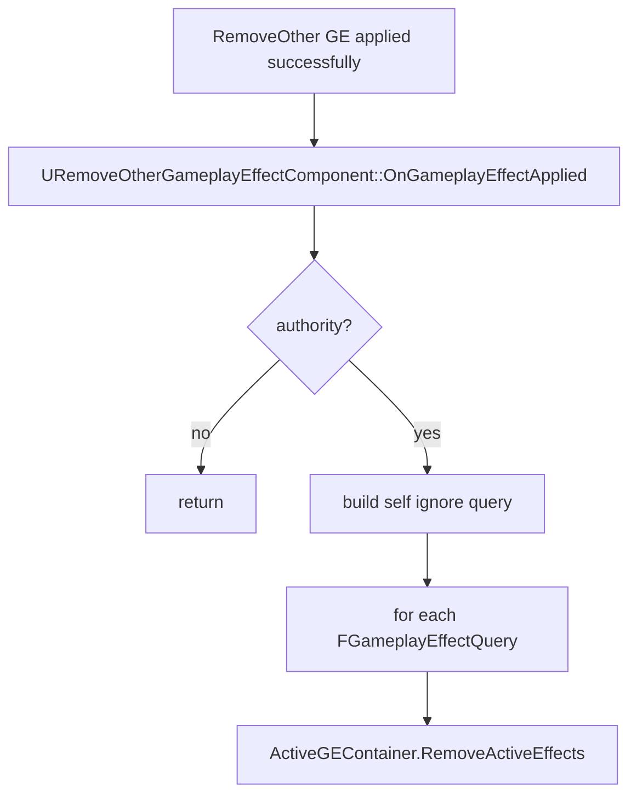
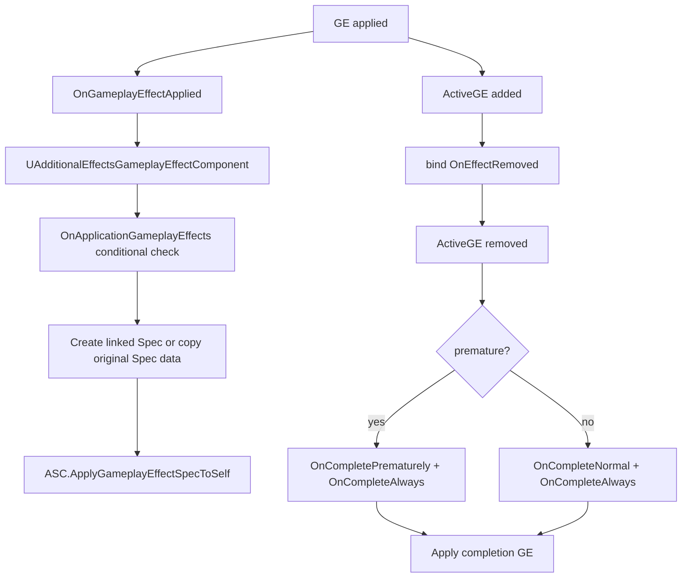
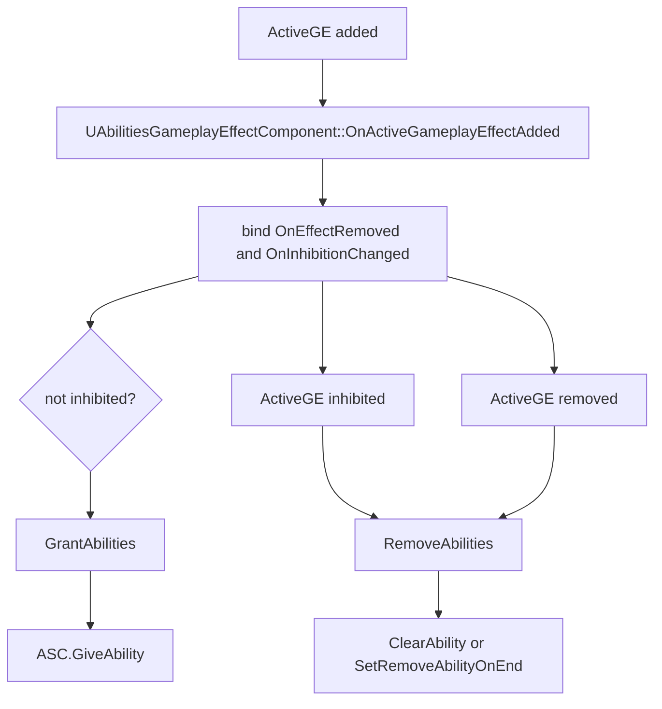

# GameplayEffectComponent / GEComponents（第十三轮）

## 一、类定位

- `UGameplayEffectComponent` 是挂在 `UGameplayEffect` 内部的 UObject 子对象，用来定义 GE 的一部分行为；源码注释明确 GEComponents 在 UE 5.3 引入，并且 `UGameplayEffect` 到 component 的调用点刻意保持很少；源码路径：`Engine/Plugins/Runtime/GameplayAbilities/Source/GameplayAbilities/Public/GameplayEffectComponent.h:17`、`:19`、`:31`。
- UE5.6 中 GEComponents 重要，是因为大量旧版 `UGameplayEffect` 字段已经 deprecated，并通过 `PostCDOCompiled` 的转换函数迁移到组件；源码路径：`Engine/Plugins/Runtime/GameplayAbilities/Source/GameplayAbilities/Private/GameplayEffect.cpp:437`、`:438`、`:448`、`Engine/Plugins/Runtime/GameplayAbilities/Source/GameplayAbilities/Public/GameplayEffect.h:2253`、`:2310`。
- `UGameplayEffect` 用 `GEComponents` 数组保存组件，属性是 `Instanced`、编辑器显示名为 `Components`，每个元素是 `TObjectPtr<UGameplayEffectComponent>`；源码路径：`Engine/Plugins/Runtime/GameplayAbilities/Source/GameplayAbilities/Public/GameplayEffect.h:2421`、`:2422`、`:2423`。
- GEComponents 是 GE 资产内的配置子对象，不是每次应用 GE 都生成的运行时实例；源码注释明确“only one GEComponent exists for all applied instances”，不应保存每次执行或每个 ActiveGE 的运行时状态；源码路径：`Engine/Plugins/Runtime/GameplayAbilities/Source/GameplayAbilities/Public/GameplayEffectComponent.h:23`、`:24`、`:27`。
- GEComponents 本身没有作为 ActiveGE runtime state 复制；它们的配置随 GE Def 使用，运行时真正复制的是 `FActiveGameplayEffect`、Minimal tags / cues、属性等结果数据。组件自身复制路径本轮未确认；源码依据：`Engine/Plugins/Runtime/GameplayAbilities/Source/GameplayAbilities/Public/GameplayEffectComponent.h:23`、`Engine/Plugins/Runtime/GameplayAbilities/Source/GameplayAbilities/Public/GameplayEffect.h:2422`、`Engine/Plugins/Runtime/GameplayAbilities/Source/GameplayAbilities/Public/AbilitySystemComponent.h:719`。
- GEComponents 参与应用前检查的入口是 `UGameplayEffect::CanApply`，它逐个调用 `CanGameplayEffectApply`，任意组件返回 false 都阻止 GE 应用；源码路径：`Engine/Plugins/Runtime/GameplayAbilities/Source/GameplayAbilities/Private/AbilitySystemComponent.cpp:843`、`Engine/Plugins/Runtime/GameplayAbilities/Source/GameplayAbilities/Private/GameplayEffect.cpp:881`、`:885`。
- GEComponents 参与 ActiveGE 添加的入口是 `UGameplayEffect::OnAddedToActiveContainer`，它逐个调用 `OnActiveGameplayEffectAdded`，返回值用于决定该 ActiveGE 初始是否被 inhibit；源码路径：`Engine/Plugins/Runtime/GameplayAbilities/Source/GameplayAbilities/Private/GameplayEffect.cpp:895`、`:902`、`:4305`、`:4309`。
- GEComponents 参与 GE execute 的入口是 `UGameplayEffect::OnExecuted`，由 `FActiveGameplayEffectsContainer::ExecuteGameplayEffect` 在 Modifier / Execution / Cue / conditional effect 之后调用；源码路径：`Engine/Plugins/Runtime/GameplayAbilities/Source/GameplayAbilities/Private/GameplayEffect.cpp:911`、`:917`、`:3223`、`:3224`。
- GEComponents 参与“已成功应用”的入口是 `UGameplayEffect::OnApplied`，由 `ASC::ApplyGameplayEffectSpecToSelf` 在 Instant execute 或 ActiveGE 添加之后调用；源码路径：`Engine/Plugins/Runtime/GameplayAbilities/Source/GameplayAbilities/Private/AbilitySystemComponent.cpp:956`、`:957`、`Engine/Plugins/Runtime/GameplayAbilities/Source/GameplayAbilities/Private/GameplayEffect.cpp:924`、`:930`。
- `UGameplayEffectComponent` 基类没有统一的 `OnActiveGameplayEffectRemoved` hook；需要移除回调的组件通过 `FActiveGameplayEffect::EventSet.OnEffectRemoved` 自己绑定，例如 AdditionalEffects、Abilities、TargetTagRequirements、Immunity；源码路径：`Engine/Plugins/Runtime/GameplayAbilities/Source/GameplayAbilities/Private/GameplayEffectComponents/AdditionalEffectsGameplayEffectComponent.cpp:13`、`Engine/Plugins/Runtime/GameplayAbilities/Source/GameplayAbilities/Private/GameplayEffectComponents/AbilitiesGameplayEffectComponent.cpp:151`、`Engine/Plugins/Runtime/GameplayAbilities/Source/GameplayAbilities/Private/GameplayEffectComponents/TargetTagRequirementsGameplayEffectComponent.cpp:96`、`Engine/Plugins/Runtime/GameplayAbilities/Source/GameplayAbilities/Private/GameplayEffectComponents/ImmunityGameplayEffectComponent.cpp:28`。
- GEComponents 与 Ability 的连接点主要是 `UAbilitiesGameplayEffectComponent` 授予/移除 Ability，以及 `UBlockAbilityTagsGameplayEffectComponent` 间接阻塞带对应 tag 的 Ability；源码路径：`Engine/Plugins/Runtime/GameplayAbilities/Source/GameplayAbilities/Private/GameplayEffectComponents/AbilitiesGameplayEffectComponent.cpp:44`、`:98`、`Engine/Plugins/Runtime/GameplayAbilities/Source/GameplayAbilities/Private/GameplayEffect.cpp:4377`。
- GEComponents 与 Tag 的连接点是 asset/granted/blocked tags 缓存、target tag requirements、minimal replication tags；源码路径：`Engine/Plugins/Runtime/GameplayAbilities/Source/GameplayAbilities/Private/GameplayEffect.cpp:339`、`:4373`、`:4383`、`Engine/Plugins/Runtime/GameplayAbilities/Source/GameplayAbilities/Private/GameplayEffectComponents/TargetTagRequirementsGameplayEffectComponent.cpp:90`。
- GEComponents 与 Cue 的直接组件化未确认；当前扫描到 `UGameplayEffect::GameplayCues` 字段仍存在，并由 ActiveGE 添加/移除与 execute 路径触发，未在 `GameplayEffectComponents` 目录中发现 `UGameplayCueComponent`；源码路径：`Engine/Plugins/Runtime/GameplayAbilities/Source/GameplayAbilities/Public/GameplayEffect.h:2297`、`:2299`、`Engine/Plugins/Runtime/GameplayAbilities/Source/GameplayAbilities/Private/GameplayEffect.cpp:4414`、`:4717`。

## 二、核心类型分析

| 类型 | 定义位置 | 核心职责与配置数据 | 生命周期 hook | 影响 |
|---|---|---|---|---|
| `UGameplayEffectComponent` | `Engine/Plugins/Runtime/GameplayAbilities/Source/GameplayAbilities/Public/GameplayEffectComponent.h:31` | GE 行为组件基类，提供 `CanGameplayEffectApply`、`OnActiveGameplayEffectAdded`、`OnGameplayEffectExecuted`、`OnGameplayEffectApplied`、`OnGameplayEffectChanged`、`IsDataValid`；源码路径：`:47`、`:54`、`:60`、`:66`、`:71`、`:81` | 基类 hook | 业务层通常不直接操作引擎内置组件实例；开发自定义组件属于 native 扩展，源码注释说明当前基本限制在 native code；源码路径：`:20`、`:21` |
| `UAssetTagsGameplayEffectComponent` | `Engine/Plugins/Runtime/GameplayAbilities/Source/GameplayAbilities/Public/GameplayEffectComponents/AssetTagsGameplayEffectComponent.h:13` | 配置 GE 自身 Asset Tags，数据为 `InheritableAssetTags`；源码路径：`:49`、`:50` | `OnGameplayEffectChanged`、`PostEditChangeProperty` | 写入 `UGameplayEffect::CachedAssetTags`，不授予目标 ASC tag；源码路径：`Engine/Plugins/Runtime/GameplayAbilities/Source/GameplayAbilities/Private/GameplayEffectComponents/AssetTagsGameplayEffectComponent.cpp:31`、`:35`、`:63` |
| `UTargetTagsGameplayEffectComponent` | `Engine/Plugins/Runtime/GameplayAbilities/Source/GameplayAbilities/Public/GameplayEffectComponents/TargetTagsGameplayEffectComponent.h:13` | 配置 GE 授予目标的 Granted Tags，数据为 `InheritableGrantedTagsContainer`；源码路径：`:52`、`:53` | `OnGameplayEffectChanged`、`IsDataValid`、`PostEditChangeProperty` | 写入 `CachedGrantedTags`，ActiveGE 激活时进入 ASC tag count，移除时减少；源码路径：`Engine/Plugins/Runtime/GameplayAbilities/Source/GameplayAbilities/Private/GameplayEffectComponents/TargetTagsGameplayEffectComponent.cpp:73`、`Engine/Plugins/Runtime/GameplayAbilities/Source/GameplayAbilities/Private/GameplayEffect.cpp:4373`、`:4670` |
| `UTargetTagRequirementsGameplayEffectComponent` | `Engine/Plugins/Runtime/GameplayAbilities/Source/GameplayAbilities/Public/GameplayEffectComponents/TargetTagRequirementsGameplayEffectComponent.h:15` | 配置 `ApplicationTagRequirements`、`OngoingTagRequirements`、`RemovalTagRequirements`；源码路径：`:48`、`:52`、`:56` | `CanGameplayEffectApply`、`OnActiveGameplayEffectAdded`、tag event、OnEffectRemoved | Application/Removal 可阻止应用，Ongoing 可 inhibit 已添加 ActiveGE，Removal 可移除 ActiveGE；源码路径：`Engine/Plugins/Runtime/GameplayAbilities/Source/GameplayAbilities/Private/GameplayEffectComponents/TargetTagRequirementsGameplayEffectComponent.cpp:19`、`:29`、`:90`、`:143` |
| `UBlockAbilityTagsGameplayEffectComponent` | `Engine/Plugins/Runtime/GameplayAbilities/Source/GameplayAbilities/Public/GameplayEffectComponents/BlockAbilityTagsGameplayEffectComponent.h:13` | 配置目标被阻塞的 Ability Tags，数据为 `InheritableBlockedAbilityTagsContainer`；源码路径：`:52`、`:53` | `OnGameplayEffectChanged`、`IsDataValid` | 写入 `CachedBlockedAbilityTags`；ActiveGE 添加时 `BlockAbilitiesWithTags`，移除时 `UnBlockAbilitiesWithTags`；源码路径：`Engine/Plugins/Runtime/GameplayAbilities/Source/GameplayAbilities/Private/GameplayEffectComponents/BlockAbilityTagsGameplayEffectComponent.cpp:72`、`Engine/Plugins/Runtime/GameplayAbilities/Source/GameplayAbilities/Private/GameplayEffect.cpp:4377`、`:4674` |
| `UImmunityGameplayEffectComponent` | `Engine/Plugins/Runtime/GameplayAbilities/Source/GameplayAbilities/Public/GameplayEffectComponents/ImmunityGameplayEffectComponent.h:16` | 配置 `ImmunityQueries`，用于让已存在的 ActiveGE 阻止后续 incoming GE；源码路径：`:41`、`:42` | `OnActiveGameplayEffectAdded`、ApplicationQuery、OnEffectRemoved | 不直接修改 tag；通过 ASC `GameplayEffectApplicationQueries` 阻止 GE 应用；源码路径：`Engine/Plugins/Runtime/GameplayAbilities/Source/GameplayAbilities/Private/GameplayEffectComponents/ImmunityGameplayEffectComponent.cpp:24`、`:66`、`:70` |
| `URemoveOtherGameplayEffectComponent` | `Engine/Plugins/Runtime/GameplayAbilities/Source/GameplayAbilities/Public/GameplayEffectComponents/RemoveOtherGameplayEffectComponent.h:15` | 配置 `RemoveGameplayEffectQueries`，本 GE 成功应用后移除匹配的其他 ActiveGE；源码路径：`:37`、`:38` | `OnGameplayEffectApplied` | authority-only，调用 `ActiveGEContainer.RemoveActiveEffects`，会忽略自身 GE handle；源码路径：`Engine/Plugins/Runtime/GameplayAbilities/Source/GameplayAbilities/Private/GameplayEffectComponents/RemoveOtherGameplayEffectComponent.cpp:16`、`:18`、`:23`、`:39` |
| `UAdditionalEffectsGameplayEffectComponent` | `Engine/Plugins/Runtime/GameplayAbilities/Source/GameplayAbilities/Public/GameplayEffectComponents/AdditionalEffectsGameplayEffectComponent.h:13` | 配置应用时和完成时附加 GE：`OnApplicationGameplayEffects`、`OnCompleteAlways`、`OnCompleteNormal`、`OnCompletePrematurely`；源码路径：`:52`、`:56`、`:60`、`:64` | `OnGameplayEffectApplied`、`OnActiveGameplayEffectAdded`、OnEffectRemoved | 应用时可按条件附加 GE；Duration/Infinite 移除时可按正常/提前结束附加 GE；源码路径：`Engine/Plugins/Runtime/GameplayAbilities/Source/GameplayAbilities/Private/GameplayEffectComponents/AdditionalEffectsGameplayEffectComponent.cpp:22`、`:43`、`:74`、`:98`、`:111` |
| `UChanceToApplyGameplayEffectComponent` | `Engine/Plugins/Runtime/GameplayAbilities/Source/GameplayAbilities/Public/GameplayEffectComponents/ChanceToApplyGameplayEffectComponent.h:14` | 配置 `ChanceToApplyToTarget`，用 `FScalableFloat` 按 GE level 算应用概率；源码路径：`:33`、`:34` | `CanGameplayEffectApply` | 概率失败时阻止 GE 应用；源码路径：`Engine/Plugins/Runtime/GameplayAbilities/Source/GameplayAbilities/Private/GameplayEffectComponents/ChanceToApplyGameplayEffectComponent.cpp:21`、`:24`、`:27` |
| `UCustomCanApplyGameplayEffectComponent` | `Engine/Plugins/Runtime/GameplayAbilities/Source/GameplayAbilities/Public/GameplayEffectComponents/CustomCanApplyGameplayEffectComponent.h:14` | 配置 `ApplicationRequirements`，调用 `UGameplayEffectCustomApplicationRequirement` CDO 的 `CanApplyGameplayEffect`；源码路径：`:26`、`:27`、`Engine/Plugins/Runtime/GameplayAbilities/Source/GameplayAbilities/Public/GameplayEffectCustomApplicationRequirement.h:20` | `CanGameplayEffectApply` | 任意 requirement 返回 false 时阻止 GE 应用；源码路径：`Engine/Plugins/Runtime/GameplayAbilities/Source/GameplayAbilities/Private/GameplayEffectComponents/CustomCanApplyGameplayEffectComponent.cpp:13`、`:18`、`:21` |
| `UAbilitiesGameplayEffectComponent` | `Engine/Plugins/Runtime/GameplayAbilities/Source/GameplayAbilities/Public/GameplayEffectComponents/AbilitiesGameplayEffectComponent.h:38` | 配置 `GrantAbilityConfigs`，每项含 Ability、LevelScalableFloat、InputID、RemovalPolicy；源码路径：`:13`、`:18`、`:22`、`:26`、`:30`、`:75` | `OnActiveGameplayEffectAdded`、OnInhibitionChanged、OnEffectRemoved | authority-only 授予/移除 Ability；ActiveGE inhibit 时移除，uninhibit 时授予；源码路径：`Engine/Plugins/Runtime/GameplayAbilities/Source/GameplayAbilities/Private/GameplayEffectComponents/AbilitiesGameplayEffectComponent.cpp:31`、`:44`、`:98`、`:147` |
| `UGameplayCueComponent` 或等价 GEComponent | 未确认 | 当前 `GameplayEffectComponents` 目录未发现该类；GameplayCue 仍由 `UGameplayEffect::GameplayCues` 字段驱动；源码路径：`Engine/Plugins/Runtime/GameplayAbilities/Source/GameplayAbilities/Public/GameplayEffect.h:2299`、`Engine/Plugins/Runtime/GameplayAbilities/Source/GameplayAbilities/Private/GameplayEffect.cpp:4414` | 未确认 | 未确认 |

## 三、GameplayEffectComponent 生命周期 hook

| hook | 定义/调用位置 | 调用时机与参数 | 能否阻止 GE | 编辑器/运行时 | 是否适合业务逻辑 |
|---|---|---|---|---|---|
| `CanGameplayEffectApply` | 定义：`GameplayEffectComponent.h:47`；汇总调用：`GameplayEffect.cpp:881`、`:885` | `ASC::ApplyGameplayEffectSpecToSelf` 检查 ApplicationQueries 后调用 `Spec.Def->CanApply`，传入 `FActiveGameplayEffectsContainer` 和 `FGameplayEffectSpec`；源码路径：`AbilitySystemComponent.cpp:833`、`:844` | 能；任意组件 false 会让 `ApplyGameplayEffectSpecToSelf` 返回空 handle；源码路径：`AbilitySystemComponent.cpp:844`、`:846` | 运行时 | 适合轻量、无副作用的应用条件；复杂战斗校验更适合 Ability、ExecutionCalculation 或项目系统，这是开发实践推断，源码依据是组件是单例配置对象；源码路径：`GameplayEffectComponent.h:23`、`:24` |
| `OnGameplayEffectApplied` | 定义：`GameplayEffectComponent.h:66`；汇总调用：`GameplayEffect.cpp:924`、`:930` | GE 初次成功应用或叠加 stack 后调用，不因 periodic execute 或复制调用；源码路径：`GameplayEffectComponent.h:63`、`:64`、`AbilitySystemComponent.cpp:956`、`:957` | 不能直接阻止已完成的应用 | 运行时 | 适合触发 AdditionalEffects、RemoveOther 等“应用成功后”逻辑；源码路径：`AdditionalEffectsGameplayEffectComponent.cpp:22`、`RemoveOtherGameplayEffectComponent.cpp:16` |
| `OnActiveGameplayEffectAdded` | 定义：`GameplayEffectComponent.h:54`；汇总调用：`GameplayEffect.cpp:895`、`:902` | Duration/Infinite GE 或预测 instant 被加入 ActiveGE 容器时调用，也可能来自复制；传入 `FActiveGameplayEffectsContainer` 和 `FActiveGameplayEffect`；源码路径：`GameplayEffectComponent.h:50`、`:51`、`GameplayEffect.cpp:4277`、`:4279` | 不能阻止添加，但返回 false 会 inhibit ActiveGE；源码路径：`GameplayEffectComponent.h:52`、`GameplayEffect.cpp:4305`、`:4309` | 运行时 | 适合绑定 ActiveGE 事件、授予 Ability、注册 immunity query、监听 tag 变化；源码路径：`AbilitiesGameplayEffectComponent.cpp:151`、`ImmunityGameplayEffectComponent.cpp:24`、`TargetTagRequirementsGameplayEffectComponent.cpp:90` |
| `OnGameplayEffectExecuted` | 定义：`GameplayEffectComponent.h:60`；汇总调用：`GameplayEffect.cpp:911`、`:917` | Instant GE 执行或 periodic tick 执行后调用；源码注释说明 Execute 只能在 authority 上发生；源码路径：`GameplayEffectComponent.h:57`、`:58`、`GameplayEffect.cpp:3223`、`:3224` | 不能阻止已执行结果 | 运行时 authority 路径为主 | 本轮内置组件没有发现重写该 hook；是否用于自定义组件未确认 |
| `OnGameplayEffectChanged` | 定义：`GameplayEffectComponent.h:71`；GE 汇总调用：`GameplayEffect.cpp:331`、`:345`、`:351` | GE fully loaded 后重建缓存数据；源码会 reset `CachedAssetTags/CachedGrantedTags/CachedBlockedAbilityTags` 再让组件回填；源码路径：`GameplayEffect.cpp:339`、`:341`、`:342` | 不阻止 GE 应用 | 编辑器/加载/编译路径 | 适合把配置组件写入 GE Def 缓存，不适合运行时状态；源码路径：`AssetTagsGameplayEffectComponent.cpp:63`、`TargetTagsGameplayEffectComponent.cpp:73`、`BlockAbilityTagsGameplayEffectComponent.cpp:72` |
| `IsDataValid` | 定义：`GameplayEffectComponent.h:81`；默认实现：`GameplayEffectComponent.cpp:25` | 编辑器数据校验；默认检查 component 外层是否为 GE、是否在 `GEComponents` 数组、同类是否重复；源码路径：`GameplayEffectComponent.cpp:31`、`:34`、`:42` | 不阻止运行时应用 | 编辑器 | 适合提示错误/警告；不能替代运行时校验，这是开发实践推断，源码依据是 `WITH_EDITOR` 包裹；源码路径：`GameplayEffectComponent.h:76`、`:81` |
| `PostEditChangeProperty` | 基类未确认；部分 tag 组件实现 | AssetTags/TargetTags/BlockAbilityTags 在编辑器属性变化后调用 owner `OnGameplayEffectChanged`；源码路径：`AssetTagsGameplayEffectComponent.cpp:35`、`:41`、`TargetTagsGameplayEffectComponent.cpp:29`、`:36`、`BlockAbilityTagsGameplayEffectComponent.cpp:29`、`:35` | 不阻止运行时应用 | 编辑器 | 适合刷新 GE 缓存；不应写运行时逻辑 |
| `OnActiveGameplayEffectRemoved` | 基类未确认；组件私有/辅助回调 | 通过 `ActiveGE.EventSet.OnEffectRemoved` 绑定，移除时清理 granted abilities、附加完成 GE、解绑 tag/immunity query 等；源码路径：`AbilitiesGameplayEffectComponent.cpp:151`、`:158`、`AdditionalEffectsGameplayEffectComponent.cpp:13`、`:79`、`TargetTagRequirementsGameplayEffectComponent.cpp:96`、`:109` | 不阻止移除 | 运行时 | 适合清理该组件注册的状态；必须注意 component 是资产单例，状态应放在 delegate 绑定参数/ActiveGE handle 上；源码路径：`GameplayEffectComponent.h:23`、`:26` |

## 四、GE 应用流程中的 GEComponents 调用链



简化伪代码：

```cpp
FActiveGameplayEffectHandle UAbilitySystemComponent::ApplyGameplayEffectSpecToSelf(Spec, PredictionKey)
{
    if (!HasNetworkAuthorityToApplyGameplayEffect(PredictionKey)) return {};
    if (PredictionKey.IsValidKey() && Spec.GetPeriod() > 0.f && !Authority) return {};

    for (ApplicationQuery : GameplayEffectApplicationQueries)
        if (!ApplicationQuery.Execute(ActiveGameplayEffects, Spec)) return {};

    if (!Spec.Def->CanApply(ActiveGameplayEffects, Spec)) return {};

    if (Spec.Def->DurationPolicy != Instant || PredictedInstantAsInfinite)
    {
        ActiveGE = ActiveGameplayEffects.ApplyGameplayEffectSpec(Spec, PredictionKey);
        // eventually InternalOnActiveGameplayEffectAdded -> Def->OnAddedToActiveContainer -> GEComponents
    }
    else
    {
        ExecuteGameplayEffect(SpecCopy, PredictionKey);
        // ExecuteGameplayEffect -> Def->OnExecuted -> GEComponents
    }

    Spec.Def->OnApplied(ActiveGameplayEffects, SpecCopy, PredictionKey);
}
```

- 权限 / prediction 检查先于 GEComponents：`ApplyGameplayEffectSpecToSelf` 先调用 `HasNetworkAuthorityToApplyGameplayEffect`，并拒绝客户端预测 periodic GE；源码路径：`Engine/Plugins/Runtime/GameplayAbilities/Source/GameplayAbilities/Private/AbilitySystemComponent.cpp:812`、`:819`、`:827`。
- `GameplayEffectApplicationQueries` 先于 `UGameplayEffect::CanApply`；Immunity 组件正是通过往这个数组注册 query 来拦截后续 GE；源码路径：`Engine/Plugins/Runtime/GameplayAbilities/Source/GameplayAbilities/Private/AbilitySystemComponent.cpp:833`、`:844`、`Engine/Plugins/Runtime/GameplayAbilities/Source/GameplayAbilities/Private/GameplayEffectComponents/ImmunityGameplayEffectComponent.cpp:24`。
- non-predicted Instant GE 不进入 ActiveGE 容器，而是 `ExecuteGameplayEffect`；predicted instant 在客户端会临时按 infinite ActiveGE 处理；源码路径：`Engine/Plugins/Runtime/GameplayAbilities/Source/GameplayAbilities/Private/AbilitySystemComponent.cpp:862`、`:876`、`:950`、`:953`。
- Duration / Infinite GE 进入 ActiveGE 后，`InternalOnActiveGameplayEffectAdded` 调 `OnAddedToActiveContainer`，再根据返回值设置 inhibit；源码路径：`Engine/Plugins/Runtime/GameplayAbilities/Source/GameplayAbilities/Private/GameplayEffect.cpp:4277`、`:4305`、`:4309`。
- ActiveGE 移除时，GE 基类不会逐个调用统一 component removed hook；实际移除清理由组件自己绑定的 `OnEffectRemoved` delegate 或 ActiveGE 容器移除 tags/modifiers/cues 完成；源码路径：`Engine/Plugins/Runtime/GameplayAbilities/Source/GameplayAbilities/Private/GameplayEffectComponents/AbilitiesGameplayEffectComponent.cpp:151`、`Engine/Plugins/Runtime/GameplayAbilities/Source/GameplayAbilities/Private/GameplayEffect.cpp:4652`。

## 五、Tag 相关 GEComponents

| 组件 | 配置与缓存 | 应用/移除行为 | Instant 注意 | deprecated 关系 |
|---|---|---|---|---|
| `UAssetTagsGameplayEffectComponent` | `InheritableAssetTags` 通过 `OnGameplayEffectChanged` 写入 `CachedAssetTags`；源码路径：`AssetTagsGameplayEffectComponent.h:50`、`AssetTagsGameplayEffectComponent.cpp:31`、`:63` | Asset Tags 是 GE 自身标签，不进入目标 ASC tag count；源码路径：`GameplayEffect.h:2143`、`:2144` | 可以用于 Instant GE 的资产分类；是否符合业务语义取决于项目，开发实践推断 | 旧 `InheritableGameplayEffectTags` deprecated，转换到 AssetTags component；源码路径：`GameplayEffect.h:2310`、`:2311`、`GameplayEffect.cpp:545`、`:554` |
| `UTargetTagsGameplayEffectComponent` | `InheritableGrantedTagsContainer` 写入 `CachedGrantedTags`；源码路径：`TargetTagsGameplayEffectComponent.h:53`、`TargetTagsGameplayEffectComponent.cpp:73` | ActiveGE 添加时 `Owner->UpdateTagMap(GetGrantedTags(), 1)`，移除时 `-1`；Minimal 模式下加入 / 移除 MinimalReplicationTags；源码路径：`GameplayEffect.cpp:4373`、`:4383`、`:4670`、`:4679` | `IsDataValid` 对 Instant GE + granted tags 报 invalid；源码路径：`TargetTagsGameplayEffectComponent.cpp:42`、`:50` | 旧 `InheritableOwnedTagsContainer` deprecated，转换到 TargetTags component；源码路径：`GameplayEffect.h:2315`、`:2316`、`GameplayEffect.cpp:627`、`:636` |
| `UTargetTagRequirementsGameplayEffectComponent` | 配置 Application / Ongoing / Removal 三类要求；源码路径：`TargetTagRequirementsGameplayEffectComponent.h:49`、`:53`、`:57` | Application/Removal 在 `CanGameplayEffectApply` 阻止应用；Ongoing 在添加后监听 tag event 并 inhibit/uninhibit；Removal 满足时 remove ActiveGE；源码路径：`TargetTagRequirementsGameplayEffectComponent.cpp:19`、`:24`、`:29`、`:90`、`:143` | `IsDataValid` 对 Instant GE + OngoingTagRequirements 报 invalid；源码路径：`TargetTagRequirementsGameplayEffectComponent.cpp:165`、`:172` | 旧 Application/Ongoing/Removal requirements 被转换到该组件；源码路径：`GameplayEffect.cpp:757`、`:773`、`:778`、`:783` |
| `UBlockAbilityTagsGameplayEffectComponent` | `InheritableBlockedAbilityTagsContainer` 写入 `CachedBlockedAbilityTags`；源码路径：`BlockAbilityTagsGameplayEffectComponent.h:53`、`BlockAbilityTagsGameplayEffectComponent.cpp:72` | ActiveGE 添加时调用 ASC `BlockAbilitiesWithTags`，移除时 `UnBlockAbilitiesWithTags`；源码路径：`GameplayEffect.cpp:4377`、`:4674`、`AbilitySystemComponent_Abilities.cpp:1433`、`:1438` | `IsDataValid` 对 Instant GE + blocked ability tags 报 invalid；源码路径：`BlockAbilityTagsGameplayEffectComponent.cpp:41`、`:49` | 旧 `InheritableBlockedAbilityTagsContainer` deprecated；转换代码实际使用 `UBlockAbilityTagsGameplayEffectComponent`，但 deprecation 文本写 `UTargetTagsGameplayEffectComponent`，此处以转换代码为准；源码路径：`GameplayEffect.h:2320`、`:2321`、`GameplayEffect.cpp:606`、`:615` |

## 六、Immunity / RemoveOther 组件





- Immunity 在 ActiveGE 添加后生效，不是 GE 应用前静态字段；组件把 `AllowGameplayEffectApplication` 绑定到目标 ASC 的 `GameplayEffectApplicationQueries`，后续 incoming GE 会先经过该 query；源码路径：`Engine/Plugins/Runtime/GameplayAbilities/Source/GameplayAbilities/Private/GameplayEffectComponents/ImmunityGameplayEffectComponent.cpp:18`、`:24`、`:46`、`Engine/Plugins/Runtime/GameplayAbilities/Source/GameplayAbilities/Private/AbilitySystemComponent.cpp:833`。
- `ImmunityQueries` 使用 `FGameplayEffectQuery` 匹配 incoming `FGameplayEffectSpec`；匹配时广播 `OnImmunityBlockGameplayEffectDelegate` 并返回 false 阻止应用；源码路径：`Engine/Plugins/Runtime/GameplayAbilities/Source/GameplayAbilities/Public/GameplayEffectComponents/ImmunityGameplayEffectComponent.h:42`、`Engine/Plugins/Runtime/GameplayAbilities/Source/GameplayAbilities/Private/GameplayEffectComponents/ImmunityGameplayEffectComponent.cpp:66`、`:70`。
- Immunity ActiveGE 移除时会从 `GameplayEffectApplicationQueries` 中移除自己注册的 delegate，避免 stale query；源码路径：`Engine/Plugins/Runtime/GameplayAbilities/Source/GameplayAbilities/Private/GameplayEffectComponents/ImmunityGameplayEffectComponent.cpp:28`、`:32`、`:39`。
- RemoveOther 在本 GE 成功应用后的 `OnGameplayEffectApplied` 生效，并且只在 authority 上移除；源码路径：`Engine/Plugins/Runtime/GameplayAbilities/Source/GameplayAbilities/Private/GameplayEffectComponents/RemoveOtherGameplayEffectComponent.cpp:16`、`:18`、`:21`。
- RemoveOther 通过 `FGameplayEffectQuery` 匹配 ActiveGE，并设置 `IgnoreHandles` 避免把刚应用的自己移掉；源码路径：`Engine/Plugins/Runtime/GameplayAbilities/Source/GameplayAbilities/Private/GameplayEffectComponents/RemoveOtherGameplayEffectComponent.cpp:23`、`:27`、`:40`、`Engine/Plugins/Runtime/GameplayAbilities/Source/GameplayAbilities/Public/GameplayEffect.h:1488`。
- `FGameplayEffectQuery` 可按 owning tags、effect tags、source tags、attribute、source object、effect definition 和自定义 delegate 匹配；源码路径：`Engine/Plugins/Runtime/GameplayAbilities/Source/GameplayAbilities/Public/GameplayEffect.h:1453`、`:1460`、`:1464`、`:1468`、`:1476`、`:1480`、`:1484`。

## 七、AdditionalEffects / Abilities 组件





- AdditionalEffects 的 `OnApplicationGameplayEffects` 在 GE 应用成功后触发，使用 `FConditionalGameplayEffect::CanApply` 根据 source tags 和 GE level 判断是否创建附加 spec；源码路径：`Engine/Plugins/Runtime/GameplayAbilities/Source/GameplayAbilities/Private/GameplayEffectComponents/AdditionalEffectsGameplayEffectComponent.cpp:22`、`:34`、`:43`。
- `bOnApplicationCopyDataFromOriginalSpec` 为 true 时，附加 spec 用 `InitializeFromLinkedSpec` 复制原始 spec 数据；否则用 conditional effect 自己创建 spec；源码路径：`Engine/Plugins/Runtime/GameplayAbilities/Source/GameplayAbilities/Public/GameplayEffectComponents/AdditionalEffectsGameplayEffectComponent.h:47`、`Engine/Plugins/Runtime/GameplayAbilities/Source/GameplayAbilities/Private/GameplayEffectComponents/AdditionalEffectsGameplayEffectComponent.cpp:47`、`:54`。
- AdditionalEffects 的完成效果依赖 ActiveGE 移除事件；Instant GE 配置 OnComplete 系列会被 `IsDataValid` 报 invalid，Periodic GE 配 OnApplication 会有 warning；源码路径：`Engine/Plugins/Runtime/GameplayAbilities/Source/GameplayAbilities/Private/GameplayEffectComponents/AdditionalEffectsGameplayEffectComponent.cpp:13`、`:98`、`:121`、`:130`。
- Abilities 组件只在 authority 上绑定/授予/移除 Ability；源码多处注释和分支明确 `IsNetAuthority()`；源码路径：`Engine/Plugins/Runtime/GameplayAbilities/Source/GameplayAbilities/Private/GameplayEffectComponents/AbilitiesGameplayEffectComponent.cpp:31`、`:44`、`:98`、`:149`。
- 授予 Ability 时，组件用 ActiveGE spec level 计算 `LevelScalableFloat`，复制 `SetByCallerTagMagnitudes` 到 AbilitySpec，并把 ActiveGE handle 写入 `GameplayEffectHandle`；源码路径：`Engine/Plugins/Runtime/GameplayAbilities/Source/GameplayAbilities/Private/GameplayEffectComponents/AbilitiesGameplayEffectComponent.cpp:85`、`:88`、`:89`、`:90`。
- 移除 Ability 时，`CancelAbilityImmediately` 调 `ClearAbility`，`RemoveAbilityOnEnd` 调 `SetRemoveAbilityOnEnd`，`DoNothing` 保留；源码路径：`Engine/Plugins/Runtime/GameplayAbilities/Source/GameplayAbilities/Private/GameplayEffectComponents/AbilitiesGameplayEffectComponent.cpp:124`、`:128`、`:133`、`:138`。
- `GrantedAbilityHandles` 是旧路径字段/行为相关概念，本轮在 UE5.6 Abilities 组件实现中确认使用 `AbilitySpec.GameplayEffectHandle` 关联 ActiveGE；旧 `Effect.Spec.GrantedAbilitySpecs` 仍有兼容代码，但组件路径是 `UAbilitiesGameplayEffectComponent`；源码路径：`Engine/Plugins/Runtime/GameplayAbilities/Source/GameplayAbilities/Private/GameplayEffect.cpp:4387`、`:4405`、`Engine/Plugins/Runtime/GameplayAbilities/Source/GameplayAbilities/Private/GameplayEffectComponents/AbilitiesGameplayEffectComponent.cpp:90`。

## 八、ChanceToApply / CustomCanApply 组件

- `UChanceToApplyGameplayEffectComponent` 在 `CanGameplayEffectApply` 中用 `ChanceToApplyToTarget.GetValueAtLevel(GESpec.GetLevel())` 计算概率，因此概率可以随 GE level / scalable float 改变；源码路径：`Engine/Plugins/Runtime/GameplayAbilities/Source/GameplayAbilities/Private/GameplayEffectComponents/ChanceToApplyGameplayEffectComponent.cpp:21`、`:24`。
- 概率小于 1 且随机数大于概率时，ChanceToApply 返回 false 阻止 GE 应用；源码路径：`Engine/Plugins/Runtime/GameplayAbilities/Source/GameplayAbilities/Private/GameplayEffectComponents/ChanceToApplyGameplayEffectComponent.cpp:27`、`:30`。
- `UCustomCanApplyGameplayEffectComponent` 遍历 `ApplicationRequirements`，取 requirement CDO 并调用 `CanApplyGameplayEffect(GESpec.Def, GESpec, ASC)`；任意返回 false 即阻止 GE 应用；源码路径：`Engine/Plugins/Runtime/GameplayAbilities/Source/GameplayAbilities/Private/GameplayEffectComponents/CustomCanApplyGameplayEffectComponent.cpp:13`、`:16`、`:18`、`:21`。
- `UGameplayEffectCustomApplicationRequirement` 是 BlueprintType / Blueprintable / Abstract UObject，提供 `BlueprintNativeEvent CanApplyGameplayEffect`；源码路径：`Engine/Plugins/Runtime/GameplayAbilities/Source/GameplayAbilities/Public/GameplayEffectCustomApplicationRequirement.h:13`、`:20`。
- 顺序上，ASC 先执行 `GameplayEffectApplicationQueries`，再执行 `Spec.Def->CanApply`；`Spec.Def->CanApply` 内按 `GEComponents` 数组顺序调用所有组件的 `CanGameplayEffectApply`；之后才检查 modifier attribute 和执行 ActiveGE/Instant 逻辑；源码路径：`Engine/Plugins/Runtime/GameplayAbilities/Source/GameplayAbilities/Private/AbilitySystemComponent.cpp:833`、`:844`、`:849`、`Engine/Plugins/Runtime/GameplayAbilities/Source/GameplayAbilities/Private/GameplayEffect.cpp:883`。
- 开发实践推断：ChanceToApply / CustomCanApply 应尽量保持无副作用，尤其 LocalPredicted 路径中随机数或客户端不可验证条件可能导致预测与服务器不一致；源码依据是组件会在应用前直接决定成功/失败，且客户端有 prediction key 时也会进入 apply path；源码路径：`Engine/Plugins/Runtime/GameplayAbilities/Source/GameplayAbilities/Private/AbilitySystemComponent.cpp:812`、`:844`、`Engine/Plugins/Runtime/GameplayAbilities/Source/GameplayAbilities/Private/GameplayEffectComponents/ChanceToApplyGameplayEffectComponent.cpp:27`。

## 九、GameplayCue 与 GEComponents

- UE5.6 当前扫描范围中未确认存在 `UGameplayCueComponent` 或等价 GEComponent；`GameplayEffectComponents` 目录只有 10 个组件文件，不含 Cue 组件；源码路径：`Engine/Plugins/Runtime/GameplayAbilities/Source/GameplayAbilities/Public/GameplayEffectComponents`、`Engine/Plugins/Runtime/GameplayAbilities/Source/GameplayAbilities/Private/GameplayEffectComponents`。
- `UGameplayEffect::GameplayCues` 字段仍存在，类型为 `TArray<FGameplayEffectCue>`；源码路径：`Engine/Plugins/Runtime/GameplayAbilities/Source/GameplayAbilities/Public/GameplayEffect.h:2297`、`:2299`。
- ActiveGE 添加时仍从 `Effect.Spec.Def->GameplayCues` 触发 Add/WhileActive，移除时仍从同一字段触发 Removed；源码路径：`Engine/Plugins/Runtime/GameplayAbilities/Source/GameplayAbilities/Private/GameplayEffect.cpp:4411`、`:4414`、`:4434`、`:4435`、`:4714`、`:4717`、`:4734`。
- Instant/periodic execute 的 GameplayCue 仍由 execute 路径处理 `SpecToUse.Def->GameplayCues`，随后才调用 `Spec.Def->OnExecuted`；源码路径：`Engine/Plugins/Runtime/GameplayAbilities/Source/GameplayAbilities/Private/GameplayEffect.cpp:3205`、`:3211`、`:3223`、`:3224`。
- GEComponents 可以通过 AdditionalEffects 间接触发另一个 GE 的 GameplayCue，但本轮未确认有内置组件直接替代 `GameplayCues` 字段；源码路径：`Engine/Plugins/Runtime/GameplayAbilities/Source/GameplayAbilities/Private/GameplayEffectComponents/AdditionalEffectsGameplayEffectComponent.cpp:74`、`Engine/Plugins/Runtime/GameplayAbilities/Source/GameplayAbilities/Public/GameplayEffect.h:2299`。
- 编辑器中 GameplayCue 配置位置是否已经被组件化，未确认；源码能确认的是 `GameplayEffectDetails.cpp` 未扫描到 `GEComponents` / `GameplayEffectComponent` 专门逻辑，`GEComponents` 本身通过 `UPROPERTY` 显示；源码路径：`Engine/Plugins/Runtime/GameplayAbilities/Source/GameplayAbilitiesEditor/Private/GameplayEffectDetails.cpp:20`、`:44`、`Engine/Plugins/Runtime/GameplayAbilities/Source/GameplayAbilities/Public/GameplayEffect.h:2422`。

## 十、deprecated 字段迁移

| 旧字段 | 新组件/关系 | 转换路径 | 注意 |
|---|---|---|---|
| `GrantedAbilities` | `UAbilitiesGameplayEffectComponent::GrantAbilityConfigs` | `ConvertAbilitiesComponent`；源码路径：`GameplayEffect.cpp:464`、`:473`、`:491` | 转换后旧数组 entry 的 Ability 被置空以避免影响 gameplay；源码路径：`:494`、`:498` |
| `ChanceToApplyToTarget_DEPRECATED` | `UChanceToApplyGameplayEffectComponent` | `ConvertChanceToApplyComponent`；源码路径：`GameplayEffect.cpp:523`、`:533`、`:534` | 会回写 deprecated 字段用于兼容读取；源码路径：`:537`、`:541` |
| `ApplicationRequirements_DEPRECATED` | `UCustomCanApplyGameplayEffectComponent` | `ConvertCustomCanApplyComponent`；源码路径：`GameplayEffect.cpp:503`、`:511`、`:512` | 会回写 deprecated 字段用于兼容读取；源码路径：`:515`、`:519` |
| `ConditionalGameplayEffects` | `UAdditionalEffectsGameplayEffectComponent::OnApplicationGameplayEffects` | `ConvertAdditionalEffectsComponent`；源码路径：`GameplayEffect.cpp:566`、`:578`、`:582` | 旧数据会回写用于兼容；源码路径：`:596`、`:600` |
| `PrematureExpirationEffectClasses` | `UAdditionalEffectsGameplayEffectComponent::OnCompletePrematurely` | `ConvertAdditionalEffectsComponent`；源码路径：`GameplayEffect.cpp:571`、`:587` | 只对有生命周期的 ActiveGE 有意义；组件 `IsDataValid` 会拦 Instant；源码路径：`AdditionalEffectsGameplayEffectComponent.cpp:121` |
| `RoutineExpirationEffectClasses` | `UAdditionalEffectsGameplayEffectComponent::OnCompleteNormal` | `ConvertAdditionalEffectsComponent`；源码路径：`GameplayEffect.cpp:572`、`:592` | 同上 |
| `InheritableGameplayEffectTags` | `UAssetTagsGameplayEffectComponent` | `ConvertAssetTagsComponent`；源码路径：`GameplayEffect.cpp:545`、`:553`、`:554` | GE 自身 asset tags，不授予目标 |
| `InheritableOwnedTagsContainer` | `UTargetTagsGameplayEffectComponent` | `ConvertTargetTagsComponent`；源码路径：`GameplayEffect.cpp:627`、`:635`、`:636` | 授予目标 ASC tag count |
| `InheritableBlockedAbilityTagsContainer` | `UBlockAbilityTagsGameplayEffectComponent` | `ConvertBlockByTagsComponent`；源码路径：`GameplayEffect.cpp:606`、`:614`、`:615` | header deprecation 文本写 `UTargetTagsGameplayEffectComponent`，转换实现使用 BlockAbilityTags component；源码路径：`GameplayEffect.h:2320`、`:2321`、`GameplayEffect.cpp:614` |
| `ApplicationTagRequirements` / `OngoingTagRequirements` / `RemovalTagRequirements` | `UTargetTagRequirementsGameplayEffectComponent` | `ConvertTagRequirementsComponent`；源码路径：`GameplayEffect.cpp:757`、`:769`、`:773`、`:778`、`:783` | header 上 `RemovalTagRequirements` deprecation 文本写 `URemoveOtherGameplayEffectComponent`，转换实现放到 TargetTagRequirements；源码路径：`GameplayEffect.h:2335`、`:2336`、`GameplayEffect.cpp:778` |
| `RemoveGameplayEffectsWithTags` / `RemoveGameplayEffectQuery` | `URemoveOtherGameplayEffectComponent` | `ConvertRemoveOtherComponent`；源码路径：`GameplayEffect.cpp:716`、`:727`、`:739`、`:744` | 源码注释说明旧 `RemoveGameplayEffectsWithTags` 保留了旧行为，会把 owning tags 与 asset/granted 概念混用；源码路径：`:736`、`:738` |
| `GrantedApplicationImmunityTags` / `GrantedApplicationImmunityQuery` | `UImmunityGameplayEffectComponent` | `ConvertImmunityComponent`；源码路径：`GameplayEffect.cpp:648`、`:659`、`:698`、`:703` | tag requirements 会被构造成 `FGameplayEffectQuery`；源码路径：`:671`、`:696` |
| `UIData` | `UGameplayEffectUIData` 现在继承 `UGameplayEffectComponent` | `ConvertUIComponent`；源码路径：`GameplayEffect.cpp:797`、`:808`、`Engine/Plugins/Runtime/GameplayAbilities/Source/GameplayAbilities/Public/GameplayEffectUIData.h:16` | `UIData` deprecated，迁移后建议 `FindComponent<UGameplayEffectUIData>()`；源码路径：`GameplayEffect.h:2301`、`:2302` |

- `PostCDOCompiled` 会先 fixup subobjects，再执行所有转换函数，并在已加载时调用 `OnGameplayEffectChanged` 重建缓存；源码路径：`Engine/Plugins/Runtime/GameplayAbilities/Source/GameplayAbilities/Private/GameplayEffect.cpp:429`、`:435`、`:437`、`:448`、`:454`、`:457`。
- `PreSave` 在非 cook 保存前清空 deprecated tag/query/ability 字段，再跑一次转换以从组件回填兼容数据，避免组件移除后留下 stale tag reference；源码路径：`Engine/Plugins/Runtime/GameplayAbilities/Source/GameplayAbilities/Private/GameplayEffect.cpp:821`、`:831`、`:836`、`:851`。
- 旧项目升级到 UE5.6 时，子蓝图继承组件可能受加载顺序影响；`PostCDOCompiledFixupSubobjects` 会尝试把父类 GEComponents 补到子类，但注释说明子类不能移除父组件等限制；源码路径：`Engine/Plugins/Runtime/GameplayAbilities/Source/GameplayAbilities/Private/GameplayEffect.cpp:362`、`:369`、`:372`、`:386`、`:418`。

## 十一、GEComponents 与网络复制 / Prediction

- GEComponents 自身是 GE 资产子对象且“只有一个 component 存在于所有 applied instances”，因此不要把每次应用的预测状态、计时状态或每个目标状态写在 component 成员里；源码路径：`Engine/Plugins/Runtime/GameplayAbilities/Source/GameplayAbilities/Public/GameplayEffectComponent.h:23`、`:24`、`:26`。
- 组件导致的 GrantedTags 会通过 ActiveGE 路径更新 ASC tag count；Minimal/Mixed 下会写入 `MinimalReplicationTags`，由 ASC 复制；源码路径：`Engine/Plugins/Runtime/GameplayAbilities/Source/GameplayAbilities/Private/GameplayEffect.cpp:4373`、`:4383`、`Engine/Plugins/Runtime/GameplayAbilities/Source/GameplayAbilities/Public/AbilitySystemComponent.h:719`、`:1909`。
- 组件导致的 BlockedAbilityTags 进入 ASC `BlockedAbilityTags` count container，但该 blocked container 的复制语义本轮未确认；源码路径：`Engine/Plugins/Runtime/GameplayAbilities/Source/GameplayAbilities/Private/GameplayEffect.cpp:4377`、`Engine/Plugins/Runtime/GameplayAbilities/Source/GameplayAbilities/Private/AbilitySystemComponent_Abilities.cpp:1433`。
- Abilities 组件在 authority 上授予/移除 Ability，AbilitySpec 复制规则沿用 ASC ability list；本轮不重复展开 AbilitySpec 复制；源码路径：`Engine/Plugins/Runtime/GameplayAbilities/Source/GameplayAbilities/Private/GameplayEffectComponents/AbilitiesGameplayEffectComponent.cpp:149`、`:92`。
- AdditionalEffects 在 `OnGameplayEffectApplied` 中使用传入 prediction key 继续 `ApplyGameplayEffectSpecToSelf`，因此 LocalPredicted 场景下可能产生额外预测 GE；具体回滚细节未确认；源码路径：`Engine/Plugins/Runtime/GameplayAbilities/Source/GameplayAbilities/Private/GameplayEffectComponents/AdditionalEffectsGameplayEffectComponent.cpp:74`、`Engine/Plugins/Runtime/GameplayAbilities/Source/GameplayAbilities/Private/AbilitySystemComponent.cpp:812`。
- ChanceToApply 使用随机数，若在客户端预测与服务端权威都执行，可能出现结果不一致；预测失败/回滚的完整表现本轮未确认；源码路径：`Engine/Plugins/Runtime/GameplayAbilities/Source/GameplayAbilities/Private/GameplayEffectComponents/ChanceToApplyGameplayEffectComponent.cpp:27`、`Engine/Plugins/Runtime/GameplayAbilities/Source/GameplayAbilities/Private/AbilitySystemComponent.cpp:862`。
- Immunity query 注册在 ActiveGE 所在 ASC 上，ActiveGE 移除后才清理；预测/复制导致的重复 ActiveGE 与 query 清理顺序风险，本轮未完整确认；源码路径：`Engine/Plugins/Runtime/GameplayAbilities/Source/GameplayAbilities/Private/GameplayEffectComponents/ImmunityGameplayEffectComponent.cpp:24`、`:28`、`:39`。
- RemoveOther 是 authority-only，因此客户端预测侧不会直接移除其他 ActiveGE；源码路径：`Engine/Plugins/Runtime/GameplayAbilities/Source/GameplayAbilities/Private/GameplayEffectComponents/RemoveOtherGameplayEffectComponent.cpp:18`、`:21`。

## 十二、GEComponents 与编辑器

- `GEComponents` 通过 `UPROPERTY(EditDefaultsOnly, BlueprintReadOnly, Instanced, DisplayName="Components", TitleProperty=EditorFriendlyName, ShowOnlyInnerProperties)` 暴露到 GE 资产详情面板；源码路径：`Engine/Plugins/Runtime/GameplayAbilities/Source/GameplayAbilities/Public/GameplayEffect.h:2421`、`:2422`。
- `EditorFriendlyName` 是组件显示友好名，构造函数会把类名中的 “Gameplay Effect Component” 去掉；源码路径：`Engine/Plugins/Runtime/GameplayAbilities/Source/GameplayAbilities/Public/GameplayEffectComponent.h:86`、`:88`、`Engine/Plugins/Runtime/GameplayAbilities/Source/GameplayAbilities/Private/GameplayEffectComponent.cpp:11`、`:15`。
- `IsDataValid` 会在编辑器中显示 warnings/errors；默认实现校验 Outer 和同类重复，子类还会校验 Instant GE 不适合 granted tags、blocked tags、grant abilities、immunity 等；源码路径：`Engine/Plugins/Runtime/GameplayAbilities/Source/GameplayAbilities/Public/GameplayEffectComponent.h:78`、`:79`、`Engine/Plugins/Runtime/GameplayAbilities/Source/GameplayAbilities/Private/GameplayEffectComponent.cpp:37`、`:42`、`Engine/Plugins/Runtime/GameplayAbilities/Source/GameplayAbilities/Private/GameplayEffectComponents/AbilitiesGameplayEffectComponent.cpp:179`。
- `GameplayEffectDetails.cpp` 主要定制 Duration / Period / Modifier evaluation channel 的显示隐藏，本轮未确认有 GEComponents 添加/删除/排序专门 UI 代码；源码路径：`Engine/Plugins/Runtime/GameplayAbilities/Source/GameplayAbilitiesEditor/Private/GameplayEffectDetails.cpp:20`、`:44`、`:54`、`:65`。
- 组件化后的 GE 配置入口从旧字段迁移到 Components 数组；旧字段仍保留为兼容 / deprecated / cache 回填路径，不应作为新配置主入口；源码路径：`Engine/Plugins/Runtime/GameplayAbilities/Source/GameplayAbilities/Public/GameplayEffect.h:2253`、`:2421`、`Engine/Plugins/Runtime/GameplayAbilities/Source/GameplayAbilities/Private/GameplayEffect.cpp:831`。
- 编辑器校验不等于运行时校验：`IsDataValid` 在 `WITH_EDITOR` 下，运行时仍以 ASC 权限、ApplicationQueries、GEComponents `CanApply`、Attribute validity 等路径为准；源码路径：`Engine/Plugins/Runtime/GameplayAbilities/Source/GameplayAbilities/Public/GameplayEffectComponent.h:76`、`:81`、`Engine/Plugins/Runtime/GameplayAbilities/Source/GameplayAbilities/Private/AbilitySystemComponent.cpp:812`、`:833`、`:849`。

## 十三、和前十二轮文档的衔接

| 前序专题 | GEComponents 衔接点 | 源码路径 |
|---|---|---|
| ASC | ASC 应用 GE 时先执行 ApplicationQueries，再执行 `Spec.Def->CanApply`，ActiveGE 添加/移除时更新 tags、blocked ability tags、cues | `Engine/Plugins/Runtime/GameplayAbilities/Source/GameplayAbilities/Private/AbilitySystemComponent.cpp:833`、`:844`、`Engine/Plugins/Runtime/GameplayAbilities/Source/GameplayAbilities/Private/GameplayEffect.cpp:4373`、`:4377` |
| Ability | Abilities component 可由 ActiveGE 授予 Ability；BlockAbilityTags component 会影响 Ability tag blocked 判断 | `Engine/Plugins/Runtime/GameplayAbilities/Source/GameplayAbilities/Private/GameplayEffectComponents/AbilitiesGameplayEffectComponent.cpp:92`、`Engine/Plugins/Runtime/GameplayAbilities/Source/GameplayAbilities/Private/AbilitySystemComponent_Abilities.cpp:1427` |
| GameplayEffect Spec / ActiveGE | GEComponents 读 GE Def 配置，并在 Spec apply、ActiveGE add、execute、remove delegate 中接入；不应保存 per-spec runtime state | `Engine/Plugins/Runtime/GameplayAbilities/Source/GameplayAbilities/Public/GameplayEffectComponent.h:23`、`:47`、`:54`、`:60`、`:66` |
| AttributeSet | 内置 GEComponents 不直接定义 Attribute 修改；Attribute 修改仍由 Modifiers / Executions / Aggregator 路径完成 | `Engine/Plugins/Runtime/GameplayAbilities/Source/GameplayAbilities/Public/GameplayEffect.h:2245`、`:2251`、`Engine/Plugins/Runtime/GameplayAbilities/Source/GameplayAbilities/Private/GameplayEffect.cpp:4322` |
| AbilityTask | 无直接依赖；Task 可等待 GE/tag/attribute 变化，GEComponents 可间接造成这些 delegate 变化 | `Engine/Plugins/Runtime/GameplayAbilities/Source/GameplayAbilities/Private/GameplayEffect.cpp:4373`、`Engine/Plugins/Runtime/GameplayAbilities/Source/GameplayAbilities/Public/AbilitySystemComponent.h:743` |
| GameplayCue | Cue 仍由 `UGameplayEffect::GameplayCues` 字段和 ASC/CueManager 路径触发，未确认组件化 Cue | `Engine/Plugins/Runtime/GameplayAbilities/Source/GameplayAbilities/Public/GameplayEffect.h:2299`、`Engine/Plugins/Runtime/GameplayAbilities/Source/GameplayAbilities/Private/GameplayEffect.cpp:4414` |
| TargetData | 无直接依赖；TargetData 进入 EffectContext/Spec 后，GEComponents 在应用阶段读取 Spec/Context。具体 TargetData 对组件的特殊处理未确认 | `Engine/Plugins/Runtime/GameplayAbilities/Source/GameplayAbilities/Private/AbilitySystemComponent.cpp:808`、`:844` |
| GameplayTag / ResponseTable | Tag 组件产生 GE asset/granted/blocked tags，TargetTagRequirements 监听 ASC tag event；这些 tag 变化可继续触发 ResponseTable | `Engine/Plugins/Runtime/GameplayAbilities/Source/GameplayAbilities/Private/GameplayEffectComponents/TargetTagRequirementsGameplayEffectComponent.cpp:90`、`Engine/Plugins/Runtime/GameplayAbilities/Source/GameplayAbilities/Private/GameplayEffect.cpp:4373` |
| Networking / Prediction | GEComponents 产生的 tags/cues/abilities 走 ASC/ActiveGE 的复制与预测路径；组件本身不是每次应用的状态对象 | `Engine/Plugins/Runtime/GameplayAbilities/Source/GameplayAbilities/Public/GameplayEffectComponent.h:23`、`Engine/Plugins/Runtime/GameplayAbilities/Source/GameplayAbilities/Public/AbilitySystemComponent.h:719` |
| Editor | GEComponents 通过 GE 的 instanced `Components` 数组显示，DataValidation 负责编辑器错误/警告 | `Engine/Plugins/Runtime/GameplayAbilities/Source/GameplayAbilities/Public/GameplayEffect.h:2422`、`Engine/Plugins/Runtime/GameplayAbilities/Source/GameplayAbilities/Public/GameplayEffectComponent.h:81` |

## 十四、常见坑补充

本轮坑点已同步补充到 `pitfalls.md`。核心记忆：

- 不要把 GEComponent 当成每次应用的 runtime state 容器；源码路径：`Engine/Plugins/Runtime/GameplayAbilities/Source/GameplayAbilities/Public/GameplayEffectComponent.h:23`、`:24`。
- 不要混淆 Asset Tags 和 Target Granted Tags；源码路径：`Engine/Plugins/Runtime/GameplayAbilities/Source/GameplayAbilities/Public/GameplayEffect.h:2143`、`:2146`。
- 不要期待 GameplayCue 已经 GEComponent 化；本轮未确认，当前仍看 `GameplayCues` 字段；源码路径：`Engine/Plugins/Runtime/GameplayAbilities/Source/GameplayAbilities/Public/GameplayEffect.h:2299`。

## 十五、GameplayEffectComponent / GEComponents 速查

| 需求 | 优先用哪个组件 | 记忆点 |
|---|---|---|
| 给目标授予 Buff/Debuff/Cooldown 状态 tag | `UTargetTagsGameplayEffectComponent` | 进入 `CachedGrantedTags`，ActiveGE 激活时进 ASC tag count；源码路径：`TargetTagsGameplayEffectComponent.cpp:73`、`GameplayEffect.cpp:4373` |
| 给 GE 资产自身分类，供 query / UI / remove other 匹配 | `UAssetTagsGameplayEffectComponent` | 不授予目标；源码路径：`GameplayEffect.h:2143`、`AssetTagsGameplayEffectComponent.cpp:63` |
| 应用前需要目标 tag 条件，或应用后 tag 不满足时 inhibit/remove | `UTargetTagRequirementsGameplayEffectComponent` | Application 阻止应用，Ongoing inhibit，Removal remove；源码路径：`TargetTagRequirementsGameplayEffectComponent.cpp:24`、`:143` |
| 某个 GE 生效期间阻塞一类 Ability | `UBlockAbilityTagsGameplayEffectComponent` | 添加时 block，移除时 unblock；源码路径：`GameplayEffect.cpp:4377`、`:4674` |
| 某个状态期间免疫一类 incoming GE | `UImmunityGameplayEffectComponent` | 注册 ASC application query；源码路径：`ImmunityGameplayEffectComponent.cpp:24`、`:66` |
| 新 GE 应用时清掉旧 GE | `URemoveOtherGameplayEffectComponent` | authority-only，按 `FGameplayEffectQuery` 移除；源码路径：`RemoveOtherGameplayEffectComponent.cpp:18`、`:39` |
| GE 成功应用或结束时连带应用其他 GE | `UAdditionalEffectsGameplayEffectComponent` | 应用时 conditional，结束时 OnComplete；源码路径：`AdditionalEffectsGameplayEffectComponent.cpp:43`、`:98` |
| ActiveGE 存在期间临时授予 Ability | `UAbilitiesGameplayEffectComponent` | authority-only，依赖 ActiveGE 生命周期；源码路径：`AbilitiesGameplayEffectComponent.cpp:44`、`:98` |
| GE 有概率应用 | `UChanceToApplyGameplayEffectComponent` | `FScalableFloat` 按 level 计算；源码路径：`ChanceToApplyGameplayEffectComponent.cpp:24` |
| GE 有自定义应用条件 | `UCustomCanApplyGameplayEffectComponent` | 调用 `UGameplayEffectCustomApplicationRequirement`；源码路径：`CustomCanApplyGameplayEffectComponent.cpp:18` |
| UI 描述数据 | `UGameplayEffectUIData` 作为 GEComponent | 5.3 后继承 `UGameplayEffectComponent`；源码路径：`GameplayEffectUIData.h:16` |

开发实践推断：

- 如果配置只描述 GE 资产行为，优先放 GEComponent；如果需要技能流程、输入、TargetData 或异步等待，放 Ability / AbilityTask；如果需要复杂多属性结算，放 ExecutionCalculation；如果需要跨系统状态机或权限校验，放项目系统而不是 GEComponent。源码依据是 GEComponent 是资产单例配置对象，且 GE 应用流程只给它少量 hook；源码路径：`Engine/Plugins/Runtime/GameplayAbilities/Source/GameplayAbilities/Public/GameplayEffectComponent.h:19`、`:23`、`:24`。
- 旧项目迁移检查点：打开 GE 后查看 Components 数组是否生成对应组件、旧 deprecated 字段是否仍有遗留、子蓝图是否继承到父 GEComponents、Instant GE 是否错误配置 GrantedTags/GrantAbilities/OngoingRequirements；源码路径：`Engine/Plugins/Runtime/GameplayAbilities/Source/GameplayAbilities/Private/GameplayEffect.cpp:437`、`:831`、`:386`、`Engine/Plugins/Runtime/GameplayAbilities/Source/GameplayAbilities/Private/GameplayEffectComponents/TargetTagsGameplayEffectComponent.cpp:42`。

## 未确认项

- GEComponents 本身作为 GE asset subobject 的 cook/load/asset replication 细节未展开，未确认。
- 当前扫描范围未发现 `UGameplayCueComponent`；是否存在项目侧或其他模块扩展，未确认。
- GameplayEffectDetails 是否提供 GEComponents 专门添加/删除/排序 UI，当前在指定三个编辑器文件中未确认。
- Prediction reject / rollback 时，由 AdditionalEffects、ChanceToApply、Immunity query 引发的所有表现清理细节未完整展开，未确认。
