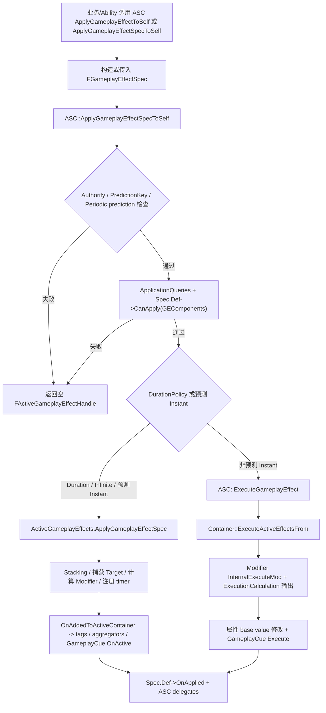
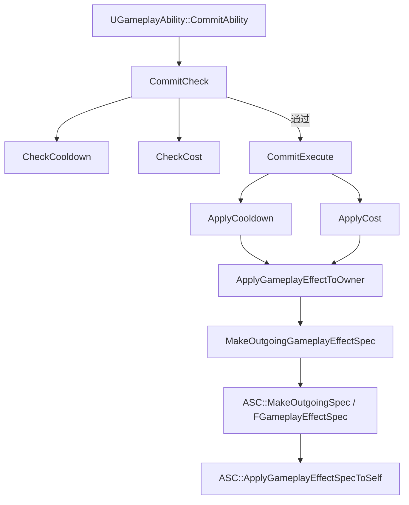

# GameplayEffect 体系：第四轮

本轮只分析 `UGameplayEffect`、`FGameplayEffectSpec`、`FActiveGameplayEffect` 及其直接应用流程。`UAttributeSet` 内部、AbilityTask、完整网络预测回滚不在本轮展开。

## 一、类定位

- `UGameplayEffect` 是 GameplayEffect 的配置定义对象，继承 `UObject` 并实现 `IGameplayTagAssetInterface`；源码注释说明它是编辑器中定义、驱动效果行为的数据资产，GameplayEffect 不应包含蓝图图表逻辑；源码路径：`Engine/Plugins/Runtime/GameplayAbilities/Source/GameplayAbilities/Public/GameplayEffect.h:2071`。
- `UGameplayEffect` 在 UE5.6 中通过 `GEComponents` 承载很多行为配置，`CanApply`、`OnAddedToActiveContainer`、`OnExecuted`、`OnApplied` 都会遍历组件调用对应钩子；源码路径：`Engine/Plugins/Runtime/GameplayAbilities/Source/GameplayAbilities/Public/GameplayEffect.h:2423`、`Engine/Plugins/Runtime/GameplayAbilities/Source/GameplayAbilities/Private/GameplayEffect.cpp:881`、`:895`、`:911`、`:924`。
- `FGameplayEffectSpec` 是从 `UGameplayEffect` 定义生成的运行时规格，保存 Def、Level、Context、运行时 tag、SetByCaller、捕获属性和已计算 modifier；源码注释明确它可变且不同于已应用实例 `FActiveGameplayEffect`；源码路径：`Engine/Plugins/Runtime/GameplayAbilities/Source/GameplayAbilities/Public/GameplayEffect.h:988`、`:1169`、`:1177`、`:1209`、`:1243`。
- `FActiveGameplayEffect` 是已经进入目标 ASC 的 ActiveGameplayEffectsContainer 的运行时效果实例，继承 `FFastArraySerializerItem`，保存 `Spec`、`Handle`、`PredictionKey`、起始时间、timer、stack cache 和事件集合；源码路径：`Engine/Plugins/Runtime/GameplayAbilities/Source/GameplayAbilities/Public/GameplayEffect.h:1319`、`:1389`、`:1392`、`:1395`、`:1403`、`:1425`、`:1432`。
- `FActiveGameplayEffectsContainer` 是 ASC 内部持有 Active GameplayEffect 的容器，继承 `FFastArraySerializer`，源码注释明确它应只由 `UAbilitySystemComponent` 使用；源码路径：`Engine/Plugins/Runtime/GameplayAbilities/Source/GameplayAbilities/Public/GameplayEffect.h:1621`、`Engine/Plugins/Runtime/GameplayAbilities/Source/GameplayAbilities/Public/AbilitySystemComponent.h:1881`。
- 分层关系：`UGameplayEffect` 是配置资产/CDO，`FGameplayEffectSpec` 是一次应用前后的运行时规格，`FActiveGameplayEffect` 是持续存在或预测保留的已激活实例，`FActiveGameplayEffectsContainer` 是 ASC 上负责保存、复制、查询、执行、移除 ActiveGE 的容器；源码路径：`Engine/Plugins/Runtime/GameplayAbilities/Source/GameplayAbilities/Public/GameplayEffect.h:2071`、`:988`、`:1319`、`:1621`。
- `UGameplayAbility` 的 Cost/Cooldown 通过 `CostGameplayEffectClass` / `CooldownGameplayEffectClass` 取 GE CDO，再在 commit 阶段经 `ApplyGameplayEffectToOwner` 生成 Spec 并应用到 owner ASC；源码路径：`Engine/Plugins/Runtime/GameplayAbilities/Source/GameplayAbilities/Public/Abilities/GameplayAbility.h:741`、`:749`、`Engine/Plugins/Runtime/GameplayAbilities/Source/GameplayAbilities/Private/Abilities/GameplayAbility.cpp:1026`、`:1038`、`:2015`。
- GameplayEffect 与 `UAttributeSet` 的关系是：GE 的 Modifier/Execution 描述或输出对属性的修改，ASC/ActiveGEContainer 负责找到目标 AttributeSet、执行 base value 修改、触发 AttributeSet 回调；源码路径：`Engine/Plugins/Runtime/GameplayAbilities/Source/GameplayAbilities/Public/GameplayEffect.h:542`、`Engine/Plugins/Runtime/GameplayAbilities/Source/GameplayAbilities/Private/GameplayEffect.cpp:3907`、`Engine/Plugins/Runtime/GameplayAbilities/Source/GameplayAbilities/Public/AttributeSet.h:198`、`:204`。
- GameplayEffect 与 GameplayTag / GameplayCue 的关系是：资产 tags、授予 target 的 tags、blocked ability tags 通过 GE/GEComponent 缓存和 Spec 动态 tags 进入 ASC tag map；`GameplayCues` 字段在应用、执行、移除时由 ASC/GameplayCueManager 触发；源码路径：`Engine/Plugins/Runtime/GameplayAbilities/Source/GameplayAbilities/Public/GameplayEffect.h:2144`、`:2147`、`:2150`、`:2299`、`Engine/Plugins/Runtime/GameplayAbilities/Source/GameplayAbilities/Private/GameplayEffect.cpp:4373`、`:4417`、`Engine/Plugins/Runtime/GameplayAbilities/Source/GameplayAbilities/Private/AbilitySystemComponent.cpp:1241`。

## 二、核心数据结构

| 类型 | 定义位置 | 职责 | 运行时是否会复制 | 业务层是否通常直接构造 | 和 ASC / Ability / AttributeSet 的关系 |
|---|---|---|---|---|---|
| `UGameplayEffect` | `Engine/Plugins/Runtime/GameplayAbilities/Source/GameplayAbilities/Public/GameplayEffect.h:2071` | GE 配置定义/CDO，保存 duration、modifier、execution、cues、stacking、组件等静态配置。 | GE 对象本身不是每次应用的运行时状态；ActiveGE 的 `Spec.Def` 引用此定义，具体复制受 ActiveGE 复制模式影响；源码路径：`Engine/Plugins/Runtime/GameplayAbilities/Source/GameplayAbilities/Public/GameplayEffect.h:1169`、`Engine/Plugins/Runtime/GameplayAbilities/Source/GameplayAbilities/Private/GameplayEffect.cpp:4911`。 | 通常在编辑器/默认对象配置，不把 CDO 当运行时状态对象修改。 | ASC 读取它生成 Spec；Ability 的 Cost/Cooldown 引用它；Modifier/Execution 最终作用于 AttributeSet。 |
| `FGameplayEffectSpec` | `Engine/Plugins/Runtime/GameplayAbilities/Source/GameplayAbilities/Public/GameplayEffect.h:988` | 一次应用的可变运行时规格，保存 GE Def、Level、Context、Captured Tags、Captured Attributes、动态 tags、SetByCaller、ModifierSpec。 | 作为 `FActiveGameplayEffect.Spec` 可随 ActiveGE fast array 复制；其中 `CapturedRelevantAttributes`、CapturedSource/TargetTags 标注 `NotReplicated`；源码路径：`Engine/Plugins/Runtime/GameplayAbilities/Source/GameplayAbilities/Public/GameplayEffect.h:1177`、`:1201`、`:1205`。 | 通常由 ASC `MakeOutgoingSpec` 或 Ability `MakeOutgoingGameplayEffectSpec` 创建；高级场景可直接构造但需理解捕获/初始化流程。 | ASC 应用 Spec；Ability 可在应用前设置 SetByCaller/stack；AttributeSet 修改回调拿到 Spec。 |
| `FGameplayEffectContext` | `Engine/Plugins/Runtime/GameplayAbilities/Source/GameplayAbilities/Public/GameplayEffectTypes.h:245` | 保存 instigator、effect causer、source object、ability、actor list、hit result、origin 等上下文。 | 支持 `NetSerialize`，但 ability instance 和 instigator ASC 字段标注不复制或弱引用；源码路径：`Engine/Plugins/Runtime/GameplayAbilities/Source/GameplayAbilities/Public/GameplayEffectTypes.h:349`、`:366`、`Engine/Plugins/Runtime/GameplayAbilities/Source/GameplayAbilities/Private/GameplayEffectTypes.cpp:237`。 | 通常通过 ASC `MakeEffectContext` 创建。 | Ability/ASC 将 owner/avatar 写入 Context；Execution、GameplayCue 和 AttributeSet 回调可读取来源信息。 |
| `FGameplayEffectSpecHandle` | `Engine/Plugins/Runtime/GameplayAbilities/Source/GameplayAbilities/Public/GameplayEffectTypes.h:1531` | 用 `TSharedPtr<FGameplayEffectSpec>` 包装 Spec，方便蓝图创建后多次引用/应用。 | 声明 `NetSerialize`，但本质是句柄包装；源码路径：`Engine/Plugins/Runtime/GameplayAbilities/Source/GameplayAbilities/Public/GameplayEffectTypes.h:1539`、`:1555`。 | 通常由 `MakeOutgoingSpec` / `MakeOutgoingGameplayEffectSpec` 返回。 | Ability/ASC 蓝图 API 常传这个 handle，再由 ASC 解引用应用 Spec。 |
| `FActiveGameplayEffect` | `Engine/Plugins/Runtime/GameplayAbilities/Source/GameplayAbilities/Public/GameplayEffect.h:1319` | 已应用的 active 实例，保存 Spec、Handle、PredictionKey、GrantedAbilityHandles、开始时间、duration/period timer、stack cache、事件。 | 继承 `FFastArraySerializerItem`，通过 `FActiveGameplayEffectsContainer` fast array 复制；源码路径：`Engine/Plugins/Runtime/GameplayAbilities/Source/GameplayAbilities/Public/GameplayEffect.h:1319`、`:1392`、`:1432`。 | 不应由业务直接构造。 | ASC/Container 生成、查询、移除；持续 GE 的 Attribute aggregator 和 tags 以 ActiveGE handle 为依赖。 |
| `FActiveGameplayEffectsContainer` | `Engine/Plugins/Runtime/GameplayAbilities/Source/GameplayAbilities/Public/GameplayEffect.h:1621` | ASC 内部 active GE 容器，负责应用、执行、移除、stack、aggregator、delegates、fast array 复制。 | 继承 `FFastArraySerializer` 且 `TStructOpsTypeTraits` 启用 `WithNetDeltaSerializer`；源码路径：`Engine/Plugins/Runtime/GameplayAbilities/Source/GameplayAbilities/Public/GameplayEffect.h:1621`、`:2053`。 | 不由业务直接构造；通过 ASC API 操作。 | ASC 的 `ActiveGameplayEffects` 成员即该容器；它直接调用 AttributeSet/GameplayCue/Tag 更新。 |
| `FGameplayModifierInfo` | `Engine/Plugins/Runtime/GameplayAbilities/Source/GameplayAbilities/Public/GameplayEffect.h:542` | GE 静态 Modifier 配置，描述 Attribute、ModifierOp、Magnitude、Source/Target tag requirements。 | 配置随 GE 定义存在，不是每次应用的运行时状态；运行时值进入 `FModifierSpec`。 | 通常在 GE 资产中配置。 | Container 读取它计算/执行属性修改。 |
| `FModifierSpec` | `Engine/Plugins/Runtime/GameplayAbilities/Source/GameplayAbilities/Public/GameplayEffect.h:725` | 保存某个 Modifier 在当前 Spec 上的最后评估数值 `EvaluatedMagnitude`。 | 作为 Spec 的 `Modifiers` 数组成员可随 ActiveGE Spec 复制；源码路径：`Engine/Plugins/Runtime/GameplayAbilities/Source/GameplayAbilities/Public/GameplayEffect.h:1218`。 | 不应由业务直接写，源码把写权限限定给 Spec/Container；源码路径：`Engine/Plugins/Runtime/GameplayAbilities/Source/GameplayAbilities/Public/GameplayEffect.h:735`。 | `FGameplayEffectSpec::CalculateModifierMagnitudes` 写入它；Container 执行或注册 aggregator 时读取。 |
| `FGameplayEffectModifiedAttribute` | `Engine/Plugins/Runtime/GameplayAbilities/Source/GameplayAbilities/Public/GameplayEffect.h:746` | 保存某次 Spec 修改过的属性和总 magnitude，供 GameplayCue 或后续处理使用。 | 是 Spec 的 `ModifiedAttributes`，`FGameplayEffectSpecForRPC` 会只复制 Cue 需要的属性；源码路径：`Engine/Plugins/Runtime/GameplayAbilities/Source/GameplayAbilities/Public/GameplayEffect.h:1173`、`Engine/Plugins/Runtime/GameplayAbilities/Source/GameplayAbilities/Private/GameplayEffect.cpp:1583`。 | 通常由 Container 在执行 modifier 时写入，不直接构造。 | GameplayCue 可用它取 RawMagnitude；源码路径：`Engine/Plugins/Runtime/GameplayAbilities/Source/GameplayAbilities/Private/AbilitySystemComponent.cpp:1248`。 |
| `FGameplayEffectAttributeCaptureDefinition` | `Engine/Plugins/Runtime/GameplayAbilities/Source/GameplayAbilities/Public/GameplayEffectAttributeCaptureDefinition.h:23` | 描述要捕获哪个 Attribute、从 Source 还是 Target 捕获、是否 snapshot。 | 配置/定义结构本身不代表运行时复制；捕获结果在 Spec 的 capture container 中且相关字段标注 NotReplicated；源码路径：`Engine/Plugins/Runtime/GameplayAbilities/Source/GameplayAbilities/Public/GameplayEffect.h:1177`。 | MMC/Execution 常在 C++ 中定义；GE 配置也会间接使用。 | AttributeBased/MMC/Execution 依赖它从 ASC/AttributeSet 取数。 |
| `FGameplayEffectExecutionDefinition` | `Engine/Plugins/Runtime/GameplayAbilities/Source/GameplayAbilities/Public/GameplayEffect.h:506` | 描述一个 ExecutionCalculation、传入 tags、scoped modifiers 和 conditional effects。 | GE 配置，不是每次运行状态；执行输出另走 `FGameplayEffectCustomExecutionOutput`。 | 通常在 GE 资产中配置。 | Container 在执行 GE 时创建 ExecutionParameters 并调用 Exec CDO。 |
| `FGameplayEffectCustomExecutionParameters` | `Engine/Plugins/Runtime/GameplayAbilities/Source/GameplayAbilities/Public/GameplayEffectExecutionCalculation.h:21` | ExecutionCalculation 执行期间的临时参数，提供 OwningSpec、TargetASC、SourceASC、PassedInTags、PredictionKey 和捕获属性读取 API。 | 源码注释说明不应持有引用，仅用于执行作用域；未作为复制状态使用；源码路径：`Engine/Plugins/Runtime/GameplayAbilities/Source/GameplayAbilities/Public/GameplayEffectExecutionCalculation.h:19`。 | 由 Container 临时创建，业务在 ExecCalc 中读取。 | ExecCalc 用它访问 Spec/ASC/捕获属性并输出 evaluated modifiers。 |
| `FGameplayEffectCustomExecutionOutput` | `Engine/Plugins/Runtime/GameplayAbilities/Source/GameplayAbilities/Public/GameplayEffectExecutionCalculation.h:201` | ExecutionCalculation 输出 evaluated modifiers，并可声明手动处理 stack、GameplayCue、触发 conditional effects。 | 执行期临时输出，不是复制状态；源码路径：`Engine/Plugins/Runtime/GameplayAbilities/Source/GameplayAbilities/Public/GameplayEffectExecutionCalculation.h:236`。 | 由 ExecCalc 填充。 | Container 读取输出并调用 `InternalExecuteMod`。 |
| `FGameplayEffectQuery` | `Engine/Plugins/Runtime/GameplayAbilities/Source/GameplayAbilities/Public/GameplayEffect.h:1440` | 用 tag query、source、definition、attribute、custom delegate 匹配 Spec 或 ActiveGE。 | 本身是查询条件，不代表 ActiveGE 复制；ActiveGE 复制由容器负责。 | 业务层常用来查询/移除 active effects。 | ASC/Container 的查询、RemoveOther/Immunity 等组件都使用它。 |

## 三、GameplayEffect 配置项

- `DurationPolicy` 决定 GE 是 `Instant`、`Infinite` 还是 `HasDuration`；定义位置：`Engine/Plugins/Runtime/GameplayAbilities/Source/GameplayAbilities/Public/GameplayEffect.h:2227`，枚举定义：`Engine/Plugins/Runtime/GameplayAbilities/Source/GameplayAbilities/Public/GameplayEffect.h:659`。
- `DurationMagnitude` 只对 `HasDuration` 有意义，用 `FGameplayEffectModifierMagnitude` 计算时长；源码路径：`Engine/Plugins/Runtime/GameplayAbilities/Source/GameplayAbilities/Public/GameplayEffect.h:2231`、`Engine/Plugins/Runtime/GameplayAbilities/Source/GameplayAbilities/Private/GameplayEffect.cpp:4204`。
- `Period` 是周期执行间隔，`DurationPolicy == Instant` 时 `Spec.GetPeriod()` 会强制返回 no period；源码路径：`Engine/Plugins/Runtime/GameplayAbilities/Source/GameplayAbilities/Public/GameplayEffect.h:2235`、`:1052`。
- `bExecutePeriodicEffectOnApplication` 控制 periodic GE 是否应用后先执行一次，再进入周期 timer；源码路径：`Engine/Plugins/Runtime/GameplayAbilities/Source/GameplayAbilities/Public/GameplayEffect.h:2239`、`Engine/Plugins/Runtime/GameplayAbilities/Source/GameplayAbilities/Private/GameplayEffect.cpp:4224`。
- `PeriodicInhibitionPolicy` 控制被 inhibition 移除后 period timer 的响应，枚举支持不重置、重置、立即执行并重置；源码路径：`Engine/Plugins/Runtime/GameplayAbilities/Source/GameplayAbilities/Public/GameplayEffect.h:2243`、`:711`。
- `Modifiers` 是目标属性修改列表，元素为 `FGameplayModifierInfo`；源码路径：`Engine/Plugins/Runtime/GameplayAbilities/Source/GameplayAbilities/Public/GameplayEffect.h:2247`、`:542`。
- `Executions` 是自定义执行计算列表，元素为 `FGameplayEffectExecutionDefinition`；源码路径：`Engine/Plugins/Runtime/GameplayAbilities/Source/GameplayAbilities/Public/GameplayEffect.h:2251`、`:506`。
- Asset tags 在 UE5.6 主路径中由 `UAssetTagsGameplayEffectComponent` 写入 `CachedAssetTags`，旧字段 `InheritableGameplayEffectTags` 已标记 deprecated；源码路径：`Engine/Plugins/Runtime/GameplayAbilities/Source/GameplayAbilities/Public/GameplayEffectComponents/AssetTagsGameplayEffectComponent.h:13`、`Engine/Plugins/Runtime/GameplayAbilities/Source/GameplayAbilities/Public/GameplayEffect.h:2311`、`:2412`。
- Granted tags 在 UE5.6 主路径中由 `UTargetTagsGameplayEffectComponent` 写入 `CachedGrantedTags`，旧字段 `InheritableOwnedTagsContainer` 已标记 deprecated；源码路径：`Engine/Plugins/Runtime/GameplayAbilities/Source/GameplayAbilities/Public/GameplayEffectComponents/TargetTagsGameplayEffectComponent.h:13`、`Engine/Plugins/Runtime/GameplayAbilities/Source/GameplayAbilities/Public/GameplayEffect.h:2316`、`:2415`。
- Blocked ability tags 在 UE5.6 主路径中由 `UBlockAbilityTagsGameplayEffectComponent` 写入 `CachedBlockedAbilityTags`，旧字段 `InheritableBlockedAbilityTagsContainer` 已标记 deprecated；源码路径：`Engine/Plugins/Runtime/GameplayAbilities/Source/GameplayAbilities/Public/GameplayEffectComponents/BlockAbilityTagsGameplayEffectComponent.h:13`、`Engine/Plugins/Runtime/GameplayAbilities/Source/GameplayAbilities/Public/GameplayEffect.h:2322`、`:2418`。
- `OngoingTagRequirements`、`ApplicationTagRequirements`、`RemovalTagRequirements` 旧字段已标记 deprecated，UE5.6 推荐使用 `UTargetTagRequirementsGameplayEffectComponent`；源码路径：`Engine/Plugins/Runtime/GameplayAbilities/Source/GameplayAbilities/Public/GameplayEffect.h:2327`、`:2332`、`:2337`、`Engine/Plugins/Runtime/GameplayAbilities/Source/GameplayAbilities/Public/GameplayEffectComponents/TargetTagRequirementsGameplayEffectComponent.h:15`。
- `GameplayCues` 仍是 `UGameplayEffect` 上的数组字段，配合 `bRequireModifierSuccessToTriggerCues`、`bSuppressStackingCues` 控制触发条件；源码路径：`Engine/Plugins/Runtime/GameplayAbilities/Source/GameplayAbilities/Public/GameplayEffect.h:2290`、`:2294`、`:2299`。
- `StackingType`、`StackLimitCount`、`StackDurationRefreshPolicy`、`StackPeriodResetPolicy`、`StackExpirationPolicy` 定义 GE 如何按 source/target 堆叠、上限、刷新 duration/period、过期策略；源码路径：`Engine/Plugins/Runtime/GameplayAbilities/Source/GameplayAbilities/Public/GameplayEffect.h:2374`、`:2378`、`:2382`、`:2386`、`:2390`。
- `GrantedAbilities` 旧字段已 deprecated，UE5.6 推荐 `UAbilitiesGameplayEffectComponent`；源码路径：`Engine/Plugins/Runtime/GameplayAbilities/Source/GameplayAbilities/Public/GameplayEffect.h:2401`、`Engine/Plugins/Runtime/GameplayAbilities/Source/GameplayAbilities/Public/GameplayEffectComponents/AbilitiesGameplayEffectComponent.h:38`。
- Granted application immunity 的旧字段 `GrantedApplicationImmunityTags`、`GrantedApplicationImmunityQuery` 已 deprecated，UE5.6 推荐 `UImmunityGameplayEffectComponent`；源码路径：`Engine/Plugins/Runtime/GameplayAbilities/Source/GameplayAbilities/Public/GameplayEffect.h:2346`、`:2353`、`Engine/Plugins/Runtime/GameplayAbilities/Source/GameplayAbilities/Public/GameplayEffectComponents/ImmunityGameplayEffectComponent.h:16`。
- `ChanceToApplyToTarget_DEPRECATED`、`ApplicationRequirements_DEPRECATED`、`ConditionalGameplayEffects` 等旧字段分别迁移到 Chance/CustomCanApply/AdditionalEffects 组件；源码路径：`Engine/Plugins/Runtime/GameplayAbilities/Source/GameplayAbilities/Public/GameplayEffect.h:2254`、`:2258`、`:2262`、`Engine/Plugins/Runtime/GameplayAbilities/Source/GameplayAbilities/Public/GameplayEffectComponents/ChanceToApplyGameplayEffectComponent.h:14`、`Engine/Plugins/Runtime/GameplayAbilities/Source/GameplayAbilities/Public/GameplayEffectComponents/CustomCanApplyGameplayEffectComponent.h:14`、`Engine/Plugins/Runtime/GameplayAbilities/Source/GameplayAbilities/Public/GameplayEffectComponents/AdditionalEffectsGameplayEffectComponent.h:13`。

## 四、GameplayEffect 应用流程



关键步骤：

- `UAbilitySystemComponent::MakeOutgoingSpec` 在 Context 无效时调用 `MakeEffectContext`，再用 GE CDO、Context、Level 创建 `FGameplayEffectSpec`；源码路径：`Engine/Plugins/Runtime/GameplayAbilities/Source/GameplayAbilities/Private/AbilitySystemComponent.cpp:451`。
- `UAbilitySystemComponent::ApplyGameplayEffectToSelf` 会直接构造 `FGameplayEffectSpec` 并进入 `ApplyGameplayEffectSpecToSelf`；源码路径：`Engine/Plugins/Runtime/GameplayAbilities/Source/GameplayAbilities/Private/AbilitySystemComponent.cpp:589`。
- `ApplyGameplayEffectSpecToSelf` 先检查网络权限；带有效 prediction key 且 `Spec.GetPeriod() > 0` 的 periodic GE 不允许客户端预测，服务端会清 prediction key，客户端直接返回空 handle；源码路径：`Engine/Plugins/Runtime/GameplayAbilities/Source/GameplayAbilities/Private/AbilitySystemComponent.cpp:815`、`:822`。
- `ApplyGameplayEffectSpecToSelf` 执行 `GameplayEffectApplicationQueries`，再调用 `Spec.Def->CanApply`；`UGameplayEffect::CanApply` 会遍历 `GEComponents` 的 `CanGameplayEffectApply`；源码路径：`Engine/Plugins/Runtime/GameplayAbilities/Source/GameplayAbilities/Private/AbilitySystemComponent.cpp:835`、`:844`、`Engine/Plugins/Runtime/GameplayAbilities/Source/GameplayAbilities/Private/GameplayEffect.cpp:881`。
- `ApplyGameplayEffectSpecToSelf` 会检查每个 Modifier 的 Attribute 是否有效，无效则返回空 handle；源码路径：`Engine/Plugins/Runtime/GameplayAbilities/Source/GameplayAbilities/Private/AbilitySystemComponent.cpp:850`。
- Duration / Infinite / 预测 Instant 会进入 `FActiveGameplayEffectsContainer::ApplyGameplayEffectSpec`，非预测 Instant 不加入 ActiveGameplayEffects，而是执行 `ExecuteGameplayEffect`；源码路径：`Engine/Plugins/Runtime/GameplayAbilities/Source/GameplayAbilities/Private/AbilitySystemComponent.cpp:878`、`:952`。
- `FActiveGameplayEffectsContainer::ApplyGameplayEffectSpec` 负责 stack 查找/溢出、生成 `FActiveGameplayEffect`、捕获 target、计算 modifier magnitude、设置 duration/period timer、MarkItemDirty、触发新增逻辑；源码路径：`Engine/Plugins/Runtime/GameplayAbilities/Source/GameplayAbilities/Private/GameplayEffect.cpp:3989`、`:4008`、`:4157`、`:4187`、`:4218`、`:4240`。
- `InternalOnActiveGameplayEffectAdded` 调用 `UGameplayEffect::OnAddedToActiveContainer`，再通过 ASC `SetActiveGameplayEffectInhibit` 决定是否激活并添加/移除 tags、aggregators、GameplayCue；源码路径：`Engine/Plugins/Runtime/GameplayAbilities/Source/GameplayAbilities/Private/GameplayEffect.cpp:4286`、`Engine/Plugins/Runtime/GameplayAbilities/Source/GameplayAbilities/Private/AbilitySystemComponent.cpp:288`。
- `ExecuteActiveEffectsFrom` 会捕获 target tags、计算 modifiers、执行普通 Modifiers 和 Executions；ExecutionCalculation 通过 `FGameplayEffectCustomExecutionOutput` 产出的 modifiers 也会进入 `InternalExecuteMod`；源码路径：`Engine/Plugins/Runtime/GameplayAbilities/Source/GameplayAbilities/Private/GameplayEffect.cpp:3065`、`:3084`、`:3114`、`:3155`。
- `InternalExecuteMod` 找到目标 AttributeSet，调用 `PreGameplayEffectExecute`、修改属性 base value、累计 `ModifiedAttributes`、再调用 `PostGameplayEffectExecute`；源码路径：`Engine/Plugins/Runtime/GameplayAbilities/Source/GameplayAbilities/Private/GameplayEffect.cpp:3907`、`:3925`、`:3930`、`:3938`、`:3946`。
- `Spec.Def->OnApplied` 在成功应用后调用组件 `OnGameplayEffectApplied`，ASC 随后广播 self/target applied delegate；源码路径：`Engine/Plugins/Runtime/GameplayAbilities/Source/GameplayAbilities/Private/AbilitySystemComponent.cpp:957`、`:962`、`:967`、`Engine/Plugins/Runtime/GameplayAbilities/Source/GameplayAbilities/Private/GameplayEffect.cpp:924`。

简化伪代码：

```cpp
// ASC 负责：构造/接收 Spec，权限、应用条件、Instant vs Active 分支。
FActiveGameplayEffectHandle ApplyGameplayEffectSpecToSelf(Spec, PredictionKey)
{
    if (!HasNetworkAuthorityToApplyGameplayEffect(PredictionKey)) return {};
    if (PredictionKey.IsValidKey() && Spec.GetPeriod() > 0 && !Authority) return {};
    if (AnyApplicationQueryBlocks(Spec)) return {};
    if (!Spec.Def->CanApply(ActiveGameplayEffects, Spec)) return {};
    if (AnyModifierAttributeInvalid(Spec.Def->Modifiers)) return {};

    bool predictedInstant = ClientPredictedInstant(Spec);
    if (Spec.Def->DurationPolicy != Instant || predictedInstant)
    {
        ActiveGE = ActiveGameplayEffects.ApplyGameplayEffectSpec(Spec, PredictionKey, bStacked);
        OurCopyOfSpec = &ActiveGE->Spec;
    }
    else
    {
        OurCopyOfSpec = CopyAndCaptureTarget(Spec);
        ExecuteGameplayEffect(*OurCopyOfSpec, PredictionKey);
    }

    Spec.Def->OnApplied(ActiveGameplayEffects, *OurCopyOfSpec, PredictionKey);
    BroadcastAppliedDelegates();
}

// Container 负责：ActiveGE 运行时状态、stack、timer、aggregator、tags、cues。
FActiveGameplayEffect* ApplyGameplayEffectSpec(Spec, PredictionKey)
{
    Existing = FindStackableActiveGameplayEffect(Spec);
    Active = Existing ? RefreshStack(Existing, Spec) : AddNewActiveGE(Spec);
    Active.Spec.CaptureAttributeDataFromTarget(Owner);
    Active.Spec.CalculateModifierMagnitudes();
    SetupDurationTimerIfNeeded();
    SetupPeriodTimerIfNeeded();
    InternalOnActiveGameplayEffectAdded(*Active, InvokeCueEvents);
    return Active;
}
```

## 五、Cost / Cooldown 接入流程



- `CommitAbility` 先执行 `CommitCheck`，失败直接返回 false；成功后调用 `CommitExecute`，再调用蓝图 `K2_CommitExecute` 并通知 ASC；源码路径：`Engine/Plugins/Runtime/GameplayAbilities/Source/GameplayAbilities/Private/Abilities/GameplayAbility.cpp:559`。
- `CommitCheck` 会重新检查 cooldown 和 cost，而不是复用 `CanActivateAbility` 的旧结果；源码注释明确激活开始和真正 commit 之间状态可能变化；源码路径：`Engine/Plugins/Runtime/GameplayAbilities/Source/GameplayAbilities/Private/Abilities/GameplayAbility.cpp:615`。
- `CooldownGameplayEffectClass` 通过 `GetCooldownGameplayEffect` 取 CDO；`CheckCooldown` 读取 `GetCooldownTags()`，如果 ASC 当前拥有任一 cooldown tag 则失败；源码路径：`Engine/Plugins/Runtime/GameplayAbilities/Source/GameplayAbilities/Private/Abilities/GameplayAbility.cpp:1026`、`:1050`、`:1057`。
- `GetCooldownTags()` 默认返回 Cooldown GE 的 `GetGrantedTags()`，所以 cooldown GE 通常需要配置 Granted Tags 才能被后续 `CheckCooldown` 识别；源码路径：`Engine/Plugins/Runtime/GameplayAbilities/Source/GameplayAbilities/Private/Abilities/GameplayAbility.cpp:1197`、`Engine/Plugins/Runtime/GameplayAbilities/Source/GameplayAbilities/Public/GameplayEffect.h:2147`。
- `CostGameplayEffectClass` 通过 `GetCostGameplayEffect` 取 CDO；`CheckCost` 调用 ASC `CanApplyAttributeModifiers`；源码路径：`Engine/Plugins/Runtime/GameplayAbilities/Source/GameplayAbilities/Private/Abilities/GameplayAbility.cpp:1038`、`:1092`。
- `CanApplyAttributeModifiers` 会构造 Spec、计算 modifier magnitude，并只对 additive modifier 做 `CurrentValue + CostValue < 0` 的失败判断；源码路径：`Engine/Plugins/Runtime/GameplayAbilities/Source/GameplayAbilities/Private/GameplayEffect.cpp:5177`、`:5183`、`:5190`、`:5198`。
- `CommitExecute` 的顺序是 `ApplyCooldown` 后 `ApplyCost`；二者都经 `ApplyGameplayEffectToOwner` 生成 Spec 并最终调用 owner ASC 的 `ApplyGameplayEffectSpecToSelf`；源码路径：`Engine/Plugins/Runtime/GameplayAbilities/Source/GameplayAbilities/Private/Abilities/GameplayAbility.cpp:651`、`:1083`、`:1115`、`:2015`、`:2033`。
- Check 阶段只判断是否还能提交，Apply 阶段才真正把 cooldown/cost GE 应用到 ASC，因此 `CanActivateAbility` 成功后仍可能因为资源、tags、SetByCaller、目标属性等状态变化导致 Commit 失败；源码路径：`Engine/Plugins/Runtime/GameplayAbilities/Source/GameplayAbilities/Private/Abilities/GameplayAbility.cpp:615`。

## 六、Modifier 和 Attribute 修改

- Modifier 用 `FGameplayModifierInfo` 描述“哪个 Attribute、用什么 op、数值怎么来、Source/Target tag 条件是什么”；源码路径：`Engine/Plugins/Runtime/GameplayAbilities/Source/GameplayAbilities/Public/GameplayEffect.h:542`。
- `EGameplayModOp` 在 UE5.6 中包含 `AddBase`、`MultiplyAdditive`、`DivideAdditive`、`MultiplyCompound`、`AddFinal`、`Override`，旧名 `Additive`、`Multiplicitive`、`Division` 作为隐藏兼容名映射到 0/1/2；源码路径：`Engine/Plugins/Runtime/GameplayAbilities/Source/GameplayAbilities/Public/GameplayEffectTypes.h:92`。
- Attribute aggregator 的持续 modifier 求值在 `FAggregatorModChannel::EvaluateWithBase` / `FAggregator::Evaluate` 中实现，Instant/base-value 修改使用 `FAggregator::StaticExecModOnBaseValue`；源码路径：`Engine/Plugins/Runtime/GameplayAbilities/Source/GameplayAbilities/Private/GameplayEffectAggregator.cpp:76`、`:379`、`:447`。
- Modifier magnitude 由 `EGameplayEffectMagnitudeCalculation` 决定来源：`ScalableFloat`、`AttributeBased`、`CustomCalculationClass`、`SetByCaller`；源码路径：`Engine/Plugins/Runtime/GameplayAbilities/Source/GameplayAbilities/Public/GameplayEffect.h:67`、`:276`。
- `FScalableFloat` 是 `Value * Curve[Level]`；源码路径：`Engine/Plugins/Runtime/GameplayAbilities/Source/GameplayAbilities/Public/ScalableFloat.h:14`。
- `AttributeBased` 通过 `FAttributeBasedFloat` 依赖 `FGameplayEffectAttributeCaptureDefinition` 捕获 Source/Target 属性；源码路径：`Engine/Plugins/Runtime/GameplayAbilities/Source/GameplayAbilities/Public/GameplayEffect.h:124`、`Engine/Plugins/Runtime/GameplayAbilities/Source/GameplayAbilities/Public/GameplayEffectAttributeCaptureDefinition.h:23`。
- `CustomCalculationClass` 使用 `UGameplayModMagnitudeCalculation::CalculateBaseMagnitude`，适合一个 modifier 的可复用数值计算；源码路径：`Engine/Plugins/Runtime/GameplayAbilities/Source/GameplayAbilities/Public/GameplayModMagnitudeCalculation.h:15`、`:24`。
- `SetByCaller` 从 `FGameplayEffectSpec::SetByCallerNameMagnitudes` 或 `SetByCallerTagMagnitudes` 读取，未设置且要求 warning 时会记录 error 并返回默认值；源码路径：`Engine/Plugins/Runtime/GameplayAbilities/Source/GameplayAbilities/Public/GameplayEffect.h:1243`、`:1244`、`Engine/Plugins/Runtime/GameplayAbilities/Source/GameplayAbilities/Private/GameplayEffect.cpp:2216`、`:2238`。
- Instant GE 和 periodic tick 会走 `ExecuteActiveEffectsFrom`，普通 Modifiers 和 Execution 输出都会通过 `InternalExecuteMod` 修改属性 base value；源码路径：`Engine/Plugins/Runtime/GameplayAbilities/Source/GameplayAbilities/Private/GameplayEffect.cpp:3065`、`:3114`、`:3155`、`:3907`。
- Duration / Infinite 且无 period 的 GE 会在 `AddActiveGameplayEffectGrantedTagsAndModifiers` 中把 modifier 注册到属性 aggregator；源码路径：`Engine/Plugins/Runtime/GameplayAbilities/Source/GameplayAbilities/Private/GameplayEffect.cpp:4312`、`:4321`、`:4337`。
- 带 period 的持续 GE 不把 modifier 长驻 aggregator，而是设置周期 timer 后每次周期执行；源码路径：`Engine/Plugins/Runtime/GameplayAbilities/Source/GameplayAbilities/Private/GameplayEffect.cpp:4343`、`Engine/Plugins/Runtime/GameplayAbilities/Source/GameplayAbilities/Private/GameplayEffect.cpp:4463`。
- `PreGameplayEffectExecute` / `PostGameplayEffectExecute` 只在 execute/base value 修改路径调用，源码注释明确不会因 duration buff 这类应用型效果调用；源码路径：`Engine/Plugins/Runtime/GameplayAbilities/Source/GameplayAbilities/Public/AttributeSet.h:198`、`:204`。
- `PreAttributeChange` 是更底层的任意属性最终值变化前回调，可由 executed effects、duration effects、移除、stacking 等触发；本轮不展开 AttributeSet 完整实现；源码路径：`Engine/Plugins/Runtime/GameplayAbilities/Source/GameplayAbilities/Public/AttributeSet.h:218`。

## 七、GameplayEffectSpec

- `FGameplayEffectSpec` 通常由 ASC `MakeOutgoingSpec` 或 `ApplyGameplayEffectToSelf` 创建，Ability 的 `MakeOutgoingGameplayEffectSpec` 也是调用 ASC `MakeOutgoingSpec` 后再把 Ability tags / dynamic spec source tags / SetByCaller 写入 Spec；源码路径：`Engine/Plugins/Runtime/GameplayAbilities/Source/GameplayAbilities/Private/AbilitySystemComponent.cpp:451`、`:589`、`Engine/Plugins/Runtime/GameplayAbilities/Source/GameplayAbilities/Private/Abilities/GameplayAbility.cpp:1330`、`:1347`。
- Spec 保存 `Def`、`ModifiedAttributes`、`CapturedRelevantAttributes`、`DynamicGrantedTags`、`DynamicAssetTags`、`Modifiers`、SetByCaller maps、`EffectContext`、`Level`；源码路径：`Engine/Plugins/Runtime/GameplayAbilities/Source/GameplayAbilities/Public/GameplayEffect.h:1169`、`:1173`、`:1177`、`:1209`、`:1214`、`:1218`、`:1243`、`:1250`、`:1254`。
- Level 会参与 `FScalableFloat::GetValueAtLevel`、AttributeBased/CustomCalculation 的系数和 GE duration/magnitude 计算；源码路径：`Engine/Plugins/Runtime/GameplayAbilities/Source/GameplayAbilities/Public/ScalableFloat.h:43`、`Engine/Plugins/Runtime/GameplayAbilities/Source/GameplayAbilities/Private/GameplayEffect.cpp:1136`、`:1066`。
- Context 保存 Source / Instigator / Causer / SourceObject / Ability / HitResult / Origin，`AddInstigator` 会缓存 instigator ASC；源码路径：`Engine/Plugins/Runtime/GameplayAbilities/Source/GameplayAbilities/Public/GameplayEffectTypes.h:245`、`:268`、`:313`、`:323`、`Engine/Plugins/Runtime/GameplayAbilities/Source/GameplayAbilities/Private/GameplayEffectTypes.cpp:177`。
- Captured Attributes 在 `SetupAttributeCaptureDefinitions` / `CaptureAttributeDataFromTarget` 路径中准备和捕获；Spec 的 `CapturedRelevantAttributes` 标注 NotReplicated；源码路径：`Engine/Plugins/Runtime/GameplayAbilities/Source/GameplayAbilities/Public/GameplayEffect.h:1139`、`:1110`、`:1177`。
- Dynamic Granted Tags 会在 Spec 的 `GetAllGrantedTags` 中与 Def granted tags 合并；Dynamic Asset Tags 会在 `AppendDynamicAssetTags` 进入 captured source spec tags 并由 `GetAllAssetTags` 合并；源码路径：`Engine/Plugins/Runtime/GameplayAbilities/Source/GameplayAbilities/Private/GameplayEffect.cpp:2174`、`:2191`、`Engine/Plugins/Runtime/GameplayAbilities/Source/GameplayAbilities/Public/GameplayEffect.h:1148`、`:1152`。
- `FGameplayEffectSpecHandle` 只是 Spec 的共享指针包装，方便蓝图和 API 传递；源码路径：`Engine/Plugins/Runtime/GameplayAbilities/Source/GameplayAbilities/Public/GameplayEffectTypes.h:1531`、`:1539`。
- 与 GE CDO 的区别：GE CDO 是静态配置，Spec 是一次应用携带 Context/Level/SetByCaller/捕获属性的可变运行时数据；源码路径：`Engine/Plugins/Runtime/GameplayAbilities/Source/GameplayAbilities/Public/GameplayEffect.h:2071`、`:988`。
- 与 ActiveGE 的区别：Spec 可以在应用前存在，也可以被 Instant GE 执行后即结束；ActiveGE 是已加入目标 ASC 容器、具有 handle/timer/stack/复制事件的实例；源码路径：`Engine/Plugins/Runtime/GameplayAbilities/Source/GameplayAbilities/Public/GameplayEffect.h:988`、`:1319`。
- 常见业务使用场景：Ability 生成 Spec 后设置 SetByCaller magnitude、stack count、dynamic tags，再应用到 owner 或 target；源码路径：`Engine/Plugins/Runtime/GameplayAbilities/Source/GameplayAbilities/Private/Abilities/GameplayAbility.cpp:2015`、`:2019`、`Engine/Plugins/Runtime/GameplayAbilities/Source/GameplayAbilities/Private/GameplayEffect.cpp:2208`。

## 八、ActiveGameplayEffect

- `FActiveGameplayEffect` 在非 Instant 持续效果、Infinite 效果、或客户端预测 Instant 被临时当成 Infinite 时产生；源码路径：`Engine/Plugins/Runtime/GameplayAbilities/Source/GameplayAbilities/Private/AbilitySystemComponent.cpp:878`、`:857`。
- `FActiveGameplayEffect` 保存 runtime 状态：`Handle`、`Spec`、`PredictionKey`、授予 Ability handles、server/local start time、inhibition、client cached stack、period/duration timer、事件集合；源码路径：`Engine/Plugins/Runtime/GameplayAbilities/Source/GameplayAbilities/Public/GameplayEffect.h:1389`、`:1392`、`:1395`、`:1399`、`:1403`、`:1414`、`:1423`、`:1425`、`:1432`。
- Duration 和 StartTime 由 `StartServerWorldTime`、`StartWorldTime`、`Spec.GetDuration()` 组合计算；Infinite duration 的 remaining/end time 返回 -1；源码路径：`Engine/Plugins/Runtime/GameplayAbilities/Source/GameplayAbilities/Public/GameplayEffect.h:1335`、`:1351`。
- Duration timer 在 `ApplyGameplayEffectSpec` 中设置到 ASC `CheckDurationExpired`，Period timer 设置到 ASC `ExecutePeriodicEffect`；源码路径：`Engine/Plugins/Runtime/GameplayAbilities/Source/GameplayAbilities/Private/GameplayEffect.cpp:4198`、`:4218`。
- Stack 通过 `FindStackableActiveGameplayEffect`、`HandleActiveGameplayEffectStackOverflow`、`Spec.SetStackCount`、`OnStackCountChange` 维护；源码路径：`Engine/Plugins/Runtime/GameplayAbilities/Source/GameplayAbilities/Private/GameplayEffect.cpp:4008`、`:4032`、`:4061`、`:3427`。
- `RemoveActiveGameplayEffect` 先定位 handle，再进入 `InternalRemoveActiveGameplayEffect`；若指定移除 stack 数且剩余 stack 大于移除数，会只减少 stack 并广播 stack change；源码路径：`Engine/Plugins/Runtime/GameplayAbilities/Source/GameplayAbilities/Private/GameplayEffect.cpp:4446`、`:4499`、`:4526`。
- 完全移除 ActiveGE 时会执行 `InternalOnActiveGameplayEffectRemoved`，移除 tags、aggregator mods、blocked ability tags、minimal replication tags、GameplayCue、granted abilities，并广播 removed delegate；源码路径：`Engine/Plugins/Runtime/GameplayAbilities/Source/GameplayAbilities/Private/GameplayEffect.cpp:4624`、`:4652`、`:4670`、`:4673`、`:4679`、`:4647`。
- ActiveGE 复制由 `FActiveGameplayEffectsContainer::NetDeltaSerialize` 使用 `FastArrayDeltaSerialize`，Minimal 模式不复制 ActiveGE，Mixed 模式只向 owner/autonomous 复制完整信息；源码路径：`Engine/Plugins/Runtime/GameplayAbilities/Source/GameplayAbilities/Private/GameplayEffect.cpp:4911`、`:4918`、`:4922`、`:4944`。
- ASC 的 `ActiveGameplayEffects` 属性在 `GetLifetimeReplicatedProps` 中复制，条件可动态取 `ActiveGameplayEffects.GetReplicationCondition()`；源码路径：`Engine/Plugins/Runtime/GameplayAbilities/Source/GameplayAbilities/Private/AbilitySystemComponent.cpp:1633`、`:1664`。
- ActiveGE 提供 `OnEffectRemoved`、`OnStackChanged`、`OnTimeChanged`、`OnInhibitionChanged` 事件集合；ASC 提供按 handle 获取这些 delegate 的 API；源码路径：`Engine/Plugins/Runtime/GameplayAbilities/Source/GameplayAbilities/Public/GameplayEffectTypes.h:989`、`Engine/Plugins/Runtime/GameplayAbilities/Source/GameplayAbilities/Public/AbilitySystemComponent.h:566`。
- Stack/time/removed/inhibition 变更会分别广播对应事件；源码路径：`Engine/Plugins/Runtime/GameplayAbilities/Source/GameplayAbilities/Private/GameplayEffect.cpp:3445`、`:3451`、`:4647`、`Engine/Plugins/Runtime/GameplayAbilities/Source/GameplayAbilities/Private/AbilitySystemComponent.cpp:320`。

## 九、GameplayEffectComponents 概览

- `UAdditionalEffectsGameplayEffectComponent`：在 GE 应用时或 ActiveGE 移除完成时应用额外 GE；源码路径：`Engine/Plugins/Runtime/GameplayAbilities/Source/GameplayAbilities/Public/GameplayEffectComponents/AdditionalEffectsGameplayEffectComponent.h:13`。
- `UAssetTagsGameplayEffectComponent`：配置“GE 资产自身拥有但不授予 Actor”的 Asset Tags，并写入 GE 的 `CachedAssetTags`；源码路径：`Engine/Plugins/Runtime/GameplayAbilities/Source/GameplayAbilities/Public/GameplayEffectComponents/AssetTagsGameplayEffectComponent.h:13`、`Engine/Plugins/Runtime/GameplayAbilities/Source/GameplayAbilities/Private/GameplayEffectComponents/AssetTagsGameplayEffectComponent.cpp:59`。
- `UTargetTagsGameplayEffectComponent`：配置应用到目标 Actor 的 Granted Tags，并写入 GE 的 `CachedGrantedTags`；源码路径：`Engine/Plugins/Runtime/GameplayAbilities/Source/GameplayAbilities/Public/GameplayEffectComponents/TargetTagsGameplayEffectComponent.h:13`、`Engine/Plugins/Runtime/GameplayAbilities/Source/GameplayAbilities/Private/GameplayEffectComponents/TargetTagsGameplayEffectComponent.cpp:70`。
- `UBlockAbilityTagsGameplayEffectComponent`：配置应用到目标的 blocked ability tags，使目标 ASC 阻止具有相应 AbilityTags 的 Ability 激活；源码路径：`Engine/Plugins/Runtime/GameplayAbilities/Source/GameplayAbilities/Public/GameplayEffectComponents/BlockAbilityTagsGameplayEffectComponent.h:13`、`Engine/Plugins/Runtime/GameplayAbilities/Source/GameplayAbilities/Private/GameplayEffectComponents/BlockAbilityTagsGameplayEffectComponent.cpp:68`。
- `UImmunityGameplayEffectComponent`：ActiveGE 添加后向 ASC 注册应用查询，用 `ImmunityQueries` 阻止其他 matching GE 应用；源码路径：`Engine/Plugins/Runtime/GameplayAbilities/Source/GameplayAbilities/Public/GameplayEffectComponents/ImmunityGameplayEffectComponent.h:16`、`Engine/Plugins/Runtime/GameplayAbilities/Source/GameplayAbilities/Private/GameplayEffectComponents/ImmunityGameplayEffectComponent.cpp:18`、`:46`。
- `URemoveOtherGameplayEffectComponent`：拥有 GE 应用时按 `RemoveGameplayEffectQueries` 移除其他 ActiveGE；源码路径：`Engine/Plugins/Runtime/GameplayAbilities/Source/GameplayAbilities/Public/GameplayEffectComponents/RemoveOtherGameplayEffectComponent.h:15`、`Engine/Plugins/Runtime/GameplayAbilities/Source/GameplayAbilities/Private/GameplayEffectComponents/RemoveOtherGameplayEffectComponent.cpp:16`。
- `UChanceToApplyGameplayEffectComponent`：在 `CanGameplayEffectApply` 阶段用 `FScalableFloat` 概率决定是否应用；源码路径：`Engine/Plugins/Runtime/GameplayAbilities/Source/GameplayAbilities/Public/GameplayEffectComponents/ChanceToApplyGameplayEffectComponent.h:14`、`Engine/Plugins/Runtime/GameplayAbilities/Source/GameplayAbilities/Private/GameplayEffectComponents/ChanceToApplyGameplayEffectComponent.cpp:21`。
- `UCustomCanApplyGameplayEffectComponent`：在 `CanGameplayEffectApply` 阶段调用配置的 `UGameplayEffectCustomApplicationRequirement`；源码路径：`Engine/Plugins/Runtime/GameplayAbilities/Source/GameplayAbilities/Public/GameplayEffectComponents/CustomCanApplyGameplayEffectComponent.h:14`、`Engine/Plugins/Runtime/GameplayAbilities/Source/GameplayAbilities/Private/GameplayEffectComponents/CustomCanApplyGameplayEffectComponent.cpp:13`。
- `GrantAbilitiesGameplayEffectComponent` 这个精确类名本轮未在 UE5.6 源码中确认；实际存在的是 `UAbilitiesGameplayEffectComponent`，DisplayName 为 “Grant Gameplay Abilities”，用于 ActiveGE 存在期间授予目标 GameplayAbility；源码路径：`Engine/Plugins/Runtime/GameplayAbilities/Source/GameplayAbilities/Public/GameplayEffectComponents/AbilitiesGameplayEffectComponent.h:37`、`:38`。
- `GameplayCueComponent` 或同名 GEComponent 本轮未确认；当前源码仍在 `UGameplayEffect` 上保留 `GameplayCues` 字段并由 ASC/GameplayCueManager 触发；源码路径：`Engine/Plugins/Runtime/GameplayAbilities/Source/GameplayAbilities/Public/GameplayEffect.h:2299`、`Engine/Plugins/Runtime/GameplayAbilities/Source/GameplayAbilities/Private/AbilitySystemComponent.cpp:1241`。

## 十、第四轮未确认项

- GameplayEffect 预测失败、服务器纠正、客户端回滚的完整细节本轮未展开，未确认。
- `GameplayCueComponent` 或等价组件类名未在本轮读取的 `GameplayEffectComponents` 目录中确认；GameplayCue 当前以 `UGameplayEffect::GameplayCues` 字段为确认路径。
- AttributeSet 的复制、clamp 规范、`PreAttributeChange` / `PostAttributeChange` 的完整设计留到下一轮，未确认。
- ExecutionCalculation 的具体业务写法和复杂捕获宏使用只读到接口层，本轮不生成模板，未确认。
