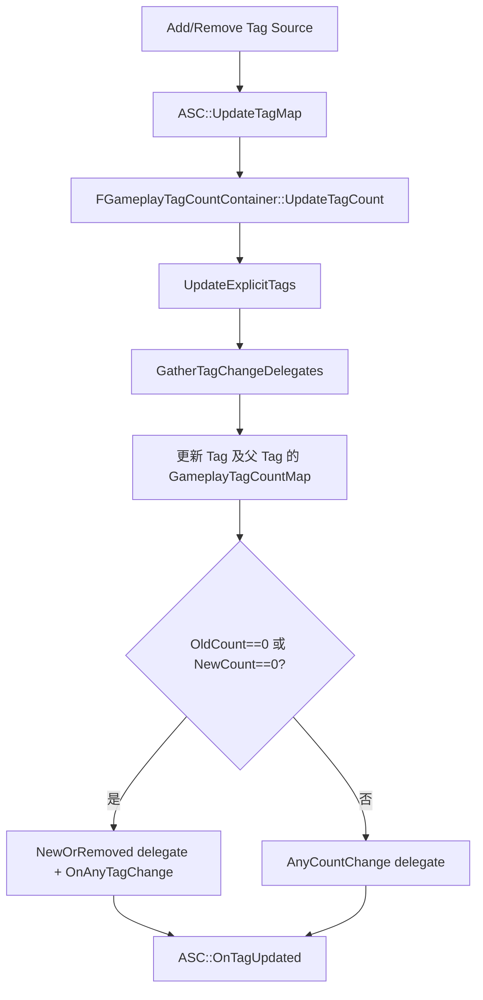
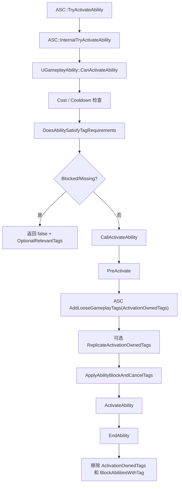
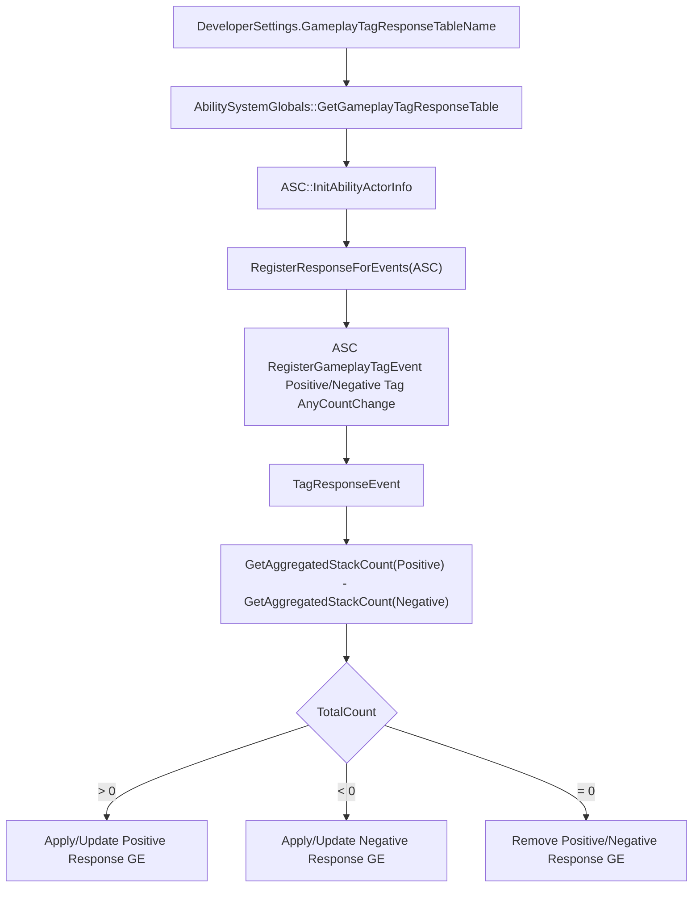

# GameplayTag / GameplayTagResponseTable / Ability Tag 条件体系（第十二轮）

本页整理 GameplayAbilities 模块侧的 GameplayTag 接入点：ASC tag count、Loose Tags、Replicated Loose Tags、GE Granted Tags、Ability tag 条件、GameplayTagResponseTable、AbilityTask/Blueprint/UI 监听、Cue/网络/编辑器衔接。这里只分析 GameplayAbilities 侧，不展开 GameplayTags 模块底层。

## 一、类定位

- GameplayTag 在 GAS 中既是状态标识，也是 Ability/GE/Cue/Task 之间的规则语言：ASC 通过 tag count 判断状态，Ability 用 tag 决定是否可激活、是否取消/阻塞其他 Ability，GE 用 tag 描述资产、授予目标状态与应用/移除要求，GameplayCue 用 `GameplayCue.*` tag 路由表现；源码路径：`Engine/Plugins/Runtime/GameplayAbilities/Source/GameplayAbilities/Public/AbilitySystemComponent.h:576`、`Engine/Plugins/Runtime/GameplayAbilities/Source/GameplayAbilities/Public/Abilities/GameplayAbility.h:757`、`Engine/Plugins/Runtime/GameplayAbilities/Source/GameplayAbilities/Public/GameplayEffect.h:2144`、`Engine/Plugins/Runtime/GameplayAbilities/Source/GameplayAbilities/Public/GameplayCue_Types.h:281`。
- ASC 的主 tag 账本是 `FGameplayTagCountContainer GameplayTagCountContainer`，查询接口 `HasMatchingGameplayTag` / `HasAllMatchingGameplayTags` / `HasAnyMatchingGameplayTags` 都转到该容器；源码路径：`Engine/Plugins/Runtime/GameplayAbilities/Source/GameplayAbilities/Public/AbilitySystemComponent.h:576`、`:581`、`:586`、`:1905`。
- `FGameplayTagCountContainer` 维护显式 tag、父 tag 展开后的层级计数、tag event delegate；`GetTagCount("A")` 会统计 `A.B`、`A.C` 这类子 tag 贡献，`GetExplicitTagCount("A")` 只统计精确加入的 `A`；源码路径：`Engine/Plugins/Runtime/GameplayAbilities/Source/GameplayAbilities/Public/GameplayEffectTypes.h:1210`、`:1228`、`:1301`、`:1304`、`:1311`。
- Loose GameplayTag 是不由 GE 支撑的手动 tag，`AddLooseGameplayTag` / `RemoveLooseGameplayTag` 直接更新 ASC tag map；源码注释明确默认不复制，需要调用方保证客户端/服务端一致；源码路径：`Engine/Plugins/Runtime/GameplayAbilities/Source/GameplayAbilities/Public/AbilitySystemComponent.h:649`、`:654`、`:664`。
- Replicated Loose GameplayTag 用 `FMinimalReplicationTagCountMap ReplicatedLooseTags` 复制，`AddReplicatedLooseGameplayTag` 等接口写入该 map；源码注释说明 replicated loose tags 会覆盖 simulated proxies 上本地设置的 tag counts；源码路径：`Engine/Plugins/Runtime/GameplayAbilities/Source/GameplayAbilities/Public/AbilitySystemComponent.h:690`、`:694`、`:1966`。
- GameplayEffect Granted Tags 是 GE 应用到目标后授予目标 ASC 的 tags，UE5.6 通过 `UTargetTagsGameplayEffectComponent` 配置并缓存到 `UGameplayEffect::CachedGrantedTags`，ActiveGE 添加/移除时加减 ASC tag map；源码路径：`Engine/Plugins/Runtime/GameplayAbilities/Source/GameplayAbilities/Public/GameplayEffect.h:2147`、`:2316`、`:2415`、`Engine/Plugins/Runtime/GameplayAbilities/Source/GameplayAbilities/Private/GameplayEffect.cpp:4373`、`:4670`。
- Ability Tags 在 UE5.6 中仍以 deprecated `AbilityTags` 字段暴露，注释说明运行时 AbilitySpec 会通过 Ability CDO 的 AssetTags 与 spec 的 DynamicAbilityTags 组合判断 Ability 拥有的 tags；源码路径：`Engine/Plugins/Runtime/GameplayAbilities/Source/GameplayAbilities/Public/Abilities/GameplayAbility.h:496`、`:541`、`:545`。
- Activation Required / Blocked Tags 是 Ability 激活前对激活者 ASC owned tags 的要求；Source / Target Required / Blocked Tags 是对传入 SourceTags / TargetTags 的要求；源码路径：`Engine/Plugins/Runtime/GameplayAbilities/Source/GameplayAbilities/Public/Abilities/GameplayAbility.h:769`、`:773`、`:777`、`:781`、`:785`、`:789`。
- `CancelAbilitiesWithTag` / `BlockAbilitiesWithTag` 是 Ability 激活时对其他 Ability 的取消和阻塞规则，最终由 ASC 的 `ApplyAbilityBlockAndCancelTags`、`CancelAbilities`、`BlockedAbilityTags` 实现；源码路径：`Engine/Plugins/Runtime/GameplayAbilities/Source/GameplayAbilities/Public/Abilities/GameplayAbility.h:757`、`:761`、`Engine/Plugins/Runtime/GameplayAbilities/Source/GameplayAbilities/Private/AbilitySystemComponent_Abilities.cpp:1410`、`:1423`、`:1433`。
- GameplayTagResponseTable 的实际类名是 `UGameplayTagReponseTable`，源码历史拼写为 `Reponse`，不是 `Response`；它是 `UDataAsset`，用于把 ASC 上的 tag count 变化映射为响应 GameplayEffect 的应用、移除或 level 更新；源码路径：`Engine/Plugins/Runtime/GameplayAbilities/Source/GameplayAbilities/Public/GameplayTagResponseTable.h:19`、`:41`、`:55`、`:62`。
- ResponseTable 由 `UAbilitySystemGlobals` 从 DeveloperSettings 的 `GameplayTagResponseTableName` 加载；ASC 在 `InitAbilityActorInfo` 路径中获取全局表并为自身注册 tag event；源码路径：`Engine/Plugins/Runtime/GameplayAbilities/Source/GameplayAbilities/Public/GameplayAbilitiesDeveloperSettings.h:102`、`:104`、`Engine/Plugins/Runtime/GameplayAbilities/Source/GameplayAbilities/Private/AbilitySystemGlobals.cpp:625`、`:630`、`Engine/Plugins/Runtime/GameplayAbilities/Source/GameplayAbilities/Private/AbilitySystemComponent_Abilities.cpp:186`。

## 二、核心类型分析

| 类型 | 定义位置 | 核心职责 | 创建/修改时机 | 是否复制 | 关系与业务接触 |
|---|---|---|---|---|---|
| `UGameplayTagReponseTable` | `Engine/Plugins/Runtime/GameplayAbilities/Source/GameplayAbilities/Public/GameplayTagResponseTable.h:62` | 数据资产，监听 ASC tag count 并应用/移除响应 GE | Globals 加载后，ASC `InitAbilityActorInfo` 注册；entries 在资产编辑时配置 | 资产本身不作为 ASC 运行时状态复制，响应结果通过 GE/ASC 复制 | 业务可配置资产；C++ 通常不直接实例化 |
| `FGameplayTagResponseTableEntry` | `Engine/Plugins/Runtime/GameplayAbilities/Source/GameplayAbilities/Public/GameplayTagResponseTable.h:41` | 一组 positive/negative response pair | ResponseTable entries 数组成员 | 否 | 设计侧配置正/负 tag 响应 |
| `FGameplayTagReponsePair` | `Engine/Plugins/Runtime/GameplayAbilities/Source/GameplayAbilities/Public/GameplayTagResponseTable.h:19` | 指定触发 tag、响应 GE 列表、SoftCountCap | Entry 的 Positive/Negative 字段 | 否 | 配置 tag count 到 GE 的映射 |
| `FGameplayTagCountContainer` | `Engine/Plugins/Runtime/GameplayAbilities/Source/GameplayAbilities/Public/GameplayEffectTypes.h:1043` | ASC owned tag count、显式 tag、父 tag 计数、delegate | Loose/GE/Ability/Minimal tags 更新时修改 | 自身不是 ASC UPROPERTY 复制对象；复制来源写回它 | ASC 内部核心账本；业务一般通过 ASC API |
| `FGameplayTagRequirements` | `Engine/Plugins/Runtime/GameplayAbilities/Source/GameplayAbilities/Public/GameplayEffectTypes.h:1426` | RequireTags / IgnoreTags / TagQuery 三类要求 | GE 组件、Cue 辅助、Modifier tag requirements 等配置时使用 | 作为包含结构随对应对象/Spec 处理，具体复制取决于外层 | GE/Modifier/Cue 条件配置常见 |
| `FGameplayTagContainer` | GameplayTags 模块类型；本轮不展开 | tag 集合 | Ability/GE/ASC/API 参数中广泛使用 | 取决于外层属性/RPC | GAS 规则配置的基础容器 |
| `FMinimalReplicationTagCountMap` | `Engine/Plugins/Runtime/GameplayAbilities/Source/GameplayAbilities/Public/GameplayEffectTypes.h:1583` | 用压缩 map 复制 tag count | MinimalReplicationTags / ReplicatedLooseTags 写入；NetSerialize 读取后更新 Owner ASC tag map | 是，具备 `NetSerialize` | 网络复制侧常见；业务通常通过 ASC API |
| `FGameplayAbilitySpec` | `Engine/Plugins/Runtime/GameplayAbilities/Source/GameplayAbilities/Public/GameplayAbilitySpec.h:25` | 授予 Ability 的运行时 spec，含 DynamicAbilityTags | GiveAbility 或运行时修改 spec | ActivatableAbilities 复制给 owner/replay；详见网络专题 | AbilityTags 判断会考虑 spec 动态 tag；本轮只聚焦 tag 接入 |
| `UGameplayAbility` | `Engine/Plugins/Runtime/GameplayAbilities/Source/GameplayAbilities/Public/Abilities/GameplayAbility.h:97` | Ability 资产/实例，持有激活 tag 条件与互斥规则 | 蓝图/C++ 配置，激活/结束时读写 ASC tag | Ability 自身复制策略另见第三/八轮 | 业务高频配置 AbilityTags、Required/Blocked/Owned/Cancel/Block |
| `UAbilitySystemComponent` | `Engine/Plugins/Runtime/GameplayAbilities/Source/GameplayAbilities/Public/AbilitySystemComponent.h:326` | 保存/查询/复制 tag count，路由 tag event | GE、Ability、Loose tag、复制更新时修改 | `ReplicatedLooseTags`、`MinimalReplicationTags` 等复制 | 业务通过它查询、监听、手动加减 tag |
| `UGameplayEffect` | `Engine/Plugins/Runtime/GameplayAbilities/Source/GameplayAbilities/Public/GameplayEffect.h:2071` | GE 资产，提供 Asset Tags、Granted Tags、tag requirements、Modifier tag requirements | GE 资产配置，Spec 可加 Dynamic Tags | GE/Spec/ActiveGE 复制规则见第四/八轮 | tag 驱动状态、cooldown、application/ongoing/removal |

## 三、ASC Tag 管理体系

| 成员/函数 | 定义位置 | 作用 | 是否复制 | 业务层建议 |
|---|---|---|---|---|
| `GameplayTagCountContainer` | `Engine/Plugins/Runtime/GameplayAbilities/Source/GameplayAbilities/Public/AbilitySystemComponent.h:1905` | 所有 owned tags 的主查询账本 | 不直接作为 UPROPERTY 复制；由 GE/ReplicatedLoose/Minimal 等来源更新 | 不直接改成员，使用 ASC API |
| `BlockedAbilityTags` | `Engine/Plugins/Runtime/GameplayAbilities/Source/GameplayAbilities/Public/AbilitySystemComponent.h:1891` | 阻止拥有匹配 AbilityTags 的 Ability 激活 | 非 UPROPERTY；由 Ability block tags 或 GE block tags 修改 | 通过 Ability/GE 配置或 ASC block API |
| `ReplicatedLooseTags` | `Engine/Plugins/Runtime/GameplayAbilities/Source/GameplayAbilities/Public/AbilitySystemComponent.h:1966` | replicated loose tags 容器 | `DOREPLIFETIME` 复制；源码路径：`Engine/Plugins/Runtime/GameplayAbilities/Source/GameplayAbilities/Private/AbilitySystemComponent.cpp:1642` | 需要手动状态复制时使用 |
| `MinimalReplicationTags` | `Engine/Plugins/Runtime/GameplayAbilities/Source/GameplayAbilities/Public/AbilitySystemComponent.h:1909` | Minimal replication mode 下代替 ActiveGE 复制 granted tags | `COND_SkipOwner` 复制；源码路径：`Engine/Plugins/Runtime/GameplayAbilities/Source/GameplayAbilities/Private/AbilitySystemComponent.cpp:1655`、`:1657` | 通常由 GE/Ability 内部维护 |
| `AddLooseGameplayTag(s)` | `Engine/Plugins/Runtime/GameplayAbilities/Source/GameplayAbilities/Public/AbilitySystemComponent.h:654`、`:659` | 本地加 loose tag count | 不复制 | 临时本地状态或服务端/客户端都手动加 |
| `RemoveLooseGameplayTag(s)` | `Engine/Plugins/Runtime/GameplayAbilities/Source/GameplayAbilities/Public/AbilitySystemComponent.h:664`、`:669` | 本地减 loose tag count | 不复制 | 注意 count 成对加减 |
| `SetLooseGameplayTagCount` | `Engine/Plugins/Runtime/GameplayAbilities/Source/GameplayAbilities/Public/AbilitySystemComponent.h:674` | 强设 tag count | 不复制 | 谨慎使用，容易覆盖多来源语义 |
| `AddReplicatedLooseGameplayTag(s)` | `Engine/Plugins/Runtime/GameplayAbilities/Source/GameplayAbilities/Public/AbilitySystemComponent.h:694`、`:699` | 添加 replicated loose tag | 复制 `ReplicatedLooseTags` | 服务端设置需要客户端看到的非 GE 状态 |
| `RemoveReplicatedLooseGameplayTag(s)` | `Engine/Plugins/Runtime/GameplayAbilities/Source/GameplayAbilities/Public/AbilitySystemComponent.h:704`、`:709` | 移除 replicated loose tag | 复制 `ReplicatedLooseTags` | 与添加成对调用 |
| `HasMatchingGameplayTag` | `Engine/Plugins/Runtime/GameplayAbilities/Source/GameplayAbilities/Public/AbilitySystemComponent.h:576` | 查询单个 tag 是否 count > 0 | 读本地 tag map | 业务常用 |
| `HasAllMatchingGameplayTags` | `Engine/Plugins/Runtime/GameplayAbilities/Source/GameplayAbilities/Public/AbilitySystemComponent.h:581` | 查询是否拥有全部 tag | 读本地 tag map | 业务常用 |
| `HasAnyMatchingGameplayTags` | `Engine/Plugins/Runtime/GameplayAbilities/Source/GameplayAbilities/Public/AbilitySystemComponent.h:586` | 查询是否拥有任意 tag | 读本地 tag map | 业务常用 |
| `GetOwnedGameplayTags` | `Engine/Plugins/Runtime/GameplayAbilities/Source/GameplayAbilities/Public/AbilitySystemComponent.h:591`、`:597` | 返回 explicit owned tags | 读本地 tag map | UI/逻辑可读，注意网络延迟 |
| `GetGameplayTagCount` | `Engine/Plugins/Runtime/GameplayAbilities/Source/GameplayAbilities/Public/AbilitySystemComponent.h:686`、`Engine/Plugins/Runtime/GameplayAbilities/Source/GameplayAbilities/Private/AbilitySystemComponent.cpp:690` | 返回 tag count；注释说明客户端可读但可能因网络延迟不最新 | 读本地 tag map | UI 可读但优先监听 event |
| `RegisterGameplayTagEvent` | `Engine/Plugins/Runtime/GameplayAbilities/Source/GameplayAbilities/Public/AbilitySystemComponent.h:743`、`Engine/Plugins/Runtime/GameplayAbilities/Source/GameplayAbilities/Private/AbilitySystemComponent.cpp:697` | 监听 tag 0/非0 或任意 count 变化 | delegate 不复制，本地触发 | UI/AbilityTask 常用 |
| `RegisterAndCallGameplayTagEvent` | `Engine/Plugins/Runtime/GameplayAbilities/Source/GameplayAbilities/Public/AbilitySystemComponent.h:749`、`Engine/Plugins/Runtime/GameplayAbilities/Source/GameplayAbilities/Private/AbilitySystemComponent.cpp:707` | 注册后若 count > 0 立即回调 | 本地触发 | UI 初始化状态常用 |

Loose Tags、Replicated Loose Tags、GE Granted Tags、Minimal Replication Tags 的区别：

- Loose Tags 直接写 `GameplayTagCountContainer`，不复制；源码路径：`Engine/Plugins/Runtime/GameplayAbilities/Source/GameplayAbilities/Public/AbilitySystemComponent.h:649`。
- Replicated Loose Tags 写 `ReplicatedLooseTags`，复制后由 `FMinimalReplicationTagCountMap::UpdateOwnerTagMap` 调用 Owner `SetTagMapCount`；源码路径：`Engine/Plugins/Runtime/GameplayAbilities/Source/GameplayAbilities/Private/GameplayEffectTypes.cpp:1447`、`:1480`。
- GE Granted Tags 在 ActiveGE 添加/移除时更新 `GameplayTagCountContainer`，Minimal 模式还同步 `MinimalReplicationTags`；源码路径：`Engine/Plugins/Runtime/GameplayAbilities/Source/GameplayAbilities/Private/GameplayEffect.cpp:4373`、`:4383`、`:4670`、`:4679`。
- Minimal Replication Tags 是 Minimal replication mode 下 GE 不完整复制时给客户端的 granted tag 补充；源码路径：`Engine/Plugins/Runtime/GameplayAbilities/Source/GameplayAbilities/Public/AbilitySystemComponent.h:719`。

## 四、GameplayTagCountContainer 机制



简化伪代码：

```cpp
void UpdateTag(FGameplayTag Tag, int32 Delta)
{
    if (!UpdateExplicitTags(Tag, Delta))
    {
        return;
    }

    for (FGameplayTag CurTag : Tag.GetGameplayTagParents())
    {
        OldCount = GameplayTagCountMap[CurTag];
        NewCount = Max(OldCount + Delta, 0);
        GameplayTagCountMap[CurTag] = NewCount;

        BroadcastAnyCountChange(CurTag, NewCount);
        if (OldCount == 0 || NewCount == 0)
        {
            BroadcastNewOrRemoved(CurTag, NewCount);
        }
    }
}
```

- Tag Count 是同一 tag 来自多来源的叠加计数；同一个状态可能来自多个 GE、Ability ActivationOwnedTags、Loose Tags 或 Replicated Loose Tags；源码路径：`Engine/Plugins/Runtime/GameplayAbilities/Source/GameplayAbilities/Public/GameplayEffectTypes.h:1119`、`:1150`、`:1188`。
- 0→1 或 1→0 是 “significant change”，会触发 `NewOrRemoved` delegate；1→2 或 2→1 不触发 `NewOrRemoved`，但触发 `AnyCountChange`；源码路径：`Engine/Plugins/Runtime/GameplayAbilities/Source/GameplayAbilities/Private/GameplayEffectTypes.cpp:582`、`:603`、`:597`。
- `Notify_StackCountChange` 用于 GE stack count 变化时广播 `AnyCountChange`，但源码注释说明它不会更新内部 tag count map，因为 map 统计的是给予 tag 的 GE/source 数量；源码路径：`Engine/Plugins/Runtime/GameplayAbilities/Source/GameplayAbilities/Private/GameplayEffectTypes.cpp:481`、`:483`、`:493`。
- Parent tag match 通过 `Tag.GetGameplayTagParents()` 同步更新父 tag count；`HasMatchingGameplayTag` 查询的是 `GameplayTagCountMap` 中传入 tag 的计数；源码路径：`Engine/Plugins/Runtime/GameplayAbilities/Source/GameplayAbilities/Private/GameplayEffectTypes.cpp:567`、`:574`、`Engine/Plugins/Runtime/GameplayAbilities/Source/GameplayAbilities/Public/GameplayEffectTypes.h:1055`。
- Exact match 由 `ExplicitTagCountMap` 与 `ExplicitTags` 表达，`GetExplicitTagCount` 不统计父 tag；源码路径：`Engine/Plugins/Runtime/GameplayAbilities/Source/GameplayAbilities/Public/GameplayEffectTypes.h:1228`、`:1236`、`:1304`、`:1311`。

## 五、Ability Tag 条件体系

| Tag 组 | 定义位置 | 激活检查 | 激活后影响 | 常见场景 | 常见错误 |
|---|---|---|---|---|---|
| `AbilityTags` / AssetTags | `Engine/Plugins/Runtime/GameplayAbilities/Source/GameplayAbilities/Public/Abilities/GameplayAbility.h:496` | 被 ASC `BlockedAbilityTags` 检查；也用于 cancel/block 匹配 | 本身不自动加到 ASC owned tags | 分类 Ability，例如 `Ability.Attack.Melee` | 当成状态 tag 使用 |
| `ActivationOwnedTags` | `Engine/Plugins/Runtime/GameplayAbilities/Source/GameplayAbilities/Public/Abilities/GameplayAbility.h:765` | 不作为激活前要求 | `PreActivate` 添加到 ASC loose tags，`EndAbility` 移除 | Ability active 期间的状态，如 `State.Casting` | 忘记 EndAbility 导致 tag 残留 |
| `ActivationRequiredTags` | `Engine/Plugins/Runtime/GameplayAbilities/Source/GameplayAbilities/Public/Abilities/GameplayAbility.h:769` | `DoesAbilitySatisfyTagRequirements` 要求 ASC owned tags 全部包含 | 无自动授予 | 必须在某状态下才能释放 | 和 `ActivationOwnedTags` 混淆 |
| `ActivationBlockedTags` | `Engine/Plugins/Runtime/GameplayAbilities/Source/GameplayAbilities/Public/Abilities/GameplayAbility.h:773` | ASC owned tags 有任意匹配则失败 | 无自动授予 | 沉默/眩晕/死亡阻止释放 | 配到 AbilityTags 类目导致永远不触发 |
| `SourceRequiredTags` | `Engine/Plugins/Runtime/GameplayAbilities/Source/GameplayAbilities/Public/Abilities/GameplayAbility.h:777` | 传入 SourceTags 必须满足 | 无自动授予 | 事件/TargetData 带 source 条件 | Source/Target 方向反 |
| `SourceBlockedTags` | `Engine/Plugins/Runtime/GameplayAbilities/Source/GameplayAbilities/Public/Abilities/GameplayAbility.h:781` | SourceTags 有任意匹配则失败 | 无自动授予 | 特定 source 状态禁止 | 以为检查目标 ASC |
| `TargetRequiredTags` | `Engine/Plugins/Runtime/GameplayAbilities/Source/GameplayAbilities/Public/Abilities/GameplayAbility.h:785` | 传入 TargetTags 必须满足 | 无自动授予 | 只对可攻击/可治疗目标触发 | 没传 TargetTags，检查不会执行 |
| `TargetBlockedTags` | `Engine/Plugins/Runtime/GameplayAbilities/Source/GameplayAbilities/Public/Abilities/GameplayAbility.h:789` | TargetTags 有任意匹配则失败 | 无自动授予 | 目标无敌/不可选中 | 和 GE TargetTagRequirements 混淆 |
| `CancelAbilitiesWithTag` | `Engine/Plugins/Runtime/GameplayAbilities/Source/GameplayAbilities/Public/Abilities/GameplayAbility.h:757` | 不影响自身 CanActivate | 激活时 ASC 调 `CancelAbilities` | 新技能打断旧技能 | 配太宽导致误取消 |
| `BlockAbilitiesWithTag` | `Engine/Plugins/Runtime/GameplayAbilities/Source/GameplayAbilities/Public/Abilities/GameplayAbility.h:761` | 不影响自身 CanActivate | 激活时写 `BlockedAbilityTags`，结束时移除 | 互斥技能、防止并发 | 互相锁死或 EndAbility 未清理 |

源码检查点：

- `DoesAbilitySatisfyTagRequirements` 先检查 Ability AssetTags 是否被 ASC `BlockedAbilityTags` 阻塞，再检查 Activation/Source/Target blocked 与 required tags，最后再次调用 `AreAbilityTagsBlocked(GetAssetTags())`；源码路径：`Engine/Plugins/Runtime/GameplayAbilities/Source/GameplayAbilities/Private/Abilities/GameplayAbility.cpp:373`、`:375`、`:378`、`:382`、`:386`、`:389`、`:393`、`:399`。
- Ability 失败相关 tags 会写入 `OptionalRelevantTags`，全局失败 tag 来自 `UAbilitySystemGlobals` / `UGameplayAbilitiesDeveloperSettings`；源码路径：`Engine/Plugins/Runtime/GameplayAbilities/Source/GameplayAbilities/Private/Abilities/GameplayAbility.cpp:333`、`:361`、`Engine/Plugins/Runtime/GameplayAbilities/Source/GameplayAbilities/Private/AbilitySystemGlobals.cpp:306`、`:345`。

## 六、Ability 激活中的 Tag 检查流程



简化伪代码：

```cpp
bool CanActivateAbility()
{
    CheckCooldown();
    CheckCost();
    DoesAbilitySatisfyTagRequirements(ASC, SourceTags, TargetTags);
}

void PreActivate()
{
    ASC.AddLooseGameplayTags(ActivationOwnedTags);
    if (Globals.ShouldReplicateActivationOwnedTags())
    {
        AddMinimalReplicationGameplayTags 或 AddReplicatedLooseGameplayTags;
    }
    ASC.ApplyAbilityBlockAndCancelTags(GetAssetTags(), this, true, BlockAbilitiesWithTag, true, CancelAbilitiesWithTag);
}

void EndAbility()
{
    ASC.RemoveLooseGameplayTags(ActivationOwnedTags);
    ASC.ApplyAbilityBlockAndCancelTags(GetAssetTags(), this, false, BlockAbilitiesWithTag, false, CancelAbilitiesWithTag);
}
```

- `CanActivateAbility` 调用 `DoesAbilitySatisfyTagRequirements`，失败时可记录 ActivateFailTagsBlocked/Missing；源码路径：`Engine/Plugins/Runtime/GameplayAbilities/Source/GameplayAbilities/Private/Abilities/GameplayAbility.cpp:424`、`:495`、`:497`。
- `PreActivate` 添加 `ActivationOwnedTags`，若 `ShouldReplicateActivationOwnedTags` 开启，则 LocalPredicted/ServerInitiated 走 MinimalReplicationTags，其他走 ReplicatedLooseTags；源码路径：`Engine/Plugins/Runtime/GameplayAbilities/Source/GameplayAbilities/Private/Abilities/GameplayAbility.cpp:963`、`:965`、`:967`、`:970`、`:974`。
- `PreActivate` 调用 `ApplyAbilityBlockAndCancelTags`，源码注释说明 Spec active count 在 block/cancel 之后增加，避免 Ability 完全激活前误取消自身；源码路径：`Engine/Plugins/Runtime/GameplayAbilities/Source/GameplayAbilities/Private/Abilities/GameplayAbility.cpp:985`、`:987`。
- `EndAbility` 移除 `ActivationOwnedTags`、清理 replicated/minimal tags、取消 block tags；源码路径：`Engine/Plugins/Runtime/GameplayAbilities/Source/GameplayAbilities/Private/Abilities/GameplayAbility.cpp:837`、`:839`、`:844`、`:848`、`:868`。

## 七、GameplayEffect Tag 体系

| GE Tag 类型 | 位置/组件 | 作用 | 运行时进入哪里 | 常见混淆 |
|---|---|---|---|---|
| Asset Tags | `UGameplayEffect::GetAssetTags` / `UAssetTagsGameplayEffectComponent`；源码路径：`Engine/Plugins/Runtime/GameplayAbilities/Source/GameplayAbilities/Public/GameplayEffect.h:2144`、`Engine/Plugins/Runtime/GameplayAbilities/Source/GameplayAbilities/Public/GameplayEffectComponents/AssetTagsGameplayEffectComponent.h:13` | 描述 GE 自身，用于查询/移除/条件 | `FGameplayEffectSpec::GetAllAssetTags` 合并 DynamicAssetTags；源码路径：`Engine/Plugins/Runtime/GameplayAbilities/Source/GameplayAbilities/Private/GameplayEffect.cpp:2191` | 不是授予目标的状态 |
| Granted Tags | `UGameplayEffect::GetGrantedTags` / `UTargetTagsGameplayEffectComponent`；源码路径：`Engine/Plugins/Runtime/GameplayAbilities/Source/GameplayAbilities/Public/GameplayEffect.h:2147`、`Engine/Plugins/Runtime/GameplayAbilities/Source/GameplayAbilities/Public/GameplayEffectComponents/TargetTagsGameplayEffectComponent.h:13` | GE 激活期间授予目标 ASC | ActiveGE add/remove 更新 tag map；源码路径：`Engine/Plugins/Runtime/GameplayAbilities/Source/GameplayAbilities/Private/GameplayEffect.cpp:4373`、`:4670` | 和 Asset Tags 混淆 |
| Dynamic Asset Tags | `FGameplayEffectSpec::AddDynamicAssetTag` / `AppendDynamicAssetTags`；源码路径：`Engine/Plugins/Runtime/GameplayAbilities/Source/GameplayAbilities/Public/GameplayEffect.h:1148`、`:1152` | Spec 级资产 tag，注入 captured source spec tags | `GetAllAssetTags` 合并；源码路径：`Engine/Plugins/Runtime/GameplayAbilities/Source/GameplayAbilities/Private/GameplayEffect.cpp:1875`、`:1883`、`:2193` | 加错到 Granted 导致查询/条件不生效 |
| Dynamic Granted Tags | `FGameplayEffectSpec::DynamicGrantedTags`；源码路径：`Engine/Plugins/Runtime/GameplayAbilities/Source/GameplayAbilities/Public/GameplayEffect.h:1209` | Spec 级授予目标 tag | `GetAllGrantedTags` 合并，ActiveGE add/remove 更新 ASC tag map；源码路径：`Engine/Plugins/Runtime/GameplayAbilities/Source/GameplayAbilities/Private/GameplayEffect.cpp:2174`、`:2176`、`:4374`、`:4671` | 加错到 Asset 导致状态不出现 |
| Application Requirements | `UTargetTagRequirementsGameplayEffectComponent::ApplicationTagRequirements`；源码路径：`Engine/Plugins/Runtime/GameplayAbilities/Source/GameplayAbilities/Public/GameplayEffectComponents/TargetTagRequirementsGameplayEffectComponent.h:49` | 应用前检查目标 tags | `CanGameplayEffectApply` 读取目标 owned tags；源码路径：`Engine/Plugins/Runtime/GameplayAbilities/Source/GameplayAbilities/Private/GameplayEffectComponents/TargetTagRequirementsGameplayEffectComponent.cpp:19`、`:24` | 以为应用后还能持续控制 |
| Ongoing Requirements | `UTargetTagRequirementsGameplayEffectComponent::OngoingTagRequirements`；源码路径：`Engine/Plugins/Runtime/GameplayAbilities/Source/GameplayAbilities/Public/GameplayEffectComponents/TargetTagRequirementsGameplayEffectComponent.h:53` | ActiveGE 存续期间根据目标 tag 打开/关闭效果 | 组件绑定 tag event 后检查；源码路径：`Engine/Plugins/Runtime/GameplayAbilities/Source/GameplayAbilities/Private/GameplayEffectComponents/TargetTagRequirementsGameplayEffectComponent.cpp:74`、`:91`、`:146` | Instant GE 上配置会被校验报错 |
| Removal Requirements | `UTargetTagRequirementsGameplayEffectComponent::RemovalTagRequirements`；源码路径：`Engine/Plugins/Runtime/GameplayAbilities/Source/GameplayAbilities/Public/GameplayEffectComponents/TargetTagRequirementsGameplayEffectComponent.h:57` | 目标 tag 满足时移除 ActiveGE | `HaveRemovalRequirementsBeenMet`；源码路径：`Engine/Plugins/Runtime/GameplayAbilities/Source/GameplayAbilities/Private/GameplayEffectComponents/TargetTagRequirementsGameplayEffectComponent.cpp:152`、`:156` | 预测移除行为受 cvar/authority 限制 |
| Modifier Source/Target Tags | `FGameplayModifierInfo::SourceTags/TargetTags`；源码路径：`Engine/Plugins/Runtime/GameplayAbilities/Source/GameplayAbilities/Public/GameplayEffect.h:567`、`:570` | 单个 Modifier 的 source/target tag 条件 | Modifier 评估时检查 captured tags；源码路径：`Engine/Plugins/Runtime/GameplayAbilities/Source/GameplayAbilities/Private/GameplayEffect.cpp:2971`、`:2976` | 和 GE 应用要求混淆 |
| Block Ability Tags Component | `UBlockAbilityTagsGameplayEffectComponent`；源码路径：`Engine/Plugins/Runtime/GameplayAbilities/Source/GameplayAbilities/Public/GameplayEffectComponents/BlockAbilityTagsGameplayEffectComponent.h:13`、`:51` | GE 激活时阻塞目标上匹配 AbilityTags 的 Ability | 写 `CachedBlockedAbilityTags`，由 ActiveGE 侧参与阻塞，具体路径本轮未完全展开 | 和 Ability 的 `BlockAbilitiesWithTag` 混淆 |

UE5.6 deprecated 字段关系：

- `InheritableGameplayEffectTags` 已 deprecated，改用 `UAssetTagsGameplayEffectComponent`；源码路径：`Engine/Plugins/Runtime/GameplayAbilities/Source/GameplayAbilities/Public/GameplayEffect.h:2311`、`Engine/Plugins/Runtime/GameplayAbilities/Source/GameplayAbilities/Private/GameplayEffect.cpp:545`。
- `InheritableOwnedTagsContainer` 已 deprecated，改用 `UTargetTagsGameplayEffectComponent`；源码路径：`Engine/Plugins/Runtime/GameplayAbilities/Source/GameplayAbilities/Public/GameplayEffect.h:2316`、`Engine/Plugins/Runtime/GameplayAbilities/Source/GameplayAbilities/Private/GameplayEffect.cpp:627`。
- `OngoingTagRequirements` / `ApplicationTagRequirements` / `RemovalTagRequirements` 已 deprecated，改用 `UTargetTagRequirementsGameplayEffectComponent`；源码路径：`Engine/Plugins/Runtime/GameplayAbilities/Source/GameplayAbilities/Public/GameplayEffect.h:2326`、`:2331`、`:2337`、`Engine/Plugins/Runtime/GameplayAbilities/Source/GameplayAbilities/Private/GameplayEffect.cpp:762`、`:769`。

## 八、GameplayTagResponseTable



简化伪代码：

```cpp
void RegisterResponseForEvents(ASC)
{
    for (Entry : Entries)
    {
        ASC.RegisterGameplayTagEvent(Entry.Positive.Tag, AnyCountChange).AddUObject(TagResponseEvent);
        ASC.RegisterGameplayTagEvent(Entry.Negative.Tag, AnyCountChange).AddUObject(TagResponseEvent);
    }
}

void TagResponseEvent(Tag, NewCount, ASC, EntryIndex)
{
    Positive = ASC.GetAggregatedStackCount(Query(Positive.Tag));
    Negative = ASC.GetAggregatedStackCount(Query(Negative.Tag));
    TotalCount = Positive - Negative;

    if (TotalCount > 0) ApplyOrSetLevel(Positive.ResponseGameplayEffects, TotalCount);
    else if (TotalCount < 0) ApplyOrSetLevel(Negative.ResponseGameplayEffects, TotalCount);
    else RemoveBoth();
}
```

- 文件名是 `GameplayTagResponseTable.*`，但核心类与 pair 类型实际拼写是 `UGameplayTagReponseTable` / `FGameplayTagReponsePair`；源码路径：`Engine/Plugins/Runtime/GameplayAbilities/Source/GameplayAbilities/Public/GameplayTagResponseTable.h:19`、`:62`。
- 每个 entry 只有一个 Positive pair 和一个 Negative pair；pair 保存触发 tag、响应 GE 数组和 `SoftCountCap`；源码路径：`Engine/Plugins/Runtime/GameplayAbilities/Source/GameplayAbilities/Public/GameplayTagResponseTable.h:23`、`:31`、`:35`、`:45`、`:49`。
- `PostLoad` 会把 deprecated 单个 `ResponseGameplayEffect` 迁移到 `ResponseGameplayEffects` 数组；源码路径：`Engine/Plugins/Runtime/GameplayAbilities/Source/GameplayAbilities/Private/GameplayTagResponseTable.cpp:29`、`:36`、`:38`、`:43`。
- 注册时使用 `EGameplayTagEventType::AnyCountChange`，说明 stack/count 变化也会重新计算响应强度；源码路径：`Engine/Plugins/Runtime/GameplayAbilities/Source/GameplayAbilities/Private/GameplayTagResponseTable.cpp:66`、`:70`。
- 计算 count 时不是直接读 ASC tag count，而是 `ASC->GetAggregatedStackCount(MakeQuery(Pair.Tag))`，并按 `SoftCountCap` 截断；源码路径：`Engine/Plugins/Runtime/GameplayAbilities/Source/GameplayAbilities/Private/GameplayTagResponseTable.cpp:137`、`:142`、`:143`。
- 正/负响应 GE 已存在时不会重应用，而是用 `SetActiveGameplayEffectLevel(Handle, TotalCount)` 更新等级；没有 handle 时用 `ApplyGameplayEffectToSelf` 应用响应 GE，level 参数就是 TotalCount；源码路径：`Engine/Plugins/Runtime/GameplayAbilities/Source/GameplayAbilities/Private/GameplayTagResponseTable.cpp:169`、`:174`、`:181`。
- 响应 GE 的 Source/Target ASC 都是同一个 ASC：`ApplyGameplayEffectToSelf(..., ASC->MakeEffectContext())`；源码路径：`Engine/Plugins/Runtime/GameplayAbilities/Source/GameplayAbilities/Private/GameplayTagResponseTable.cpp:181`。
- ResponseTable 是否支持复杂 stacking：源码只确认它维护每个 entry 的 response handles，并通过 GE level 更新表达 count；响应 GE 自身 stacking 策略会按普通 GE 规则生效，完整组合未展开，未确认；源码路径：`Engine/Plugins/Runtime/GameplayAbilities/Source/GameplayAbilities/Public/GameplayTagResponseTable.h:92`、`:98`、`Engine/Plugins/Runtime/GameplayAbilities/Source/GameplayAbilities/Private/GameplayTagResponseTable.cpp:165`。

## 九、GameplayTagResponseTable 与 GameplayEffect 的关系

- ResponseTable 通过 GameplayEffect 表达响应：positive/negative pair 各自保存 `ResponseGameplayEffects`，tag count 变化后对同一个 ASC 应用或移除这些 GE；源码路径：`Engine/Plugins/Runtime/GameplayAbilities/Source/GameplayAbilities/Public/GameplayTagResponseTable.h:31`、`Engine/Plugins/Runtime/GameplayAbilities/Source/GameplayAbilities/Private/GameplayTagResponseTable.cpp:120`、`:128`、`:152`、`:181`。
- Tag 满足为正数时移除 negative GE 并应用/更新 positive GE；为负数时移除 positive GE 并应用/更新 negative GE；为 0 时两边都移除；源码路径：`Engine/Plugins/Runtime/GameplayAbilities/Source/GameplayAbilities/Private/GameplayTagResponseTable.cpp:120`、`:122`、`:123`、`:127`、`:128`、`:132`、`:133`。
- ResponseTable 会缓存每个 ASC/Entry 的 ActiveGE handles，用于后续 level 更新或移除；源码路径：`Engine/Plugins/Runtime/GameplayAbilities/Source/GameplayAbilities/Public/GameplayTagResponseTable.h:92`、`:98`。
- Response GE 也可能授予 tags，若授予的 tag 又影响同一个 ResponseTable entry，存在循环触发风险；这是开发实践推断，源码依据是 ResponseTable 监听 ASC tag event 且响应 GE 会通过普通 GE granted tags 更新 ASC tag map；源码路径：`Engine/Plugins/Runtime/GameplayAbilities/Source/GameplayAbilities/Private/GameplayTagResponseTable.cpp:66`、`:181`、`Engine/Plugins/Runtime/GameplayAbilities/Source/GameplayAbilities/Private/GameplayEffect.cpp:4373`。
- 避免循环的实践建议：响应 GE 的 Granted Tags 不要包含触发 ResponseTable 的 positive/negative tags；或者把触发 tag 和结果 tag 分层命名；开发实践推断，源码只确认循环风险所需机制均存在。

## 十、Tag 与 AbilityTask 的关系

| Task | 定义/实现位置 | 绑定方式 | 适合用途 | 与 ResponseTable 区别 |
|---|---|---|---|---|
| `UAbilityTask_WaitGameplayTagBase` | `Engine/Plugins/Runtime/GameplayAbilities/Source/GameplayAbilities/Public/Abilities/Tasks/AbilityTask_WaitGameplayTagBase.h:15` | `RegisterGameplayTagEvent(Tag)`，销毁时解绑；源码路径：`Engine/Plugins/Runtime/GameplayAbilities/Source/GameplayAbilities/Private/Abilities/Tasks/AbilityTask_WaitGameplayTagBase.cpp:17`、`:31` | Ability 内等待 tag 状态变化 | 只广播任务 delegate，不自动应用 GE |
| `UAbilityTask_WaitGameplayTagAdded` | `Engine/Plugins/Runtime/GameplayAbilities/Source/GameplayAbilities/Public/Abilities/Tasks/AbilityTask_WaitGameplayTag.h:15` | 继承 base，tag added 时触发；源码路径：`Engine/Plugins/Runtime/GameplayAbilities/Source/GameplayAbilities/Private/Abilities/Tasks/AbilityTask_WaitGameplayTag.cpp:45` | 等待进入状态 | 生命周期跟 Ability |
| `UAbilityTask_WaitGameplayTagRemoved` | `Engine/Plugins/Runtime/GameplayAbilities/Source/GameplayAbilities/Public/Abilities/Tasks/AbilityTask_WaitGameplayTag.h:35` | 继承 base，tag removed 时触发；源码路径：`Engine/Plugins/Runtime/GameplayAbilities/Source/GameplayAbilities/Private/Abilities/Tasks/AbilityTask_WaitGameplayTag.cpp:97` | 等待状态结束 | 不维护响应 GE handle |
| `UAbilityTask_WaitGameplayTagCountChanged` | `Engine/Plugins/Runtime/GameplayAbilities/Source/GameplayAbilities/Public/Abilities/Tasks/AbilityTask_WaitGameplayTagCountChanged.h:13` | `RegisterGameplayTagEvent(Tag, AnyCountChange)`；源码路径：`Engine/Plugins/Runtime/GameplayAbilities/Source/GameplayAbilities/Private/Abilities/Tasks/AbilityTask_WaitGameplayTagCountChanged.cpp:24`、`:31` | 监听 stack/count 变化 | 不自动做正负抵消 |
| `UAbilityTask_WaitGameplayTagQuery` | `Engine/Plugins/Runtime/GameplayAbilities/Source/GameplayAbilities/Public/Abilities/Tasks/AbilityTask_WaitGameplayTagQuery.h:22` | 监听 query 涉及 tags，满足/不满足时广播；具体实现本轮未完全展开，未确认 | 复杂状态组合监听 | ResponseTable 是全局数据驱动响应，不是单 Ability task |

开发实践推断：AbilityTask 更适合 Ability 内部等待、UI 状态流或短期异步流程；ResponseTable 更适合全局、数据驱动、tag count 到 GE 的稳定映射。源码依据是 Task 绑定 Ability 生命周期，ResponseTable 注册到每个 ASC 并缓存 response GE handles；源码路径：`Engine/Plugins/Runtime/GameplayAbilities/Source/GameplayAbilities/Private/Abilities/Tasks/AbilityTask_WaitGameplayTagBase.cpp:17`、`Engine/Plugins/Runtime/GameplayAbilities/Source/GameplayAbilities/Public/GameplayTagResponseTable.h:98`。

## 十一、Tag 与 GameplayCue 的关系

- GameplayCueTag 也是 GameplayTag，`FGameplayCueParameters` 保存 `MatchedTagName` / `OriginalTag`，CueManager/CueSet 用 tag 查找 notify；源码路径：`Engine/Plugins/Runtime/GameplayAbilities/Source/GameplayAbilities/Public/GameplayCue_Types.h:281`、`:284`、`Engine/Plugins/Runtime/GameplayAbilities/Source/GameplayAbilities/Public/GameplayCueSet.h:18`。
- GameplayCue tag 通常位于 `GameplayCue` 根命名空间；编辑器 K2 Cue 节点从 `GameplayCue` 根 tag 的子 tag 生成菜单；源码路径：`Engine/Plugins/Runtime/GameplayAbilities/Source/GameplayAbilitiesEditor/Private/K2Node_GameplayCueEvent.cpp:84`、`:87`、`:94`。
- GE 的 GameplayCues 与 GE Granted Tags 是两套配置：GameplayCues 触发表现，Granted Tags 改变 ASC 状态；源码路径：`Engine/Plugins/Runtime/GameplayAbilities/Source/GameplayAbilities/Public/GameplayEffect.h:2147`、`:2299`。
- 开发实践推断：GameplayCueTag 不应作为状态判断依据，状态判断应看 ASC owned tags；源码依据是 Cue tag 用于路由表现，而 ASC owned tags 由 `GameplayTagCountContainer` 查询；源码路径：`Engine/Plugins/Runtime/GameplayAbilities/Source/GameplayAbilities/Public/GameplayCueSet.h:18`、`Engine/Plugins/Runtime/GameplayAbilities/Source/GameplayAbilities/Public/AbilitySystemComponent.h:597`。
- 状态 tag 可以触发 GameplayCue 的方式通常是通过 GE 同时配置 Granted Tags 和 GameplayCues，或者业务在 tag event 中触发表现；后者是开发实践推断，源码确认 ASC 能监听 tag event、Ability/ASC 能触发 cue；源码路径：`Engine/Plugins/Runtime/GameplayAbilities/Source/GameplayAbilities/Public/AbilitySystemComponent.h:743`、`:924`。

## 十二、Tag 与网络复制

- Loose Tags 不复制；源码路径：`Engine/Plugins/Runtime/GameplayAbilities/Source/GameplayAbilities/Public/AbilitySystemComponent.h:649`。
- Replicated Loose Tags 复制 `ReplicatedLooseTags`，并在客户端更新 Owner ASC tag map；源码路径：`Engine/Plugins/Runtime/GameplayAbilities/Source/GameplayAbilities/Private/AbilitySystemComponent.cpp:1642`、`Engine/Plugins/Runtime/GameplayAbilities/Source/GameplayAbilities/Private/GameplayEffectTypes.cpp:1447`、`:1480`。
- MinimalReplicationTags 在 `COND_SkipOwner` 条件下复制，用于 Minimal replication mode 下补充 GE granted tags；源码路径：`Engine/Plugins/Runtime/GameplayAbilities/Source/GameplayAbilities/Private/AbilitySystemComponent.cpp:1655`、`:1657`、`Engine/Plugins/Runtime/GameplayAbilities/Source/GameplayAbilities/Public/AbilitySystemComponent.h:719`。
- GE Granted Tags 在 Full/Mixed 下可随 ActiveGE 状态间接表现，在 Minimal 下 GE 不完整复制但 tags 会通过 MinimalReplicationTags 复制；源码路径：`Engine/Plugins/Runtime/GameplayAbilities/Source/GameplayAbilities/Private/GameplayEffect.cpp:4373`、`:4383`。
- ActivationOwnedTags 默认是 loose tags；如果 `ShouldReplicateActivationOwnedTags` 开启，LocalPredicted/ServerInitiated 走 MinimalReplicationTags，其他走 ReplicatedLooseTags；源码路径：`Engine/Plugins/Runtime/GameplayAbilities/Source/GameplayAbilities/Private/Abilities/GameplayAbility.cpp:963`、`:965`、`:970`、`:974`。
- Tag count delegate 在客户端何时触发取决于本地预测、本地 loose tag 操作或复制到达后 `SetTagMapCount` 更新；复制延迟会让客户端 `GetGameplayTagCount` 不是服务器最新值；源码路径：`Engine/Plugins/Runtime/GameplayAbilities/Source/GameplayAbilities/Private/AbilitySystemComponent.cpp:690`、`:692`、`Engine/Plugins/Runtime/GameplayAbilities/Source/GameplayAbilities/Private/GameplayEffectTypes.cpp:1473`、`:1480`。
- 预测场景下 tag 可能先本地变化再由服务器确认/纠正；完整回滚路径本轮未展开，未确认；源码依据是 LocalPredicted Ability 会本地添加 ActivationOwnedTags，GE 预测/复制另见第八轮；源码路径：`Engine/Plugins/Runtime/GameplayAbilities/Source/GameplayAbilities/Private/Abilities/GameplayAbility.cpp:963`。

## 十三、Tag 与蓝图辅助 API

- `UAbilitySystemBlueprintLibrary` 提供 `BindEventWrapperToGameplayTagChanged`、`BindEventWrapperToAnyOfGameplayTagsChanged`、`BindEventWrapperToAnyOfGameplayTagContainerChanged`，本质是对 ASC `RegisterGameplayTagEvent` 的蓝图 wrapper；源码路径：`Engine/Plugins/Runtime/GameplayAbilities/Source/GameplayAbilities/Public/AbilitySystemBlueprintLibrary.h:99`、`:117`、`:135`、`Engine/Plugins/Runtime/GameplayAbilities/Source/GameplayAbilities/Private/AbilitySystemBlueprintLibrary.cpp:165`。
- wrapper 可在绑定时立即执行已有 tag count；源码路径：`Engine/Plugins/Runtime/GameplayAbilities/Source/GameplayAbilities/Private/AbilitySystemBlueprintLibrary.cpp:175`、`:179`、`:182`。
- 蓝图库有 `AddLooseGameplayTags` / `RemoveLooseGameplayTags`，`bShouldReplicate` 为 true 时同时调用 replicated loose tag API；源码路径：`Engine/Plugins/Runtime/GameplayAbilities/Source/GameplayAbilities/Public/AbilitySystemBlueprintLibrary.h:478`、`:482`、`Engine/Plugins/Runtime/GameplayAbilities/Source/GameplayAbilities/Private/AbilitySystemBlueprintLibrary.cpp:1314`、`:1318`、`:1331`、`:1335`。
- 蓝图库可对 Spec 添加 Dynamic Granted Tags / Dynamic Asset Tags；源码路径：`Engine/Plugins/Runtime/GameplayAbilities/Source/GameplayAbilities/Public/AbilitySystemBlueprintLibrary.h:433`、`:439`、`:441`、`:447`、`Engine/Plugins/Runtime/GameplayAbilities/Source/GameplayAbilities/Private/AbilitySystemBlueprintLibrary.cpp:1039`、`:1054`、`:1069`、`:1084`。
- SetByCaller 有 Name 和 GameplayTag 两个入口；GameplayTag 版本使用 `GameplayTagFilter = "SetByCaller"`；源码路径：`Engine/Plugins/Runtime/GameplayAbilities/Source/GameplayAbilities/Public/AbilitySystemBlueprintLibrary.h:423`、`:426`、`:427`。
- 蓝图库提供 `GetGameplayEffectAssetTags` / `GetGameplayEffectGrantedTags` 读取 GE CDO tags；源码路径：`Engine/Plugins/Runtime/GameplayAbilities/Source/GameplayAbilities/Public/AbilitySystemBlueprintLibrary.h:552`、`:556`、`Engine/Plugins/Runtime/GameplayAbilities/Source/GameplayAbilities/Private/AbilitySystemBlueprintLibrary.cpp:1389`、`:1400`。

## 十四、编辑器侧 Tag 配置

- Ability tag 字段通过 `UPROPERTY` meta Categories 暴露不同 tag 类目，例如 AbilityTags 使用 `AbilityTagCategory`，ActivationOwnedTags 使用 `OwnedTagsCategory`；源码路径：`Engine/Plugins/Runtime/GameplayAbilities/Source/GameplayAbilities/Public/Abilities/GameplayAbility.h:498`、`:758`、`:762`、`:766`、`:770`、`:774`。
- GE Asset/Granted/Requirements 在 UE5.6 主要通过 GEComponents 配置；deprecated 字段保留迁移逻辑；源码路径：`Engine/Plugins/Runtime/GameplayAbilities/Source/GameplayAbilities/Private/GameplayEffect.cpp:545`、`:627`、`:762`、`:769`。
- `UTargetTagRequirementsGameplayEffectComponent::IsDataValid` 至少会检查 Instant GE 配置 OngoingTagRequirements 的错误；源码路径：`Engine/Plugins/Runtime/GameplayAbilities/Source/GameplayAbilities/Private/GameplayEffectComponents/TargetTagRequirementsGameplayEffectComponent.cpp:165`、`:170`。
- 当前第十轮扫描未确认存在独立 `FGameplayTagRequirementsDetails`；GameplayTagRequirements 的专门 details customization 未确认。
- GameplayTagResponseTable 是 DataAsset，DeveloperSettings 用 `AllowedClasses="/Script/GameplayAbilities.GameplayTagReponseTable"` 限定配置项；是否有专门编辑器 UI 本轮未确认；源码路径：`Engine/Plugins/Runtime/GameplayAbilities/Source/GameplayAbilities/Public/GameplayAbilitiesDeveloperSettings.h:103`。
- Ability Audit 是否检查 tag 相关问题，本轮未展开，未确认；第十轮只确认实际类型 `FGameplayAbilityAuditRow` 存在；源码路径：`Engine/Plugins/Runtime/GameplayAbilities/Source/GameplayAbilitiesEditor/Public/GameplayAbilityAudit.h:46`。

## 十五、GameplayTag 设计实践速查

- 用 `AbilityTags` 表达“这个 Ability 是什么”，用于取消、阻塞、查询和分类；不要把它当作角色当前状态；源码路径：`Engine/Plugins/Runtime/GameplayAbilities/Source/GameplayAbilities/Public/Abilities/GameplayAbility.h:496`。
- 用 `ActivationOwnedTags` 表达“Ability 激活期间角色临时拥有什么状态”；源码路径：`Engine/Plugins/Runtime/GameplayAbilities/Source/GameplayAbilities/Public/Abilities/GameplayAbility.h:765`、`Engine/Plugins/Runtime/GameplayAbilities/Source/GameplayAbilities/Private/Abilities/GameplayAbility.cpp:963`。
- 用 `ActivationRequiredTags` / `ActivationBlockedTags` 表达释放前对自身 ASC 状态的要求；源码路径：`Engine/Plugins/Runtime/GameplayAbilities/Source/GameplayAbilities/Public/Abilities/GameplayAbility.h:769`、`:773`。
- 用 `CancelAbilitiesWithTag` / `BlockAbilitiesWithTag` 表达 Ability 之间的互斥与打断；源码路径：`Engine/Plugins/Runtime/GameplayAbilities/Source/GameplayAbilities/Public/Abilities/GameplayAbility.h:757`、`:761`。
- 用 GE Granted Tags 表达由 buff/debuff/cooldown/状态效果授予的持续状态；源码路径：`Engine/Plugins/Runtime/GameplayAbilities/Source/GameplayAbilities/Public/GameplayEffect.h:2147`。
- 用 Loose Tags 表达不值得建 GE、且不需要自动复制的临时状态；需要网络同步时改用 Replicated Loose Tags；源码路径：`Engine/Plugins/Runtime/GameplayAbilities/Source/GameplayAbilities/Public/AbilitySystemComponent.h:649`、`:690`。
- 用 GameplayTagResponseTable 表达“某些 tag count 增减自动转成 GE 响应”的全局规则，例如 haste/slow 正负抵消；源码路径：`Engine/Plugins/Runtime/GameplayAbilities/Source/GameplayAbilities/Public/GameplayTagResponseTable.h:55`。
- 用 WaitGameplayTag AbilityTask 表达单个 Ability 生命周期内等待状态变化；源码路径：`Engine/Plugins/Runtime/GameplayAbilities/Source/GameplayAbilities/Public/Abilities/Tasks/AbilityTask_WaitGameplayTagBase.h:15`。
- 用 GameplayCueTag 表达表现路由，不建议作为核心状态；开发实践推断，源码依据见第十一节。
- 命名建议为开发实践推断：区分 `Ability.*`（行为分类）、`State.*`（角色状态）、`Status.*`（buff/debuff）、`Cooldown.*`（冷却）、`GameplayCue.*`（表现），避免把一类 tag 复用到另一类语义。

## 十六、未确认项

- `UGameplayTagReponseTable` 是否有专门编辑器 details customization，本轮未确认。
- `UBlockAbilityTagsGameplayEffectComponent` 在 ActiveGE add/remove 时具体如何把 `CachedBlockedAbilityTags` 接入 ASC `BlockedAbilityTags` 的完整调用链，本轮未完全展开，未确认。
- `UAbilityTask_WaitGameplayTagQuery` 的完整内部实现本轮未逐行展开，未确认。
- GameplayTagResponseTable 响应 GE 与 GE stacking policy 的全部组合行为，本轮未完整展开，未确认。
- 预测失败后 tag 变化的完整回滚路径，本轮未展开，未确认。
