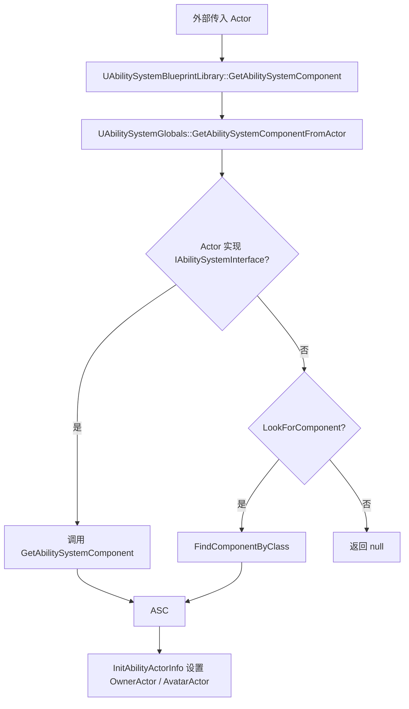
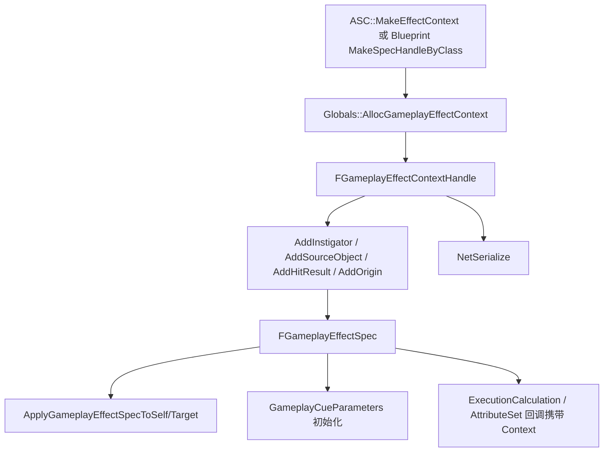
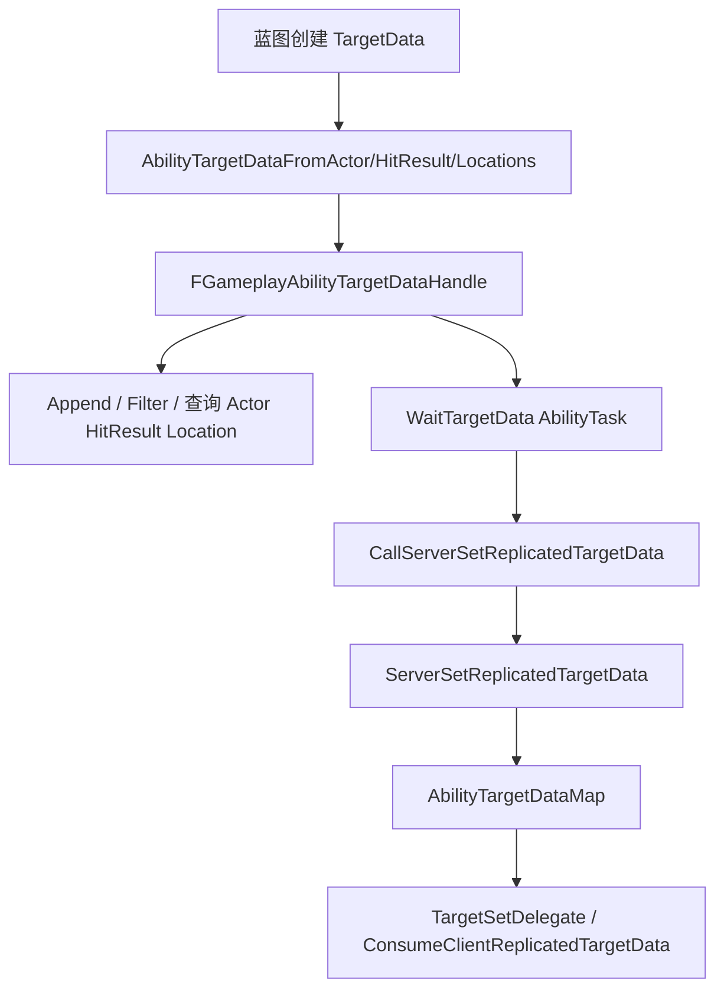

# GAS 全局入口与蓝图辅助 API（第九轮）

本轮基于 `UAbilitySystemGlobals`、`UAbilitySystemBlueprintLibrary`、`IAbilitySystemInterface` 分析 GAS 的全局入口、蓝图辅助函数、ASC 查找、EffectContext / TargetData / GameplayCueParameters / GameplayEffectSpec 辅助 API。只更新 Skill 文档，不修改 `Engine/` 源码。

## 一、类定位

- `UAbilitySystemGlobals` 是 GameplayAbilities 模块的全局配置、初始化与工厂入口；它是 `UObject` 子类，声明为 `UCLASS(config = Game, MinimalAPI)`，并通过 `UAbilitySystemGlobals::Get()` 从 `IGameplayAbilitiesModule` 取模块级单例；源码路径：`Engine/Plugins/Runtime/GameplayAbilities/Source/GameplayAbilities/Public/AbilitySystemGlobals.h:45`、`:52`。
- `UAbilitySystemGlobals` 负责初始化全局曲线表、Attribute 默认表、GameplayCueManager、GameplayTagResponseTable、全局失败 tag、TargetData / EffectContext 序列化 struct cache；源码路径：`Engine/Plugins/Runtime/GameplayAbilities/Source/GameplayAbilities/Private/AbilitySystemGlobals.cpp:64`、`:76`、`:77`、`:79`、`:80`、`:82`、`:83`、`:84`、`:87`。
- `UAbilitySystemBlueprintLibrary` 是 `UBlueprintFunctionLibrary`，Blueprint script name 为 `AbilitySystemLibrary`，把 ASC 获取、GameplayEvent、Attribute 查询、TargetData、EffectContext、GameplayCueParameters、GameplayEffectSpec handle 等常用操作暴露给蓝图；源码路径：`Engine/Plugins/Runtime/GameplayAbilities/Source/GameplayAbilities/Public/AbilitySystemBlueprintLibrary.h:68`、`:69`。
- `IAbilitySystemInterface` 是 C++ 接口，要求实现 `GetAbilitySystemComponent() const`；接口注释明确 ASC 可以在另一个 Actor 上，例如 Pawn 使用 PlayerState 的 ASC；源码路径：`Engine/Plugins/Runtime/GameplayAbilities/Source/GameplayAbilities/Public/AbilitySystemInterface.h:15`、`:21`、`:25`、`:26`。
- 这三者和 ASC 的关系是：`IAbilitySystemInterface` 让 Actor 暴露“应该使用哪个 ASC”，`UAbilitySystemGlobals::GetAbilitySystemComponentFromActor` 统一查找，`UAbilitySystemBlueprintLibrary::GetAbilitySystemComponent` 在蓝图侧调用这个全局查找；源码路径：`Engine/Plugins/Runtime/GameplayAbilities/Source/GameplayAbilities/Private/AbilitySystemGlobals.cpp:233`、`:240`、`:243`、`Engine/Plugins/Runtime/GameplayAbilities/Source/GameplayAbilities/Private/AbilitySystemBlueprintLibrary.cpp:77`。
- 它们和 GameplayEffect / TargetData / GameplayCue / GameplayTag 的关系是：Globals 分配 EffectContext、初始化 TargetData/EffectContext 序列化缓存、创建/获取 GameplayCueManager、初始化全局失败 tag；BlueprintLibrary 则操作 SpecHandle、SetByCaller、Dynamic Tags、EffectContext、TargetData 和 GameplayCueParameters；源码路径：`Engine/Plugins/Runtime/GameplayAbilities/Source/GameplayAbilities/Private/AbilitySystemGlobals.cpp:227`、`:370`、`:576`、`:306`、`Engine/Plugins/Runtime/GameplayAbilities/Source/GameplayAbilities/Private/AbilitySystemBlueprintLibrary.cpp:985`、`:1004`、`:1034`、`:1064`、`:730`、`:374`、`:939`。
- 开发实践推断：`UAbilitySystemGlobals` 更像项目级 GAS 配置入口，`IAbilitySystemInterface` 是项目对象到 ASC 的统一桥，`UAbilitySystemBlueprintLibrary` 是蓝图与 GAS 数据结构之间的工具层，不应承载项目权限校验或权威战斗逻辑；源码依据是蓝图库函数大多直接转发到 ASC、句柄、参数或容器操作；源码路径：`Engine/Plugins/Runtime/GameplayAbilities/Source/GameplayAbilities/Private/AbilitySystemBlueprintLibrary.cpp:77`、`:82`、`:985`、`:1310`。

## 二、AbilitySystemGlobals 分析

- 全局访问方式：`UAbilitySystemGlobals::Get()` 返回 `IGameplayAbilitiesModule::Get().GetAbilitySystemGlobals()`；模块在首次访问时根据 `UGameplayAbilitiesDeveloperSettings::AbilitySystemGlobalsClassName` 创建单例、`AddToRoot` 并调用 `InitGlobalData`；源码路径：`Engine/Plugins/Runtime/GameplayAbilities/Source/GameplayAbilities/Public/AbilitySystemGlobals.h:52`、`:54`、`Engine/Plugins/Runtime/GameplayAbilities/Source/GameplayAbilities/Private/GameplayAbilitiesModule.cpp:24`、`:31`、`:36`、`:38`。
- 初始化流程：`InitGlobalData` 有防重复保护，UE5.3+ 注释说明会自动调用；随后加载全局 curve/attribute metadata/defaults、GameplayCueManager、GameplayTagResponseTable、global tags、TargetData script struct cache，并注册地图加载 / PIE 回调；源码路径：`Engine/Plugins/Runtime/GameplayAbilities/Source/GameplayAbilities/Private/AbilitySystemGlobals.cpp:64`、`:66`、`:72`、`:76`、`:87`、`:90`、`:96`。
- 全局配置项主要在 `UGameplayAbilitiesDeveloperSettings`，包括 `AbilitySystemGlobalsClassName`、全局 Attribute 表、GameplayCueManager class/name、GameplayCueNotifyPaths、GlobalCurveTable、PredictTargetGameplayEffects、ReplicateActivationOwnedTags、ActivateFail* tags、GameplayTagResponseTable、mod evaluation channel、MinimalReplicationTagCountBits；源码路径：`Engine/Plugins/Runtime/GameplayAbilities/Source/GameplayAbilities/Public/GameplayAbilitiesDeveloperSettings.h:21`、`:37`、`:45`、`:49`、`:53`、`:57`、`:61`、`:65`、`:69`、`:76`、`:80`、`:104`、`:108`、`:120`。
- `AbilitySystemGlobalsClassName` 在 `UAbilitySystemGlobals` 中已有 deprecated 字段，源码建议通过 Project Settings / `UGameplayAbilitiesDeveloperSettings` 配置；源码路径：`Engine/Plugins/Runtime/GameplayAbilities/Source/GameplayAbilities/Public/AbilitySystemGlobals.h:141`、`:143`、`Engine/Plugins/Runtime/GameplayAbilities/Source/GameplayAbilities/Public/GameplayAbilitiesDeveloperSettings.h:21`、`:37`。
- GameplayCueManager 获取与初始化由 `GetGameplayCueManager` 负责：优先加载配置中的对象名，其次加载配置 class 并 `NewObject`，再 fallback 到默认 `UGameplayCueManager`；创建后调用 `OnCreated`，缺少 cue 路径时添加 `/Game` 并 warning，必要时启动异步加载 object libraries；源码路径：`Engine/Plugins/Runtime/GameplayAbilities/Source/GameplayAbilities/Private/AbilitySystemGlobals.cpp:576`、`:582`、`:592`、`:601`、`:607`、`:609`、`:615`。
- `GetGameplayCueNotifyPaths` 会合并 deprecated `GameplayCueNotifyPaths` 与 `UGameplayAbilitiesDeveloperSettings::GameplayCueNotifyPaths`；源码路径：`Engine/Plugins/Runtime/GameplayAbilities/Source/GameplayAbilities/Private/AbilitySystemGlobals.cpp:181`、`:185`、`:188`。
- `AllocGameplayEffectContext` 返回新的 `FGameplayEffectContext`，`AllocAbilityActorInfo` 返回新的 `FGameplayAbilityActorInfo`；这让项目可以通过自定义 Globals 类替换上下文分配行为，但具体项目 override 策略未确认；源码路径：`Engine/Plugins/Runtime/GameplayAbilities/Source/GameplayAbilities/Private/AbilitySystemGlobals.cpp:222`、`:227`、`Engine/Plugins/Runtime/GameplayAbilities/Source/GameplayAbilities/Public/AbilitySystemGlobals.h:78`、`:81`。
- `InitTargetDataScriptStructCache` 把 `FGameplayAbilityTargetData` 和 `FGameplayEffectContext` 注册到 `FNetSerializeScriptStructCache`，TargetData / EffectContext 网络序列化依赖这些 cache；源码路径：`Engine/Plugins/Runtime/GameplayAbilities/Source/GameplayAbilities/Private/AbilitySystemGlobals.cpp:370`、`:372`、`:373`、`Engine/Plugins/Runtime/GameplayAbilities/Source/GameplayAbilities/Public/AbilitySystemGlobals.h:296`、`:299`。
- `FNetSerializeScriptStructCache` 提供 `InitForType` 与 `NetSerialize`，用于按 script struct cache 序列化 GAS 多态结构；源码路径：`Engine/Plugins/Runtime/GameplayAbilities/Source/GameplayAbilities/Public/AbilitySystemGlobals.h:24`、`:28`、`:31`、`Engine/Plugins/Runtime/GameplayAbilities/Source/GameplayAbilities/Private/AbilitySystemGlobals.cpp:717`、`:734`。
- `InitGameplayCueParameters` 可从 `FGameplayEffectSpecForRPC`、`FGameplayEffectSpec` 或 `FGameplayEffectContextHandle` 填充 Cue 参数；从 Spec 填充时会复制 captured source/target tags，并扫描 GE cue 的 `MagnitudeAttribute` 与 `ModifiedAttributes` 写入 `RawMagnitude`；源码路径：`Engine/Plugins/Runtime/GameplayAbilities/Source/GameplayAbilities/Private/AbilitySystemGlobals.cpp:378`、`:387`、`:393`、`:414`、`:420`。
- `GlobalPreGameplayEffectSpecApply` 是 Globals 在 GE 应用前的全局 hook，默认实现为空；ASC 和 ActiveGE 容器应用路径会调用它；源码路径：`Engine/Plugins/Runtime/GameplayAbilities/Source/GameplayAbilities/Public/AbilitySystemGlobals.h:84`、`Engine/Plugins/Runtime/GameplayAbilities/Source/GameplayAbilities/Private/AbilitySystemGlobals.cpp:636`、`Engine/Plugins/Runtime/GameplayAbilities/Source/GameplayAbilities/Private/AbilitySystemComponent.cpp:906`、`Engine/Plugins/Runtime/GameplayAbilities/Source/GameplayAbilities/Private/GameplayEffect.cpp:4150`。
- Debug / Log / Prediction 配置：Globals 暴露 `ShouldPredictTargetGameplayEffects`、`ShouldReplicateActivationOwnedTags`，并通过 `AbilitySystem.IgnoreCooldowns`、`AbilitySystem.IgnoreCosts`、`AbilitySystem.GlobalAbilityScale` 等 CVar 影响运行时调试行为；源码路径：`Engine/Plugins/Runtime/GameplayAbilities/Source/GameplayAbilities/Private/AbilitySystemGlobals.cpp:255`、`:260`、`:641`、`:646`、`:700`、`:707`。

## 三、AbilitySystemBlueprintLibrary 分类整理

| 分类 | 代表函数 | 用途 | 业务层常用性 | 源码路径 |
|---|---|---|---|---|
| ASC 获取 | `GetAbilitySystemComponent` | 从 Actor 通过 Globals 查找 ASC | 常用 | `Engine/Plugins/Runtime/GameplayAbilities/Source/GameplayAbilities/Public/AbilitySystemBlueprintLibrary.h:75`、`Engine/Plugins/Runtime/GameplayAbilities/Source/GameplayAbilities/Private/AbilitySystemBlueprintLibrary.cpp:77` |
| GameplayEvent | `SendGameplayEventToActor` | 向 Actor 的 ASC 发送 GameplayEvent，可在配置允许时打开 prediction window | 常用 | `Engine/Plugins/Runtime/GameplayAbilities/Source/GameplayAbilities/Public/AbilitySystemBlueprintLibrary.h:83`、`Engine/Plugins/Runtime/GameplayAbilities/Source/GameplayAbilities/Private/AbilitySystemBlueprintLibrary.cpp:82`、`:92`、`:97` |
| GameplayTag 监听 | `BindEventWrapperToGameplayTagChanged`、`BindEventWrapperToGameplayTagContainerChanged`、`UnbindAllGameplayTagEventWrapper` | 绑定 / 解绑 ASC tag count 变化 | 蓝图 UI/表现常用 | `Engine/Plugins/Runtime/GameplayAbilities/Source/GameplayAbilities/Public/AbilitySystemBlueprintLibrary.h:99`、`:135`、`:149`、`Engine/Plugins/Runtime/GameplayAbilities/Source/GameplayAbilities/Private/AbilitySystemBlueprintLibrary.cpp:123`、`:203` |
| Attribute 查询 | `GetFloatAttribute`、`GetFloatAttributeBase`、`EvaluateAttributeValueWithTags` | 读取 current/base attribute 或按 source/target tags 评估 | 常用，但 UI 更推荐 delegate | `Engine/Plugins/Runtime/GameplayAbilities/Source/GameplayAbilities/Public/AbilitySystemBlueprintLibrary.h:178`、`:186`、`:194`、`Engine/Plugins/Runtime/GameplayAbilities/Source/GameplayAbilities/Private/AbilitySystemBlueprintLibrary.cpp:265`、`:286`、`:306` |
| Attribute 辅助 | `EqualEqual_GameplayAttributeGameplayAttribute`、`GetDebugStringFromGameplayAttribute` | Attribute 比较与调试字符串 | 偶用 | `Engine/Plugins/Runtime/GameplayAbilities/Source/GameplayAbilities/Public/AbilitySystemBlueprintLibrary.h:202`、`:210`、`Engine/Plugins/Runtime/GameplayAbilities/Source/GameplayAbilities/Private/AbilitySystemBlueprintLibrary.cpp:354`、`:364` |
| TargetData 创建 | `AbilityTargetDataFromActor`、`AbilityTargetDataFromActorArray`、`AbilityTargetDataFromHitResult`、`AbilityTargetDataFromLocations` | 在蓝图中构造 TargetDataHandle | 常用 | `Engine/Plugins/Runtime/GameplayAbilities/Source/GameplayAbilities/Public/AbilitySystemBlueprintLibrary.h:222`、`:226`、`:234`、`:238`、`Engine/Plugins/Runtime/GameplayAbilities/Source/GameplayAbilities/Private/AbilitySystemBlueprintLibrary.cpp:380`、`:393`、`:401`、`:515` |
| TargetData 查询 | `GetDataCountFromTargetData`、`GetActorsFromTargetData`、`TargetDataHasHitResult`、`GetHitResultFromTargetData`、`GetTargetDataEndPoint` | 从 TargetDataHandle 读取 actor / hit result / origin / endpoint | 常用，需先检查有效性 | `Engine/Plugins/Runtime/GameplayAbilities/Source/GameplayAbilities/Public/AbilitySystemBlueprintLibrary.h:230`、`:263`、`:279`、`:283`、`:299`、`Engine/Plugins/Runtime/GameplayAbilities/Source/GameplayAbilities/Private/AbilitySystemBlueprintLibrary.cpp:527`、`:532`、`:605`、`:618`、`:691` |
| TargetData 组合过滤 | `AppendTargetDataHandle`、`FilterTargetData`、`MakeFilterHandle` | 拼接和过滤 TargetData | 常用 | `Engine/Plugins/Runtime/GameplayAbilities/Source/GameplayAbilities/Public/AbilitySystemBlueprintLibrary.h:218`、`:242`、`:246`、`Engine/Plugins/Runtime/GameplayAbilities/Source/GameplayAbilities/Private/AbilitySystemBlueprintLibrary.cpp:374`、`:430`、`:466` |
| GameplayEffectSpec | `MakeSpecHandleByClass`、`CloneSpecHandle`、deprecated `MakeSpecHandle` | 创建或克隆 `FGameplayEffectSpecHandle` | 常用；旧函数已 deprecated | `Engine/Plugins/Runtime/GameplayAbilities/Source/GameplayAbilities/Public/AbilitySystemBlueprintLibrary.h:249`、`:255`、`:259`、`Engine/Plugins/Runtime/GameplayAbilities/Source/GameplayAbilities/Private/AbilitySystemBlueprintLibrary.cpp:475`、`:492`、`:506` |
| SetByCaller / 动态 Tags | `AssignSetByCallerMagnitude`、`AssignTagSetByCallerMagnitude`、`AddGrantedTag(s)`、`AddAssetTag(s)` | 修改 Spec 的 SetByCaller、DynamicGrantedTags、DynamicAssetTags | 常用 | `Engine/Plugins/Runtime/GameplayAbilities/Source/GameplayAbilities/Public/AbilitySystemBlueprintLibrary.h:423`、`:427`、`:435`、`:443`、`Engine/Plugins/Runtime/GameplayAbilities/Source/GameplayAbilities/Private/AbilitySystemBlueprintLibrary.cpp:985`、`:1004`、`:1034`、`:1064` |
| ActiveGE 查询 | `GetActiveGameplayEffectStackCount`、`GetActiveGameplayEffectRemainingDuration`、`GetActiveGameplayEffectDebugString` | 用 ActiveGE handle 读取 stack/time/debug 信息 | UI/调试常用 | `Engine/Plugins/Runtime/GameplayAbilities/Source/GameplayAbilities/Public/AbilitySystemBlueprintLibrary.h:501`、`:521`、`:525`、`Engine/Plugins/Runtime/GameplayAbilities/Source/GameplayAbilities/Private/AbilitySystemBlueprintLibrary.cpp:1194`、`:1256`、`:1299` |
| EffectContext | `EffectContextIsValid`、`EffectContextGetHitResult`、`EffectContextAddHitResult`、`EffectContextGetInstigatorActor`、`EffectContextSetOrigin` | 读取和修改 `FGameplayEffectContextHandle` | 常用 | `Engine/Plugins/Runtime/GameplayAbilities/Source/GameplayAbilities/Public/AbilitySystemBlueprintLibrary.h:311`、`:319`、`:327`、`:339`、`:335`、`Engine/Plugins/Runtime/GameplayAbilities/Source/GameplayAbilities/Private/AbilitySystemBlueprintLibrary.cpp:730`、`:740`、`:755`、`:760`、`:790` |
| GameplayCueParameters | `MakeGameplayCueParameters`、`BreakGameplayCueParameters`、`GetGameplayCueEndLocationAndNormal`、`DoesGameplayCueMeetTagRequirements` | 构造 / 拆解 / 查询 Cue 参数 | GameplayCue 蓝图常用 | `Engine/Plugins/Runtime/GameplayAbilities/Source/GameplayAbilities/Public/AbilitySystemBlueprintLibrary.h:411`、`:415`、`:399`、`:407`、`Engine/Plugins/Runtime/GameplayAbilities/Source/GameplayAbilities/Private/AbilitySystemBlueprintLibrary.cpp:939`、`:962`、`:871`、`:933` |
| Loose Tags | `AddLooseGameplayTags`、`RemoveLooseGameplayTags` | 蓝图侧转发到 ASC 的 loose tag API，可选择 replicated 版本 | 常用但需谨慎 | `Engine/Plugins/Runtime/GameplayAbilities/Source/GameplayAbilities/Public/AbilitySystemBlueprintLibrary.h:478`、`:482`、`Engine/Plugins/Runtime/GameplayAbilities/Source/GameplayAbilities/Private/AbilitySystemBlueprintLibrary.cpp:1310`、`:1327` |

- `MakeOutgoingSpec`、`ApplyGameplayEffectToSelf`、`ApplyGameplayEffectToTarget`、`ApplyGameplayEffectSpecToSelf`、`ApplyGameplayEffectSpecToTarget` 是 ASC 上的接口，不是 `UAbilitySystemBlueprintLibrary` 的同名函数；源码路径：`Engine/Plugins/Runtime/GameplayAbilities/Source/GameplayAbilities/Public/AbilitySystemComponent.h:327`、`:333`、`:363`、`:790`、`:795`、`Engine/Plugins/Runtime/GameplayAbilities/Source/GameplayAbilities/Private/AbilitySystemComponent.cpp:451`、`:535`、`:572`、`:973`、`:984`。
- `UAbilitySystemBlueprintLibrary` 当前未确认存在直接 `ClearTargetData` 蓝图函数；`FGameplayAbilityTargetDataHandle` 自身有 `Clear()`，但蓝图库只确认有 `AppendTargetDataHandle`；源码路径：`Engine/Plugins/Runtime/GameplayAbilities/Source/GameplayAbilities/Public/Abilities/GameplayAbilityTargetTypes.h:215`、`Engine/Plugins/Runtime/GameplayAbilities/Source/GameplayAbilities/Public/AbilitySystemBlueprintLibrary.h:218`。

## 四、AbilitySystemInterface 分析

- `UAbilitySystemInterface` 用 `UINTERFACE(MinimalAPI, meta = (CannotImplementInterfaceInBlueprint))` 声明，说明该接口不能直接在蓝图中实现；源码路径：`Engine/Plugins/Runtime/GameplayAbilities/Source/GameplayAbilities/Public/AbilitySystemInterface.h:15`。
- `IAbilitySystemInterface` 唯一强制函数是 `virtual UAbilitySystemComponent* GetAbilitySystemComponent() const = 0`；源码路径：`Engine/Plugins/Runtime/GameplayAbilities/Source/GameplayAbilities/Public/AbilitySystemInterface.h:21`、`:26`。
- 接口注释明确返回的 ASC 可能属于另一个 Actor，例如 Pawn 使用 PlayerState 的 ASC；源码路径：`Engine/Plugins/Runtime/GameplayAbilities/Source/GameplayAbilities/Public/AbilitySystemInterface.h:25`。
- Globals 查找 ASC 时优先 cast 到 `IAbilitySystemInterface` 并调用 `GetAbilitySystemComponent`，只有 `LookForComponent` 为 true 且接口未命中时才 fallback 到 `FindComponentByClass<UAbilitySystemComponent>()`；源码路径：`Engine/Plugins/Runtime/GameplayAbilities/Source/GameplayAbilities/Private/AbilitySystemGlobals.cpp:233`、`:240`、`:243`、`:247`。
- Character / PlayerState / Pawn / Controller 谁实现接口不是源码强制规定，未确认；开发实践推断：哪个 Actor 常被外部系统当作“拥有 Ability 的对象”传入 BlueprintLibrary，哪个对象就应能返回正确 ASC；源码依据是全局查找只看传入 Actor 的 interface 或 component fallback；源码路径：`Engine/Plugins/Runtime/GameplayAbilities/Source/GameplayAbilities/Private/AbilitySystemGlobals.cpp:240`、`:247`。
- ASC 放在 PlayerState、Character 作为 Avatar 时，接口应该返回 PlayerState 持有的 ASC 是开发实践推断；源码只确认 Pawn 可以返回 PlayerState 上的 component，并确认 ASC 支持 OwnerActor / AvatarActor 分离；源码路径：`Engine/Plugins/Runtime/GameplayAbilities/Source/GameplayAbilities/Public/AbilitySystemInterface.h:25`、`Engine/Plugins/Runtime/GameplayAbilities/Source/GameplayAbilities/Public/AbilitySystemComponent.h:1546`、`:1548`。

## 五、ASC 获取路径与常见项目结构



简化伪代码：

```cpp
UAbilitySystemComponent* GetASC(AActor* Actor)
{
    if (!Actor) return nullptr;
    if (const IAbilitySystemInterface* ASI = Cast<IAbilitySystemInterface>(Actor))
    {
        return ASI->GetAbilitySystemComponent();
    }
    return Actor->FindComponentByClass<UAbilitySystemComponent>();
}
```

- Actor 直接拥有 ASC 时，`FindComponentByClass<UAbilitySystemComponent>()` 可以作为 fallback；源码路径：`Engine/Plugins/Runtime/GameplayAbilities/Source/GameplayAbilities/Private/AbilitySystemGlobals.cpp:247`、`:251`。
- Actor 实现 `IAbilitySystemInterface` 时，Globals 优先使用接口返回值；源码路径：`Engine/Plugins/Runtime/GameplayAbilities/Source/GameplayAbilities/Private/AbilitySystemGlobals.cpp:240`、`:243`。
- PlayerState 持有 ASC、Character/Pawn 作为 Avatar 是源码允许的模型，因为接口注释允许 Pawn 使用 PlayerState 的 component，ASC 也区分 OwnerActor 与 AvatarActor；源码路径：`Engine/Plugins/Runtime/GameplayAbilities/Source/GameplayAbilities/Public/AbilitySystemInterface.h:25`、`Engine/Plugins/Runtime/GameplayAbilities/Source/GameplayAbilities/Public/AbilitySystemComponent.h:1546`。
- Ability / AbilityTask 内部通常通过 ActorInfo 拿 ASC：Ability 持有 `CurrentActorInfo` / `CurrentActivationInfo`，AbilityTask 在初始化时由 Ability 写入 Ability/ASC 指针；本轮不重复展开，源码路径：`Engine/Plugins/Runtime/GameplayAbilities/Source/GameplayAbilities/Public/Abilities/GameplayAbility.h:775`、`:820`、`Engine/Plugins/Runtime/GameplayAbilities/Source/GameplayAbilities/Private/Abilities/GameplayAbility.cpp:1539`。
- EffectContext 保存 InstigatorASC：`FGameplayEffectContext::AddInstigator` 会调用 `UAbilitySystemGlobals::GetAbilitySystemComponentFromActor(Instigator.Get())` 缓存 ASC；源码路径：`Engine/Plugins/Runtime/GameplayAbilities/Source/GameplayAbilities/Private/GameplayEffectTypes.cpp:177`、`:187`。

## 六、BlueprintLibrary 和前几轮文档的衔接

| 前序专题 | 蓝图库入口 | 衔接点 | 源码路径 |
|---|---|---|---|
| Ability 生命周期（第三轮） | `SendGameplayEventToActor` | 通过 ASC `HandleGameplayEvent` 触发按 event 激活或等待事件的 Ability / Task | `Engine/Plugins/Runtime/GameplayAbilities/Source/GameplayAbilities/Private/AbilitySystemBlueprintLibrary.cpp:82`、`:93`、`:97`、`Engine/Plugins/Runtime/GameplayAbilities/Source/GameplayAbilities/Private/AbilitySystemComponent_Abilities.cpp:2536` |
| GameplayEffect Spec（第四轮） | `MakeSpecHandleByClass`、`AssignSetByCallerMagnitude`、`AddGrantedTag`、`AddAssetTag` | 创建 SpecHandle 并写入运行时 magnitude / dynamic tags | `Engine/Plugins/Runtime/GameplayAbilities/Source/GameplayAbilities/Private/AbilitySystemBlueprintLibrary.cpp:492`、`:985`、`:1034`、`:1064` |
| AttributeSet（第五轮） | `GetFloatAttribute`、`EvaluateAttributeValueWithTags`、`GetModifiedAttributeMagnitude` | 读取 current/base attribute 或评估 Spec 修改量 | `Engine/Plugins/Runtime/GameplayAbilities/Source/GameplayAbilities/Private/AbilitySystemBlueprintLibrary.cpp:265`、`:306`、`:1275` |
| AbilityTask / TargetData（第六轮） | `AbilityTargetDataFromHitResult`、`GetActorsFromTargetData`、`FilterTargetData` | 蓝图生成和读取 TargetData，供 WaitTargetData 或 GE 应用使用 | `Engine/Plugins/Runtime/GameplayAbilities/Source/GameplayAbilities/Private/AbilitySystemBlueprintLibrary.cpp:515`、`:532`、`:430` |
| GameplayCue（第七轮） | `MakeGameplayCueParameters`、`BreakGameplayCueParameters`、`GetGameplayCueEndLocationAndNormal` | 构造 / 拆解 Cue 参数，或在 Cue Notify 中提取位置方向 | `Engine/Plugins/Runtime/GameplayAbilities/Source/GameplayAbilities/Private/AbilitySystemBlueprintLibrary.cpp:939`、`:962`、`:871` |
| 网络预测/序列化（第八轮） | EffectContext / TargetData helpers | Context 和 TargetData 都有 NetSerialize，蓝图库操作的是会进入 RPC/复制的句柄数据 | `Engine/Plugins/Runtime/GameplayAbilities/Source/GameplayAbilities/Private/GameplayEffectTypes.cpp:393`、`Engine/Plugins/Runtime/GameplayAbilities/Source/GameplayAbilities/Private/GameplayAbilityTargetTypes.cpp:183` |

## 七、EffectContext 蓝图辅助 API



- `FGameplayEffectContextHandle` 是 `FGameplayEffectContext` 的共享指针句柄，提供 instigator、effect causer、ability、source object、hit result、origin、duplicate、NetSerialize 等 API；源码路径：`Engine/Plugins/Runtime/GameplayAbilities/Source/GameplayAbilities/Public/GameplayEffectTypes.h:487`、`:562`、`:602`、`:612`、`:642`、`:690`、`:720`、`:755`、`:789`。
- ASC `MakeEffectContext` 使用 Globals 分配 context，并把 ASC 的 OwnerActor / AvatarActor 作为 instigator / effect causer 写入；源码路径：`Engine/Plugins/Runtime/GameplayAbilities/Source/GameplayAbilities/Private/AbilitySystemComponent.cpp:470`、`:472`、`:477`。
- BlueprintLibrary 可读写 Context 的有效性、local controlled、HitResult、Origin，并可读取 Instigator / OriginalInstigator / EffectCauser / SourceObject；源码路径：`Engine/Plugins/Runtime/GameplayAbilities/Source/GameplayAbilities/Public/AbilitySystemBlueprintLibrary.h:311`、`:315`、`:319`、`:327`、`:331`、`:335`、`:339`、`:343`、`:347`、`:351`。
- BlueprintLibrary 当前未确认存在直接 `EffectContextAddSourceObject` 或 `EffectContextAddInstigator` 函数；C++ 句柄有 `AddSourceObject` 和 `AddInstigator`；源码路径：`Engine/Plugins/Runtime/GameplayAbilities/Source/GameplayAbilities/Public/GameplayEffectTypes.h:544`、`:642`。
- Context 数据参与网络序列化：`FGameplayEffectContext::NetSerialize` 序列化 actor、hit result 等字段，`FGameplayEffectContextHandle::NetSerialize` 通过 Globals 的 `EffectContextStructCache` 支持多态 context；源码路径：`Engine/Plugins/Runtime/GameplayAbilities/Source/GameplayAbilities/Private/GameplayEffectTypes.cpp:237`、`:296`、`:307`、`:321`、`:393`、`:402`。
- Context 进入 GameplayCueParameters：`FGameplayCueParameters` 可以从 `FGameplayEffectContextHandle` 构造，Globals 也会从 Spec / RPC Spec 初始化 Cue 参数并复制 EffectContext；源码路径：`Engine/Plugins/Runtime/GameplayAbilities/Source/GameplayAbilities/Private/GameplayEffectTypes.cpp:1042`、`Engine/Plugins/Runtime/GameplayAbilities/Source/GameplayAbilities/Private/AbilitySystemGlobals.cpp:378`、`:387`、`:420`。
- Context 进入 GE 执行和 Attribute 回调：`FGameplayEffectSpec` 持有 EffectContext，应用 GE、ExecutionCalculation、AttributeSet 回调读取的是 Spec/CallbackData 中携带的上下文；完整 GE/Attribute 流程见第四、五轮，源码连接点：`Engine/Plugins/Runtime/GameplayAbilities/Source/GameplayAbilities/Public/GameplayEffect.h:1024`、`Engine/Plugins/Runtime/GameplayAbilities/Source/GameplayAbilities/Public/AttributeSet.h:155`。

## 八、TargetData 蓝图辅助 API



- BlueprintLibrary 可以从 actor、actor array、hit result、source/target location 创建 `FGameplayAbilityTargetDataHandle`；源码路径：`Engine/Plugins/Runtime/GameplayAbilities/Source/GameplayAbilities/Public/AbilitySystemBlueprintLibrary.h:222`、`:226`、`:234`、`:238`、`Engine/Plugins/Runtime/GameplayAbilities/Source/GameplayAbilities/Private/AbilitySystemBlueprintLibrary.cpp:380`、`:393`、`:401`、`:515`。
- BlueprintLibrary 可以查询 TargetData 数量、actor、hit result、origin、endpoint，也可以按 filter 生成过滤后的 TargetData；源码路径：`Engine/Plugins/Runtime/GameplayAbilities/Source/GameplayAbilities/Private/AbilitySystemBlueprintLibrary.cpp:527`、`:532`、`:605`、`:618`、`:636`、`:651`、`:678`、`:691`、`:713`、`:430`。
- `FGameplayAbilityTargetDataHandle` 自身有 `Clear()`、`Append()`、`NetSerialize()`，蓝图库确认提供 `AppendTargetDataHandle`，未确认提供蓝图 `ClearTargetData`；源码路径：`Engine/Plugins/Runtime/GameplayAbilities/Source/GameplayAbilities/Public/Abilities/GameplayAbilityTargetTypes.h:215`、`:251`、`:257`、`Engine/Plugins/Runtime/GameplayAbilities/Source/GameplayAbilities/Public/AbilitySystemBlueprintLibrary.h:218`。
- TargetData 与 WaitTargetData 的关系：客户端 Task 确认后调用 `CallServerSetReplicatedTargetData`，服务端 `ServerSetReplicatedTargetData` 把数据放入 `AbilityTargetDataMap` 并广播 `TargetSetDelegate`；源码路径：`Engine/Plugins/Runtime/GameplayAbilities/Source/GameplayAbilities/Private/Abilities/Tasks/AbilityTask_WaitTargetData.cpp:288`、`Engine/Plugins/Runtime/GameplayAbilities/Source/GameplayAbilities/Private/AbilitySystemComponent_Abilities.cpp:3945`、`:3968`。
- TargetData 的蓝图常见坑是读取前不检查 index/类型有效性；源码中 `TargetDataHasActor`、`TargetDataHasHitResult`、`TargetDataHasOrigin`、`TargetDataHasEndPoint` 就是对应检查入口；源码路径：`Engine/Plugins/Runtime/GameplayAbilities/Source/GameplayAbilities/Public/AbilitySystemBlueprintLibrary.h:275`、`:279`、`:287`、`:295`。
- TargetData 的实际 public header 路径在 `Public/Abilities/GameplayAbilityTargetTypes.h`；用户给出的 `Public/GameplayAbilityTargetTypes.h` 在本轮 `Test-Path` 未确认存在，需以后继续按实际路径查；源码路径：`Engine/Plugins/Runtime/GameplayAbilities/Source/GameplayAbilities/Public/Abilities/GameplayAbilityTargetTypes.h:193`。

## 九、SetByCaller / Dynamic Tags 蓝图 API

- `AssignSetByCallerMagnitude` 用 `FName` 作为 key 写入 Spec 的 SetByCaller magnitude；`AssignTagSetByCallerMagnitude` 用 `FGameplayTag` 作为 key 写入；源码路径：`Engine/Plugins/Runtime/GameplayAbilities/Source/GameplayAbilities/Public/AbilitySystemBlueprintLibrary.h:423`、`:427`、`Engine/Plugins/Runtime/GameplayAbilities/Source/GameplayAbilities/Private/AbilitySystemBlueprintLibrary.cpp:985`、`:1004`。
- `FGameplayEffectSpec` 本身提供 `SetSetByCallerMagnitude(FName, float)` 和 `SetSetByCallerMagnitude(FGameplayTag, float)`；源码路径：`Engine/Plugins/Runtime/GameplayAbilities/Source/GameplayAbilities/Public/GameplayEffect.h:1082`、`:1085`、`Engine/Plugins/Runtime/GameplayAbilities/Source/GameplayAbilities/Private/GameplayEffect.cpp:2200`、`:2208`。
- BlueprintLibrary 当前确认了写 SetByCaller 的函数，未确认有直接读取 SetByCaller magnitude 的蓝图函数；C++ 读取路径在 `FGameplayEffectSpec`，第四轮已记录，未在本轮蓝图库中展开；源码路径：`Engine/Plugins/Runtime/GameplayAbilities/Source/GameplayAbilities/Private/AbilitySystemBlueprintLibrary.cpp:985`、`:1004`。
- `AddGrantedTag(s)` 修改 `Spec->DynamicGrantedTags`，`AddAssetTag(s)` 调用 `Spec->AddDynamicAssetTag` / `AppendDynamicAssetTags`；这些动态 tag 会在 GE 应用后进入 granted/asset tag 逻辑；源码路径：`Engine/Plugins/Runtime/GameplayAbilities/Source/GameplayAbilities/Private/AbilitySystemBlueprintLibrary.cpp:1034`、`:1039`、`:1049`、`:1054`、`:1064`、`:1069`、`:1079`、`:1084`、`Engine/Plugins/Runtime/GameplayAbilities/Source/GameplayAbilities/Private/GameplayEffect.cpp:2176`、`:4374`。
- 忘记设置 SetByCaller 会导致 magnitude 缺省或 warning 的完整行为属于第四轮 GE 侧内容；本轮确认蓝图库对 invalid SpecHandle 会记录 warning；源码路径：`Engine/Plugins/Runtime/GameplayAbilities/Source/GameplayAbilities/Private/AbilitySystemBlueprintLibrary.cpp:998`、`:1013`。

## 十、全局配置与项目设置

- `UGameplayAbilitiesDeveloperSettings` 的注释说明它是配置之前位于 `AbilitySystemGlobals` 中变量的推荐方式，项目仍可 override Globals class；源码路径：`Engine/Plugins/Runtime/GameplayAbilities/Source/GameplayAbilities/Public/GameplayAbilitiesDeveloperSettings.h:21`、`:25`。
- 项目配置影响 GameplayCue 加载路径：`GameplayCueNotifyPaths` 来自 developer settings，Globals 缺少路径时会默认添加 `/Game` 并提示在 `/Script/GameplayAbilities.AbilitySystemGlobals` 下配置；源码路径：`Engine/Plugins/Runtime/GameplayAbilities/Source/GameplayAbilities/Public/GameplayAbilitiesDeveloperSettings.h:61`、`Engine/Plugins/Runtime/GameplayAbilities/Source/GameplayAbilities/Private/AbilitySystemGlobals.cpp:181`、`:609`。
- 项目配置影响全局 failure tag：`ActivateFailCanActivateAbilityTag`、`ActivateFailCooldownTag`、`ActivateFailCostTag`、`ActivateFailNetworkingTag`、`ActivateFailTagsBlockedTag`、`ActivateFailTagsMissingTag` 在 developer settings 中声明，并由 Globals 同步到全局 tag 成员；源码路径：`Engine/Plugins/Runtime/GameplayAbilities/Source/GameplayAbilities/Public/GameplayAbilitiesDeveloperSettings.h:80`、`:84`、`:88`、`:92`、`:96`、`:100`、`Engine/Plugins/Runtime/GameplayAbilities/Source/GameplayAbilities/Private/AbilitySystemGlobals.cpp:306`、`:362`。
- 项目配置影响预测/复制：`PredictTargetGameplayEffects` 与 `ReplicateActivationOwnedTags` 由 Globals wrapper 读取 developer settings；源码路径：`Engine/Plugins/Runtime/GameplayAbilities/Source/GameplayAbilities/Public/GameplayAbilitiesDeveloperSettings.h:69`、`:76`、`Engine/Plugins/Runtime/GameplayAbilities/Source/GameplayAbilities/Private/AbilitySystemGlobals.cpp:255`、`:260`。
- 项目配置影响 `MinimalReplicationTagCountBits`、GameplayModEvaluationChannel 等网络/GE 细节；源码路径：`Engine/Plugins/Runtime/GameplayAbilities/Source/GameplayAbilities/Public/GameplayAbilitiesDeveloperSettings.h:108`、`:112`、`:116`、`:120`。
- 是否需要自定义 `UAbilitySystemGlobals` 类不是源码强制规定，未确认；开发实践推断：只有需要自定义 EffectContext、ActorInfo、全局 hook、cue manager 或特殊初始化时才考虑配置 `AbilitySystemGlobalsClassName`；源码依据是 Globals 提供 virtual allocation / init / cue manager / pre-apply hook；源码路径：`Engine/Plugins/Runtime/GameplayAbilities/Source/GameplayAbilities/Public/AbilitySystemGlobals.h:57`、`:78`、`:81`、`:84`、`:101`、`Engine/Plugins/Runtime/GameplayAbilities/Source/GameplayAbilities/Public/GameplayAbilitiesDeveloperSettings.h:37`。

## 十一、常见坑

- Actor 没实现 `IAbilitySystemInterface` 且 Actor 身上没有 ASC 组件时，BlueprintLibrary 会返回 null；源码路径：`Engine/Plugins/Runtime/GameplayAbilities/Source/GameplayAbilities/Private/AbilitySystemGlobals.cpp:240`、`:247`、`:254`。
- ASC 放在 PlayerState，但 Character/Pawn 的接口返回了错误 ASC，会让外部系统拿到错误组件；源码确认接口允许 Pawn 返回 PlayerState component，但具体项目实现未确认；源码路径：`Engine/Plugins/Runtime/GameplayAbilities/Source/GameplayAbilities/Public/AbilitySystemInterface.h:25`。
- OwnerActor / AvatarActor 初始化正确，但接口返回对象错误时，蓝图库仍会以接口返回值为准；源码路径：`Engine/Plugins/Runtime/GameplayAbilities/Source/GameplayAbilities/Private/AbilitySystemGlobals.cpp:240`、`:243`。
- EffectContext 中 Instigator / EffectCauser / SourceObject 理解错误会影响 GE、Cue、ExecutionCalculation 的上下文；源码路径：`Engine/Plugins/Runtime/GameplayAbilities/Source/GameplayAbilities/Public/GameplayEffectTypes.h:562`、`:612`、`:651`、`Engine/Plugins/Runtime/GameplayAbilities/Source/GameplayAbilities/Private/GameplayEffectTypes.cpp:1284`、`:1295`、`:1306`。
- Blueprint 创建 Spec 后忘记设置 SetByCaller，依赖 SetByCaller 的 GE magnitude 会异常；蓝图库确认只有显式 `AssignSetByCallerMagnitude` / tag 版本才写入该值；源码路径：`Engine/Plugins/Runtime/GameplayAbilities/Source/GameplayAbilities/Private/AbilitySystemBlueprintLibrary.cpp:985`、`:1004`。
- Dynamic Tags 加到了错误位置会导致 GE/Cue/tag requirement 不生效：Dynamic Granted Tags 与 Dynamic Asset Tags 是不同容器，蓝图库分别写 `DynamicGrantedTags` 与 Spec dynamic asset tags；源码路径：`Engine/Plugins/Runtime/GameplayAbilities/Source/GameplayAbilities/Private/AbilitySystemBlueprintLibrary.cpp:1039`、`:1069`。
- TargetDataHandle 为空仍应用 GE 会导致目标为空或读取失败；蓝图库提供 count/type 检查入口；源码路径：`Engine/Plugins/Runtime/GameplayAbilities/Source/GameplayAbilities/Private/AbilitySystemBlueprintLibrary.cpp:527`、`:592`、`:605`。
- 从 TargetData 取 Actor / HitResult 时没有检查有效性，可能拿到空数组或默认 HitResult；源码路径：`Engine/Plugins/Runtime/GameplayAbilities/Source/GameplayAbilities/Private/AbilitySystemBlueprintLibrary.cpp:532`、`:605`、`:618`。
- GameplayCueParameters 来源混乱会导致 Cue 中 Source / Instigator / EffectCauser / HitResult 不符合预期；源码确认 Cue 参数既有显式字段，也会从 EffectContext fallback；源码路径：`Engine/Plugins/Runtime/GameplayAbilities/Source/GameplayAbilities/Private/GameplayEffectTypes.cpp:1042`、`:1284`、`:1295`、`:1306`。
- AbilitySystemGlobals 配置没有加载或配置错，会影响 Cue manager、cue 路径、failure tags、TargetData/EffectContext cache 等全局行为；源码路径：`Engine/Plugins/Runtime/GameplayAbilities/Source/GameplayAbilities/Private/GameplayAbilitiesModule.cpp:31`、`:38`、`Engine/Plugins/Runtime/GameplayAbilities/Source/GameplayAbilities/Private/AbilitySystemGlobals.cpp:64`、`:576`。
- 蓝图辅助函数绕过项目自己的权限 / 服务端校验逻辑是开发实践推断；源码确认蓝图库可直接转发 GameplayEvent、loose tags、Spec 修改和 TargetData 构造，但不包含项目级权限判断；源码路径：`Engine/Plugins/Runtime/GameplayAbilities/Source/GameplayAbilities/Private/AbilitySystemBlueprintLibrary.cpp:82`、`:985`、`:1310`。

## 十二、GAS 全局入口与蓝图 API 速查

- 规范获取 ASC：优先让业务 Actor 实现 `IAbilitySystemInterface::GetAbilitySystemComponent`，蓝图侧用 `UAbilitySystemBlueprintLibrary::GetAbilitySystemComponent`，必要时才依赖 Actor 上直接挂 ASC 的 fallback；源码路径：`Engine/Plugins/Runtime/GameplayAbilities/Source/GameplayAbilities/Public/AbilitySystemInterface.h:26`、`Engine/Plugins/Runtime/GameplayAbilities/Source/GameplayAbilities/Private/AbilitySystemGlobals.cpp:240`、`:247`、`Engine/Plugins/Runtime/GameplayAbilities/Source/GameplayAbilities/Private/AbilitySystemBlueprintLibrary.cpp:77`。
- Actor / Character / PlayerState 谁实现接口：源码未强制；开发实践推断是“外界会拿谁来查 ASC，谁就应能返回正确 ASC”，ASC 在 PlayerState 时 Character/Pawn 接口通常应转发 PlayerState ASC；源码依据：`Engine/Plugins/Runtime/GameplayAbilities/Source/GameplayAbilities/Public/AbilitySystemInterface.h:25`。
- 蓝图创建 GameplayEffectSpec：可用 `MakeSpecHandleByClass` 创建 `FGameplayEffectSpecHandle`，也可用 ASC 的 `MakeOutgoingSpec`；旧 `MakeSpecHandle(UGameplayEffect*)` 已 deprecated；源码路径：`Engine/Plugins/Runtime/GameplayAbilities/Source/GameplayAbilities/Public/AbilitySystemBlueprintLibrary.h:249`、`:255`、`Engine/Plugins/Runtime/GameplayAbilities/Source/GameplayAbilities/Public/AbilitySystemComponent.h:363`。
- 蓝图应用 GE：应用接口在 ASC 上，包括 `ApplyGameplayEffectToSelf/Target` 与 `ApplyGameplayEffectSpecToSelf/Target`；源码路径：`Engine/Plugins/Runtime/GameplayAbilities/Source/GameplayAbilities/Public/AbilitySystemComponent.h:327`、`:333`、`:790`、`:795`。
- 蓝图设置 SetByCaller：使用 `AssignSetByCallerMagnitude` 或 `AssignTagSetByCallerMagnitude`，并在应用 GE 前完成；源码路径：`Engine/Plugins/Runtime/GameplayAbilities/Source/GameplayAbilities/Public/AbilitySystemBlueprintLibrary.h:423`、`:427`。
- 蓝图操作 EffectContext：用 `EffectContextAddHitResult`、`EffectContextSetOrigin` 写入可确认字段，用 `EffectContextGetInstigatorActor` / `EffectContextGetEffectCauser` / `EffectContextGetSourceObject` 读取；源码路径：`Engine/Plugins/Runtime/GameplayAbilities/Source/GameplayAbilities/Public/AbilitySystemBlueprintLibrary.h:327`、`:335`、`:339`、`:347`、`:351`。
- 蓝图操作 TargetData：创建后先用 `GetDataCountFromTargetData` 和 `TargetDataHasActor/HitResult/Origin/EndPoint` 检查，再读取 Actor / HitResult / Location；源码路径：`Engine/Plugins/Runtime/GameplayAbilities/Source/GameplayAbilities/Public/AbilitySystemBlueprintLibrary.h:230`、`:275`、`:279`、`:287`、`:295`。
- 蓝图触发 GameplayCue：`GameplayCueFunctionLibrary` 提供 Actor 上 Execute/Add/Remove 辅助，实际会优先找 ASC，authority 时走 ASC RPC/复制路径，否则走 non-replicated manager；源码路径：`Engine/Plugins/Runtime/GameplayAbilities/Source/GameplayAbilities/Public/GameplayCueFunctionLibrary.h:33`、`:39`、`:45`、`Engine/Plugins/Runtime/GameplayAbilities/Source/GameplayAbilities/Private/GameplayCueFunctionLibrary.cpp:25`、`:49`、`:78`。
- 只适合客户端表现的蓝图 API：Cue 参数拆解、Attribute 读取、DebugString、非复制 cue 表现通常偏表现层；这是开发实践推断，源码依据是这些函数不执行项目权限校验且部分 cue RPC 是 unreliable；源码路径：`Engine/Plugins/Runtime/GameplayAbilities/Source/GameplayAbilities/Private/AbilitySystemBlueprintLibrary.cpp:962`、`:364`、`Engine/Plugins/Runtime/GameplayAbilities/Source/GameplayAbilities/Public/AbilitySystemComponent.h:880`。
- 必须服务端调用或至少服务端权威确认的 API：授予/移除 Ability 仍在 ASC authority 路径；GE 应用、loose replicated tags、TargetData 服务端接收等是否应由服务端执行取决于前几轮网络/GE规则；本轮确认 BlueprintLibrary 自身不替项目做权限校验；源码路径：`Engine/Plugins/Runtime/GameplayAbilities/Source/GameplayAbilities/Private/AbilitySystemBlueprintLibrary.cpp:1310`、`:1327`、`Engine/Plugins/Runtime/GameplayAbilities/Source/GameplayAbilities/Private/AbilitySystemComponent_Abilities.cpp:3945`。
- 排查 BlueprintLibrary 返回空 ASC：查 Actor 是否为空、是否实现 `IAbilitySystemInterface`、接口返回是否为空、Actor 身上是否挂 ASC 组件、传入的是否是 Avatar 而项目 ASC 实际在 PlayerState；源码路径：`Engine/Plugins/Runtime/GameplayAbilities/Source/GameplayAbilities/Private/AbilitySystemGlobals.cpp:235`、`:240`、`:247`、`:254`。

## 十三、未确认项

- `Engine/Plugins/Runtime/GameplayAbilities/Source/GameplayAbilities/Public/GameplayAbilityTargetTypes.h` 在本轮路径检查中未确认存在；实际确认路径为 `Engine/Plugins/Runtime/GameplayAbilities/Source/GameplayAbilities/Public/Abilities/GameplayAbilityTargetTypes.h`；源码路径：`Engine/Plugins/Runtime/GameplayAbilities/Source/GameplayAbilities/Public/Abilities/GameplayAbilityTargetTypes.h:193`。
- `UAbilitySystemBlueprintLibrary` 当前未确认存在直接 `ClearTargetData`、`EffectContextAddSourceObject`、`EffectContextAddInstigator` 或读取 SetByCaller magnitude 的蓝图函数；已确认 C++ handle/spec 层存在相关底层能力；源码路径：`Engine/Plugins/Runtime/GameplayAbilities/Source/GameplayAbilities/Public/Abilities/GameplayAbilityTargetTypes.h:215`、`Engine/Plugins/Runtime/GameplayAbilities/Source/GameplayAbilities/Public/GameplayEffectTypes.h:544`、`:642`、`Engine/Plugins/Runtime/GameplayAbilities/Source/GameplayAbilities/Public/GameplayEffect.h:1082`。
- Character / PlayerState / Pawn / Controller 哪些类应该实现 `IAbilitySystemInterface` 是项目架构问题，源码只确认接口支持返回其他 Actor 上的 ASC，未确认固定答案；源码路径：`Engine/Plugins/Runtime/GameplayAbilities/Source/GameplayAbilities/Public/AbilitySystemInterface.h:25`。
- 是否必须自定义 `UAbilitySystemGlobals` 类未确认；源码只确认可以通过 developer settings 配置 Globals class，并提供若干 virtual hook / factory；源码路径：`Engine/Plugins/Runtime/GameplayAbilities/Source/GameplayAbilities/Public/GameplayAbilitiesDeveloperSettings.h:37`、`Engine/Plugins/Runtime/GameplayAbilities/Source/GameplayAbilities/Public/AbilitySystemGlobals.h:57`、`:78`、`:81`、`:84`。
