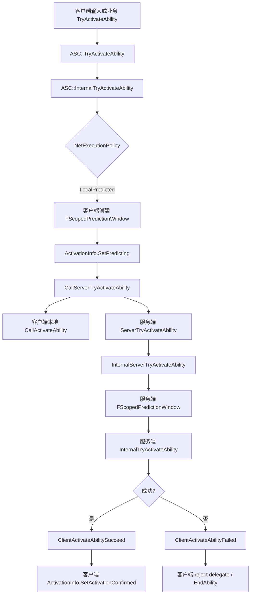
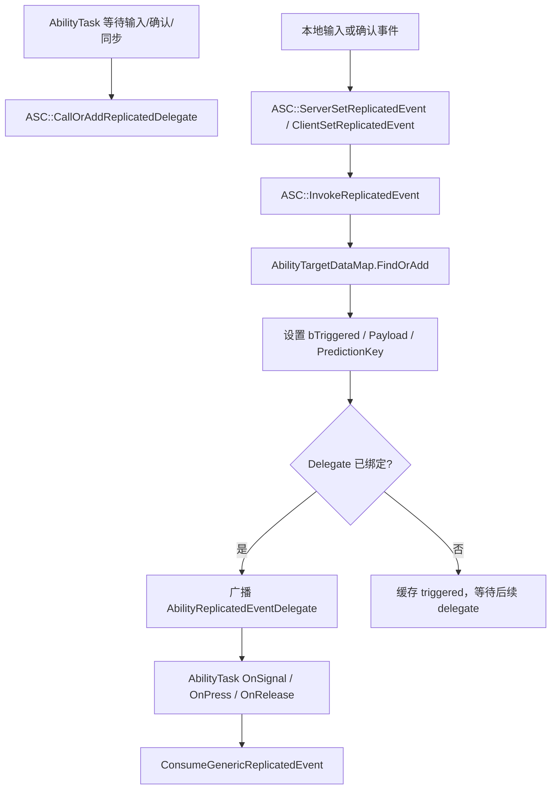
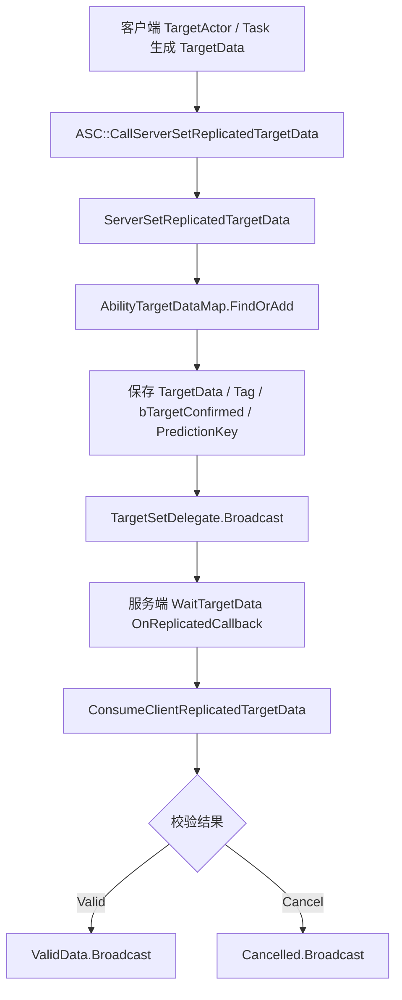
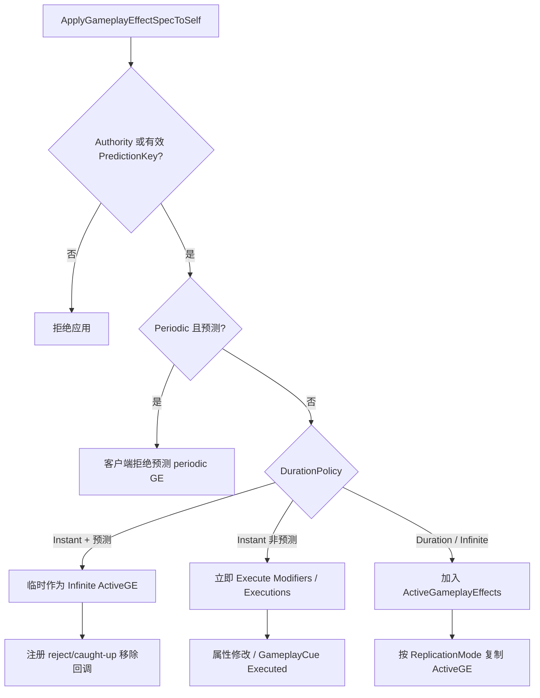

# GAS 网络预测 / RPC / Replication / Serialization（第八轮）

本轮聚焦 GameplayAbilities 侧网络体系，把前几轮散落在 Ability、AbilityTask、GameplayEffect、AttributeSet、GameplayCue 中的 PredictionKey、RPC、复制、序列化和 Iris 接入统一整理。

## 一、类定位与核心概念

- GAS 需要 Prediction，是因为 LocalPredicted Ability 会先在客户端执行表现和部分逻辑，再等待服务端确认或拒绝；源码说明客户端预测 key 被复制回客户端后用于 catch-up，其他客户端收到 invalid key；源码路径：`Engine/Plugins/Runtime/GameplayAbilities/Source/GameplayAbilities/Public/GameplayPrediction.h:70`、`Engine/Plugins/Runtime/GameplayAbilities/Source/GameplayAbilities/Public/GameplayPrediction.h:92`。
- `FPredictionKey` 是一次预测动作的标识，保存 `Current`、`Base`、是否 server initiated，并提供 reject / caught-up delegate；源码路径：`Engine/Plugins/Runtime/GameplayAbilities/Source/GameplayAbilities/Public/GameplayPrediction.h:296`、`Engine/Plugins/Runtime/GameplayAbilities/Source/GameplayAbilities/Public/GameplayPrediction.h:304`、`Engine/Plugins/Runtime/GameplayAbilities/Source/GameplayAbilities/Public/GameplayPrediction.h:324`。
- `FScopedPredictionWindow` 是 ASC 预测窗口的 RAII 管理器，构造时设置 ASC 当前 `ScopedPredictionKey`，析构时恢复旧 key；服务端窗口可把 key 写入 `ReplicatedPredictionKeyMap` 用于客户端 catch-up；源码路径：`Engine/Plugins/Runtime/GameplayAbilities/Source/GameplayAbilities/Public/GameplayPrediction.h:479`、`Engine/Plugins/Runtime/GameplayAbilities/Source/GameplayAbilities/Private/GameplayPrediction.cpp:368`、`Engine/Plugins/Runtime/GameplayAbilities/Source/GameplayAbilities/Private/GameplayPrediction.cpp:493`。
- `FGameplayAbilityActivationInfo` 保存 Ability 激活模式和激活时的 prediction key，区分 Authority、NonAuthority、Predicting、Confirmed、Rejected；源码路径：`Engine/Plugins/Runtime/GameplayAbilities/Source/GameplayAbilities/Public/GameplayAbilitySpec.h:25`、`Engine/Plugins/Runtime/GameplayAbilities/Source/GameplayAbilities/Public/GameplayAbilitySpec.h:113`。
- `FReplicatedPredictionKeyMap` 是 ASC 用来把服务端确认过的 prediction key 复制回 owning client 的 fast array；源码路径：`Engine/Plugins/Runtime/GameplayAbilities/Source/GameplayAbilities/Public/GameplayPrediction.h:595`、`Engine/Plugins/Runtime/GameplayAbilities/Source/GameplayAbilities/Private/GameplayPrediction.cpp:683`。
- `FGameplayAbilityReplicatedDataContainer` 按 `FGameplayAbilitySpecHandleAndPredictionKey` 缓存 TargetData 与 Generic Replicated Event 数据，Ability 结束或数据消费后会清理；源码路径：`Engine/Plugins/Runtime/GameplayAbilities/Source/GameplayAbilities/Public/Abilities/GameplayAbilityTypes.h:602`、`Engine/Plugins/Runtime/GameplayAbilities/Source/GameplayAbilities/Private/GameplayAbilityTypes.cpp:400`。
- `FGameplayAbilityReplicatedData` 同名类型在本轮源码中未确认；源码实际存在的是 `FAbilityReplicatedData`，用于保存一个 generic replicated event 的触发状态、payload 和 delegate；源码路径：`Engine/Plugins/Runtime/GameplayAbilities/Source/GameplayAbilities/Public/Abilities/GameplayAbilityTargetTypes.h:681`。
- `FGameplayAbilitySpecHandle` 是指向已授予 Ability spec 的全局唯一 handle，内部保存 `int32 Handle`，并提供 `IsValid`、`GenerateNewHandle` 和自定义 archive 序列化；源码路径：`Engine/Plugins/Runtime/GameplayAbilities/Source/GameplayAbilities/Public/GameplayAbilitySpecHandle.h:15`、`Engine/Plugins/Runtime/GameplayAbilities/Source/GameplayAbilities/Public/GameplayAbilitySpecHandle.h:25`、`Engine/Plugins/Runtime/GameplayAbilities/Source/GameplayAbilities/Public/GameplayAbilitySpecHandle.h:31`、`Engine/Plugins/Runtime/GameplayAbilities/Source/GameplayAbilities/Public/GameplayAbilitySpecHandle.h:44`。
- `FGameplayAbilitySpecHandleAndPredictionKey` 是 Ability handle 和 prediction key 的组合 key，用于索引 replicated data cache；源码路径：`Engine/Plugins/Runtime/GameplayAbilities/Source/GameplayAbilities/Public/Abilities/GameplayAbilityTypes.h:500`。
- `AbilityTargetDataMap` 是 ASC 内部的 `FGameplayAbilityReplicatedDataContainer` 成员，保存客户端复制到服务端的 TargetData 和 generic replicated event；源码路径：`Engine/Plugins/Runtime/GameplayAbilities/Source/GameplayAbilities/Public/AbilitySystemComponent.h:1699`。
- `EGameplayEffectReplicationMode` 控制 ActiveGameplayEffect 复制粒度：Full 复制给所有客户端，Mixed 只完整复制给 owner，Minimal 不完整复制 ActiveGE；源码路径：`Engine/Plugins/Runtime/GameplayAbilities/Source/GameplayAbilities/Public/AbilitySystemComponent.h:81`。
- `IAbilitySystemReplicationProxyInterface` 允许 Actor 作为 ASC 的复制代理，尤其用于聚合和转发 GameplayCue 相关复制调用；源码路径：`Engine/Plugins/Runtime/GameplayAbilities/Source/GameplayAbilities/Public/AbilitySystemReplicationProxyInterface.h:21`。
- Serialization / Iris 在 GameplayAbilities 中承担特定 GAS 类型的 NetSerializer 和 ReplicationFragment 接入；模块 Build.cs 调用 `SetupIrisSupport(Target)`，并在 `Public/Serialization`、`Private/Serialization` 下提供 TargetData、EffectContext、PredictionKey、MinimalCue、MinimalTag 等 serializer；源码路径：`Engine/Plugins/Runtime/GameplayAbilities/Source/GameplayAbilities/GameplayAbilities.Build.cs:42`、`Engine/Plugins/Runtime/GameplayAbilities/Source/GameplayAbilities/Private/Serialization/PredictionKeyNetSerializer.cpp:194`。

## 二、核心类型分析

| 类型 | 定义位置 | 核心职责 | 创建或修改时机 | 是否复制 | 关系 | 业务层是否常直接操作 |
| --- | --- | --- | --- | --- | --- | --- |
| `FPredictionKey` | `Engine/Plugins/Runtime/GameplayAbilities/Source/GameplayAbilities/Public/GameplayPrediction.h:296` | 标识一次预测动作，绑定 reject / caught-up 回调 | `CreateNewPredictionKey`、`GenerateDependentPredictionKey`、`SetPredicting` 等路径修改；源码路径：`Engine/Plugins/Runtime/GameplayAbilities/Source/GameplayAbilities/Public/GameplayPrediction.h:316`、`Engine/Plugins/Runtime/GameplayAbilities/Source/GameplayAbilities/Public/GameplayAbilitySpec.h:146` | 有 `NetSerialize`，且有专门 Iris serializer；源码路径：`Engine/Plugins/Runtime/GameplayAbilities/Source/GameplayAbilities/Public/GameplayPrediction.h:333`、`Engine/Plugins/Runtime/GameplayAbilities/Source/GameplayAbilities/Private/Serialization/PredictionKeyNetSerializer.cpp:194` | ASC、Ability、GE、TargetData、GameplayCue 都可携带或使用它 | 业务层通常不直接生成，常通过 ASC / AbilityTask API 间接使用 |
| `FScopedPredictionWindow` | `Engine/Plugins/Runtime/GameplayAbilities/Source/GameplayAbilities/Public/GameplayPrediction.h:479` | 临时设置 ASC 当前 prediction key | LocalPredicted 激活、GenericEvent、TargetData RPC、AbilityTask 跨帧同步时创建；源码路径：`Engine/Plugins/Runtime/GameplayAbilities/Source/GameplayAbilities/Private/AbilitySystemComponent_Abilities.cpp:1922`、`Engine/Plugins/Runtime/GameplayAbilities/Source/GameplayAbilities/Private/AbilitySystemComponent_Abilities.cpp:3947` | 自身不复制，析构时可推动 key 确认复制 | 管理 ASC 的 `ScopedPredictionKey` | 自定义网络 AbilityTask 可能会用，需谨慎 |
| `FGameplayAbilityActivationInfo` | `Engine/Plugins/Runtime/GameplayAbilities/Source/GameplayAbilities/Public/GameplayAbilitySpec.h:113` | 保存 Ability 激活模式、预测 key、是否可被其他实例结束 | Ability 激活、服务端确认、客户端 reject / catch-up 时修改；源码路径：`Engine/Plugins/Runtime/GameplayAbilities/Source/GameplayAbilities/Private/AbilitySystemComponent_Abilities.cpp:1924`、`Engine/Plugins/Runtime/GameplayAbilities/Source/GameplayAbilities/Private/AbilitySystemComponent_Abilities.cpp:2380` | 随 Spec / RPC 场景间接参与复制，字段本身不是单独 fast array | Ability 实例判断预测状态和结束权限 | 业务层可读较常见，直接改较少 |
| `FReplicatedPredictionKeyMap` | `Engine/Plugins/Runtime/GameplayAbilities/Source/GameplayAbilities/Public/GameplayPrediction.h:595` | 把服务端确认 key 复制给 owning client，触发 catch-up | `FScopedPredictionWindow` 析构时调用 `ReplicatePredictionKey`；源码路径：`Engine/Plugins/Runtime/GameplayAbilities/Source/GameplayAbilities/Private/GameplayPrediction.cpp:509` | Fast array 复制，ASC 中 owner-only；源码路径：`Engine/Plugins/Runtime/GameplayAbilities/Source/GameplayAbilities/Public/AbilitySystemComponent.h:1978`、`Engine/Plugins/Runtime/GameplayAbilities/Source/GameplayAbilities/Private/AbilitySystemComponent.cpp:1651` | PredictionKey 生命周期核心 | 业务层通常不直接操作 |
| `FAbilityReplicatedData` | `Engine/Plugins/Runtime/GameplayAbilities/Source/GameplayAbilities/Public/Abilities/GameplayAbilityTargetTypes.h:681` | 保存 GenericReplicatedEvent 的 triggered 状态、payload 和 delegate | `InvokeReplicatedEvent`、`CallOrAddReplicatedDelegate` 修改；源码路径：`Engine/Plugins/Runtime/GameplayAbilities/Source/GameplayAbilities/Private/AbilitySystemComponent_Abilities.cpp:3886`、`Engine/Plugins/Runtime/GameplayAbilities/Source/GameplayAbilities/Private/AbilitySystemComponent_Abilities.cpp:4066` | 不是 UPROPERTY 复制容器本身，事件通过 RPC 到达后缓存 | WaitInput、WaitConfirm、NetworkSyncPoint 等 AbilityTask | 业务层通常通过 AbilityTask 间接用 |
| `FGameplayAbilityReplicatedDataContainer` | `Engine/Plugins/Runtime/GameplayAbilities/Source/GameplayAbilities/Public/Abilities/GameplayAbilityTypes.h:602` | 按 Ability handle + prediction key 管理 replicated data cache | `FindOrAdd`、`Remove`、`ConsumeAllReplicatedData` 修改；源码路径：`Engine/Plugins/Runtime/GameplayAbilities/Source/GameplayAbilities/Private/GameplayAbilityTypes.cpp:413`、`Engine/Plugins/Runtime/GameplayAbilities/Source/GameplayAbilities/Private/AbilitySystemComponent_Abilities.cpp:3829` | 不是直接复制成员，RPC 到达后填充缓存 | ASC 的 TargetData 和 GenericEvent 缓存 | 业务层不建议直接操作 |
| `FGameplayAbilitySpecHandle` | `Engine/Plugins/Runtime/GameplayAbilities/Source/GameplayAbilities/Public/GameplayAbilitySpecHandle.h:15` | 指向已授予 Ability spec 的 handle | 授予 Ability 时生成，TargetData / RPC / replicated event 通过它定位 spec；源码路径：`Engine/Plugins/Runtime/GameplayAbilities/Source/GameplayAbilities/Public/GameplayAbilitySpecHandle.h:31`、`Engine/Plugins/Runtime/GameplayAbilities/Source/GameplayAbilities/Public/AbilitySystemComponent.h:1753` | 可被 archive 序列化，作为多种 RPC 参数传递；源码路径：`Engine/Plugins/Runtime/GameplayAbilities/Source/GameplayAbilities/Public/GameplayAbilitySpecHandle.h:44` | AbilitySpec、ASC RPC、TargetData cache 的基础标识 | 业务层会保存/传递 handle，但通常不自己改内部值 |
| `FGameplayAbilitySpecHandleAndPredictionKey` | `Engine/Plugins/Runtime/GameplayAbilities/Source/GameplayAbilities/Public/Abilities/GameplayAbilityTypes.h:500` | 给 replicated data cache 做复合 key | TargetData / GenericEvent 到达或消费时创建 | 自身不作为单独 replicated property | 关联 AbilitySpec 与一次预测 | 业务层通常不直接操作 |
| `FServerAbilityRPCBatch` | `Engine/Plugins/Runtime/GameplayAbilities/Source/GameplayAbilities/Public/Abilities/GameplayAbilityTypes.h:448` | 把 TryActivate、TargetData、EndAbility 合并成一次 server RPC | `FScopedServerAbilityRPCBatcher` 或 ASC batch API 管理；源码路径：`Engine/Plugins/Runtime/GameplayAbilities/Source/GameplayAbilities/Private/AbilitySystemComponent_Abilities.cpp:4148` | 通过 `ServerAbilityRPCBatch` RPC 发送 | 只覆盖 ASC 明确列出的 server RPC | 业务层少用，自定义 Task 一般只需调用 ASC 封装 |
| `FScopedServerAbilityRPCBatcher` | `Engine/Plugins/Runtime/GameplayAbilities/Source/GameplayAbilities/Public/Abilities/GameplayAbilityTypes.h:486` | RAII 开启 / 结束 Server Ability RPC batch | 构造调用 `BeginServerAbilityRPCBatch`，析构调用 `EndServerAbilityRPCBatch`；源码路径：`Engine/Plugins/Runtime/GameplayAbilities/Source/GameplayAbilities/Private/AbilitySystemComponent_Abilities.cpp:4101` | 自身不复制 | 包含一个 `FScopedPredictionWindow` | 业务层一般不直接用，调试 batch 时需要知道 |
| `FGameplayAbilityTargetDataHandle` | `Engine/Plugins/Runtime/GameplayAbilities/Source/GameplayAbilities/Public/Abilities/GameplayAbilityTargetTypes.h:193` | 保存一组多态 TargetData | TargetActor / AbilityTask 生成，RPC 到服务端后缓存 | 有 `NetSerialize` 和 Iris serializer；源码路径：`Engine/Plugins/Runtime/GameplayAbilities/Source/GameplayAbilities/Private/GameplayAbilityTargetTypes.cpp:183`、`Engine/Plugins/Runtime/GameplayAbilities/Source/GameplayAbilities/Private/Serialization/GameplayAbilityTargetDataHandleNetSerializer.cpp:235` | WaitTargetData、ASC TargetData RPC | 业务层常读写 handle，但应通过 GAS API 发送 |
| `FGameplayEffectSpecForRPC` | `Engine/Plugins/Runtime/GameplayAbilities/Source/GameplayAbilities/Public/GameplayEffectTypes.h:1511` | GE / Cue RPC 的轻量 spec 数据 | GameplayCue RPC 和 Effect RPC 参数构造时使用；源码路径：`Engine/Plugins/Runtime/GameplayAbilities/Source/GameplayAbilities/Private/AbilitySystemComponent.cpp:1436` | RPC 参数，可序列化其字段 | 连接 GE 与 GameplayCue 参数 | 业务层通常不直接构造 |
| `FMinimalReplicationTagCountMap` | `Engine/Plugins/Runtime/GameplayAbilities/Source/GameplayAbilities/Public/GameplayEffectTypes.h:1581` | Minimal 模式下复制 tag count | ASC 维护 minimal granted tags / loose tags 时修改；源码路径：`Engine/Plugins/Runtime/GameplayAbilities/Source/GameplayAbilities/Private/AbilitySystemComponent.cpp:3286` | `NetSerialize`，有 Iris serializer 和 fragment；源码路径：`Engine/Plugins/Runtime/GameplayAbilities/Source/GameplayAbilities/Private/GameplayEffectTypes.cpp:1337`、`Engine/Plugins/Runtime/GameplayAbilities/Source/GameplayAbilities/Private/Serialization/MinimalReplicationTagCountNetSerializer.cpp:239` | 补足 Minimal 模式下 ActiveGE 不完整复制时的 tag 信息 | 业务层不直接操作 |
| `FActiveGameplayEffectsContainer` | `Engine/Plugins/Runtime/GameplayAbilities/Source/GameplayAbilities/Public/GameplayEffect.h:1621` | ASC 的 ActiveGE fast array 容器 | GE 应用、移除、复制回调、预测回滚时修改 | Fast array 复制，受 ReplicationMode 条件控制；源码路径：`Engine/Plugins/Runtime/GameplayAbilities/Source/GameplayAbilities/Private/GameplayEffect.cpp:4875` | GE、Attribute、Tag、Cue 网络同步核心 | 业务层通过 ASC API 间接操作 |
| `FActiveGameplayCueContainer` | `Engine/Plugins/Runtime/GameplayAbilities/Source/GameplayAbilities/Public/GameplayCueInterface.h:132` | ASC Active GameplayCue fast array 容器 | `AddGameplayCue`、`RemoveGameplayCue`、预测 add/remove 修改；源码路径：`Engine/Plugins/Runtime/GameplayAbilities/Source/GameplayAbilities/Private/GameplayCueInterface.cpp:305` | Fast array 复制，Minimal 容器另有专门代理；源码路径：`Engine/Plugins/Runtime/GameplayAbilities/Source/GameplayAbilities/Private/GameplayCueInterface.cpp:462` | GameplayCue 的持续状态复制 | 业务层通过 ASC Cue API 间接操作 |
| `IAbilitySystemReplicationProxyInterface` | `Engine/Plugins/Runtime/GameplayAbilities/Source/GameplayAbilities/Public/AbilitySystemReplicationProxyInterface.h:21` | Actor 作为 ASC 复制代理，转发 GameplayCue RPC | ASC `GetReplicationInterface` 根据设置返回 proxy；源码路径：`Engine/Plugins/Runtime/GameplayAbilities/Source/GameplayAbilities/Private/AbilitySystemComponent.cpp:1786` | 接口自身不复制，要求实现 NetMulticast 代理函数 | ASC 与 Avatar/Actor 复制结构的桥接 | 项目架构层可能实现，普通业务 Ability 少直接接触 |

## 三、Ability 激活预测流程



关键源码路径：

- `TryActivateAbility` 进入后会检查 handle、ActorInfo、Avatar、pending remove 和网络策略；源码路径：`Engine/Plugins/Runtime/GameplayAbilities/Source/GameplayAbilities/Private/AbilitySystemComponent_Abilities.cpp:1585`、`Engine/Plugins/Runtime/GameplayAbilities/Source/GameplayAbilities/Private/AbilitySystemComponent_Abilities.cpp:1607`。
- `InternalTryActivateAbility` 按 `NetExecutionPolicy` 区分 LocalOnly、LocalPredicted、ServerOnly、ServerInitiated；源码路径：`Engine/Plugins/Runtime/GameplayAbilities/Source/GameplayAbilities/Private/AbilitySystemComponent_Abilities.cpp:1742`、`Engine/Plugins/Runtime/GameplayAbilities/Source/GameplayAbilities/Private/AbilitySystemComponent_Abilities.cpp:1761`。
- LocalPredicted 分支会创建 `FScopedPredictionWindow(this, true)`，设置 `ActivationInfo.SetPredicting(ScopedPredictionKey)`，立即调用 `CallServerTryActivateAbility`，再本地激活 Ability；源码路径：`Engine/Plugins/Runtime/GameplayAbilities/Source/GameplayAbilities/Private/AbilitySystemComponent_Abilities.cpp:1922`、`Engine/Plugins/Runtime/GameplayAbilities/Source/GameplayAbilities/Private/AbilitySystemComponent_Abilities.cpp:1924`、`Engine/Plugins/Runtime/GameplayAbilities/Source/GameplayAbilities/Private/AbilitySystemComponent_Abilities.cpp:1926`。
- 服务端 `InternalServerTryActivateAbility` 会用客户端传来的 prediction key 创建服务端窗口，成功则执行服务端激活，失败则 `ClientActivateAbilityFailed`；源码路径：`Engine/Plugins/Runtime/GameplayAbilities/Source/GameplayAbilities/Private/AbilitySystemComponent_Abilities.cpp:2026`、`Engine/Plugins/Runtime/GameplayAbilities/Source/GameplayAbilities/Private/AbilitySystemComponent_Abilities.cpp:2070`、`Engine/Plugins/Runtime/GameplayAbilities/Source/GameplayAbilities/Private/AbilitySystemComponent_Abilities.cpp:2088`。
- 服务端成功会调用 `ClientActivateAbilitySucceed` 或 `ClientActivateAbilitySucceedWithEventData`，客户端设置 confirmed；源码路径：`Engine/Plugins/Runtime/GameplayAbilities/Source/GameplayAbilities/Private/AbilitySystemComponent_Abilities.cpp:1874`、`Engine/Plugins/Runtime/GameplayAbilities/Source/GameplayAbilities/Private/AbilitySystemComponent_Abilities.cpp:2339`、`Engine/Plugins/Runtime/GameplayAbilities/Source/GameplayAbilities/Private/AbilitySystemComponent_Abilities.cpp:2380`。
- 失败时 `ClientActivateAbilityFailed_Implementation` 会广播 rejected delegate，设置 activation rejected，并对实例 Ability 调用 `K2_EndAbility`；源码路径：`Engine/Plugins/Runtime/GameplayAbilities/Source/GameplayAbilities/Private/AbilitySystemComponent_Abilities.cpp:2251`、`Engine/Plugins/Runtime/GameplayAbilities/Source/GameplayAbilities/Private/AbilitySystemComponent_Abilities.cpp:2288`、`Engine/Plugins/Runtime/GameplayAbilities/Source/GameplayAbilities/Private/AbilitySystemComponent_Abilities.cpp:2296`。

简化伪代码：

```cpp
// 客户端
TryActivateAbility(Handle)
{
    if (Policy == LocalPredicted)
    {
        FScopedPredictionWindow Window(ASC, true);
        Spec.ActivationInfo.SetPredicting(ASC.ScopedPredictionKey);
        ASC.CallServerTryActivateAbility(Handle, ASC.ScopedPredictionKey);
        Ability->CallActivateAbility(Handle, ActorInfo, ActivationInfo, EventData);
    }
}

// 服务端
ServerTryActivateAbility(Handle, PredictionKey)
{
    FScopedPredictionWindow Window(ASC, PredictionKey);
    if (InternalTryActivateAbility(Handle, PredictionKey))
    {
        ClientActivateAbilitySucceed(Handle, PredictionKey);
    }
    else
    {
        ClientActivateAbilityFailed(Handle, PredictionKey.Current);
    }
}
```

网络策略差异：

- `LocalOnly`：只能本地激活，远端客户端路径会失败；源码路径：`Engine/Plugins/Runtime/GameplayAbilities/Source/GameplayAbilities/Private/AbilitySystemComponent_Abilities.cpp:1742`。
- `LocalPredicted`：本地先执行并 RPC 到服务端，服务端确认或拒绝；源码路径：`Engine/Plugins/Runtime/GameplayAbilities/Source/GameplayAbilities/Private/AbilitySystemComponent_Abilities.cpp:1904`。
- `ServerOnly`：客户端不能直接完成激活，需服务端执行；源码路径：`Engine/Plugins/Runtime/GameplayAbilities/Source/GameplayAbilities/Private/AbilitySystemComponent_Abilities.cpp:1761`。
- `ServerInitiated`：服务端可发起，客户端路径受策略限制；完整项目侧使用模式本轮未展开，未确认；源码路径：`Engine/Plugins/Runtime/GameplayAbilities/Source/GameplayAbilities/Private/AbilitySystemComponent_Abilities.cpp:1761`。

## 四、PredictionKey 生命周期

- LocalPredicted 激活时客户端通过 `FScopedPredictionWindow(this, true)` 生成新 prediction key；源码路径：`Engine/Plugins/Runtime/GameplayAbilities/Source/GameplayAbilities/Private/AbilitySystemComponent_Abilities.cpp:1922`、`Engine/Plugins/Runtime/GameplayAbilities/Source/GameplayAbilities/Private/GameplayPrediction.cpp:389`。
- 客户端通过 `CallServerTryActivateAbility` 把 prediction key 传给服务端；源码路径：`Engine/Plugins/Runtime/GameplayAbilities/Source/GameplayAbilities/Private/AbilitySystemComponent_Abilities.cpp:1926`、`Engine/Plugins/Runtime/GameplayAbilities/Source/GameplayAbilities/Private/AbilitySystemComponent_Abilities.cpp:4192`。
- 服务端用收到的 key 创建 `FScopedPredictionWindow(this, PredictionKey)`，让后续 GE、Cue、TargetData 等操作挂在同一个预测上下文；源码路径：`Engine/Plugins/Runtime/GameplayAbilities/Source/GameplayAbilities/Private/AbilitySystemComponent_Abilities.cpp:2070`。
- 服务端窗口析构时如果 `SetReplicatedPredictionKey` 且 key 有效，会调用 `ReplicatedPredictionKeyMap.ReplicatePredictionKey`，把确认复制回 owning client；源码路径：`Engine/Plugins/Runtime/GameplayAbilities/Source/GameplayAbilities/Private/GameplayPrediction.cpp:493`、`Engine/Plugins/Runtime/GameplayAbilities/Source/GameplayAbilities/Private/GameplayPrediction.cpp:509`。
- 客户端 `FReplicatedPredictionKeyItem::OnRep` 收到确认 key 后调用 `FPredictionKeyDelegates::CatchUpTo`，触发 caught-up delegate；源码路径：`Engine/Plugins/Runtime/GameplayAbilities/Source/GameplayAbilities/Private/GameplayPrediction.cpp:575`、`Engine/Plugins/Runtime/GameplayAbilities/Source/GameplayAbilities/Private/GameplayPrediction.cpp:595`。
- `ReplicatedPredictionKeyMap` 必须在 ASC replicated properties 最后，否则其他属性的 OnRep 可能早于 prediction key catch-up，导致预测回调时序错乱；源码注释明确这一点；源码路径：`Engine/Plugins/Runtime/GameplayAbilities/Source/GameplayAbilities/Public/AbilitySystemComponent.h:1976`。
- 跨 latent、timer、AbilityTask 后不应继续沿用旧 key，需要新的 scoped prediction window；源码注释以 WaitInputRelease 为例说明跨帧预测 key 需求；源码路径：`Engine/Plugins/Runtime/GameplayAbilities/Source/GameplayAbilities/Public/GameplayPrediction.h:198`。
- prediction key invalid 时，客户端预测 GE、TargetData RPC batch、Cue 等路径可能被拒绝、降级或输出 warning；源码路径：`Engine/Plugins/Runtime/GameplayAbilities/Source/GameplayAbilities/Private/AbilitySystemComponent_Abilities.cpp:4234`、`Engine/Plugins/Runtime/GameplayAbilities/Source/GameplayAbilities/Private/GameplayEffect.cpp:2931`。

## 五、Ability 激活 RPC 与失败处理

| RPC / 函数 | 方向 | 使用场景 | 失败处理 | 源码路径 |
| --- | --- | --- | --- | --- |
| `CallServerTryActivateAbility` | Client → Server 封装 | LocalPredicted / 客户端请求服务端激活 | 可进入 batch；无 batch 时调用 `ServerTryActivateAbility` | `Engine/Plugins/Runtime/GameplayAbilities/Source/GameplayAbilities/Public/AbilitySystemComponent.h:1331`、`Engine/Plugins/Runtime/GameplayAbilities/Source/GameplayAbilities/Private/AbilitySystemComponent_Abilities.cpp:4192` |
| `ServerTryActivateAbility` | Client → Server RPC | 服务端接收客户端激活请求 | 转入 `InternalServerTryActivateAbility` | `Engine/Plugins/Runtime/GameplayAbilities/Source/GameplayAbilities/Public/AbilitySystemComponent.h:1753`、`Engine/Plugins/Runtime/GameplayAbilities/Source/GameplayAbilities/Private/AbilitySystemComponent_Abilities.cpp:1988` |
| `ClientTryActivateAbility` | Server → Client RPC | 服务器要求 owning client 尝试激活 | 如果客户端还没有 spec，会加入 pending 列表 | `Engine/Plugins/Runtime/GameplayAbilities/Source/GameplayAbilities/Public/AbilitySystemComponent.h:1759`、`Engine/Plugins/Runtime/GameplayAbilities/Source/GameplayAbilities/Private/AbilitySystemComponent_Abilities.cpp:2008` |
| `ClientActivateAbilitySucceed` | Server → Client RPC | 服务端确认激活成功 | 客户端设置 confirmed | `Engine/Plugins/Runtime/GameplayAbilities/Source/GameplayAbilities/Public/AbilitySystemComponent.h:1785`、`Engine/Plugins/Runtime/GameplayAbilities/Source/GameplayAbilities/Private/AbilitySystemComponent_Abilities.cpp:2339` |
| `ClientActivateAbilitySucceedWithEventData` | Server → Client RPC | 带 event data 的激活确认 | 客户端设置 confirmed，必要时处理 pending | `Engine/Plugins/Runtime/GameplayAbilities/Source/GameplayAbilities/Public/AbilitySystemComponent.h:1788`、`Engine/Plugins/Runtime/GameplayAbilities/Source/GameplayAbilities/Private/AbilitySystemComponent_Abilities.cpp:2339` |
| `ClientActivateAbilityFailed` | Server → Client RPC | 服务端拒绝客户端预测激活 | 广播 rejected delegate，设置 rejected，实例 Ability 调 `K2_EndAbility` | `Engine/Plugins/Runtime/GameplayAbilities/Source/GameplayAbilities/Public/AbilitySystemComponent.h:1777`、`Engine/Plugins/Runtime/GameplayAbilities/Source/GameplayAbilities/Private/AbilitySystemComponent_Abilities.cpp:2251` |
| `ServerEndAbility` | Client → Server RPC | 客户端通知服务端结束 | 服务端 security check 后调用 `RemoteEndOrCancelAbility` | `Engine/Plugins/Runtime/GameplayAbilities/Source/GameplayAbilities/Public/AbilitySystemComponent.h:1765`、`Engine/Plugins/Runtime/GameplayAbilities/Source/GameplayAbilities/Private/AbilitySystemComponent_Abilities.cpp:2194` |
| `ClientEndAbility` | Server → Client RPC | 服务端通知客户端结束 | 客户端调用 `RemoteEndOrCancelAbility` | `Engine/Plugins/Runtime/GameplayAbilities/Source/GameplayAbilities/Public/AbilitySystemComponent.h:1768`、`Engine/Plugins/Runtime/GameplayAbilities/Source/GameplayAbilities/Private/AbilitySystemComponent_Abilities.cpp:2215` |
| `ServerCancelAbility` | Client → Server RPC | 客户端请求取消 | 服务端 security check 后取消 | `Engine/Plugins/Runtime/GameplayAbilities/Source/GameplayAbilities/Public/AbilitySystemComponent.h:1771`、`Engine/Plugins/Runtime/GameplayAbilities/Source/GameplayAbilities/Private/AbilitySystemComponent_Abilities.cpp:2220` |
| `RemoteEndOrCancelAbility` | 本地执行辅助 | 收到远端 end/cancel 后同步本地状态 | 匹配 prediction key 后调用 cancel 或 end，避免反向复制 | `Engine/Plugins/Runtime/GameplayAbilities/Source/GameplayAbilities/Public/AbilitySystemComponent.h:1762`、`Engine/Plugins/Runtime/GameplayAbilities/Source/GameplayAbilities/Private/AbilitySystemComponent_Abilities.cpp:2135` |

## 六、Generic Replicated Event 机制



- `ServerSetReplicatedEvent` / `ServerSetReplicatedEventWithPayload` 是 Client → Server RPC，内部创建 prediction window 后调用 `InvokeReplicatedEvent`；源码路径：`Engine/Plugins/Runtime/GameplayAbilities/Source/GameplayAbilities/Public/AbilitySystemComponent.h:1582`、`Engine/Plugins/Runtime/GameplayAbilities/Source/GameplayAbilities/Private/AbilitySystemComponent_Abilities.cpp:3872`。
- `ClientSetReplicatedEvent` 是 Server → Client RPC，对称调用 `InvokeReplicatedEvent`；源码路径：`Engine/Plugins/Runtime/GameplayAbilities/Source/GameplayAbilities/Public/AbilitySystemComponent.h:1590`、`Engine/Plugins/Runtime/GameplayAbilities/Source/GameplayAbilities/Private/AbilitySystemComponent_Abilities.cpp:3940`。
- `InvokeReplicatedEvent` 按 AbilitySpecHandle + PredictionKey 写入 `AbilityTargetDataMap`，若 delegate 已绑定就立即广播，否则缓存 `bTriggered`；源码路径：`Engine/Plugins/Runtime/GameplayAbilities/Source/GameplayAbilities/Private/AbilitySystemComponent_Abilities.cpp:3886`。
- `CallOrAddReplicatedDelegate` 会在事件已经 triggered 时立刻调用 delegate，否则把 delegate 加入缓存；源码路径：`Engine/Plugins/Runtime/GameplayAbilities/Source/GameplayAbilities/Private/AbilitySystemComponent_Abilities.cpp:4066`。
- `ConsumeGenericReplicatedEvent` 清除 `bTriggered`，避免事件重复消费；源码路径：`Engine/Plugins/Runtime/GameplayAbilities/Source/GameplayAbilities/Private/AbilitySystemComponent_Abilities.cpp:3849`。
- `WaitInputPress` / `WaitInputRelease` 通过 `AbilityReplicatedEventDelegate` 监听 `InputPressed` / `InputReleased`，收到后 `ConsumeGenericReplicatedEvent`；源码路径：`Engine/Plugins/Runtime/GameplayAbilities/Source/GameplayAbilities/Private/Abilities/Tasks/AbilityTask_WaitInputPress.cpp:26`、`Engine/Plugins/Runtime/GameplayAbilities/Source/GameplayAbilities/Private/Abilities/Tasks/AbilityTask_WaitInputRelease.cpp:26`。
- `WaitConfirm` / `WaitCancel` / `WaitConfirmCancel` 使用 `GenericConfirm` / `GenericCancel`；源码路径：`Engine/Plugins/Runtime/GameplayAbilities/Source/GameplayAbilities/Private/Abilities/Tasks/AbilityTask_WaitCancel.cpp:21`、`Engine/Plugins/Runtime/GameplayAbilities/Source/GameplayAbilities/Private/Abilities/Tasks/AbilityTask_WaitConfirmCancel.cpp:22`。
- `NetworkSyncPoint` 使用 `GenericSignalFromClient` / `GenericSignalFromServer` 做同步点；源码路径：`Engine/Plugins/Runtime/GameplayAbilities/Source/GameplayAbilities/Private/Abilities/Tasks/AbilityTask_NetworkSyncPoint.cpp:30`、`Engine/Plugins/Runtime/GameplayAbilities/Source/GameplayAbilities/Public/Abilities/GameplayAbilityTargetTypes.h:665`。

## 七、TargetData 复制流程



- `FGameplayAbilityTargetDataHandle` 自身支持 `NetSerialize`，序列化多态 TargetData；具体 TargetData struct 需要 native NetSerialize，否则会报错；源码路径：`Engine/Plugins/Runtime/GameplayAbilities/Source/GameplayAbilities/Public/Abilities/GameplayAbilityTargetTypes.h:257`、`Engine/Plugins/Runtime/GameplayAbilities/Source/GameplayAbilities/Private/GameplayAbilityTargetTypes.cpp:183`、`Engine/Plugins/Runtime/GameplayAbilities/Source/GameplayAbilities/Private/GameplayAbilityTargetTypes.cpp:240`。
- `AbilityTargetDataMap` 用 `FGameplayAbilitySpecHandleAndPredictionKey` 作为 key 缓存 TargetData；源码路径：`Engine/Plugins/Runtime/GameplayAbilities/Source/GameplayAbilities/Public/AbilitySystemComponent.h:1699`、`Engine/Plugins/Runtime/GameplayAbilities/Source/GameplayAbilities/Public/Abilities/GameplayAbilityTypes.h:500`。
- `ServerSetReplicatedTargetData` 保存 TargetData、ApplicationTag、confirmed/cancelled 状态和 prediction key，然后广播 `TargetSetDelegate`；源码路径：`Engine/Plugins/Runtime/GameplayAbilities/Source/GameplayAbilities/Private/AbilitySystemComponent_Abilities.cpp:3945`。
- `ServerSetReplicatedTargetDataCancelled` 保存 cancel 状态并广播 `TargetCancelledDelegate`；源码路径：`Engine/Plugins/Runtime/GameplayAbilities/Source/GameplayAbilities/Private/AbilitySystemComponent_Abilities.cpp:3985`。
- `CallServerSetReplicatedTargetData` 可进入 Server Ability RPC Batch；如果 batch 尚未 started，会退回普通 RPC；源码路径：`Engine/Plugins/Runtime/GameplayAbilities/Source/GameplayAbilities/Private/AbilitySystemComponent_Abilities.cpp:4217`、`Engine/Plugins/Runtime/GameplayAbilities/Source/GameplayAbilities/Private/AbilitySystemComponent_Abilities.cpp:4225`。
- `WaitTargetData` 在服务端绑定 `AbilityTargetDataSetDelegate` / `AbilityTargetDataCancelledDelegate`，回调中消费数据；客户端确认时调用 `CallServerSetReplicatedTargetData`，取消时调用 `ServerSetReplicatedTargetDataCancelled`；源码路径：`Engine/Plugins/Runtime/GameplayAbilities/Source/GameplayAbilities/Private/Abilities/Tasks/AbilityTask_WaitTargetData.cpp:211`、`Engine/Plugins/Runtime/GameplayAbilities/Source/GameplayAbilities/Private/Abilities/Tasks/AbilityTask_WaitTargetData.cpp:228`、`Engine/Plugins/Runtime/GameplayAbilities/Source/GameplayAbilities/Private/Abilities/Tasks/AbilityTask_WaitTargetData.cpp:288`。
- TargetData 校验失败的具体 TargetActor 逻辑本轮未完整展开，未确认；GAS 侧能确认的是 Validate RPC 会拒绝 invalid TargetData item；源码路径：`Engine/Plugins/Runtime/GameplayAbilities/Source/GameplayAbilities/Private/AbilitySystemComponent_Abilities.cpp:3971`。

简化伪代码：

```cpp
// 客户端 WaitTargetData 确认
TargetData = TargetActor->ConfirmTargeting();
ASC.CallServerSetReplicatedTargetData(Handle, PredictionKey, TargetData, Tag, ScopedKey);

// 服务端
ServerSetReplicatedTargetData(Handle, PredictionKey, Data, Tag, CurrentKey)
{
    FScopedPredictionWindow Window(ASC, CurrentKey);
    Cache = AbilityTargetDataMap.FindOrAdd(Handle, PredictionKey);
    Cache.TargetData = Data;
    Cache.ApplicationTag = Tag;
    Cache.bTargetConfirmed = true;
    Cache.PredictionKey = CurrentKey;
    Cache.TargetSetDelegate.Broadcast(Data, Tag);
}
```

## 八、Server Ability RPC Batch

- `FServerAbilityRPCBatch` 保存 AbilitySpecHandle、PredictionKey、TargetData、InputPressed、Ended、Started 等批处理字段；源码路径：`Engine/Plugins/Runtime/GameplayAbilities/Source/GameplayAbilities/Public/Abilities/GameplayAbilityTypes.h:448`。
- ASC 注释明确 RPC batch 是 opt-in 且未完整实现，当前只支持 `CallServerTryActivateAbility`、`CallServerSetReplicatedTargetData`、`CallServerEndAbility`；其他 server RPC 不能安全自动 batch；源码路径：`Engine/Plugins/Runtime/GameplayAbilities/Source/GameplayAbilities/Public/AbilitySystemComponent.h:1328`。
- `FScopedServerAbilityRPCBatcher` 构造时开启 batch，析构时结束 batch；源码路径：`Engine/Plugins/Runtime/GameplayAbilities/Source/GameplayAbilities/Public/Abilities/GameplayAbilityTypes.h:486`、`Engine/Plugins/Runtime/GameplayAbilities/Source/GameplayAbilities/Private/AbilitySystemComponent_Abilities.cpp:4101`。
- `ServerAbilityRPCBatch_Internal` 会按 batch 内容依次调用 TryActivate、TargetData、EndAbility；源码路径：`Engine/Plugins/Runtime/GameplayAbilities/Source/GameplayAbilities/Private/AbilitySystemComponent_Abilities.cpp:4132`。
- batch 优势是减少 RPC 数量；限制是只覆盖固定三类 RPC，且调试时调用顺序会被合并；源码路径：`Engine/Plugins/Runtime/GameplayAbilities/Source/GameplayAbilities/Public/AbilitySystemComponent.h:1328`、`Engine/Plugins/Runtime/GameplayAbilities/Source/GameplayAbilities/Private/AbilitySystemComponent_Abilities.cpp:4136`。
- 自定义 AbilityTask 通常不直接处理 batch，而应调用 ASC 的 `CallServerSetReplicatedTargetData`、`CallServerEndAbility` 等封装；这是基于源码封装点的开发实践推断；源码路径：`Engine/Plugins/Runtime/GameplayAbilities/Source/GameplayAbilities/Private/AbilitySystemComponent_Abilities.cpp:4217`。

## 九、GameplayEffect 预测与复制



- `ApplyGameplayEffectSpecToSelf` 首先检查是否 authority 或有有效 prediction key；源码路径：`Engine/Plugins/Runtime/GameplayAbilities/Source/GameplayAbilities/Private/AbilitySystemComponent.cpp:798`、`Engine/Plugins/Runtime/GameplayAbilities/Source/GameplayAbilities/Private/AbilitySystemComponent.cpp:812`。
- periodic GE 不允许客户端预测：客户端有 prediction key 且 GE 有 period 时会返回空 handle；服务端会清掉传入 prediction key；源码路径：`Engine/Plugins/Runtime/GameplayAbilities/Source/GameplayAbilities/Private/AbilitySystemComponent.cpp:821`、`Engine/Plugins/Runtime/GameplayAbilities/Source/GameplayAbilities/Private/AbilitySystemComponent.cpp:827`。
- predicted instant GE 会临时视为 infinite ActiveGE，以便客户端稍后由服务端确认或回滚；源码路径：`Engine/Plugins/Runtime/GameplayAbilities/Source/GameplayAbilities/Private/AbilitySystemComponent.cpp:862`、`Engine/Plugins/Runtime/GameplayAbilities/Source/GameplayAbilities/Private/AbilitySystemComponent.cpp:910`。
- ActiveGE 添加时如果是 local client key，会标记 array dirty，并注册 `NewRejectOrCaughtUpDelegate` 来允许客户端移除预测效果；源码路径：`Engine/Plugins/Runtime/GameplayAbilities/Source/GameplayAbilities/Private/GameplayEffect.cpp:4255`、`Engine/Plugins/Runtime/GameplayAbilities/Source/GameplayAbilities/Private/GameplayEffect.cpp:4264`。
- `EGameplayEffectReplicationMode` 影响 ActiveGE 复制条件：Minimal 不复制 ActiveGE，Mixed authority 只给 owner，Full 给所有连接；源码路径：`Engine/Plugins/Runtime/GameplayAbilities/Source/GameplayAbilities/Private/GameplayEffect.cpp:4875`。
- ASC `GetLifetimeReplicatedProps` 中 ActiveGE 使用动态复制条件，Minimal tags 和 Minimal cues 使用 skip owner；源码路径：`Engine/Plugins/Runtime/GameplayAbilities/Source/GameplayAbilities/Private/AbilitySystemComponent.cpp:1633`、`Engine/Plugins/Runtime/GameplayAbilities/Source/GameplayAbilities/Private/AbilitySystemComponent.cpp:1655`。
- `MinimalReplicationTags` 用于 Minimal / Mixed 场景补充 granted tag 信息；源码路径：`Engine/Plugins/Runtime/GameplayAbilities/Source/GameplayAbilities/Public/AbilitySystemComponent.h:1909`。
- 客户端预测 GE 的 delegate 可能先触发，因为本地会先应用 ActiveGE 或执行属性修改；服务端确认 / reject 后再 catch-up 或回滚；源码路径：`Engine/Plugins/Runtime/GameplayAbilities/Source/GameplayAbilities/Private/GameplayEffect.cpp:4264`、`Engine/Plugins/Runtime/GameplayAbilities/Source/GameplayAbilities/Private/GameplayPrediction.cpp:595`。

## 十、Attribute 预测与复制

- ASC 会复制 `SpawnedAttributes`，并在 `ReplicateSubobjects` 中复制 AttributeSet 子对象；源码路径：`Engine/Plugins/Runtime/GameplayAbilities/Source/GameplayAbilities/Private/AbilitySystemComponent.cpp:1636`、`Engine/Plugins/Runtime/GameplayAbilities/Source/GameplayAbilities/Private/AbilitySystemComponent.cpp:1710`。
- AttributeSet 子对象复制和具体 Attribute 属性复制不是一回事；具体属性仍需要 UE 通用 `DOREPLIFETIME` 和 RepNotify，本轮不展开 UE 底层复制系统；源码路径：`Engine/Plugins/Runtime/GameplayAbilities/Source/GameplayAbilities/Public/AttributeSet.h:404`。
- `GAMEPLAYATTRIBUTE_REPNOTIFY` 在 OnRep 中调用 ASC 的 `SetBaseAttributeValueFromReplication`，使 Attribute 聚合器和 change delegate 得到更新；源码路径：`Engine/Plugins/Runtime/GameplayAbilities/Source/GameplayAbilities/Public/AttributeSet.h:404`、`Engine/Plugins/Runtime/GameplayAbilities/Source/GameplayAbilities/Private/GameplayEffect.cpp:3561`。
- `SetBaseAttributeValueFromReplication` 会在有 aggregator 时通过 `FScopedAggregatorOnDirtyBatch::GlobalFromNetworkUpdate` 触发 `OnAttributeAggregatorDirty`，无 aggregator 时直接广播 attribute value change delegate；源码路径：`Engine/Plugins/Runtime/GameplayAbilities/Source/GameplayAbilities/Private/GameplayEffect.cpp:3592`、`Engine/Plugins/Runtime/GameplayAbilities/Source/GameplayAbilities/Private/GameplayEffect.cpp:3606`。
- `AttributeSet::PreNetReceive` / `PostNetReceive` 会开启和结束 aggregator 网络更新锁；源码路径：`Engine/Plugins/Runtime/GameplayAbilities/Source/GameplayAbilities/Private/AttributeSet.cpp:512`、`Engine/Plugins/Runtime/GameplayAbilities/Source/GameplayAbilities/Private/AttributeSet.cpp:518`。
- 预测 Attribute 的注释明确建议使用 `REPNOTIFY_Always` 和 `GAMEPLAYATTRIBUTE_REPNOTIFY`，否则从客户端预测值回到服务端真实值时可能不触发 OnRep；源码路径：`Engine/Plugins/Runtime/GameplayAbilities/Source/GameplayAbilities/Public/GameplayPrediction.h:127`、`Engine/Plugins/Runtime/GameplayAbilities/Source/GameplayAbilities/Public/GameplayPrediction.h:138`。
- 客户端预测修改 Attribute 后服务端纠正的完整回滚策略依赖具体 GE、Attribute replication 和项目处理，本轮不完整展开，未确认。

## 十一、GameplayCue 预测与复制

- ASC 提供 `NetMulticast_InvokeGameplayCueExecuted`、`NetMulticast_InvokeGameplayCueAdded`、`NetMulticast_InvokeGameplayCueAddedAndWhileActive` 等 RPC，把 cue 事件复制到客户端；源码路径：`Engine/Plugins/Runtime/GameplayAbilities/Source/GameplayAbilities/Private/AbilitySystemComponent.cpp:1436`、`Engine/Plugins/Runtime/GameplayAbilities/Source/GameplayAbilities/Private/AbilitySystemComponent.cpp:1482`。
- `ActiveGameplayCues` 是 ASC 的持续 cue fast array，`MinimalReplicationGameplayCues` 用于 Minimal 模式下补充 cue 表现；源码路径：`Engine/Plugins/Runtime/GameplayAbilities/Source/GameplayAbilities/Public/AbilitySystemComponent.h:1884`、`Engine/Plugins/Runtime/GameplayAbilities/Source/GameplayAbilities/Public/AbilitySystemComponent.h:1887`。
- `FGameplayCueParameters` 有 `NetSerialize`，包含 EffectContext、source/target tags、location、normal、instigator、effect causer、source object 等字段；源码路径：`Engine/Plugins/Runtime/GameplayAbilities/Source/GameplayAbilities/Public/GameplayEffectTypes.h:834`、`Engine/Plugins/Runtime/GameplayAbilities/Source/GameplayAbilities/Private/GameplayEffectTypes.cpp:1074`。
- `FActiveGameplayCueContainer::PredictiveAdd` 会绑定 prediction key 的 reject/caught-up delegate，catch-up 时调用 ASC 的 predictive cue catchup；源码路径：`Engine/Plugins/Runtime/GameplayAbilities/Source/GameplayAbilities/Private/GameplayCueInterface.cpp:427`、`Engine/Plugins/Runtime/GameplayAbilities/Source/GameplayAbilities/Private/GameplayCueInterface.cpp:434`。
- NetMulticast cue 执行时会跳过本地客户端已经用 local prediction key 预测过的 cue，减少重复播放；源码路径：`Engine/Plugins/Runtime/GameplayAbilities/Source/GameplayAbilities/Private/AbilitySystemComponent.cpp:1438`。
- Minimal cue proxy 通过自定义序列化 tag 和 location，在客户端合成 `FGameplayCueParameters` 并触发 WhileActive / Removed；源码路径：`Engine/Plugins/Runtime/GameplayAbilities/Source/GameplayAbilities/Private/GameplayCueInterface.cpp:541`、`Engine/Plugins/Runtime/GameplayAbilities/Source/GameplayAbilities/Private/GameplayCueInterface.cpp:610`。
- prediction reject 后 cue 的完整表现回滚策略与具体 cue 类型、Notify 生命周期有关，本轮只确认了 predictive add/remove 的 delegate 接入，完整回滚未确认；源码路径：`Engine/Plugins/Runtime/GameplayAbilities/Source/GameplayAbilities/Private/GameplayCueInterface.cpp:402`。

## 十二、ASC ReplicationMode 与 ReplicationProxy

- `EGameplayEffectReplicationMode::Full` 完整复制 ActiveGE 给所有连接，适合需要其他客户端看到完整 GE 状态的场景；源码路径：`Engine/Plugins/Runtime/GameplayAbilities/Source/GameplayAbilities/Public/AbilitySystemComponent.h:87`、`Engine/Plugins/Runtime/GameplayAbilities/Source/GameplayAbilities/Private/GameplayEffect.cpp:4899`。
- `Mixed` 在 authority 上通常只把 ActiveGE 复制给 owner，其他客户端依赖 tags / cues 等轻量信息；源码路径：`Engine/Plugins/Runtime/GameplayAbilities/Source/GameplayAbilities/Public/AbilitySystemComponent.h:85`、`Engine/Plugins/Runtime/GameplayAbilities/Source/GameplayAbilities/Private/GameplayEffect.cpp:4887`。
- `Minimal` 不复制 ActiveGE，依赖 minimal tags 和 minimal cues 补充表现与 tag 状态；源码路径：`Engine/Plugins/Runtime/GameplayAbilities/Source/GameplayAbilities/Public/AbilitySystemComponent.h:83`、`Engine/Plugins/Runtime/GameplayAbilities/Source/GameplayAbilities/Private/GameplayEffect.cpp:4882`。
- ASC `SetReplicationMode` 会更新 ActiveGE 和 MinimalCue 的复制条件；源码路径：`Engine/Plugins/Runtime/GameplayAbilities/Source/GameplayAbilities/Private/AbilitySystemComponent.cpp:1776`。
- `IAbilitySystemReplicationProxyInterface` 可让 AvatarActor 或其他 Actor 作为 ASC replication proxy，转发 GameplayCue 的 multicast 调用；源码路径：`Engine/Plugins/Runtime/GameplayAbilities/Source/GameplayAbilities/Private/AbilitySystemComponent.cpp:1786`、`Engine/Plugins/Runtime/GameplayAbilities/Source/GameplayAbilities/Public/AbilitySystemReplicationProxyInterface.h:39`。
- ASC 放在 PlayerState / Character 的项目取舍不是本轮源码直接规定内容，未确认。开发实践推断：PlayerState 上 ASC 更适合跨 Pawn 生命周期保留 Ability / Attribute，Character 上 ASC 更贴近 Avatar 复制和表现，但必须确保 Owner / Avatar / NetOwner 正确初始化；源码依据为 ASC 区分 OwnerActor / AvatarActor 和 replication proxy 接口；源码路径：`Engine/Plugins/Runtime/GameplayAbilities/Source/GameplayAbilities/Public/AbilitySystemComponent.h:1546`、`Engine/Plugins/Runtime/GameplayAbilities/Source/GameplayAbilities/Private/AbilitySystemComponent.cpp:1786`。
- Dedicated Server / Listen Server / Client 的完整差异本轮未展开，未确认；源码中可确认 authority、local control、net mode 在激活与 cue 路径中被频繁检查；源码路径：`Engine/Plugins/Runtime/GameplayAbilities/Source/GameplayAbilities/Private/AbilitySystemComponent_Abilities.cpp:1850`、`Engine/Plugins/Runtime/GameplayAbilities/Source/GameplayAbilities/Private/AbilitySystemComponent.cpp:810`。

## 十三、Serialization / Iris / NetSerializer

- `GameplayAbilities.Build.cs` 调用 `SetupIrisSupport(Target)`，确认 GameplayAbilities 模块接入 Iris 支持；源码路径：`Engine/Plugins/Runtime/GameplayAbilities/Source/GameplayAbilities/GameplayAbilities.Build.cs:42`。
- `PredictionKeyNetSerializer` 对应 `FPredictionKey`；源码路径：`Engine/Plugins/Runtime/GameplayAbilities/Source/GameplayAbilities/Private/Serialization/PredictionKeyNetSerializer.cpp:194`。
- `GameplayAbilityTargetDataHandleNetSerializer` 对应 `FGameplayAbilityTargetDataHandle`；源码路径：`Engine/Plugins/Runtime/GameplayAbilities/Source/GameplayAbilities/Private/Serialization/GameplayAbilityTargetDataHandleNetSerializer.cpp:235`。
- `GameplayAbilityTargetingLocationInfoNetSerializer` 对应 `FGameplayAbilityTargetingLocationInfo`；源码路径：`Engine/Plugins/Runtime/GameplayAbilities/Source/GameplayAbilities/Private/Serialization/GameplayAbilityTargetingLocationInfoNetSerializer.cpp:75`。
- `GameplayAbilityRepAnimMontageNetSerializer` 对应 `FGameplayAbilityRepAnimMontage`，该结构保存 Montage 复制状态和 PredictionKey；源码路径：`Engine/Plugins/Runtime/GameplayAbilities/Source/GameplayAbilities/Public/Abilities/GameplayAbilityRepAnimMontage.h:21`、`Engine/Plugins/Runtime/GameplayAbilities/Source/GameplayAbilities/Private/Serialization/GameplayAbilityRepAnimMontageNetSerializer.cpp:538`。
- `GameplayEffectContextNetSerializer` / `GameplayEffectContextHandleNetSerializer` 对应 `FGameplayEffectContext` 和 `FGameplayEffectContextHandle`；源码路径：`Engine/Plugins/Runtime/GameplayAbilities/Source/GameplayAbilities/Private/Serialization/GameplayEffectContextNetSerializer.cpp:506`、`Engine/Plugins/Runtime/GameplayAbilities/Source/GameplayAbilities/Private/Serialization/GameplayEffectContextHandleNetSerializer.cpp:68`。
- `MinimalGameplayCueReplicationProxyNetSerializer` 和 `MinimalGameplayCueReplicationProxyReplicationFragment` 对应 minimal cue proxy；源码路径：`Engine/Plugins/Runtime/GameplayAbilities/Source/GameplayAbilities/Private/Serialization/MinimalGameplayCueReplicationProxyNetSerializer.cpp:209`、`Engine/Plugins/Runtime/GameplayAbilities/Source/GameplayAbilities/Private/Serialization/MinimalGameplayCueReplicationProxyReplicationFragment.cpp:24`。
- `MinimalReplicationTagCountNetSerializer` 和 `MinimalReplicationTagCountMapReplicationFragment` 对应 `FMinimalReplicationTagCountMap`；源码路径：`Engine/Plugins/Runtime/GameplayAbilities/Source/GameplayAbilities/Private/Serialization/MinimalReplicationTagCountNetSerializer.cpp:239`、`Engine/Plugins/Runtime/GameplayAbilities/Source/GameplayAbilities/Private/Serialization/MinimalReplicationTagCountMapReplicationFragment.cpp:18`。
- `GameplayEffectContext::NetSerialize` 注释说明修改字段时也要更新 Iris serializer；源码路径：`Engine/Plugins/Runtime/GameplayAbilities/Source/GameplayAbilities/Private/GameplayEffectTypes.cpp:237`。
- `GameplayCue_Types.cpp` 在本地源码路径中未确认存在；GameplayCue 主要序列化逻辑本轮确认位于 `GameplayEffectTypes.cpp` 与 `GameplayCueInterface.cpp`。

## 十四、网络调试与常见日志

| 日志类别 | 源码路径 | 含义 | 排查方向 |
| --- | --- | --- | --- |
| Ability 激活 invalid handle/spec | `Engine/Plugins/Runtime/GameplayAbilities/Source/GameplayAbilities/Private/AbilitySystemComponent_Abilities.cpp:1691`、`Engine/Plugins/Runtime/GameplayAbilities/Source/GameplayAbilities/Private/AbilitySystemComponent_Abilities.cpp:1698` | handle 或 spec 不存在 | 检查 GiveAbility 是否成功、是否在服务端授予、客户端 spec 是否已复制 |
| 网络策略阻止激活 | `Engine/Plugins/Runtime/GameplayAbilities/Source/GameplayAbilities/Private/AbilitySystemComponent_Abilities.cpp:1748`、`Engine/Plugins/Runtime/GameplayAbilities/Source/GameplayAbilities/Private/AbilitySystemComponent_Abilities.cpp:1763` | NetExecutionPolicy 与当前端不匹配 | 检查 LocalOnly / LocalPredicted / ServerOnly / ServerInitiated 配置 |
| 服务端拒绝激活 | `Engine/Plugins/Runtime/GameplayAbilities/Source/GameplayAbilities/Private/AbilitySystemComponent_Abilities.cpp:2044`、`Engine/Plugins/Runtime/GameplayAbilities/Source/GameplayAbilities/Private/AbilitySystemComponent_Abilities.cpp:2088` | spec/ability/security 或 CanActivate 失败 | 检查 NetSecurityPolicy、tag/cost/cooldown、ActorInfo |
| PredictionKey 未发送或未确认 | `Engine/Plugins/Runtime/GameplayAbilities/Source/GameplayAbilities/Private/GameplayPrediction.cpp:479`、`Engine/Plugins/Runtime/GameplayAbilities/Source/GameplayAbilities/Private/GameplayPrediction.cpp:646` | prediction window 生命周期或 RPC 时序异常 | 检查跨帧 AbilityTask 是否开新窗口、RPC 是否真正发出 |
| TargetData invalid / 未到达 | `Engine/Plugins/Runtime/GameplayAbilities/Source/GameplayAbilities/Private/AbilitySystemComponent_Abilities.cpp:4234`、`Engine/Plugins/Runtime/GameplayAbilities/Source/GameplayAbilities/Private/AbilitySystemComponent_Abilities.cpp:3971` | prediction key 无效或 TargetData item 无效 | 检查 WaitTargetData 是否调用 Confirm、TargetData 是否实现 NetSerialize |
| TargetData NetSerialize 失败 | `Engine/Plugins/Runtime/GameplayAbilities/Source/GameplayAbilities/Private/GameplayAbilityTargetTypes.cpp:199`、`Engine/Plugins/Runtime/GameplayAbilities/Source/GameplayAbilities/Private/GameplayAbilityTargetTypes.cpp:240` | 数据数量异常或 struct 没有 native NetSerialize | 检查自定义 TargetData struct |
| GenericReplicatedEvent 没有 delegate | `Engine/Plugins/Runtime/GameplayAbilities/Source/GameplayAbilities/Private/AbilitySystemComponent_Abilities.cpp:4066` | 事件先到，delegate 后绑定或未绑定 | 检查 Task 是否调用 ReadyForActivation、是否 Consume |
| RPC batch 异常 | `Engine/Plugins/Runtime/GameplayAbilities/Source/GameplayAbilities/Private/AbilitySystemComponent_Abilities.cpp:4175`、`Engine/Plugins/Runtime/GameplayAbilities/Source/GameplayAbilities/Private/AbilitySystemComponent_Abilities.cpp:4201` | batch key 无效或重复 TryActivate | 检查 batch 作用域和调试顺序 |
| Montage prediction reject | `Engine/Plugins/Runtime/GameplayAbilities/Source/GameplayAbilities/Public/Abilities/GameplayAbilityRepAnimMontage.h:79` | Montage 复制携带 PredictionKey，但具体 reject 日志本轮未定位，未确认 | 检查 PlayMontageAndWait、RepAnimMontageInfo、prediction key |
| Attribute 复制回滚 | `Engine/Plugins/Runtime/GameplayAbilities/Source/GameplayAbilities/Private/GameplayEffect.cpp:3589` | 服务端属性复制覆盖客户端值 | 检查 `REPNOTIFY_Always`、`GAMEPLAYATTRIBUTE_REPNOTIFY`、AttributeSet RepNotify |
| ActiveGE 复制异常 | `Engine/Plugins/Runtime/GameplayAbilities/Source/GameplayAbilities/Private/GameplayEffect.cpp:2731`、`Engine/Plugins/Runtime/GameplayAbilities/Source/GameplayAbilities/Private/GameplayEffect.cpp:2737` | Def 无效或 modifier 数量不匹配 | 检查 GE 资产热更、预测 GE 与服务端 GE 是否一致 |
| GameplayCue minimal 过多 | `Engine/Plugins/Runtime/GameplayAbilities/Source/GameplayAbilities/Private/GameplayCueInterface.cpp:558` | Minimal cue proxy 超过序列化限制 | 检查同一 ASC 上持续 cue 数量 |
| Minimal tag 过多 | `Engine/Plugins/Runtime/GameplayAbilities/Source/GameplayAbilities/Private/GameplayEffectTypes.cpp:1350`、`Engine/Plugins/Runtime/GameplayAbilities/Source/GameplayAbilities/Private/GameplayEffectTypes.cpp:1369` | Minimal tag count map 序列化数量过多 | 检查 granted tags 和 loose tags 数量 |

## 十五、GAS 网络预测速查

- LocalPredicted Ability 必查：Ability `NetExecutionPolicy`、ActorInfo/Avatar、客户端是否 locally controlled、`FScopedPredictionWindow`、服务端是否 `ClientActivateAbilitySucceed` 或 `ClientActivateAbilityFailed`；源码路径：`Engine/Plugins/Runtime/GameplayAbilities/Source/GameplayAbilities/Private/AbilitySystemComponent_Abilities.cpp:1904`。
- ServerOnly Ability 必查：不要在客户端直接执行权威逻辑，确认服务端路径能调用 `InternalTryActivateAbility`；源码路径：`Engine/Plugins/Runtime/GameplayAbilities/Source/GameplayAbilities/Private/AbilitySystemComponent_Abilities.cpp:1761`。
- TargetData 必查：TargetData struct 的 NetSerialize、PredictionKey、`CallServerSetReplicatedTargetData`、服务端 delegate 是否绑定和消费；源码路径：`Engine/Plugins/Runtime/GameplayAbilities/Source/GameplayAbilities/Private/AbilitySystemComponent_Abilities.cpp:3945`。
- WaitInputPress / WaitInputRelease 必查：`InputPressed` / `InputReleased` replicated event 是否发送，Task 是否绑定 `AbilityReplicatedEventDelegate` 并调用 `ConsumeGenericReplicatedEvent`；源码路径：`Engine/Plugins/Runtime/GameplayAbilities/Source/GameplayAbilities/Private/Abilities/Tasks/AbilityTask_WaitInputPress.cpp:26`。
- GameplayEffect 预测必查：periodic GE 不能预测，predicted instant 会临时变为 infinite，预测回滚依赖 prediction key delegate；源码路径：`Engine/Plugins/Runtime/GameplayAbilities/Source/GameplayAbilities/Private/AbilitySystemComponent.cpp:821`、`Engine/Plugins/Runtime/GameplayAbilities/Source/GameplayAbilities/Private/AbilitySystemComponent.cpp:862`。
- Attribute 复制必查：AttributeSet subobject 复制、属性 `DOREPLIFETIME`、`ReplicatedUsing`、`GAMEPLAYATTRIBUTE_REPNOTIFY`、预测属性 `REPNOTIFY_Always`；源码路径：`Engine/Plugins/Runtime/GameplayAbilities/Source/GameplayAbilities/Public/GameplayPrediction.h:127`。
- GameplayCue 复制必查：Execute / Add / Remove 事件类型、ActiveGameplayCues、MinimalReplicationGameplayCues、prediction key 是否导致本地重复播放；源码路径：`Engine/Plugins/Runtime/GameplayAbilities/Source/GameplayAbilities/Private/AbilitySystemComponent.cpp:1438`。
- ReplicationMode 选择建议，开发实践推断：玩家自身 ASC 常用 Mixed 以保留 owner 完整 GE，AI 或非关键单位常用 Minimal 降带宽，需要全体客户端了解完整 GE 时用 Full；源码依据：`Engine/Plugins/Runtime/GameplayAbilities/Source/GameplayAbilities/Public/AbilitySystemComponent.h:81`。
- PredictionKey 无效排查：确认当前动作是否在 prediction window 内，跨帧 Task 是否创建新窗口，RPC 是否带正确 key；源码路径：`Engine/Plugins/Runtime/GameplayAbilities/Source/GameplayAbilities/Public/GameplayPrediction.h:198`。
- 客户端表现重复播放排查：看 cue / montage / GE 是否本地预测和服务端 multicast 都触发，确认是否有 local prediction key skip；源码路径：`Engine/Plugins/Runtime/GameplayAbilities/Source/GameplayAbilities/Private/AbilitySystemComponent.cpp:1438`。
- 预测失败后 Ability 没结束排查：检查 `ClientActivateAbilityFailed` 是否收到、Ability 实例是否调用 `K2_EndAbility`、Task 是否在 Ability 结束时清理；源码路径：`Engine/Plugins/Runtime/GameplayAbilities/Source/GameplayAbilities/Private/AbilitySystemComponent_Abilities.cpp:2251`。

## 十六、常见坑索引

本轮坑点已补充到 `pitfalls.md` 的“常见坑：GAS 网络预测 / RPC / Replication / Serialization（第八轮）”小节。重点包括 LocalPredicted 失败处理、跨帧 PredictionKey、TargetData 未到服务端、GenericReplicatedEvent 未消费、ReplicationMode 误解、Attribute RepNotify、GameplayCue 重复播放、predicted GE 回滚清理、Owner / Avatar / NetOwner 配置、RPC batch 调试误判等。

## 十七、本轮未确认项

- `FGameplayAbilityReplicatedData` 同名类型未确认，源码实际确认的是 `FAbilityReplicatedData`；源码路径：`Engine/Plugins/Runtime/GameplayAbilities/Source/GameplayAbilities/Public/Abilities/GameplayAbilityTargetTypes.h:681`。
- `GameplayCue_Types.cpp` 在本地源码路径中未确认存在；GameplayCue 参数和容器序列化主要确认在 `GameplayEffectTypes.cpp`、`GameplayCueInterface.cpp`。
- TargetActor 子类的具体 TargetData 校验失败策略未完整展开，未确认。
- predicted GameplayCue / predicted GE 的完整表现回滚策略依赖具体 Notify、GE、AbilityTask，本轮只确认 prediction delegate 接入，完整项目策略未确认。
- Montage prediction reject 的具体 warning 路径本轮未完整定位，未确认。
- Dedicated Server / Listen Server / Client 的完整项目架构差异未展开，未确认。
