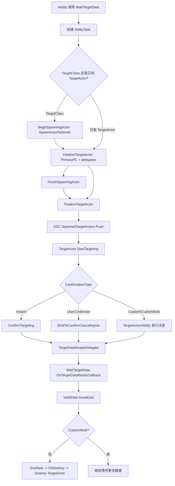
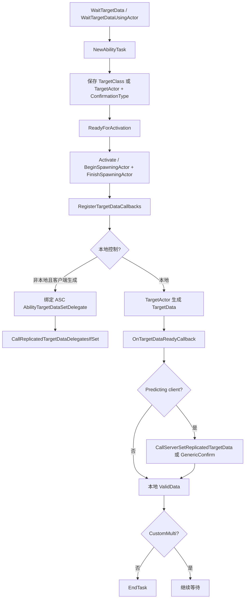
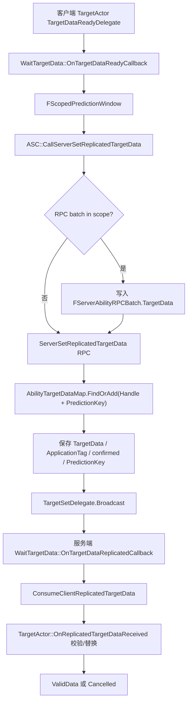
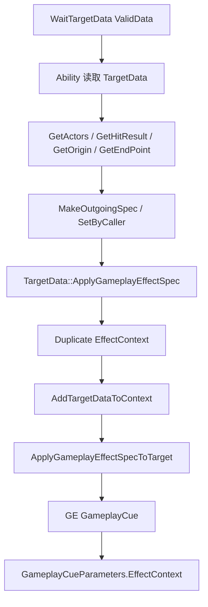

# GameplayAbilityTargetActor / TargetData / Targeting 体系（第十一轮）

本轮基于 GAS TargetActor、TargetData、WaitTargetData 与 VisualizeTargeting 源码整理。重点是：TargetActor 如何产生目标数据，`FGameplayAbilityTargetDataHandle` 如何承载和复制数据，`UAbilityTask_WaitTargetData` 如何把客户端选择结果传给服务端，以及 TargetData 如何衔接 GameplayEffect / GameplayCue。

## 一、类定位

- `AGameplayAbilityTargetActor` 是辅助 Ability 选目标的 Actor。源码注释明确它由 AbilityTask 生成，用来创建或确定传给后续任务的 targeting data；源码路径：`Engine/Plugins/Runtime/GameplayAbilities/Source/GameplayAbilities/Public/Abilities/GameplayAbilityTargetActor.h:19`。
- TargetActor 和 `UGameplayAbility` 的关系是：`StartTargeting(UGameplayAbility*)` 保存 `OwningAbility`，后续通过 Ability 的 `ActorInfo`、`SpecHandle`、`ActivationPredictionKey` 获取 ASC、PlayerController、Avatar 和 PredictionKey；源码路径：`Engine/Plugins/Runtime/GameplayAbilities/Source/GameplayAbilities/Private/Abilities/GameplayAbilityTargetActor.cpp:64`、`:85`、`:89`、`:173`。
- TargetActor 和 `UAbilityTask_WaitTargetData` 的关系是：WaitTargetData 创建或接收 TargetActor，初始化 `PrimaryPC`，绑定 `TargetDataReadyDelegate` / `CanceledDelegate`，并在 finalize 时调用 `StartTargeting`；源码路径：`Engine/Plugins/Runtime/GameplayAbilities/Source/GameplayAbilities/Private/Abilities/Tasks/AbilityTask_WaitTargetData.cpp:16`、`:25`、`:137`、`:145`、`:149`、`:160`。
- TargetActor 和 `FGameplayAbilityTargetDataHandle` 的关系是：TargetActor 的确认路径最终广播一个 `FGameplayAbilityTargetDataHandle`；基类默认广播空 handle，Trace / Radius 子类会生成 HitResult 或 ActorArray handle；源码路径：`Engine/Plugins/Runtime/GameplayAbilities/Source/GameplayAbilities/Private/Abilities/GameplayAbilityTargetActor.cpp:74`、`:79`、`Engine/Plugins/Runtime/GameplayAbilities/Source/GameplayAbilities/Private/Abilities/GameplayAbilityTargetActor_Trace.cpp:199`、`:205`、`Engine/Plugins/Runtime/GameplayAbilities/Source/GameplayAbilities/Private/Abilities/GameplayAbilityTargetActor_Radius.cpp:34`、`:40`。
- TargetActor 和 ASC 的关系是：ASC 保存当前 active targeting actors 到 `SpawnedTargetActors`，并提供 `TargetConfirm` / `TargetCancel` 遍历这些 actor；源码路径：`Engine/Plugins/Runtime/GameplayAbilities/Source/GameplayAbilities/Public/AbilitySystemComponent.h:1380`、`Engine/Plugins/Runtime/GameplayAbilities/Source/GameplayAbilities/Private/AbilitySystemComponent_Abilities.cpp:2955`、`:2981`。
- TargetActor 和 PredictionKey / TargetData RPC 的关系是：本地 TargetActor 数据 ready 后，WaitTargetData 创建 `FScopedPredictionWindow`，预测客户端用 `CallServerSetReplicatedTargetData` 或 generic confirm/cancel 把结果传给服务端；源码路径：`Engine/Plugins/Runtime/GameplayAbilities/Source/GameplayAbilities/Private/Abilities/Tasks/AbilityTask_WaitTargetData.cpp:280`、`:283`、`:288`、`:293`、`:317`、`:323`、`:328`。
- TargetActor 与 GameplayEffect 的关系是：TargetData 基类可把目标 Actor 解析为 ASC，并逐目标应用 GE Spec，同时把 TargetData 写入 EffectContext；源码路径：`Engine/Plugins/Runtime/GameplayAbilities/Source/GameplayAbilities/Private/GameplayAbilityTargetTypes.cpp:21`、`:36`、`:45`、`:47`。
- TargetActor 与 GameplayCue 的关系是间接关系：TargetData 写入 EffectContext 的 HitResult / Origin 后，GE 触发 Cue 时 `FGameplayCueParameters` 会携带 EffectContext；源码路径：`Engine/Plugins/Runtime/GameplayAbilities/Source/GameplayAbilities/Private/GameplayAbilityTargetTypes.cpp:54`、`:65`、`:70`、`Engine/Plugins/Runtime/GameplayAbilities/Source/GameplayAbilities/Private/AbilitySystemGlobals.cpp:420`、`:425`。
- TargetActor 是否应该承载复杂业务逻辑：源码注释明确默认 TargetActor 每次 Ability 激活都会 spawn，效率不高，并建议多数游戏重写或用游戏侧 Actor / Blueprint 避免 spawn 成本；开发实践推断：TargetActor 更适合“选目标/可视化/基础校验”，不适合承载伤害、资源消耗、结算等核心业务；源码依据：`Engine/Plugins/Runtime/GameplayAbilities/Source/GameplayAbilities/Public/Abilities/GameplayAbilityTargetActor.h:20`、`:22`、`:23`、`:24`。

## 二、核心类型分析

| 类型 | 定义位置 | 核心职责 | 创建 / 清理 | 是否复制 | 与 Ability / ASC / Prediction 的关系 | 业务层是否常用 |
| --- | --- | --- | --- | --- | --- | --- |
| `AGameplayAbilityTargetActor` | `Engine/Plugins/Runtime/GameplayAbilities/Source/GameplayAbilities/Public/Abilities/GameplayAbilityTargetActor.h:26` | TargetActor 抽象基类，负责选目标、确认、取消、广播 TargetData | WaitTargetData / VisualizeTargeting spawn 或接收已有 actor；确认或取消时可 destroy，Task `OnDestroy` 也 destroy；源码路径：`.../AbilityTask_WaitTargetData.cpp:75`、`:105`、`:358` | Actor 自身可复制；`StartLocation`、`SourceActor`、`bDebug`、`bDestroyOnConfirmation` 复制，`Filter` 被禁用复制；源码路径：`.../GameplayAbilityTargetActor.cpp:53`、`:56`、`:61` | 用 Ability 获取 ActorInfo / ASC / PredictionKey；ASC 保存 `SpawnedTargetActors` | 常通过蓝图/子类间接用；自定义时需谨慎 |
| `AGameplayAbilityTargetActor_Trace` | `Engine/Plugins/Runtime/GameplayAbilities/Source/GameplayAbilities/Public/Abilities/GameplayAbilityTargetActor_Trace.h:21` | Trace 类 TargetActor 基类，提供 filter trace、camera aim、reticle、tick 更新和 HitResult TargetData | 子类继承；确认时 `PerformTrace` 并生成 TargetData；源码路径：`.../GameplayAbilityTargetActor_Trace.cpp:199`、`:205` | 继承 TargetActor 复制字段；reticle replication 有特殊处理 | `StartTargeting` 从 Ability Avatar 设置 `SourceActor` | 常作为 trace 类自定义基类 |
| `AGameplayAbilityTargetActor_SingleLineTrace` | `Engine/Plugins/Runtime/GameplayAbilities/Source/GameplayAbilities/Public/Abilities/GameplayAbilityTargetActor_SingleLineTrace.h:13` | 单线追踪，输出 `SingleTargetHit` | `PerformTrace` 从 `StartLocation` 到 PlayerController aim 方向 trace；源码路径：`.../GameplayAbilityTargetActor_SingleLineTrace.cpp:19`、`:30`、`:32`、`:37` | TargetData 可复制 | 适合客户端预测目标点/命中点，但服务端仍应校验，开发实践推断 | 可直接用作简单单点目标 |
| `AGameplayAbilityTargetActor_GroundTrace` | `Engine/Plugins/Runtime/GameplayAbilities/Source/GameplayAbilities/Public/Abilities/GameplayAbilityTargetActor_GroundTrace.h:17` | 地面位置 trace，可用 sphere/capsule 形状调整合法落点 | Start 时构建 collision shape；确认只在 `bLastTraceWasGood` 时允许；源码路径：`.../GameplayAbilityTargetActor_GroundTrace.cpp:21`、`:24`、`:47`、`:143`、`:202` | TargetData 可复制 | 使用 PlayerController aim 和 collision profile 找地面点 | 适合地面 AOE / 放置类预览 |
| `AGameplayAbilityTargetActor_Radius` | `Engine/Plugins/Runtime/GameplayAbilities/Source/GameplayAbilities/Public/Abilities/GameplayAbilityTargetActor_Radius.h:16` | 以 StartLocation 为圆心收集半径内 Pawn | 构造时 `ShouldProduceTargetDataOnServer = true`；确认时 overlap pawn 并生成 ActorArray；源码路径：`.../GameplayAbilityTargetActor_Radius.cpp:20`、`:25`、`:34`、`:56`、`:65` | TargetData 可复制；默认倾向服务端生成 | 适合服务端范围收集；客户端结果不应盲信，开发实践推断 | 可作为范围选择参考 |
| `AGameplayAbilityTargetActor_ActorPlacement` | `Engine/Plugins/Runtime/GameplayAbilities/Source/GameplayAbilities/Public/Abilities/GameplayAbilityTargetActor_ActorPlacement.h:14` | GroundTrace 的放置预览子类，生成 actor visualization reticle | `StartTargeting` spawn 临时 visualization actor 和 reticle，EndPlay destroy reticle；源码路径：`.../GameplayAbilityTargetActor_ActorPlacement.cpp:20`、`:30`、`:33`、`:35`、`:37` | 放置的 `PlacedActorClass` 注释写 replication purpose not implemented yet | 主要是可视化，最终 TargetData 仍来自 GroundTrace | 适合学习/简单放置预览 |
| `FGameplayAbilityTargetData` | `Engine/Plugins/Runtime/GameplayAbilities/Source/GameplayAbilities/Public/Abilities/GameplayAbilityTargetTypes.h:70` | 多态 TargetData 基类，提供 GetActors / HitResult / Origin / EndPoint / GE 应用 / Context 写入接口 | 派生 struct new 出来后交给 handle 持有 | 通过 handle 多态 NetSerialize | Ability 读它；GE 应用和 EffectContext 写入依赖它 | 业务层通常通过 handle 和蓝图库间接用 |
| `FGameplayAbilityTargetDataHandle` | `Engine/Plugins/Runtime/GameplayAbilities/Source/GameplayAbilities/Public/Abilities/GameplayAbilityTargetTypes.h:192` | 持有多个 `TSharedPtr<FGameplayAbilityTargetData>`，避免蓝图复制大结构，并支持多态网络复制 | TargetActor / 蓝图库 / RPC 创建；`Clear` / `Append` 管理内容；源码路径：同文件`:211`、`:215`、`:244`、`:251` | 有 `NetSerialize` 和 Iris serializer；源码路径：同文件`:257`、`Engine/Plugins/Runtime/GameplayAbilities/Source/GameplayAbilities/Private/Serialization/GameplayAbilityTargetDataHandleNetSerializer.cpp:236` | TargetData RPC 的核心参数 | 业务层常读写，但不应直接改 `Data` |
| `FGameplayAbilityTargetData_ActorArray` | `Engine/Plugins/Runtime/GameplayAbilities/Source/GameplayAbilities/Public/Abilities/GameplayAbilityTargetTypes.h:448` | 保存一组目标 Actor 和 SourceLocation | Radius / 蓝图库 actor array 创建 | native NetSerialize，actor 数组上限用 `SafeNetSerializeTArray_Default<31>`；源码路径：`.../GameplayAbilityTargetTypes.cpp:314`、`:317` | GE 应用会取 actors 找 ASC | 常用 |
| `FGameplayAbilityTargetData_SingleTargetHit` | `Engine/Plugins/Runtime/GameplayAbilities/Source/GameplayAbilities/Public/Abilities/GameplayAbilityTargetTypes.h:550` | 保存一个 `FHitResult` | Trace / 蓝图库 HitResult 创建 | native NetSerialize；源码路径：`.../GameplayAbilityTargetTypes.cpp:323`、`:325` | HitResult 可进入 EffectContext / Cue | 常用 |
| `FGameplayAbilityTargetData_LocationInfo` | `Engine/Plugins/Runtime/GameplayAbilities/Source/GameplayAbilities/Public/Abilities/GameplayAbilityTargetTypes.h:380` | 保存 SourceLocation / TargetLocation 两个位置 | 蓝图库 `AbilityTargetDataFromLocations` 创建 | native NetSerialize；源码路径：`.../GameplayAbilityTargetTypes.cpp:305` | 适合只需要位置/方向的 Ability | 常用 |
| `FGameplayAbilityTargetingLocationInfo` | `Engine/Plugins/Runtime/GameplayAbilities/Source/GameplayAbilities/Public/Abilities/GameplayAbilityTargetTypes.h:306` | 以 Literal / Actor / Socket 三种方式描述 targeting transform | TargetActor StartLocation、LocationInfo TargetData 使用 | native NetSerialize；源码路径：`.../GameplayAbilityTargetTypes.cpp:280` | TargetActor 起点、TargetData origin/end 点来源 | 常用 |
| `UAbilityTask_WaitTargetData` | `Engine/Plugins/Runtime/GameplayAbilities/Source/GameplayAbilities/Public/Abilities/Tasks/AbilityTask_WaitTargetData.h:23` | 等待 TargetActor 返回 valid/cancel TargetData，并处理客户端到服务端复制 | Ability 创建 Task；非 CustomMulti 结束时 EndTask；OnDestroy destroy TargetActor | Task 本身不复制；通过 ASC RPC 复制 TargetData | TargetData 预测/RPC 的主入口 | Ability 蓝图常用 |
| `UAbilityTask_VisualizeTargeting` | `Engine/Plugins/Runtime/GameplayAbilities/Source/GameplayAbilities/Public/Abilities/Tasks/AbilityTask_VisualizeTargeting.h:16` | 只生成/使用 TargetActor 做可视化，到时间广播 `TimeElapsed` | Duration > 0 时设置 timer；OnDestroy destroy TargetActor 并清 timer；源码路径：`.../AbilityTask_VisualizeTargeting.cpp:111`、`:156`、`:168` | 不返回 TargetData | 可复用 TargetActor 做表现预览 | 可用于瞄准预览，不是正式选目标 |

## 三、TargetData 类型体系

| TargetData 类型 | 保存什么 | 读取接口 | 创建入口 | NetSerialize | BlueprintLibrary 对应 |
| --- | --- | --- | --- | --- | --- |
| `FGameplayAbilityTargetData` | 基类，不保存具体数据 | 默认 `GetActors` 空、`HasHitResult/Origin/EndPoint` false；源码路径：`Engine/Plugins/Runtime/GameplayAbilities/Source/GameplayAbilities/Public/Abilities/GameplayAbilityTargetTypes.h:87`、`:99`、`:111`、`:123` | 派生类创建 | 必须由 handle 序列化具体派生 struct | 不直接创建 |
| `FGameplayAbilityTargetDataHandle` | `TArray<TSharedPtr<FGameplayAbilityTargetData>>` | `Num`、`IsValid`、`Get`、`Add`、`Append`、`Clear`；源码路径：同文件`:211`、`:215`、`:220`、`:226`、`:232`、`:244`、`:251` | TargetActor、蓝图库、RPC | `NetSerialize` 保存 `UniqueId`、数量、ScriptStruct，再调用派生 struct native NetSerialize；源码路径：`Engine/Plugins/Runtime/GameplayAbilities/Source/GameplayAbilities/Private/GameplayAbilityTargetTypes.cpp:183`、`:208`、`:230` | `AppendTargetDataHandle`；源码路径：`Engine/Plugins/Runtime/GameplayAbilities/Source/GameplayAbilities/Private/AbilitySystemBlueprintLibrary.cpp:374` |
| `FGameplayAbilityTargetData_ActorArray` | SourceLocation + actor weak array | `GetActors`、`SetActors`、`GetOrigin`、`GetEndPoint` | Radius、`AbilityTargetDataFromActor`、`AbilityTargetDataFromActorArray` | `SourceLocation.NetSerialize` + actor array；源码路径：`Engine/Plugins/Runtime/GameplayAbilities/Source/GameplayAbilities/Private/GameplayAbilityTargetTypes.cpp:314` | `GetActorsFromTargetData`、`TargetDataHasActor`；源码路径：`Engine/Plugins/Runtime/GameplayAbilities/Source/GameplayAbilities/Private/AbilitySystemBlueprintLibrary.cpp:532`、`:592` |
| `FGameplayAbilityTargetData_SingleTargetHit` | 一个 `FHitResult` | `GetActors` 从 HitObjectHandle 取 actor，`GetHitResult`、`GetOrigin`、`GetEndPoint` | Trace、`AbilityTargetDataFromHitResult` | `HitResult.NetSerialize`；源码路径：`Engine/Plugins/Runtime/GameplayAbilities/Source/GameplayAbilities/Private/GameplayAbilityTargetTypes.cpp:323` | `GetHitResultFromTargetData`、`TargetDataHasHitResult`；源码路径：`Engine/Plugins/Runtime/GameplayAbilities/Source/GameplayAbilities/Private/AbilitySystemBlueprintLibrary.cpp:605`、`:618` |
| `FGameplayAbilityTargetData_LocationInfo` | SourceLocation + TargetLocation | `GetOrigin`、`GetEndPoint`、`GetEndPointTransform` | `AbilityTargetDataFromLocations` | 两个 location info 分别 NetSerialize；源码路径：`Engine/Plugins/Runtime/GameplayAbilities/Source/GameplayAbilities/Private/GameplayAbilityTargetTypes.cpp:305` | `GetTargetDataOrigin`、`GetTargetDataEndPoint`；源码路径：`Engine/Plugins/Runtime/GameplayAbilities/Source/GameplayAbilities/Private/AbilitySystemBlueprintLibrary.cpp:651`、`:691` |

- 多态序列化依赖 `UAbilitySystemGlobals::TargetDataStructCache` 保存 ScriptStruct，加载时按 struct size 分配并调用派生 struct native `NetSerialize`；源码路径：`Engine/Plugins/Runtime/GameplayAbilities/Source/GameplayAbilities/Private/GameplayAbilityTargetTypes.cpp:208`、`:222`、`:230`。
- 如果 TargetData 派生 struct 没有 `STRUCT_NetSerializeNative`，`FGameplayAbilityTargetDataHandle::NetSerialize` 会 Fatal；源码路径：`Engine/Plugins/Runtime/GameplayAbilities/Source/GameplayAbilities/Private/GameplayAbilityTargetTypes.cpp:230`、`:240`。
- `Engine/Plugins/Runtime/GameplayAbilities/Source/GameplayAbilities/Private/Abilities/GameplayAbilityTargetTypes.cpp` 未确认存在；UE5.6 当前实际实现路径是 `Engine/Plugins/Runtime/GameplayAbilities/Source/GameplayAbilities/Private/GameplayAbilityTargetTypes.cpp:1`。

## 四、TargetActor 生命周期



简化伪代码：

```cpp
Task = UAbilityTask_WaitTargetData::WaitTargetData(Ability, Name, ConfirmationType, TargetClass);
// K2 LatentAbilityCall 会调用 BeginSpawningActor / FinishSpawningActor
BeginSpawningActor(...)
{
    SpawnedActor = SpawnActorDeferred(TargetClass);
    InitializeTargetActor(SpawnedActor); // bind ready/cancel delegates
    RegisterTargetDataCallbacks();      // server waits for remote client data
}
FinishSpawningActor(...)
{
    SpawnedActor->FinishSpawning(ASC->GetOwner()->GetTransform());
    FinalizeTargetActor(SpawnedActor);  // StartTargeting + confirm/cancel mode
}
```

- `BeginSpawningActor` 只在 `ShouldSpawnTargetActor()` 为 true 时 deferred spawn，并初始化 TargetActor；源码路径：`Engine/Plugins/Runtime/GameplayAbilities/Source/GameplayAbilities/Private/Abilities/Tasks/AbilityTask_WaitTargetData.cpp:75`、`:81`、`:88`、`:95`。
- `FinishSpawningActor` 用 ASC owner transform 完成 spawn，并调用 `FinalizeTargetActor`；源码路径：`Engine/Plugins/Runtime/GameplayAbilities/Source/GameplayAbilities/Private/Abilities/Tasks/AbilityTask_WaitTargetData.cpp:105`、`:112`、`:114`、`:116`。
- `InitializeTargetActor` 绑定 TargetActor 的 ready/cancel delegate 到 Task；源码路径：`Engine/Plugins/Runtime/GameplayAbilities/Source/GameplayAbilities/Private/Abilities/Tasks/AbilityTask_WaitTargetData.cpp:137`、`:142`、`:145`、`:146`。
- `FinalizeTargetActor` 把 TargetActor 放入 ASC `SpawnedTargetActors`，调用 `StartTargeting`，然后按 `Instant` / `UserConfirmed` 处理确认；源码路径：`Engine/Plugins/Runtime/GameplayAbilities/Source/GameplayAbilities/Private/Abilities/Tasks/AbilityTask_WaitTargetData.cpp:149`、`:157`、`:160`、`:167`、`:171`。
- `OnDestroy` 会 destroy TargetActor；源码路径：`Engine/Plugins/Runtime/GameplayAbilities/Source/GameplayAbilities/Private/Abilities/Tasks/AbilityTask_WaitTargetData.cpp:358`、`:362`。

## 五、WaitTargetData 调用链



- 工厂函数 `WaitTargetData` 保存 `TargetClass`，`WaitTargetDataUsingActor` 保存已有 TargetActor；源码路径：`Engine/Plugins/Runtime/GameplayAbilities/Source/GameplayAbilities/Private/Abilities/Tasks/AbilityTask_WaitTargetData.cpp:16`、`:19`、`:25`、`:29`。
- `ShouldSpawnTargetActor` 的条件是 CDO replicates、本地控制、或 CDO `ShouldProduceTargetDataOnServer` 为 true；源码路径：`Engine/Plugins/Runtime/GameplayAbilities/Source/GameplayAbilities/Private/Abilities/Tasks/AbilityTask_WaitTargetData.cpp:120`、`:130`、`:131`、`:132`、`:134`。
- 远端服务端路径如果等待客户端 TargetData，会绑定 `AbilityTargetDataSetDelegate` / `AbilityTargetDataCancelledDelegate`，并调用 `CallReplicatedTargetDataDelegatesIfSet` 处理“数据先到、delegate 后绑”的情况；源码路径：`Engine/Plugins/Runtime/GameplayAbilities/Source/GameplayAbilities/Private/Abilities/Tasks/AbilityTask_WaitTargetData.cpp:179`、`:202`、`:211`、`:214`、`:216`。
- 本地 TargetData ready 时，如果是预测客户端且 TargetActor 不能在服务端生成数据，会通过 `CallServerSetReplicatedTargetData` 发送完整 TargetData；若服务端可生成，则 UserConfirmed 只发 generic confirm；源码路径：`Engine/Plugins/Runtime/GameplayAbilities/Source/GameplayAbilities/Private/Abilities/Tasks/AbilityTask_WaitTargetData.cpp:272`、`:280`、`:283`、`:285`、`:288`、`:290`、`:293`。
- 本地取消时，预测客户端根据是否服务端生成 TargetData 选择发送 `ServerSetReplicatedTargetDataCancelled` 或 generic cancel；源码路径：`Engine/Plugins/Runtime/GameplayAbilities/Source/GameplayAbilities/Private/Abilities/Tasks/AbilityTask_WaitTargetData.cpp:309`、`:317`、`:319`、`:321`、`:323`、`:328`。
- `CustomMulti` 不会在收到一次 valid data 后自动 `EndTask`；其他模式会结束；源码路径：`Engine/Plugins/Runtime/GameplayAbilities/Source/GameplayAbilities/Private/Abilities/Tasks/AbilityTask_WaitTargetData.cpp:255`、`:302`。

## 六、TargetData 网络复制流程



- TargetData 从客户端到服务端的 RPC 是 `ServerSetReplicatedTargetData`，参数包括 AbilityHandle、AbilityOriginalPredictionKey、TargetDataHandle、ApplicationTag、CurrentPredictionKey；源码路径：`Engine/Plugins/Runtime/GameplayAbilities/Source/GameplayAbilities/Public/AbilitySystemComponent.h:1599`、`:1601`。
- 服务端 RPC 中创建 `FScopedPredictionWindow(this, CurrentPredictionKey)`，按 `FGameplayAbilitySpecHandleAndPredictionKey` 写入 `AbilityTargetDataMap`，并广播 `TargetSetDelegate`；源码路径：`Engine/Plugins/Runtime/GameplayAbilities/Source/GameplayAbilities/Private/AbilitySystemComponent_Abilities.cpp:3945`、`:3947`、`:3950`、`:3962`、`:3968`。
- `AbilityTargetDataMap` 是 ASC 内部 replicated data cache，key 是 AbilitySpecHandle + PredictionKey；源码路径：`Engine/Plugins/Runtime/GameplayAbilities/Source/GameplayAbilities/Public/AbilitySystemComponent.h:1698`、`Engine/Plugins/Runtime/GameplayAbilities/Source/GameplayAbilities/Public/Abilities/GameplayAbilityTypes.h:500`、`:510`、`:516`。
- 如果 TargetData 先到、服务端 Task 后绑定，`CallReplicatedTargetDataDelegatesIfSet` 会用缓存的 prediction key 创建 scoped window 并补广播；源码路径：`Engine/Plugins/Runtime/GameplayAbilities/Source/GameplayAbilities/Private/AbilitySystemComponent_Abilities.cpp:4028`、`:4031`、`:4035`、`:4037`、`:4039`。
- `ConsumeClientReplicatedTargetData` 会清空缓存 TargetData，并重置 confirmed/cancelled 标记，避免重复触发；源码路径：`Engine/Plugins/Runtime/GameplayAbilities/Source/GameplayAbilities/Private/AbilitySystemComponent_Abilities.cpp:3838`、`:3843`、`:3844`、`:3845`。
- 服务端回调会先调用 `ConsumeClientReplicatedTargetData`，然后调用 TargetActor 的 `OnReplicatedTargetDataReceived` 做校验/替换；返回 false 时按取消处理；源码路径：`Engine/Plugins/Runtime/GameplayAbilities/Source/GameplayAbilities/Private/Abilities/Tasks/AbilityTask_WaitTargetData.cpp:222`、`:228`、`:240`、`:244`、`:251`。
- 取消流程使用 `ServerSetReplicatedTargetDataCancelled`，服务端标记 `bTargetCancelled` 并广播 `TargetCancelledDelegate`；源码路径：`Engine/Plugins/Runtime/GameplayAbilities/Source/GameplayAbilities/Public/AbilitySystemComponent.h:1603`、`:1605`、`Engine/Plugins/Runtime/GameplayAbilities/Source/GameplayAbilities/Private/AbilitySystemComponent_Abilities.cpp:3985`、`:3993`、`:3995`。
- RPC batch 会影响 TargetData 调用顺序：`CallServerSetReplicatedTargetData` 在 batch scope 内可能只写入 batch 的 `TargetData`，没有 batch 或 batch 未 started 时才直接发 RPC；源码路径：`Engine/Plugins/Runtime/GameplayAbilities/Source/GameplayAbilities/Private/AbilitySystemComponent_Abilities.cpp:4217`、`:4222`、`:4223`、`:4230`、`:4241`、`:4245`。

## 七、TargetActor 确认与取消模式

| 模式 | 源码含义 | 自动确认 | 绑定 Confirm / Cancel | 是否自动结束 WaitTargetData | 适合场景 | 常见坑 |
| --- | --- | --- | --- | --- | --- | --- |
| `Instant` | targeting 立即发生，不需要特殊逻辑或用户输入；源码路径：`Engine/Plugins/Runtime/GameplayAbilities/Source/GameplayAbilities/Public/Abilities/GameplayAbilityTargetTypes.h:31` | `FinalizeTargetActor` 立即 `ConfirmTargeting`；源码路径：`.../AbilityTask_WaitTargetData.cpp:167`、`:169` | 否 | 非 CustomMulti，所以 ready 后结束 | 瞬时 trace / 即点即发 | 以为还能等待玩家确认 |
| `UserConfirmed` | 用户确认后 targeting；源码路径：`Engine/Plugins/Runtime/GameplayAbilities/Source/GameplayAbilities/Public/Abilities/GameplayAbilityTargetTypes.h:34` | 否 | 是，调用 `BindToConfirmCancelInputs`；源码路径：`.../AbilityTask_WaitTargetData.cpp:171`、`:174` | 确认/取消后结束 | 瞄准后按确认键释放 | Confirm/Cancel 输入未绑定导致卡住 |
| `Custom` | GameplayTargeting Ability 自己决定数据何时 ready；并非所有 TargetActor 支持；源码路径：`Engine/Plugins/Runtime/GameplayAbilities/Source/GameplayAbilities/Public/Abilities/GameplayAbilityTargetTypes.h:37` | 否 | WaitTargetData 不自动绑定 | ready 后结束 | 自定义 UI / 鼠标点击 / 多步骤选择 | 没有手动调用 TargetActor confirm 或广播数据 |
| `CustomMulti` | 和 Custom 类似，但产生数据后不应销毁；源码路径：`Engine/Plugins/Runtime/GameplayAbilities/Source/GameplayAbilities/Public/Abilities/GameplayAbilityTargetTypes.h:40` | 否 | WaitTargetData 不自动绑定 | 不自动结束；源码路径：`Engine/Plugins/Runtime/GameplayAbilities/Source/GameplayAbilities/Private/Abilities/Tasks/AbilityTask_WaitTargetData.cpp:255`、`:302` | 连续锁定、持续画框、多次选择 | 误以为一次数据后 task 会结束，导致 Ability 常驻 |

## 八、Trace 类 TargetActor

简化流程：

```text
StartLocation.GetTargetingTransform()
    -> AimWithPlayerController 计算 TraceEnd
    -> LineTraceWithFilter / SweepWithFilter
    -> 更新 reticle / debug draw
    -> ConfirmTargetingAndContinue
    -> MakeTargetData(SingleTargetHit)
```

- `AGameplayAbilityTargetActor_Trace` 是 line-trace 类型 TargetActor 的中间基类，提供 `LineTraceWithFilter`、`SweepWithFilter`、`AimWithPlayerController`、`ClipCameraRayToAbilityRange`、`MakeTargetData`；源码路径：`Engine/Plugins/Runtime/GameplayAbilities/Source/GameplayAbilities/Public/Abilities/GameplayAbilityTargetActor_Trace.h:20`、`:30`、`:33`、`:35`、`:37`、`:58`。
- Trace 起点来自 `StartLocation.GetTargetingTransform().GetLocation()`；SingleLineTrace 和 GroundTrace 都这样取起点；源码路径：`Engine/Plugins/Runtime/GameplayAbilities/Source/GameplayAbilities/Private/Abilities/GameplayAbilityTargetActor_SingleLineTrace.cpp:30`、`Engine/Plugins/Runtime/GameplayAbilities/Source/GameplayAbilities/Private/Abilities/GameplayAbilityTargetActor_GroundTrace.cpp:151`。
- Trace 终点由 PlayerController 的 view point 和 MaxRange 计算，并通过 `ClipCameraRayToAbilityRange` 限制到 ability range；源码路径：`Engine/Plugins/Runtime/GameplayAbilities/Source/GameplayAbilities/Private/Abilities/GameplayAbilityTargetActor_Trace.cpp:90`、`:95`、`:98`、`:100`、`:131`。
- Trace profile 是 `FCollisionProfileName TraceProfile`，filter 通过 `FGameplayTargetDataFilterHandle` 手动过滤 hit actor；源码路径：`Engine/Plugins/Runtime/GameplayAbilities/Source/GameplayAbilities/Public/Abilities/GameplayAbilityTargetActor_Trace.h:48`、`Engine/Plugins/Runtime/GameplayAbilities/Source/GameplayAbilities/Private/Abilities/GameplayAbilityTargetActor_Trace.cpp:37`、`:51`、`:60`、`:74`。
- SingleLineTrace 没命中时会把 `ReturnHitResult.Location` 设为 TraceEnd；源码路径：`Engine/Plugins/Runtime/GameplayAbilities/Source/GameplayAbilities/Private/Abilities/GameplayAbilityTargetActor_SingleLineTrace.cpp:36`、`:39`、`:41`。
- GroundTrace 会先沿 aim line 找点，再向下 trace 地面；如果配置了 sphere/capsule，会调整 collision 结果；`IsConfirmTargetingAllowed` 返回 `bLastTraceWasGood`；源码路径：`Engine/Plugins/Runtime/GameplayAbilities/Source/GameplayAbilities/Private/Abilities/GameplayAbilityTargetActor_GroundTrace.cpp:157`、`:167`、`:171`、`:177`、`:183`、`:202`。
- Debug draw 由 `bDebug` 控制，SingleLineTrace / GroundTrace / Trace tick 都有 draw path；源码路径：`Engine/Plugins/Runtime/GameplayAbilities/Source/GameplayAbilities/Private/Abilities/GameplayAbilityTargetActor_SingleLineTrace.cpp:55`、`Engine/Plugins/Runtime/GameplayAbilities/Source/GameplayAbilities/Private/Abilities/GameplayAbilityTargetActor_GroundTrace.cpp:56`、`Engine/Plugins/Runtime/GameplayAbilities/Source/GameplayAbilities/Private/Abilities/GameplayAbilityTargetActor_Trace.cpp:188`。
- 是否适合客户端预测目标选择：源码确认 AimWithPlayerController 注释写 server 和 launching client only；开发实践推断，客户端可用于预测手感，但服务端应重算或校验关键结果；源码路径：`Engine/Plugins/Runtime/GameplayAbilities/Source/GameplayAbilities/Private/Abilities/GameplayAbilityTargetActor_Trace.cpp:83`、`:85`、`Engine/Plugins/Runtime/GameplayAbilities/Source/GameplayAbilities/Private/Abilities/Tasks/AbilityTask_WaitTargetData.cpp:231`。

## 九、Radius / ActorPlacement 类 TargetActor

- `AGameplayAbilityTargetActor_Radius` 选择 source 起点半径内所有 Pawn，并用 filter 过滤；源码路径：`Engine/Plugins/Runtime/GameplayAbilities/Source/GameplayAbilities/Public/Abilities/GameplayAbilityTargetActor_Radius.h:15`、`Engine/Plugins/Runtime/GameplayAbilities/Source/GameplayAbilities/Private/Abilities/GameplayAbilityTargetActor_Radius.cpp:56`、`:65`、`:72`、`:73`。
- Radius 构造函数把 `ShouldProduceTargetDataOnServer` 设为 true，说明它默认倾向服务端自己生成范围结果；源码路径：`Engine/Plugins/Runtime/GameplayAbilities/Source/GameplayAbilities/Private/Abilities/GameplayAbilityTargetActor_Radius.cpp:20`、`:25`。
- Radius 的 TargetData 是 `StartLocation.MakeTargetDataHandleFromActors(Actors, false)`，即一个 ActorArray handle；源码路径：`Engine/Plugins/Runtime/GameplayAbilities/Source/GameplayAbilities/Private/Abilities/GameplayAbilityTargetActor_Radius.cpp:45`、`:50`。
- `AGameplayAbilityTargetActor_ActorPlacement` 继承 GroundTrace，`PlacedActorClass` 注释明确 “replication purposes. (Not implemented yet)”；源码路径：`Engine/Plugins/Runtime/GameplayAbilities/Source/GameplayAbilities/Public/Abilities/GameplayAbilityTargetActor_ActorPlacement.h:14`、`:25`。
- ActorPlacement 的 `StartTargeting` 会临时 spawn `PlacedActorClass` 和 `AGameplayAbilityWorldReticle_ActorVisualization`，初始化可视化后销毁临时 actor；源码路径：`Engine/Plugins/Runtime/GameplayAbilities/Source/GameplayAbilities/Private/Abilities/GameplayAbilityTargetActor_ActorPlacement.cpp:30`、`:33`、`:35`、`:36`、`:37`。
- 是否只适合示例用途：源码没有直接写“只适合示例”，但 TargetActor 基类和 WaitTargetData 注释都提示默认 spawn-per-activation 效率不好、内部游戏未充分测试；因此开发实践推断这些内置类更适合学习、原型和简单玩法，正式项目常需要重写；源码路径：`Engine/Plugins/Runtime/GameplayAbilities/Source/GameplayAbilities/Public/Abilities/GameplayAbilityTargetActor.h:22`、`:24`、`Engine/Plugins/Runtime/GameplayAbilities/Source/GameplayAbilities/Public/Abilities/Tasks/AbilityTask_WaitTargetData.h:19`、`:21`。

## 十、VisualizeTargeting

- `UAbilityTask_VisualizeTargeting` 和 WaitTargetData 的区别是：它只 spawn 或接收 TargetActor 做 visualization，并在时间到后广播 `TimeElapsed`；它没有 `ValidData` / `Cancelled` TargetData 输出；源码路径：`Engine/Plugins/Runtime/GameplayAbilities/Source/GameplayAbilities/Public/Abilities/Tasks/AbilityTask_VisualizeTargeting.h:21`、`:26`、`:30`。
- VisualizeTargeting 也有 TargetClass 和已有 TargetActor 两种模式；源码路径：`Engine/Plugins/Runtime/GameplayAbilities/Source/GameplayAbilities/Private/Abilities/Tasks/AbilityTask_VisualizeTargeting.cpp:17`、`:26`。
- `SetDuration` 只在 Duration > 0 时设置 timer；timer 回调 `OnTimeElapsed` 广播并 EndTask；源码路径：`Engine/Plugins/Runtime/GameplayAbilities/Source/GameplayAbilities/Private/Abilities/Tasks/AbilityTask_VisualizeTargeting.cpp:111`、`:113`、`:115`、`:168`、`:172`、`:174`。
- 它会在 finalize 时把 TargetActor push 到 ASC `SpawnedTargetActors` 并调用 `StartTargeting`；源码路径：`Engine/Plugins/Runtime/GameplayAbilities/Source/GameplayAbilities/Private/Abilities/Tasks/AbilityTask_VisualizeTargeting.cpp:143`、`:150`、`:153`。
- 常见坑：把 VisualizeTargeting 当成真正选目标逻辑。源码确认它没有 TargetData delegate，开发实践推断正式目标确认应使用 WaitTargetData 或项目自定义流程；源码路径：`Engine/Plugins/Runtime/GameplayAbilities/Source/GameplayAbilities/Public/Abilities/Tasks/AbilityTask_VisualizeTargeting.h:21`、`Engine/Plugins/Runtime/GameplayAbilities/Source/GameplayAbilities/Public/Abilities/Tasks/AbilityTask_WaitTargetData.h:28`。

## 十一、TargetData 与 GameplayEffect / GameplayCue 的衔接



- Ability 可以直接从 `FGameplayAbilityTargetDataHandle` 中按 index 读取 actor、hit result、origin、endpoint；源码路径：`Engine/Plugins/Runtime/GameplayAbilities/Source/GameplayAbilities/Private/AbilitySystemBlueprintLibrary.cpp:532`、`:618`、`:651`、`:691`。
- `FGameplayAbilityTargetData::ApplyGameplayEffectSpec` 会取 target actors，找每个 actor 的 ASC，复制 GE Spec 和 EffectContext，调用 `AddTargetDataToContext`，再由 instigator ASC 应用到目标 ASC；源码路径：`Engine/Plugins/Runtime/GameplayAbilities/Source/GameplayAbilities/Private/GameplayAbilityTargetTypes.cpp:21`、`:30`、`:36`、`:41`、`:45`、`:47`。
- `AddTargetDataToContext` 可把 actors、HitResult、Origin 写入 EffectContext；源码路径：`Engine/Plugins/Runtime/GameplayAbilities/Source/GameplayAbilities/Private/GameplayAbilityTargetTypes.cpp:54`、`:56`、`:61`、`:65`、`:67`、`:70`、`:72`。
- `FGameplayEffectContext::AddHitResult` 会保存 HitResult，并在没有 world origin 时把 origin 设成 `HitResult.TraceStart`；源码路径：`Engine/Plugins/Runtime/GameplayAbilities/Source/GameplayAbilities/Private/GameplayEffectTypes.cpp:221`、`:230`、`:231`、`:233`。
- GameplayCueParameters 保存 EffectContext，且 Cue 参数字段包括 Location / Normal / Instigator / EffectCauser / SourceObject；源码路径：`Engine/Plugins/Runtime/GameplayAbilities/Source/GameplayAbilities/Public/GameplayEffectTypes.h:865`、`:887`、`:891`、`:895`、`:899`、`:903`、`Engine/Plugins/Runtime/GameplayAbilities/Source/GameplayAbilities/Private/AbilitySystemGlobals.cpp:420`、`:425`。
- TargetData 是否应该直接承载伤害数值：源码中 TargetData 负责目标 actor / hit / location / origin，并能应用 GE；伤害数值通常由 GE Spec、SetByCaller、Modifier / Execution 处理。开发实践推断：TargetData 不宜承载伤害结算核心数值，避免目标选择和战斗结算耦合；源码依据：`Engine/Plugins/Runtime/GameplayAbilities/Source/GameplayAbilities/Public/Abilities/GameplayAbilityTargetTypes.h:46`、`:60`、`Engine/Plugins/Runtime/GameplayAbilities/Source/GameplayAbilities/Private/GameplayAbilityTargetTypes.cpp:21`。

## 十二、TargetData 与蓝图辅助 API

| API | 对应 TargetData 类型 | 用途 | 需要先检查有效性吗 | 源码路径 |
| --- | --- | --- | --- | --- |
| `AbilityTargetDataFromActor` | `FGameplayAbilityTargetData_ActorArray` | 单 actor target data | 读取前建议 `TargetDataHasActor` | `Engine/Plugins/Runtime/GameplayAbilities/Source/GameplayAbilities/Private/AbilitySystemBlueprintLibrary.cpp:393` |
| `AbilityTargetDataFromActorArray` | `FGameplayAbilityTargetData_ActorArray`，可 one target per handle | actor 数组 target data | 读取前建议 `GetDataCountFromTargetData` / `TargetDataHasActor` | `Engine/Plugins/Runtime/GameplayAbilities/Source/GameplayAbilities/Private/AbilitySystemBlueprintLibrary.cpp:401`、`:404`、`:419` |
| `AbilityTargetDataFromHitResult` | `FGameplayAbilityTargetData_SingleTargetHit` | 从 HitResult 构造 target data | 读取前建议 `TargetDataHasHitResult` | `Engine/Plugins/Runtime/GameplayAbilities/Source/GameplayAbilities/Private/AbilitySystemBlueprintLibrary.cpp:515` |
| `AbilityTargetDataFromLocations` | `FGameplayAbilityTargetData_LocationInfo` | Source/Target 位置 target data | 读取前建议 `TargetDataHasOrigin` / `TargetDataHasEndPoint` | `Engine/Plugins/Runtime/GameplayAbilities/Source/GameplayAbilities/Private/AbilitySystemBlueprintLibrary.cpp:380` |
| `GetActorsFromTargetData` | ActorArray 或 SingleTargetHit 派生结果 | 取 index 对应 actors | 是，可能返回空数组 | `Engine/Plugins/Runtime/GameplayAbilities/Source/GameplayAbilities/Private/AbilitySystemBlueprintLibrary.cpp:532` |
| `GetHitResultFromTargetData` | SingleTargetHit | 取 HitResult，失败返回默认 HitResult | 是 | `Engine/Plugins/Runtime/GameplayAbilities/Source/GameplayAbilities/Private/AbilitySystemBlueprintLibrary.cpp:618`、`:633` |
| `GetTargetDataOrigin` | LocationInfo / ActorArray / HitResult | 取 origin transform | 是 | `Engine/Plugins/Runtime/GameplayAbilities/Source/GameplayAbilities/Private/AbilitySystemBlueprintLibrary.cpp:651` |
| `GetTargetDataEndPoint` | LocationInfo / ActorArray / HitResult | 取 endpoint | 是 | `Engine/Plugins/Runtime/GameplayAbilities/Source/GameplayAbilities/Private/AbilitySystemBlueprintLibrary.cpp:691` |
| `TargetDataHasActor` | 任意 TargetData | 检查 actor 数量 > 0 | 这是检查入口 | `Engine/Plugins/Runtime/GameplayAbilities/Source/GameplayAbilities/Private/AbilitySystemBlueprintLibrary.cpp:592` |
| `TargetDataHasHitResult` | 任意 TargetData | 检查是否可取 HitResult | 这是检查入口 | `Engine/Plugins/Runtime/GameplayAbilities/Source/GameplayAbilities/Private/AbilitySystemBlueprintLibrary.cpp:605` |
| `TargetDataHasOrigin` | 任意 TargetData | 检查 origin / hit result | 这是检查入口 | `Engine/Plugins/Runtime/GameplayAbilities/Source/GameplayAbilities/Private/AbilitySystemBlueprintLibrary.cpp:636` |
| `TargetDataHasEndPoint` | 任意 TargetData | 检查 endpoint / hit result | 这是检查入口 | `Engine/Plugins/Runtime/GameplayAbilities/Source/GameplayAbilities/Private/AbilitySystemBlueprintLibrary.cpp:678` |
| `AppendTargetDataHandle` | handle 组合 | 拼接 handle | 拼接后仍需按 index 检查 | `Engine/Plugins/Runtime/GameplayAbilities/Source/GameplayAbilities/Private/AbilitySystemBlueprintLibrary.cpp:374` |
| `FilterTargetData` | 复制已有 TargetData 并过滤 actors | 对 actor target 做过滤 | 过滤后可能为空 | `Engine/Plugins/Runtime/GameplayAbilities/Source/GameplayAbilities/Private/AbilitySystemBlueprintLibrary.cpp:430`、`:441`、`:453` |

## 十三、Targeting 体系与前十轮文档的衔接

| 前序主题 | Targeting 衔接 | 源码路径 |
| --- | --- | --- |
| ASC | ASC 保存 `SpawnedTargetActors`、处理 confirm/cancel 输入、缓存 TargetData RPC | `Engine/Plugins/Runtime/GameplayAbilities/Source/GameplayAbilities/Public/AbilitySystemComponent.h:1382`、`:1413`、`:1414`、`:1699` |
| Ability 生命周期 | Ability 激活后启动 WaitTargetData，TargetActor 用 Ability 的 ActorInfo / PredictionKey | `Engine/Plugins/Runtime/GameplayAbilities/Source/GameplayAbilities/Private/Abilities/GameplayAbilityTargetActor.cpp:64`、`:85`、`:173` |
| AbilityTask | WaitTargetData 是 AbilityTask，负责创建 TargetActor、绑定 delegate、结束清理 | `Engine/Plugins/Runtime/GameplayAbilities/Source/GameplayAbilities/Public/Abilities/Tasks/AbilityTask_WaitTargetData.h:23`、`:28`、`:31`、`:76` |
| GameplayEffect | TargetData 可逐目标应用 GE Spec，并写入 EffectContext | `Engine/Plugins/Runtime/GameplayAbilities/Source/GameplayAbilities/Private/GameplayAbilityTargetTypes.cpp:21`、`:45`、`:47` |
| GameplayCue | TargetData 写入 EffectContext 后，Cue 参数携带 EffectContext / HitResult 信息 | `Engine/Plugins/Runtime/GameplayAbilities/Source/GameplayAbilities/Private/GameplayAbilityTargetTypes.cpp:65`、`Engine/Plugins/Runtime/GameplayAbilities/Source/GameplayAbilities/Private/AbilitySystemGlobals.cpp:420` |
| 网络预测 / RPC | TargetData RPC 使用 AbilityHandle + PredictionKey 缓存，并支持 batch | `Engine/Plugins/Runtime/GameplayAbilities/Source/GameplayAbilities/Private/AbilitySystemComponent_Abilities.cpp:3945`、`:3950`、`:4217` |
| BlueprintLibrary | 蓝图库创建/读取/过滤 TargetData | `Engine/Plugins/Runtime/GameplayAbilities/Source/GameplayAbilities/Public/AbilitySystemBlueprintLibrary.h:218`、`:222`、`:226`、`:234`、`:238`、`:242` |
| Editor / K2 节点 | WaitTargetData 的 class 模式依赖 BeginSpawningActor / FinishSpawningActor 约定，被 latent K2 节点展开 | `Engine/Plugins/Runtime/GameplayAbilities/Source/GameplayAbilities/Public/Abilities/Tasks/AbilityTask_WaitTargetData.h:95`、`:98`、`:100`、`:101` |

## 十四、常见坑

本轮坑点已补充到 `pitfalls.md` 的“常见坑：GameplayAbilityTargetActor / TargetData / Targeting 体系（第十一轮）”小节。重点包括 TargetActor 不确认/不取消、服务端没收到 TargetData、PredictionKey 不匹配、没有 consume、CustomMulti 不结束、HitResult 未进入 EffectContext、客户端 trace / radius 结果缺少服务端校验、VisualizeTargeting 被误用成真正选目标等。

## 十五、TargetData / TargetActor 速查

- 用 WaitTargetData：当 Ability 需要等待玩家瞄准、点击地面、选择 actor、确认/取消或把客户端选择结果发到服务端；源码路径：`Engine/Plugins/Runtime/GameplayAbilities/Source/GameplayAbilities/Public/Abilities/Tasks/AbilityTask_WaitTargetData.h:16`、`:46`。
- 自定义 TargetActor：当内置 Trace / Radius / GroundTrace 不满足项目目标选择、校验或表现需求；默认 TargetActor spawn-per-activation 成本高，源码建议多数游戏重写；源码路径：`Engine/Plugins/Runtime/GameplayAbilities/Source/GameplayAbilities/Public/Abilities/GameplayAbilityTargetActor.h:22`、`:23`。
- 只用 BlueprintLibrary 创建 TargetData：当目标已经由投射物命中、UI 选择、服务器逻辑或其他系统算好，只需要包装成 TargetDataHandle；源码路径：`Engine/Plugins/Runtime/GameplayAbilities/Source/GameplayAbilities/Private/AbilitySystemBlueprintLibrary.cpp:393`、`:401`、`:515`、`:380`。
- ActorArray / SingleTargetHit / LocationInfo 选择：目标 actor 列表用 ActorArray，命中点/物理材质/impact 信息用 SingleTargetHit，纯 source/target transform 用 LocationInfo；源码路径：`Engine/Plugins/Runtime/GameplayAbilities/Source/GameplayAbilities/Public/Abilities/GameplayAbilityTargetTypes.h:448`、`:550`、`:380`。
- Trace / GroundTrace / Radius / ActorPlacement 选择：直线命中用 SingleLineTrace，地面点/放置类用 GroundTrace，范围 actor 收集用 Radius，放置预览用 ActorPlacement；源码路径：`Engine/Plugins/Runtime/GameplayAbilities/Source/GameplayAbilities/Public/Abilities/GameplayAbilityTargetActor_SingleLineTrace.h:13`、`Engine/Plugins/Runtime/GameplayAbilities/Source/GameplayAbilities/Public/Abilities/GameplayAbilityTargetActor_GroundTrace.h:17`、`Engine/Plugins/Runtime/GameplayAbilities/Source/GameplayAbilities/Public/Abilities/GameplayAbilityTargetActor_Radius.h:15`、`Engine/Plugins/Runtime/GameplayAbilities/Source/GameplayAbilities/Public/Abilities/GameplayAbilityTargetActor_ActorPlacement.h:14`。
- 客户端预测 TargetData 必查：ActivationPredictionKey、`CallServerSetReplicatedTargetData`、TargetData native NetSerialize、服务端是否绑定 delegate、是否 `ConsumeClientReplicatedTargetData`；源码路径：`Engine/Plugins/Runtime/GameplayAbilities/Source/GameplayAbilities/Private/Abilities/Tasks/AbilityTask_WaitTargetData.cpp:280`、`:288`、`Engine/Plugins/Runtime/GameplayAbilities/Source/GameplayAbilities/Private/GameplayAbilityTargetTypes.cpp:183`、`Engine/Plugins/Runtime/GameplayAbilities/Source/GameplayAbilities/Private/AbilitySystemComponent_Abilities.cpp:3838`。
- 服务端校验 TargetData 必查：`ServerSetReplicatedTargetData_Validate` 只检查 TargetData item 有效，项目级合法性应放在 TargetActor `OnReplicatedTargetDataReceived` 或服务端 Ability 逻辑中；源码路径：`Engine/Plugins/Runtime/GameplayAbilities/Source/GameplayAbilities/Private/AbilitySystemComponent_Abilities.cpp:3971`、`:3974`、`Engine/Plugins/Runtime/GameplayAbilities/Source/GameplayAbilities/Private/Abilities/Tasks/AbilityTask_WaitTargetData.cpp:231`、`:240`。
- TargetData 应用 GE 推荐流程：WaitTargetData `ValidData` -> 读取 / 过滤 TargetData -> MakeOutgoingSpec / SetByCaller -> 对 target ASC 应用 GE，或使用 TargetData 的 `ApplyGameplayEffectSpec`；源码路径：`Engine/Plugins/Runtime/GameplayAbilities/Source/GameplayAbilities/Private/GameplayAbilityTargetTypes.cpp:21`、`:36`、`:47`。
- TargetData 驱动 GameplayCue 位置推荐流程：把 HitResult / Origin 写入 EffectContext，再让 GE / Cue 从 EffectContext 初始化 CueParameters；源码路径：`Engine/Plugins/Runtime/GameplayAbilities/Source/GameplayAbilities/Private/GameplayAbilityTargetTypes.cpp:65`、`:72`、`Engine/Plugins/Runtime/GameplayAbilities/Source/GameplayAbilities/Private/AbilitySystemGlobals.cpp:420`。

## 十六、本轮未确认

- 用户给出的 `Engine/Plugins/Runtime/GameplayAbilities/Source/GameplayAbilities/Private/Abilities/GameplayAbilityTargetTypes.cpp` 当前未确认存在；实际实现路径是 `Engine/Plugins/Runtime/GameplayAbilities/Source/GameplayAbilities/Private/GameplayAbilityTargetTypes.cpp:1`。
- 内置 TargetActor 子类之外的项目级 Targeting 校验策略未确认；源码只确认 `OnReplicatedTargetDataReceived` 是校验/替换扩展点；源码路径：`Engine/Plugins/Runtime/GameplayAbilities/Source/GameplayAbilities/Public/Abilities/GameplayAbilityTargetActor.h:64`。
- `AGameplayAbilityTargetActor_ActorPlacement` 的复制目的注释写 “Not implemented yet”，因此放置 actor 复制支持未确认；源码路径：`Engine/Plugins/Runtime/GameplayAbilities/Source/GameplayAbilities/Public/Abilities/GameplayAbilityTargetActor_ActorPlacement.h:25`。
- 完整 UE Collision 底层、Navigation 投射、复杂 TargetActor 池化方案不在本轮范围内，未确认。
