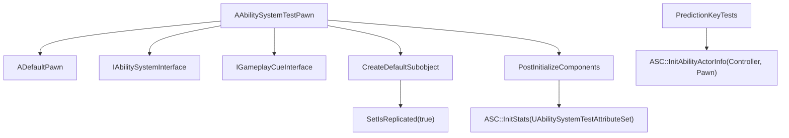

# GAS Tests / 官方测试用例反推实践（第十五轮）

本文件只分析 GameplayAbilities 自带测试代码与测试辅助类，用于校验前 14 轮结论。测试代码不是业务模板；凡是从测试写法反推项目实践的内容，均标注“开发实践推断”。

## 一、测试目录总览

当前 `Private/Tests` 实际扫描到的文件：

| 文件 | Automation 类型 | 主要覆盖 | TestWorld / TestPawn / TestAttributeSet | 关键覆盖 | 未覆盖 / 未确认 |
|---|---|---|---|---|---|
| `GameplayEffectTests.cpp` | 自定义 `FAutomationTestBase`，注册 `FGameplayEffectsTest` | GE 应用、Attribute、Aggregator、Stacking、SetByCaller、GameplayCue | 创建 `UWorld`，Spawn `AAbilitySystemTestPawn`，使用 `UAbilitySystemTestAttributeSet` | Instant/Infinite/Periodic GE、modifier op、stack limit、SetByCaller duration、Cue direct/GE API、ReplicationMode 下 cue 行为 | GEComponents、ExecutionCalculation、MMC、Attribute Capture 专项、TargetData 未覆盖；源码路径：`Engine/Plugins/Runtime/GameplayAbilities/Source/GameplayAbilities/Private/Tests/GameplayEffectTests.cpp:83`、`:126`、`:194`、`:281`、`:357`、`:679`、`:790` |
| `AbilitySystemComponentTests.cpp` | 自定义 `FAutomationTestBase`，注册 `FAbilitySystemComponentTest` | ASC Ability 基础激活/失败回调 | 创建 `UWorld`，Spawn Source/Dest TestPawn，Source 拥有 Controller | GiveAbility、GetAllAbilities、TryActivateAbility、CancelAbilityHandle、activation inhibited failure | Cost/Cooldown、AbilityTask、Tag requirements、网络 RPC 未覆盖；源码路径：`Engine/Plugins/Runtime/GameplayAbilities/Source/GameplayAbilities/Private/Tests/AbilitySystemComponentTests.cpp:98`、`:132`、`:172`、`:243` |
| `PredictionKeyTests.cpp` | `IMPLEMENT_SIMPLE_AUTOMATION_TEST` | PredictionKey 依赖链与 scoped prediction window | `FTestWorldWrapper` + `AAbilitySystemTestPawn` + `APlayerController` | dependent key accept/reject/catch-up、`FScopedPredictionWindow`、`FScopedDiscardPredictions` | Ability 激活 RPC、TargetData RPC、ActiveGE replication 未覆盖；源码路径：`Engine/Plugins/Runtime/GameplayAbilities/Source/GameplayAbilities/Private/Tests/PredictionKeyTests.cpp:15`、`:62`、`:83`、`:88`、`:432`、`:476` |
| `GameplayTagCountContainerTests.cpp` | `IMPLEMENT_SIMPLE_AUTOMATION_TEST` | `FGameplayTagCountContainer` count 与父 tag 语义 | 不使用 TestPawn | explicit count、parent count、HasAll/HasAny/HasMatching | ASC Loose/ReplicatedLoose/Minimal tags 未覆盖；源码路径：`Engine/Plugins/Runtime/GameplayAbilities/Source/GameplayAbilities/Private/Tests/GameplayTagCountContainerTests.cpp:5`、`:16`、`:21`、`:33`、`:46`、`:55` |
| `GameplayTagQueryTests.cpp` | `IMPLEMENT_SIMPLE_AUTOMATION_TEST` | `FGameplayTagRequirements` 与 `FGameplayTagQuery` 规则等价性 | 不使用 TestPawn | 随机场景比较 `RequirementsMet` 与 Query `Matches` 结果 | Ability tag requirements 的 ASC/Ability 激活接入未覆盖；源码路径：`Engine/Plugins/Runtime/GameplayAbilities/Source/GameplayAbilities/Private/Tests/GameplayTagQueryTests.cpp:9`、`:17`、`:73`、`:98`、`:116` |
| `GameplayCueTests.h` | 测试辅助类，不是 cpp automation | `UGameplayCueNotify_Static` 计数器 | 由 `GameplayEffectTests.cpp` 使用 | OnExecute/OnActive/WhileActive/OnRemove 调用计数 | 资产扫描/异步加载未覆盖；源码路径：`Engine/Plugins/Runtime/GameplayAbilities/Source/GameplayAbilities/Private/Tests/GameplayCueTests.h:13`、`:16`、`:24`、`:27`、`:30`、`:33` |

当前目录未发现这些文件，标记为未确认：

- `Engine/Plugins/Runtime/GameplayAbilities/Source/GameplayAbilities/Private/Tests/GameplayEffectsTest.cpp`：未确认，当前实际文件名是 `GameplayEffectTests.cpp`。
- `Engine/Plugins/Runtime/GameplayAbilities/Source/GameplayAbilities/Private/Tests/GameplayAbilitiesTest.cpp`：未确认。
- `Engine/Plugins/Runtime/GameplayAbilities/Source/GameplayAbilities/Private/Tests/GameplayCueTests.cpp`：未确认，当前只有 `GameplayCueTests.h`。
- `Engine/Plugins/Runtime/GameplayAbilities/Source/GameplayAbilities/Private/Tests/GameplayAbilityTargetingTests.cpp`：未确认。

## 二、AbilitySystemTestPawn 分析



简化伪代码：

```cpp
AAbilitySystemTestPawn::AAbilitySystemTestPawn()
{
    AbilitySystemComponent = CreateDefaultSubobject<UAbilitySystemComponent>("AbilitySystemComponent0");
    AbilitySystemComponent->SetIsReplicated(true);
}

PostInitializeComponents()
{
    Super::PostInitializeComponents();
    AbilitySystemComponent->InitStats(UAbilitySystemTestAttributeSet::StaticClass(), nullptr);
}
```

源码确认：

- `AAbilitySystemTestPawn` 继承 `ADefaultPawn`，实现 `IGameplayCueInterface` 与 `IAbilitySystemInterface`；源码路径：`Engine/Plugins/Runtime/GameplayAbilities/Source/GameplayAbilities/Public/AbilitySystemTestPawn.h:17`。
- 构造函数创建 `UAbilitySystemComponent` 默认子对象，并调用 `SetIsReplicated(true)`；源码路径：`Engine/Plugins/Runtime/GameplayAbilities/Source/GameplayAbilities/Private/AbilitySystemTestPawn.cpp:14`、`:15`。
- `PostInitializeComponents` 调用 `AbilitySystemComponent->InitStats(UAbilitySystemTestAttributeSet::StaticClass(), NULL)`，把测试 AttributeSet 接入 ASC；源码路径：`Engine/Plugins/Runtime/GameplayAbilities/Source/GameplayAbilities/Private/AbilitySystemTestPawn.cpp:20`、`:25`。
- `GetAbilitySystemComponent()` 通过 `FindComponentByClass<UAbilitySystemComponent>()` 返回 ASC；源码路径：`Engine/Plugins/Runtime/GameplayAbilities/Source/GameplayAbilities/Private/AbilitySystemTestPawn.cpp:35`。
- TestPawn 自身没有在 `PostInitializeComponents` 中调用 `InitAbilityActorInfo`；PredictionKey 测试手动调用 `SourceASC->InitAbilityActorInfo(SourceController.Get(), SourceActor.Get())`；源码路径：`Engine/Plugins/Runtime/GameplayAbilities/Source/GameplayAbilities/Private/Tests/PredictionKeyTests.cpp:465`。

开发实践推断：

- 最小 GAS Actor 至少需要 ASC、`IAbilitySystemInterface` 返回 ASC、AttributeSet 初始化/注册、合适时机调用 `InitAbilityActorInfo`。测试 Pawn 证明“最小测试用 Pawn”可以很薄，但不能照搬成正式 Character 架构。

## 三、AbilitySystemTestAttributeSet 分析

| 属性/函数 | 源码确认 | 说明 |
|---|---|---|
| `Health` / `MaxHealth` | float，`Replicated`，`HideFromModifiers`；源码路径：`Engine/Plugins/Runtime/GameplayAbilities/Source/GameplayAbilities/Public/AbilitySystemTestAttributeSet.h:24`、`:27` | 注释说明不能直接让 GE 修改 Health，应通过别的路径；但 `GameplayEffectTests::Test_InstantDamage` 仍直接改 Health 做机制测试，二者需区分；源码路径：`Engine/Plugins/Runtime/GameplayAbilities/Source/GameplayAbilities/Private/Tests/GameplayEffectTests.cpp:135` |
| `Mana` | `FGameplayAttributeData`，`Replicated`；源码路径：`Engine/Plugins/Runtime/GameplayAbilities/Source/GameplayAbilities/Public/AbilitySystemTestAttributeSet.h:30`、`:31` | 测试用它验证 BaseValue/CurrentValue 和 Aggregator；源码路径：`Engine/Plugins/Runtime/GameplayAbilities/Source/GameplayAbilities/Private/Tests/GameplayEffectTests.cpp:176`、`:183`、`:240` |
| `Damage` | float，非 `Replicated`，注释说明不是 persistent attribute；源码路径：`Engine/Plugins/Runtime/GameplayAbilities/Source/GameplayAbilities/Public/AbilitySystemTestAttributeSet.h:36`、`:37`、`:38` | 测试类把它当 Meta Attribute：GE 修改 Damage，`PostGameplayEffectExecute` 转成 `Health -= Damage` 后清零；源码路径：`Engine/Plugins/Runtime/GameplayAbilities/Source/GameplayAbilities/Private/AbilitySystemTestAttributeSet.cpp:100`、`:109`、`:110` |
| 伤害相关属性 | `SpellDamage`、`PhysicalDamage`、`CritChance`、`CritMultiplier`、`ArmorDamageReduction` 等 float；源码路径：`Engine/Plugins/Runtime/GameplayAbilities/Source/GameplayAbilities/Public/AbilitySystemTestAttributeSet.h:41`、`:45`、`:48`、`:51`、`:54` | 用于测试/示例注释中的战斗计算设想，不等于完整战斗系统 |
| `PreGameplayEffectExecute` | override 存在，但主体在 `#if 0` 内，实际返回 true；源码路径：`Engine/Plugins/Runtime/GameplayAbilities/Source/GameplayAbilities/Private/AbilitySystemTestAttributeSet.cpp:29`、`:31`、`:89` | 不能用它证明实际 dodge/crit/armor 代码在测试中启用 |
| `PostGameplayEffectExecute` | 根据 ModifiedProperty 判断 Damage，读取 CapturedSourceTags 示例，执行 Damage -> Health；源码路径：`Engine/Plugins/Runtime/GameplayAbilities/Source/GameplayAbilities/Private/AbilitySystemTestAttributeSet.cpp:92`、`:100`、`:103`、`:109` | 校验第五轮“Meta Attribute 常在 PostGameplayEffectExecute 转换”的结论 |
| 复制 | `GetLifetimeReplicatedProps` 调 `DISABLE_ALL_CLASS_REPLICATED_PROPERTIES`，实际 `DOREPLIFETIME` 块被注释；源码路径：`Engine/Plugins/Runtime/GameplayAbilities/Source/GameplayAbilities/Private/AbilitySystemTestAttributeSet.cpp:119`、`:121`、`:124` | 不能把这个测试类当作属性复制模板 |

## 四、GameplayEffect 测试覆盖点

| 场景 | 测试覆盖 | 结论 |
|---|---|---|
| Instant GE | `Test_InstantDamage` 构造 Instant GE，modifier 直接减 Health；源码路径：`Engine/Plugins/Runtime/GameplayAbilities/Source/GameplayAbilities/Private/Tests/GameplayEffectTests.cpp:126`、`:135`、`:136`、`:138` | 覆盖 Instant modifier 立即执行 |
| Damage Meta Attribute | `Test_InstantDamageRemap` 修改 Damage，断言 Health 减少且 Damage 清零；源码路径：`Engine/Plugins/Runtime/GameplayAbilities/Source/GameplayAbilities/Private/Tests/GameplayEffectTests.cpp:145`、`:153`、`:160`、`:163` | 验证 Damage -> Health 的测试实现 |
| Infinite GE | `Test_ManaBuff` 施加 Infinite GE 提升 Mana CurrentValue，Remove 后恢复；源码路径：`Engine/Plugins/Runtime/GameplayAbilities/Source/GameplayAbilities/Private/Tests/GameplayEffectTests.cpp:166`、`:176`、`:177`、`:183`、`:191` | 验证 ActiveGE + Aggregator 对 CurrentValue 的影响 |
| Periodic GE | `Test_PeriodicDamage` 设置 HasDuration + DurationMagnitude + Period，tick 后重复扣血；源码路径：`Engine/Plugins/Runtime/GameplayAbilities/Source/GameplayAbilities/Private/Tests/GameplayEffectTests.cpp:281`、`:291`、`:292`、`:293`、`:294`、`:313` | 验证 Periodic execute |
| Stacking | `Test_StackLimit` 与 `Test_SetByCallerStackingDuration` 覆盖 stack limit、duration refresh/expiration；源码路径：`Engine/Plugins/Runtime/GameplayAbilities/Source/GameplayAbilities/Private/Tests/GameplayEffectTests.cpp:330`、`:343`、`:344`、`:357`、`:373`、`:377` | 验证 stack limit 与 SetByCaller duration |
| SetByCaller | duration magnitude 用 `FSetByCallerFloat`，spec 调 `SetSetByCallerMagnitude`；源码路径：`Engine/Plugins/Runtime/GameplayAbilities/Source/GameplayAbilities/Private/Tests/GameplayEffectTests.cpp:366`、`:373`、`:381`、`:382` | 验证 SetByCaller 在 DurationMagnitude 中使用 |
| GameplayCue | Direct API 与 GE API 均覆盖；源码路径：`Engine/Plugins/Runtime/GameplayAbilities/Source/GameplayAbilities/Private/Tests/GameplayEffectTests.cpp:417`、`:537`、`:679` | 验证 Cue event 类型和 GE DurationPolicy 分支 |
| GameplayEffectComponents | 未覆盖 | 当前测试未出现 `AdditionalEffects`、`Immunity`、`RemoveOther`、`ChanceToApply`、`CustomCanApply` 等组件关键字；源码路径：`Engine/Plugins/Runtime/GameplayAbilities/Source/GameplayAbilities/Private/Tests` |
| ExecutionCalculation / MMC / Attribute Capture | 未覆盖 | 当前测试未出现 ExecutionCalculation/MMC/Capture 专项测试；源码路径：`Engine/Plugins/Runtime/GameplayAbilities/Source/GameplayAbilities/Private/Tests` |

## 五、Attribute / Aggregator 测试覆盖点

| 场景 | 测试覆盖 | 结论 |
|---|---|---|
| BaseValue 不变、CurrentValue 变化 | `Test_AttributeAggregators` 对 Infinite Mana modifiers 断言 CurrentValue 变化，同时 BaseValue 不变；源码路径：`Engine/Plugins/Runtime/GameplayAbilities/Source/GameplayAbilities/Private/Tests/GameplayEffectTests.cpp:194`、`:216`、`:240` | 验证第五轮 Base/Current 区分 |
| Additive / Multiplicative / Division / Override / Compound / Final | 测试依次应用 Additive、Multiplicitive、Division、MultiplyCompound、AddFinal、Override；源码路径：`Engine/Plugins/Runtime/GameplayAbilities/Source/GameplayAbilities/Private/Tests/GameplayEffectTests.cpp:222`、`:224`、`:226`、`:228`、`:230`、`:235` | 验证第十四轮 Aggregator op 组合 |
| Aggregation 公式 | 测试手动计算 `((Base + Add) * Mult / Div * Compound) + FinalAdd` 并比对 CurrentValue；源码路径：`Engine/Plugins/Runtime/GameplayAbilities/Source/GameplayAbilities/Private/Tests/GameplayEffectTests.cpp:250`、`:259` | 验证 Aggregator 公式 |
| ActiveGE 移除后清理 | 移除所有 handles 后断言 Mana 恢复 base；源码路径：`Engine/Plugins/Runtime/GameplayAbilities/Source/GameplayAbilities/Private/Tests/GameplayEffectTests.cpp:265`、`:272`、`:278` | 验证 ActiveGE 移除会清理 aggregator mod |
| Attribute change delegate / RepNotify | 未覆盖 | 测试没有监听 AttributeValueChange delegate；TestAttributeSet 复制被禁用；源码路径：`Engine/Plugins/Runtime/GameplayAbilities/Source/GameplayAbilities/Private/AbilitySystemTestAttributeSet.cpp:119`、`:121` |
| Clamp | 未覆盖 | TestAttributeSet 没实现 `PreAttributeChange`，Health clamp 未测试；源码路径：`Engine/Plugins/Runtime/GameplayAbilities/Source/GameplayAbilities/Public/AbilitySystemTestAttributeSet.h:75`、`:76` |

## 六、Ability 激活测试覆盖点

| 场景 | 测试覆盖 | 结论 |
|---|---|---|
| GiveAbility | `Test_ActivateAbilityFlow` 创建 `FGameplayAbilitySpec`，调用 `GiveAbility` 并用 handle 查 spec；源码路径：`Engine/Plugins/Runtime/GameplayAbilities/Source/GameplayAbilities/Private/Tests/AbilitySystemComponentTests.cpp:132`、`:136`、`:143` | 验证 ASC ability spec 容器路径 |
| TryActivateAbility | 同测试调用 `TryActivateAbility`，断言返回 true、spec active、Activated 回调触发；源码路径：`Engine/Plugins/Runtime/GameplayAbilities/Source/GameplayAbilities/Private/Tests/AbilitySystemComponentTests.cpp:157`、`:158`、`:159`、`:160` | 验证基础激活链 |
| Cancel / End | 调 `CancelAbilityHandle` 后断言 Ended 回调且 spec inactive；源码路径：`Engine/Plugins/Runtime/GameplayAbilities/Source/GameplayAbilities/Private/Tests/AbilitySystemComponentTests.cpp:166`、`:167`、`:168` | 验证取消导致结束 |
| Failed flow | `SetUserAbilityActivationInhibited(true)` 后激活失败，AbilityFailed callback 触发；源码路径：`Engine/Plugins/Runtime/GameplayAbilities/Source/GameplayAbilities/Private/Tests/AbilitySystemComponentTests.cpp:172`、`:196`、`:199`、`:206` | 验证激活失败回调 |
| CommitAbility | 测试断言默认 `UGameplayAbility` 激活后没有 committed callback；源码路径：`Engine/Plugins/Runtime/GameplayAbilities/Source/GameplayAbilities/Private/Tests/AbilitySystemComponentTests.cpp:161` | 验证第 3 轮“Commit 需 Ability 主动调用”的风险点 |
| Cost/Cooldown/Tags/Instancing/NetExecutionPolicy/AbilityTask/Prediction | 未覆盖 | 当前 AbilitySystemComponentTests 只覆盖基础 `UGameplayAbility::StaticClass()` 激活和 inhibition failure |

## 七、GameplayCue 测试覆盖点

| 场景 | 测试覆盖 | 结论 |
|---|---|---|
| Static Notify | `UGameplayCueNotify_UnitTest` 继承 `UGameplayCueNotify_Static`，使用 CDO 计数；源码路径：`Engine/Plugins/Runtime/GameplayAbilities/Source/GameplayAbilities/Private/Tests/GameplayCueTests.h:13`、`:16`、`:24`、`:27`、`:30`、`:33` | 验证 Static Notify 无实例状态、用 CDO 可计数的测试写法 |
| Add / Remove | `AddGameplayCue` 触发 OnActive/WhileActive，`RemoveGameplayCue` 触发 OnRemove，tag count 1->0；源码路径：`Engine/Plugins/Runtime/GameplayAbilities/Source/GameplayAbilities/Private/Tests/GameplayEffectTests.cpp:443`、`:447`、`:458`、`:465`、`:466` | 验证持续 Cue 语义 |
| Execute | `ExecuteGameplayCue` 只触发 OnExecute，不激活 tag；源码路径：`Engine/Plugins/Runtime/GameplayAbilities/Source/GameplayAbilities/Private/Tests/GameplayEffectTests.cpp:521`、`:527`、`:531`、`:533` | 验证 Execute 适合瞬时表现 |
| InvokeGameplayCueEvent | 手动触发 OnActive/WhileActive/Executed/Removed，并验证计数；源码路径：`Engine/Plugins/Runtime/GameplayAbilities/Source/GameplayAbilities/Private/Tests/GameplayEffectTests.cpp:499`、`:505`、`:506`、`:507`、`:508`、`:514` |
| GE 触发 Cue | GE 的 `GameplayCues` 字段在 Infinite/HasDuration/Instant 下分别验证；源码路径：`Engine/Plugins/Runtime/GameplayAbilities/Source/GameplayAbilities/Private/Tests/GameplayEffectTests.cpp:540`、`:559`、`:651`、`:658`、`:667` | 验证第七轮 GE -> Cue 路径 |
| MinimalReplicationGameplayCues | Direct API 测试 `AddGameplayCue_MinimalReplication` / `RemoveGameplayCue_MinimalReplication`；源码路径：`Engine/Plugins/Runtime/GameplayAbilities/Source/GameplayAbilities/Private/Tests/GameplayEffectTests.cpp:469`、`:474`、`:484`、`:489` | 验证 minimal cue API |
| 资产异步加载 | 未覆盖 | 测试手动填 `RuntimeCueSet->GameplayCueData` 和 `LoadedGameplayCueClass`，并注释这是绕开 async load path；源码路径：`Engine/Plugins/Runtime/GameplayAbilities/Source/GameplayAbilities/Private/Tests/GameplayEffectTests.cpp:683`、`:687`、`:690`、`:697` |

## 八、TargetData / TargetActor 测试覆盖点

| 场景 | 测试覆盖 |
|---|---|
| TargetDataHandle 创建 / ActorArray / HitResult / LocationInfo | 未覆盖；当前 `Private/Tests` 未发现 TargetData 专项文件，`GameplayAbilityTargetingTests.cpp` 不存在，未确认。 |
| WaitTargetData / TargetActor confirm cancel | 未覆盖；当前测试未出现 `WaitTargetData` / `GameplayAbilityTargetActor`。 |
| `ServerSetReplicatedTargetData` / `ConsumeClientReplicatedTargetData` | 未覆盖；当前测试未出现对应调用。 |
| TargetData 写入 EffectContext / 应用 GE | 未覆盖。 |

## 九、GameplayTag / ResponseTable 测试覆盖点

| 场景 | 测试覆盖 | 结论 |
|---|---|---|
| Tag count 父子叠加 | 添加 `Tests.GenericTag.One` 后 parent count 为 1；再添加 `Two` count 2 后 parent count 为 3；源码路径：`Engine/Plugins/Runtime/GameplayAbilities/Source/GameplayAbilities/Private/Tests/GameplayTagCountContainerTests.cpp:16`、`:21`、`:27`、`:33`、`:38` | 验证第十二轮 tag count 叠加语义 |
| Explicit tags | 移除 One 后 ExplicitTags 只包含 Two，不包含 parent；源码路径：`Engine/Plugins/Runtime/GameplayAbilities/Source/GameplayAbilities/Private/Tests/GameplayTagCountContainerTests.cpp:46`、`:55`、`:56`、`:57` | 验证 explicit tag 与 parent count 分离 |
| TagRequirements -> TagQuery | 随机场景下 `FGameplayTagRequirements::RequirementsMet` 与 `FGameplayTagQuery::Matches` 结果相等；源码路径：`Engine/Plugins/Runtime/GameplayAbilities/Source/GameplayAbilities/Private/Tests/GameplayTagQueryTests.cpp:73`、`:98`、`:116` | 验证 requirements 与 query 规则一致 |
| Loose / Replicated Loose / Minimal tags | 未覆盖 | 当前 tag tests 不涉及 ASC |
| GameplayTagResponseTable | 未覆盖 | 当前 tests 未出现 ResponseTable |
| WaitGameplayTag AbilityTask | 未覆盖 | 当前 tests 未出现 AbilityTask tag 等待 |

## 十、Prediction / Replication 测试覆盖点

| 场景 | 测试覆盖 | 结论 |
|---|---|---|
| PredictionKey dependency | `FPredictionKeyTestWrapper::CreateDependentKey` 调 `GenerateDependentPredictionKey`，测试 base/dependent/accept/reject 关系；源码路径：`Engine/Plugins/Runtime/GameplayAbilities/Source/GameplayAbilities/Private/Tests/PredictionKeyTests.cpp:62`、`:138`、`:161`、`:209`、`:310` | 验证 dependent key 行为 |
| caught-up / reject delegate | wrapper 绑定 `NewRejectedDelegate`、`NewCaughtUpDelegate`、`NewRejectOrCaughtUpDelegate`；源码路径：`Engine/Plugins/Runtime/GameplayAbilities/Source/GameplayAbilities/Private/Tests/PredictionKeyTests.cpp:111`、`:112`、`:113` | 验证预测 key 回调 |
| ScopedPredictionWindow | 模拟客户端 role，调用 `InitAbilityActorInfo` / `CacheIsNetSimulated`，进入 `FScopedPredictionWindow` 后 `CanPredict` 为 true、key 为 local client key；源码路径：`Engine/Plugins/Runtime/GameplayAbilities/Source/GameplayAbilities/Private/Tests/PredictionKeyTests.cpp:463`、`:465`、`:466`、`:476`、`:477`、`:479` | 验证第八轮 prediction window 结论 |
| ScopedDiscardPredictions | SilentlyDrop / Accept / Reject 三种结果被测试；源码路径：`Engine/Plugins/Runtime/GameplayAbilities/Source/GameplayAbilities/Private/Tests/PredictionKeyTests.cpp:486`、`:500`、`:512` | 验证 discard policy |
| GameplayCue prediction-ish | `GameplayEffectTests` 用 AutonomousProxy role 和 `FPredictionKey::CreateNewPredictionKey` 测 Cue 分支；源码路径：`Engine/Plugins/Runtime/GameplayAbilities/Source/GameplayAbilities/Private/Tests/GameplayEffectTests.cpp:559`、`:592`、`:730` | 只覆盖 cue 表现路径，不等于完整网络复制 |
| Client/Server RPC、GenericReplicatedEvent、TargetData RPC、ActiveGE replication、Attribute replication、ReplicationProxy、Iris | 未覆盖 | 当前测试未启动真正 client/server 网络复制；PredictionKeyTests 只模拟 role 和 scoped key |

## 十一、测试代码反推实战实践

| 主题 | 测试写法 | 可借鉴 | 不应照搬 |
|---|---|---|---|
| 最小 Pawn | TestPawn 内建 ASC、replicated、实现 interface、InitStats | 开发实践推断：自动化测试可以用最小 Pawn 快速搭 ASC | 正式项目还要明确 Owner/Avatar、输入、PlayerState/Character 架构；源码路径：`Engine/Plugins/Runtime/GameplayAbilities/Source/GameplayAbilities/Private/AbilitySystemTestPawn.cpp:14`、`:15`、`:25` |
| 最小 AttributeSet | 构造函数初始化属性，Damage meta 在 Post 中转 Health | 可借鉴 Damage meta 的机制思路 | `mutable`、禁用复制、`#if 0` Pre 逻辑都不适合业务模板；源码路径：`Engine/Plugins/Runtime/GameplayAbilities/Source/GameplayAbilities/Public/AbilitySystemTestAttributeSet.h:15`、`Engine/Plugins/Runtime/GameplayAbilities/Source/GameplayAbilities/Private/AbilitySystemTestAttributeSet.cpp:29`、`:121` |
| 构造 GE | 测试用 `NewObject<UGameplayEffect>` 和 helper 直接写 `Modifiers` | 自动化机制测试可这样快速构造 | 项目运行时通常应使用资产/Spec，不建议把测试 helper 当资产流程；源码路径：`Engine/Plugins/Runtime/GameplayAbilities/Source/GameplayAbilities/Private/Tests/GameplayEffectTests.cpp:750` |
| 验证属性 | 直接读 AttributeSet 的 Health/Mana Current/Base | 单元测试可以直接断言数值 | 网络项目还要测客户端 RepNotify / delegate；源码路径：`Engine/Plugins/Runtime/GameplayAbilities/Source/GameplayAbilities/Private/Tests/GameplayEffectTests.cpp:183`、`:240` |
| 验证 Cue | Static Notify CDO 计数，手动注册 runtime cue set | 可用于引擎级测试 Cue 路由 | 不覆盖资产扫描/异步加载；源码路径：`Engine/Plugins/Runtime/GameplayAbilities/Source/GameplayAbilities/Private/Tests/GameplayCueTests.h:37`、`Engine/Plugins/Runtime/GameplayAbilities/Source/GameplayAbilities/Private/Tests/GameplayEffectTests.cpp:683` |
| 验证 Prediction | `FTestWorldWrapper` + role masquerade + `FScopedPredictionWindow` | 可借鉴 prediction key 单元测试结构 | 不等于完整客户端/服务端 RPC 集成测试；源码路径：`Engine/Plugins/Runtime/GameplayAbilities/Source/GameplayAbilities/Private/Tests/PredictionKeyTests.cpp:432`、`:463`、`:476` |

## 十二、前 14 轮结论校验

| 前序结论 | 测试是否验证 |
|---|---|
| ASC 是 GAS 核心入口 | 已验证：TestPawn 持有 ASC，测试通过 ASC GiveAbility/ApplyGE/Cue；源码路径：`Engine/Plugins/Runtime/GameplayAbilities/Source/GameplayAbilities/Private/AbilitySystemTestPawn.cpp:14`、`Engine/Plugins/Runtime/GameplayAbilities/Source/GameplayAbilities/Private/Tests/GameplayEffectTests.cpp:138`、`Engine/Plugins/Runtime/GameplayAbilities/Source/GameplayAbilities/Private/Tests/AbilitySystemComponentTests.cpp:136` |
| Ability 激活链 | 部分验证：GiveAbility、TryActivateAbility、Cancel、Failed callback；源码路径：`Engine/Plugins/Runtime/GameplayAbilities/Source/GameplayAbilities/Private/Tests/AbilitySystemComponentTests.cpp:132`、`:157`、`:166`、`:196` |
| CommitAbility 需 Ability 主动调用 | 间接验证：默认 ability 激活后 committed callback 为 false；源码路径：`Engine/Plugins/Runtime/GameplayAbilities/Source/GameplayAbilities/Private/Tests/AbilitySystemComponentTests.cpp:161` |
| GameplayEffect Apply / Execute / ActiveGE | 已验证：Instant、Infinite、Periodic、RemoveActiveGE；源码路径：`Engine/Plugins/Runtime/GameplayAbilities/Source/GameplayAbilities/Private/Tests/GameplayEffectTests.cpp:126`、`:166`、`:281`、`:191` |
| AttributeSet Base / Current | 已验证：Mana BaseValue 不变、CurrentValue 聚合变化；源码路径：`Engine/Plugins/Runtime/GameplayAbilities/Source/GameplayAbilities/Private/Tests/GameplayEffectTests.cpp:183`、`:240` |
| Damage meta attribute | 已验证：Damage -> Health 并清零；源码路径：`Engine/Plugins/Runtime/GameplayAbilities/Source/GameplayAbilities/Private/Tests/GameplayEffectTests.cpp:145`、`:160`、`:163`、`Engine/Plugins/Runtime/GameplayAbilities/Source/GameplayAbilities/Private/AbilitySystemTestAttributeSet.cpp:109`、`:110` |
| AbilityTask 生命周期 | 未覆盖 |
| GameplayCue 触发与移除 | 已验证：Add/Remove/Execute/Invoke/GE API；源码路径：`Engine/Plugins/Runtime/GameplayAbilities/Source/GameplayAbilities/Private/Tests/GameplayEffectTests.cpp:443`、`:458`、`:527`、`:505`、`:559` |
| PredictionKey | 已验证：dependent key、catch-up/reject、scoped window；源码路径：`Engine/Plugins/Runtime/GameplayAbilities/Source/GameplayAbilities/Private/Tests/PredictionKeyTests.cpp:62`、`:83`、`:88`、`:476` |
| TargetData RPC | 未覆盖 |
| GameplayTag count | 已验证：parent count、explicit tags；源码路径：`Engine/Plugins/Runtime/GameplayAbilities/Source/GameplayAbilities/Private/Tests/GameplayTagCountContainerTests.cpp:27`、`:38`、`:55` |
| GEComponents hook | 未覆盖 |
| ExecutionCalculation / MMC | 未覆盖 |
| Aggregator op | 已验证：op 顺序与公式；源码路径：`Engine/Plugins/Runtime/GameplayAbilities/Source/GameplayAbilities/Private/Tests/GameplayEffectTests.cpp:222`、`:250`、`:259` |

## 十三、Skill 使用方式优化

| 用户问题 | 优先查 |
|---|---|
| “GAS 怎么实现某功能” | `quick-reference.md` -> 对应专题；若要看官方测试印证，查 `tests-practices.md` |
| “为什么属性没变化” | `attributes.md`、`gameplay-effects.md`、`calculations-captures.md`、`tests-practices.md` 的 Attribute/Aggregator 表 |
| “为什么技能不能激活” | `core-classes.md` ASC/Ability 部分、`gameplay-tags-response.md`、`pitfalls.md` |
| “为什么 Cue 不播放” | `gameplay-cues.md`、`networking-prediction.md`、`tests-practices.md` 的 GameplayCue 测试 |
| “为什么客户端服务端不同步” | `networking-prediction.md`、`attributes.md` 复制部分、`tests-practices.md` 的未覆盖清单 |
| “怎么写 Damage” | `attributes.md`、`calculations-captures.md`、`tests-practices.md` 的 Damage meta 说明 |
| “怎么写自动化测试” | `tests-practices.md`、`GameplayEffectTests.cpp`、`AbilitySystemComponentTests.cpp`、`PredictionKeyTests.cpp` |

## 十四、GAS 测试与官方示例速查

| 需求 | 看哪里 |
|---|---|
| 最小测试 Pawn | `Engine/Plugins/Runtime/GameplayAbilities/Source/GameplayAbilities/Public/AbilitySystemTestPawn.h:17`、`Engine/Plugins/Runtime/GameplayAbilities/Source/GameplayAbilities/Private/AbilitySystemTestPawn.cpp:14` |
| 最小测试 AttributeSet | `Engine/Plugins/Runtime/GameplayAbilities/Source/GameplayAbilities/Public/AbilitySystemTestAttributeSet.h:13`、`Engine/Plugins/Runtime/GameplayAbilities/Source/GameplayAbilities/Private/AbilitySystemTestAttributeSet.cpp:13` |
| 属性变化测试 | `Engine/Plugins/Runtime/GameplayAbilities/Source/GameplayAbilities/Private/Tests/GameplayEffectTests.cpp:166`、`:194` |
| GE 应用测试 | `Engine/Plugins/Runtime/GameplayAbilities/Source/GameplayAbilities/Private/Tests/GameplayEffectTests.cpp:126`、`:281`、`:330` |
| Ability 激活测试 | `Engine/Plugins/Runtime/GameplayAbilities/Source/GameplayAbilities/Private/Tests/AbilitySystemComponentTests.cpp:132`、`:172` |
| Tag 变化测试 | `Engine/Plugins/Runtime/GameplayAbilities/Source/GameplayAbilities/Private/Tests/GameplayTagCountContainerTests.cpp:16` |
| GameplayCue 测试 | `Engine/Plugins/Runtime/GameplayAbilities/Source/GameplayAbilities/Private/Tests/GameplayEffectTests.cpp:417`、`:537`、`Engine/Plugins/Runtime/GameplayAbilities/Source/GameplayAbilities/Private/Tests/GameplayCueTests.h:16` |
| TargetData 测试 | 当前未覆盖；`GameplayAbilityTargetingTests.cpp` 未确认 |
| Prediction 测试 | `Engine/Plugins/Runtime/GameplayAbilities/Source/GameplayAbilities/Private/Tests/PredictionKeyTests.cpp:15`、`:432` |
| 适合作为机制测试参考 | `GameplayEffectTests.cpp` 的 transient GE 构造、`PredictionKeyTests.cpp` 的 prediction key wrapper、`GameplayTagCountContainerTests.cpp` 的 tag count 断言 |
| 不适合作为项目模板 | `AbilitySystemTestAttributeSet` 的 `mutable`、禁用复制、`#if 0` 战斗逻辑；`GameplayEffectTests` 的手动 RuntimeCueSet 注入；源码路径：`Engine/Plugins/Runtime/GameplayAbilities/Source/GameplayAbilities/Public/AbilitySystemTestAttributeSet.h:15`、`Engine/Plugins/Runtime/GameplayAbilities/Source/GameplayAbilities/Private/AbilitySystemTestAttributeSet.cpp:121`、`Engine/Plugins/Runtime/GameplayAbilities/Source/GameplayAbilities/Private/Tests/GameplayEffectTests.cpp:683` |

## 十五、未确认 / 未覆盖项

- TargetData、TargetActor、WaitTargetData、TargetData RPC：未覆盖。
- AbilityTask 生命周期、WaitGameplayTag、WaitInput、WaitGameplayEvent：未覆盖。
- GEComponents 专项：AdditionalEffects、Immunity、RemoveOther、ChanceToApply、CustomCanApply、Abilities、TargetTagRequirements：未覆盖。
- ExecutionCalculation、MMC、Attribute Capture Snapshot/Non-Snapshot：未覆盖。
- 真正 client/server Replication、Attribute RepNotify、ActiveGE replication、ReplicationProxy、Iris NetSerializer：未覆盖。
- GameplayCue 资产扫描和异步加载：测试绕过 async load path，未覆盖。
